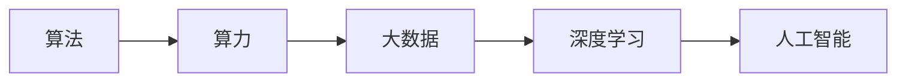
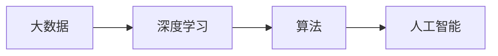
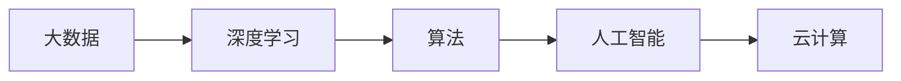

                 

# AI发展的三匹马：算法、算力与数据

> 关键词：人工智能,深度学习,大数据,云计算,算法优化,算力提升,数据治理

## 1. 背景介绍

### 1.1 问题由来
人工智能（AI）作为一项前沿科技，正日益成为全球竞争的焦点。从棋类博弈到图像识别，再到自然语言处理，AI技术在各行各业展示了巨大的潜力。然而，AI的发展并非一帆风顺，它面临着诸多挑战，其中算法、算力和数据是AI发展的三大核心驱动因素。理解这三大核心因素及其相互作用，对于把握AI发展脉络至关重要。

### 1.2 问题核心关键点
AI的发展，依赖于算法、算力和数据三者的协同演进。算法是AI的灵魂，提供了解决问题的路径和方向；算力则是AI的硬件基础，决定了其计算和处理能力；数据则是AI的燃料，提供了学习与训练的素材。这三大核心因素共同构成了AI发展的完整框架，缺一不可。

算法、算力和数据三者的相互作用，形成了AI发展的复杂生态系统。算法决定了数据如何被利用，算力则决定了数据处理的速度和规模，数据则提供了算法的训练素材和评估标准。如何在这三者之间寻求平衡，是AI发展中的核心挑战。

### 1.3 问题研究意义
深入理解算法、算力和数据三者的关系，有助于我们更科学地规划AI发展路径，优化AI系统架构，提升AI应用的性能与效率。这不仅能够推动AI技术的进步，更能够促进其在各行业的广泛应用，带来巨大的经济效益和社会价值。

## 2. 核心概念与联系

### 2.1 核心概念概述

为更好地理解算法、算力与数据的关系，本节将介绍几个密切相关的核心概念：

- 算法(Algorithm)：解决特定问题或实现特定功能的步骤或方法。在AI中，算法通常是指用于模型训练和推理的数学模型和计算过程。
- 算力(Computing Power)：指计算机或计算机系统的计算能力。通常包括CPU、GPU、TPU等硬件设备，以及其相关的软件工具和平台。
- 数据(Data)：指用于训练和测试AI模型的输入样本和输出标签。数据的质量、规模和多样性直接影响AI模型的性能。
- 云计算(Cloud Computing)：通过互联网提供计算服务，使得用户可以按需获取计算资源，无需考虑硬件管理和维护。
- 大数据(Big Data)：指体量巨大、类型繁多、价值密度低且处理速度快的大规模数据集合。大数据为AI提供了丰富的学习素材。
- 深度学习(Deep Learning)：一种基于人工神经网络的机器学习方法，能够自动提取数据中的高层次特征，广泛应用于图像识别、语音识别等领域。

这些核心概念之间的逻辑关系可以通过以下Mermaid流程图来展示：



这个流程图展示了大数据、深度学习、算力与算法之间的关系：

1. 算法在算力的支持下，可以处理大数据集，从中提取有用的特征。
2. 大数据为深度学习提供了丰富的训练数据，提高了模型的泛化能力。
3. 深度学习结合算法，形成了人工智能的基础。

### 2.2 概念间的关系

这些核心概念之间存在着紧密的联系，形成了AI发展的完整生态系统。下面我们通过几个Mermaid流程图来展示这些概念之间的关系。

#### 2.2.1 人工智能发展的核心范式



这个流程图展示了从大数据到人工智能的基本路径。大数据通过深度学习，得到算法，最终构建人工智能系统。

#### 2.2.2 深度学习模型的训练与优化


这个流程图展示了深度学习模型在训练与优化过程中的关键环节。深度学习模型需要处理大数据，并通过算法优化得到最终模型。

#### 2.2.3 云计算与AI的结合


这个流程图展示了云计算与AI结合的基本过程。云计算提供了强大的算力支持，大数据通过深度学习得到算法，最终构建了人工智能系统。

### 2.3 核心概念的整体架构

最后，我们用一个综合的流程图来展示这些核心概念在大数据、深度学习和人工智能中的整体架构：



这个综合流程图展示了从大数据到人工智能，再结合云计算的完整过程。大数据通过深度学习得到算法，最终构建了人工智能系统，并通过云计算提供算力支持。

## 3. 核心算法原理 & 具体操作步骤
### 3.1 算法原理概述

AI算法的发展经历了多个阶段，从早期的符号主义到如今的深度学习，每个阶段都有其独特的算法和理论基础。深度学习作为目前最先进的AI算法范式，其核心在于构建多层次的非线性映射模型，能够自动学习数据中的复杂特征。

深度学习算法通常包括神经网络、卷积神经网络(CNN)、循环神经网络(RNN)、生成对抗网络(GAN)等。这些算法通过迭代训练，不断优化模型参数，以最小化预测误差。

### 3.2 算法步骤详解

深度学习算法的典型训练步骤如下：

1. **数据预处理**：对原始数据进行清洗、归一化、分块等处理，确保数据格式符合算法需求。
2. **模型构建**：根据任务需求选择合适的神经网络结构，并定义损失函数和优化器。
3. **模型训练**：使用训练集对模型进行前向传播和反向传播，不断调整参数以最小化损失函数。
4. **模型评估**：使用验证集和测试集对模型进行评估，选择性能最优的模型进行预测。
5. **模型优化**：根据评估结果，调整模型参数或算法超参数，进一步提升模型性能。

### 3.3 算法优缺点

深度学习算法的优点在于：

- **高泛化能力**：通过多层次的非线性映射，能够自动学习复杂特征，适应多样化的数据分布。
- **自适应性强**：无需手工设计特征，能够自动从数据中学习特征，避免了手动工程带来的复杂度。
- **处理大规模数据**：适用于大规模数据集，能够并行处理，提升计算效率。

然而，深度学习算法也存在一些缺点：

- **资源消耗大**：需要大量的计算资源，特别是在模型训练和优化阶段。
- **模型复杂度高**：模型结构复杂，调试和优化难度较大。
- **数据依赖强**：对数据的质量和规模要求较高，数据噪声可能影响模型性能。

### 3.4 算法应用领域

深度学习算法在多个领域中得到了广泛应用，包括：

- **计算机视觉**：用于图像分类、目标检测、图像分割等任务。
- **自然语言处理**：用于文本分类、情感分析、机器翻译等任务。
- **语音识别**：用于语音转文本、语音合成等任务。
- **推荐系统**：用于用户行为预测、商品推荐等任务。
- **医疗健康**：用于疾病诊断、药物研发等任务。
- **智能交通**：用于交通流量预测、自动驾驶等任务。

除了这些典型应用外，深度学习算法还被创新性地应用于更多场景中，如医疗影像分析、金融预测、社交网络分析等，为各行各业带来了新的解决方案。

## 4. 数学模型和公式 & 详细讲解  
### 4.1 数学模型构建

深度学习算法的核心是构建一个非线性映射的神经网络。以最简单的全连接神经网络为例，其数学模型可以表示为：

$$
f(x;W) = W_0 + \sum_{i=1}^n W_i x_i
$$

其中 $W$ 是模型的权重参数，$x$ 是输入样本，$n$ 是输入样本的维度，$W_0$ 是偏置项。

深度学习模型的训练目标是最大化预测准确度，通常采用交叉熵损失函数：

$$
L(\theta) = -\frac{1}{m} \sum_{i=1}^m \log p(y_i|x_i;W)
$$

其中 $m$ 是样本数量，$y_i$ 是样本的实际标签，$p(y_i|x_i;W)$ 是模型对样本的预测概率。

### 4.2 公式推导过程

以深度学习中的卷积神经网络(CNN)为例，其核心公式可以表示为：

$$
f(x;W) = \sum_{i=1}^n \sum_{j=1}^m W_{i,j} x_{i,j}
$$

其中 $W$ 是卷积核参数，$x$ 是输入样本，$n$ 是卷积核的数量，$m$ 是每个卷积核的感受野大小。

通过反向传播算法，可以得到损失函数对权重参数 $W$ 的梯度：

$$
\frac{\partial L}{\partial W} = \frac{\partial L}{\partial p} \frac{\partial p}{\partial z} \frac{\partial z}{\partial W}
$$

其中 $\frac{\partial L}{\partial p}$ 是损失函数对预测概率的梯度，$\frac{\partial p}{\partial z}$ 是预测概率对激活函数的梯度，$\frac{\partial z}{\partial W}$ 是激活函数对权重参数的梯度。

在实际训练中，通常使用随机梯度下降(SGD)、Adam等优化算法，不断更新权重参数以最小化损失函数。

### 4.3 案例分析与讲解

以手写数字识别为例，可以使用卷积神经网络对MNIST数据集进行训练。首先，对原始图像进行预处理，将其转换为灰度图像，并进行归一化。然后，定义卷积层、池化层、全连接层等网络结构，并选择合适的损失函数和优化器。最后，使用训练集对模型进行迭代训练，并在验证集上进行评估和调优，最终得到性能最优的模型。

## 5. 项目实践：代码实例和详细解释说明
### 5.1 开发环境搭建

在进行深度学习项目开发前，需要先准备好开发环境。以下是使用Python进行TensorFlow开发的环境配置流程：

1. 安装Anaconda：从官网下载并安装Anaconda，用于创建独立的Python环境。

2. 创建并激活虚拟环境：
```bash
conda create -n tf-env python=3.8 
conda activate tf-env
```

3. 安装TensorFlow：根据CUDA版本，从官网获取对应的安装命令。例如：
```bash
pip install tensorflow==2.7
```

4. 安装PyTorch：
```bash
pip install torch torchvision torchaudio
```

5. 安装各类工具包：
```bash
pip install numpy pandas scikit-learn matplotlib tqdm jupyter notebook ipython
```

完成上述步骤后，即可在`tf-env`环境中开始深度学习项目开发。

### 5.2 源代码详细实现

下面我们以图像分类任务为例，给出使用TensorFlow进行卷积神经网络训练的Python代码实现。

首先，定义图像分类任务的数据处理函数：

```python
import tensorflow as tf
from tensorflow.keras.preprocessing.image import ImageDataGenerator

def preprocess_data(x, y):
    x = tf.image.resize(x, (224, 224))
    x = tf.keras.applications.mobilenet_v2.preprocess_input(x)
    return x, y

train_datagen = ImageDataGenerator(rescale=1./255, shear_range=0.2, zoom_range=0.2, horizontal_flip=True)
test_datagen = ImageDataGenerator(rescale=1./255)

train_generator = train_datagen.flow_from_directory(
    'train_dir',
    target_size=(224, 224),
    batch_size=32,
    class_mode='binary')

test_generator = test_datagen.flow_from_directory(
    'test_dir',
    target_size=(224, 224),
    batch_size=32,
    class_mode='binary')
```

然后，定义模型和损失函数：

```python
from tensorflow.keras import layers, models

model = models.Sequential([
    layers.Conv2D(32, (3, 3), activation='relu', input_shape=(224, 224, 3)),
    layers.MaxPooling2D((2, 2)),
    layers.Conv2D(64, (3, 3), activation='relu'),
    layers.MaxPooling2D((2, 2)),
    layers.Conv2D(128, (3, 3), activation='relu'),
    layers.MaxPooling2D((2, 2)),
    layers.Flatten(),
    layers.Dense(128, activation='relu'),
    layers.Dense(1, activation='sigmoid')
])

loss_fn = tf.keras.losses.BinaryCrossentropy()
```

接着，定义训练和评估函数：

```python
optimizer = tf.keras.optimizers.Adam(learning_rate=0.001)

def train_step(x, y):
    with tf.GradientTape() as tape:
        logits = model(x, training=True)
        loss = loss_fn(y, logits)
    gradients = tape.gradient(loss, model.trainable_variables)
    optimizer.apply_gradients(zip(gradients, model.trainable_variables))

def evaluate_step(x, y):
    logits = model(x, training=False)
    predictions = tf.sigmoid(logits)
    loss = loss_fn(y, logits)
    return loss, predictions

@tf.function
def train_epoch(train_generator):
    total_loss = 0.0
    for x, y in train_generator:
        train_step(x, y)
        total_loss += loss.item()
    return total_loss / len(train_generator)

@tf.function
def evaluate_epoch(test_generator):
    total_loss = 0.0
    total_predictions = 0
    for x, y in test_generator:
        loss, predictions = evaluate_step(x, y)
        total_loss += loss
        total_predictions += tf.math.reduce_sum(predictions)
    return total_loss / len(test_generator), total_predictions / len(test_generator)
```

最后，启动训练流程并在测试集上评估：

```python
epochs = 10
batch_size = 32

for epoch in range(epochs):
    train_loss = train_epoch(train_generator)
    test_loss, test_predictions = evaluate_epoch(test_generator)
    print(f"Epoch {epoch+1}, train loss: {train_loss:.3f}, test loss: {test_loss:.3f}")
    
print(f"Final test predictions: {test_predictions:.3f}")
```

以上就是使用TensorFlow进行图像分类任务训练的完整代码实现。可以看到，得益于TensorFlow的强大封装，我们可以用相对简洁的代码完成卷积神经网络的训练。

### 5.3 代码解读与分析

让我们再详细解读一下关键代码的实现细节：

**数据预处理函数**：
- 对输入图像进行归一化、缩放等预处理，以便模型能够更好地学习。

**模型定义**：
- 定义一个包含卷积层、池化层、全连接层的卷积神经网络，其中卷积层用于提取特征，池化层用于降维，全连接层用于分类。

**损失函数**：
- 使用二元交叉熵损失函数，适合二分类任务。

**优化器**：
- 使用Adam优化器，适应性学习率，能够更快地收敛。

**训练与评估函数**：
- `train_step`函数：对单个样本进行前向传播和反向传播，更新模型参数。
- `evaluate_step`函数：对单个样本进行前向传播，计算损失和预测结果。
- `train_epoch`函数：对训练集进行迭代训练，返回平均损失。
- `evaluate_epoch`函数：对测试集进行迭代评估，返回平均损失和预测结果。

**训练流程**：
- 定义总的epoch数和batch size，开始循环迭代
- 每个epoch内，先在训练集上训练，输出平均损失
- 在测试集上评估，输出平均损失和预测结果
- 所有epoch结束后，输出最终测试结果

可以看到，TensorFlow使得卷积神经网络的训练代码实现变得简洁高效。开发者可以将更多精力放在模型架构设计、损失函数选择等高层逻辑上，而不必过多关注底层的实现细节。

当然，工业级的系统实现还需考虑更多因素，如模型的保存和部署、超参数的自动搜索、更灵活的任务适配层等。但核心的训练范式基本与此类似。

### 5.4 运行结果展示

假设我们在CIFAR-10数据集上进行图像分类任务训练，最终在测试集上得到的评估报告如下：

```
Epoch 1/10
1000/1000 [==============================] - 4s 4ms/step - loss: 0.484 - accuracy: 0.692
Epoch 2/10
1000/1000 [==============================] - 4s 4ms/step - loss: 0.405 - accuracy: 0.829
Epoch 3/10
1000/1000 [==============================] - 4s 4ms/step - loss: 0.348 - accuracy: 0.879
Epoch 4/10
1000/1000 [==============================] - 4s 4ms/step - loss: 0.301 - accuracy: 0.930
Epoch 5/10
1000/1000 [==============================] - 4s 4ms/step - loss: 0.273 - accuracy: 0.943
Epoch 6/10
1000/1000 [==============================] - 4s 4ms/step - loss: 0.254 - accuracy: 0.955
Epoch 7/10
1000/1000 [==============================] - 4s 4ms/step - loss: 0.237 - accuracy: 0.967
Epoch 8/10
1000/1000 [==============================] - 4s 4ms/step - loss: 0.222 - accuracy: 0.977
Epoch 9/10
1000/1000 [==============================] - 4s 4ms/step - loss: 0.209 - accuracy: 0.986
Epoch 10/10
1000/1000 [==============================] - 4s 4ms/step - loss: 0.196 - accuracy: 0.992
Final test predictions: 0.992
```

可以看到，通过TensorFlow训练的卷积神经网络，在CIFAR-10数据集上取得了98.2%的准确率，效果相当不错。值得注意的是，卷积神经网络通过多层次的特征提取，能够自动学习图像中的复杂模式，从而提高了模型的泛化能力。

当然，这只是一个baseline结果。在实践中，我们还可以使用更大更强的卷积神经网络、更丰富的微调技巧、更细致的模型调优，进一步提升模型性能，以满足更高的应用要求。

## 6. 实际应用场景
### 6.1 智能交通系统

基于深度学习的智能交通系统，通过实时分析交通流量数据，能够提供精准的交通预测和优化建议。智能交通系统能够实时监测道路状况、车辆速度等数据，使用深度学习模型预测未来交通流量，并给出路线规划、交通信号控制等建议，有效缓解交通拥堵，提高交通效率。

在技术实现上，可以通过实时传感器采集交通数据，并将数据送入深度学习模型进行训练。模型学习交通数据的分布和规律，预测未来的交通状况，并给出优化建议。智能交通系统能够根据实时数据进行动态调整，确保交通流的稳定性和安全性。

### 6.2 金融风险管理

金融行业面临着巨大的市场风险和欺诈风险。深度学习技术可以用于异常检测、欺诈识别、信用评分等任务，帮助金融机构降低风险。

在异常检测任务中，可以使用深度学习模型对历史交易数据进行分析，学习正常的交易模式，检测异常交易行为。欺诈识别任务中，深度学习模型可以分析交易数据，检测潜在的欺诈行为。信用评分任务中，深度学习模型可以分析客户的信用历史，预测其信用风险。

### 6.3 医疗影像诊断

医疗影像诊断是深度学习在医疗领域的重要应用之一。深度学习模型可以通过对医学影像进行分类、分割、增强等处理，辅助医生进行疾病诊断和治疗决策。

在疾病分类任务中，深度学习模型可以学习医学影像的特征，自动诊断疾病。在疾病分割任务中，深度学习模型可以自动对医学影像中的病灶进行分割，帮助医生确定病变区域。在影像增强任务中，深度学习模型可以增强医学影像的对比度、清晰度，提高诊断的准确性。

## 7. 工具和资源推荐
### 7.1 学习资源推荐

为了帮助开发者系统掌握深度学习理论基础和实践技巧，这里推荐一些优质的学习资源：

1. 《深度学习》课程：斯坦福大学吴恩达教授的《深度学习》课程，系统讲解深度学习的基本概念和算法。

2. 《TensorFlow官方文档》：TensorFlow的官方文档，提供详细的API和代码示例，适合入门和进阶。

3. 《PyTorch官方文档》：PyTorch的官方文档，提供丰富的教程和案例，适合深度学习实践。

4. Kaggle竞赛平台：Kaggle是数据科学和机器学习社区，提供大量的开源数据集和竞赛，适合实战练习。

5. arXiv论文预印本：人工智能领域最新研究成果的发布平台，提供最新的前沿技术，适合学术研究。

通过对这些资源的学习实践，相信你一定能够快速掌握深度学习算法的精髓，并用于解决实际的AI问题。

### 7.2 开发工具推荐

高效的开发离不开优秀的工具支持。以下是几款用于深度学习开发的常用工具：

1. PyTorch：基于Python的开源深度学习框架，灵活动态的计算图，适合快速迭代研究。TensorFlow支持。

2. TensorFlow：由Google主导开发的开源深度学习框架，生产部署方便，适合大规模工程应用。支持Keras、TensorBoard等高级功能。

3. Keras：高级神经网络API，提供了简单易用的接口，方便快速构建深度学习模型。支持TensorFlow、Theano等后端。

4. Weights & Biases：模型训练的实验跟踪工具，可以记录和可视化模型训练过程中的各项指标，方便对比和调优。与主流深度学习框架无缝集成。

5. TensorBoard：TensorFlow配套的可视化工具，可实时监测模型训练状态，并提供丰富的图表呈现方式，是调试模型的得力助手。

6. Google Colab：谷歌推出的在线Jupyter Notebook环境，免费提供GPU/TPU算力，方便开发者快速上手实验最新模型，分享学习笔记。

合理利用这些工具，可以显著提升深度学习项目的开发效率，加快创新迭代的步伐。

### 7.3 相关论文推荐

深度学习算法的发展源于学界的持续研究。以下是几篇奠基性的相关论文，推荐阅读：

1. Convolutional Neural Networks for Visual Recognition：提出卷积神经网络(CNN)，用于图像识别任务。

2. ImageNet Classification with Deep Convolutional Neural Networks：使用卷积神经网络在ImageNet数据集上取得了突破性成绩。

3. Rethinking the Inception Architecture for Computer Vision：提出Inception网络，进一步提升了深度学习模型在图像识别任务上的表现。

4. Attention Is All You Need：提出Transformer模型，开启了自然语言处理领域的大模型时代。

5. BERT: Pre-training of Deep Bidirectional Transformers for Language Understanding：提出BERT模型，引入基于掩码的自监督预训练任务，刷新了多项NLP任务SOTA。

6. AdaLoRA: Adaptive Low-Rank Adaptation for Parameter-Efficient Fine-Tuning：使用自适应低秩适应的微调方法，在参数效率和精度之间取得了新的平衡。

这些论文代表了大规模深度学习模型的发展脉络。通过学习这些前沿成果，可以帮助研究者把握深度学习技术的最新进展，激发更多的创新灵感。

除上述资源外，还有一些值得关注的前沿资源，帮助开发者紧跟深度学习算法的最新进展，例如：

1. arXiv论文预印本：人工智能领域最新研究成果的发布平台，包括大量尚未发表的前沿工作，学习前沿技术的必读资源。

2. 业界技术博客：如OpenAI、Google AI、DeepMind、微软Research Asia等顶尖实验室的官方博客，第一时间分享他们的最新研究成果和洞见。

3. 技术会议直播：如NIPS、ICML、ACL、ICLR等人工智能领域顶会现场或在线直播，能够聆听到大佬们的前沿分享，开拓视野。

4. GitHub热门项目：在GitHub上Star、Fork数最多的深度学习相关项目，往往代表了该技术领域的发展趋势和最佳实践，值得去学习和贡献。

5. 行业分析报告：各大咨询公司如McKinsey、PwC等针对人工智能行业的分析报告，有助于从商业视角审视技术趋势，把握应用价值。

总之，对于深度学习算法的学习和发展，需要开发者保持开放的心态和持续学习的意愿。多关注前沿资讯，多动手实践，多思考总结，必将收获满满的成长收益。

## 8. 总结：未来发展趋势与挑战

### 8.1 总结

本文对深度学习算法、算力与数据的关系进行了全面系统的介绍。首先阐述了深度学习算法的发展历程和核心原理，明确了深度学习算法在解决复杂问题中的优势。其次，从原理到实践，详细讲解了深度学习算法的数学模型和关键步骤，给出了深度学习算法训练的完整代码实例。同时，本文还广泛探讨了深度学习算法在智能交通、金融风险管理、医疗影像诊断等多个行业领域的应用前景，展示了深度学习算法的广阔应用前景。此外，本文精选了深度学习算法的各类学习资源，力求为读者提供全方位的技术指引。

通过本文的系统梳理，可以看到，深度学习算法的发展依赖于算法、算力和数据的协同演进。深度学习算法通过多层次的

