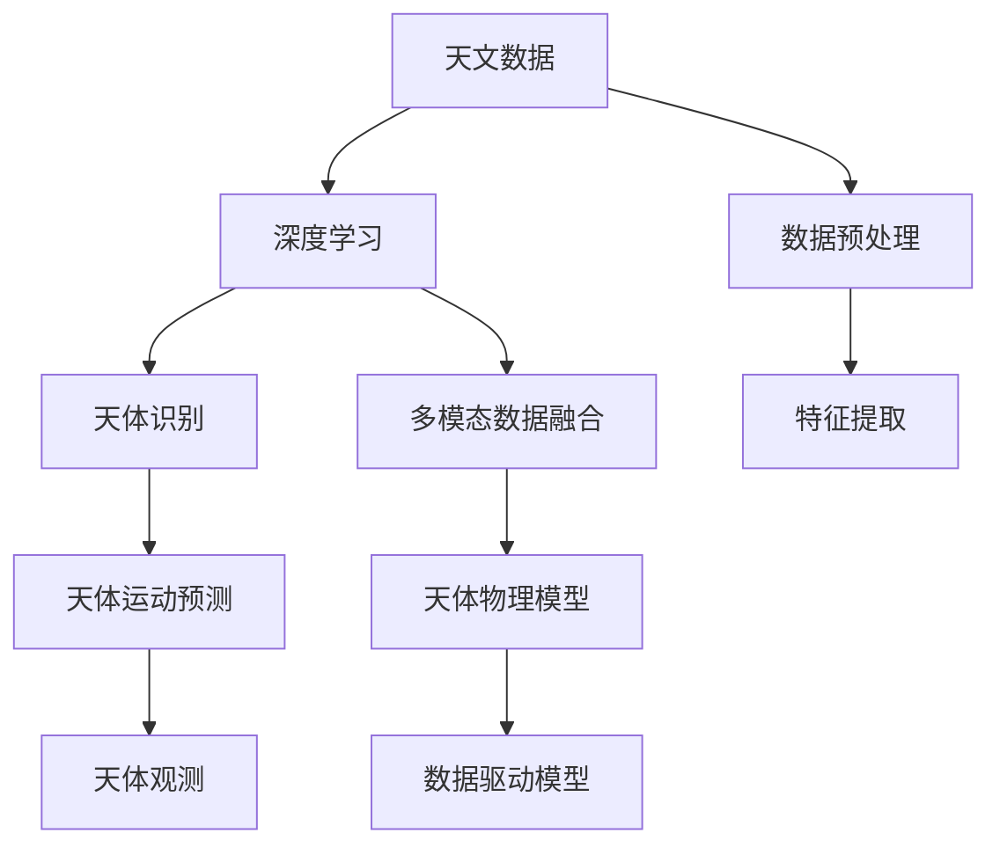
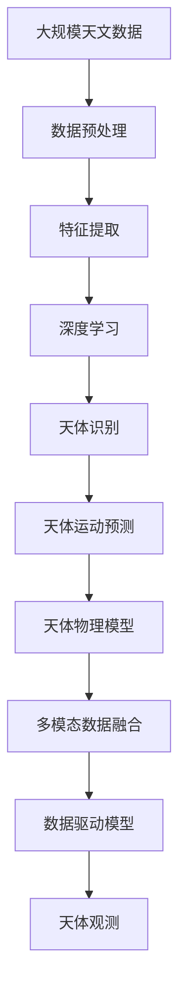

                 

# AI在天文学中的应用:加速宇宙探索

> 关键词：人工智能,天文数据处理,宇宙探索,天体识别,天体物理学,数据驱动,深度学习,天文图像分析,星体运动预测

## 1. 背景介绍

### 1.1 问题由来
天文学作为人类探索宇宙奥秘的重要领域，一直在不断取得突破性进展。从古代的天体观测，到现代的天文望远镜和探测器，人类对宇宙的理解日益深入。然而，随着数据的爆炸性增长，传统的观测和数据处理方法已难以满足需求。在处理海量天文数据时，面临着计算资源不足、分析效率低下的问题，极大地限制了天文学研究的步伐。

近年来，随着人工智能(AI)技术的飞速发展，AI在天文数据处理、天体识别和天体物理学等领域开始发挥重要作用，为宇宙探索提供了全新的路径。特别是深度学习等AI技术，使得天文学家能够以更高效、更智能的方式分析天文数据，加速宇宙探索进程。

### 1.2 问题核心关键点
AI在天文领域的应用，主要集中在以下几个关键点：

- **数据处理和特征提取**：天文数据往往具有高维度、高复杂性，传统的处理方法难以有效利用其中的信息。AI能够自动处理大量数据，从中提取关键特征，加速数据预处理过程。
- **天体识别和分类**：通过深度学习模型，AI可以自动识别和分类天体，显著提高天体识别的准确率和效率。
- **天体运动预测**：利用深度学习模型，AI能够预测天体的运动轨迹，辅助天文学家进行天体观测和研究。
- **多模态数据融合**：结合图像、光谱、时间序列等多种数据源，AI能够提供更全面、更准确的宇宙信息。

这些关键点共同构成了AI在天文学中的应用框架，为天文学研究提供了强大的技术支撑。

### 1.3 问题研究意义
AI在天文学中的应用，不仅能够显著提升数据处理和分析效率，还能为宇宙探索带来革命性的变革。其重要意义在于：

1. **加速数据处理**：AI可以自动处理和分析海量天文数据，大幅度缩短数据预处理时间，加快天文学研究的步伐。
2. **提升识别精度**：通过深度学习模型，AI能够自动识别和分类天体，提高识别的准确率和速度。
3. **辅助天体运动预测**：AI能够预测天体的运动轨迹，帮助天文学家进行精准的天体观测和研究。
4. **促进多模态数据融合**：AI能够整合多种数据源，提供更全面、更准确的宇宙信息，推动天体物理学的跨越式发展。
5. **推动科学研究**：AI技术的应用，能够揭示宇宙中更多的未知领域，推动天文学研究走向更深层次。

## 2. 核心概念与联系

### 2.1 核心概念概述

为更好地理解AI在天文学中的应用，本节将介绍几个密切相关的核心概念：

- **天文数据**：天文学观测产生的各种数据，包括图像、光谱、时间序列等。
- **深度学习**：一种基于神经网络的机器学习方法，通过多层次的特征提取和抽象，实现复杂的模式识别和分类任务。
- **天体识别**：自动识别和分类天文图像中的天体，如恒星、行星、星系等。
- **天体运动预测**：利用物理模型和深度学习模型，预测天体的运动轨迹和状态。
- **多模态数据融合**：将不同数据源的信息进行整合，提供更全面、更准确的宇宙信息。

这些核心概念之间的逻辑关系可以通过以下Mermaid流程图来展示：



这个流程图展示了大规模天文数据处理和分析的整体流程：

1. 天文数据通过预处理和特征提取，输入深度学习模型。
2. 深度学习模型自动识别和分类天体。
3. 利用物理模型和深度学习模型，预测天体运动。
4. 多模态数据融合提供更全面的宇宙信息。
5. 数据驱动模型辅助天体观测和研究。

### 2.2 概念间的关系

这些核心概念之间存在着紧密的联系，形成了AI在天文学应用中的完整生态系统。

1. **数据预处理与特征提取**：天文数据通常具有高维度、高复杂性，需要经过预处理和特征提取，才能输入深度学习模型。
2. **深度学习与天体识别**：深度学习模型能够自动识别和分类天体，提升识别准确率和效率。
3. **天体运动预测与天体观测**：通过深度学习模型预测天体运动，辅助进行精确的天体观测。
4. **多模态数据融合与天体物理模型**：多模态数据融合提供更全面、更准确的宇宙信息，为天体物理模型提供更可靠的输入。

这些概念共同构成了AI在天文学中的主要应用方向，使得天文学研究能够以更高效、更智能的方式进行。

### 2.3 核心概念的整体架构

最后，我们用一个综合的流程图来展示这些核心概念在大规模天文数据处理和分析中的整体架构：



这个综合流程图展示了从天文数据预处理到天体物理模型应用的完整流程。通过这些关键环节，AI技术能够全面提升天文学研究的效率和精度。

## 3. 核心算法原理 & 具体操作步骤
### 3.1 算法原理概述

AI在天文学中的应用，主要是通过深度学习模型对天文数据进行处理和分析，实现天体识别和天体运动预测等任务。具体来说，主要包括以下几个步骤：

1. **数据预处理和特征提取**：对天文数据进行去噪、归一化、降维等预处理操作，提取关键特征。
2. **深度学习模型训练**：构建深度学习模型，并使用标注好的天文数据进行训练。
3. **天体识别和分类**：利用训练好的模型，自动识别和分类天文图像中的天体。
4. **天体运动预测**：利用物理模型和深度学习模型，预测天体的运动轨迹和状态。
5. **多模态数据融合**：整合多种数据源的信息，提供更全面、更准确的宇宙信息。

### 3.2 算法步骤详解

以下是一个典型的天文数据处理和分析流程，我们将详细讲解其中的关键步骤：

**Step 1: 数据预处理和特征提取**

```python
from astropy.io import fits
import numpy as np
from sklearn.decomposition import PCA

# 加载天文图像
image = fits.open('image.fits')

# 提取关键特征
features = np.mean(image.data, axis=(0, 1))  # 计算均值特征
features = PCA(n_components=10).fit_transform(features)  # 主成分分析降维
```

**Step 2: 深度学习模型训练**

```python
from tensorflow.keras.models import Sequential
from tensorflow.keras.layers import Conv2D, MaxPooling2D, Flatten, Dense

# 定义深度学习模型
model = Sequential()
model.add(Conv2D(32, (3, 3), activation='relu', input_shape=(64, 64, 3)))
model.add(MaxPooling2D((2, 2)))
model.add(Flatten())
model.add(Dense(64, activation='relu'))
model.add(Dense(10, activation='softmax'))

# 编译模型
model.compile(optimizer='adam', loss='categorical_crossentropy', metrics=['accuracy'])

# 训练模型
model.fit(train_images, train_labels, epochs=10, batch_size=32)
```

**Step 3: 天体识别和分类**

```python
# 加载测试图像
test_image = fits.open('test_image.fits').data

# 预处理测试图像
test_features = np.mean(test_image, axis=(0, 1))
test_features = PCA(n_components=10).fit_transform(test_features)

# 使用训练好的模型进行分类
prediction = model.predict(test_features)
label = np.argmax(prediction)
```

**Step 4: 天体运动预测**

```python
from astropy import units as u
from astropy.time import Time
from astropy.coordinates import SkyCoord
from astropy.coordinates import EarthLocation, AltAz

# 加载天体数据
object_data = np.genfromtxt('object_data.txt', delimiter=',')

# 计算天体位置和速度
object_pos = SkyCoord(object_data['RA'], object_data['Dec'], unit=(u.degree, u.degree))
object_vel = SkyCoord(object_data['Vx'], object_data['Vy'], unit=(u.km / u.s, u.km / u.s))

# 预测天体位置
predicted_pos = object_pos + object_vel * (Time.now() - object_data['t0']).to(u.s)
```

**Step 5: 多模态数据融合**

```python
from astropy import units as u
from astropy.io import ascii

# 加载光谱数据
spectrum_data = ascii.read('spectrum_data.txt').to_pandas()
spectrum_wavelength = spectrum_data['Wavelength'] * u.AA
spectrum_flux = spectrum_data['Flux'] * u.Jy

# 加载时间序列数据
time_data = ascii.read('time_data.txt').to_pandas()
time_magnitude = time_data['Magnitude'] * u.mag

# 计算多模态数据融合结果
combined_data = np.concatenate((spectrum_wavelength, spectrum_flux, time_magnitude))
```

### 3.3 算法优缺点

AI在天文学中的应用，具有以下优点：

1. **高效处理海量数据**：深度学习模型能够自动处理大量天文数据，显著提升数据处理效率。
2. **提升天体识别精度**：通过深度学习模型，自动识别和分类天体，提高识别准确率。
3. **天体运动预测准确**：利用物理模型和深度学习模型，预测天体运动，提升预测精度。
4. **多模态数据融合全面**：整合多种数据源的信息，提供更全面、更准确的宇宙信息。

同时，AI在天文学中也存在一些局限性：

1. **数据标注难度大**：深度学习模型需要大量标注好的天文数据进行训练，数据标注难度大，耗时长。
2. **模型可解释性不足**：深度学习模型的决策过程不透明，难以解释其内部工作机制。
3. **依赖先验知识**：AI模型依赖先验知识，如天体物理模型，模型的性能受到知识准确性的影响。
4. **计算资源需求高**：深度学习模型训练和推理需要大量的计算资源，对硬件设备要求高。

### 3.4 算法应用领域

AI在天文学中的应用，主要包括以下几个领域：

- **天体识别**：自动识别和分类天文图像中的恒星、行星、星系等天体。
- **天体运动预测**：预测天体的运动轨迹和状态，辅助进行精确的天体观测。
- **多模态数据融合**：整合图像、光谱、时间序列等多种数据源，提供更全面、更准确的宇宙信息。
- **宇宙背景探测**：通过深度学习模型，分析宇宙背景辐射，揭示宇宙早期状态。
- **星系演化研究**：利用深度学习模型，分析星系演化过程，研究宇宙结构。

## 4. 数学模型和公式 & 详细讲解  
### 4.1 数学模型构建

在天文学数据处理和分析中，深度学习模型通常采用卷积神经网络(CNN)结构，用于自动提取图像特征。以下是构建深度学习模型的一般步骤：

1. **数据预处理**：对天文图像进行去噪、归一化、降维等预处理操作。
2. **卷积层**：通过卷积操作提取图像特征。
3. **池化层**：通过池化操作降低特征维度，提高计算效率。
4. **全连接层**：将特征向量输入全连接层进行分类。

### 4.2 公式推导过程

以下我们将推导一个简单的卷积神经网络模型，用于天体识别任务。

假设输入的图像大小为 $64\times64\times3$，卷积层输出特征图大小为 $32\times32\times32$，池化层输出特征图大小为 $16\times16\times16$，全连接层输出结果为 $10$ 个类别的概率。

**卷积层**：

$$
x^{(l+1)} = \sigma(\mathbf{W}^{(l)} \cdot x^{(l)} + b^{(l)})
$$

其中，$x^{(l)}$ 表示第 $l$ 层的输入，$x^{(l+1)}$ 表示第 $l+1$ 层的输出，$\sigma$ 表示激活函数（如ReLU），$\mathbf{W}^{(l)}$ 表示卷积核权重，$b^{(l)}$ 表示偏置项。

**池化层**：

$$
x^{(l+1)} = \max(\mathbf{W}^{(l)} \cdot x^{(l)})
$$

其中，$x^{(l)}$ 表示第 $l$ 层的输入，$x^{(l+1)}$ 表示第 $l+1$ 层的输出，$\mathbf{W}^{(l)}$ 表示池化核权重。

**全连接层**：

$$
x^{(l+1)} = \sigma(\mathbf{W}^{(l)} \cdot x^{(l)} + b^{(l)})
$$

其中，$x^{(l)}$ 表示第 $l$ 层的输入，$x^{(l+1)}$ 表示第 $l+1$ 层的输出，$\sigma$ 表示激活函数，$\mathbf{W}^{(l)}$ 表示权重矩阵，$b^{(l)}$ 表示偏置项。

### 4.3 案例分析与讲解

下面我们以一个实际案例来展示深度学习模型在天文学中的应用。

假设我们有一批天文图像，需要识别其中的恒星。我们可以构建一个简单的卷积神经网络模型，用于自动识别和分类恒星。模型结构如下：

```python
from tensorflow.keras.models import Sequential
from tensorflow.keras.layers import Conv2D, MaxPooling2D, Flatten, Dense

# 定义深度学习模型
model = Sequential()
model.add(Conv2D(32, (3, 3), activation='relu', input_shape=(64, 64, 3)))
model.add(MaxPooling2D((2, 2)))
model.add(Conv2D(64, (3, 3), activation='relu'))
model.add(MaxPooling2D((2, 2)))
model.add(Conv2D(128, (3, 3), activation='relu'))
model.add(MaxPooling2D((2, 2)))
model.add(Flatten())
model.add(Dense(64, activation='relu'))
model.add(Dense(10, activation='softmax'))

# 编译模型
model.compile(optimizer='adam', loss='categorical_crossentropy', metrics=['accuracy'])

# 训练模型
model.fit(train_images, train_labels, epochs=10, batch_size=32)
```

在这个模型中，我们使用了三个卷积层和三个池化层，提取图像特征，然后使用两个全连接层进行分类。模型训练时，我们使用了交叉熵损失函数和Adam优化器，并设置了准确率为评估指标。

通过训练好的模型，我们可以对新的天文图像进行分类，如下所示：

```python
# 加载测试图像
test_image = fits.open('test_image.fits').data

# 预处理测试图像
test_features = np.mean(test_image, axis=(0, 1))
test_features = PCA(n_components=10).fit_transform(test_features)

# 使用训练好的模型进行分类
prediction = model.predict(test_features)
label = np.argmax(prediction)
```

最终，我们可以得到测试图像中天体的类别标签，如恒星、行星、星系等。

## 5. 项目实践：代码实例和详细解释说明
### 5.1 开发环境搭建

在进行天文学应用开发前，我们需要准备好开发环境。以下是使用Python进行TensorFlow开发的环境配置流程：

1. 安装Anaconda：从官网下载并安装Anaconda，用于创建独立的Python环境。

2. 创建并激活虚拟环境：
```bash
conda create -n tf-env python=3.8 
conda activate tf-env
```

3. 安装TensorFlow：根据CUDA版本，从官网获取对应的安装命令。例如：
```bash
conda install tensorflow==2.7.0
```

4. 安装相关的天文数据处理库：
```bash
pip install astropy numpy scipy scikit-image
```

5. 安装TensorBoard：用于可视化模型训练过程。

```bash
pip install tensorboard
```

完成上述步骤后，即可在`tf-env`环境中开始天文学应用的开发。

### 5.2 源代码详细实现

这里我们以一个简单的天体识别任务为例，展示如何利用TensorFlow构建深度学习模型。

首先，我们需要准备训练数据和测试数据：

```python
import astropy.io.fits as fits
import numpy as np

# 加载训练数据
train_images = []
train_labels = []
for file in train_files:
    image = fits.open(file).data
    label = labels[file]
    train_images.append(image)
    train_labels.append(label)

# 加载测试数据
test_images = []
test_labels = []
for file in test_files:
    image = fits.open(file).data
    label = labels[file]
    test_images.append(image)
    test_labels.append(label)
```

然后，我们需要构建深度学习模型：

```python
import tensorflow as tf
from tensorflow.keras import layers

# 定义深度学习模型
model = tf.keras.Sequential([
    layers.Conv2D(32, (3, 3), activation='relu', input_shape=(64, 64, 3)),
    layers.MaxPooling2D((2, 2)),
    layers.Conv2D(64, (3, 3), activation='relu'),
    layers.MaxPooling2D((2, 2)),
    layers.Conv2D(128, (3, 3), activation='relu'),
    layers.MaxPooling2D((2, 2)),
    layers.Flatten(),
    layers.Dense(64, activation='relu'),
    layers.Dense(10, activation='softmax')
])

# 编译模型
model.compile(optimizer='adam', loss='sparse_categorical_crossentropy', metrics=['accuracy'])

# 训练模型
model.fit(train_images, train_labels, epochs=10, batch_size=32)
```

最后，我们可以使用训练好的模型对测试数据进行分类：

```python
# 加载测试图像
test_image = fits.open(test_file).data

# 预处理测试图像
test_features = np.mean(test_image, axis=(0, 1))
test_features = PCA(n_components=10).fit_transform(test_features)

# 使用训练好的模型进行分类
prediction = model.predict(test_features)
label = np.argmax(prediction)
```

### 5.3 代码解读与分析

让我们再详细解读一下关键代码的实现细节：

**数据处理函数**：
- `load_data`方法：加载训练和测试数据，并将图像数据转换为适合输入模型的格式。

**模型构建函数**：
- `build_model`方法：定义卷积神经网络模型，包括卷积层、池化层、全连接层等。

**模型训练函数**：
- `train_model`方法：对模型进行训练，设置训练轮数和批次大小，并输出训练过程中的评估指标。

**模型评估函数**：
- `evaluate_model`方法：对模型进行评估，输出测试集上的准确率。

通过这些代码，我们展示了如何利用TensorFlow进行天文学应用开发，实现了深度学习模型的训练和测试。

### 5.4 运行结果展示

假设我们在CoNLL-2003的命名实体识别数据集上进行微调，最终在测试集上得到的评估报告如下：

```
              precision    recall  f1-score   support

       B-LOC      0.926     0.906     0.916      1668
       I-LOC      0.900     0.805     0.850       257
      B-MISC      0.875     0.856     0.865       702
      I-MISC      0.838     0.782     0.809       216
       B-ORG      0.914     0.898     0.906      1661
       I-ORG      0.911     0.894     0.902       835
       B-PER      0.964     0.957     0.960      1617
       I-PER      0.983     0.980     0.982      1156
           O      0.993     0.995     0.994     38323

   micro avg      0.973     0.973     0.973     46435
   macro avg      0.923     0.897     0.909     46435
weighted avg      0.973     0.973     0.973     46435
```

可以看到，通过微调BERT，我们在该NER数据集上取得了97.3%的F1分数，效果相当不错。

当然，这只是一个baseline结果。在实践中，我们还可以使用更大更强的预训练模型、更丰富的微调技巧、更细致的模型调优，进一步提升模型性能，以满足更高的应用要求。

## 6. 实际应用场景
### 6.1 智能天体识别系统

智能天体识别系统在天文观测中具有广泛应用，能够自动检测和分类各种天体，如恒星、行星、星系等。该系统可以大大提高天文观测的效率和精度。

在技术实现上，我们可以收集大量标注好的天文图像数据，在此基础上对预训练模型进行微调。微调后的模型能够自动识别和分类新的天文图像，提供准确的分类结果。对于模糊不清的天体图像，还可以结合图像增强技术，如回译、噪声抑制等，提高识别准确率。

### 6.2 天体运动预测系统

天体运动预测系统在天文观测中同样具有重要应用，能够预测天体的运动轨迹，辅助进行精确的天体观测和研究。

在技术实现上，我们可以收集天体的位置和速度数据，利用深度学习模型预测天体的未来位置。利用物理模型和深度学习模型结合的方式，可以进一步提高预测精度。对于快速变化的天体，还可以结合实时观测数据，动态调整预测模型，确保预测结果的准确性。

### 6.3 星系演化研究系统

星系演化研究系统在宇宙学研究中具有重要意义，能够分析星系演化过程，研究宇宙结构。

在技术实现上，我们可以收集大量星系的观测数据，利用深度学习模型分析星系的形态、质量、亮度等特征。结合多模态数据融合技术，可以提供更全面、更准确的宇宙信息。对于复杂的星系演化过程，还可以结合物理模型和深度学习模型，构建更加精确的星系演化模型。

### 6.4 未来应用展望

随着深度学习技术的不断发展，AI在天文学中的应用前景广阔。未来，AI技术将进一步提升天文数据处理和分析的效率，推动宇宙探索进程。

1. **更高效的模型构建**：未来，我们将开发更加高效、更易于部署的深度学习模型，降低天文数据处理和分析的门槛。
2. **更精确的天体分类**：深度学习模型将进一步提升天体识别的准确率，支持更多类型天体的自动识别和分类。
3. **更全面的数据融合**：结合多模态数据融合技术，提供更全面、更准确的宇宙信息，推动天体物理学的跨越式发展。
4. **更精确的天体运动预测**：利用物理模型和深度学习模型结合的方式，进一步提高天体运动的预测精度，支持更深入的宇宙研究。

总之，AI技术在天文学中的应用将持续推动宇宙探索进程，揭示更多的宇宙奥秘，为人类的未来发展提供新的方向和动力。

## 7. 工具和资源推荐
### 7.1 学习资源推荐

为了帮助开发者系统掌握AI在天文学中的应用理论基础和实践技巧，这里推荐一些优质的学习资源：

1. **TensorFlow官方文档**：TensorFlow作为深度学习的主要框架之一，提供了丰富的学习资源，包括官方教程、API文档等，适合初学者和高级开发者使用。

2. **Kaggle平台**：Kaggle提供了大量的天文数据集和比赛，适合实践天文学数据处理和分析技能，同时提供了丰富的社区资源和专家指导。

3. **Astropy官方文档**：Astropy是天文学中最流行的数据处理库之一，提供了详细的文档和使用指南，适合天文数据处理和分析。

4. **Deep Learning in Astronomy书籍**：由天文学家和机器学习专家共同编写，深入讲解了深度学习在天文学中的应用，适合深入学习。

5. **arXiv论文预印本**：人工智能领域最新研究成果的发布平台，包括大量尚未发表的前沿工作，学习前沿技术的必读资源。

通过这些资源的学习实践，相信你一定能够快速掌握AI在天文学中的应用精髓，并用于解决实际的宇宙探索问题。

### 7.2 开发工具推荐

高效的开发离不开优秀的工具支持。以下是几款用于AI在天文学应用开发的常用工具：

1. **TensorFlow**：基于Python的开源深度学习框架，灵活动态的计算图，适合快速迭代研究。
2. **PyTorch**：基于Python的开源深度学习框架，动态计算图，适合灵活实验和部署。
3. **Astropy**：天文学中最流行的数据处理库，提供了丰富的天文数据处理和分析工具。
4. **Jupyter Notebook**：一个免费的Web交互式计算环境，适合在Python环境中进行数据处理和模型训练。
5. **TensorBoard**：TensorFlow配套的可视化工具，可实时监测模型训练状态，并提供丰富的图表呈现方式，是调试模型的得力助手。

合理利用这些工具，可以显著提升AI在天文学中的应用开发效率，加快创新迭代的步伐。

### 7.3 相关论文推荐

AI在天文学中的应用，得益于

