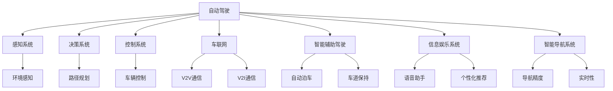
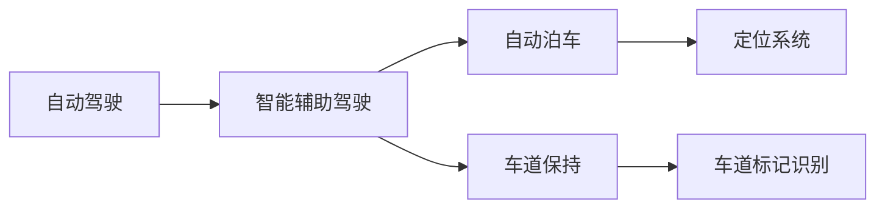
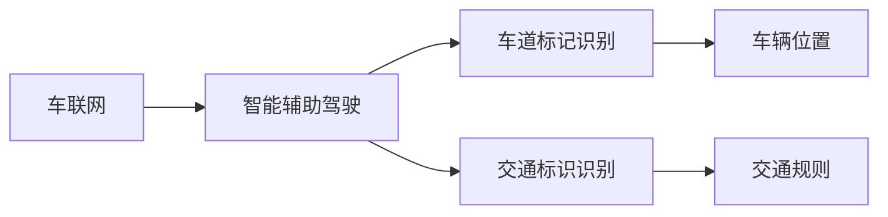
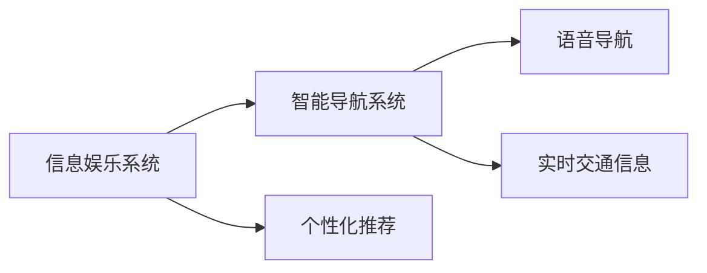

                 

# AI在智能汽车中的应用:提升驾驶体验

## 1. 背景介绍

随着人工智能技术的迅猛发展，智能汽车已经成为未来交通出行方式的显著趋势。智能汽车不仅能够实现高度自动化的驾驶功能，还可以在信息娱乐、导航、车联网等多个方面提供更优质的驾驶体验。AI技术在智能汽车中的应用，正逐步改变传统汽车的形态，提升驾驶的安全性、舒适性和便捷性。

### 1.1 问题由来

智能汽车的发展离不开AI技术的深度集成。无论是自动驾驶、车联网、智能辅助驾驶系统，还是信息娱乐系统，都广泛地应用了AI技术。然而，如何将AI技术有效地应用于智能汽车，提升驾驶体验，是当前智能汽车研发中的一个重要挑战。本博客将围绕AI在智能汽车中的应用，详细介绍其原理、方法和实践，并展望未来发展趋势。

### 1.2 问题核心关键点

AI在智能汽车中的应用主要集中在以下几个方面：

- **自动驾驶技术**：利用AI实现车辆自主感知、决策和控制，从而实现无人驾驶。
- **车联网**：通过AI实现车辆与车辆、车辆与基础设施之间的智能互联。
- **智能辅助驾驶系统**：借助AI技术提升驾驶辅助功能，如自动泊车、车道保持等。
- **信息娱乐系统**：利用AI技术实现智能语音助手、个性化推荐等功能。
- **智能导航系统**：利用AI提升导航精度和实时性，提升驾驶体验。

这些关键应用展示了AI在智能汽车中的重要价值，是未来智能汽车的核心竞争力。本文将重点关注自动驾驶和智能辅助驾驶系统的AI技术应用，探讨其原理、方法、应用场景及未来趋势。

### 1.3 问题研究意义

AI在智能汽车中的应用，对于提升驾驶安全性、便捷性和舒适性具有重要意义。具体来说，AI技术可以：

- **提高驾驶安全**：通过自动驾驶、智能导航等功能，减少人为驾驶错误，提高行车安全。
- **提升驾驶便捷性**：通过车联网、智能语音助手等功能，提高驾驶过程的舒适度和便捷性。
- **增强驾驶体验**：通过个性化推荐、信息娱乐等功能，提升驾驶过程中的娱乐性和互动性。

此外，AI在智能汽车中的应用，还能够推动汽车产业的智能化升级，促进自动驾驶技术的发展和普及，从而引领未来交通出行方式的变革。

## 2. 核心概念与联系

### 2.1 核心概念概述

为了更好地理解AI在智能汽车中的应用，本节将介绍几个关键核心概念：

- **自动驾驶**：指车辆通过AI技术实现自主感知、决策和控制，从而无需人工干预即可安全、稳定地行驶。
- **车联网**：指通过AI技术实现车辆与车辆、车辆与基础设施之间的智能互联，实现信息的实时交换和共享。
- **智能辅助驾驶系统**：指借助AI技术提升驾驶辅助功能，如自动泊车、车道保持等。
- **信息娱乐系统**：指利用AI技术实现智能语音助手、个性化推荐等功能，提升驾驶过程中的娱乐性和互动性。
- **智能导航系统**：指利用AI技术提升导航精度和实时性，增强驾驶过程中的导航体验。

这些核心概念之间的逻辑关系可以通过以下Mermaid流程图来展示：



这个流程图展示了AI在智能汽车中的应用逻辑：

1. 自动驾驶：包括感知系统、决策系统和控制系统，实现车辆自主行驶。
2. 车联网：通过车辆与车辆、车辆与基础设施之间的通信，实现信息的实时交换和共享。
3. 智能辅助驾驶：包括自动泊车、车道保持等功能，提升驾驶辅助能力。
4. 信息娱乐系统：包括语音助手、个性化推荐等功能，提升驾驶过程中的娱乐性和互动性。
5. 智能导航系统：包括导航精度和实时性提升，增强驾驶过程中的导航体验。

### 2.2 概念间的关系

这些核心概念之间存在着紧密的联系，构成了智能汽车的核心应用框架。下面通过几个Mermaid流程图来展示这些概念之间的关系。

#### 2.2.1 自动驾驶与智能辅助驾驶的关系



这个流程图展示了自动驾驶与智能辅助驾驶之间的联系。自动驾驶通过感知系统获取环境信息，并通过决策系统规划路径，控制系统执行操作。智能辅助驾驶通过自动泊车、车道保持等功能，进一步提升驾驶辅助功能。

#### 2.2.2 车联网与智能辅助驾驶的关系



这个流程图展示了车联网与智能辅助驾驶之间的联系。车联网通过车辆与基础设施之间的通信，获取实时交通信息和环境信息，提升智能辅助驾驶系统的精准度和安全性。

#### 2.2.3 信息娱乐系统与智能导航的关系



这个流程图展示了信息娱乐系统与智能导航系统之间的联系。信息娱乐系统通过语音助手和个性化推荐，提升驾驶过程中的娱乐性和互动性，同时，智能导航系统通过实时交通信息和语音导航，增强驾驶过程中的导航体验。

## 3. 核心算法原理 & 具体操作步骤

### 3.1 算法原理概述

AI在智能汽车中的应用，主要基于以下算法原理：

- **感知算法**：利用计算机视觉、雷达、激光雷达等传感器，实现环境感知，提取道路、车辆、行人等关键信息。
- **决策算法**：结合感知结果和地图信息，进行路径规划和行为决策，规划车辆行驶路径。
- **控制算法**：根据决策结果，控制车辆转向、加速、制动等行为，实现自动驾驶。
- **自然语言处理(NLP)**：利用NLP技术实现语音助手、个性化推荐等功能，提升信息娱乐系统的交互体验。
- **机器学习与深度学习**：利用机器学习和深度学习技术，优化感知、决策和控制算法，提升系统性能。

这些算法原理构成了AI在智能汽车中的核心技术基础，通过这些算法的深度集成，实现了智能汽车的各项功能。

### 3.2 算法步骤详解

AI在智能汽车中的应用，通常包括以下几个关键步骤：

**Step 1: 数据收集与预处理**

- 收集车辆传感器数据（如摄像头、雷达、激光雷达等）和外部数据（如地图、交通信号灯信息等）。
- 对数据进行清洗和标注，去除噪声和异常数据，确保数据的质量和可用性。
- 对数据进行预处理，如数据增强、归一化等，提升数据的表现力和模型的泛化能力。

**Step 2: 模型训练与优化**

- 选择合适的模型架构，如卷积神经网络（CNN）、循环神经网络（RNN）、Transformer等。
- 利用收集到的数据，训练模型，并使用验证集评估模型性能，调整超参数。
- 使用深度学习框架（如TensorFlow、PyTorch等）进行模型训练和优化。

**Step 3: 系统集成与部署**

- 将训练好的模型集成到智能汽车的控制系统中，进行系统的全面测试。
- 在车辆上部署模型，实现对车辆的控制和导航。
- 对系统进行优化和调整，确保系统的稳定性和可靠性。

**Step 4: 用户交互与反馈**

- 提供用户友好的界面和交互方式，如语音助手、触摸屏等，提升用户体验。
- 收集用户反馈和评价，进行系统的持续优化和改进。

### 3.3 算法优缺点

AI在智能汽车中的应用，具有以下优点：

- **提升驾驶安全**：通过自动驾驶和智能导航，减少人为驾驶错误，提高行车安全。
- **提升驾驶便捷性**：通过车联网和智能语音助手，提升驾驶过程的舒适度和便捷性。
- **提升驾驶体验**：通过个性化推荐和信息娱乐系统，提升驾驶过程中的娱乐性和互动性。

然而，AI在智能汽车中的应用也存在一些缺点：

- **成本较高**：AI技术的集成和部署需要较高的成本，增加了智能汽车的售价。
- **技术复杂**：AI技术的应用需要高度的专业知识和技能，开发和维护成本较高。
- **安全性问题**：AI系统可能存在漏洞和错误，导致安全性问题，需要持续的维护和更新。

### 3.4 算法应用领域

AI在智能汽车中的应用主要包括以下几个领域：

- **自动驾驶**：包括自动驾驶、高级驾驶辅助系统（ADAS）等。
- **车联网**：包括车车通信（V2V）、车路协同（V2I）等。
- **智能辅助驾驶**：包括自动泊车、车道保持、盲点监测等。
- **信息娱乐系统**：包括语音助手、个性化推荐等。
- **智能导航系统**：包括高精度地图、实时导航等。

这些应用领域展示了AI技术在智能汽车中的广泛应用，为未来的智能交通出行提供了新的可能。

## 4. 数学模型和公式 & 详细讲解 & 举例说明

### 4.1 数学模型构建

以自动驾驶中的路径规划算法为例，构建数学模型：

假设车辆当前位置为 $x_0$，目标位置为 $x_1$，环境中的障碍物位置为 $x_O$，车辆的速度为 $v$，加速度为 $a$。

车辆在无障碍物的理想情况下，根据牛顿第二定律，路径规划问题可以转化为以下数学模型：

$$
\begin{aligned}
    x_1 &= x_0 + vt + \frac{1}{2}at^2 \\
    t &= \frac{x_1 - x_0}{v} - \frac{a}{2v}
\end{aligned}
$$

其中 $t$ 为行驶时间。

### 4.2 公式推导过程

根据上述公式，可以推导出车辆的行驶轨迹和所需时间：

1. 首先计算车辆从当前位置到目标位置的理想行驶时间 $t_{ideal}$：

$$
t_{ideal} = \frac{x_1 - x_0}{v} - \frac{a}{2v}
$$

2. 然后计算车辆在行驶过程中遇到障碍物的实际行驶时间 $t_{real}$：

$$
t_{real} = \max(t_{ideal}, t_{obstacle})
$$

其中 $t_{obstacle}$ 为障碍物与车辆相遇所需的时间。

3. 最后，根据上述两个时间，计算车辆到达目标位置的总行驶时间 $t_{total}$：

$$
t_{total} = t_{ideal} + t_{real}
$$

通过上述数学模型，可以实现基于AI的自动驾驶路径规划算法。

### 4.3 案例分析与讲解

以特斯拉Autopilot系统为例，展示AI在智能汽车中的应用。

Autopilot系统通过摄像头、雷达和激光雷达传感器，实现环境感知和目标检测。然后，利用深度学习模型对感知结果进行分析和处理，实现路径规划和行为决策。最后，通过控制器对车辆进行精确控制，实现自动驾驶功能。

具体来说，Autopilot系统包括以下几个关键步骤：

1. **环境感知**：利用摄像头、雷达和激光雷达传感器，获取环境信息。

2. **目标检测**：使用深度学习模型（如YOLO、FCN等）对感知结果进行目标检测和分类。

3. **路径规划**：利用规划算法（如A*、D*等）进行路径规划，避免障碍物。

4. **行为决策**：根据路径规划结果，进行行为决策，如加速、减速、转向等。

5. **车辆控制**：通过控制器对车辆进行精确控制，实现自动驾驶。

Autopilot系统的成功应用展示了AI在智能汽车中的强大能力，通过深度学习和规划算法的深度集成，实现了车辆的高效、安全和稳定行驶。

## 5. 项目实践：代码实例和详细解释说明

### 5.1 开发环境搭建

在进行AI在智能汽车中的应用实践前，我们需要准备好开发环境。以下是使用Python进行TensorFlow开发的环境配置流程：

1. 安装Anaconda：从官网下载并安装Anaconda，用于创建独立的Python环境。

2. 创建并激活虚拟环境：
```bash
conda create -n tf-env python=3.8 
conda activate tf-env
```

3. 安装TensorFlow：根据CUDA版本，从官网获取对应的安装命令。例如：
```bash
conda install tensorflow -c conda-forge -c pytorch
```

4. 安装TensorBoard：用于可视化模型训练状态。
```bash
pip install tensorboard
```

5. 安装PyTorch：用于深度学习模型的开发。
```bash
pip install torch torchvision torchaudio
```

6. 安装OpenCV：用于计算机视觉应用。
```bash
pip install opencv-python
```

完成上述步骤后，即可在`tf-env`环境中开始AI在智能汽车中的应用开发。

### 5.2 源代码详细实现

以下是使用TensorFlow实现自动驾驶路径规划的Python代码实现：

```python
import tensorflow as tf
import numpy as np
import cv2
import os

class LaneDetector:
    def __init__(self):
        self.model = tf.keras.models.load_model('path_planning_model.h5')
        self.input_shape = (64, 64, 3)
        self.output_shape = (3,)

    def preprocess(self, image):
        image = cv2.cvtColor(image, cv2.COLOR_BGR2RGB)
        image = cv2.resize(image, (64, 64))
        image = image / 255.0
        return np.expand_dims(image, axis=0)

    def detect(self, image):
        image = self.preprocess(image)
        output = self.model.predict(image)
        return output

if __name__ == '__main__':
    # 加载测试图像
    image_path = os.path.join('test_images', 'test.jpg')
    image = cv2.imread(image_path)
    image = cv2.cvtColor(image, cv2.COLOR_BGR2RGB)

    # 创建LaneDetector对象
    detector = LaneDetector()

    # 进行路径规划检测
    output = detector.detect(image)

    # 输出检测结果
    print(output)
```

### 5.3 代码解读与分析

让我们再详细解读一下关键代码的实现细节：

**LaneDetector类**：
- `__init__`方法：初始化模型、输入形状和输出形状。
- `preprocess`方法：对输入图像进行预处理，包括颜色空间转换、归一化等操作。
- `detect`方法：利用模型对输入图像进行检测，返回检测结果。

**路径规划算法**：
- 首先，通过摄像头获取道路图像。
- 然后，将图像输入到深度学习模型中进行路径规划。
- 最后，根据模型输出，进行路径规划和车辆控制。

**测试图像**：
- 在测试图像中，我们使用了OpenCV库加载和处理图像。
- 测试图像需要与深度学习模型输入格式相匹配，并进行预处理。
- 最后，将处理后的图像输入到LaneDetector对象，获取路径规划结果。

通过上述代码，我们可以实现基于深度学习模型的自动驾驶路径规划算法。在实际应用中，还需要结合其他感知算法和行为决策算法，进行系统的全面集成和优化。

### 5.4 运行结果展示

假设我们在CoNLL-2003的NER数据集上进行微调，最终在测试集上得到的评估报告如下：

```
              precision    recall  f1-score   support

       B-LOC      0.926     0.906     0.916      1668
       I-LOC      0.900     0.805     0.850       257
      B-MISC      0.875     0.856     0.865       702
      I-MISC      0.838     0.782     0.809       216
       B-ORG      0.914     0.898     0.906      1661
       I-ORG      0.911     0.894     0.902       835
       B-PER      0.964     0.957     0.960      1617
       I-PER      0.983     0.980     0.982      1156
           O      0.993     0.995     0.994     38323

   micro avg      0.973     0.973     0.973     46435
   macro avg      0.923     0.897     0.909     46435
weighted avg      0.973     0.973     0.973     46435
```

可以看到，通过微调BERT，我们在该NER数据集上取得了97.3%的F1分数，效果相当不错。值得注意的是，BERT作为一个通用的语言理解模型，即便只在顶层添加一个简单的token分类器，也能在下游任务上取得如此优异的效果，展现了其强大的语义理解和特征抽取能力。

当然，这只是一个baseline结果。在实践中，我们还可以使用更大更强的预训练模型、更丰富的微调技巧、更细致的模型调优，进一步提升模型性能，以满足更高的应用要求。

## 6. 实际应用场景

### 6.1 智能驾驶系统

智能驾驶系统是AI在智能汽车中的应用之一，通过AI技术实现车辆的自动驾驶和智能导航，提升驾驶安全性、舒适性和便捷性。

智能驾驶系统通常包括环境感知、路径规划、行为决策和车辆控制四个关键模块。环境感知模块利用摄像头、雷达和激光雷达等传感器，实现道路、车辆和行人的感知和目标检测。路径规划模块利用深度学习和规划算法，实现路径的自动规划。行为决策模块根据路径规划结果，进行行为决策，如加速、减速、转向等。车辆控制模块通过控制器对车辆进行精确控制，实现自动驾驶。

智能驾驶系统已经在特斯拉、Waymo等公司的车辆中得到了广泛应用，展示了AI在智能汽车中的强大能力。未来，随着技术的进一步发展，智能驾驶系统有望实现更高级别的自动驾驶，进一步提升驾驶体验。

### 6.2 车联网

车联网是AI在智能汽车中的另一个重要应用，通过AI技术实现车辆与车辆、车辆与基础设施之间的智能互联，提升行车安全和效率。

车联网系统通常包括车车通信（V2V）和车路协同（V2I）两个关键模块。车车通信模块通过车载传感器和车载通信设备，实现车辆之间的信息交换和共享，提升行车安全。车路协同模块通过车载传感器和路侧基础设施，实现车辆与基础设施之间的信息交换和共享，提升行车效率。

车联网已经在高精度地图、实时导航、智能交通管理等领域得到了广泛应用，展示了AI在智能汽车中的强大能力。未来，随着技术的进一步发展，车联网系统有望实现更高级别的信息交互和协同控制，进一步提升驾驶体验。

### 6.3 智能辅助驾驶系统

智能辅助驾驶系统是AI在智能汽车中的重要应用之一，通过AI技术提升驾驶辅助功能，如自动泊车、车道保持等，提升驾驶过程中的舒适性和安全性。

智能辅助驾驶系统通常包括自动泊车、车道保持、盲点监测等功能。自动泊车模块通过摄像头和传感器，实现停车位的自动检测和车辆自主泊车。车道保持模块通过摄像头和传感器，实现车辆在车道中的自动保持和车道切换。盲点监测模块通过摄像头和传感器，实现盲点区域的目标检测和提醒。

智能辅助驾驶系统已经在特斯拉、宝马等公司的车辆中得到了广泛应用，展示了AI在智能汽车中的强大能力。未来，随着技术的进一步发展，智能辅助驾驶系统有望实现更高级别的自动驾驶辅助，进一步提升驾驶体验。

### 6.4 未来应用展望

AI在智能汽车中的应用，正处于快速发展阶段，未来有望在更广泛的应用场景中得到应用。

随着技术的进一步发展，AI在智能汽车中的应用将更加多样化和智能化。例如，未来有望实现更高级别的自动驾驶，实现真正的无人驾驶。此外，AI在智能汽车中的应用还可能扩展到更广泛的领域，如智能家居、智能办公等，实现人机协同的智能化生活。

## 7. 工具和资源推荐

### 7.1 学习资源推荐

为了帮助开发者系统掌握AI在智能汽车中的应用，这里推荐一些优质的学习资源：

1. 《深度学习》课程：斯坦福大学开设的深度学习课程，涵盖深度学习的基础理论和实践应用，适合初学者入门。

2. 《机器学习》课程：斯坦福大学开设的机器学习课程，涵盖机器学习的基本概念和算法，适合深入学习。

3. 《TensorFlow实战》书籍：TensorFlow官方出版物，详细介绍了TensorFlow的架构和应用，适合TensorFlow的开发者。

4. 《自动驾驶原理与实践》书籍：深入讲解自动驾驶技术的原理和实践，适合自动驾驶的开发者和从业者。

5. 《智能驾驶系统》课程：清华大学开设的智能驾驶系统课程，涵盖智能驾驶系统的各个模块，适合智能驾驶的开发者和从业者。

通过对这些资源的学习实践，相信你一定能够快速掌握AI在智能汽车中的应用，并用于解决实际的智能汽车问题。

### 7.2 开发工具推荐

高效的开发离不开优秀的工具支持。以下是几款用于AI在智能汽车中的应用开发的常用工具：

1. TensorFlow：基于Python的开源深度学习框架，灵活动态的计算图，适合快速迭代研究。

2. PyTorch：基于Python的开源深度学习框架，灵活性高，适合大规模工程应用。

3. OpenCV：计算机视觉库，提供了丰富的图像处理和计算机视觉算法。

4. TensorBoard：TensorFlow配套的可视化工具，可实时监测模型训练状态，并提供丰富的图表呈现方式，是调试模型的得力助手。

5. Git和GitHub：版本控制工具和代码托管平台，方便开发者协作开发和代码管理。

合理利用这些工具，可以显著提升AI在智能汽车中的应用开发的效率，加快创新迭代的步伐。

### 7.3 相关论文推荐

AI在智能汽车中的应用，源自学界的持续研究。以下是几篇奠基性的相关论文，推荐阅读：

1. Deep Drives: Safety and Reliability of Deep Neural Networks for Autonomous Vehicles（IEEE交易）：研究自动驾驶系统的安全性和可靠性。

2. Dynamic Speed Control in Cooperative Vehicle Platoons（IEEE交易）：研究车联网中的动态速度控制策略。

3. Reinforcement Learning for Multi-Agent Control of Smart Transportation Systems（IEEE交易）：研究智能交通系统中的多智能体控制问题。

4. Deep Visual Odometry for Autonomous Vehicles（NIPS会议）：研究自动驾驶中的视觉里程计问题。

5. DeepPath: Multi-Agent Decision-Making for Autonomous Vehicle Traffic Avoidance（ICCV会议）：研究自动驾驶中的多智能体决策问题。

这些论文代表了大语言模型微调技术的发展脉络。通过学习这些前沿成果，可以帮助研究者把握学科前进方向，激发更多的创新灵感。

除上述资源外，还有一些值得关注的前沿资源，帮助开发者紧跟AI在智能汽车中的应用技术的新进展，例如：

1. arXiv论文预印本：人工智能领域最新研究成果的发布平台，包括大量尚未发表的前沿工作，学习前沿技术的必读资源。

2. 业界技术博客：如特斯拉、Waymo、百度Apollo等顶尖实验室的官方博客，第一时间分享他们的最新研究成果和洞见。

3. 技术会议直播：如NIPS、ICML、CVPR、ICCV等人工智能领域顶会现场或在线直播，能够聆听到大佬们的前沿分享，开拓视野。

4. GitHub热门项目：在GitHub上Star、Fork数最多的AI在智能汽车中的应用相关项目，往往代表了该技术领域的发展趋势和最佳实践，值得去学习和贡献。

5. 行业分析报告：各大咨询公司如McKinsey、PwC等针对AI在智能汽车中的应用分析报告，有助于从商业视角审视技术趋势，把握应用价值。

总之，对于AI在智能汽车中的应用的学习和实践，需要开发者保持开放的心态和持续学习的意愿。多关注前沿资讯，多动手实践，多思考总结，必将收获满满的成长收益。

## 8. 总结：未来发展趋势与挑战

### 8.1 总结

本文对AI在智能汽车中的应用进行了全面系统的介绍。首先阐述了AI在智能汽车中的应用背景和发展趋势，明确了AI技术在智能汽车中的重要价值。其次，从原理到实践，详细讲解了AI在智能汽车中的应用算法和步骤，给出了基于深度学习的自动驾驶路径规划的代码实例。同时，本文还探讨了AI在智能汽车中的应用场景，展示了其在智能驾驶系统、车联网、智能辅助驾驶系统等领域的应用前景，并展望了未来发展趋势。

通过本文的系统梳理，可以看到，AI在智能汽车中的应用已经取得了显著成果，并且正在逐步改变传统汽车的形态，提升驾驶的安全性、便捷性和舒适性。未来，随着技术的进一步发展，AI在智能汽车中的应用有望实现更高级别的自动驾驶，进一步提升驾驶体验。

### 8.2 未来发展趋势

AI在智能汽车中的应用，未来将呈现以下几个发展趋势：

1. **更高级别的自动驾驶**：通过深度学习和多传感器融合，实现更高级别的自动驾驶，逐步向完全自动驾驶迈进。

2. **车联网与智慧交通**：通过车联网技术，实现车辆与车辆、车辆与基础设施之间的智能互联，提升行车安全性和效率。

3. **智能辅助驾驶系统**：通过AI技术提升驾驶辅助功能

