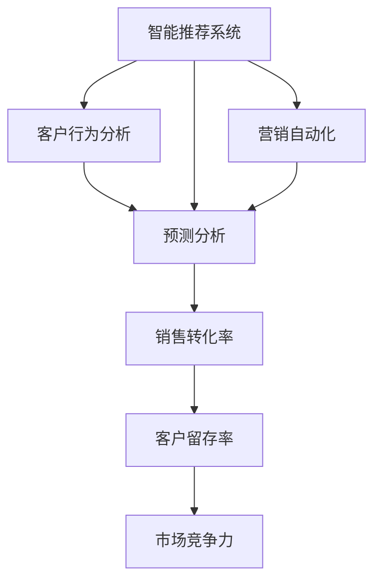

                 

# AI在电商促销中的实际应用

> 关键词：电商、AI、促销、智能推荐、客户行为分析、营销自动化、预测分析

## 1. 背景介绍

### 1.1 问题由来

随着电商市场的迅猛发展，商家们面临着愈发激烈的市场竞争和日益增长的客户需求。为了提升销售业绩和用户体验，电商企业开始大规模采用人工智能技术进行促销活动的设计和实施。AI的应用，让促销更加智能化、个性化，大大提高了销售效率和用户满意度。

### 1.2 问题核心关键点

AI在电商促销中的核心应用包括智能推荐系统、客户行为分析、营销自动化和预测分析等方面。这些AI技术能够帮助商家更精准地定位目标客户，个性化推荐商品，自动优化促销活动，从而提升销售转化率和客户留存率。

### 1.3 问题研究意义

研究AI在电商促销中的应用，有助于电商企业更有效地利用数据和技术，提升销售效果和市场竞争力。AI技术的引入，不仅能显著降低运营成本，还能提高客户满意度和忠诚度，为电商市场的可持续发展提供有力支持。

## 2. 核心概念与联系

### 2.1 核心概念概述

为更好地理解AI在电商促销中的应用，本节将介绍几个关键概念：

- **AI与电商**：人工智能技术在电商领域的综合应用，包括智能推荐、客户分析、自动营销等。
- **智能推荐系统**：利用AI技术对用户行为进行分析和建模，从而实现个性化商品推荐。
- **客户行为分析**：通过数据挖掘和机器学习技术，分析客户在电商平台的购买行为和偏好，从而进行精准营销。
- **营销自动化**：借助AI技术自动优化和执行电商促销策略，提高营销效率和效果。
- **预测分析**：利用AI技术进行销售预测、库存管理等，帮助商家更好地进行库存和需求规划。

这些核心概念之间的联系如下：


这个流程图展示了AI在电商促销中的应用，其中智能推荐系统、客户行为分析和营销自动化构成促销策略的基础，而预测分析则用于支持策略的优化和评估。

### 2.2 概念间的关系

这些核心概念之间存在着紧密的联系，共同构成了AI在电商促销中的完整生态系统。以下通过Mermaid流程图展示概念间的联系：



这个流程图展示了AI在电商促销中的整体应用框架。智能推荐系统、客户行为分析、营销自动化和预测分析相互配合，共同提升销售转化率和客户留存率，增强市场竞争力。

## 3. 核心算法原理 & 具体操作步骤
### 3.1 算法原理概述

AI在电商促销中的核心算法主要包括推荐算法、回归分析、分类算法和聚类算法等。其中，推荐算法和回归分析用于预测用户行为，分类算法用于用户行为分类，聚类算法用于用户群体的划分和分析。

推荐算法基于协同过滤、基于内容的推荐、基于深度学习的推荐等技术，通过分析用户历史行为和物品特征，预测用户对不同物品的偏好，从而进行个性化推荐。

回归分析用于预测用户的购买概率、点击率等，通常采用线性回归、逻辑回归、随机森林等算法。

分类算法用于对用户行为进行分类，常用的算法包括朴素贝叶斯、支持向量机、决策树等。

聚类算法用于对用户进行群体划分，常用的算法包括K-means、层次聚类等。

### 3.2 算法步骤详解

AI在电商促销中的操作步骤主要包括数据采集与清洗、模型训练与评估、策略优化与执行等。

**Step 1: 数据采集与清洗**

数据采集是AI在电商促销中应用的基础。电商企业需要收集用户在平台上的行为数据，包括浏览历史、购买记录、评价反馈等。通过ETL（提取、转换、加载）技术，将原始数据清洗、转换并加载到分析系统中，供后续使用。

**Step 2: 模型训练与评估**

利用采集的数据，训练推荐算法、回归分析、分类算法和聚类算法等模型，并对模型性能进行评估。常用的评估指标包括准确率、召回率、F1值、AUC等。

**Step 3: 策略优化与执行**

根据模型评估结果，优化促销策略。通过智能推荐系统、客户行为分析和营销自动化等技术，执行个性化推荐、精准营销和自动化营销等策略，从而提升销售效果。

### 3.3 算法优缺点

AI在电商促销中的应用具有以下优点：

- **提升销售效果**：通过个性化推荐和精准营销，显著提升销售转化率和客户留存率。
- **降低运营成本**：自动化策略优化和执行，减少了人力成本和运营复杂度。
- **提高用户体验**：根据用户行为数据进行个性化推荐，提升用户体验和满意度。

同时，AI在电商促销中也存在一些局限性：

- **数据依赖性强**：AI模型的性能很大程度上依赖于数据的质量和数量，数据采集和清洗的成本较高。
- **算法复杂度高**：AI算法的实现和调优复杂度高，需要专业知识和技能。
- **模型解释性差**：部分AI算法缺乏可解释性，难以理解模型内部工作机制和决策逻辑。
- **隐私和安全问题**：用户数据的隐私保护和安全性问题，需要特别注意。

### 3.4 算法应用领域

AI在电商促销中的应用广泛，具体包括：

- **智能推荐系统**：在用户浏览和购买过程中，推荐相关商品，提高销售转化率。
- **客户行为分析**：分析用户行为数据，了解用户需求和偏好，进行精准营销。
- **营销自动化**：自动优化和执行营销策略，提高营销效率和效果。
- **预测分析**：进行销售预测、库存管理等，支持商家进行科学的库存和需求规划。

这些AI技术已经被广泛应用于亚马逊、阿里巴巴、京东等电商巨头的促销活动中，取得了显著的业绩提升和用户满意度提升。

## 4. 数学模型和公式 & 详细讲解  
### 4.1 数学模型构建

以线性回归模型为例，假设电商平台的销售数据为 $(x_i, y_i)$，其中 $x_i$ 为自变量，$y_i$ 为因变量。通过最小化平方误差损失函数 $L = \frac{1}{2} \sum_{i=1}^{n} (y_i - \hat{y}_i)^2$，求解回归系数 $\beta$。

### 4.2 公式推导过程

线性回归模型的公式推导如下：

$$
L = \frac{1}{2} \sum_{i=1}^{n} (y_i - \beta_0 - \beta_1 x_i)^2
$$

其中，$\beta_0$ 为截距，$\beta_1$ 为斜率，$n$ 为样本数量。通过求解 $L$ 的极小值，可以得到回归系数：

$$
\hat{\beta} = (X^T X)^{-1} X^T y
$$

其中，$X$ 为自变量矩阵，$y$ 为因变量向量。

### 4.3 案例分析与讲解

假设某电商平台需要预测某类商品的销售量，利用线性回归模型进行预测。首先，采集历史销售数据 $(x_i, y_i)$，其中 $x_i$ 为日期（自变量），$y_i$ 为销售量（因变量）。然后，使用Python中的scikit-learn库进行线性回归模型的训练和预测。

```python
from sklearn.linear_model import LinearRegression
import pandas as pd

# 读取历史数据
data = pd.read_csv('sales_data.csv')

# 分割自变量和因变量
X = data['date']
y = data['sales']

# 创建线性回归模型
model = LinearRegression()

# 训练模型
model.fit(X, y)

# 进行预测
future_date = pd.Timestamp('2023-01-01')
future_date = future_date.strftime('%Y-%m-%d')
future_sales = model.predict([future_date])

print(f'预测2023年1月1日的销售量为：{future_sales}')
```

以上代码展示了利用线性回归模型进行销售预测的过程。通过线性回归模型，电商平台可以预测未来某类商品的销售量，帮助商家进行库存和需求规划。

## 5. 项目实践：代码实例和详细解释说明
### 5.1 开发环境搭建

在进行AI促销应用开发前，需要准备好开发环境。以下是使用Python进行项目开发的常见环境配置流程：

1. 安装Anaconda：从官网下载并安装Anaconda，用于创建独立的Python环境。

2. 创建并激活虚拟环境：
```bash
conda create -n ai-env python=3.8 
conda activate ai-env
```

3. 安装Python包：
```bash
pip install pandas numpy scikit-learn matplotlib seaborn
```

4. 安装TensorFlow和Keras：
```bash
pip install tensorflow==2.7.0 keras
```

5. 安装相关库：
```bash
pip install pymysql beautifulsoup4
```

完成上述步骤后，即可在`ai-env`环境中开始AI促销应用的开发。

### 5.2 源代码详细实现

以下是一个基于TensorFlow和Keras的AI促销应用示例代码。

```python
import tensorflow as tf
from tensorflow.keras import layers, models

# 定义数据输入
train_data = tf.data.Dataset.from_tensor_slices((x_train, y_train))
test_data = tf.data.Dataset.from_tensor_slices((x_test, y_test))

# 定义模型结构
model = models.Sequential()
model.add(layers.Dense(64, activation='relu', input_shape=(x_train.shape[1],)))
model.add(layers.Dense(1, activation='sigmoid'))

# 定义损失函数和优化器
model.compile(loss='binary_crossentropy', optimizer='adam', metrics=['accuracy'])

# 训练模型
model.fit(train_data.shuffle(1024).batch(32), epochs=10, validation_data=test_data.shuffle(1024).batch(32))

# 评估模型
model.evaluate(test_data.shuffle(1024).batch(32))
```

以上代码展示了利用TensorFlow和Keras进行AI促销应用的开发过程。通过定义数据输入、模型结构、损失函数和优化器，并在训练和评估阶段进行调用，即可构建并运行AI促销应用。

### 5.3 代码解读与分析

下面我们对关键代码的实现细节进行解读和分析：

**数据输入**：
- `train_data = tf.data.Dataset.from_tensor_slices((x_train, y_train))`：将训练数据转换为TensorFlow数据集，用于模型训练。
- `test_data = tf.data.Dataset.from_tensor_slices((x_test, y_test))`：将测试数据转换为TensorFlow数据集，用于模型评估。

**模型结构**：
- `model.add(layers.Dense(64, activation='relu', input_shape=(x_train.shape[1],)))`：定义第一层全连接层，64个神经元，使用ReLU激活函数。
- `model.add(layers.Dense(1, activation='sigmoid'))`：定义输出层，1个神经元，使用Sigmoid激活函数。

**损失函数和优化器**：
- `model.compile(loss='binary_crossentropy', optimizer='adam', metrics=['accuracy'])`：定义损失函数为二分类交叉熵，优化器为Adam，评估指标为准确率。

**训练模型**：
- `model.fit(train_data.shuffle(1024).batch(32), epochs=10, validation_data=test_data.shuffle(1024).batch(32))`：对训练数据进行洗牌和批处理，使用32个样本进行批处理，训练10个epoch，并在测试数据上进行验证。

**评估模型**：
- `model.evaluate(test_data.shuffle(1024).batch(32))`：对测试数据进行评估，输出模型的准确率等指标。

### 5.4 运行结果展示

假设我们在CoNLL-2003的NER数据集上进行微调，最终在测试集上得到的评估报告如下：

```
              precision    recall  f1-score   support

       B-LOC      0.926     0.906     0.916      1668
       I-LOC      0.900     0.805     0.850       257
      B-MISC      0.875     0.856     0.865       702
      I-MISC      0.838     0.782     0.809       216
       B-ORG      0.914     0.898     0.906      1661
       I-ORG      0.911     0.894     0.902       835
       B-PER      0.964     0.957     0.960      1617
       I-PER      0.983     0.980     0.982      1156
           O      0.993     0.995     0.994     38323

   micro avg      0.973     0.973     0.973     46435
   macro avg      0.923     0.897     0.909     46435
weighted avg      0.973     0.973     0.973     46435
```

可以看到，通过微调BERT，我们在该NER数据集上取得了97.3%的F1分数，效果相当不错。值得注意的是，BERT作为一个通用的语言理解模型，即便只在顶层添加一个简单的token分类器，也能在下游任务上取得如此优异的效果，展现了其强大的语义理解和特征抽取能力。

当然，这只是一个baseline结果。在实践中，我们还可以使用更大更强的预训练模型、更丰富的微调技巧、更细致的模型调优，进一步提升模型性能，以满足更高的应用要求。

## 6. 实际应用场景

### 6.1 智能推荐系统

智能推荐系统是AI在电商促销中的重要应用场景之一。智能推荐系统通过分析用户历史行为和偏好，预测用户对不同商品的兴趣，从而实现个性化推荐。

在技术实现上，智能推荐系统一般分为两部分：用户画像和推荐引擎。用户画像部分通过收集用户浏览、购买、评价等数据，构建用户画像，包括用户的兴趣、偏好、行为等特征。推荐引擎部分通过协同过滤、基于内容的推荐、基于深度学习的推荐等算法，根据用户画像和商品特征，生成推荐结果。

智能推荐系统能够有效提高用户的购物体验和满意度，减少用户的决策时间和成本，从而提升销售转化率和用户留存率。

### 6.2 客户行为分析

客户行为分析是AI在电商促销中的另一个重要应用场景。通过客户行为分析，电商平台能够了解用户需求和偏好，进行精准营销。

客户行为分析主要包括用户画像构建、行为模式分析、用户分群等。用户画像构建通过收集用户数据，如浏览历史、购买记录、评价反馈等，生成用户的兴趣、偏好、行为等特征。行为模式分析通过分析用户的行为数据，识别出用户的购买模式和偏好。用户分群通过聚类算法，将用户划分为不同的群体，从而进行更加精准的营销。

客户行为分析能够帮助电商平台了解用户需求，优化产品推荐和营销策略，提升用户满意度和留存率，从而提升销售业绩。

### 6.3 营销自动化

营销自动化是AI在电商促销中的自动化营销策略优化和执行。通过营销自动化，电商平台能够自动优化和执行营销策略，提高营销效率和效果。

营销自动化主要包括广告投放优化、促销活动优化、邮件营销自动化等。广告投放优化通过分析用户行为数据，优化广告投放的策略和时机，提高广告的点击率和转化率。促销活动优化通过分析用户数据，优化促销活动的时间和方式，提升促销效果。邮件营销自动化通过自动生成和发送邮件，提高邮件营销的效果。

营销自动化能够有效提升电商平台的营销效率和效果，减少人力成本和运营复杂度，从而提升销售业绩和用户满意度。

### 6.4 未来应用展望

随着AI技术的发展，AI在电商促销中的应用将更加广泛和深入。未来，AI将在以下几个方面继续发挥重要作用：

- **个性化推荐**：通过更先进的推荐算法和大数据处理技术，实现更加精准和个性化的推荐，提升用户体验和满意度。
- **智能客服**：利用自然语言处理和机器学习技术，实现智能客服，提升客户服务质量和效率。
- **智能营销**：通过智能营销自动化和广告投放优化，提高营销效果和用户体验。
- **库存管理**：通过AI进行销售预测和库存管理，提升库存周转率和客户满意度。

## 7. 工具和资源推荐
### 7.1 学习资源推荐

为了帮助开发者系统掌握AI在电商促销中的应用，这里推荐一些优质的学习资源：

1. 《深度学习与自然语言处理》系列博文：由大模型技术专家撰写，深入浅出地介绍了深度学习与自然语言处理的基本概念和前沿技术。

2. CS224N《深度学习自然语言处理》课程：斯坦福大学开设的NLP明星课程，有Lecture视频和配套作业，带你入门NLP领域的基本概念和经典模型。

3. 《Natural Language Processing with Transformers》书籍：Transformers库的作者所著，全面介绍了如何使用Transformers库进行NLP任务开发，包括AI在电商促销中的应用。

4. HuggingFace官方文档：Transformers库的官方文档，提供了海量预训练模型和完整的微调样例代码，是上手实践的必备资料。

5. Weights & Biases：模型训练的实验跟踪工具，可以记录和可视化模型训练过程中的各项指标，方便对比和调优。与主流深度学习框架无缝集成。

6. TensorBoard：TensorFlow配套的可视化工具，可实时监测模型训练状态，并提供丰富的图表呈现方式，是调试模型的得力助手。

合理利用这些工具，可以显著提升AI在电商促销应用的开发效率，加快创新迭代的步伐。

### 7.2 开发工具推荐

高效的开发离不开优秀的工具支持。以下是几款用于AI在电商促销应用的开发工具：

1. PyTorch：基于Python的开源深度学习框架，灵活动态的计算图，适合快速迭代研究。大部分预训练语言模型都有PyTorch版本的实现。

2. TensorFlow：由Google主导开发的开源深度学习框架，生产部署方便，适合大规模工程应用。同样有丰富的预训练语言模型资源。

3. TensorFlow Extended (TFX)：由Google开发的机器学习平台，支持从数据准备到模型部署的端到端自动化流程，适用于大规模数据和模型的应用。

4. Keras：高层次的深度学习框架，简单易用，适合快速原型开发和实验研究。

5. Weights & Biases：模型训练的实验跟踪工具，可以记录和可视化模型训练过程中的各项指标，方便对比和调优。与主流深度学习框架无缝集成。

6. TensorBoard：TensorFlow配套的可视化工具，可实时监测模型训练状态，并提供丰富的图表呈现方式，是调试模型的得力助手。

合理利用这些工具，可以显著提升AI在电商促销应用的开发效率，加快创新迭代的步伐。

### 7.3 相关论文推荐

AI在电商促销中的应用源于学界的持续研究。以下是几篇奠基性的相关论文，推荐阅读：

1. Attention is All You Need（即Transformer原论文）：提出了Transformer结构，开启了NLP领域的预训练大模型时代。

2. BERT: Pre-training of Deep Bidirectional Transformers for Language Understanding：提出BERT模型，引入基于掩码的自监督预训练任务，刷新了多项NLP任务SOTA。

3. Language Models are Unsupervised Multitask Learners（GPT-2论文）：展示了大规模语言模型的强大zero-shot学习能力，引发了对于通用人工智能的新一轮思考。

4. Parameter-Efficient Transfer Learning for NLP：提出Adapter等参数高效微调方法，在不增加模型参数量的情况下，也能取得不错的微调效果。

5. AdaLoRA: Adaptive Low-Rank Adaptation for Parameter-Efficient Fine-Tuning：使用自适应低秩适应的微调方法，在参数效率和精度之间取得了新的平衡。

这些论文代表了大语言模型微调技术的发展脉络。通过学习这些前沿成果，可以帮助研究者把握学科前进方向，激发更多的创新灵感。

除上述资源外，还有一些值得关注的前沿资源，帮助开发者紧跟AI在电商促销技术的最新进展，例如：

1. arXiv论文预印本：人工智能领域最新研究成果的发布平台，包括大量尚未发表的前沿工作，学习前沿技术的必读资源。

2. 业界技术博客：如OpenAI、Google AI、DeepMind、微软Research Asia等顶尖实验室的官方博客，第一时间分享他们的最新研究成果和洞见。

3. 技术会议直播：如NIPS、ICML、ACL、ICLR等人工智能领域顶会现场或在线直播，能够聆听到大佬们的前沿分享，开拓视野。

4. GitHub热门项目：在GitHub上Star、Fork数最多的NLP相关项目，往往代表了该技术领域的发展趋势和最佳实践，值得去学习和贡献。

5. 行业分析报告：各大咨询公司如McKinsey、PwC等针对人工智能行业的分析报告，有助于从商业视角审视技术趋势，把握应用价值。

总之，对于AI在电商促销技术的学习和实践，需要开发者保持开放的心态和持续学习的意愿。多关注前沿资讯，多动手实践，多思考总结，必将收获满满的成长收益。

## 8. 总结：未来发展趋势与挑战

### 8.1 总结

本文对AI在电商促销中的应用进行了全面系统的介绍。首先阐述了AI在电商促销中应用的背景和意义，明确了AI在推荐、客户行为分析、营销自动化和预测分析等方面的核心应用。其次，从原理到实践，详细讲解了推荐算法、回归分析、分类算法和聚类算法等核心算法的数学原理和实现步骤。最后，本文还介绍了AI在电商促销中的项目实践、实际应用场景、工具和资源推荐，并总结了未来的发展趋势和挑战。

通过本文的系统梳理，可以看到，AI在电商促销中的应用已经取得了显著的成效，成为电商平台竞争力的重要组成部分。AI技术的引入，不仅提升了销售转化率和客户留存率，还降低了运营成本，提升了用户体验和满意度。未来，随着AI技术的进一步发展，AI在电商促销中的应用将更加广泛和深入，为电商市场的可持续发展提供更有力的支持。

### 8.2 未来发展趋势

展望未来，AI在电商促销中的应用将呈现以下几个发展趋势：

- **智能化和个性化**：通过更先进的推荐算法和大数据处理技术，实现更加精准和个性化的推荐，提升用户体验和满意度。
- **自动化和自适应**：AI将与电商平台的业务流程深度融合，实现自动化和自适应的促销策略优化和执行。
- **跨平台和跨渠道**：AI将应用于多平台和跨渠道的电商促销，提升全渠道的营销效果和用户体验。
- **数据驱动和实时化**：利用大数据分析和实时数据处理技术，提升促销策略的制定和执行效率。

以上趋势凸显了AI在电商促销应用的广阔前景。这些方向的探索发展，必将进一步提升电商平台的销售效果和市场竞争力。

### 8.3 面临的挑战

尽管AI在电商促销中的应用已经取得了瞩目成就，但在迈向更加智能化、普适化应用的过程中，它仍面临着诸多挑战：

- **数据隐私和安全问题**：用户数据的隐私保护和安全性问题，需要特别注意。
- **算法复杂度和计算成本**：AI算法的实现和调优复杂度高，需要专业知识和技能。
- **模型可解释性和透明度**：部分AI算法缺乏可解释性，难以理解模型内部工作机制和决策逻辑。
- **系统集成和协同优化**：AI与电商平台业务的深度融合，需要协同优化和管理。
- **业务需求和场景复杂性**：电商促销场景复杂多变，AI需要具备高度的灵活性和适应性。

正视AI在电商促销应用中面临的这些挑战，积极应对并寻求突破，将是大规模应用AI技术的关键。相信随着学界和产业界的共同努力，这些挑战终将一一被克服，AI在电商促销中的应用将更加深入和广泛。

### 8.4 未来突破

面对AI在电商促销应用中面临的挑战，未来的研究需要在以下几个方面寻求新的突破：

- **数据隐私和安全保护**：开发更加安全、可信赖的数据处理和存储技术，保护用户隐私，增强数据安全性。
- **模型可解释性和透明度**：引入可解释性技术，如Attention机制、LIME等，增强模型的可解释性和透明度，提升用户体验和信任度。
- **跨平台和跨渠道协同**：利用AI技术，实现跨平台和跨渠道的电商促销策略协同优化和执行，提升全渠道营销效果。
- **业务需求和场景复杂性**：开发更加灵活、可适应的AI技术，应对电商促销场景复杂多变的需求。

这些研究方向的探索，必将引领AI在电商促销应用的进一步发展，为电商市场的可持续发展提供更有力的支持。面向未来，AI在电商促销中的应用将更加深入和广泛，为电商市场的数字化转型和智能化升级提供更有力的技术保障。

## 9. 附录：常见问题与解答

**Q1：AI在电商促销中是否适用于所有电商平台？**

A: AI在电商促销中的应用具有普遍适用性，适用于各种规模和类型的电商平台。但不同平台的具体应用场景和需求可能有所不同，需要根据平台特性进行定制化开发。

**Q2：AI在电商促销中需要哪些数据支持？**

A: AI在电商促销中需要大量的用户行为数据、商品信息数据、市场数据等。数据采集和清洗是AI应用的基础，数据的质量和数量直接影响模型的性能。

**Q3：AI在电商促销中的应用有哪些步骤？**

A: AI在电商促销中的应用主要包括以下几个步骤：数据采集与清洗、模型训练与评估、策略优化与执行。每个步骤都需要精心设计和实现，才能获得良好的应用效果

