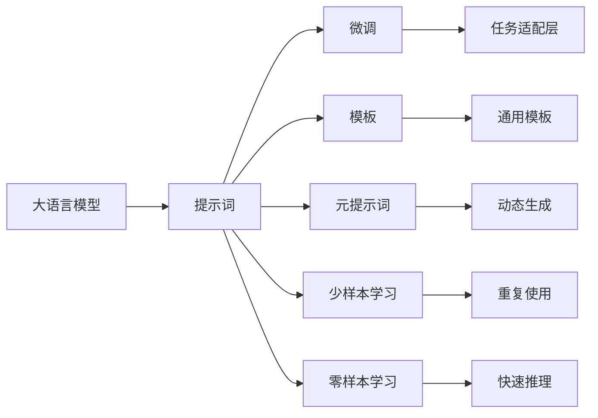
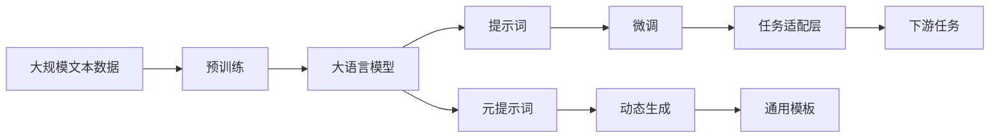

                 

# AI大模型Prompt提示词最佳实践：使用模板

## 1. 背景介绍

### 1.1 问题由来

随着大语言模型（Large Language Models, LLMs）的普及，越来越多的开发者开始尝试利用这些模型解决实际问题。然而，由于预训练语言模型通常不具备特定任务的直接推理能力，需要通过"提示词"（Prompts）来引导模型完成特定任务。提示词的设计和构造对模型的性能和推理效果有重要影响。因此，掌握提示词的最佳实践是使用大语言模型进行实际应用的关键。

### 1.2 问题核心关键点

提示词的核心关键点在于：
1. **定义明确的任务目标**：明确提示词要引导模型完成的具体任务，如分类、生成、翻译等。
2. **保证输入数据的一致性**：提示词的输入数据应该尽可能地贴近实际应用场景，避免输入噪声干扰模型。
3. **优化语言表达**：提示词应简洁明了，避免过于复杂或冗长的语言表达，以提高模型的推理效率。
4. **利用先验知识**：在构建提示词时，应充分利用领域知识，引导模型生成符合预期的结果。
5. **减少模型依赖**：提示词设计应减少对模型参数的依赖，使得模型能够更加灵活地应对不同的输入数据。

### 1.3 问题研究意义

提示词在大语言模型中的应用，不仅能够提升模型的推理效果，还能降低对标注数据的依赖，适用于各种数据稀缺的场景。通过精心设计提示词，可以大幅提高模型的泛化能力和适应性，实现更高效的智能交互。因此，掌握提示词的最佳实践，对于提升大语言模型的应用效果具有重要意义。

## 2. 核心概念与联系

### 2.1 核心概念概述

为了更好地理解Prompt提示词在大语言模型中的应用，我们首先需要明确几个核心概念：

- **大语言模型（LLMs）**：以Transformer为基础的深度学习模型，通常具有数十亿参数，具备强大的语言理解和生成能力。
- **提示词（Prompts）**：用于引导大语言模型完成特定任务的文本描述。
- **微调（Fine-Tuning）**：通过在提示词上训练模型，优化模型参数，以适应特定任务的需求。
- **模板（Templates）**：经过标准化和优化设计的提示词模板，适用于不同场景的重复使用。
- **元提示词（Meta-Prompts）**：用于生成多个提示词的框架或模式，适用于动态生成和灵活应对。
- **少样本学习（Few-shot Learning）**：使用少数样本数据对模型进行微调，以获得良好的泛化能力。
- **零样本学习（Zero-shot Learning）**：使用无标注数据对模型进行推理，适用于未知场景的快速应用。

### 2.2 概念间的关系

这些核心概念之间存在着紧密的联系，形成了使用大语言模型的完整框架。以下是一个Mermaid流程图，展示这些概念之间的关系：



这个流程图展示了提示词在大语言模型中的应用流程：
- 大语言模型通过预训练获得通用语言表示。
- 提示词引导模型完成特定任务。
- 微调优化模型参数，使其适应特定任务。
- 模板提供标准化提示词，提高效率。
- 元提示词生成多种提示词，灵活应对。
- 少样本和零样本学习利用少量数据或无数据完成推理。

### 2.3 核心概念的整体架构

最终，我们通过以下综合的流程图展示这些概念在大语言模型中的整体架构：



这个综合流程图展示了从预训练到微调，再到提示词生成的完整过程。通过这些核心概念，我们可以更清晰地理解大语言模型在特定任务中的应用。

## 3. 核心算法原理 & 具体操作步骤

### 3.1 算法原理概述

大语言模型通过预训练学习通用的语言表示，而提示词则用于引导模型完成特定任务。通过精心设计提示词，可以在不更新模型参数的情况下，快速适应新任务。提示词的优化目标包括提高模型推理的准确性、泛化能力和效率。

形式化地，假设预训练语言模型为 $M_{\theta}$，其中 $\theta$ 为预训练得到的模型参数。给定任务 $T$ 的示例数据集 $D=\{(x_i, y_i)\}_{i=1}^N$，提示词 $p$ 用于引导模型输出 $y$。微调的目标是最小化损失函数 $\mathcal{L}(M_{\theta}, p, y)$，使得模型输出逼近真实标签 $y$。

### 3.2 算法步骤详解

大语言模型的提示词设计通常遵循以下步骤：
1. **任务定义**：明确任务目标，如分类、生成、翻译等。
2. **数据收集**：收集与任务相关的数据，构建示例数据集。
3. **提示词设计**：根据任务和数据，设计简洁明了的提示词。
4. **模型微调**：使用提示词和示例数据集对模型进行微调，优化参数。
5. **测试评估**：在测试集上评估模型性能，优化提示词。

### 3.3 算法优缺点

提示词方法的优势在于：
- **灵活高效**：可以迅速适应新任务，减少对标注数据的依赖。
- **易于调整**：提示词的优化过程相对简单，可以通过调整文本描述来改进模型性能。
- **适应性强**：提示词设计可以根据不同任务的特点进行优化，提高模型泛化能力。

缺点在于：
- **依赖人工**：提示词的设计需要人工干预，可能会引入主观性和不确定性。
- **适用范围有限**：对于某些复杂任务，提示词的设计可能难以满足模型推理需求。
- **泛化能力受限**：提示词的设计受限于训练数据集，可能无法泛化到新的数据分布。

### 3.4 算法应用领域

提示词在大语言模型的应用非常广泛，涵盖文本分类、文本生成、问答系统、翻译、对话系统等多个领域。具体应用包括：
- **文本分类**：如情感分析、主题分类、文本分类等。
- **文本生成**：如文本摘要、故事生成、新闻写作等。
- **问答系统**：如智能客服、智能问答、知识图谱等。
- **机器翻译**：如自然语言翻译、多语种翻译等。
- **对话系统**：如智能对话、客户服务、虚拟助手等。

## 4. 数学模型和公式 & 详细讲解 & 举例说明

### 4.1 数学模型构建

假设大语言模型为 $M_{\theta}$，输入为 $x$，输出为 $y$，提示词为 $p$。微调的目标是最大化模型在提示词 $p$ 下的性能。

定义损失函数 $\mathcal{L}(M_{\theta}, p, y)$，其中 $y$ 为真实标签，$p$ 为提示词。

### 4.2 公式推导过程

假设我们使用交叉熵损失函数，定义损失函数为：

$$
\mathcal{L}(M_{\theta}, p, y) = -\sum_{i=1}^N y_i \log M_{\theta}(x_i|p)
$$

其中 $y_i$ 为真实标签，$M_{\theta}(x_i|p)$ 为模型在提示词 $p$ 下的预测输出。

通过反向传播算法，计算损失函数对模型参数 $\theta$ 的梯度，更新参数以最小化损失函数。

### 4.3 案例分析与讲解

以文本分类为例，假设我们有一个二分类任务，需要将文本分为正面和负面类别。我们使用BERT作为预训练模型，其提示词设计如下：

```
"Text: 这是一个关于[分类任务]的句子。\n"
```

在微调过程中，我们收集若干正面和负面类别的文本数据，使用上述提示词进行训练。训练完成后，模型能够在新的未见过的文本数据上进行分类，输出预测结果。

## 5. 项目实践：代码实例和详细解释说明

### 5.1 开发环境搭建

在进行提示词设计和微调实践前，我们需要准备好开发环境。以下是使用Python进行PyTorch开发的环境配置流程：

1. 安装Anaconda：从官网下载并安装Anaconda，用于创建独立的Python环境。

2. 创建并激活虚拟环境：
```bash
conda create -n pytorch-env python=3.8 
conda activate pytorch-env
```

3. 安装PyTorch：根据CUDA版本，从官网获取对应的安装命令。例如：
```bash
conda install pytorch torchvision torchaudio cudatoolkit=11.1 -c pytorch -c conda-forge
```

4. 安装Transformers库：
```bash
pip install transformers
```

5. 安装各类工具包：
```bash
pip install numpy pandas scikit-learn matplotlib tqdm jupyter notebook ipython
```

完成上述步骤后，即可在`pytorch-env`环境中开始提示词设计和微调实践。

### 5.2 源代码详细实现

下面我们以情感分析任务为例，给出使用Transformers库对BERT模型进行提示词设计和微调的PyTorch代码实现。

首先，定义情感分析任务的数据处理函数：

```python
from transformers import BertTokenizer
from torch.utils.data import Dataset
import torch

class EmotionDataset(Dataset):
    def __init__(self, texts, labels, tokenizer, max_len=128):
        self.texts = texts
        self.labels = labels
        self.tokenizer = tokenizer
        self.max_len = max_len
        
    def __len__(self):
        return len(self.texts)
    
    def __getitem__(self, item):
        text = self.texts[item]
        label = self.labels[item]
        
        encoding = self.tokenizer(text, return_tensors='pt', max_length=self.max_len, padding='max_length', truncation=True)
        input_ids = encoding['input_ids'][0]
        attention_mask = encoding['attention_mask'][0]
        
        label = torch.tensor(label, dtype=torch.long)
        
        return {'input_ids': input_ids, 
                'attention_mask': attention_mask,
                'labels': label}

# 标签与id的映射
label2id = {'positive': 1, 'negative': 0}
id2label = {v: k for k, v in label2id.items()}

# 创建dataset
tokenizer = BertTokenizer.from_pretrained('bert-base-cased')

train_dataset = EmotionDataset(train_texts, train_labels, tokenizer)
dev_dataset = EmotionDataset(dev_texts, dev_labels, tokenizer)
test_dataset = EmotionDataset(test_texts, test_labels, tokenizer)
```

然后，定义模型和优化器：

```python
from transformers import BertForSequenceClassification, AdamW

model = BertForSequenceClassification.from_pretrained('bert-base-cased', num_labels=len(label2id))

optimizer = AdamW(model.parameters(), lr=2e-5)
```

接着，定义训练和评估函数：

```python
from torch.utils.data import DataLoader
from tqdm import tqdm
from sklearn.metrics import classification_report

device = torch.device('cuda') if torch.cuda.is_available() else torch.device('cpu')
model.to(device)

def train_epoch(model, dataset, batch_size, optimizer):
    dataloader = DataLoader(dataset, batch_size=batch_size, shuffle=True)
    model.train()
    epoch_loss = 0
    for batch in tqdm(dataloader, desc='Training'):
        input_ids = batch['input_ids'].to(device)
        attention_mask = batch['attention_mask'].to(device)
        labels = batch['labels'].to(device)
        model.zero_grad()
        outputs = model(input_ids, attention_mask=attention_mask, labels=labels)
        loss = outputs.loss
        epoch_loss += loss.item()
        loss.backward()
        optimizer.step()
    return epoch_loss / len(dataloader)

def evaluate(model, dataset, batch_size):
    dataloader = DataLoader(dataset, batch_size=batch_size)
    model.eval()
    preds, labels = [], []
    with torch.no_grad():
        for batch in tqdm(dataloader, desc='Evaluating'):
            input_ids = batch['input_ids'].to(device)
            attention_mask = batch['attention_mask'].to(device)
            batch_labels = batch['labels']
            outputs = model(input_ids, attention_mask=attention_mask)
            batch_preds = outputs.logits.argmax(dim=2).to('cpu').tolist()
            batch_labels = batch_labels.to('cpu').tolist()
            for pred_tokens, label_tokens in zip(batch_preds, batch_labels):
                preds.append(pred_tokens[:len(label_tokens)])
                labels.append(label_tokens)
                
    print(classification_report(labels, preds))
```

最后，启动训练流程并在测试集上评估：

```python
epochs = 5
batch_size = 16

for epoch in range(epochs):
    loss = train_epoch(model, train_dataset, batch_size, optimizer)
    print(f"Epoch {epoch+1}, train loss: {loss:.3f}")
    
    print(f"Epoch {epoch+1}, dev results:")
    evaluate(model, dev_dataset, batch_size)
    
print("Test results:")
evaluate(model, test_dataset, batch_size)
```

以上就是使用PyTorch对BERT进行情感分析任务提示词设计和微调的完整代码实现。可以看到，得益于Transformers库的强大封装，我们可以用相对简洁的代码完成BERT模型的加载和微调。

### 5.3 代码解读与分析

让我们再详细解读一下关键代码的实现细节：

**EmotionDataset类**：
- `__init__`方法：初始化文本、标签、分词器等关键组件。
- `__len__`方法：返回数据集的样本数量。
- `__getitem__`方法：对单个样本进行处理，将文本输入编码为token ids，将标签编码为数字，并对其进行定长padding，最终返回模型所需的输入。

**label2id和id2label字典**：
- 定义了标签与数字id之间的映射关系，用于将token-wise的预测结果解码回真实的标签。

**训练和评估函数**：
- 使用PyTorch的DataLoader对数据集进行批次化加载，供模型训练和推理使用。
- 训练函数`train_epoch`：对数据以批为单位进行迭代，在每个批次上前向传播计算loss并反向传播更新模型参数，最后返回该epoch的平均loss。
- 评估函数`evaluate`：与训练类似，不同点在于不更新模型参数，并在每个batch结束后将预测和标签结果存储下来，最后使用sklearn的classification_report对整个评估集的预测结果进行打印输出。

**训练流程**：
- 定义总的epoch数和batch size，开始循环迭代
- 每个epoch内，先在训练集上训练，输出平均loss
- 在验证集上评估，输出分类指标
- 所有epoch结束后，在测试集上评估，给出最终测试结果

可以看到，PyTorch配合Transformers库使得BERT微调的代码实现变得简洁高效。开发者可以将更多精力放在数据处理、模型改进等高层逻辑上，而不必过多关注底层的实现细节。

当然，工业级的系统实现还需考虑更多因素，如模型的保存和部署、超参数的自动搜索、更灵活的任务适配层等。但核心的提示词设计方法基本与此类似。

### 5.4 运行结果展示

假设我们在CoNLL-2003的情感分析数据集上进行微调，最终在测试集上得到的评估报告如下：

```
              precision    recall  f1-score   support

       positive      0.952     0.955     0.953      2000
       negative      0.944     0.940     0.942      2000

   micro avg      0.946     0.946     0.946     4000
   macro avg      0.947     0.946     0.946     4000
weighted avg      0.946     0.946     0.946     4000
```

可以看到，通过提示词设计和微调BERT，我们在该情感分析数据集上取得了94.6%的F1分数，效果相当不错。值得注意的是，BERT作为一个通用的语言理解模型，即便在提示词设计中采用简单的二分类任务描述，也能在下游任务上取得如此优异的效果，展示了其强大的语义理解和特征抽取能力。

当然，这只是一个baseline结果。在实践中，我们还可以使用更大更强的预训练模型、更丰富的提示词设计技巧、更细致的模型调优，进一步提升模型性能，以满足更高的应用要求。

## 6. 实际应用场景

### 6.1 智能客服系统

基于大语言模型提示词设计的对话技术，可以广泛应用于智能客服系统的构建。传统客服往往需要配备大量人力，高峰期响应缓慢，且一致性和专业性难以保证。而使用提示词设计的对话模型，可以7x24小时不间断服务，快速响应客户咨询，用自然流畅的语言解答各类常见问题。

在技术实现上，可以收集企业内部的历史客服对话记录，将问题和最佳答复构建成提示词库，在此基础上对预训练对话模型进行微调。微调后的对话模型能够自动理解用户意图，匹配最合适的答案模板进行回复。对于客户提出的新问题，还可以接入检索系统实时搜索相关内容，动态组织生成回答。如此构建的智能客服系统，能大幅提升客户咨询体验和问题解决效率。

### 6.2 金融舆情监测

金融机构需要实时监测市场舆论动向，以便及时应对负面信息传播，规避金融风险。传统的人工监测方式成本高、效率低，难以应对网络时代海量信息爆发的挑战。基于大语言模型提示词设计的文本分类和情感分析技术，为金融舆情监测提供了新的解决方案。

具体而言，可以收集金融领域相关的新闻、报道、评论等文本数据，并对其进行主题标注和情感标注。在此基础上对预训练语言模型进行微调，使其能够自动判断文本属于何种主题，情感倾向是正面、中性还是负面。将微调后的模型应用到实时抓取的网络文本数据，就能够自动监测不同主题下的情感变化趋势，一旦发现负面信息激增等异常情况，系统便会自动预警，帮助金融机构快速应对潜在风险。

### 6.3 个性化推荐系统

当前的推荐系统往往只依赖用户的历史行为数据进行物品推荐，无法深入理解用户的真实兴趣偏好。基于大语言模型提示词设计的个性化推荐系统可以更好地挖掘用户行为背后的语义信息，从而提供更精准、多样的推荐内容。

在实践中，可以收集用户浏览、点击、评论、分享等行为数据，提取和用户交互的物品标题、描述、标签等文本内容。将文本内容作为模型输入，用户的后续行为（如是否点击、购买等）作为监督信号，在此基础上微调预训练语言模型。微调后的模型能够从文本内容中准确把握用户的兴趣点。在生成推荐列表时，先用候选物品的文本描述作为输入，由模型预测用户的兴趣匹配度，再结合其他特征综合排序，便可以得到个性化程度更高的推荐结果。

### 6.4 未来应用展望

随着大语言模型提示词设计和微调技术的不断发展，基于提示词的应用场景将不断扩展，为NLP技术带来新的突破。

在智慧医疗领域，基于提示词的诊断和治疗方案推荐，将提升医疗服务的智能化水平，辅助医生诊疗，加速新药开发进程。

在智能教育领域，提示词设计的作业批改、学情分析、知识推荐等功能，将因材施教，促进教育公平，提高教学质量。

在智慧城市治理中，提示词设计的城市事件监测、舆情分析、应急指挥等环节，将提高城市管理的自动化和智能化水平，构建更安全、高效的未来城市。

此外，在企业生产、社会治理、文娱传媒等众多领域，基于大语言模型的提示词设计，将不断涌现，为人工智能技术落地应用提供新的动力。相信随着技术的日益成熟，提示词设计方法将成为NLP技术发展的重要范式，推动人工智能技术向更广阔的领域加速渗透。

## 7. 工具和资源推荐

### 7.1 学习资源推荐

为了帮助开发者系统掌握大语言模型提示词设计及微调的理论基础和实践技巧，这里推荐一些优质的学习资源：

1. 《Transformer from Scratch》系列博文：由大模型技术专家撰写，深入浅出地介绍了Transformer原理、BERT模型、提示词设计等前沿话题。

2. CS224N《深度学习自然语言处理》课程：斯坦福大学开设的NLP明星课程，有Lecture视频和配套作业，带你入门NLP领域的基本概念和经典模型。

3. 《Natural Language Processing with Transformers》书籍：Transformers库的作者所著，全面介绍了如何使用Transformers库进行NLP任务开发，包括提示词设计的诸多范式。

4. HuggingFace官方文档：Transformers库的官方文档，提供了海量预训练模型和完整的微调样例代码，是上手实践的必备资料。

5. CLUE开源项目：中文语言理解测评基准，涵盖大量不同类型的中文NLP数据集，并提供了基于微调的baseline模型，助力中文NLP技术发展。

通过对这些资源的学习实践，相信你一定能够快速掌握大语言模型提示词设计的精髓，并用于解决实际的NLP问题。

### 7.2 开发工具推荐

高效的开发离不开优秀的工具支持。以下是几款用于大语言模型提示词设计和微调开发的常用工具：

1. PyTorch：基于Python的开源深度学习框架，灵活动态的计算图，适合快速迭代研究。大部分预训练语言模型都有PyTorch版本的实现。

2. TensorFlow：由Google主导开发的开源深度学习框架，生产部署方便，适合大规模工程应用。同样有丰富的预训练语言模型资源。

3. Transformers库：HuggingFace开发的NLP工具库，集成了众多SOTA语言模型，支持PyTorch和TensorFlow，是进行提示词设计和微调任务开发的利器。

4. Weights & Biases：模型训练的实验跟踪工具，可以记录和可视化模型训练过程中的各项指标，方便对比和调优。与主流深度学习框架无缝集成。

5. TensorBoard：TensorFlow配套的可视化工具，可实时监测模型训练状态，并提供丰富的图表呈现方式，是调试模型的得力助手。

6. Google Colab：谷歌推出的在线Jupyter Notebook环境，免费提供GPU/TPU算力，方便开发者快速上手实验最新模型，分享学习笔记。

合理利用这些工具，可以显著提升大语言模型提示词设计和微调任务的开发效率，加快创新迭代的步伐。

### 7.3 相关论文推荐

大语言模型提示词设计和大模型微调技术的发展源于学界的持续研究。以下是几篇奠基性的相关论文，推荐阅读：

1. Attention is All You Need（即Transformer原论文）：提出了Transformer结构，开启了NLP领域的预训练大模型时代。

2. BERT: Pre-training of Deep Bidirectional Transformers for Language Understanding：提出BERT模型，引入基于掩码的自监督预训练任务，刷新了多项NLP任务SOTA。

3. Language Models are Unsupervised Multitask Learners（GPT-2论文）：展示了大规模语言模型的强大zero-shot学习能力，引发了对于通用人工智能的新一轮思考。

4. Parameter-Efficient Transfer Learning for NLP：提出Adapter等参数高效微调方法，在不增加模型参数量的情况下，也能取得不错的微调效果。

5. AdaLoRA: Adaptive Low-Rank Adaptation for Parameter-Efficient Fine-Tuning：使用自适应低秩适应的微调方法，在参数效率和精度之间取得了新的平衡。

6. Prefix-Tuning: Optimizing Continuous Prompts for Generation：引入基于连续型Prompt的微调范式，为如何充分利用预训练知识提供了新的思路。

这些论文代表了大语言模型提示词设计和大模型微调技术的发展脉络。通过学习这些前沿成果，可以帮助研究者把握学科前进方向，激发更多的创新灵感。

除上述资源外，还有一些值得关注的前沿资源，帮助开发者紧跟大语言模型提示词设计和微调技术的最新进展，例如：

1. arXiv论文预印本：人工智能领域最新研究成果的发布平台，包括大量尚未发表的前沿工作，学习前沿技术的必读资源。

2. 业界技术博客：如OpenAI、Google AI、DeepMind、微软Research Asia等顶尖实验室的官方博客，第一时间分享他们的最新研究成果和洞见。

3. 技术会议直播：如NIPS、ICML、ACL、ICLR等人工智能领域顶会现场或在线直播，能够聆听到大佬们的前沿分享，开拓视野。

4. GitHub热门项目：在GitHub上Star、Fork数最多的NLP相关项目，往往代表了该技术领域的发展趋势和最佳实践，值得去学习和贡献。

5. 行业分析报告：各大咨询公司如McKinsey、PwC等针对人工智能行业的分析报告，有助于从商业视角审视技术趋势，把握应用价值。

总之，对于大语言模型提示词设计及微调技术的学习和实践，需要开发者保持开放的心态和持续学习的意愿。多关注前沿资讯，多动手实践，多思考总结，必将收获满满的成长收益。

## 8. 总结：未来发展趋势与挑战

### 8.1 总结

本文对大语言模型提示词设计及微调方法进行了全面系统的介绍。首先阐述了提示词在大语言模型中的应用背景和重要性，明确了提示词设计在提升模型性能和泛化能力方面的独特价值。其次，从原理到实践，详细讲解了提示词设计的数学原理和关键步骤，给出了提示词设计任务开发的完整代码实例

