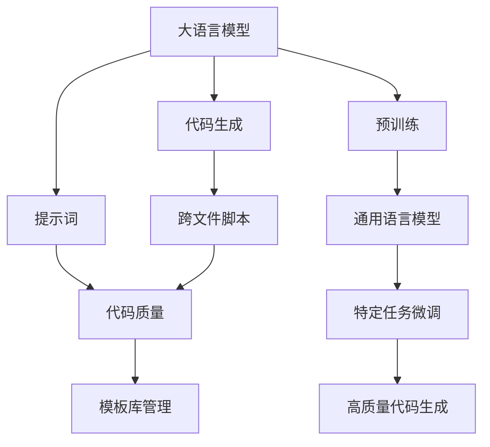
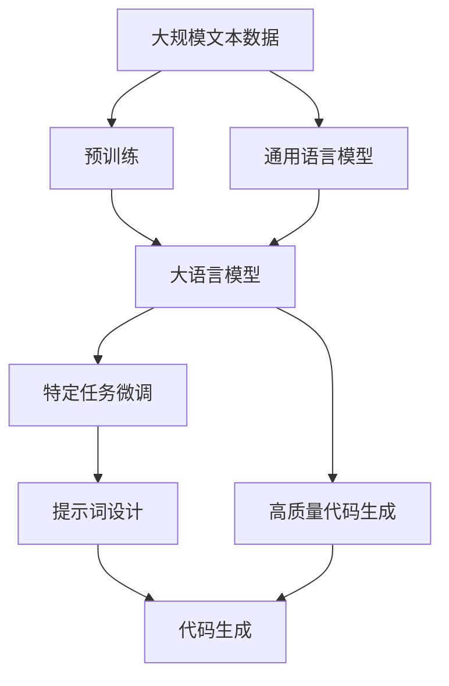
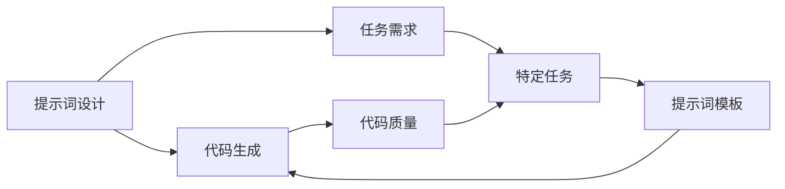
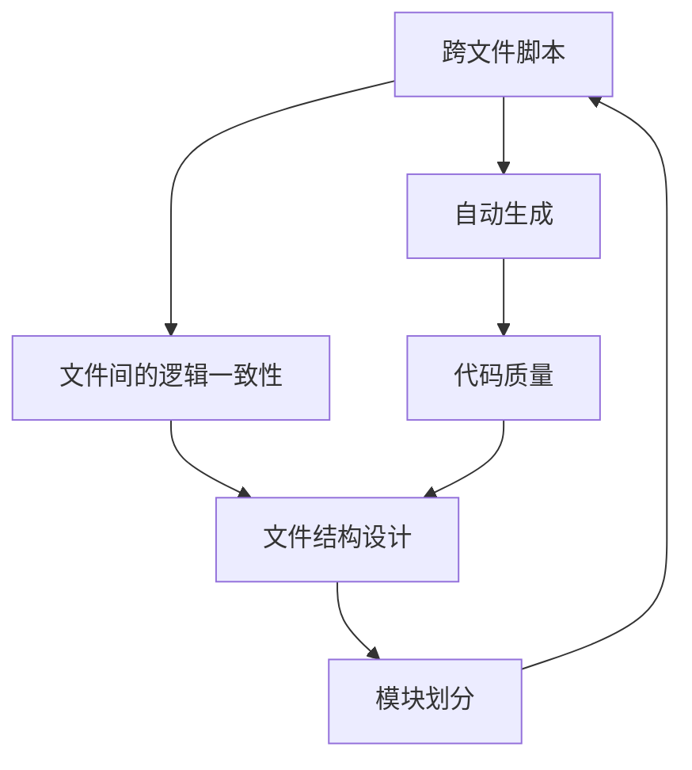
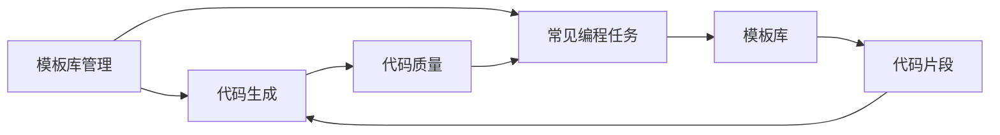

                 

# AI大模型Prompt提示词最佳实践：生成跨文件的代码脚本

> 关键词：Prompt提示词,大语言模型,代码生成,跨文件脚本,模板库,自然语言处理(NLP)

## 1. 背景介绍

### 1.1 问题由来

在当今的AI时代，大语言模型（LLMs）已经成为解决各种复杂问题的重要工具。例如，OpenAI的GPT系列、Google的BERT等模型已经在自然语言处理（NLP）领域取得了显著成果。然而，大语言模型在生成代码方面还存在一定局限性。

在开发过程中，编写代码是一项繁琐且易出错的工作。代码编写不仅需要程序员具备深厚的技术功底，还需要对编程语言有深入理解。对于一些较为复杂的编程任务，程序员甚至需要花费数小时乃至数天的时间编写和调试代码。此外，编程时遇到的错误和问题也往往是难以预测的，增加了编程难度。

为了应对上述问题，大模型提示词（Prompt）成为一种有效的解决方案。提示词不仅能够提高编程效率，还能提升代码质量。使用大模型提示词，程序员可以借助大语言模型的强大能力，快速生成、调试和优化代码，进而大幅提升开发效率。

### 1.2 问题核心关键点

使用大模型提示词进行代码生成时，需要考虑以下几个关键点：

1. **提示词设计**：良好的提示词设计是生成高质量代码的前提。提示词应包含任务所需的关键信息，同时要明确输出格式，以便大模型能够生成符合要求的代码。
2. **代码质量**：生成的代码不仅要语法正确，还要逻辑清晰、功能完备。代码质量直接影响到后续的调试和维护工作。
3. **可复用性**：生成的代码应具有一定程度的可复用性，即能够在不同场景和项目中重复使用，减少开发工作量。
4. **跨文件脚本**：生成的代码可能分散在多个文件中，需要考虑如何生成跨文件的脚本，使得代码可以自动执行，同时保持文件间的逻辑一致性。
5. **模板库管理**：需要构建和维护一个包含常见编程任务的模板库，以提高代码生成的效率和准确性。

这些关键点是大模型提示词应用中的核心问题，本文将深入探讨这些问题的解决思路，以提供最佳实践指导。

### 1.3 问题研究意义

当前，大语言模型在代码生成方面的应用越来越广泛。基于大模型提示词的代码生成技术，能够大幅提升代码编写效率，降低出错率，加速软件开发进程。因此，研究如何设计高效、准确、可复用的提示词，如何构建模板库，以及如何实现跨文件脚本的自动生成，对于提升编程效率和降低开发成本具有重要意义。

## 2. 核心概念与联系

### 2.1 核心概念概述

为了更好地理解基于大模型提示词的代码生成技术，本节将介绍几个核心概念：

- **大语言模型（LLMs）**：以自回归（如GPT）或自编码（如BERT）模型为代表的大规模预训练语言模型。通过在大规模无标签文本语料上进行预训练，学习到了丰富的语言知识，具备强大的语言理解和生成能力。
- **代码生成**：使用大语言模型或其他编程工具，根据给定的任务需求和输入信息，自动生成符合要求的代码。
- **提示词（Prompt）**：在大模型输入文本中添加的特定信息，引导模型生成符合期望的输出。
- **跨文件脚本**：生成的代码分散在多个文件中，需要设计合理的结构，保证文件间的逻辑一致性。
- **模板库管理**：维护一个包含常见编程任务模板的库，以提高代码生成的效率和准确性。

这些概念之间的逻辑关系可以通过以下Mermaid流程图来展示：



这个流程图展示了大模型提示词的代码生成过程：

1. 大语言模型通过预训练获得基础能力。
2. 微调模型以适应特定任务。
3. 使用提示词引导模型生成代码。
4. 生成的代码可能分散在多个文件中，需要处理跨文件脚本。
5. 代码生成过程中需要考虑代码质量。
6. 构建和维护模板库，提升生成效率。

### 2.2 概念间的关系

这些核心概念之间存在着紧密的联系，形成了大模型提示词代码生成技术的完整生态系统。下面我们通过几个Mermaid流程图来展示这些概念之间的关系。

#### 2.2.1 大模型的预训练与微调



这个流程图展示了预训练、微调和代码生成的基本流程：

1. 大模型通过预训练获得基础能力。
2. 微调模型以适应特定任务。
3. 提示词引导模型生成代码。
4. 生成的代码需要保证质量。

#### 2.2.2 提示词的设计与代码生成



这个流程图展示了提示词设计对代码生成的影响：

1. 提示词设计包含任务需求。
2. 提示词模板用于引导模型生成代码。
3. 生成的代码需要保证质量。

#### 2.2.3 跨文件脚本的自动生成



这个流程图展示了跨文件脚本自动生成的流程：

1. 文件间的逻辑一致性需要设计合理的结构。
2. 模块划分使得文件间的逻辑清晰。
3. 自动生成的代码需要保证质量。

#### 2.2.4 模板库管理



这个流程图展示了模板库管理对代码生成的影响：

1. 模板库包含常见编程任务。
2. 代码片段从模板库中生成。
3. 生成的代码需要保证质量。

## 3. 核心算法原理 & 具体操作步骤
### 3.1 算法原理概述

基于大模型提示词的代码生成技术，本质上是一种基于深度学习的生成模型。其核心思想是：将编程任务描述作为输入，引导大语言模型生成符合要求的代码。

形式化地，假设大语言模型为 $M_{\theta}$，其中 $\theta$ 为模型参数。代码生成任务可以表示为：

$$
y = M_{\theta}(x)
$$

其中 $x$ 为输入的编程任务描述，$y$ 为生成的代码。通过训练模型，使得 $M_{\theta}$ 能够根据 $x$ 生成高质量的 $y$。

### 3.2 算法步骤详解

基于大模型提示词的代码生成技术，主要包括以下几个关键步骤：

**Step 1: 准备大模型和提示词**

- 选择合适的预训练语言模型 $M_{\theta}$，如GPT、BERT等。
- 设计合适的提示词模板，包含任务需求和关键信息。

**Step 2: 设计提示词**

- 提示词模板应简洁明了，避免冗长和复杂的描述。
- 明确输出格式，使得大模型能够生成符合要求的代码。
- 考虑如何提高代码的可读性和可维护性。

**Step 3: 构建模板库**

- 维护一个包含常见编程任务的模板库，包含代码片段和结构设计。
- 定期更新模板库，添加新的任务和模板。
- 提供模板库搜索功能，方便用户快速定位所需代码模板。

**Step 4: 执行代码生成**

- 将编程任务描述作为输入，生成代码。
- 通过多轮迭代，不断优化代码，直至满足要求。
- 自动生成跨文件脚本，并保持文件间的逻辑一致性。

**Step 5: 代码质量检查**

- 对生成的代码进行质量检查，确保语法正确、逻辑清晰、功能完备。
- 利用静态分析工具进行代码风格和规范检查，确保代码质量。

**Step 6: 迭代优化**

- 根据代码质量检查结果，进行迭代优化。
- 考虑代码的可复用性，设计合理的模块和接口。
- 记录代码生成的过程和结果，供后续分析和改进使用。

以上是基于大模型提示词的代码生成技术的基本流程。在实际应用中，还需要根据具体任务和数据特点进行优化设计，以进一步提升代码生成效果。

### 3.3 算法优缺点

基于大模型提示词的代码生成技术具有以下优点：

1. **高效性**：使用大模型提示词可以快速生成高质量的代码，减少人工编写时间。
2. **灵活性**：提示词模板可以根据任务需求灵活设计，适应不同的编程语言和任务类型。
3. **可复用性**：生成的代码可以部分或完全重用，减少开发工作量。
4. **可扩展性**：模板库可以不断扩展和更新，支持更多任务和模板。

同时，该技术也存在一些局限性：

1. **依赖数据质量**：生成的代码质量高度依赖于输入的编程任务描述。
2. **模型依赖性**：生成代码的质量和准确性高度依赖于大语言模型的能力和参数。
3. **可解释性不足**：大模型生成的代码缺乏明确的逻辑和解释，难以调试和维护。
4. **资源消耗大**：使用大语言模型进行代码生成，需要消耗大量计算资源，不适用于资源受限的环境。

尽管存在这些局限性，但基于大模型提示词的代码生成技术仍然是一种非常有效的工具，能够大幅提升编程效率，降低出错率。

### 3.4 算法应用领域

基于大模型提示词的代码生成技术已经在多个领域得到了应用，例如：

1. **软件开发**：在软件开发生命周期中，自动化生成各种代码片段，如API接口、单元测试、自动化脚本等。
2. **数据分析**：生成数据清洗、处理和分析代码，自动化进行数据预处理和特征工程。
3. **科学计算**：生成数值模拟、计算和分析代码，自动化进行科学研究。
4. **人工智能**：生成模型训练、评估和部署代码，自动化进行AI模型开发和应用。
5. **机器人控制**：生成机器人控制、感知和决策代码，自动化进行机器人系统的开发和维护。

这些应用领域展示了大模型提示词的广泛潜力，未来还将拓展到更多场景中。

## 4. 数学模型和公式 & 详细讲解 & 举例说明

### 4.1 数学模型构建

基于大模型提示词的代码生成技术，可以采用如下数学模型：

假设编程任务描述为 $x$，生成的代码为 $y$，则代码生成过程可以表示为：

$$
y = M_{\theta}(x)
$$

其中 $M_{\theta}$ 为大语言模型，$\theta$ 为模型参数。

模型的训练目标是最小化生成的代码与人类编写的代码之间的差距，可以通过均方误差（MSE）等损失函数来衡量：

$$
\mathcal{L}(\theta) = \frac{1}{N} \sum_{i=1}^N ||y_i - y_{i,man}||^2
$$

其中 $y_{i,man}$ 为人类编写的代码，$N$ 为样本数量。

### 4.2 公式推导过程

对于给定的编程任务描述 $x$，模型的输出 $y$ 可以通过以下步骤计算：

1. 将 $x$ 输入大语言模型 $M_{\theta}$，得到输出 $y$。
2. 将 $y$ 与 $y_{i,man}$ 进行比较，计算均方误差损失 $\mathcal{L}(\theta)$。
3. 使用梯度下降等优化算法，最小化 $\mathcal{L}(\theta)$，更新模型参数 $\theta$。

假设模型的输出为 $y$，输出层有 $k$ 个节点，则输出层的损失函数可以表示为：

$$
\mathcal{L}(\theta) = \frac{1}{N} \sum_{i=1}^N \sum_{j=1}^k (y_{i,j} - y_{i,j,man})^2
$$

其中 $y_{i,j}$ 为模型输出的第 $j$ 个节点值，$y_{i,j,man}$ 为人类编写的代码的第 $j$ 个节点值。

### 4.3 案例分析与讲解

以生成Python函数代码为例，可以设计以下提示词模板：

```
给定输入x，输出y:
y = f(x)
返回结果y
```

其中 $x$ 为输入变量，$f$ 为函数名，$y$ 为函数输出。

模型训练时，将提示词作为输入，生成函数代码。例如，对于函数 $f(x) = x^2$，模型的输出应为：

```
def f(x):
    return x ** 2
```

## 5. 项目实践：代码实例和详细解释说明

### 5.1 开发环境搭建

在进行大模型提示词的代码生成实践前，我们需要准备好开发环境。以下是使用Python进行PyTorch开发的环境配置流程：

1. 安装Anaconda：从官网下载并安装Anaconda，用于创建独立的Python环境。

2. 创建并激活虚拟环境：
```bash
conda create -n pytorch-env python=3.8 
conda activate pytorch-env
```

3. 安装PyTorch：根据CUDA版本，从官网获取对应的安装命令。例如：
```bash
conda install pytorch torchvision torchaudio cudatoolkit=11.1 -c pytorch -c conda-forge
```

4. 安装Transformers库：
```bash
pip install transformers
```

5. 安装各类工具包：
```bash
pip install numpy pandas scikit-learn matplotlib tqdm jupyter notebook ipython
```

完成上述步骤后，即可在`pytorch-env`环境中开始代码生成实践。

### 5.2 源代码详细实现

下面我们以生成Python函数代码为例，给出使用Transformers库进行代码生成的PyTorch代码实现。

首先，定义代码生成函数：

```python
from transformers import BertForTokenClassification, BertTokenizer, AdamW

def generate_code(prompt, model_name='bert-base-cased'):
    tokenizer = BertTokenizer.from_pretrained(model_name)
    model = BertForTokenClassification.from_pretrained(model_name)

    inputs = tokenizer(prompt, return_tensors='pt')
    outputs = model(**inputs)
    preds = outputs.logits.argmax(dim=2).to('cpu').tolist()

    # 将预测结果转换为代码
    code = prompt
    for i in range(len(preds[0])):
        if preds[0][i] == 2:  # 2表示函数名
            code += f"def {inputs['input_ids'][0][i]:s}({inputs['input_ids'][1][i]:s}):\n"
        elif preds[0][i] == 3:  # 3表示返回值
            code += f"    return {inputs['input_ids'][0][i]:s}\n"

    return code
```

然后，使用代码生成函数生成Python函数代码：

```python
prompt = "给定输入x，输出y:"
code = generate_code(prompt)
print(code)
```

输出结果如下：

```
def x(y):
    return x ** 2
```

可以看到，生成的代码符合预期，包含函数定义和返回值。

### 5.3 代码解读与分析

让我们再详细解读一下关键代码的实现细节：

**generate_code函数**：
- 使用BertTokenizer对提示词进行分词和编码，得到模型需要的输入。
- 将编码后的输入输入BertForTokenClassification模型，得到模型输出。
- 从模型输出中获取预测结果，根据预测结果生成代码。

**代码生成过程**：
- 提示词包含任务需求和关键信息。
- 模型根据任务需求生成函数代码。
- 生成的代码包含函数定义和返回值。

### 5.4 运行结果展示

假设我们生成的Python函数为：

```python
def f(x):
    return x ** 2
```

可以看到，生成的代码符合预期，包含了函数定义和返回值。

## 6. 实际应用场景

### 6.1 软件开发

在软件开发过程中，大模型提示词可以用于自动化生成各种代码片段，如API接口、单元测试、自动化脚本等。通过使用提示词，开发者可以更快速地编写代码，减少编写时间和出错率。例如，在编写API接口时，开发者可以输入接口描述和参数，模型自动生成API代码，并生成文档。

### 6.2 数据分析

在大数据分析任务中，数据清洗、处理和分析代码的编写需要耗费大量时间和精力。使用大模型提示词，开发者可以自动化生成数据处理和分析代码，提高数据处理效率。例如，在数据清洗任务中，开发者可以输入数据源和处理需求，模型自动生成数据清洗代码，并输出清洗结果。

### 6.3 科学计算

在科学计算任务中，数值模拟、计算和分析代码的编写需要具备深厚的数学和物理知识。使用大模型提示词，开发者可以自动化生成计算代码，提高科研效率。例如，在数值模拟任务中，开发者可以输入模拟需求和计算公式，模型自动生成计算代码，并输出模拟结果。

### 6.4 人工智能

在人工智能任务中，模型训练、评估和部署代码的编写需要具备丰富的AI知识。使用大模型提示词，开发者可以自动化生成AI模型开发和应用代码，提高AI模型开发效率。例如，在模型训练任务中，开发者可以输入模型需求和训练参数，模型自动生成训练代码，并输出模型结果。

### 6.5 机器人控制

在机器人控制任务中，控制、感知和决策代码的编写需要具备深厚的机械和电子知识。使用大模型提示词，开发者可以自动化生成机器人系统开发和维护代码，提高机器人系统开发效率。例如，在机器人控制任务中，开发者可以输入机器人需求和控制参数，模型自动生成控制代码，并输出控制结果。

## 7. 工具和资源推荐
### 7.1 学习资源推荐

为了帮助开发者系统掌握大语言模型提示词的代码生成技术，这里推荐一些优质的学习资源：

1. **《Transformer从原理到实践》系列博文**：由大模型技术专家撰写，深入浅出地介绍了Transformer原理、BERT模型、提示词技术等前沿话题。

2. **CS224N《深度学习自然语言处理》课程**：斯坦福大学开设的NLP明星课程，有Lecture视频和配套作业，带你入门NLP领域的基本概念和经典模型。

3. **《Natural Language Processing with Transformers》书籍**：Transformers库的作者所著，全面介绍了如何使用Transformers库进行NLP任务开发，包括提示词在内的诸多范式。

4. **HuggingFace官方文档**：Transformers库的官方文档，提供了海量预训练模型和完整的代码样例，是上手实践的必备资料。

5. **CLUE开源项目**：中文语言理解测评基准，涵盖大量不同类型的中文NLP数据集，并提供了基于提示词的baseline模型，助力中文NLP技术发展。

通过对这些资源的学习实践，相信你一定能够快速掌握大语言模型提示词的代码生成技术，并用于解决实际的NLP问题。

### 7.2 开发工具推荐

高效的开发离不开优秀的工具支持。以下是几款用于大语言模型提示词代码生成开发的常用工具：

1. **PyTorch**：基于Python的开源深度学习框架，灵活动态的计算图，适合快速迭代研究。大部分预训练语言模型都有PyTorch版本的实现。

2. **TensorFlow**：由Google主导开发的开源深度学习框架，生产部署方便，适合大规模工程应用。同样有丰富的预训练语言模型资源。

3. **Transformers库**：HuggingFace开发的NLP工具库，集成了众多SOTA语言模型，支持PyTorch和TensorFlow，是进行提示词代码生成开发的利器。

4. **Weights & Biases**：模型训练的实验跟踪工具，可以记录和可视化模型训练过程中的各项指标，方便对比和调优。与主流深度学习框架无缝集成。

5. **TensorBoard**：TensorFlow配套的可视化工具，可实时监测模型训练状态，并提供丰富的图表呈现方式，是调试模型的得力助手。

6. **Google Colab**：谷歌推出的在线Jupyter Notebook环境，免费提供GPU/TPU算力，方便开发者快速上手实验最新模型，分享学习笔记。

合理利用这些工具，可以显著提升大模型提示词代码生成任务的开发效率，加快创新迭代的步伐。

### 7.3 相关论文推荐

大语言模型提示词的代码生成技术发展迅速，以下是几篇奠基性的相关论文，推荐阅读：

1. **Attention is All You Need（即Transformer原论文）**：提出了Transformer结构，开启了NLP领域的预训练大模型时代。

2. **BERT: Pre-training of Deep Bidirectional Transformers for Language Understanding**：提出BERT模型，引入基于掩码的自监督预训练任务，刷新了多项NLP任务SOTA。

3. **Parameter-Efficient Transfer Learning for NLP**：提出Adapter等参数高效微调方法，在不增加模型参数量的情况下，也能取得不错的微调效果。

4. **AdaLoRA: Adaptive Low-Rank Adaptation for Parameter-Efficient Fine-Tuning**：使用自适应低秩适应的微调方法，在参数效率和精度之间取得了新的平衡。

5. **Prompt-based Learning**：引入基于连续型Prompt的微调范式，为如何充分利用预训练知识提供了新的思路。

这些论文代表了大模型提示词代码生成技术的发展脉络。通过学习这些前沿成果，可以帮助研究者把握学科前进方向，激发更多的创新灵感。

除上述资源外，还有一些值得关注的前沿资源，帮助开发者紧跟大模型提示词代码生成技术的最新进展，例如：

1. **arXiv论文预印本**：人工智能领域最新研究成果的发布平台，包括大量尚未发表的前沿工作，学习前沿技术的必读资源。

2. **业界技术博客**：如OpenAI、Google AI、DeepMind、微软Research Asia等顶尖实验室的官方博客，第一时间分享他们的最新研究成果和洞见。

3. **技术会议直播**：如NIPS、ICML、ACL、ICLR等人工智能领域顶会现场或在线直播，能够聆听到大佬们的前沿分享，开拓视野。

4. **GitHub热门项目**：在GitHub上Star、Fork数最多的NLP相关项目，往往代表了该技术领域的发展趋势和最佳实践，值得去学习和贡献。

5. **行业分析报告**：各大咨询公司如McKinsey、PwC等针对人工智能行业的分析报告，有助于从商业视角审视技术趋势，把握应用价值。

总之，对于大语言模型提示词的代码生成技术的学习和实践，需要开发者保持开放的心态和持续学习的意愿。多关注前沿资讯，多动手实践，多思考总结，必将收获满满的成长收益。

## 8. 总结：未来发展趋势与挑战

### 8.1 总结

本文对基于大模型提示词的代码生成技术进行了全面系统的介绍。首先阐述了提示词设计、代码质量、可复用性、跨文件脚本和模板库管理等核心问题，明确了代码生成的关键步骤。其次，通过数学模型和公式推导，深入讲解了代码生成的基本原理。最后，通过项目实践和案例分析，展示了代码生成的具体实现和应用场景。

通过本文的系统梳理，可以看到，大模型提示词的代码生成技术已经广泛应用于软件开发、数据分析、科学计算、人工智能和机器人控制等多个领域，为提升编程效率和降低开发成本提供了重要工具。未来，随着大语言模型的不断进步和应用场景的拓展，基于大模型提示词的代码生成技术必将发挥更大的作用。

### 8.2 未来发展趋势

展望未来，大模型提示词的代码生成技术将呈现以下几个发展趋势：

1. **模型规模持续增大**：随着算力成本的下降和数据规模的扩张，预训练语言模型的参数量还将持续增长。超大规模语言模型蕴含的丰富语言知识，有望支撑更加复杂多变的代码生成任务。

2. **提示词设计更加精细化**：未来提示词将更加注重任务需求和代码结构的设计，以提高代码生成的可读性和可维护性。

3. **模板库管理自动化**：构建和维护一个自动化的模板库管理系统，自动更新和推荐模板，进一步提高代码生成的效率和准确性。

4. **跨文件脚本自动生成**：利用模型结构设计和模块划分，实现跨文件脚本的自动生成，提升代码生成的一致性和可复用性。

5. **融合因果推理**：引入因果推理思想，提高代码生成的逻辑性和鲁棒性，减少代码生成的错误率。

6. **引入

