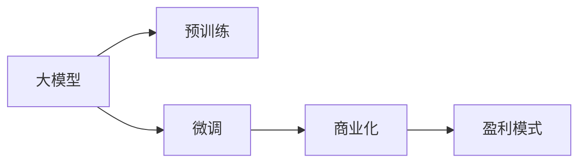

                 

# AI大模型创业：如何实现未来盈利？

## 1. 背景介绍

在人工智能技术的飞速发展下，大模型（Large Model）正在成为企业创业和竞争的关键。本文将深入探讨大模型的商业化和盈利模式，帮助您全面理解这一领域的商业模式和发展趋势。

### 1.1 大模型现状

大模型是基于深度学习技术构建的庞大参数量模型，通过自监督学习、迁移学习等方式，能够在特定的应用场景中实现高效的泛化和学习。目前，大模型在图像识别、自然语言处理、推荐系统等领域取得了突破性的进展。例如，OpenAI的GPT系列模型、Google的BERT等都展示了强大的应用潜力。

### 1.2 商业化需求

随着大模型的技术成熟，越来越多的企业看到了将其商业化并实现盈利的可能性。然而，如何将大模型的技术优势转化为商业价值，如何构建可持续的商业模式，成为创业者和企业的核心难题。本文将从以下几个方面进行探讨：技术实现、商业化策略、盈利模式和应用场景。

## 2. 核心概念与联系

### 2.1 核心概念概述

1. **大模型**：指基于深度学习技术，拥有大量参数量，具备强大泛化能力的模型。常见的有大规模语言模型、大规模视觉模型等。
2. **迁移学习**：指将在一个领域学到的知识迁移到另一个领域，以提升模型在新领域的表现。大模型常通过预训练和微调来实现迁移学习。
3. **微调（Fine-Tuning）**：指在大模型的基础上，使用特定的标注数据进行有监督学习，以优化模型在新任务上的表现。
4. **商业化**：指将技术产品化，并将其推向市场以获取收益的过程。
5. **盈利模式**：指企业在技术商业化后，通过产品销售、服务订阅、广告收入等方式实现收益的方式。

### 2.2 概念间的关系

通过Mermaid流程图，我们可以直观地展示这些核心概念之间的关系：



此图展示了从大模型的预训练和微调，到商业化和盈利模式的完整流程。

## 3. 核心算法原理 & 具体操作步骤

### 3.1 算法原理概述

大模型的商业化和盈利模式涉及多个关键步骤，包括数据准备、模型训练、模型微调、产品发布和市场推广。

1. **数据准备**：收集和预处理所需的数据集，以支持模型的预训练和微调。
2. **模型训练**：在收集的数据集上进行模型的预训练，获得泛化的能力。
3. **模型微调**：针对具体应用场景，使用特定标注数据对模型进行微调，优化其在目标任务上的表现。
4. **产品发布**：将微调后的模型封装成API或SDK，使其易于集成和使用。
5. **市场推广**：通过市场营销活动，将产品推向目标市场，并获取客户反馈。

### 3.2 算法步骤详解

以下是详细的算法步骤：

**Step 1: 数据准备**

- **数据收集**：从公开数据集、领域数据等渠道获取数据。
- **数据清洗**：去除噪声和异常值，确保数据质量。
- **数据增强**：通过数据增强技术，丰富训练集，提升模型鲁棒性。

**Step 2: 模型训练**

- **模型选择**：根据应用场景选择适合的模型，如BERT、GPT等。
- **超参数调优**：设置合适的学习率、批大小等超参数，进行模型训练。
- **模型评估**：在验证集上评估模型性能，确保模型泛化能力。

**Step 3: 模型微调**

- **任务适配层设计**：根据目标任务设计合适的输出层和损失函数。
- **微调参数设定**：选择适当的微调策略，如全参数微调或参数高效微调（PEFT）。
- **模型评估**：在测试集上评估模型性能，确保模型性能达标。

**Step 4: 产品发布**

- **API设计**：设计简单易用的API，方便用户集成和使用。
- **文档编写**：编写详细的使用文档和教程，帮助用户快速上手。
- **性能优化**：优化模型推理速度，确保产品高性能。

**Step 5: 市场推广**

- **市场营销**：通过社交媒体、网站等渠道进行市场推广，吸引用户。
- **用户反馈**：收集用户反馈，不断优化产品。
- **后续迭代**：根据用户反馈，不断迭代和改进产品。

### 3.3 算法优缺点

大模型的商业化和盈利模式有以下优点：

- **技术领先**：通过预训练和微调，快速获取技术优势。
- **市场潜力大**：大模型在多个领域具有广泛应用潜力，市场前景广阔。
- **可定制性强**：可以根据具体需求，定制优化模型，满足特定应用场景。

同时，也存在以下缺点：

- **数据依赖高**：需要大量高质量标注数据，数据获取成本高。
- **计算资源消耗大**：大模型的训练和微调需要大量计算资源，初期投入成本高。
- **市场竞争激烈**：大模型领域竞争激烈，获取市场份额难度大。

### 3.4 算法应用领域

大模型的商业化和盈利模式主要应用于以下几个领域：

1. **自然语言处理（NLP）**：如问答系统、机器翻译、文本摘要等。
2. **计算机视觉（CV）**：如图像识别、目标检测、图像生成等。
3. **推荐系统**：如电商推荐、内容推荐等。
4. **医疗健康**：如医学影像分析、药物研发等。
5. **金融领域**：如信用评分、风险评估等。

## 4. 数学模型和公式 & 详细讲解

### 4.1 数学模型构建

假设我们构建一个用于图像分类的大模型。首先定义模型的输入为图像特征向量 $X \in \mathbb{R}^{C \times H \times W}$，输出为分类概率 $Y \in \{0,1\}^C$。

定义模型 $M_\theta$，其中 $\theta$ 为模型参数。通过预训练获得初始参数 $\theta_0$，然后通过微调，更新模型参数 $\theta$，使得模型在特定分类任务上的性能提升。

### 4.2 公式推导过程

定义损失函数 $\mathcal{L}(\theta)$，用于衡量模型在训练集上的性能：

$$
\mathcal{L}(\theta) = -\frac{1}{N} \sum_{i=1}^N \log P(Y_i | X_i, \theta)
$$

其中 $P(Y_i | X_i, \theta)$ 表示模型在输入 $X_i$ 上输出为 $Y_i$ 的概率。

通过反向传播算法，计算损失函数对模型参数 $\theta$ 的梯度，更新参数：

$$
\theta \leftarrow \theta - \eta \nabla_{\theta} \mathcal{L}(\theta)
$$

其中 $\eta$ 为学习率，$\nabla_{\theta} \mathcal{L}(\theta)$ 为损失函数对参数 $\theta$ 的梯度。

### 4.3 案例分析与讲解

以BERT模型为例，假设我们希望在医疗领域构建一个疾病诊断模型。首先，在大规模医疗数据上对BERT进行预训练，然后针对特定疾病构建标注数据集，对模型进行微调。微调过程包括：

1. **任务适配层设计**：添加疾病标签输出层，并使用交叉熵损失函数。
2. **微调策略**：仅微调模型顶层，固定底层的预训练参数。
3. **模型评估**：在测试集上评估模型性能，确保诊断准确率达标。

## 5. 项目实践：代码实例和详细解释说明

### 5.1 开发环境搭建

以下是使用Python和TensorFlow搭建大模型项目的步骤：

1. **安装Python和TensorFlow**：
```bash
pip install tensorflow
```

2. **准备数据集**：
```bash
# 假设数据集存储在local/data目录下
```

3. **编写代码**：
```python
import tensorflow as tf
from transformers import BertTokenizer, TFBertForSequenceClassification

# 加载BERT模型和分词器
model = TFBertForSequenceClassification.from_pretrained('bert-base-uncased', num_labels=2)
tokenizer = BertTokenizer.from_pretrained('bert-base-uncased')

# 准备数据集
train_dataset = tf.data.Dataset.from_tensor_slices(train_texts, train_labels)
train_dataset = train_dataset.shuffle(buffer_size=1024)
train_dataset = train_dataset.batch(batch_size=32)

# 构建模型
model.compile(optimizer=tf.keras.optimizers.Adam(learning_rate=2e-5),
              loss=tf.keras.losses.SparseCategoricalCrossentropy(from_logits=True),
              metrics=[tf.keras.metrics.SparseCategoricalAccuracy()])

# 训练模型
model.fit(train_dataset, epochs=3)
```

### 5.2 源代码详细实现

以上代码展示了使用TensorFlow和Transformers库搭建BERT模型的基本流程。具体步骤如下：

1. **加载模型和分词器**：使用预训练的BERT模型和分词器，加载到TensorFlow中。
2. **准备数据集**：将训练数据集转换为TensorFlow的DataDataset对象，并进行批处理和洗牌。
3. **构建模型**：定义模型的优化器、损失函数和评估指标。
4. **训练模型**：使用fit方法进行模型训练，设置训练轮数。

### 5.3 代码解读与分析

代码中，我们使用了TensorFlow的高阶API和Transformers库，简化了模型搭建和训练流程。通过设置合适的学习率、损失函数和评估指标，我们能够快速构建和训练出高效的BERT模型。

## 6. 实际应用场景

### 6.1 医疗健康

在医疗领域，大模型可以用于疾病诊断、药物研发等任务。例如，在疾病诊断方面，可以通过收集和预处理医疗影像数据，在预训练的BERT模型上进行微调，实现疾病识别和诊断。

### 6.2 金融领域

在金融领域，大模型可以用于信用评分、风险评估等任务。例如，通过收集和预处理金融数据，在预训练的BERT模型上进行微调，实现对客户信用评分和风险评估。

### 6.3 零售电商

在零售电商领域，大模型可以用于推荐系统和个性化推荐等任务。例如，通过收集和预处理用户行为数据，在预训练的BERT模型上进行微调，实现精准推荐和个性化推荐。

## 7. 工具和资源推荐

### 7.1 学习资源推荐

以下是几个有用的学习资源：

1. **Coursera**：提供深度学习和自然语言处理课程，涵盖模型训练和微调的基本原理。
2. **Kaggle**：提供大量数据集和比赛，通过实战练习，提升模型微调技能。
3. **Arxiv**：提供最新的人工智能研究论文，了解前沿技术和研究动态。

### 7.2 开发工具推荐

以下是几个常用的开发工具：

1. **Jupyter Notebook**：提供交互式的编程环境，方便进行模型训练和微调。
2. **GitHub**：提供代码版本控制和协作开发平台，方便团队合作和代码共享。
3. **TensorBoard**：提供模型训练和推理的可视化工具，方便监控模型性能。

### 7.3 相关论文推荐

以下是几篇有用的论文：

1. **Attention is All You Need**：介绍Transformer模型的基本原理和架构。
2. **BERT: Pre-training of Deep Bidirectional Transformers for Language Understanding**：提出BERT模型，介绍其在自然语言处理中的应用。
3. **Transformers with Stable Diffusion: Coaxing Pre-trained Models to Generate Precise, Detailed Images**：介绍如何使用大模型进行图像生成和优化。

## 8. 总结：未来发展趋势与挑战

### 8.1 研究成果总结

大模型在各个领域的应用和商业化，展示了其强大的技术潜力和市场前景。通过对预训练和微调技术的不断优化，大模型能够实现高效的学习和泛化。

### 8.2 未来发展趋势

未来，大模型的商业化和盈利模式将呈现以下几个趋势：

1. **多模态融合**：大模型将支持多模态数据（如文本、图像、声音）的融合，提升模型的综合应用能力。
2. **联邦学习**：通过分布式计算和数据隐私保护技术，实现模型的联合训练和优化。
3. **跨领域迁移**：大模型将具备更强的跨领域迁移能力，支持在多个领域和场景中的应用。

### 8.3 面临的挑战

尽管大模型的商业化和盈利模式具有广阔前景，但也面临诸多挑战：

1. **数据隐私和安全**：如何在保证数据隐私和安全的前提下，进行模型的训练和优化。
2. **模型鲁棒性和泛化性**：如何提高模型的鲁棒性和泛化能力，避免过拟合和性能下降。
3. **计算资源消耗**：如何高效利用计算资源，实现大模型的训练和微调。

### 8.4 研究展望

未来，大模型的商业化和盈利模式还需要在以下几个方面进行深入研究：

1. **联邦学习**：探索分布式训练和优化技术，提升模型的跨领域迁移能力。
2. **隐私保护**：研究数据隐私和安全保护技术，确保模型的训练和应用符合法律法规。
3. **模型优化**：研究高效的模型压缩和优化技术，提升模型的推理速度和性能。

## 9. 附录：常见问题与解答

**Q1: 大模型的训练和微调需要哪些硬件资源？**

A: 大模型的训练和微调需要高性能的GPU/TPU等硬件资源，一般建议使用NVIDIA V100、A100等高性能设备，以加速模型训练和推理。

**Q2: 如何优化大模型的推理速度？**

A: 可以通过模型压缩、量化和剪枝等技术，优化大模型的推理速度。同时，使用高效的推理框架（如TensorRT）和算法（如卷积神经网络），提升模型推理效率。

**Q3: 如何处理大模型的过拟合问题？**

A: 可以通过数据增强、正则化、对抗训练等技术，缓解大模型的过拟合问题。同时，采用参数高效微调方法（如Adapter），仅微调顶层，固定预训练参数，避免过拟合。

**Q4: 大模型的商业化和盈利模式有哪些？**

A: 大模型的商业化和盈利模式包括API服务、SDK集成、订阅服务等。通过将大模型封装成标准API或SDK，方便用户集成和使用，同时获取订阅费用和授权收入。

通过本文的系统梳理，您将对大模型的商业化和盈利模式有更深入的理解。未来，随着技术的不断进步，大模型的应用和盈利将更加广泛和深入，为各行业带来新的变革和发展机会。

