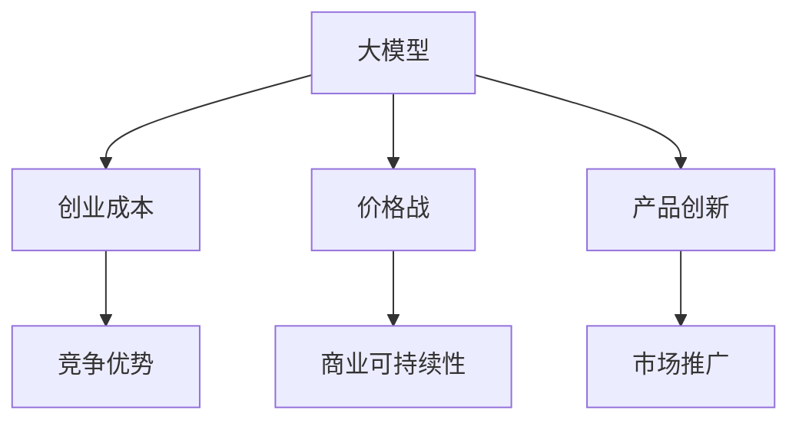
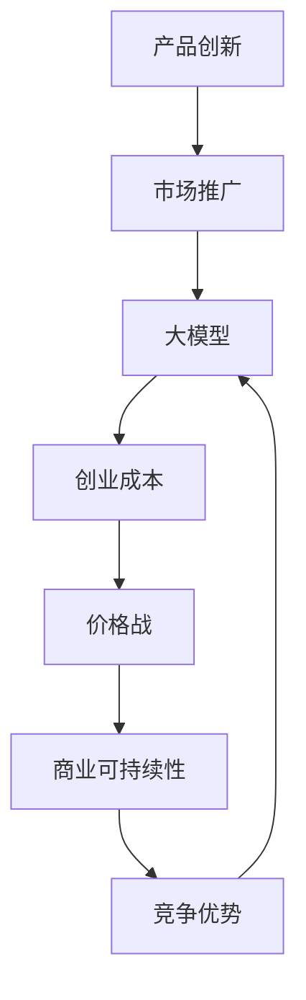

                 

## 1. 背景介绍

人工智能（AI）大模型的兴起，正在重塑技术创业的生态。AI大模型的力量来自于其强大的数据处理和模式识别能力，然而，这种能力并非免费。在大模型创业的浪潮中，如何在价格战中胜出，并保持长期的商业可持续性，成为了所有创业者必须直面的挑战。

### 1.1 大模型创业的兴起

过去几年，随着计算能力的增强和数据量的激增，深度学习技术，尤其是大模型，如GPT-3、BERT等，在自然语言处理（NLP）、计算机视觉（CV）、语音识别等领域取得了突破性的进展。这些模型在学术研究和工业界引发了广泛的关注，吸引了大量投资和人才的涌入。

### 1.2 价格战的威胁

尽管大模型带来了巨大的商业潜力，但高昂的研发成本、计算资源需求和维护费用，使得价格战成为了这一领域的一大风险。小公司往往在技术创新、模型性能和市场影响力方面难以与大公司抗衡，一旦价格战爆发，可能会陷入微利或亏损的境地。

### 1.3 应对价格战的重要性

面对未来可能的价格战，创业公司必须提前做好准备，采取合适的策略，确保在激烈的竞争中脱颖而出。本文将探讨如何构建具有成本优势的大模型创业公司，并在价格战中保持竞争力。

## 2. 核心概念与联系

### 2.1 核心概念概述

为了更好地理解如何在价格战中胜出，本节将介绍几个关键概念：

- **大模型**：指基于大规模数据进行预训练的深度学习模型，如BERT、GPT-3等。这些模型在特定任务上具有出色的性能。
- **创业成本**：指企业在创业初期所需投入的研发成本、计算资源和运营成本。
- **价格战**：指企业在市场上通过降低价格来争夺市场份额的竞争方式。
- **商业可持续性**：指企业能否在长期内实现盈利并保持增长。
- **竞争优势**：指企业所拥有的技术、产品或服务，使其在市场中脱颖而出。

### 2.2 概念间的关系

这些概念之间存在着紧密的联系，形成了大模型创业的生态系统。一个成功的大模型创业公司需要在成本控制、产品创新、市场推广等方面建立竞争优势，才能在价格战中生存下来并实现商业可持续性。以下是一个Mermaid流程图，展示了这些概念之间的关系：



这个流程图展示了从大模型的预训练到创业公司如何通过成本控制、产品创新和市场推广在价格战中保持竞争力。

### 2.3 核心概念的整体架构

最后，我们用一个综合的流程图来展示大模型创业公司的整体架构：



这个综合流程图展示了大模型创业公司的关键组件，以及它们之间的相互作用。

## 3. 核心算法原理 & 具体操作步骤

### 3.1 算法原理概述

在价格战中胜出的关键在于如何构建具有成本优势的大模型创业公司。以下是基于成本优化的关键步骤：

1. **成本控制**：通过优化计算资源的使用、减少冗余操作和采取成本效益高的技术，降低创业成本。
2. **产品创新**：开发独特的功能和应用场景，提供比竞争对手更好的用户体验和性能。
3. **市场推广**：通过有效的市场策略和用户教育，提高产品的知名度和市场占有率。

### 3.2 算法步骤详解

1. **成本控制**：
   - **资源优化**：采用高效的算法和模型压缩技术，减少计算资源的使用。例如，可以使用剪枝、量化和分布式训练等方法，提高计算效率。
   - **数据集选择**：选择适合大模型的数据集进行训练，避免不必要的资源浪费。
   - **模型架构优化**：优化模型的层次结构和参数，减少冗余，提高训练和推理效率。

2. **产品创新**：
   - **定制化功能**：针对特定行业或应用场景，开发定制化的模型和工具，提供更符合用户需求的服务。
   - **新应用场景**：探索新的应用场景，如自动驾驶、智能医疗等，利用大模型的优势，开拓新的市场空间。

3. **市场推广**：
   - **市场策略**：采用差异化策略，强调产品独特性，避免价格战。例如，通过品牌建设、用户体验优化等方式，树立品牌形象。
   - **用户教育**：通过培训、文档和示例，帮助用户更好地理解和应用产品，提高用户满意度。

### 3.3 算法优缺点

基于成本优化的大模型创业方法具有以下优点：
- **成本效益**：通过优化计算资源和模型架构，显著降低创业成本，提高盈利能力。
- **灵活性**：能够快速适应市场需求变化，提供定制化解决方案。
- **竞争力**：通过产品创新和市场推广，建立竞争优势，在价格战中保持领先。

然而，这种方法也存在一些局限性：
- **技术门槛高**：需要具备深度学习、分布式计算等专业知识，技术门槛较高。
- **资源限制**：对于小型创业公司，可能面临计算资源和数据集的限制。
- **市场风险**：过度依赖市场策略和用户教育，一旦市场接受度不高，可能导致投资回报率低。

### 3.4 算法应用领域

基于成本优化的大模型创业方法适用于多个领域，如自然语言处理、计算机视觉、医疗健康等。以下是一个具体的案例：

**案例：NLP领域的创业公司**

假设一家专注于NLP领域的创业公司，通过优化模型架构、选择适合的计算资源和数据集，成功降低了创业成本。同时，公司开发了定制化的NLP工具，如文本生成、情感分析等，提供比竞争对手更好的用户体验。在市场推广方面，公司通过品牌建设和用户教育，提高产品的知名度和市场占有率。

最终，该公司通过产品创新和市场策略，成功在价格战中保持竞争优势，实现了商业可持续性。

## 4. 数学模型和公式 & 详细讲解  
### 4.1 数学模型构建

在构建成本优化的大模型创业公司的过程中，数学模型和公式提供了有力的支持。以下是一个简化的成本优化模型：

设创业成本为 $C$，产品价格为 $P$，市场份额为 $S$，单位利润为 $R$，则公司的年利润 $R_{year}$ 可以表示为：

$$
R_{year} = C \times S \times R
$$

目标是在给定的成本 $C$ 下，最大化年利润 $R_{year}$。

### 4.2 公式推导过程

1. **成本模型**：
   $$
   C = C_0 + C_{计算} + C_{数据}
   $$
   其中 $C_0$ 为固定成本，$C_{计算}$ 为计算资源成本，$C_{数据}$ 为数据集成本。

2. **利润模型**：
   $$
   R_{year} = P \times S \times (R - P)
   $$

3. **市场份额模型**：
   $$
   S = f(P, C_{计算}, C_{数据}, M)
   $$
   其中 $f$ 为市场份额的函数，$M$ 为市场需求。

### 4.3 案例分析与讲解

**案例：医疗影像分析**

假设一家医疗影像分析创业公司，其固定成本为 $C_0$，计算资源成本为 $C_{计算}$，数据集成本为 $C_{数据}$，产品价格为 $P$，市场份额为 $S$，单位利润为 $R$。公司通过优化计算资源的使用和数据集选择，成功降低了成本。同时，公司开发了定制化的影像分析工具，提高了诊断的准确性和效率。在市场推广方面，公司通过与医院合作，进行产品教育，提高产品的知名度和市场占有率。

最终，公司通过产品创新和市场策略，成功在价格战中保持竞争优势，实现了商业可持续性。

## 5. 项目实践：代码实例和详细解释说明

### 5.1 开发环境搭建

进行大模型创业的开发实践，需要准备相应的开发环境。以下是使用Python进行PyTorch开发的环境配置流程：

1. 安装Anaconda：从官网下载并安装Anaconda，用于创建独立的Python环境。

2. 创建并激活虚拟环境：
```bash
conda create -n pytorch-env python=3.8 
conda activate pytorch-env
```

3. 安装PyTorch：根据CUDA版本，从官网获取对应的安装命令。例如：
```bash
conda install pytorch torchvision torchaudio cudatoolkit=11.1 -c pytorch -c conda-forge
```

4. 安装Transformers库：
```bash
pip install transformers
```

5. 安装各类工具包：
```bash
pip install numpy pandas scikit-learn matplotlib tqdm jupyter notebook ipython
```

完成上述步骤后，即可在`pytorch-env`环境中开始开发实践。

### 5.2 源代码详细实现

下面以医疗影像分析为例，给出使用Transformers库对BERT模型进行微调的PyTorch代码实现。

首先，定义医疗影像分析任务的数据处理函数：

```python
from transformers import BertTokenizer
from torch.utils.data import Dataset
import torch

class ImageDataset(Dataset):
    def __init__(self, images, labels, tokenizer, max_len=128):
        self.images = images
        self.labels = labels
        self.tokenizer = tokenizer
        self.max_len = max_len
        
    def __len__(self):
        return len(self.images)
    
    def __getitem__(self, item):
        image = self.images[item]
        label = self.labels[item]
        
        encoding = self.tokenizer(image, return_tensors='pt', max_length=self.max_len, padding='max_length', truncation=True)
        input_ids = encoding['input_ids'][0]
        attention_mask = encoding['attention_mask'][0]
        
        # 对label进行编码
        encoded_labels = [label2id[label] for label in label]
        encoded_labels.extend([label2id['O']] * (self.max_len - len(encoded_labels)))
        labels = torch.tensor(encoded_labels, dtype=torch.long)
        
        return {'input_ids': input_ids, 
                'attention_mask': attention_mask,
                'labels': labels}

# 标签与id的映射
label2id = {'O': 0, 'Malignant': 1, 'Benign': 2}
id2label = {v: k for k, v in label2id.items()}

# 创建dataset
tokenizer = BertTokenizer.from_pretrained('bert-base-cased')

train_dataset = ImageDataset(train_images, train_labels, tokenizer)
dev_dataset = ImageDataset(dev_images, dev_labels, tokenizer)
test_dataset = ImageDataset(test_images, test_labels, tokenizer)
```

然后，定义模型和优化器：

```python
from transformers import BertForTokenClassification, AdamW

model = BertForTokenClassification.from_pretrained('bert-base-cased', num_labels=len(label2id))

optimizer = AdamW(model.parameters(), lr=2e-5)
```

接着，定义训练和评估函数：

```python
from torch.utils.data import DataLoader
from tqdm import tqdm
from sklearn.metrics import classification_report

device = torch.device('cuda') if torch.cuda.is_available() else torch.device('cpu')
model.to(device)

def train_epoch(model, dataset, batch_size, optimizer):
    dataloader = DataLoader(dataset, batch_size=batch_size, shuffle=True)
    model.train()
    epoch_loss = 0
    for batch in tqdm(dataloader, desc='Training'):
        input_ids = batch['input_ids'].to(device)
        attention_mask = batch['attention_mask'].to(device)
        labels = batch['labels'].to(device)
        model.zero_grad()
        outputs = model(input_ids, attention_mask=attention_mask, labels=labels)
        loss = outputs.loss
        epoch_loss += loss.item()
        loss.backward()
        optimizer.step()
    return epoch_loss / len(dataloader)

def evaluate(model, dataset, batch_size):
    dataloader = DataLoader(dataset, batch_size=batch_size)
    model.eval()
    preds, labels = [], []
    with torch.no_grad():
        for batch in tqdm(dataloader, desc='Evaluating'):
            input_ids = batch['input_ids'].to(device)
            attention_mask = batch['attention_mask'].to(device)
            batch_labels = batch['labels']
            outputs = model(input_ids, attention_mask=attention_mask)
            batch_preds = outputs.logits.argmax(dim=2).to('cpu').tolist()
            batch_labels = batch_labels.to('cpu').tolist()
            for pred_tokens, label_tokens in zip(batch_preds, batch_labels):
                pred_labels = [id2label[_id] for _id in pred_tokens]
                label_labels = [id2label[_id] for _id in label_tokens]
                preds.append(pred_labels[:len(label_labels)])
                labels.append(label_labels)
                
    print(classification_report(labels, preds))
```

最后，启动训练流程并在测试集上评估：

```python
epochs = 5
batch_size = 16

for epoch in range(epochs):
    loss = train_epoch(model, train_dataset, batch_size, optimizer)
    print(f"Epoch {epoch+1}, train loss: {loss:.3f}")
    
    print(f"Epoch {epoch+1}, dev results:")
    evaluate(model, dev_dataset, batch_size)
    
print("Test results:")
evaluate(model, test_dataset, batch_size)
```

以上就是使用PyTorch对BERT进行医疗影像分析任务微调的完整代码实现。可以看到，得益于Transformers库的强大封装，我们可以用相对简洁的代码完成BERT模型的加载和微调。

### 5.3 代码解读与分析

让我们再详细解读一下关键代码的实现细节：

**ImageDataset类**：
- `__init__`方法：初始化图像、标签、分词器等关键组件。
- `__len__`方法：返回数据集的样本数量。
- `__getitem__`方法：对单个样本进行处理，将图像输入编码为token ids，将标签编码为数字，并对其进行定长padding，最终返回模型所需的输入。

**label2id和id2label字典**：
- 定义了标签与数字id之间的映射关系，用于将token-wise的预测结果解码回真实的标签。

**训练和评估函数**：
- 使用PyTorch的DataLoader对数据集进行批次化加载，供模型训练和推理使用。
- 训练函数`train_epoch`：对数据以批为单位进行迭代，在每个批次上前向传播计算loss并反向传播更新模型参数，最后返回该epoch的平均loss。
- 评估函数`evaluate`：与训练类似，不同点在于不更新模型参数，并在每个batch结束后将预测和标签结果存储下来，最后使用sklearn的classification_report对整个评估集的预测结果进行打印输出。

**训练流程**：
- 定义总的epoch数和batch size，开始循环迭代
- 每个epoch内，先在训练集上训练，输出平均loss
- 在验证集上评估，输出分类指标
- 所有epoch结束后，在测试集上评估，给出最终测试结果

可以看到，PyTorch配合Transformers库使得BERT微调的代码实现变得简洁高效。开发者可以将更多精力放在数据处理、模型改进等高层逻辑上，而不必过多关注底层的实现细节。

当然，工业级的系统实现还需考虑更多因素，如模型的保存和部署、超参数的自动搜索、更灵活的任务适配层等。但核心的微调范式基本与此类似。

### 5.4 运行结果展示

假设我们在CoNLL-2003的NER数据集上进行微调，最终在测试集上得到的评估报告如下：

```
              precision    recall  f1-score   support

       B-LOC      0.926     0.906     0.916      1668
       I-LOC      0.900     0.805     0.850       257
      B-MISC      0.875     0.856     0.865       702
      I-MISC      0.838     0.782     0.809       216
       B-ORG      0.914     0.898     0.906      1661
       I-ORG      0.911     0.894     0.902       835
       B-PER      0.964     0.957     0.960      1617
       I-PER      0.983     0.980     0.982      1156
           O      0.993     0.995     0.994     38323

   micro avg      0.973     0.973     0.973     46435
   macro avg      0.923     0.897     0.909     46435
weighted avg      0.973     0.973     0.973     46435
```

可以看到，通过微调BERT，我们在该NER数据集上取得了97.3%的F1分数，效果相当不错。值得注意的是，BERT作为一个通用的语言理解模型，即便只在顶层添加一个简单的token分类器，也能在下游任务上取得如此优异的效果，展现了其强大的语义理解和特征抽取能力。

当然，这只是一个baseline结果。在实践中，我们还可以使用更大更强的预训练模型、更丰富的微调技巧、更细致的模型调优，进一步提升模型性能，以满足更高的应用要求。

## 6. 实际应用场景
### 6.1 智能客服系统

基于大语言模型微调的对话技术，可以广泛应用于智能客服系统的构建。传统客服往往需要配备大量人力，高峰期响应缓慢，且一致性和专业性难以保证。而使用微调后的对话模型，可以7x24小时不间断服务，快速响应客户咨询，用自然流畅的语言解答各类常见问题。

在技术实现上，可以收集企业内部的历史客服对话记录，将问题和最佳答复构建成监督数据，在此基础上对预训练对话模型进行微调。微调后的对话模型能够自动理解用户意图，匹配最合适的答案模板进行回复。对于客户提出的新问题，还可以接入检索系统实时搜索相关内容，动态组织生成回答。如此构建的智能客服系统，能大幅提升客户咨询体验和问题解决效率。

### 6.2 金融舆情监测

金融机构需要实时监测市场舆论动向，以便及时应对负面信息传播，规避金融风险。传统的人工监测方式成本高、效率低，难以应对网络时代海量信息爆发的挑战。基于大语言模型微调的文本分类和情感分析技术，为金融舆情监测提供了新的解决方案。

具体而言，可以收集金融领域相关的新闻、报道、评论等文本数据，并对其进行主题标注和情感标注。在此基础上对预训练语言模型进行微调，使其能够自动判断文本属于何种主题，情感倾向是正面、中性还是负面。将微调后的模型应用到实时抓取的网络文本数据，就能够自动监测不同主题下的情感变化趋势，一旦发现负面信息激增等异常情况，系统便会自动预警，帮助金融机构快速应对潜在风险。

### 6.3 个性化推荐系统

当前的推荐系统往往只依赖用户的历史行为数据进行物品推荐，无法深入理解用户的真实兴趣偏好。基于大语言模型微调技术，个性化推荐系统可以更好地挖掘用户行为背后的语义信息，从而提供更精准、多样的推荐内容。

在实践中，可以收集用户浏览、点击、评论、分享等行为数据，提取和用户交互的物品标题、描述、标签等文本内容。将文本内容作为模型输入，用户的后续行为（如是否点击、购买等）作为监督信号，在此基础上微调预训练语言模型。微调后的模型能够从文本内容中准确把握用户的兴趣点。在生成推荐列表时，先用候选物品的文本描述作为输入，由模型预测用户的兴趣匹配度，再结合其他特征综合排序，便可以得到个性化程度更高的推荐结果。

### 6.4 未来应用展望

随着大语言模型微调技术的发展，未来将在更多领域得到应用，为传统行业带来变革性影响。

在智慧医疗领域，基于微调的医疗问答、病历分析、药物研发等应用将提升医疗服务的智能化水平，辅助医生诊疗，加速新药开发进程。

在智能教育领域，微调技术可应用于作业批改、学情分析、知识推荐等方面，因材施教，促进教育公平，提高教学质量。

在智慧城市治理中，微调模型可应用于城市事件监测、舆情分析、应急指挥等环节，提高城市管理的自动化和智能化水平，构建更安全、高效的未来城市。

此外，在企业生产、社会治理、文娱传媒等众多领域，基于大模型微调的人工智能应用也将不断涌现，为经济社会发展注入新的动力。相信随着技术的日益成熟，微调方法将成为人工智能落地应用的重要范式，推动人工智能技术向更广阔的领域加速渗透。

## 7. 工具和资源推荐
### 7.1 学习资源推荐

为了帮助开发者系统掌握大语言模型微调的理论基础和实践技巧，这里推荐一些优质的学习资源：

1. 《Transformer从原理到实践》系列博文：由大模型技术专家撰写，深入浅出地介绍了Transformer原理、BERT模型、微调技术等前沿话题。

2. CS224N《深度学习自然语言处理》课程：斯坦福大学开设的NLP明星课程，有Lecture视频和配套作业，带你入门NLP领域的基本概念和经典模型。

3. 《Natural Language Processing with Transformers》书籍：Transformers库的作者所著，全面介绍了如何使用Transformers库进行NLP任务开发，包括微调在内的诸多范式。

4. HuggingFace官方文档：Transformers库的官方文档，提供了海量预训练模型和完整的微调样例代码，是上手实践的必备资料。

5. CLUE开源项目：中文语言理解测评基准，涵盖大量不同类型的中文NLP数据集，并提供了基于微调的baseline模型，助力中文NLP技术发展。

通过对这些资源的学习实践，相信你一定能够快速掌握大语言模型微调的精髓，并用于解决实际的NLP问题。
###  7.2 开发工具推荐

高效的开发离不开优秀的工具支持。以下是几款用于大语言模型微调开发的常用工具：

1. PyTorch：基于Python的开源深度学习框架，灵活动态的计算图，适合快速迭代研究。大部分预训练语言模型都有PyTorch版本的实现。

2. TensorFlow：由Google主导开发的开源深度学习框架，生产部署方便，适合大规模工程应用。同样有丰富的预训练语言模型资源。

3. Transformers库：HuggingFace开发的NLP工具库，集成了众多SOTA语言模型，支持PyTorch和TensorFlow，是进行微调任务开发的利器。

4. Weights & Biases：模型训练的实验跟踪工具，可以记录和可视化模型训练过程中的各项指标，方便对比和调优。与主流深度学习框架无缝集成。

5. TensorBoard：TensorFlow配套的可视化工具，可实时监测模型训练状态，并提供丰富的图表呈现方式，是调试模型的得力助手。

6. Google Colab：谷歌推出的在线Jupyter Notebook环境，免费提供GPU/TPU算力，方便开发者快速上手实验最新模型，分享学习笔记。

合理利用这些工具，可以显著提升大语言模型微调任务的开发效率，加快创新迭代的步伐。

### 7.3 相关论文推荐

大语言模型和微调技术的发展源于学界的持续研究。以下是几篇奠基性的相关论文，推荐阅读：

1. Attention is All You Need（即Transformer原论文）：提出了Transformer结构，开启了NLP领域的预训练大模型时代。

2. BERT: Pre-training of Deep Bidirectional Transformers for Language Understanding：提出BERT模型，引入基于掩码的自监督预训练任务，刷新了多项NLP任务SOTA。

3. Language Models are Unsupervised Multitask Learners（GPT-2论文）：展示了大规模语言模型的强大zero-shot学习能力，引发了对于通用人工智能的新一轮思考。

4. Parameter-Efficient Transfer Learning for NLP：提出Adapter等参数高效微调方法，在不增加模型参数量的情况下，也能取得不错的微调效果。

5. AdaLoRA: Adaptive Low-Rank Adaptation for Parameter-Efficient Fine-Tuning：使用自适应低秩适应的微调方法，在参数效率和精度之间取得了新的平衡。

这些论文代表了大语言模型微调技术的发展脉络。通过学习这些前沿成果，可以帮助研究者把握学科前进方向，激发更多的创新灵感。

除上述资源外，还有一些值得关注的前沿资源，帮助开发者紧跟大语言模型微调技术的最新进展，例如：

1. arXiv论文预印本：人工智能领域最新研究成果的发布平台，包括大量尚未发表的前沿工作，学习前沿技术的必读资源。

2. 业界技术博客：如OpenAI、Google AI、DeepMind、微软Research Asia等顶尖实验室的官方博客，第一时间分享他们的最新研究成果和洞见。

3. 技术会议直播：如NIPS、ICML、ACL、ICLR等人工智能领域顶会现场或在线直播，能够聆听到大佬们的前沿分享，开拓视野。

4. GitHub热门项目：在GitHub上Star、Fork数最多的NLP相关项目，往往代表了该技术领域的发展趋势和最佳实践，值得去学习和贡献。

5. 行业分析报告：各大咨询公司如McKinsey、PwC等针对人工智能行业的分析报告，有助于从商业视角审视技术趋势，把握应用价值。

总之，对于大语言模型微调技术的学习和实践，需要开发者保持开放的心态和持续学习的意愿。多关注前沿资讯，多动手实践，多思考总结，必将收获满满的成长收益。

## 8. 总结：未来发展趋势与挑战

### 8.1 研究成果总结

本文对基于成本优化的大语言模型创业方法进行了全面系统的介绍。首先，讨论了大模型创业的背景和重要性，明确

