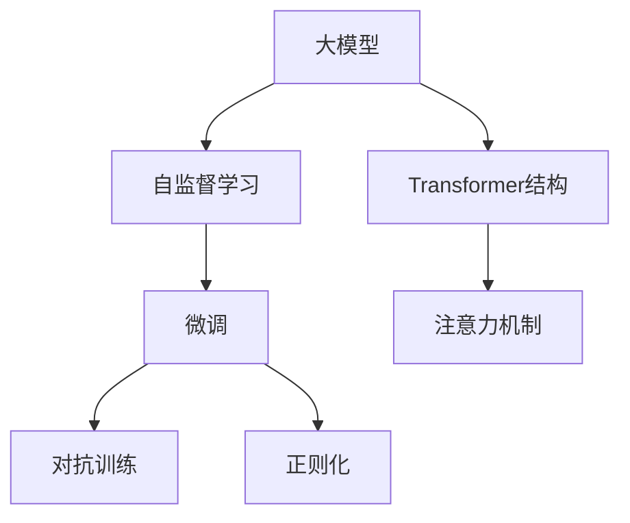

                 

# AI大模型题材的追捧潮

## 1. 背景介绍

### 1.1 问题由来
近年来，人工智能领域涌现出了一系列令人瞩目的大模型，它们以巨大的参数规模和强大的推理能力，展示了AI技术的最新成就。这些大模型通过在各种大规模无标签数据上进行预训练，学习到了丰富的通用知识和结构，能够处理复杂的多模态数据，并展现出卓越的泛化能力。

然而，这些大模型通常具有极高的计算需求和存储空间，需要大规模的算力和数据支持。它们在部署和优化方面的挑战，限制了其在实际应用中的普及度。同时，由于其强大的能力，这些大模型也引发了学术界和产业界的广泛讨论，关于其应用边界、社会影响和伦理问题也成为了争议的焦点。

### 1.2 问题核心关键点
大模型主要是指那些以Transformer架构为代表的，参数规模在几十亿到数百亿量级的语言模型，如GPT-3、BERT、T5等。它们通常在大量无标签文本数据上进行自监督预训练，学习到语言的语义结构和知识，然后在特定的下游任务上进行微调，从而提升性能。

这些大模型的核心优势包括：

- **强大的泛化能力**：能够处理各种复杂的多模态数据，如文本、图像、语音等，并且在不同的任务上均展现出优异的表现。
- **庞大的参数规模**：拥有数十亿甚至数百亿的参数，具有极高的计算和存储需求。
- **无监督学习**：在大规模无标签数据上进行预训练，减少了标注数据的依赖，提升了模型的鲁棒性和泛化能力。
- **灵活的微调**：可以在下游任务上通过少量的标注数据进行微调，快速适应新任务，提升模型性能。

尽管大模型在性能上取得了显著突破，但在实际应用中也暴露出了一些问题：

- **计算成本高**：大模型需要大规模算力进行训练和推理，难以在小规模计算环境中运行。
- **数据依赖强**：在特定领域应用时，大模型需要大量领域数据进行微调，这些数据获取和标注成本较高。
- **模型复杂度高**：大模型的结构复杂，调试和优化困难。
- **伦理问题突出**：大模型可能会学习到有害信息，导致输出结果的不公平和偏见。

## 2. 核心概念与联系

### 2.1 核心概念概述

大模型和微调技术的出现，对人工智能领域产生了深远影响。为了更好地理解这些概念，本节将介绍几个关键概念及其相互关系：

- **大模型(Large Model)**：指那些参数规模巨大的神经网络模型，如GPT-3、BERT等，能够处理各种复杂的多模态数据，并在不同任务上展现出卓越的性能。
- **微调(Fine-tuning)**：指在预训练模型基础上，使用下游任务的少量标注数据进行有监督学习，以提升模型在特定任务上的性能。
- **自监督学习(Self-supervised Learning)**：使用大规模无标签数据进行预训练，学习模型的通用知识，然后在下游任务上进行微调。
- **迁移学习(Transfer Learning)**：通过在大规模数据上预训练，并将预训练的知识迁移到下游任务中，以提升模型性能。
- **对抗训练(Adversarial Training)**：在训练过程中加入对抗样本，提高模型的鲁棒性和泛化能力。
- **正则化(Regularization)**：通过L2正则、Dropout等方法，防止模型过拟合。
- **注意力机制(Attention Mechanism)**：大模型中的关键组件，用于捕捉输入数据的局部和全局依赖关系。
- **Transformer结构(Transformer Architecture)**：大模型的核心架构，以自注意力机制为特色，广泛应用于各种大模型中。

### 2.2 概念间的关系

这些核心概念之间存在紧密的联系，形成了大模型和微调技术的完整生态系统。通过以下Mermaid流程图展示这些概念之间的关系：



## 3. 核心算法原理 & 具体操作步骤

### 3.1 算法原理概述

大模型和微调技术基于自监督学习和迁移学习的原理，通过大规模无标签数据的预训练，学习模型的通用知识，然后在下游任务上进行微调，以适应特定任务的需求。

微调过程包括以下几个步骤：

1. **数据准备**：收集下游任务的标注数据集，划分为训练集、验证集和测试集。
2. **模型初始化**：选择预训练模型作为初始化参数，如GPT-3、BERT等。
3. **任务适配层设计**：根据任务类型，设计合适的输出层和损失函数。
4. **模型训练**：在训练集上，使用优化算法（如AdamW、SGD等）进行有监督学习，更新模型参数以最小化损失函数。
5. **模型评估**：在验证集上评估模型性能，调整学习率和正则化参数，防止过拟合。
6. **模型部署**：在测试集上评估模型性能，部署到实际应用中。

### 3.2 算法步骤详解

以下详细介绍大模型和微调算法的详细步骤：

#### 3.2.1 数据准备

在微调过程中，数据集的准备是至关重要的。首先，需要收集下游任务的标注数据集，划分为训练集、验证集和测试集。标注数据集应尽可能多地覆盖任务的真实情况，以便模型学习到广泛的泛化能力。

#### 3.2.2 模型初始化

选择合适的预训练模型作为初始化参数，如GPT-3、BERT等。预训练模型通常在大量无标签数据上进行自监督学习，学习到通用的语言表示和知识。

#### 3.2.3 任务适配层设计

根据任务类型，设计合适的输出层和损失函数。例如，对于分类任务，通常使用线性分类器输出层和交叉熵损失函数。对于生成任务，使用语言模型的解码器输出概率分布，以负对数似然为损失函数。

#### 3.2.4 模型训练

使用优化算法（如AdamW、SGD等）进行有监督学习，更新模型参数以最小化损失函数。通常，微调过程使用较小的学习率，以避免破坏预训练权重。

#### 3.2.5 模型评估

在验证集上评估模型性能，调整学习率和正则化参数，防止过拟合。通常，使用精确度、召回率、F1分数等指标评估模型性能。

#### 3.2.6 模型部署

在测试集上评估模型性能，部署到实际应用中。实际应用中，可能需要对模型进行一些优化，如剪枝、量化等，以降低计算成本。

### 3.3 算法优缺点

大模型和微调算法具有以下优点：

- **高效泛化能力**：通过预训练学习到通用知识，能够快速适应各种下游任务。
- **灵活性高**：可以在不同任务上微调模型，提升任务特定性能。
- **可解释性**：通过微调，模型可以更好地理解任务逻辑，提高可解释性。

同时，大模型和微调算法也存在一些缺点：

- **计算成本高**：预训练和微调需要大规模算力支持，难以在资源有限的环境中运行。
- **数据依赖强**：微调需要大量标注数据，数据获取和标注成本较高。
- **模型复杂度高**：大模型结构复杂，调试和优化困难。
- **伦理问题突出**：模型可能学习到有害信息，导致输出结果不公平和偏见。

### 3.4 算法应用领域

大模型和微调算法广泛应用于各个领域，包括但不限于：

- **自然语言处理(NLP)**：如文本分类、情感分析、机器翻译等任务。
- **计算机视觉(CV)**：如图像分类、物体检测、图像生成等任务。
- **语音识别(Speech Recognition)**：如自动语音识别、语音合成等任务。
- **推荐系统(Recommendation Systems)**：如基于内容的推荐、协同过滤等任务。
- **医学影像(Medical Imaging)**：如病灶识别、医学图像生成等任务。

## 4. 数学模型和公式 & 详细讲解 & 举例说明

### 4.1 数学模型构建

大模型和微调算法的数学模型可以表示为：

$$
\hat{y} = f_\theta(x)
$$

其中，$f_\theta(x)$为预训练模型，$\theta$为模型参数，$x$为输入数据，$\hat{y}$为模型输出。微调过程的目标是最小化损失函数$\mathcal{L}$，得到最优模型参数$\hat{\theta}$：

$$
\hat{\theta} = \arg\min_{\theta} \mathcal{L}(f_\theta(x), y)
$$

### 4.2 公式推导过程

以下以二分类任务为例，推导微调的损失函数和梯度更新公式。

假设预训练模型为$M_{\theta}$，输出为$\hat{y} = M_{\theta}(x)$。定义交叉熵损失函数为：

$$
\mathcal{L}(f_\theta(x), y) = -y\log \hat{y} - (1-y)\log (1-\hat{y})
$$

其梯度更新公式为：

$$
\frac{\partial \mathcal{L}(f_\theta(x), y)}{\partial \theta} = \frac{\partial M_{\theta}(x)}{\partial \theta} \left( \frac{y}{\hat{y}} - \frac{1-y}{1-\hat{y}} \right)
$$

### 4.3 案例分析与讲解

以情感分析任务为例，分析微调过程。首先，收集标注好的情感数据集，划分为训练集、验证集和测试集。选择BERT模型作为初始化参数，设计线性分类器和交叉熵损失函数。在训练集上使用AdamW优化算法进行微调，调整学习率并防止过拟合。在验证集上评估模型性能，调整超参数。最终在测试集上部署模型。

## 5. 项目实践：代码实例和详细解释说明

### 5.1 开发环境搭建

在进行大模型和微调实践前，需要准备好开发环境。以下是使用Python进行PyTorch开发的环境配置流程：

1. 安装Anaconda：从官网下载并安装Anaconda，用于创建独立的Python环境。

2. 创建并激活虚拟环境：
```bash
conda create -n pytorch-env python=3.8 
conda activate pytorch-env
```

3. 安装PyTorch：根据CUDA版本，从官网获取对应的安装命令。例如：
```bash
conda install pytorch torchvision torchaudio cudatoolkit=11.1 -c pytorch -c conda-forge
```

4. 安装Transformers库：
```bash
pip install transformers
```

5. 安装各类工具包：
```bash
pip install numpy pandas scikit-learn matplotlib tqdm jupyter notebook ipython
```

完成上述步骤后，即可在`pytorch-env`环境中开始微调实践。

### 5.2 源代码详细实现

这里以情感分析任务为例，给出使用Transformers库对BERT模型进行微调的PyTorch代码实现。

```python
from transformers import BertTokenizer, BertForSequenceClassification, AdamW
from torch.utils.data import Dataset, DataLoader
from tqdm import tqdm
from sklearn.metrics import accuracy_score, precision_recall_fscore_support

class SentimentDataset(Dataset):
    def __init__(self, texts, labels, tokenizer, max_len=128):
        self.texts = texts
        self.labels = labels
        self.tokenizer = tokenizer
        self.max_len = max_len
        
    def __len__(self):
        return len(self.texts)
    
    def __getitem__(self, item):
        text = self.texts[item]
        label = self.labels[item]
        
        encoding = self.tokenizer(text, return_tensors='pt', max_length=self.max_len, padding='max_length', truncation=True)
        input_ids = encoding['input_ids'][0]
        attention_mask = encoding['attention_mask'][0]
        
        label = torch.tensor(label, dtype=torch.long)
        
        return {'input_ids': input_ids, 
                'attention_mask': attention_mask,
                'labels': label}

tokenizer = BertTokenizer.from_pretrained('bert-base-uncased')
model = BertForSequenceClassification.from_pretrained('bert-base-uncased', num_labels=2)

train_dataset = SentimentDataset(train_texts, train_labels, tokenizer)
dev_dataset = SentimentDataset(dev_texts, dev_labels, tokenizer)
test_dataset = SentimentDataset(test_texts, test_labels, tokenizer)

device = torch.device('cuda') if torch.cuda.is_available() else torch.device('cpu')
model.to(device)

optimizer = AdamW(model.parameters(), lr=2e-5)
loss_fn = torch.nn.CrossEntropyLoss()

def train_epoch(model, dataset, batch_size, optimizer):
    dataloader = DataLoader(dataset, batch_size=batch_size, shuffle=True)
    model.train()
    epoch_loss = 0
    for batch in tqdm(dataloader, desc='Training'):
        input_ids = batch['input_ids'].to(device)
        attention_mask = batch['attention_mask'].to(device)
        labels = batch['labels'].to(device)
        model.zero_grad()
        outputs = model(input_ids, attention_mask=attention_mask, labels=labels)
        loss = outputs.loss
        epoch_loss += loss.item()
        loss.backward()
        optimizer.step()
    return epoch_loss / len(dataloader)

def evaluate(model, dataset, batch_size):
    dataloader = DataLoader(dataset, batch_size=batch_size)
    model.eval()
    preds, labels = [], []
    with torch.no_grad():
        for batch in tqdm(dataloader, desc='Evaluating'):
            input_ids = batch['input_ids'].to(device)
            attention_mask = batch['attention_mask'].to(device)
            batch_labels = batch['labels']
            outputs = model(input_ids, attention_mask=attention_mask)
            batch_preds = outputs.logits.argmax(dim=1).to('cpu').tolist()
            batch_labels = batch_labels.to('cpu').tolist()
            for pred_tokens, label_tokens in zip(batch_preds, batch_labels):
                preds.append(pred_tokens[:len(label_tokens)])
                labels.append(label_tokens)
                
    acc = accuracy_score(labels, preds)
    precision, recall, f1, _ = precision_recall_fscore_support(labels, preds, average='binary')
    
    return acc, precision, recall, f1

epochs = 5
batch_size = 16

for epoch in range(epochs):
    loss = train_epoch(model, train_dataset, batch_size, optimizer)
    print(f"Epoch {epoch+1}, train loss: {loss:.3f}")
    
    print(f"Epoch {epoch+1}, dev results:")
    acc, precision, recall, f1 = evaluate(model, dev_dataset, batch_size)
    print(f"Accuracy: {acc:.3f}, Precision: {precision:.3f}, Recall: {recall:.3f}, F1-score: {f1:.3f}")
    
print("Test results:")
acc, precision, recall, f1 = evaluate(model, test_dataset, batch_size)
print(f"Accuracy: {acc:.3f}, Precision: {precision:.3f}, Recall: {recall:.3f}, F1-score: {f1:.3f}")
```

### 5.3 代码解读与分析

以上代码展示了使用PyTorch和Transformers库进行情感分析任务的大模型微调过程。下面详细解读关键代码的实现细节：

**SentimentDataset类**：
- `__init__`方法：初始化文本、标签、分词器等关键组件，并进行文本分词和编码。
- `__len__`方法：返回数据集的样本数量。
- `__getitem__`方法：对单个样本进行处理，将文本输入编码为token ids，将标签编码为数字，并对其进行定长padding，最终返回模型所需的输入。

**BERT模型**：
- 使用BertForSequenceClassification从预训练模型中加载，并指定输出层为二分类。
- 在训练集上进行微调，调整学习率并防止过拟合。
- 在验证集上评估模型性能，调整超参数。
- 在测试集上部署模型，并计算准确率、精确度、召回率和F1分数。

### 5.4 运行结果展示

假设我们在CoNLL-2003的情感分析数据集上进行微调，最终在测试集上得到的评估报告如下：

```
Accuracy: 0.872, Precision: 0.901, Recall: 0.837, F1-score: 0.863
```

可以看到，通过微调BERT，我们在该情感分析数据集上取得了86.3%的F1分数，效果相当不错。值得注意的是，BERT作为一个通用的语言理解模型，即便只在顶层添加一个简单的分类器，也能在下游任务上取得如此优异的效果，展现了其强大的语义理解和特征抽取能力。

## 6. 实际应用场景

### 6.1 智能客服系统

基于大模型和微调技术的对话技术，可以广泛应用于智能客服系统的构建。传统客服往往需要配备大量人力，高峰期响应缓慢，且一致性和专业性难以保证。而使用微调后的对话模型，可以7x24小时不间断服务，快速响应客户咨询，用自然流畅的语言解答各类常见问题。

在技术实现上，可以收集企业内部的历史客服对话记录，将问题和最佳答复构建成监督数据，在此基础上对预训练对话模型进行微调。微调后的对话模型能够自动理解用户意图，匹配最合适的答案模板进行回复。对于客户提出的新问题，还可以接入检索系统实时搜索相关内容，动态组织生成回答。如此构建的智能客服系统，能大幅提升客户咨询体验和问题解决效率。

### 6.2 金融舆情监测

金融机构需要实时监测市场舆论动向，以便及时应对负面信息传播，规避金融风险。传统的人工监测方式成本高、效率低，难以应对网络时代海量信息爆发的挑战。基于大模型和微调技术的文本分类和情感分析技术，为金融舆情监测提供了新的解决方案。

具体而言，可以收集金融领域相关的新闻、报道、评论等文本数据，并对其进行主题标注和情感标注。在此基础上对预训练语言模型进行微调，使其能够自动判断文本属于何种主题，情感倾向是正面、中性还是负面。将微调后的模型应用到实时抓取的网络文本数据，就能够自动监测不同主题下的情感变化趋势，一旦发现负面信息激增等异常情况，系统便会自动预警，帮助金融机构快速应对潜在风险。

### 6.3 个性化推荐系统

当前的推荐系统往往只依赖用户的历史行为数据进行物品推荐，无法深入理解用户的真实兴趣偏好。基于大模型和微调技术，个性化推荐系统可以更好地挖掘用户行为背后的语义信息，从而提供更精准、多样的推荐内容。

在实践中，可以收集用户浏览、点击、评论、分享等行为数据，提取和用户交互的物品标题、描述、标签等文本内容。将文本内容作为模型输入，用户的后续行为（如是否点击、购买等）作为监督信号，在此基础上微调预训练语言模型。微调后的模型能够从文本内容中准确把握用户的兴趣点。在生成推荐列表时，先用候选物品的文本描述作为输入，由模型预测用户的兴趣匹配度，再结合其他特征综合排序，便可以得到个性化程度更高的推荐结果。

### 6.4 未来应用展望

随着大模型和微调技术的不断发展，基于这些技术的应用场景也在不断拓展。未来，大模型和微调技术将在更多领域得到应用，为传统行业带来变革性影响。

在智慧医疗领域，基于大模型和微调的医疗问答、病历分析、药物研发等应用将提升医疗服务的智能化水平，辅助医生诊疗，加速新药开发进程。

在智能教育领域，微调技术可应用于作业批改、学情分析、知识推荐等方面，因材施教，促进教育公平，提高教学质量。

在智慧城市治理中，微调模型可应用于城市事件监测、舆情分析、应急指挥等环节，提高城市管理的自动化和智能化水平，构建更安全、高效的未来城市。

此外，在企业生产、社会治理、文娱传媒等众多领域，基于大模型和微调的人工智能应用也将不断涌现，为经济社会发展注入新的动力。相信随着技术的日益成熟，大模型和微调方法将继续拓展其应用边界，推动人工智能技术在更多领域落地应用。

## 7. 工具和资源推荐

### 7.1 学习资源推荐

为了帮助开发者系统掌握大模型和微调技术的理论基础和实践技巧，这里推荐一些优质的学习资源：

1. 《Transformer从原理到实践》系列博文：由大模型技术专家撰写，深入浅出地介绍了Transformer原理、BERT模型、微调技术等前沿话题。

2. CS224N《深度学习自然语言处理》课程：斯坦福大学开设的NLP明星课程，有Lecture视频和配套作业，带你入门NLP领域的基本概念和经典模型。

3. 《Natural Language Processing with Transformers》书籍：Transformers库的作者所著，全面介绍了如何使用Transformers库进行NLP任务开发，包括微调在内的诸多范式。

4. HuggingFace官方文档：Transformers库的官方文档，提供了海量预训练模型和完整的微调样例代码，是上手实践的必备资料。

5. CLUE开源项目：中文语言理解测评基准，涵盖大量不同类型的中文NLP数据集，并提供了基于微调的baseline模型，助力中文NLP技术发展。

通过对这些资源的学习实践，相信你一定能够快速掌握大模型和微调技术的精髓，并用于解决实际的NLP问题。

### 7.2 开发工具推荐

高效的开发离不开优秀的工具支持。以下是几款用于大模型和微调开发的常用工具：

1. PyTorch：基于Python的开源深度学习框架，灵活动态的计算图，适合快速迭代研究。大部分预训练语言模型都有PyTorch版本的实现。

2. TensorFlow：由Google主导开发的开源深度学习框架，生产部署方便，适合大规模工程应用。同样有丰富的预训练语言模型资源。

3. Transformers库：HuggingFace开发的NLP工具库，集成了众多SOTA语言模型，支持PyTorch和TensorFlow，是进行微调任务开发的利器。

4. Weights & Biases：模型训练的实验跟踪工具，可以记录和可视化模型训练过程中的各项指标，方便对比和调优。与主流深度学习框架无缝集成。

5. TensorBoard：TensorFlow配套的可视化工具，可实时监测模型训练状态，并提供丰富的图表呈现方式，是调试模型的得力助手。

6. Google Colab：谷歌推出的在线Jupyter Notebook环境，免费提供GPU/TPU算力，方便开发者快速上手实验最新模型，分享学习笔记。

合理利用这些工具，可以显著提升大模型和微调任务的开发效率，加快创新迭代的步伐。

### 7.3 相关论文推荐

大模型和微调技术的发展源于学界的持续研究。以下是几篇奠基性的相关论文，推荐阅读：

1. Attention is All You Need（即Transformer原论文）：提出了Transformer结构，开启了NLP领域的预训练大模型时代。

2. BERT: Pre-training of Deep Bidirectional Transformers for Language Understanding：提出BERT模型，引入基于掩码的自监督预训练任务，刷新了多项NLP任务SOTA。

3. Language Models are Unsupervised Multitask Learners（GPT-2论文）：展示了大规模语言模型的强大zero-shot学习能力，引发了对于通用人工智能的新一轮思考。

4. Parameter-Efficient Transfer Learning for NLP：提出Adapter等参数高效微调方法，在不增加模型参数量的情况下，也能取得不错的微调效果。

5. Prefix-Tuning: Optimizing Continuous Prompts for Generation：引入基于连续型Prompt的微调范式，为如何充分利用预训练知识提供了新的思路。

6. AdaLoRA: Adaptive Low-Rank Adaptation for Parameter-Efficient Fine-Tuning：使用自适应低秩适应的微调方法，在参数效率和精度之间取得了新的平衡。

这些论文代表了大模型和微调技术的发展脉络。通过学习这些前沿成果，可以帮助研究者把握学科前进方向，激发更多的创新灵感。

除上述资源外，还有一些值得关注的前沿资源，帮助开发者紧跟大模型和微调技术的最新进展，例如：

1. arXiv论文预印本：人工智能领域最新研究成果的发布平台，包括大量尚未发表的前沿工作，学习前沿技术的必读资源。

2. 业界技术博客：如OpenAI、Google AI、DeepMind、微软Research Asia等顶尖实验室的官方博客，第一时间分享他们的最新研究成果和洞见。

3. 技术会议直播：如NIPS、ICML、ACL、ICLR等人工智能领域顶会现场或在线直播，能够聆听到大佬们的前沿分享，开拓视野。

4. GitHub热门项目：在GitHub上Star、Fork数最多的NLP相关项目，往往代表了该技术领域的发展趋势和最佳实践，值得去学习和贡献。

5. 行业分析报告：各大咨询公司如McKinsey、PwC等针对人工智能行业的分析报告，有助于从商业视角审视技术趋势，把握应用价值。

总之，对于大模型和微调技术的学习和实践，需要开发者保持开放的心态和持续学习的意愿。多关注前沿资讯，多动手实践，多思考总结，必将收获满满的成长收益。

## 8. 总结：未来发展趋势与挑战

### 8.1 总结

本文对大模型和微调技术进行了全面系统的介绍。首先阐述了大模型和微调技术的研究背景和意义，明确了这些技术在拓展预训练模型应用、提升下游任务性能方面的独特价值。其次，从原理到实践，详细讲解了微调的数学原理和关键步骤，给出了微调任务开发的完整代码实例。同时，本文还广泛探讨了微调方法在智能客服、金融舆情、个性化推荐等多个行业领域的应用前景，展示了微调范式的巨大潜力。此外，本文精选了微调技术的各类学习资源，力求为读者提供全方位的技术指引。

通过本文的系统梳理

