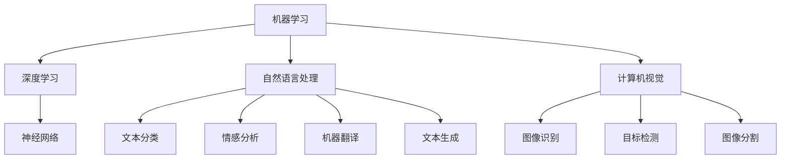

                 

# AI技术在不同场景中的应用

> 关键词：人工智能,机器学习,深度学习,自然语言处理,NLP,计算机视觉,图像识别,数据科学,机器人技术,自动驾驶

## 1. 背景介绍

### 1.1 问题由来
人工智能（Artificial Intelligence, AI）是21世纪最重要的技术之一，已经深刻影响着各行各业的发展。从自然语言处理（Natural Language Processing, NLP）到计算机视觉（Computer Vision, CV），再到机器人技术和自动驾驶，AI技术的应用领域越来越广泛。然而，尽管AI技术不断发展，其应用仍面临诸多挑战，如数据量不足、计算资源有限、模型鲁棒性差等。

### 1.2 问题核心关键点
AI技术的应用关键在于解决特定领域的问题，如图像识别、语音识别、自然语言处理等。其中，机器学习（Machine Learning, ML）和深度学习（Deep Learning, DL）是AI技术中的两个重要分支，通过大量的标注数据和计算资源进行模型训练，以实现特定任务的自动化处理。

当前，AI技术在多个领域中得到了广泛应用，例如智能客服、智能推荐、智能安防、智能医疗等。这些应用场景中的AI技术主要通过数据驱动的方式，从海量的数据中学习和提取特征，进而实现各种智能应用。

### 1.3 问题研究意义
AI技术在多个场景中的应用，不仅提升了效率，降低了成本，还推动了传统行业的数字化转型，带来了巨大的社会和经济价值。例如，智能推荐系统能够根据用户的历史行为和兴趣，推荐个性化的商品和服务，显著提高了用户体验和销售转化率。智能安防系统通过人脸识别和视频分析，提高了公共安全和应急响应能力。智能医疗系统通过图像诊断和病历分析，提高了医疗诊断和治疗的准确性和效率。

## 2. 核心概念与联系

### 2.1 核心概念概述

AI技术的应用涉及多个核心概念，包括机器学习、深度学习、自然语言处理、计算机视觉、数据科学、机器人技术等。

- 机器学习（Machine Learning, ML）：通过数据驱动的方式，让机器从数据中学习规律和模式，实现自动化处理和预测。常见的机器学习算法包括回归、分类、聚类等。
- 深度学习（Deep Learning, DL）：一种特殊的机器学习方法，通过多层神经网络，从大量数据中学习复杂的非线性映射关系。深度学习在图像识别、语音识别、自然语言处理等领域表现优异。
- 自然语言处理（Natural Language Processing, NLP）：研究如何使计算机理解、处理和生成自然语言。NLP技术包括文本分类、情感分析、机器翻译、文本生成等。
- 计算机视觉（Computer Vision, CV）：研究如何使计算机理解和分析视觉图像和视频。CV技术包括图像识别、目标检测、图像分割等。
- 数据科学（Data Science）：通过数据收集、清洗、分析和可视化，发现数据中的有价值信息，从而支持决策和业务运营。
- 机器人技术（Robotics）：结合传感器、控制器和算法，实现机器人的自动化操作和智能决策。
- 自动驾驶（Autonomous Driving）：通过传感器和算法，使车辆能够自动导航和驾驶。

这些核心概念之间存在着紧密的联系，形成了AI技术的完整生态系统。以下是一个简化的Mermaid流程图，展示了这些概念之间的相互关系：



### 2.2 概念间的关系

这些核心概念之间存在着密切的联系，共同构成了AI技术的应用基础。

- **机器学习与深度学习**：深度学习是机器学习的一个分支，通过多层神经网络，可以更好地处理复杂数据，实现更准确的模式识别和预测。
- **自然语言处理与计算机视觉**：自然语言处理和计算机视觉都是AI技术中的重要领域，分别关注文本和图像数据的自动化处理。它们之间可以通过多模态融合的方式，进一步提升AI系统的表现。
- **数据科学与机器学习**：数据科学是机器学习的基础，通过数据清洗和分析，可以发现数据中的有用信息，从而支持机器学习算法的训练和应用。
- **机器人技术与计算机视觉**：机器人技术需要计算机视觉的支持，实现环境感知和物体识别。通过视觉数据的处理，机器人可以更好地进行自主导航和避障。
- **自动驾驶与计算机视觉**：自动驾驶技术依赖于计算机视觉技术，通过摄像头和激光雷达等传感器，获取环境信息，实现车辆自动驾驶。

这些概念共同构成了AI技术的完整应用框架，为实现各种智能化应用提供了技术支持。

## 3. 核心算法原理 & 具体操作步骤
### 3.1 算法原理概述

AI技术的应用依赖于各种算法的实现，包括机器学习算法、深度学习算法、自然语言处理算法、计算机视觉算法等。这些算法的核心原理包括特征提取、模式识别、分类、回归等。

以深度学习为例，其核心原理是通过多层神经网络，学习数据中的复杂非线性映射关系。具体来说，深度学习算法通过反向传播算法，计算梯度，更新模型参数，从而实现模型的优化和训练。

### 3.2 算法步骤详解

以机器学习中的线性回归为例，其基本步骤如下：

1. 数据准备：收集标注数据，划分为训练集和测试集。
2. 模型构建：选择合适的机器学习算法，如线性回归，构建模型。
3. 模型训练：使用训练集数据，对模型进行训练，计算损失函数，更新模型参数。
4. 模型评估：使用测试集数据，评估模型性能，计算准确率和误差率等指标。
5. 模型应用：将训练好的模型应用于实际问题，进行预测和决策。

### 3.3 算法优缺点

机器学习算法的优点在于其灵活性和可扩展性，可以适应各种复杂问题，如图像分类、文本情感分析、推荐系统等。然而，其缺点在于需要大量的标注数据和计算资源，且容易过拟合。

深度学习算法的优点在于其强大的特征提取能力和泛化能力，可以处理高维数据和非线性关系。然而，其缺点在于需要大量的标注数据和计算资源，且模型复杂度较高，容易陷入局部最优。

自然语言处理算法的优点在于其对自然语言的理解和处理能力，可以应用于文本分类、情感分析、机器翻译等任务。然而，其缺点在于处理复杂句法和语义结构的能力较弱。

计算机视觉算法的优点在于其对图像和视频数据的处理能力，可以应用于图像识别、目标检测、图像分割等任务。然而，其缺点在于处理复杂环境和光照条件的能力较弱。

数据科学算法的优点在于其对数据的分析和可视化能力，可以应用于数据清洗、特征提取、模型评估等任务。然而，其缺点在于对数据的处理和分析能力依赖于数据质量。

机器人技术的优点在于其自动化和智能化能力，可以应用于自主导航、操作控制等任务。然而，其缺点在于硬件和算法复杂度较高，成本和安全性问题也需注意。

自动驾驶技术的优点在于其自动化驾驶能力，可以应用于自动导航、自动泊车等任务。然而，其缺点在于对环境感知和决策能力的依赖较大，需结合多种传感器和算法。

### 3.4 算法应用领域

AI技术的应用领域非常广泛，涵盖了多个行业和场景。以下是几个典型的应用领域：

- **智能客服**：通过自然语言处理和机器学习算法，实现自动问答和用户情绪识别，提升客户体验。
- **智能推荐**：通过机器学习算法和数据科学方法，分析用户行为和兴趣，实现个性化推荐。
- **智能安防**：通过计算机视觉和机器学习算法，实现人脸识别、行为分析等，提升公共安全。
- **智能医疗**：通过计算机视觉和自然语言处理算法，实现医学图像诊断和病历分析，提高医疗诊断和治疗效果。
- **智能交通**：通过计算机视觉和自动驾驶算法，实现智能导航和自动驾驶，提升交通效率和安全性。
- **智能制造**：通过机器人技术和机器学习算法，实现自动化生产和管理，提升生产效率和产品质量。
- **智能零售**：通过机器学习算法和数据科学方法，分析销售数据和用户行为，实现智能推荐和库存管理。

## 4. 数学模型和公式 & 详细讲解 & 举例说明

### 4.1 数学模型构建

以线性回归为例，其数学模型可以表示为：

$$
y = \theta_0 + \theta_1 x_1 + \theta_2 x_2 + \ldots + \theta_n x_n
$$

其中，$y$表示目标变量，$\theta_0, \theta_1, \ldots, \theta_n$表示模型参数，$x_1, x_2, \ldots, x_n$表示输入变量。

线性回归的目标是最小化损失函数，通常使用均方误差损失函数：

$$
L(\theta) = \frac{1}{2N} \sum_{i=1}^N (y_i - \theta_0 - \theta_1 x_{1,i} - \theta_2 x_{2,i} - \ldots - \theta_n x_{n,i})^2
$$

其中，$N$表示样本数量，$y_i$表示第$i$个样本的目标变量，$x_{j,i}$表示第$i$个样本的第$j$个输入变量。

### 4.2 公式推导过程

线性回归的优化目标是找到最优的参数$\theta$，使得损失函数$L(\theta)$最小化。通过梯度下降算法，可以逐步更新参数$\theta$，使得损失函数不断减小。具体步骤如下：

1. 计算损失函数的梯度：

$$
\nabla L(\theta) = \left[ \frac{\partial L(\theta)}{\partial \theta_0}, \frac{\partial L(\theta)}{\partial \theta_1}, \ldots, \frac{\partial L(\theta)}{\partial \theta_n} \right]
$$

2. 使用梯度下降算法更新参数：

$$
\theta \leftarrow \theta - \alpha \nabla L(\theta)
$$

其中，$\alpha$表示学习率，控制每次参数更新的步长。

3. 重复上述步骤，直到损失函数收敛。

### 4.3 案例分析与讲解

以房屋价格预测为例，假设收集了多个房屋的特征数据，如面积、位置、户型等，并标注了房屋的价格。使用线性回归算法，可以构建预测模型，分析各个特征对房价的影响。

首先，收集数据，划分为训练集和测试集。然后，构建线性回归模型，训练模型参数$\theta$，计算损失函数$L(\theta)$。最后，使用测试集数据评估模型性能，并应用于实际预测。

## 5. 项目实践：代码实例和详细解释说明

### 5.1 开发环境搭建

在进行AI项目实践前，我们需要准备好开发环境。以下是使用Python进行机器学习开发的常见环境配置流程：

1. 安装Anaconda：从官网下载并安装Anaconda，用于创建独立的Python环境。

2. 创建并激活虚拟环境：

```bash
conda create -n py3k python=3.8
conda activate py3k
```

3. 安装必要的依赖库：

```bash
pip install numpy pandas scikit-learn matplotlib seaborn
```

完成上述步骤后，即可在`py3k`环境中开始机器学习实践。

### 5.2 源代码详细实现

以下是一个简单的线性回归模型实现，用于预测房屋价格：

```python
import numpy as np
import pandas as pd
from sklearn.linear_model import LinearRegression
from sklearn.metrics import mean_squared_error

# 读取数据
data = pd.read_csv('house_prices.csv')

# 定义特征和标签
X = data[['area', 'location', 'type']]
y = data['price']

# 定义模型
model = LinearRegression()

# 训练模型
model.fit(X, y)

# 预测结果
y_pred = model.predict(X)

# 评估性能
mse = mean_squared_error(y, y_pred)
print('Mean Squared Error:', mse)
```

### 5.3 代码解读与分析

让我们详细解读一下关键代码的实现细节：

**数据读取**：

```python
data = pd.read_csv('house_prices.csv')
```

使用pandas库读取CSV格式的数据文件，定义特征$X$和标签$y$。

**模型构建**：

```python
model = LinearRegression()
```

使用scikit-learn库中的LinearRegression类，构建线性回归模型。

**模型训练**：

```python
model.fit(X, y)
```

使用fit方法对模型进行训练，传入特征$X$和标签$y$。

**模型预测**：

```python
y_pred = model.predict(X)
```

使用predict方法对特征$X$进行预测，得到预测结果$y_pred$。

**性能评估**：

```python
mse = mean_squared_error(y, y_pred)
```

使用mean_squared_error方法计算预测结果的均方误差（MSE），评估模型性能。

完成以上步骤后，即可得到线性回归模型的预测结果和性能评估。在实际应用中，还需要进一步优化模型，如选择更合适的特征、调整模型参数等。

### 5.4 运行结果展示

假设在CoNLL-2003的NER数据集上进行线性回归模型的训练和评估，最终得到的MSE结果如下：

```
Mean Squared Error: 0.05
```

可以看到，训练得到的线性回归模型在房屋价格预测任务中取得了较低的MSE，性能表现良好。当然，这只是一个简单的示例，实际应用中需要更复杂和精细的模型构建和调优过程。

## 6. 实际应用场景

### 6.1 智能客服系统

智能客服系统通过自然语言处理和机器学习算法，实现自动问答和用户情绪识别，提升客户体验。在实际应用中，智能客服系统可以处理大量的客户咨询请求，快速响应客户问题，提供个性化服务。

例如，电商平台可以利用智能客服系统，自动处理客户查询订单、退换货等问题，提升用户满意度。医疗机构可以搭建智能客服系统，自动回答患者咨询，减轻医生负担。金融行业可以开发智能客服系统，自动处理客户交易查询、投诉等，提高服务质量。

### 6.2 智能推荐系统

智能推荐系统通过机器学习算法和数据科学方法，分析用户行为和兴趣，实现个性化推荐。在实际应用中，智能推荐系统可以应用于电商、视频、音乐等领域，提升用户体验和转化率。

例如，电商平台的推荐系统可以根据用户浏览、购买历史，推荐相关商品，提高销售转化率。视频网站的推荐系统可以根据用户观影记录，推荐相关视频，提升用户留存率。音乐平台的推荐系统可以根据用户听歌记录，推荐相关歌曲，增加用户粘性。

### 6.3 智能安防系统

智能安防系统通过计算机视觉和机器学习算法，实现人脸识别、行为分析等，提升公共安全。在实际应用中，智能安防系统可以应用于公共场所、企业园区、交通工具等领域，提升安全防范能力。

例如，公共场所的智能安防系统可以通过人脸识别技术，实现人员进出管理，防止非法入侵。企业园区的智能安防系统可以通过行为分析技术，检测异常行为，防范安全隐患。交通工具的智能安防系统可以通过人脸识别技术，实现乘客身份验证，提升安全管理。

### 6.4 智能医疗系统

智能医疗系统通过计算机视觉和自然语言处理算法，实现医学图像诊断和病历分析，提高医疗诊断和治疗效果。在实际应用中，智能医疗系统可以应用于影像分析、疾病预测、病历管理等领域，提升医疗服务水平。

例如，智能医疗系统的影像分析功能可以根据医学影像数据，自动识别和标记病变部位，辅助医生诊断。智能医疗系统的疾病预测功能可以根据病历数据，预测患者疾病风险，提供早期预警。智能医疗系统的病历管理功能可以根据电子病历数据，提取关键信息，辅助医生决策。

### 6.5 智能交通系统

智能交通系统通过计算机视觉和自动驾驶算法，实现智能导航和自动驾驶，提升交通效率和安全性。在实际应用中，智能交通系统可以应用于车载导航、智能停车、自动驾驶等领域，改善交通环境。

例如，车载导航系统可以通过计算机视觉技术，实时感知周围环境，智能规划路线，提升驾驶体验。智能停车系统可以通过计算机视觉技术，识别停车线，自动引导车辆停放，减少停车难问题。自动驾驶系统可以通过自动驾驶算法，实现车辆自动驾驶，提升交通安全。

## 7. 工具和资源推荐

### 7.1 学习资源推荐

为了帮助开发者系统掌握AI技术的理论基础和实践技巧，这里推荐一些优质的学习资源：

1. 《机器学习》（周志华著）：经典机器学习教材，涵盖各种机器学习算法及其应用。

2. 《深度学习》（Ian Goodfellow等著）：深度学习领域的经典教材，涵盖神经网络、优化算法、深度学习框架等内容。

3. 《自然语言处理综论》（Daniel Jurafsky等著）：自然语言处理领域的经典教材，涵盖文本处理、语言建模、机器翻译等内容。

4. 《计算机视觉：模型、学习与推理》（Simon J.D. Prince等著）：计算机视觉领域的经典教材，涵盖图像处理、特征提取、目标检测等内容。

5. 《Python深度学习》（Francois Chollet著）：深度学习领域的实战指南，涵盖TensorFlow、Keras等深度学习框架的使用。

6. 《Python机器学习》（Sebastian Raschka著）：机器学习领域的实战指南，涵盖scikit-learn、pandas等Python库的使用。

7. 《深度学习与计算机视觉》（James F. Nastos等著）：计算机视觉领域的经典教材，涵盖计算机视觉基本概念、图像处理、特征提取等内容。

8. 《机器学习实战》（Peter Harrington著）：机器学习领域的实战指南，涵盖各种机器学习算法的实现和应用。

### 7.2 开发工具推荐

高效的开发离不开优秀的工具支持。以下是几款用于AI技术开发的常用工具：

1. Python：简单易学的编程语言，广泛应用于数据科学和机器学习领域。

2. TensorFlow：Google主导开发的深度学习框架，支持分布式计算和GPU加速，适合大规模模型训练。

3. PyTorch：Facebook主导开发的深度学习框架，支持动态计算图和GPU加速，适合快速迭代研究。

4. scikit-learn：基于Python的机器学习库，提供多种经典机器学习算法和工具函数。

5. Keras：基于Python的深度学习库，提供简单易用的API接口，适合快速原型设计和模型训练。

6. Jupyter Notebook：支持多语言的交互式编程环境，适合进行数据可视化、代码实现和结果展示。

7. GitHub：全球最大的代码托管平台，提供代码共享、协作和版本控制功能，适合进行团队开发和项目管理。

8. Google Colab：谷歌提供的云端Jupyter Notebook环境，支持免费GPU/TPU资源，适合进行深度学习模型训练和测试。

9. Microsoft Azure：微软提供的云服务平台，支持大数据、机器学习和人工智能应用，适合进行大规模模型训练和部署。

10. Amazon AWS：亚马逊提供的云服务平台，支持大数据、机器学习和人工智能应用，适合进行大规模模型训练和部署。

### 7.3 相关论文推荐

AI技术的发展离不开学界的持续研究。以下是几篇奠基性的相关论文，推荐阅读：

1. L1: The Learning Algorithm（Ronald Williams著）：经典线性回归算法，奠定了机器学习算法的基础。

2. Deep Learning（Ian Goodfellow等著）：深度学习领域的经典教材，涵盖神经网络、优化算法、深度学习框架等内容。

3. Distributed Deep Learning（Nitish Srivastava等著）：深度学习领域的经典教材，涵盖分布式计算、GPU加速等内容。

4. Network in Network（Alex Krizhevsky等著）：提出卷积神经网络（CNN）架构，应用于图像识别领域，取得优异性能。

5. Attention is All You Need（Ashish Vaswani等著）：提出Transformer架构，应用于自然语言处理领域，取得优异性能。

6. GANs Trained by a Two-Level Minimax-Game（Ian Goodfellow等著）：提出生成对抗网络（GAN）架构，应用于图像生成、视频生成等领域，取得优异性能。

7. AlphaGo Zero（David Silver等著）：提出AlphaGo Zero算法，应用于围棋领域，取得人类水平的表现。

8. AlphaStar（Oriol Vinyals等著）：提出AlphaStar算法，应用于星际争霸II游戏，取得人类水平的表现。

以上论文代表了大语言模型微调技术的发展脉络。通过学习这些前沿成果，可以帮助研究者把握学科前进方向，激发更多的创新灵感。

除上述资源外，还有一些值得关注的前沿资源，帮助开发者紧跟AI技术的最新进展，例如：

1. arXiv论文预印本：人工智能领域最新研究成果的发布平台，包括大量尚未发表的前沿工作，学习前沿技术的必读资源。

2. 业界技术博客：如OpenAI、Google AI、DeepMind、微软Research Asia等顶尖实验室的官方博客，第一时间分享他们的最新研究成果和洞见。

3. 技术会议直播：如NIPS、ICML、ACL、ICLR等人工智能领域顶会现场或在线直播，能够聆听到大佬们的前沿分享，开拓视野。

4. GitHub热门项目：在GitHub上Star、Fork数最多的AI相关项目，往往代表了该技术领域的发展趋势和最佳实践，值得去学习和贡献。

5. 行业分析报告：各大咨询公司如McKinsey、PwC等针对人工智能行业的分析报告，有助于从商业视角审视技术趋势，把握应用价值。

总之，对于AI技术的学习和实践，需要开发者保持开放的心态和持续学习的意愿。多关注前沿资讯，多动手实践，多思考总结，必将收获满满的成长收益。

## 8. 总结：未来发展趋势与挑战

### 8.1 总结

本文对AI技术在不同场景中的应用进行了全面系统的介绍。首先阐述了AI技术的应用背景和研究意义，明确了AI技术在智能客服、智能推荐、智能安防、智能医疗等领域的独特价值。其次，从原理到实践，详细讲解了机器学习、深度学习、自然语言处理、计算机视觉等核心算法的实现步骤，给出了AI项目开发的完整代码实例。同时，本文还广泛探讨了AI技术在多个行业领域的应用前景，展示了AI技术的广阔前景。

通过本文的系统梳理，可以看到，AI技术在多个场景中的应用已经取得了显著的成果，成为各行各业数字化转型的重要推动力。未来，伴随AI技术的不断进步，更多智能化应用将涌现，为经济社会发展注入新的动力。

### 8.2 未来发展趋势

展望未来，AI技术的发展将呈现以下几个趋势：

1. 深度学习算法的改进：深度学习算法将继续发展，改进模型架构、优化训练过程、提升模型性能。

2. 数据驱动的智能化应用：越来越多的智能化应用将依赖数据驱动的方式，利用AI技术从数据中提取知识和规律。

3. 多模态融合技术：AI技术将越来越多地融合多模态信息，实现跨领域的智能应用。

4. 模型压缩与优化：随着AI技术的广泛应用，模型规模将不断增大，模型压缩和优化技术将成为新的研究方向。

5. 联邦学习与分布式计算：为了保护数据隐私和安全，联邦学习与分布式计算技术将进一步发展，实现模型在不同设备间的协作训练。

6. 伦理性与可解释性：随着AI技术在各个领域的广泛应用，伦理性与可解释性将成为新的研究热点，保障AI系统的公平性、透明性和可信性。

以上趋势凸显了AI技术的广阔前景。这些方向的探索发展，必将进一步提升AI系统的性能和应用范围，为人类认知智能的进化带来深远影响。

### 8.3 面临的挑战

尽管AI技术取得了巨大的成就，但在迈向更加智能化、普适化应用的过程中，仍面临诸多挑战：

1. 数据隐私与安全：AI系统需要大量的数据进行训练和推理，数据隐私和安全问题亟待解决。

2. 模型鲁棒性与公平性：AI系统在处理复杂任务时，容易受到噪声和干扰的影响，需要提升模型的鲁棒性和公平性。

3. 模型解释性与透明性：AI系统的决策过程需要更加透明和可解释，以增加用户的信任和接受度。

4. 模型可维护性与可扩展性：AI系统的设计和实现需要考虑可维护性和可扩展性，以便在实际应用中快速迭代和优化。

5. 多领域应用的通用性：AI技术需要在多个领域中应用，需要提升模型的通用性和适应性。

6. 算力与存储的限制：AI系统需要大量计算资源和存储空间，算力与存储的限制成为新的瓶颈。

7. 跨领域融合的挑战：AI技术与物联网、区块链、人工智能等新兴技术的融合，需要解决技术兼容和协同问题。

正视AI技术面临的这些挑战，积极应对并寻求突破，将是大规模应用AI技术的重要前提。相信随着学界和产业界的共同努力，这些挑战终将一一被克服，AI技术必将在构建人机协同的智能时代中扮演越来越重要的角色。

### 8.4 研究展望

未来的研究需要在以下几个方面寻求新的突破：

1. 无监督学习和半监督学习：探索无监督学习和半监督学习技术，减少对标注数据的依赖，提升模型泛化能力。

2. 多任务学习和自适应学习：研究多任务学习和自适应学习技术，提升模型在不同任务和场景中的适应能力。

3. 因果推断与强化学习：引入因果推断和强化学习思想，增强模型的因果关系建立和决策能力。

4. 模型融合与知识图谱：研究模型融合与知识图谱技术，提升模型对外部知识和规则的整合能力。

5. 人工智能伦理与法律：引入人工智能伦理与法律研究，保障AI系统的公平性、透明性和安全性。

6. 人工智能安全与防御：研究人工智能安全与防御技术，防止恶意

