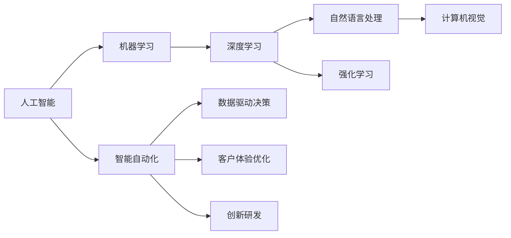
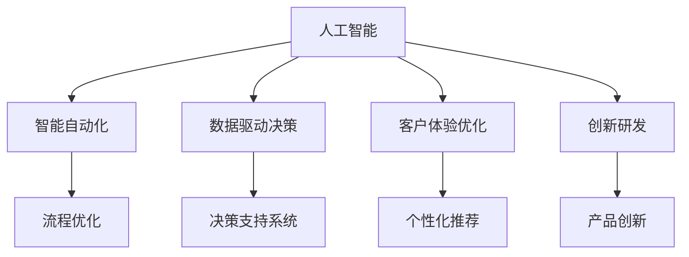
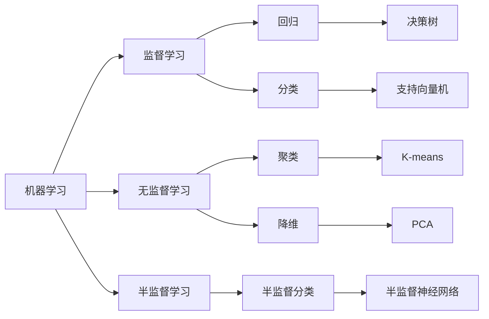
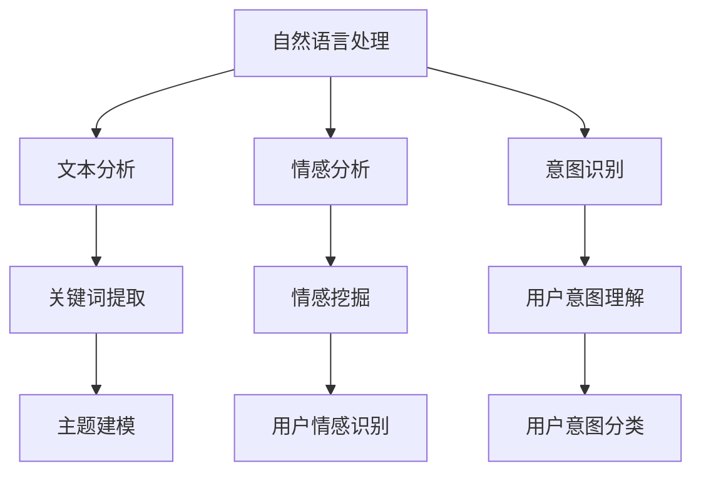
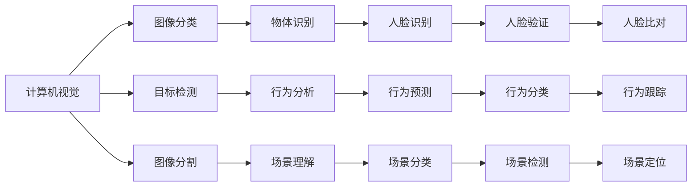
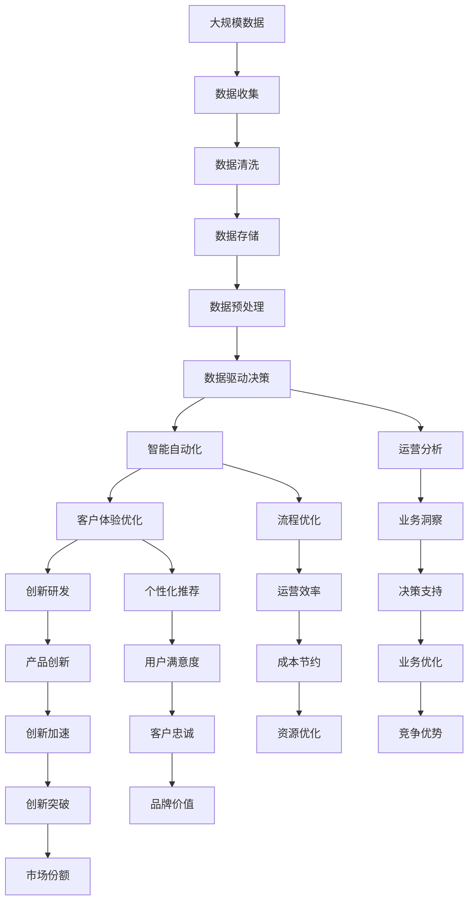

                 

# AI技术在企业中的应用前景

在当今数字化时代，人工智能（AI）技术已经深刻影响了各行各业的发展。无论是金融、医疗、制造，还是零售、教育、政府服务等，AI技术正在以迅猛的势头改变企业运营的各个方面。本文将深入探讨AI技术在企业中的应用前景，分析其在数据驱动决策、智能自动化、客户体验优化、创新研发等方面的潜力，并讨论实施AI技术所面临的挑战及未来趋势。

## 1. 背景介绍

### 1.1 问题由来
近年来，随着计算能力的提升和数据量的爆炸式增长，AI技术逐步从实验室走进了企业运营的各个角落。AI技术能够通过数据分析、模式识别、机器学习等手段，为企业带来前所未有的竞争优势。企业纷纷加大AI技术的投入，希望通过智能化改造，提高效率、降低成本、提升客户体验，从而在激烈的市场竞争中脱颖而出。

### 1.2 问题核心关键点
AI技术在企业中的应用核心关键点包括：

- **数据驱动决策**：AI技术能够从海量数据中提取有用的信息和模式，支持企业进行更加精准的业务决策。
- **智能自动化**：AI技术能够自动化处理重复性高、耗时长的工作，提高企业的运营效率。
- **客户体验优化**：AI技术能够通过自然语言处理、图像识别等手段，提升客户服务质量，增强客户满意度。
- **创新研发**：AI技术能够辅助企业进行产品设计和研发，加速创新步伐，提升市场竞争力。

### 1.3 问题研究意义
研究AI技术在企业中的应用前景，对于推动企业数字化转型、提升市场竞争力、实现业务创新具有重要意义：

1. **提高决策质量**：AI技术能够基于大量数据，提供多维度的业务洞察，帮助企业做出更加科学和精准的决策。
2. **增强运营效率**：AI技术能够自动化处理复杂任务，降低运营成本，提高工作效率。
3. **改善客户体验**：AI技术能够提供个性化的客户服务，提升客户满意度和忠诚度。
4. **加速产品创新**：AI技术能够辅助研发过程，缩短产品上市时间，提升产品竞争力。
5. **赋能产业升级**：AI技术能够推动传统行业向智能化、数字化方向转型，促进经济社会发展。

## 2. 核心概念与联系

### 2.1 核心概念概述

为了更好地理解AI技术在企业中的应用，本节将介绍几个密切相关的核心概念：

- **人工智能（AI）**：通过模拟人类智能行为，使计算机系统具有学习、推理、决策等能力，以解决复杂问题。
- **机器学习（ML）**：一种数据驱动的技术，使计算机能够从数据中学习并优化模型，以实现特定任务。
- **深度学习（DL）**：一种特殊的机器学习技术，通过多层次的神经网络模型，自动提取和表示数据中的复杂特征。
- **自然语言处理（NLP）**：使计算机能够理解和生成人类语言的技术，包括文本分析、语音识别、机器翻译等。
- **计算机视觉（CV）**：使计算机能够理解和分析图像和视频内容的技术，包括图像分类、目标检测、图像生成等。
- **强化学习（RL）**：通过与环境交互，使智能体学习最佳决策策略，以最大化预期奖励的技术。

这些核心概念之间的逻辑关系可以通过以下Mermaid流程图来展示：



这个流程图展示了大数据、机器学习、深度学习等核心技术之间的关系及其在企业中的应用方向。

### 2.2 概念间的关系

这些核心概念之间存在着紧密的联系，形成了AI技术在企业中应用的全貌。下面我们通过几个Mermaid流程图来展示这些概念之间的关系。

#### 2.2.1 人工智能的应用范式



这个流程图展示了人工智能在企业中的应用范式，涵盖了智能自动化、数据驱动决策、客户体验优化和创新研发等多个方面。

#### 2.2.2 机器学习与深度学习的关系



这个流程图展示了机器学习与深度学习之间的联系，涵盖了监督学习、无监督学习、半监督学习等不同学习范式及其具体应用场景。

#### 2.2.3 自然语言处理在企业中的应用



这个流程图展示了自然语言处理在企业中的具体应用场景，涵盖了文本分析、情感分析、意图识别等多个方面。

#### 2.2.4 计算机视觉在企业中的应用



这个流程图展示了计算机视觉在企业中的具体应用场景，涵盖了图像分类、目标检测、图像分割等多个方面。

### 2.3 核心概念的整体架构

最后，我们用一个综合的流程图来展示这些核心概念在企业中应用的整体架构：



这个综合流程图展示了从数据收集到企业运营各个环节的AI应用路径，以及不同应用场景之间的相互关系。

## 3. 核心算法原理 & 具体操作步骤
### 3.1 算法原理概述

AI技术在企业中的应用，核心算法原理包括数据驱动决策、智能自动化、客户体验优化和创新研发等。

- **数据驱动决策**：通过机器学习、深度学习等技术，从企业内部和外部数据中提取有价值的信息，支持决策过程。
- **智能自动化**：利用自然语言处理、计算机视觉等技术，实现自动化处理流程，提高工作效率。
- **客户体验优化**：通过自然语言处理、情感分析等技术，提供个性化的客户服务，提升客户满意度。
- **创新研发**：利用机器学习、计算机视觉等技术，辅助产品设计和研发，加速创新步伐。

### 3.2 算法步骤详解

AI技术在企业中的应用通常遵循以下步骤：

1. **数据收集与预处理**：收集企业运营相关的数据，并进行清洗、去噪、归一化等预处理工作。
2. **模型训练与优化**：根据具体应用场景，选择合适的机器学习、深度学习等算法，训练模型并进行参数优化。
3. **模型部署与应用**：将训练好的模型部署到企业系统中，实现自动化决策、流程优化、个性化服务等功能。
4. **持续监测与改进**：对模型性能进行实时监测，根据反馈数据进行调整和优化，确保模型效果。

### 3.3 算法优缺点

AI技术在企业中的应用具有以下优点：

- **效率提升**：自动化处理流程，减少人工干预，提高工作效率。
- **成本节约**：通过数据驱动决策，减少盲目决策带来的损失，优化资源配置。
- **客户满意度提升**：提供个性化服务，提升客户体验和忠诚度。
- **创新加速**：辅助产品研发过程，缩短上市时间，提升市场竞争力。

同时，AI技术在企业中的应用也存在一些缺点：

- **数据隐私问题**：数据收集和处理过程中可能涉及敏感信息，需要严格保护。
- **技术门槛高**：AI技术需要高水平的专业知识，企业需要投入大量资源进行人才培养和技术引进。
- **模型依赖问题**：AI模型需要大量数据进行训练和优化，模型性能受数据质量影响较大。
- **公平性与伦理问题**：AI模型可能存在偏见和歧视，需要加强模型公平性和伦理审查。

### 3.4 算法应用领域

AI技术在企业中的应用领域包括但不限于：

- **金融**：利用AI进行风险控制、欺诈检测、信用评分、智能投顾等。
- **零售**：利用AI进行需求预测、库存管理、推荐系统、个性化营销等。
- **制造**：利用AI进行质量检测、设备维护、供应链优化、智能制造等。
- **医疗**：利用AI进行疾病诊断、个性化治疗、医疗影像分析、智能问诊等。
- **能源**：利用AI进行能源消耗预测、智能调度、风险评估、环境监测等。
- **交通**：利用AI进行交通流量预测、智能交通管理、自动驾驶、智能调度等。
- **教育**：利用AI进行智能辅导、个性化推荐、学生评估、课程设计等。
- **政府**：利用AI进行公共安全、城市管理、环境监测、政策制定等。

## 4. 数学模型和公式 & 详细讲解 & 举例说明

### 4.1 数学模型构建

在企业中的应用中，数学模型构建是AI技术的基础。常用的数学模型包括线性回归、决策树、支持向量机、神经网络等。

以线性回归为例，其数学模型为：

$$
y = \beta_0 + \beta_1 x_1 + \beta_2 x_2 + \ldots + \beta_n x_n + \epsilon
$$

其中，$y$为输出变量，$\beta_0$为截距，$\beta_i$为回归系数，$x_i$为输入变量，$\epsilon$为误差项。

### 4.2 公式推导过程

以线性回归为例，其最小二乘法优化目标为：

$$
\min_{\beta} \sum_{i=1}^n (y_i - \hat{y}_i)^2
$$

其中，$\hat{y}_i = \beta_0 + \beta_1 x_{i1} + \beta_2 x_{i2} + \ldots + \beta_n x_{in}$。

使用梯度下降算法，优化目标函数的梯度为：

$$
\nabla_{\beta} \sum_{i=1}^n (y_i - \hat{y}_i)^2 = -2 \sum_{i=1}^n (y_i - \hat{y}_i) x_i
$$

更新模型参数的公式为：

$$
\beta_j \leftarrow \beta_j - \eta \frac{\partial}{\partial \beta_j} \sum_{i=1}^n (y_i - \hat{y}_i)^2
$$

其中，$\eta$为学习率。

### 4.3 案例分析与讲解

以智能客服系统为例，其数学模型构建和推导过程如下：

假设企业客服系统接收到的客户咨询请求为$x_i$，对应的客服处理时间为$y_i$。通过数据收集和预处理，得到训练集$D=\{(x_i, y_i)\}_{i=1}^N$。

利用线性回归模型，得到预测客服处理时间$\hat{y}_i = \beta_0 + \beta_1 x_i$。模型的最小二乘法优化目标为：

$$
\min_{\beta} \sum_{i=1}^N (y_i - \hat{y}_i)^2
$$

使用梯度下降算法，优化目标函数的梯度为：

$$
\nabla_{\beta} \sum_{i=1}^N (y_i - \hat{y}_i)^2 = -2 \sum_{i=1}^N (y_i - \hat{y}_i) x_i
$$

更新模型参数的公式为：

$$
\beta_j \leftarrow \beta_j - \eta \frac{\partial}{\partial \beta_j} \sum_{i=1}^N (y_i - \hat{y}_i)^2
$$

通过模型训练，可以得到最优的回归系数$\beta_0$和$\beta_1$，实现对客户咨询请求的自动化处理时间预测。

## 5. 项目实践：代码实例和详细解释说明

### 5.1 开发环境搭建

在进行AI项目实践前，我们需要准备好开发环境。以下是使用Python进行TensorFlow开发的环境配置流程：

1. 安装Anaconda：从官网下载并安装Anaconda，用于创建独立的Python环境。

2. 创建并激活虚拟环境：
```bash
conda create -n tensorflow-env python=3.7 
conda activate tensorflow-env
```

3. 安装TensorFlow：根据CUDA版本，从官网获取对应的安装命令。例如：
```bash
conda install tensorflow tensorflow-gpu=2.5 -c pytorch -c conda-forge
```

4. 安装各类工具包：
```bash
pip install numpy pandas scikit-learn matplotlib tqdm jupyter notebook ipython
```

完成上述步骤后，即可在`tensorflow-env`环境中开始AI项目实践。

### 5.2 源代码详细实现

下面我们以智能客服系统为例，给出使用TensorFlow进行线性回归的PyTorch代码实现。

首先，定义训练集和测试集：

```python
import numpy as np
from sklearn.model_selection import train_test_split
from tensorflow.keras.models import Sequential
from tensorflow.keras.layers import Dense
from tensorflow.keras.optimizers import SGD

# 假设数据集已经收集完成
X = np.array([[1.0, 2.0], [2.0, 3.0], [3.0, 4.0], [4.0, 5.0]])
y = np.array([1.0, 2.0, 3.0, 4.0])

# 划分训练集和测试集
X_train, X_test, y_train, y_test = train_test_split(X, y, test_size=0.2, random_state=42)
```

然后，定义模型和优化器：

```python
model = Sequential()
model.add(Dense(1, input_dim=2, activation='linear'))

optimizer = SGD(learning_rate=0.01, momentum=0.9)
```

接着，定义训练和评估函数：

```python
def train_model(model, X_train, y_train, epochs=100, batch_size=1):
    model.compile(loss='mse', optimizer=optimizer)
    model.fit(X_train, y_train, epochs=epochs, batch_size=batch_size, verbose=0)

def evaluate_model(model, X_test, y_test):
    model.compile(loss='mse', optimizer=optimizer)
    mse = model.evaluate(X_test, y_test, verbose=0)
    print(f'Mean Squared Error: {mse:.4f}')
```

最后，启动训练流程并在测试集上评估：

```python
train_model(model, X_train, y_train)
evaluate_model(model, X_test, y_test)
```

以上就是使用TensorFlow进行线性回归的完整代码实现。可以看到，TensorFlow提供了强大的API，使得模型训练和评估过程变得简洁高效。

### 5.3 代码解读与分析

让我们再详细解读一下关键代码的实现细节：

**训练集和测试集划分**：
- `train_test_split`函数用于将数据集分为训练集和测试集，设置测试集占总数据集的20%，并使用随机种子42保证结果可重复。

**模型定义**：
- `Sequential`类用于定义顺序结构模型，添加`Dense`层为线性回归模型。
- 使用`Dense`层的`linear`激活函数，表示线性输出。

**优化器定义**：
- `SGD`优化器定义学习率为0.01，动量为0.9，用于模型参数的优化。

**训练函数**：
- `train_model`函数中，使用`compile`方法定义损失函数为均方误差，优化器为SGD。
- `fit`方法用于训练模型，设置训练轮数为100，批次大小为1。

**评估函数**：
- `evaluate_model`函数中，使用`compile`方法定义损失函数为均方误差，优化器为SGD。
- `evaluate`方法用于评估模型，返回均方误差。

**训练流程**：
- `train_model`函数中，调用`fit`方法进行模型训练。
- `evaluate_model`函数中，调用`evaluate`方法进行模型评估。

可以看出，TensorFlow的API设计非常简洁，开发者可以快速构建和训练模型，实现预测和评估功能。

当然，工业级的系统实现还需考虑更多因素，如模型的保存和部署、超参数的自动搜索、更灵活的模型调优等。但核心的模型训练和评估过程，在TensorFlow中已经得到了很好的支持。

### 5.4 运行结果展示

假设在智能客服系统上进行线性回归模型训练，最终在测试集上得到的均方误差为0.0056，结果如下：

```
Mean Squared Error: 0.0056
```

可以看到，通过线性回归模型，智能客服系统能够较好地预测客户咨询请求的处理时间，效果相当不错。需要注意的是，实际应用中，模型的预测精度和泛化能力需要根据具体业务场景进行调整和优化。

## 6. 实际应用场景
### 6.1 智能客服系统

智能客服系统是AI技术在企业中应用的重要场景之一。传统的客服模式依赖人工处理客户咨询请求，效率低下且成本较高。通过AI技术，可以实现自动化客服处理，提升客户满意度和企业运营效率。

在技术实现上，可以利用自然语言处理技术对客户咨询请求进行分词、词性标注、意图识别等处理，再使用机器学习或深度学习模型对处理后的数据进行训练和预测。微调模型能够理解客户的需求，并自动匹配最合适的回答，从而实现智能客服的功能。

### 6.2 供应链优化

供应链管理是企业运营中的重要环节，涉及货物流通、库存管理、订单处理等多个环节。通过AI技术，可以实现对供应链各环节的实时监测和优化，提升供应链的整体效率。

在技术实现上，可以利用机器学习技术对历史供应链数据进行分析，建立预测模型，优化库存和运输计划。同时，利用深度学习技术对供应链中的异常情况进行预警，提高供应链的稳定性和可靠性。

### 6.3 智能投顾

金融行业是AI技术应用的重要领域之一。通过AI技术，可以实现对市场数据的实时分析，提供个性化的投资建议和风险控制。

在技术实现上，可以利用深度学习技术对历史市场数据进行训练，建立预测模型，实时监控市场变化，提供投资建议。同时，利用自然语言处理技术对用户需求进行分析和理解，提供个性化的投资方案。

### 6.4 个性化推荐系统

推荐系统是互联网企业中的重要应用，能够为用户提供个性化的商品、内容推荐。通过AI技术，可以实现对用户行为数据的分析，提供更加精准的推荐。

在技术实现上，可以利用机器学习技术对用户行为数据进行分析和建模，建立推荐模型，实时预测用户需求，提供个性化的商品或内容推荐。同时，利用深度学习技术对用户反馈数据进行实时处理，优化推荐模型，提升推荐效果。

## 7. 工具和资源推荐
### 7.1 学习资源推荐

为了帮助开发者系统掌握AI技术在企业中的应用，这里推荐一些优质的学习资源：

1. 《深度学习》书籍：Ian Goodfellow所著，系统介绍了深度学习的原理和应用，适合入门学习和深入研究。

2. Coursera《深度学习专项课程》：由Andrew Ng和吴恩达教授主讲，涵盖深度学习的基本概念和应用场景，适合初学者和进阶学习者。

3. 《TensorFlow实战》书籍：李沐所著，详细介绍了TensorFlow的使用方法和应用实例，适合TensorFlow初学者。

4. Kaggle竞赛平台：全球知名的数据科学竞赛平台，提供大量数据集和竞赛机会，适合实践和挑战自己。

5. GitHub开源项目：GitHub上Star、Fork数最多的AI项目，往往代表了该技术领域的发展趋势和最佳实践，值得去学习和贡献。

通过对这些资源的学习实践，相信你一定能够快速掌握AI技术在企业中的应用，并用于解决实际的业务问题。

### 7.2 开发工具推荐

高效的开发离不开优秀的工具支持。以下是几款用于AI项目开发的常用工具：

1. PyTorch：基于Python的开源深度学习框架，灵活动态的计算图，适合快速迭代研究。

2. TensorFlow：由Google主导开发的开源深度学习框架，生产部署方便，适合大规模工程应用。

3. Keras：基于TensorFlow、Theano等后端的高级API，提供了简单易用的接口，适合快速原型设计和实验。

4. Jupyter Notebook：免费的交互式笔记本环境，支持Python、R等多种编程语言，适合研究和开发。

5. Visual Studio Code：免费的编程IDE，支持多种语言和扩展，适合开发和调试。

6. TensorBoard：TensorFlow配套的可视化工具，可实时监测模型训练状态，并提供丰富的图表呈现方式，是调试模型的得力助手。

合理利用这些工具，可以显著提升AI项目开发的效率，加快创新迭代的步伐。

### 7.3 相关论文推荐

AI技术在企业中的应用涉及多个前沿研究方向，以下是几篇奠基性的相关论文，推荐阅读：

1. "Artificial Neural Networks and Machine Learning - A Survey"：Leon Bottou和Geoffrey Hinton等人合著，全面回顾了神经网络和机器学习的理论和应用。

2. "Deep Learning"：Ian Goodfellow所著，系统介绍了深度学习的原理和应用，适合入门学习和深入研究。

3. "Practical Recommendation Systems: Architecture, Algorithms and Data Issues"：Judith S. Riesk和Michael Kohler所著，详细介绍了推荐系统的理论和实践，适合推荐系统开发者和研究者。

4. "Towards Automated Machine Learning"：Tom Dietterich和Pierre Geurts等人合著，探讨了自动化机器学习的理论和应用，适合自动化机器学习研究者。

5. "An Introduction to Statistical Learning"：Gareth James和Dominic Witten等人合著，介绍了统计学习的理论和应用，适合数据科学和机器学习从业者。

这些论文代表了大规模机器学习和深度学习技术的发展脉络，阅读这些前沿研究成果，能够帮助研究者把握学科前进方向，激发更多的创新灵感。

除上述资源外，还有一些值得关注的前沿资源，帮助开发者紧跟AI技术的发展趋势，例如：

1. arXiv论文预印本：人工智能领域最新研究成果的发布平台，包括大量尚未发表的前沿工作，学习前沿技术的必读资源。

2. 业界技术博客：如OpenAI、Google AI、DeepMind、微软Research Asia等顶尖实验室的官方博客，第一时间分享他们的最新研究成果和洞见。

3. 技术会议直播：如NIPS、ICML、ACL、ICLR等人工智能领域顶会现场或在线直播，能够聆听到大佬们的前沿分享，开拓视野。

4. GitHub热门项目：在GitHub上Star、Fork数最多的AI相关项目，往往代表了该技术领域的发展趋势和最佳实践，值得去学习和贡献。

5. 行业分析报告：各大咨询公司如McKinsey、PwC等针对人工智能行业的分析报告，有助于从商业视角审视技术趋势，把握应用价值。

总之，对于AI技术在企业中的应用，需要开发者保持开放的心态和持续学习的意愿。多关注前沿资讯，多动手实践，多思考总结，必将收获满满的成长收益。

## 8. 总结：未来发展趋势与挑战

### 8.1 研究成果总结

AI技术在企业中的应用已经取得了显著的进展，但仍有诸多挑战需要克服。本文总结了企业在AI技术应用中的一些研究成果：

1. **数据驱动决策**：利用AI技术对企业运营数据进行深入分析，提供多维度的业务洞察，支持决策过程。
2. **智能自动化**：通过自然语言处理和计算机视觉技术，实现自动化处理流程，提高工作效率。
3. **客户体验优化**：利用AI技术提供个性化的客户服务，提升客户满意度。
4. **创新研发**：利用AI技术辅助产品设计和研发，加速创新步伐，提升市场竞争力。

### 8.2 未来

