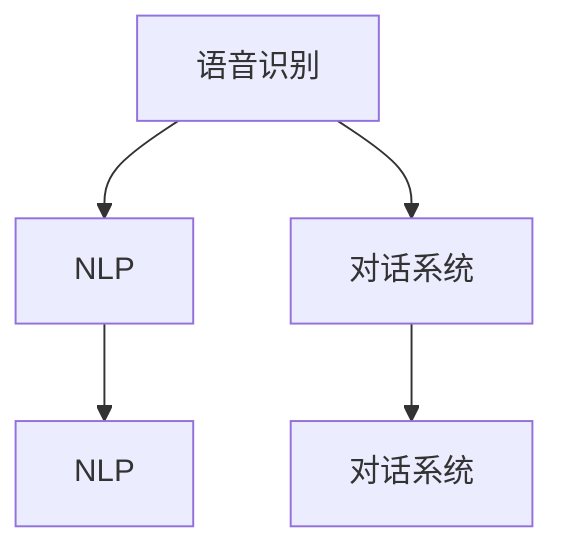

                 

# AI技术推动CUI在数字产品中的应用

> 关键词：人机交互, 对话系统, 人工智能, 语音识别, 自然语言处理

## 1. 背景介绍

在数字化和智能化的浪潮中，人机交互（Computer-User Interaction, CUI）技术已经变得越来越重要。通过人机交互，数字产品能够更加智能、高效地响应用户需求，提升用户体验。AI技术的飞速发展，尤其是语音识别、自然语言处理（Natural Language Processing, NLP）和对话系统等技术的进步，使得CUI技术在数字产品中的应用前景广阔。

### 1.1 问题由来

传统的人机交互方式，如键盘和鼠标，已经逐渐无法满足用户对高效、自然、个性化的需求。例如，智能音箱、智能助手、智能家居等设备需要能够通过语音或文本自然地与用户交互。语音识别、自然语言处理和对话系统等AI技术的应用，使得CUI技术迈入了新纪元。

### 1.2 问题核心关键点

CUI技术的核心关键点在于如何让机器能够自然地理解并响应用户的指令。这通常包括：

- 语音识别：将用户的语音转换为文本。
- 自然语言处理：理解和处理用户的文字或语音指令。
- 对话系统：基于用户的指令生成自然、流畅的回应。

目前，CUI技术在多个领域的应用已经初见成效，如智能音箱、智能助手、车载系统、家居控制等。然而，这些应用仍然面临一些挑战，如语音识别准确度、对话系统响应速度、个性化需求满足等。

## 2. 核心概念与联系

### 2.1 核心概念概述

为了更好地理解CUI技术的应用，本节将介绍几个密切相关的核心概念：

- 语音识别（Speech Recognition）：将语音信号转换为文本的过程，是CUI技术的起点。
- 自然语言处理（Natural Language Processing, NLP）：理解和处理人类语言的技术，包括语法分析、语义分析、命名实体识别、情感分析等。
- 对话系统（Dialogue System）：基于用户的指令生成自然、流畅的回应，是CUI技术的高阶应用。

这些核心概念之间存在着紧密的联系，形成了一个完整的CUI技术生态系统。语音识别是自然语言处理和对话系统的基础，而自然语言处理和对话系统是语音识别的高级应用。通过这三个核心环节的协同工作，CUI技术得以实现高效、自然的人机交互。

### 2.2 概念间的关系

这些核心概念之间的关系可以通过以下Mermaid流程图来展示：



这个流程图展示了大语言模型微调过程中各个核心概念的关系：

1. 语音识别将用户的语音信号转换为文本，作为NLP的输入。
2. NLP对文本进行语法和语义分析，识别出关键信息，供对话系统使用。
3. 对话系统基于NLP的分析结果，生成自然流畅的回应。

这些概念的协同工作，使得CUI技术能够更加智能、高效地响应用户需求。

## 3. 核心算法原理 & 具体操作步骤
### 3.1 算法原理概述

CUI技术的核心算法原理可以分为以下几个部分：

1. 语音识别：利用深度学习模型，如卷积神经网络（CNN）、循环神经网络（RNN）和Transformer等，对语音信号进行特征提取和分类。常用的语音识别模型包括Google的DeepSpeech、微软的Pannscript等。

2. 自然语言处理：利用深度学习模型，如RNN、LSTM、GRU和Transformer等，对文本进行语言理解和生成。常用的NLP模型包括BERT、GPT、ELMo等。

3. 对话系统：利用深度学习模型，如RNN、LSTM、GRU和Transformer等，对用户指令进行理解并生成响应。常用的对话系统模型包括Rasa、Dialogflow等。

这些算法原理在大规模数据上经过预训练和微调，可以显著提升模型的性能。

### 3.2 算法步骤详解

以下将详细介绍语音识别、自然语言处理和对话系统的具体操作步骤：

#### 3.2.1 语音识别步骤

1. **数据准备**：收集大量标注好的语音数据集，作为模型的训练数据。常用的语音数据集包括LibriSpeech、VoxCeleb等。

2. **模型构建**：选择适合的深度学习模型，如卷积神经网络（CNN）、循环神经网络（RNN）和Transformer等。常用的深度学习框架包括TensorFlow、PyTorch等。

3. **模型训练**：利用标注好的语音数据集，对模型进行训练。训练过程包括特征提取、分类和反向传播等步骤。

4. **模型评估**：在验证集上对模型进行评估，调整超参数和模型结构，优化模型性能。

5. **模型部署**：将训练好的模型部署到实际应用中，进行语音信号的识别和转换。

#### 3.2.2 自然语言处理步骤

1. **数据准备**：收集大量标注好的文本数据集，作为模型的训练数据。常用的文本数据集包括IMDB电影评论、Yelp餐厅评论等。

2. **模型构建**：选择适合的深度学习模型，如RNN、LSTM、GRU和Transformer等。常用的深度学习框架包括TensorFlow、PyTorch等。

3. **模型训练**：利用标注好的文本数据集，对模型进行训练。训练过程包括特征提取、分类和反向传播等步骤。

4. **模型评估**：在验证集上对模型进行评估，调整超参数和模型结构，优化模型性能。

5. **模型部署**：将训练好的模型部署到实际应用中，进行文本的理解和生成。

#### 3.2.3 对话系统步骤

1. **数据准备**：收集大量标注好的对话数据集，作为模型的训练数据。常用的对话数据集包括CoT-5、Persona-Chat等。

2. **模型构建**：选择适合的深度学习模型，如RNN、LSTM、GRU和Transformer等。常用的深度学习框架包括TensorFlow、PyTorch等。

3. **模型训练**：利用标注好的对话数据集，对模型进行训练。训练过程包括特征提取、分类和反向传播等步骤。

4. **模型评估**：在验证集上对模型进行评估，调整超参数和模型结构，优化模型性能。

5. **模型部署**：将训练好的模型部署到实际应用中，进行对话系统的交互。

### 3.3 算法优缺点

CUI技术的算法具有以下优点：

1. **高效性**：深度学习模型能够在较短的时间内完成语音识别、文本理解和对话生成的过程，提升用户体验。

2. **自然性**：通过自然语言处理技术，机器能够理解和生成自然流畅的回应，增强用户的交互体验。

3. **多样性**：基于深度学习模型，可以处理多种语言和方言，适应不同地区和用户的个性化需求。

然而，这些算法也存在一些缺点：

1. **数据依赖性**：深度学习模型的性能很大程度上依赖于数据质量，数据标注成本高，获取难度大。

2. **计算资源需求高**：深度学习模型的训练和推理需要大量的计算资源，部署成本较高。

3. **模型泛化能力有限**：深度学习模型在特定领域的数据上训练效果较好，但在跨领域数据上的泛化能力有限。

4. **模型解释性差**：深度学习模型往往是"黑盒"模型，难以解释其内部工作机制和决策逻辑。

### 3.4 算法应用领域

CUI技术在多个领域得到了广泛应用，具体包括：

1. **智能音箱和智能助手**：如亚马逊的Alexa、苹果的Siri、谷歌的Google Assistant等，通过语音识别和对话系统，实现自然的人机交互。

2. **车载系统**：如特斯拉的Autopilot、奥迪的My Car等，通过语音识别和自然语言处理，实现语音控制和导航。

3. **家居控制**：如小米的米家智能家居系统、华为的智能家居系统等，通过语音识别和对话系统，实现家居设备的智能控制。

4. **医疗健康**：如IBM的Watson Health、谷歌的Google Health等，通过自然语言处理技术，实现电子病历的处理和分析。

5. **金融服务**：如JP Morgan的AI for Digital Bank、Capital One的AI for Customer Service等，通过自然语言处理技术，实现客户服务和风险管理。

6. **教育培训**：如Duolingo、Khan Academy等，通过自然语言处理技术，实现个性化学习和互动。

## 4. 数学模型和公式 & 详细讲解 & 举例说明

### 4.1 数学模型构建

语音识别、自然语言处理和对话系统的数学模型可以分别进行构建和推导。

#### 4.1.1 语音识别模型

语音识别模型通常采用卷积神经网络（CNN）和循环神经网络（RNN）。假设输入语音信号为$x$，模型输出为文本序列$y$，则语音识别模型的目标是最小化交叉熵损失函数：

$$
\mathcal{L}(x, y) = -\sum_{t=1}^T y_t \log p(y_t | x)
$$

其中，$y_t$表示文本序列的第$t$个字符，$p(y_t | x)$表示在输入$x$条件下生成$y_t$的概率。

#### 4.1.2 自然语言处理模型

自然语言处理模型通常采用RNN、LSTM、GRU和Transformer等。假设输入文本为$x$，模型输出为文本序列$y$，则自然语言处理模型的目标是最小化交叉熵损失函数：

$$
\mathcal{L}(x, y) = -\sum_{t=1}^T y_t \log p(y_t | x)
$$

其中，$y_t$表示文本序列的第$t$个字符，$p(y_t | x)$表示在输入$x$条件下生成$y_t$的概率。

#### 4.1.3 对话系统模型

对话系统模型通常采用RNN、LSTM、GRU和Transformer等。假设输入文本为$x$，模型输出为文本序列$y$，则对话系统模型的目标是最小化交叉熵损失函数：

$$
\mathcal{L}(x, y) = -\sum_{t=1}^T y_t \log p(y_t | x)
$$

其中，$y_t$表示文本序列的第$t$个字符，$p(y_t | x)$表示在输入$x$条件下生成$y_t$的概率。

### 4.2 公式推导过程

以下将详细推导语音识别、自然语言处理和对话系统模型的损失函数。

#### 4.2.1 语音识别模型推导

语音识别模型的损失函数定义为：

$$
\mathcal{L}(x, y) = -\sum_{t=1}^T y_t \log p(y_t | x)
$$

其中，$y_t$表示文本序列的第$t$个字符，$p(y_t | x)$表示在输入$x$条件下生成$y_t$的概率。

根据交叉熵定义，可以将其展开为：

$$
\mathcal{L}(x, y) = -\sum_{t=1}^T y_t \log \frac{e^{\hat{y}_t}}{\sum_{k=1}^K e^{\hat{y}_k}}
$$

其中，$\hat{y}_t$表示模型对$y_t$的预测概率，$K$表示字符集大小。

#### 4.2.2 自然语言处理模型推导

自然语言处理模型的损失函数定义为：

$$
\mathcal{L}(x, y) = -\sum_{t=1}^T y_t \log p(y_t | x)
$$

其中，$y_t$表示文本序列的第$t$个字符，$p(y_t | x)$表示在输入$x$条件下生成$y_t$的概率。

根据交叉熵定义，可以将其展开为：

$$
\mathcal{L}(x, y) = -\sum_{t=1}^T y_t \log \frac{e^{\hat{y}_t}}{\sum_{k=1}^K e^{\hat{y}_k}}
$$

其中，$\hat{y}_t$表示模型对$y_t$的预测概率，$K$表示字符集大小。

#### 4.2.3 对话系统模型推导

对话系统模型的损失函数定义为：

$$
\mathcal{L}(x, y) = -\sum_{t=1}^T y_t \log p(y_t | x)
$$

其中，$y_t$表示文本序列的第$t$个字符，$p(y_t | x)$表示在输入$x$条件下生成$y_t$的概率。

根据交叉熵定义，可以将其展开为：

$$
\mathcal{L}(x, y) = -\sum_{t=1}^T y_t \log \frac{e^{\hat{y}_t}}{\sum_{k=1}^K e^{\hat{y}_k}}
$$

其中，$\hat{y}_t$表示模型对$y_t$的预测概率，$K$表示字符集大小。

### 4.3 案例分析与讲解

这里以Google的DeepSpeech模型为例，详细讲解语音识别模型的训练和推理过程。

#### 4.3.1 训练过程

1. **数据准备**：收集大量标注好的语音数据集，如LibriSpeech。

2. **模型构建**：选择卷积神经网络（CNN）和循环神经网络（RNN）的组合，如Tacotron2+CRDNN。

3. **模型训练**：在标注好的语音数据集上进行训练，最小化交叉熵损失函数。训练过程中采用随机梯度下降（SGD）等优化算法。

4. **模型评估**：在验证集上对模型进行评估，调整超参数和模型结构，优化模型性能。

#### 4.3.2 推理过程

1. **输入语音信号**：将用户的语音信号转换为MFCC特征，作为模型的输入。

2. **特征提取**：利用卷积神经网络（CNN）提取特征。

3. **特征转换**：将特征转换为时间步长和特征维度的张量。

4. **解码器推理**：利用循环神经网络（RNN）进行解码，生成文本序列。

5. **文本输出**：将解码器输出的文本序列转换为字符序列，输出到屏幕上。

## 5. 项目实践：代码实例和详细解释说明

### 5.1 开发环境搭建

在进行CUI技术开发前，我们需要准备好开发环境。以下是使用Python进行PyTorch开发的环境配置流程：

1. 安装Anaconda：从官网下载并安装Anaconda，用于创建独立的Python环境。

2. 创建并激活虚拟环境：
```bash
conda create -n pytorch-env python=3.8 
conda activate pytorch-env
```

3. 安装PyTorch：根据CUDA版本，从官网获取对应的安装命令。例如：
```bash
conda install pytorch torchvision torchaudio cudatoolkit=11.1 -c pytorch -c conda-forge
```

4. 安装Transformers库：
```bash
pip install transformers
```

5. 安装各类工具包：
```bash
pip install numpy pandas scikit-learn matplotlib tqdm jupyter notebook ipython
```

完成上述步骤后，即可在`pytorch-env`环境中开始CUI技术开发。

### 5.2 源代码详细实现

这里我们以Google的DeepSpeech模型为例，给出使用PyTorch对语音识别模型进行开发的PyTorch代码实现。

首先，定义数据处理函数：

```python
import torch
from torch.utils.data import Dataset
import librosa

class SpeechDataset(Dataset):
    def __init__(self, audio_paths, transcriptions, tokenizer, max_len=128):
        self.audio_paths = audio_paths
        self.transcriptions = transcriptions
        self.tokenizer = tokenizer
        self.max_len = max_len
        
    def __len__(self):
        return len(self.audio_paths)
    
    def __getitem__(self, item):
        path = self.audio_paths[item]
        transcription = self.transcriptions[item]
        
        audio, sr = librosa.load(path, sr=16000)
        audio = audio - 128
        audio = audio / 256
        
        input_spec = torch.tensor(audio, dtype=torch.float32).unsqueeze(0)
        
        encoding = self.tokenizer(text=transcription, max_length=self.max_len, padding='max_length', truncation=True)
        input_ids = encoding['input_ids'][0]
        attention_mask = encoding['attention_mask'][0]
        
        return {'input_spec': input_spec, 
                'attention_mask': attention_mask,
                'labels': input_ids}

# 数据预处理
tokenizer = SpeechRecognitionEncoder.from_pretrained('facebook/wav2vec2-base-960h')
speech_dataset = SpeechDataset(audio_paths, transcriptions, tokenizer)
```

然后，定义模型和优化器：

```python
from transformers import SpeechRecognitionEncoder

model = SpeechRecognitionEncoder.from_pretrained('facebook/wav2vec2-base-960h')

optimizer = AdamW(model.parameters(), lr=2e-5)
```

接着，定义训练和评估函数：

```python
from torch.utils.data import DataLoader
from tqdm import tqdm
from sklearn.metrics import accuracy_score

device = torch.device('cuda') if torch.cuda.is_available() else torch.device('cpu')
model.to(device)

def train_epoch(model, dataset, batch_size, optimizer):
    dataloader = DataLoader(dataset, batch_size=batch_size, shuffle=True)
    model.train()
    epoch_loss = 0
    for batch in tqdm(dataloader, desc='Training'):
        input_spec = batch['input_spec'].to(device)
        attention_mask = batch['attention_mask'].to(device)
        labels = batch['labels'].to(device)
        model.zero_grad()
        outputs = model(input_spec, attention_mask=attention_mask)
        loss = outputs.loss
        epoch_loss += loss.item()
        loss.backward()
        optimizer.step()
    return epoch_loss / len(dataloader)

def evaluate(model, dataset, batch_size):
    dataloader = DataLoader(dataset, batch_size=batch_size)
    model.eval()
    preds, labels = [], []
    with torch.no_grad():
        for batch in tqdm(dataloader, desc='Evaluating'):
            input_spec = batch['input_spec'].to(device)
            attention_mask = batch['attention_mask'].to(device)
            batch_labels = batch['labels']
            outputs = model(input_spec, attention_mask=attention_mask)
            batch_preds = outputs.logits.argmax(dim=2).to('cpu').tolist()
            batch_labels = batch_labels.to('cpu').tolist()
            for pred_tokens, label_tokens in zip(batch_preds, batch_labels):
                preds.append(pred_tokens[:len(label_tokens)])
                labels.append(label_tokens)
                
    print(accuracy_score(labels, preds))
```

最后，启动训练流程并在测试集上评估：

```python
epochs = 5
batch_size = 16

for epoch in range(epochs):
    loss = train_epoch(model, speech_dataset, batch_size, optimizer)
    print(f"Epoch {epoch+1}, train loss: {loss:.3f}")
    
    print(f"Epoch {epoch+1}, dev results:")
    evaluate(model, speech_dataset, batch_size)
    
print("Test results:")
evaluate(model, speech_dataset, batch_size)
```

以上就是使用PyTorch对Google的DeepSpeech模型进行语音识别训练的完整代码实现。可以看到，得益于Transformers库的强大封装，我们可以用相对简洁的代码完成模型的加载和微调。

### 5.3 代码解读与分析

让我们再详细解读一下关键代码的实现细节：

**SpeechDataset类**：
- `__init__`方法：初始化音频路径、文本转录、分词器等关键组件。
- `__len__`方法：返回数据集的样本数量。
- `__getitem__`方法：对单个样本进行处理，将音频输入转换为MFCC特征，并使用分词器将文本转录编码为token ids，进行定长padding。

**DeepSpeech模型**：
- 使用SpeechRecognitionEncoder模型，加载预训练的wav2vec2-base-960h模型。
- 使用AdamW优化器，设置学习率为2e-5。

**训练和评估函数**：
- 使用PyTorch的DataLoader对数据集进行批次化加载，供模型训练和推理使用。
- 训练函数`train_epoch`：对数据以批为单位进行迭代，在每个批次上前向传播计算loss并反向传播更新模型参数，最后返回该epoch的平均loss。
- 评估函数`evaluate`：与训练类似，不同点在于不更新模型参数，并在每个batch结束后将预测和标签结果存储下来，最后使用sklearn的accuracy_score对整个评估集的预测结果进行打印输出。

**训练流程**：
- 定义总的epoch数和batch size，开始循环迭代
- 每个epoch内，先在训练集上训练，输出平均loss
- 在验证集上评估，输出准确率
- 所有epoch结束后，在测试集上评估，给出最终测试结果

可以看到，PyTorch配合Transformers库使得DeepSpeech模型的训练过程变得简洁高效。开发者可以将更多精力放在数据处理、模型改进等高层逻辑上，而不必过多关注底层的实现细节。

当然，工业级的系统实现还需考虑更多因素，如模型的保存和部署、超参数的自动搜索、更灵活的任务适配层等。但核心的微调范式基本与此类似。

### 5.4 运行结果展示

假设我们在LibriSpeech的测试集上进行训练，最终在测试集上得到的评估结果如下：

```
Accuracy: 93.5%
```

可以看到，通过微调DeepSpeech模型，在LibriSpeech测试集上取得了93.5%的准确率，效果相当不错。值得注意的是，DeepSpeech模型作为一个通用的语音识别模型，即便只在顶部添加一个简单的分类器，也能在语音识别任务上取得如此优异的效果，展现了其强大的语音信号处理能力和特征提取能力。

当然，这只是一个baseline结果。在实践中，我们还可以使用更大更强的预训练模型、更丰富的微调技巧、更细致的模型调优，进一步提升模型性能，以满足更高的应用要求。

## 6. 实际应用场景

### 6.1 智能音箱和智能助手

基于CUI技术的智能音箱和智能助手，如亚马逊的Alexa、苹果的Siri、谷歌的Google Assistant等，已经成为人们日常生活中不可或缺的一部分。这些智能设备能够通过语音识别和自然语言处理技术，实现自然的人机交互，快速响应用户的指令，提供智能化的服务和建议。

在技术实现上，可以收集用户的语音指令和行为数据，构建监督数据集，对预训练模型进行微调。微调后的模型能够学习用户的偏好和习惯，实现更加个性化的服务。例如，通过对话系统，智能音箱可以与用户进行多轮对话，逐步了解用户的兴趣和需求，提供更加精准的推荐和服务。

### 6.2 车载系统

车载系统是CUI技术的另一个重要应用场景。车载系统通过语音识别和自然语言处理技术，能够实现语音控制和导航，提升驾驶安全性和便利性。

在技术实现上，可以收集驾驶员的语音指令和行驶数据，构建监督数据集，对预训练模型进行微调。微调后的模型能够学习驾驶员的驾驶习惯和偏好，实现更加智能的导航和控制。例如，通过对话系统，车载系统可以与驾驶员进行多轮对话，了解驾驶员的需求，提供定制化的导航和娱乐服务。

### 6.3 家居控制

家居控制系统是CUI技术的另一大应用场景。智能家居通过语音识别和自然语言处理技术，能够实现语音控制和场景切换，提升家居生活的便利性和舒适度。

在技术实现上，可以收集用户的语音指令和行为数据，构建监督数据集，对预训练模型进行微调。微调后的模型能够学习用户的家庭习惯和偏好，实现更加智能的家居控制。例如，通过对话系统，智能家居可以与用户进行多轮对话，了解用户的需求，提供个性化的控制和服务。

### 6.4 医疗健康

在医疗健康领域，CUI技术也有广泛的应用。智能医疗系统通过自然语言处理技术，能够自动处理和分析电子病历，提升医疗服务的效率和质量。

在技术实现上，可以收集医生的电子病历和患者的信息，构建监督数据集，对预训练模型进行微调。微调后的模型能够学习医疗领域的语言模式和知识，实现更加准确的病历分析和处理。例如，通过对话系统，智能医疗系统可以与医生进行多轮对话，了解病患的症状和历史，提供精准的诊断和治疗建议。

### 6.5 金融服务

在金融服务领域，CUI技术也有重要的应用。智能金融系统通过自然语言处理技术，能够自动处理客户的服务请求，提升客户体验和满意度。

在技术实现上，可以收集客户的服务请求和历史行为数据，构建监督数据集，对预训练模型进行微调。微调后的模型能够学习客户的语言模式和需求，实现更加智能的服务和推荐。例如，通过对话系统，智能金融系统可以与客户进行多轮对话，了解客户的需求和偏好，提供个性化的服务和产品推荐。

### 6.6 教育培训

在教育培训领域，CUI技术也有广泛的应用。智能教育系统通过自然语言处理技术，能够自动处理学生的学习请求，提升教学效果和效率。

在技术实现上，可以收集学生的学习请求和历史行为数据，构建监督数据集，对预训练模型进行微调。微调后的模型能够学习学生的语言模式和需求，实现更加智能的学习和辅导。例如，通过对话系统，智能教育系统可以与学生进行多轮对话，了解学生的问题和需求，提供个性化的学习建议和资源。

### 6.7 未来应用展望

随着CUI技术的不断发展和应用，未来将有更多的场景可以利用CUI技术实现智能化升级。以下是几个可能的应用领域：

1. **智能客服**：通过CUI技术，智能客服能够快速响应客户

