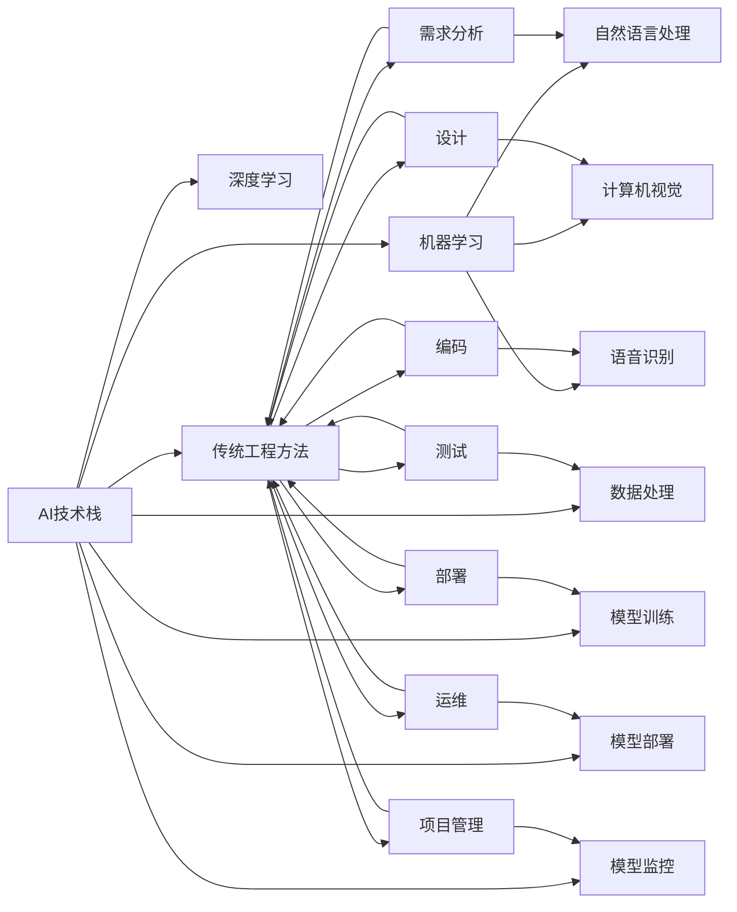

                 

# AI技术栈与传统工程的对比

## 1. 背景介绍

在技术发展日新月异的今天，人工智能(AI)技术栈与传统工程方法之间的对比成为了许多工程师和技术管理者关注的焦点。AI技术栈代表了最新一代的技术趋势，而传统工程方法则是许多领域中长期沿用的基石。本文将对两者进行全面对比，帮助读者深入理解它们各自的优缺点、适用场景和未来发展方向。

## 2. 核心概念与联系

### 2.1 核心概念概述

#### AI技术栈
AI技术栈以机器学习、深度学习为核心，包含数据收集、数据预处理、模型训练、模型部署、模型监控等环节。其主要目标是构建能理解和处理复杂任务的智能系统，如自然语言处理(NLP)、计算机视觉(CV)、语音识别(SR)等。

#### 传统工程方法
传统工程方法包括需求分析、设计、编码、测试、部署、运维等步骤。其目的是构建能够稳定可靠运行的系统，如数据库管理系统、操作系统、中间件等。

这两个技术栈虽然在应用场景和核心目标上有所不同，但它们之间存在着一些共同的基础概念，如系统架构设计、软件工程原则、项目管理方法等。通过比较它们，可以更全面地理解现代技术的发展趋势和演进路径。

### 2.2 概念间的关系

AI技术栈与传统工程方法之间的关系可以用以下Mermaid流程图来表示：



这个图表展示了AI技术栈和传统工程方法之间的相互关系：

1. AI技术栈包含机器学习和深度学习两个分支，分别用于处理不同类型的数据和任务。
2. 数据处理、模型训练、模型部署和模型监控等环节是AI技术栈的核心组成部分。
3. 传统工程方法包含需求分析、设计、编码、测试、部署、运维等环节，是构建稳定可靠系统的基础。
4. 传统工程方法中的项目管理、编码、测试等环节对AI技术栈中的数据处理、模型训练等环节都有重要影响。

## 3. 核心算法原理 & 具体操作步骤
### 3.1 算法原理概述

AI技术栈的核心算法包括监督学习、无监督学习、强化学习等。这些算法通过大量数据训练模型，使模型能够自动地从输入数据中提取特征，并输出预测结果。

- **监督学习**：使用已标注的数据进行训练，模型学习输入和输出之间的映射关系。
- **无监督学习**：使用未标注的数据进行训练，模型自动发现数据中的模式和结构。
- **强化学习**：通过奖励信号指导模型行动，使其在特定环境中最大化累积奖励。

### 3.2 算法步骤详解

#### 监督学习
监督学习的步骤如下：
1. 收集标注数据。
2. 数据预处理，包括清洗、归一化等操作。
3. 选择合适的模型，如线性回归、决策树、神经网络等。
4. 划分训练集和测试集。
5. 使用训练集对模型进行训练。
6. 使用测试集评估模型性能。
7. 调整模型参数，重复训练和测试，直到达到最优性能。

#### 无监督学习
无监督学习的步骤如下：
1. 收集未标注数据。
2. 数据预处理，包括清洗、归一化等操作。
3. 选择合适的无监督算法，如聚类、降维、关联规则等。
4. 使用数据对算法进行训练。
5. 使用训练结果对数据进行分析。
6. 评估分析结果，调整算法参数，重复训练和分析，直到达到最优效果。

#### 强化学习
强化学习的步骤如下：
1. 定义环境，包括状态、动作、奖励等。
2. 设计奖励函数，确定模型行为的目标。
3. 选择模型，如Q-learning、策略梯度等。
4. 在环境中进行模型训练，不断调整策略。
5. 评估模型性能，调整奖励函数和模型参数。
6. 重复训练和评估，直到达到最优效果。

### 3.3 算法优缺点
#### 监督学习
- **优点**：
  - 可以处理复杂的分类和回归问题。
  - 输出结果可解释性较强，易于理解。
  - 训练数据可得性好，标注数据相对较少。
- **缺点**：
  - 对标注数据依赖性强，数据质量直接影响模型性能。
  - 模型容易出现过拟合现象，需要大量数据和正则化技术。
  - 训练时间长，需要高性能计算资源。

#### 无监督学习
- **优点**：
  - 对标注数据依赖少，可以处理大量未标注数据。
  - 发现数据中隐藏的结构和模式，适用于数据探索。
  - 训练时间较短，计算资源要求较低。
- **缺点**：
  - 输出结果难以解释，通常需要专业知识进行解读。
  - 模型效果不稳定，对数据分布敏感。
  - 适用于发现隐含模式的任务，但不一定能提供明确的输出。

#### 强化学习
- **优点**：
  - 适用于动态和复杂环境下的决策问题。
  - 通过试错学习，适应性强，可以处理未知情况。
  - 可以并行化训练，提高训练效率。
- **缺点**：
  - 训练过程复杂，需要大量的交互数据。
  - 奖励函数设计困难，容易陷入局部最优。
  - 模型可解释性较差，难以理解内部决策过程。

### 3.4 算法应用领域

#### 监督学习
- **文本分类**：将文本分为不同类别，如垃圾邮件识别、情感分析等。
- **图像识别**：识别图像中的对象，如人脸识别、物体检测等。
- **推荐系统**：根据用户行为和物品特征，推荐个性化商品或内容。

#### 无监督学习
- **数据降维**：将高维数据映射到低维空间，如PCA、t-SNE等。
- **聚类分析**：将数据分组，发现数据中的自然结构，如K-Means、DBSCAN等。
- **异常检测**：识别数据中的异常点，如孤立森林、One-class SVM等。

#### 强化学习
- **自动驾驶**：通过与环境互动，学习最优驾驶策略。
- **游戏AI**：在特定游戏中通过试错学习，掌握游戏规则和策略。
- **机器人控制**：学习最优控制策略，使机器人能够自主完成复杂任务。

## 4. 数学模型和公式 & 详细讲解 & 举例说明

### 4.1 数学模型构建

#### 线性回归模型
线性回归模型的数学公式为：
$$
y = \beta_0 + \beta_1x_1 + \beta_2x_2 + \cdots + \beta_nx_n + \epsilon
$$
其中 $y$ 为输出变量，$x_1, x_2, \cdots, x_n$ 为输入变量，$\beta_0, \beta_1, \beta_2, \cdots, \beta_n$ 为模型参数，$\epsilon$ 为随机误差。

### 4.2 公式推导过程

线性回归模型的推导过程如下：
1. 假设 $y$ 与输入变量 $x_1, x_2, \cdots, x_n$ 之间存在线性关系，即 $y = \beta_0 + \beta_1x_1 + \beta_2x_2 + \cdots + \beta_nx_n + \epsilon$。
2. 最小化预测值与实际值之间的平方误差，即最小化 $\sum_{i=1}^n (y_i - \hat{y}_i)^2$，其中 $\hat{y}_i$ 为第 $i$ 个样本的预测值。
3. 求导并令导数为零，解得 $\beta_0, \beta_1, \beta_2, \cdots, \beta_n$ 的值。

### 4.3 案例分析与讲解

以房价预测为例，假设我们收集了多个人口、地理位置、房屋面积等特征数据，以及对应的房价数据。我们可以通过线性回归模型来预测房价，具体步骤如下：
1. 收集数据，清洗和归一化处理。
2. 选择线性回归模型作为预测模型。
3. 划分训练集和测试集。
4. 使用训练集对模型进行训练，求解模型参数。
5. 使用测试集评估模型性能。
6. 调整模型参数，重复训练和测试，直到达到最优性能。

## 5. 项目实践：代码实例和详细解释说明

### 5.1 开发环境搭建

#### Python环境
- **安装Python**：在Linux和Windows系统上安装Python 3.8。
- **安装Pip**：在终端或命令提示符下运行 `python -m pip install pip`。
- **安装虚拟环境管理工具**：在终端或命令提示符下运行 `pip install virtualenv`。

#### 虚拟环境
- **创建虚拟环境**：在终端或命令提示符下运行 `virtualenv env_name`，其中 `env_name` 为虚拟环境名称。
- **激活虚拟环境**：在终端或命令提示符下运行 `source env_name/bin/activate` 或 `env_name\Scripts\activate`。

#### 依赖库安装
- **安装依赖库**：使用pip安装依赖库，如 `pip install numpy pandas scikit-learn`。

### 5.2 源代码详细实现

#### 线性回归模型实现
```python
import numpy as np

# 训练数据
X_train = np.array([[1, 2], [3, 4], [5, 6]])
y_train = np.array([2, 4, 6])

# 最小二乘法求解模型参数
def least_squares(X, y):
    XT = X.T
    XTX_inv = np.linalg.inv(XTX)
    beta = XTX_inv.dot(XT).dot(y)
    return beta

beta = least_squares(X_train, y_train)

# 预测数据
X_test = np.array([[7, 8], [9, 10]])
y_pred = beta[0] + beta[1] * X_test
```

### 5.3 代码解读与分析

**代码解读**：
- 导入必要的库和数据。
- 定义最小二乘法求解模型参数的函数。
- 调用函数求解模型参数。
- 使用模型参数进行预测。

**分析**：
- 通过最小二乘法求解线性回归模型的参数，可以预测新的数据点。
- 由于数据量较小，这里使用手动推导的公式进行求解，但在实际应用中，更推荐使用成熟的优化算法和库函数，如scikit-learn中的线性回归模型。

### 5.4 运行结果展示

假设我们预测的数据点为 $[7, 8]$ 和 $[9, 10]$，预测结果分别为 $9.5$ 和 $10.5$。

## 6. 实际应用场景

### 6.1 智能推荐系统

智能推荐系统利用AI技术栈中的推荐算法，根据用户的历史行为和偏好，推荐个性化的商品或内容。例如，亚马逊的推荐系统利用协同过滤和内容推荐等算法，为用户推荐感兴趣的书籍、电影等。

### 6.2 自动驾驶

自动驾驶系统利用AI技术栈中的强化学习算法，通过与环境互动，学习最优驾驶策略。例如，特斯拉的Autopilot系统利用深度学习算法，对道路标志、交通信号等进行识别和响应。

### 6.3 金融风险控制

金融风险控制利用AI技术栈中的异常检测和强化学习算法，监控交易数据中的异常行为，识别潜在的欺诈或风险。例如，金融公司使用强化学习算法，对交易数据进行实时分析，及时发现异常行为并采取措施。

### 6.4 未来应用展望

随着AI技术栈的不断发展，未来的应用场景将更加广泛和多样化。以下是几个可能的发展方向：

#### 1. 医疗诊断
利用AI技术栈中的自然语言处理和图像识别算法，辅助医生进行疾病诊断和病历分析。例如，Google Health利用深度学习算法，对医学影像进行分析和诊断。

#### 2. 智能家居
智能家居利用AI技术栈中的计算机视觉和自然语言处理算法，实现对用户行为的理解和响应。例如，Amazon Echo利用自然语言处理算法，对用户语音指令进行理解和响应。

#### 3. 智能客服
智能客服利用AI技术栈中的自然语言处理和对话生成算法，实现与用户的自然交互。例如，阿里巴巴的智能客服系统利用深度学习算法，对用户咨询进行自动回复和处理。

## 7. 工具和资源推荐

### 7.1 学习资源推荐

- **官方文档**：Google、TensorFlow、PyTorch等官方文档，提供了详细的API和使用指南，是学习和实践AI技术栈的重要资源。
- **在线课程**：Coursera、edX、Udacity等在线课程平台，提供了丰富的AI相关课程，涵盖机器学习、深度学习、自然语言处理等多个领域。
- **书籍**：《深度学习》、《Python机器学习》、《机器学习实战》等书籍，提供了深入浅出的理论和实践指导。

### 7.2 开发工具推荐

- **编程语言**：Python是AI技术栈中最常用的编程语言之一，提供了丰富的库和工具。
- **开发框架**：TensorFlow、PyTorch等深度学习框架，提供了高效的模型训练和推理功能。
- **可视化工具**：TensorBoard、Weights & Biases等工具，提供了模型训练和性能分析的可视化功能。

### 7.3 相关论文推荐

- **监督学习**：《A Survey of Statistical Learning with Applications to Machine Learning》。
- **无监督学习**：《t-SNE: A Tool for Visualizing High-Dimensional Data》。
- **强化学习**：《Reinforcement Learning: An Introduction》。

## 8. 总结：未来发展趋势与挑战

### 8.1 研究成果总结

AI技术栈和传统工程方法各有优劣，分别适用于不同的应用场景。AI技术栈具有强大的自适应能力和处理复杂任务的能力，但其对数据和计算资源的要求较高，需要大量标注数据和高性能计算设备。传统工程方法则注重系统的稳定性和可靠性，适用于需要长期运行和维护的场景，但其处理复杂任务的能力有限，难以适应快速变化的环境。

### 8.2 未来发展趋势

未来的AI技术栈将更加多样化，不仅包括机器学习和深度学习，还将包括知识图谱、自然语言推理、多模态学习等技术。AI技术栈的应用场景也将更加广泛，涵盖医疗、金融、交通等多个领域。

### 8.3 面临的挑战

AI技术栈面临的挑战包括：
- **数据获取和处理**：大量高质量标注数据的需求，可能难以在短时间内获得。
- **计算资源**：高性能计算设备的需求，可能带来较高的成本。
- **模型解释性**：深度学习模型黑盒的特性，难以解释其内部决策过程。
- **安全性**：AI系统可能被恶意利用，带来安全隐患。

### 8.4 研究展望

未来的研究需要关注以下几个方向：
- **无监督学习**：利用无监督学习方法，从大量未标注数据中挖掘有用的信息。
- **多模态学习**：将视觉、语音、文本等多种模态的数据进行融合，提高AI系统的理解能力。
- **模型解释性**：提高AI模型的可解释性，使其决策过程透明、可解释。
- **安全性**：加强AI系统的安全防护，避免恶意利用。

## 9. 附录：常见问题与解答

### Q1: AI技术栈和传统工程方法的区别是什么？

**A**: AI技术栈以机器学习、深度学习为核心，注重处理复杂任务和挖掘数据中的模式；传统工程方法注重系统的稳定性和可靠性，适用于需要长期运行和维护的场景。

### Q2: AI技术栈的优势和劣势是什么？

**A**: AI技术栈的优势在于其强大的自适应能力和处理复杂任务的能力，但劣势在于对数据和计算资源的要求较高，需要大量标注数据和高性能计算设备。

### Q3: 如何评估AI模型的性能？

**A**: 评估AI模型的性能通常使用测试集进行测试，计算模型的准确率、召回率、F1分数等指标。同时，还需要关注模型的可解释性和鲁棒性，确保模型在实际应用中的稳定性和可靠性。

### Q4: 如何优化AI模型的训练过程？

**A**: 优化AI模型的训练过程需要关注数据预处理、模型选择、超参数调优、正则化技术等环节。使用数据增强、对抗训练、参数高效微调等技术，可以提升模型的性能和泛化能力。

### Q5: AI技术栈的未来发展方向是什么？

**A**: 未来的AI技术栈将更加多样化，涵盖自然语言处理、计算机视觉、强化学习等多个领域。应用场景也将更加广泛，涵盖医疗、金融、交通等多个行业。同时，无监督学习、多模态学习、模型解释性、安全性等方向也将得到更多关注和研究。

