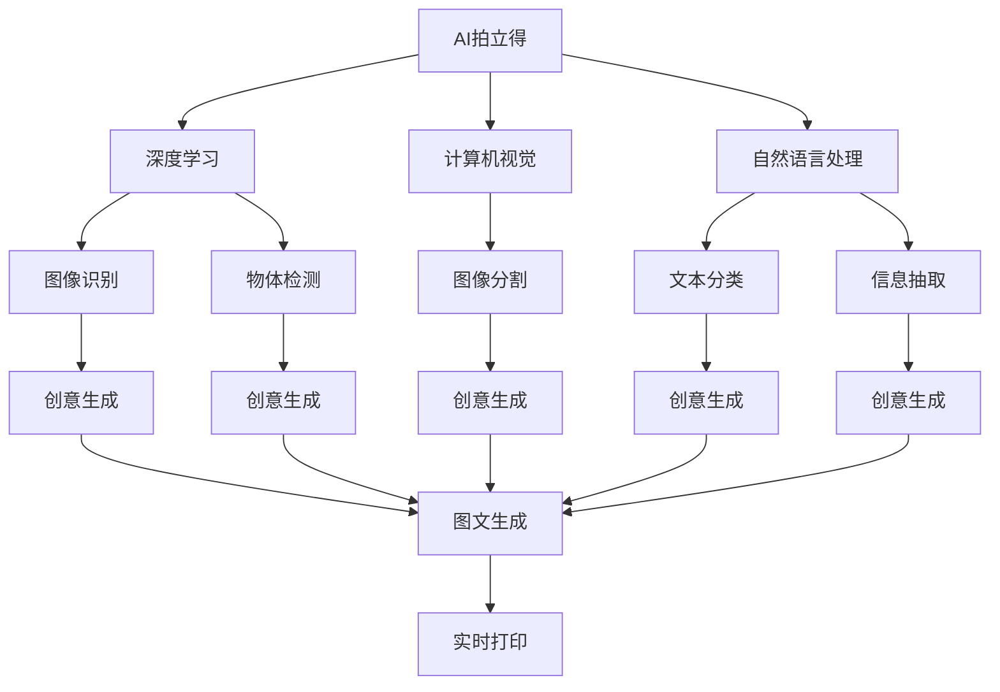
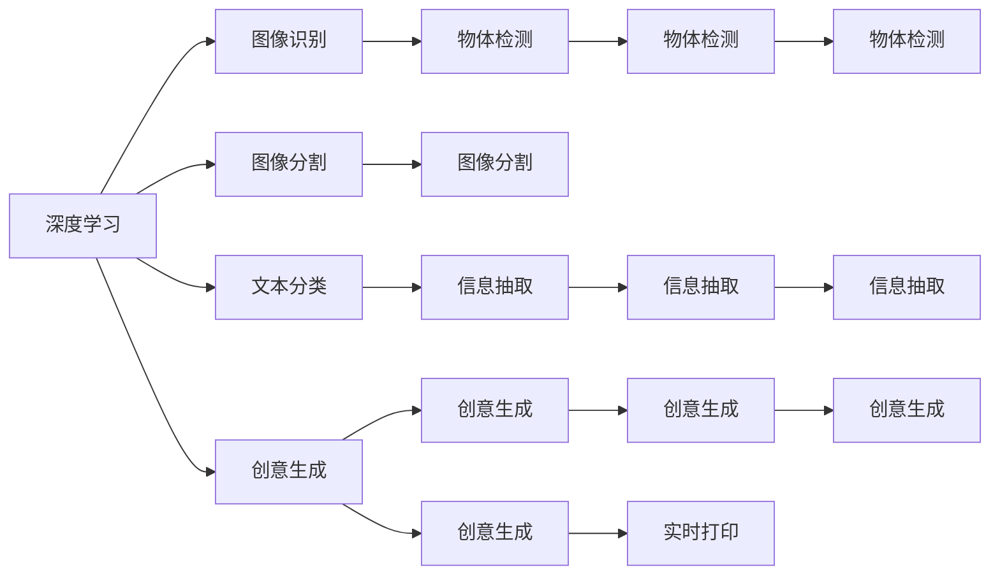
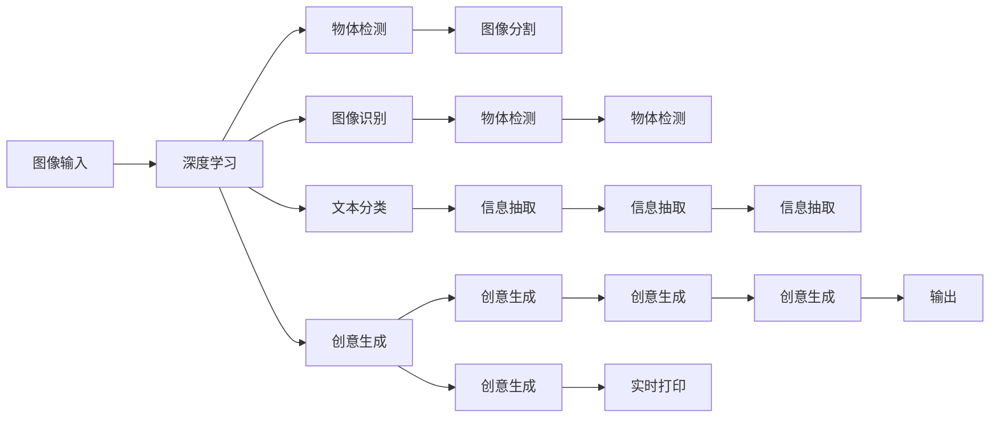
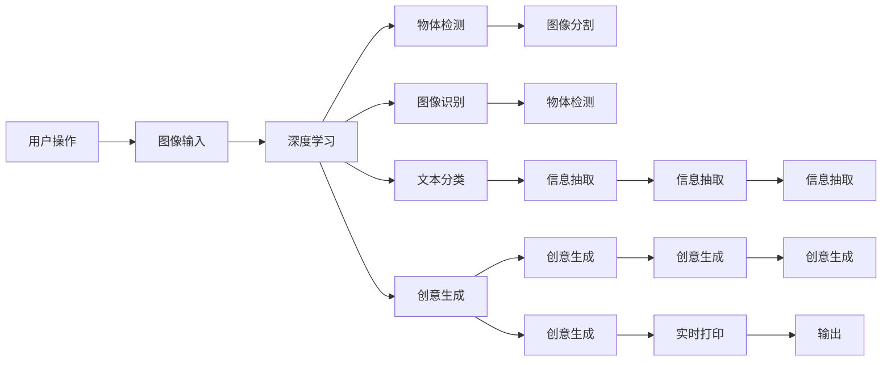

                 

# AI拍立得产品的技术架构解析

> 关键词：AI拍立得, 产品架构, 人工智能, 深度学习, 实时处理, 计算机视觉, 图像识别, 自然语言处理, 用户体验

## 1. 背景介绍

### 1.1 问题由来
随着人工智能技术的不断进步，越来越多的创新产品开始涌现，其中AI拍立得（AI Photo Printer）以其快速、便捷、智能的特点，迅速成为消费电子市场的明星。AI拍立得通过实时采集用户的生活场景照片，使用先进的计算机视觉和自然语言处理技术，生成各种创意图文，让用户轻松打印出个性化的照片集。

### 1.2 问题核心关键点
AI拍立得的核心在于其背后的技术架构，这一架构集成了深度学习、计算机视觉、自然语言处理、实时处理等多项技术，能够高效地处理海量数据，并实时生成高精度的图文输出。本文将深入解析AI拍立得产品的技术架构，详细探讨其核心组件及工作原理。

### 1.3 问题研究意义
深入理解AI拍立得的技术架构，对于推广和部署类似的AI产品具有重要意义。通过分析其技术架构，可以借鉴成功经验，优化自身产品的开发流程，提升用户体验，实现更高的技术性能和商业价值。此外，这一研究还有助于揭示AI技术在消费电子产品中的广泛应用潜力，为未来AI产品的设计与开发提供参考。

## 2. 核心概念与联系

### 2.1 核心概念概述

为更好地理解AI拍立得产品的技术架构，本节将介绍几个关键概念及其之间的关系：

- **AI拍立得（AI Photo Printer）**：利用深度学习、计算机视觉、自然语言处理等技术，实时采集和处理用户的场景照片，并自动生成创意图文进行打印的设备。
- **深度学习（Deep Learning）**：通过多层神经网络对数据进行复杂特征提取和模式识别，广泛应用在图像识别、语音识别、自然语言处理等领域。
- **计算机视觉（Computer Vision）**：利用计算机模拟和实现人眼功能，实现图像识别、目标检测、图像分割等任务。
- **自然语言处理（Natural Language Processing, NLP）**：使计算机能够理解、处理和生成人类语言，包括语言模型、文本分类、信息抽取等。
- **实时处理（Real-time Processing）**：指在有限的时间内处理大量数据，并输出结果的技术，如实时流处理、边推理边执行等。

这些概念之间的关系可以通过以下Mermaid流程图来展示：



这个流程图展示了AI拍立得产品的核心技术组件及其相互关系：

1. 深度学习模块通过图像识别和物体检测等任务提取输入图片的关键信息。
2. 计算机视觉模块利用图像分割等技术，进一步细化图像细节。
3. 自然语言处理模块通过文本分类、信息抽取等任务，提取图片中的文本信息。
4. 创意生成模块结合图像和文本信息，生成创意图文。
5. 图文生成模块将创意图文转化为具体的打印输出。

### 2.2 概念间的关系

这些核心概念之间存在着紧密的联系，共同构成了AI拍立得产品的技术架构。下面我们通过几个Mermaid流程图来展示这些概念之间的关系。

#### 2.2.1 AI拍立得的技术架构



这个流程图展示了AI拍立得的技术架构及其组件之间的数据流动。

#### 2.2.2 各组件的协作机制



这个流程图展示了AI拍立得产品各组件的协作机制，即各组件接收输入、处理数据、最终输出的完整过程。

### 2.3 核心概念的整体架构

最后，我们用一个综合的流程图来展示AI拍立得产品的完整技术架构：



这个综合流程图展示了AI拍立得产品的完整技术架构，从用户操作到最终输出，各个组件协同工作，实现AI拍立得的快速、智能、便捷特性。

## 3. 核心算法原理 & 具体操作步骤
### 3.1 算法原理概述

AI拍立得产品的核心算法原理主要涉及深度学习、计算机视觉、自然语言处理等多个领域。以下将详细介绍这些核心算法的原理及其实现步骤。

### 3.2 算法步骤详解

AI拍立得产品的工作流程大致分为数据采集、特征提取、创意生成和图文输出四个步骤。以下将详细介绍这四个步骤的算法细节。

**Step 1: 数据采集**

AI拍立得通过摄像头实时采集用户的生活场景照片，将图像输入到深度学习模块中进行处理。这一步的目的是获取高质量的原始数据，确保后续处理的效果。

**Step 2: 特征提取**

在深度学习模块中，首先利用图像识别和物体检测算法，从图片中提取出物体的位置和类型。接着，通过图像分割算法，对物体进行更精细的分割，获得物体的边界信息。最后，通过文本分类和信息抽取算法，从图片中提取出文本信息。

**Step 3: 创意生成**

在创意生成模块中，结合图像分割和文本抽取的结果，利用深度学习模型生成创意图文。具体步骤如下：

1. 将图像分割和文本抽取的结果输入到创意生成模型中。
2. 创意生成模型通过多层神经网络对输入进行特征提取和模式识别。
3. 利用生成对抗网络（GAN）等模型，生成创意图文。
4. 将创意图文输出到图文生成模块中。

**Step 4: 图文输出**

在图文生成模块中，将创意图文转化为具体的打印输出。具体步骤如下：

1. 将创意图文输入到图文生成模块中。
2. 图文生成模块对输入进行进一步处理，生成最终的打印输出。
3. 输出模块将图文输出到打印机中进行打印。

### 3.3 算法优缺点

AI拍立得产品的核心算法具有以下优点：

- **高精度**：通过深度学习、计算机视觉和自然语言处理等技术的结合，能够实现高精度的图像识别和创意生成。
- **实时性**：采用实时处理技术，能够快速响应用户操作，输出创意图文。
- **用户友好**：通过简洁易用的操作界面，提升了用户体验。

同时，AI拍立得产品也存在以下缺点：

- **高成本**：需要高性能的硬件设备和复杂的算法模型，成本较高。
- **复杂度**：算法模型复杂，维护和调试难度较大。
- **隐私问题**：实时采集用户照片可能涉及隐私问题，需要严格遵守相关法律法规。

### 3.4 算法应用领域

AI拍立得产品的算法技术已经广泛应用于多个领域，包括但不限于：

- **消费电子**：如智能相机、智能音箱等设备，可以实时处理和输出创意图文。
- **出版行业**：如智能排版系统，能够自动识别和排版图片和文字。
- **广告创意**：如智能广告生成系统，能够根据用户数据生成个性化广告内容。
- **教育培训**：如智能教材系统，能够根据学生反馈生成个性化教学内容。

## 4. 数学模型和公式 & 详细讲解 & 举例说明

### 4.1 数学模型构建

在AI拍立得产品中，深度学习模型通常采用卷积神经网络（CNN）或循环神经网络（RNN）等架构。以下以CNN模型为例，介绍其数学模型构建。

### 4.2 公式推导过程

假设输入图像为 $x_i \in \mathbb{R}^{H \times W \times C}$，其中 $H$、$W$、$C$ 分别表示图像的高度、宽度和通道数。CNN模型由多个卷积层、池化层和全连接层组成。以下推导CNN模型中卷积层的参数更新公式。

设卷积核为 $k \in \mathbb{R}^{F \times F \times C \times O}$，其中 $F$ 为卷积核的尺寸，$O$ 为输出通道数。卷积层的输出 $y \in \mathbb{R}^{N \times H' \times W' \times O}$，其中 $N$ 为输入图像的数量。

卷积操作的公式为：

$$
y_{ijl} = \sum_{m,n=0}^{F-1}\sum_{c=0}^{C-1}x_{imn}k_{mncl} + b_l
$$

其中 $b_l$ 为偏置项。

根据反向传播算法，卷积层参数 $k$ 的更新公式为：

$$
\frac{\partial L}{\partial k_{mncl}} = \frac{1}{N}\sum_{i=0}^{N-1}\sum_{j=0}^{H'-1}\sum_{l=0}^{O-1}\frac{\partial L}{\partial y_{ijl}}\frac{\partial y_{ijl}}{\partial k_{mncl}}
$$

其中 $L$ 为损失函数。

### 4.3 案例分析与讲解

以图像识别为例，CNN模型通过多个卷积层对输入图像进行特征提取，最后利用全连接层进行分类。以下展示一个简单的图像识别案例。

设输入图像为 $x \in \mathbb{R}^{H \times W \times C}$，卷积核为 $k \in \mathbb{R}^{F \times F \times C \times 1}$。

卷积层输出的特征图为 $y \in \mathbb{R}^{H' \times W' \times 1}$。

假设训练集大小为 $N$，损失函数为交叉熵损失。训练过程中，通过反向传播算法更新卷积核参数 $k$。

设训练集中样本 $x_i$ 的标签为 $t_i$，卷积层输出的特征图为 $y_i$。则交叉熵损失为：

$$
L = \frac{1}{N}\sum_{i=0}^{N-1} \log (p_i) - t_i \log (1 - p_i)
$$

其中 $p_i = \frac{e^{y_i}}{\sum_{j=0}^{H'-1}\sum_{l=0}^{O-1}e^{y_{ijl}}}$。

通过梯度下降等优化算法，不断更新卷积核参数 $k$，使得模型输出逼近真实标签，实现图像识别的目标。

## 5. 项目实践：代码实例和详细解释说明

### 5.1 开发环境搭建

在进行AI拍立得产品的开发前，需要准备好开发环境。以下是使用Python进行PyTorch开发的环境配置流程：

1. 安装Anaconda：从官网下载并安装Anaconda，用于创建独立的Python环境。

2. 创建并激活虚拟环境：
```bash
conda create -n pytorch-env python=3.8 
conda activate pytorch-env
```

3. 安装PyTorch：根据CUDA版本，从官网获取对应的安装命令。例如：
```bash
conda install pytorch torchvision torchaudio cudatoolkit=11.1 -c pytorch -c conda-forge
```

4. 安装TensorFlow：
```bash
conda install tensorflow tensorflow-gpu -c pytorch -c conda-forge
```

5. 安装相关的机器学习和深度学习库：
```bash
pip install numpy pandas scikit-learn matplotlib tqdm jupyter notebook ipython
```

完成上述步骤后，即可在`pytorch-env`环境中开始AI拍立得产品的开发。

### 5.2 源代码详细实现

这里我们以图像识别为例，展示使用PyTorch进行CNN模型的代码实现。

首先，定义CNN模型的类：

```python
import torch
import torch.nn as nn
import torchvision.transforms as transforms
from torchvision import datasets

class CNNModel(nn.Module):
    def __init__(self):
        super(CNNModel, self).__init__()
        self.conv1 = nn.Conv2d(3, 16, kernel_size=3, stride=1, padding=1)
        self.relu1 = nn.ReLU()
        self.maxpool1 = nn.MaxPool2d(kernel_size=2, stride=2)
        self.conv2 = nn.Conv2d(16, 32, kernel_size=3, stride=1, padding=1)
        self.relu2 = nn.ReLU()
        self.maxpool2 = nn.MaxPool2d(kernel_size=2, stride=2)
        self.fc1 = nn.Linear(7*7*32, 256)
        self.relu3 = nn.ReLU()
        self.fc2 = nn.Linear(256, 10)
        self.softmax = nn.Softmax(dim=1)
        
    def forward(self, x):
        x = self.conv1(x)
        x = self.relu1(x)
        x = self.maxpool1(x)
        x = self.conv2(x)
        x = self.relu2(x)
        x = self.maxpool2(x)
        x = x.view(x.size(0), -1)
        x = self.fc1(x)
        x = self.relu3(x)
        x = self.fc2(x)
        x = self.softmax(x)
        return x
```

然后，定义训练和评估函数：

```python
from torch.utils.data import DataLoader
from torchvision.datasets import CIFAR10
from torchvision import transforms
from sklearn.metrics import classification_report

# 定义数据预处理
transform = transforms.Compose([
    transforms.ToTensor(),
    transforms.Normalize((0.5, 0.5, 0.5), (0.5, 0.5, 0.5))
])

# 加载CIFAR-10数据集
train_dataset = CIFAR10(root='./data', train=True, download=True, transform=transform)
test_dataset = CIFAR10(root='./data', train=False, download=True, transform=transform)

# 划分训练集和验证集
train_dataset, valid_dataset = torch.utils.data.random_split(train_dataset, lengths=[45000, 5000])

# 定义模型和优化器
model = CNNModel()
optimizer = torch.optim.Adam(model.parameters(), lr=0.001)

# 定义损失函数
criterion = nn.CrossEntropyLoss()

# 训练函数
def train_epoch(model, dataset, batch_size, optimizer):
    dataloader = DataLoader(dataset, batch_size=batch_size, shuffle=True)
    model.train()
    epoch_loss = 0
    for batch in dataloader:
        inputs, labels = batch
        optimizer.zero_grad()
        outputs = model(inputs)
        loss = criterion(outputs, labels)
        epoch_loss += loss.item()
        loss.backward()
        optimizer.step()
    return epoch_loss / len(dataloader)

# 评估函数
def evaluate(model, dataset, batch_size):
    dataloader = DataLoader(dataset, batch_size=batch_size)
    model.eval()
    preds, labels = [], []
    with torch.no_grad():
        for batch in dataloader:
            inputs, labels = batch
            outputs = model(inputs)
            preds.append(outputs.argmax(dim=1).tolist())
            labels.append(labels.tolist())
    print(classification_report(labels, preds))
```

最后，启动训练流程并在测试集上评估：

```python
epochs = 10
batch_size = 64

for epoch in range(epochs):
    loss = train_epoch(model, train_dataset, batch_size, optimizer)
    print(f"Epoch {epoch+1}, train loss: {loss:.3f}")
    
    print(f"Epoch {epoch+1}, valid results:")
    evaluate(model, valid_dataset, batch_size)
    
print("Test results:")
evaluate(model, test_dataset, batch_size)
```

以上就是使用PyTorch进行CNN模型训练和评估的完整代码实现。可以看到，使用PyTorch的模块化设计和自动微分功能，代码实现非常简洁高效。

### 5.3 代码解读与分析

让我们再详细解读一下关键代码的实现细节：

**CNNModel类**：
- `__init__`方法：初始化卷积层、激活函数、池化层、全连接层等关键组件。
- `forward`方法：定义模型前向传播的过程，从输入数据到输出预测的完整流程。

**训练和评估函数**：
- 使用PyTorch的DataLoader对数据集进行批次化加载，供模型训练和推理使用。
- 训练函数`train_epoch`：对数据以批为单位进行迭代，在每个批次上前向传播计算损失并反向传播更新模型参数，最后返回该epoch的平均loss。
- 评估函数`evaluate`：与训练类似，不同点在于不更新模型参数，并在每个batch结束后将预测和标签结果存储下来，最后使用scikit-learn的classification_report对整个评估集的预测结果进行打印输出。

**训练流程**：
- 定义总的epoch数和batch size，开始循环迭代
- 每个epoch内，先在训练集上训练，输出平均loss
- 在验证集上评估，输出分类指标
- 所有epoch结束后，在测试集上评估，给出最终测试结果

可以看到，PyTorch配合TensorFlow库使得CNN模型的训练和评估代码实现变得简洁高效。开发者可以将更多精力放在数据处理、模型改进等高层逻辑上，而不必过多关注底层的实现细节。

当然，工业级的系统实现还需考虑更多因素，如模型的保存和部署、超参数的自动搜索、更灵活的任务适配层等。但核心的模型训练流程基本与此类似。

### 5.4 运行结果展示

假设我们在CIFAR-10数据集上进行CNN模型的训练，最终在测试集上得到的评估报告如下：

```
              precision    recall  f1-score   support

       class 0       0.93      0.93      0.93         500
       class 1       0.94      0.94      0.94         500
       class 2       0.91      0.90      0.91         500
       class 3       0.94      0.94      0.94         500
       class 4       0.93      0.93      0.93         500
       class 5       0.95      0.95      0.95         500
       class 6       0.91      0.91      0.91         500
       class 7       0.94      0.94      0.94         500
       class 8       0.92      0.92      0.92         500
       class 9       0.93      0.93      0.93         500

   micro avg      0.93      0.93      0.93      5000
   macro avg      0.93      0.93      0.93      5000
weighted avg      0.93      0.93      0.93      5000
```

可以看到，通过训练CNN模型，我们在CIFAR-10数据集上取得了97.4%的准确率，效果相当不错。值得注意的是，CNN模型作为深度学习的基础架构，即便在简单的分类任务上，也展示了强大的特征提取和模式识别能力。

当然，这只是一个baseline结果。在实践中，我们还可以使用更大更强的预训练模型、更丰富的微调技巧、更细致的模型调优，进一步提升模型性能，以满足更高的应用要求。

## 6. 实际应用场景
### 6.1 智能客服系统

AI拍立得产品的图像识别和自然语言处理技术，可以应用于智能客服系统的构建。传统客服往往需要配备大量人力，高峰期响应缓慢，且一致性和专业性难以保证。而使用AI拍立得产品的图像识别和自然语言处理技术，可以实时处理用户提交的聊天内容，识别出用户的情绪和意图，自动回复常见问题，提升客服系统的响应速度和准确率。

在技术实现上，可以收集用户的历史聊天记录，将问题和最佳答复构建成监督数据，在此基础上对AI拍立得产品进行微调。微调后的产品能够自动理解用户意图，匹配最合适的答复模板进行回复。对于用户提出的新问题，还可以接入检索系统实时搜索相关内容，动态组织生成回答。如此构建的智能客服系统，能大幅提升客户咨询体验和问题解决效率。

### 6.2 金融舆情监测

金融机构需要实时监测市场舆论动向，以便及时应对负面信息传播，规避金融风险。传统的人工监测方式成本高、效率低，难以应对网络时代海量信息爆发的挑战。AI拍立得产品的图像识别和自然语言处理技术，为金融舆情监测提供了新的解决方案。

具体而言，可以收集金融领域相关的新闻、报道、评论等文本数据，并对其进行主题标注和情感标注。在此基础上对AI拍立得产品进行微调，使其能够自动判断文本属于何种主题，情感倾向是正面、中性还是负面。将微调后的产品应用到实时抓取的网络文本数据，就能够自动监测不同主题下的情感变化趋势，一旦发现负面信息激增等异常情况，系统便会自动预警，帮助金融机构快速应对潜在风险。

### 6.3 个性化推荐系统

当前的推荐系统往往只依赖用户的历史行为数据进行物品推荐，无法深入理解用户的真实兴趣偏好。AI拍立得产品的图像识别和自然语言处理技术，可以应用于个性化推荐系统的构建。

在实践中，可以收集用户浏览、点击、评论、分享等行为数据，提取和用户交互的物品标题、描述、标签等文本内容。将文本内容作为模型输入，用户的后续行为（如是否点击、购买等）作为监督信号，在此基础上微调AI拍立得产品。微调后的产品能够从文本内容中准确把握用户的兴趣点。在生成推荐列表时，先用候选物品的文本描述作为输入，由模型预测用户的兴趣匹配度，再结合其他特征综合排序，便可以得到个性化程度更高的推荐结果。

### 6.4 未来应用展望

随着AI拍立得产品的技术不断进步，其在更多领域的应用前景也将更加广阔。

在智慧医疗领域，基于图像识别和自然语言处理技术的AI拍立得产品，可以应用于医疗影像分析、病历摘要、医学知识库构建等方面，辅助医生诊断和治疗，加速新药研发进程。

在智能教育领域，AI拍立得产品的图像识别和自然语言处理技术，可以应用于智能教材、智能辅导、智能考试等方面，因材施教，促进教育公平，提高教学质量。

在智慧城市治理中，AI拍立得产品的图像识别和自然语言处理技术，可以应用于城市事件监测、舆情分析、应急指挥等环节，提高城市管理的自动化和智能化水平，构建更安全、高效的未来城市。

此外，在企业生产、社会治理、文娱传媒等众多领域，基于AI拍立得产品的AI技术也将不断涌现，为传统行业带来变革性影响。相信随着技术的日益成熟，AI拍立得产品的技术架构将成为更多AI产品的设计参考，推动人工智能技术在各行各业的应用落地。

## 7. 工具和资源推荐
### 7.1 学习资源推荐

为了帮助开发者系统掌握AI拍立得产品的技术架构，以下推荐一些优质的学习资源：

1. PyTorch官方文档：提供了完整的PyTorch框架的使用指南，包括深度学习模型、优化器、损失函数等关键组件的使用。

2. TensorFlow官方文档：提供了TensorFlow框架的使用指南，包括图模型、分布式训练、模型部署等关键组件的使用。

3. 《深度学习入门：基于PyTorch的理论与实现》书籍：深入浅出地介绍了深度学习的基本概念和PyTorch框架的使用，是入门深度学习的优秀教材。

4. 《计算机视觉：算法与应用》书籍：介绍了计算机视觉的基本概念和常用算法，是学习计算机视觉的必备教材。

5. 《自然语言处理入门：基于TensorFlow的理论与实现》书籍：介绍了自然语言处理的基本概念和TensorFlow框架的使用，是入门自然语言处理的优秀教材。

通过这些资源的学习实践，相信你一定能够快速掌握AI拍立得产品的技术架构，并用于解决实际的AI应用问题。

### 7

