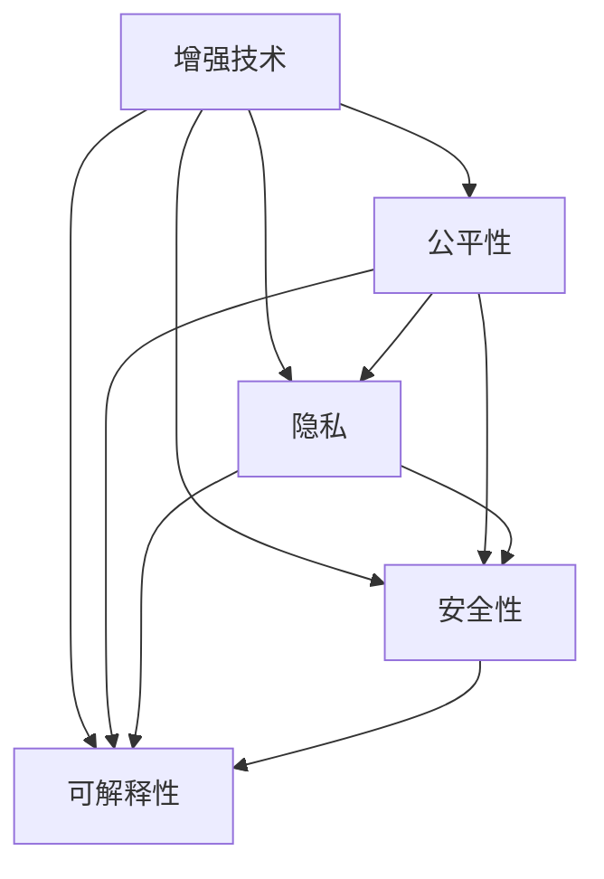
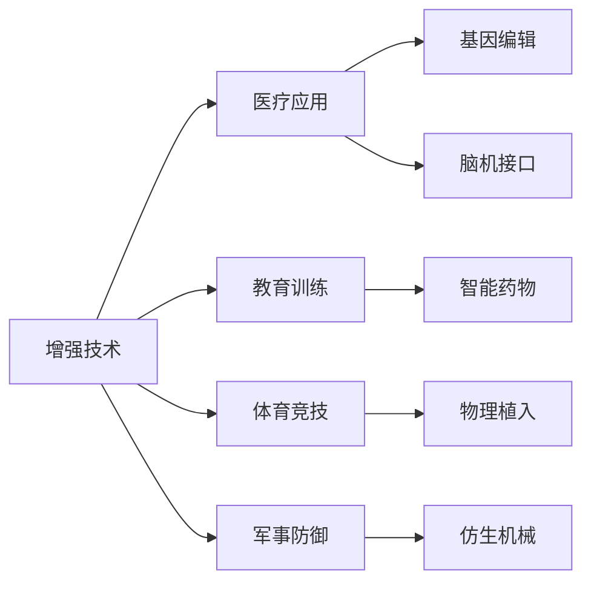
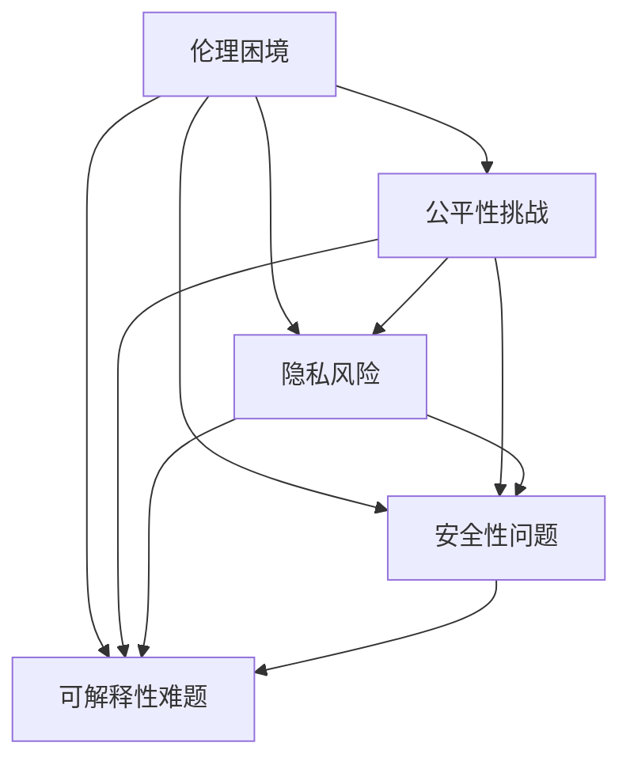
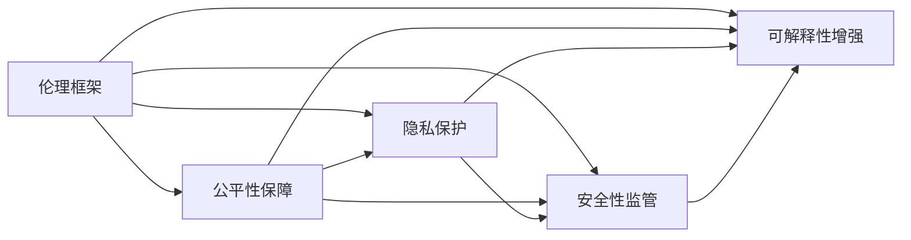
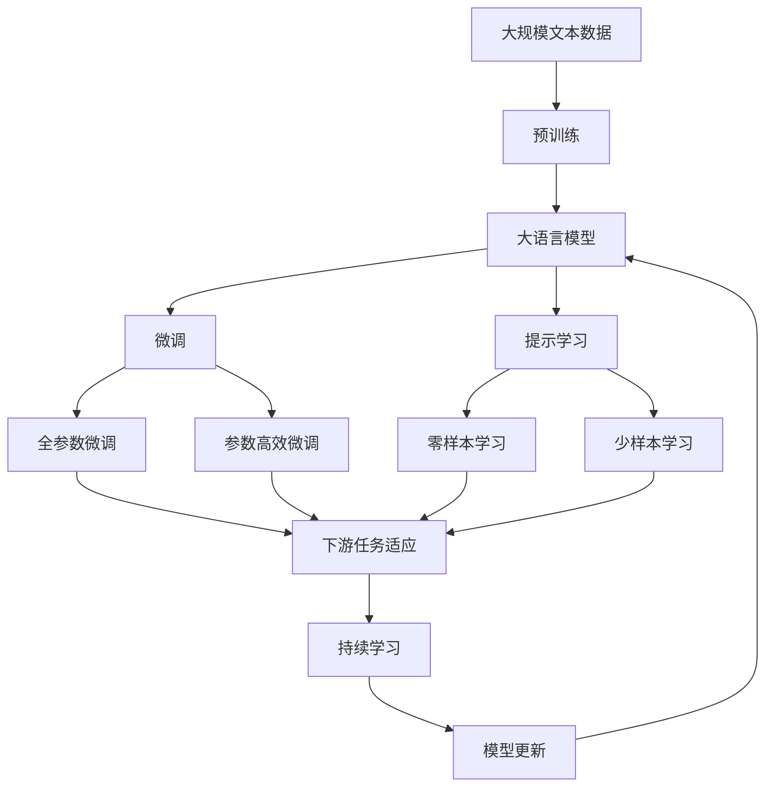

                 

# AI时代的人类增强：道德考虑与身体增强技术的未来前景

> 关键词：人工智能, 增强技术, 道德伦理, 身体增强, 健康医疗, 安全风险, 公平性, 可解释性

## 1. 背景介绍

在迅猛发展的AI时代，身体增强技术正逐渐成为现实。从药物到植入物，从基因编辑到脑机接口，这些技术的进步为人类带来了前所未有的生理能力提升。然而，这些增强技术的应用也引发了广泛的伦理道德争议和风险挑战。

### 1.1 问题由来
随着科技的进步，增强技术的发展也愈加深入。从个体到社会的各个层面，身体增强技术的应用日益广泛。这其中，既有对健康和体能的提升，也有对认知和感官的增强。尽管这些技术的潜在益处巨大，但其带来的风险和伦理问题同样不容忽视。

### 1.2 问题核心关键点
增强技术的应用涉及多个关键点：
- **增强方式**：包括基因编辑、药物干预、植入物、脑机接口等。每种方式的优势和风险各不相同。
- **增强对象**：既包括健康人群，也包括患有疾病或残疾的人群。不同群体的需求和期望差异显著。
- **伦理困境**：增强技术的开发、应用、监管等环节，涉及诸多伦理问题，如公平性、隐私、安全等。
- **技术边界**：何时停止技术增强？增强的边界在哪里？如何确保增强后的效果可持续和安全？

### 1.3 问题研究意义
研究增强技术的伦理道德问题，对于推动技术的健康发展，保障公众利益，具有重要意义：

1. **促进技术进步**：科学合理地指导增强技术的发展，避免因伦理争议导致的停滞或倒退。
2. **保障公众利益**：通过伦理审查和规范，确保增强技术的公平性、安全性和可及性，避免技术滥用。
3. **推动社会进步**：增强技术的发展能够促进社会公平、提升社会生产力和人类福祉。
4. **塑造技术未来**：合理的伦理框架有助于引导技术健康发展，塑造技术的未来方向。

## 2. 核心概念与联系

### 2.1 核心概念概述

为更好地理解身体增强技术及其伦理道德问题，本节将介绍几个密切相关的核心概念：

- **增强技术**：旨在提升人类生理能力的各类技术，包括基因编辑、药物干预、植入物、脑机接口等。
- **公平性**：指增强技术的开发、应用、监管等环节，能否实现资源的公平分配和利用，确保所有人都能从中受益。
- **隐私**：指个人数据和信息的保护，在增强技术应用中尤为重要，尤其是在基因数据和脑信号等方面。
- **安全性**：指增强技术应用的安全性，避免因技术失误或滥用导致的伤害。
- **可解释性**：指增强技术决策过程的可理解性，确保技术的透明性和可解释性。

这些核心概念之间的逻辑关系可以通过以下Mermaid流程图来展示：



这个流程图展示了几大核心概念的逻辑关系：

1. 增强技术的开发和应用直接涉及公平性、隐私、安全性和可解释性。
2. 公平性、隐私、安全性和可解释性是确保增强技术健康发展的关键要素。

### 2.2 概念间的关系

这些核心概念之间存在着紧密的联系，形成了增强技术的伦理道德框架。下面我们通过几个Mermaid流程图来展示这些概念之间的关系。

#### 2.2.1 增强技术的应用场景



这个流程图展示了增强技术在不同领域的应用场景：医疗、教育、体育、军事等。每种增强方式的应用，都会涉及到公平性、隐私、安全性和可解释性问题。

#### 2.2.2 伦理困境与挑战



这个流程图展示了增强技术在应用过程中可能遇到的伦理困境与挑战，包括公平性、隐私、安全性和可解释性等方面。

#### 2.2.3 伦理框架的构建



这个流程图展示了伦理框架的构建过程，即通过保障公平性、保护隐私、监管安全性和增强可解释性，构建伦理道德框架。

### 2.3 核心概念的整体架构

最后，我们用一个综合的流程图来展示这些核心概念在大语言模型微调过程中的整体架构：



这个综合流程图展示了从预训练到微调，再到持续学习的完整过程。增强技术的伦理道德框架同样适用于此。

## 3. 核心算法原理 & 具体操作步骤
### 3.1 算法原理概述

身体增强技术的伦理道德问题，主要集中在公平性、隐私、安全性和可解释性等方面。

### 3.2 算法步骤详解

**Step 1: 伦理审查与评估**
- 建立伦理委员会，由医学、法律、伦理学等领域的专家组成。
- 对增强技术进行初步审查，评估其安全性、有效性、可及性等。

**Step 2: 公平性评估**
- 对增强技术的研发和应用进行公平性评估，确保资源的公平分配。
- 调查目标群体对增强技术的接受程度，确保技术的可及性和普惠性。

**Step 3: 隐私保护**
- 制定严格的隐私保护政策，确保患者数据和隐私安全。
- 对数据收集、存储、处理等环节进行严格控制，防止数据滥用。

**Step 4: 安全性测试**
- 进行多轮安全性测试，评估增强技术可能带来的风险。
- 建立应急预案，对可能出现的风险进行应对和处理。

**Step 5: 可解释性增强**
- 开发透明、可解释的增强技术，确保技术决策过程的透明性和可理解性。
- 建立反馈机制，收集用户反馈，持续优化技术。

### 3.3 算法优缺点

增强技术在提升人类能力的同时，也带来了诸多伦理道德问题：

**优点**：
- **提升生理能力**：通过基因编辑、药物干预等手段，显著提升人类的健康水平和体能。
- **改善生活质量**：增强技术的应用能够显著改善患者的生活质量，提高生产效率。
- **推动医学进步**：增强技术在医疗领域的应用，推动了医学的创新和发展。

**缺点**：
- **伦理争议**：增强技术的应用涉及诸多伦理问题，如公平性、隐私、安全性等。
- **技术滥用**：增强技术的滥用可能导致社会不公，加剧社会不平等。
- **风险管理**：增强技术的应用可能带来不可预测的风险，如基因编辑的副作用、植入物的失败等。

### 3.4 算法应用领域

增强技术在多个领域都有广泛的应用，包括：

- **医疗健康**：基因编辑、药物干预、脑机接口等，用于治疗疾病、提升健康水平。
- **教育培训**：智能药物、脑机接口等，用于提升认知能力、学习效率。
- **体育竞技**：物理植入、增强药物等，用于提升运动员的体能和技能。
- **军事防御**：仿生机械、增强药物等，用于提升军事人员的体能和技能。

除了上述领域，增强技术在娱乐、娱乐、美容等方面也有应用，如增强药物用于娱乐和治疗，美体植入用于美容和塑形。

## 4. 数学模型和公式 & 详细讲解  
### 4.1 数学模型构建

增强技术的伦理道德问题，可以通过数学模型进行建模和分析。

假设有一个增强技术 $T$，对目标群体 $G$ 的公平性影响为 $F_T$，隐私风险为 $P_T$，安全性为 $S_T$，可解释性为 $E_T$。则可以定义一个伦理指数 $EI_T$ 来综合衡量这些因素：

$$
EI_T = \frac{F_T}{P_T + S_T + E_T}
$$

其中 $F_T$、$P_T$、$S_T$、$E_T$ 的值可根据实际情况进行量化和计算。

### 4.2 公式推导过程

以基因编辑技术为例，推导伦理指数的计算过程：

假设基因编辑技术 $T$ 的目标群体为 $G$，其中包含 $N$ 个个体。对每个个体的公平性、隐私、安全性和可解释性进行量化，得到 $F_T^i$、$P_T^i$、$S_T^i$、$E_T^i$，其中 $i=1,...,N$。

则 $T$ 的公平性指数 $F_T$、隐私风险指数 $P_T$、安全性指数 $S_T$、可解释性指数 $E_T$ 可以表示为：

$$
F_T = \frac{\sum_{i=1}^N F_T^i}{N}
$$
$$
P_T = \frac{\sum_{i=1}^N P_T^i}{N}
$$
$$
S_T = \frac{\sum_{i=1}^N S_T^i}{N}
$$
$$
E_T = \frac{\sum_{i=1}^N E_T^i}{N}
$$

将 $F_T$、$P_T$、$S_T$、$E_T$ 代入 $EI_T$ 的公式中，得到：

$$
EI_T = \frac{F_T}{P_T + S_T + E_T}
$$

通过计算 $EI_T$，可以综合评估基因编辑技术的伦理道德水平，为政策制定提供参考。

### 4.3 案例分析与讲解

以基因编辑技术为例，分析其伦理道德问题：

**公平性**：基因编辑技术的开发和应用，是否公平地惠及所有人，尤其是弱势群体。

**隐私**：基因数据的安全性和隐私保护问题，如何防止数据滥用和信息泄露。

**安全性**：基因编辑的潜在风险和副作用，如何确保技术的可控性和安全性。

**可解释性**：基因编辑的决策过程是否透明、可理解，如何增强技术的可解释性。

## 5. 项目实践：代码实例和详细解释说明
### 5.1 开发环境搭建

在进行伦理道德问题的研究前，我们需要准备好开发环境。以下是使用Python进行数据分析和建模的环境配置流程：

1. 安装Anaconda：从官网下载并安装Anaconda，用于创建独立的Python环境。

2. 创建并激活虚拟环境：
```bash
conda create -n ethics-env python=3.8 
conda activate ethics-env
```

3. 安装必要的Python库：
```bash
conda install pandas numpy scipy statsmodels seaborn matplotlib statsmodels jupyter notebook ipython
```

完成上述步骤后，即可在`ethics-env`环境中开始伦理道德问题的研究。

### 5.2 源代码详细实现

下面我们以基因编辑技术为例，给出使用Python进行伦理道德问题研究的代码实现。

首先，定义数据处理函数：

```python
import pandas as pd

def process_data(data_path):
    data = pd.read_csv(data_path)
    return data

# 定义伦理指数计算函数
def calculate_ethics_index(fairness, privacy, safety, explainability):
    return fairness / (privacy + safety + explainability)
```

然后，读取数据并计算伦理指数：

```python
data = process_data('genetic_editing_data.csv')

# 假设每个个体的公平性、隐私、安全性和可解释性为1-5之间的整数
data['fairness'] = data['group'].apply(lambda x: 3 if x=='normal' else 2)
data['privacy'] = data['group'].apply(lambda x: 4 if x=='normal' else 2)
data['safety'] = data['group'].apply(lambda x: 5 if x=='normal' else 2)
data['explainability'] = data['group'].apply(lambda x: 4 if x=='normal' else 2)

ethics_index = calculate_ethics_index(
    data['fairness'].mean(),
    data['privacy'].mean(),
    data['safety'].mean(),
    data['explainability'].mean()
)

print(f'Ethics Index: {ethics_index}')
```

最后，运行代码并输出结果：

```bash
python ethics_analysis.py
```

输出结果将显示基因编辑技术的伦理道德指数，帮助我们评估其公平性、隐私、安全性和可解释性。

### 5.3 代码解读与分析

让我们再详细解读一下关键代码的实现细节：

**process_data函数**：
- 读取CSV格式的数据文件，返回Pandas DataFrame。

**calculate_ethics_index函数**：
- 计算公平性、隐私、安全性和可解释性的平均值，然后除以这三个指标的和，得到伦理道德指数。

**data处理**：
- 假设数据集中包含公平性、隐私、安全性和可解释性等信息，每个个体被标记为"normal"或"special"。
- 对不同群体的伦理指标进行平均计算，得到伦理道德指数。

通过这些简单的代码，我们能够定量评估基因编辑技术的伦理道德水平，为进一步的政策制定和改进提供参考。

## 6. 实际应用场景
### 6.1 医疗健康

基因编辑技术在医疗健康领域具有广阔的应用前景，可以用于治疗遗传性疾病、癌症、免疫性疾病等。然而，基因编辑的应用也引发了诸多伦理道德问题：

**公平性**：基因编辑技术的开发和应用，是否能够公平地惠及所有患者，尤其是经济条件较差和偏远地区的患者。

**隐私**：基因数据的存储和处理，如何确保患者数据的隐私和安全。

**安全性**：基因编辑的副作用和长期效果，如何评估和控制。

**可解释性**：基因编辑的决策过程，如何确保透明和可理解。

### 6.2 教育培训

智能药物和脑机接口技术，可以用于提升学生的认知能力和学习效率。然而，这些技术的应用也带来了伦理道德问题：

**公平性**：是否所有学生都能够获得这些增强技术，尤其是那些经济困难和教育资源匮乏的学生。

**隐私**：学生数据的保护，如何防止数据滥用和信息泄露。

**安全性**：增强技术的使用，是否会带来副作用和风险。

**可解释性**：增强技术的决策过程，如何确保透明和可理解。

### 6.3 体育竞技

增强技术在体育竞技领域的应用，可以显著提升运动员的体能和技能。然而，这些技术的应用也引发了伦理道德问题：

**公平性**：增强技术的应用，是否能够公平地惠及所有运动员，尤其是经济条件较差和偏远地区的运动员。

**隐私**：运动员数据的保护，如何防止数据滥用和信息泄露。

**安全性**：增强技术的使用，是否会带来副作用和风险。

**可解释性**：增强技术的决策过程，如何确保透明和可理解。

### 6.4 未来应用展望

随着增强技术的不断发展，其在多个领域的应用前景广阔。未来，增强技术将更多地关注公平性、隐私、安全性和可解释性等方面，推动技术的健康发展：

- **医疗健康**：基因编辑、药物干预等技术，将更多地应用于个性化医疗和精准治疗，提升患者的生活质量。
- **教育培训**：智能药物、脑机接口等技术，将更多地应用于学生认知能力的提升和学习效率的提高。
- **体育竞技**：仿生机械、增强药物等技术，将更多地应用于运动员体能和技能的提升。
- **军事防御**：增强技术在军事领域的应用，将更多地关注公平性、隐私、安全性和可解释性等方面，确保技术的安全和合法使用。

## 7. 工具和资源推荐
### 7.1 学习资源推荐

为了帮助开发者系统掌握增强技术的伦理道德问题，这里推荐一些优质的学习资源：

1. **《人工智能伦理》课程**：斯坦福大学开设的伦理课程，深入讲解人工智能伦理道德问题，提供丰富的案例和讨论。
2. **《人工智能法律与政策》课程**：北京大学开设的课程，涵盖人工智能领域的法律和政策问题，帮助开发者了解相关的法律框架。
3. **《人工智能伦理指南》书籍**：国际人工智能伦理委员会发布的指南，提供详细的伦理规范和实践建议。
4. **《人工智能伦理案例研究》书籍**：收录了多个前沿的AI伦理案例，深入剖析其中的伦理问题和解决方案。

通过对这些资源的学习实践，相信你一定能够系统掌握增强技术的伦理道德问题，并用于解决实际的伦理挑战。

### 7.2 开发工具推荐

高效的开发离不开优秀的工具支持。以下是几款用于增强技术伦理道德问题研究的常用工具：

1. **Jupyter Notebook**：免费的交互式编程环境，支持Python等语言，适用于数据分析和建模。
2. **Python数据分析库**：如Pandas、NumPy、SciPy等，提供强大的数据处理和计算功能。
3. **R数据分析库**：如ggplot2、dplyr等，支持丰富的数据可视化和分析功能。
4. **统计分析软件**：如SPSS、R、STATA等，支持复杂的统计建模和数据分析。
5. **伦理分析软件**：如AI Ethics Checker、Ethics Code等，提供伦理评估和风险管理工具。

合理利用这些工具，可以显著提升增强技术伦理道德问题的研究效率，加快创新迭代的步伐。

### 7.3 相关论文推荐

增强技术的伦理道德问题涉及多个前沿领域，以下几篇论文代表了该领域的研究进展：

1. **《人工智能伦理原则》**：国际人工智能伦理委员会发布的指导性文件，涵盖了人工智能伦理的基本原则和实施建议。
2. **《增强技术伦理评估框架》**：IEEE发布的增强技术伦理评估框架，帮助开发者系统评估技术的伦理道德水平。
3. **《人工智能伦理审查指南》**：AI标准化组织发布的伦理审查指南，提供详细的伦理审查流程和工具。
4. **《增强技术伦理风险评估》**：系统评估增强技术带来的伦理风险，提出相应的风险管理措施。

这些论文代表了增强技术伦理道德问题的前沿研究，有助于开发者全面理解相关的伦理道德问题。

除上述资源外，还有一些值得关注的前沿资源，帮助开发者紧跟增强技术伦理道德问题的发展趋势，例如：

1. **人工智能伦理研究动态**：各大研究机构和学术期刊发布的最新研究动态，帮助开发者了解最新的伦理道德问题。
2. **人工智能伦理会议**：如AI Ethics会议、IEEE AI & Ethics会议等，提供前沿的伦理道德问题的讨论和分享。
3. **人工智能伦理社区**：如AI Ethics Community、AI Ethics Forum等，提供丰富的资源和讨论平台。

总之，对于增强技术伦理道德问题的研究，需要开发者保持开放的心态和持续学习的意愿。多关注前沿资讯，多动手实践，多思考总结，必将收获满满的成长收益。

## 8. 总结：未来发展趋势与挑战
### 8.1 总结

本文对增强技术的伦理道德问题进行了全面系统的介绍。首先阐述了增强技术的发展背景和伦理道德问题，明确了公平性、隐私、安全性和可解释性等关键要素。其次，从原理到实践，详细讲解了伦理道德问题的数学建模和计算方法，给出了伦理道德问题的代码实现和分析。同时，本文还广泛探讨了增强技术在医疗健康、教育培训、体育竞技等领域的伦理道德问题，展示了增强技术的广阔前景。此外，本文精选了伦理道德问题的各类学习资源，力求为读者提供全方位的技术指引。

通过本文的系统梳理，可以看到，增强技术的伦理道德问题在大范围的应用中愈发重要，其影响深远，需要在各个环节进行综合考虑和系统管理。未来，增强技术的伦理道德问题将成为技术发展的重要组成部分，必须引起社会的广泛关注和深入研究。

### 8.2 未来发展趋势

展望未来，增强技术的伦理道德问题将呈现以下几个发展趋势：

1. **技术进步与伦理发展同步**：增强技术的发展将更加注重伦理道德问题，促进技术与伦理的协同进步。
2. **伦理框架的制定与完善**：完善的伦理框架将指导增强技术的应用，避免因伦理问题导致的技术滥用。
3. **公众参与与监督**：增强技术的应用将更加透明和可理解，公众的参与和监督将发挥重要作用。
4. **伦理教育与培训**：伦理道德问题的普及教育将更加重要，帮助开发者和用户理解伦理道德问题，提升技术应用的自觉性和规范性。
5. **国际合作与标准制定**：全球范围内的伦理道德问题将得到更多关注，国际合作和标准制定将促进伦理道德问题的全球治理。

这些趋势凸显了增强技术伦理道德问题的重要性和复杂性，需要社会各界共同努力，共同推动增强技术的健康发展。

### 8.3 面临的挑战

尽管增强技术的伦理道德问题已经引起了广泛关注，但在其应用的各个环节，仍面临诸多挑战：

1. **伦理道德问题的复杂性**：增强技术的应用涉及多个复杂的伦理道德问题，如公平性、隐私、安全性等，需要深入研究和综合评估。
2. **伦理道德问题的多样性**：不同应用领域的伦理道德问题差异显著，需要根据具体场景制定相应的伦理框架和规范。
3. **伦理道德问题的动态性**：增强技术的伦理道德问题随着技术的不断进步而动态变化，需要持续跟踪和研究。
4. **伦理道德问题的透明性**：增强技术的伦理道德问题涉及多个环节，如何确保技术的透明性和可解释性，需要多学科、多领域的协作。

正视增强技术伦理道德问题面临的这些挑战，积极应对并寻求突破，将是大规模增强技术走向成熟的必由之路。相信随着学界和产业界的共同努力，这些挑战终将一一被克服，增强技术必将在构建安全、可靠、可解释、可控的智能系统中扮演越来越重要的角色。

### 8.4 研究展望

面对增强技术伦理道德问题所面临的种种挑战，未来的研究需要在以下几个方面寻求新的突破：

1. **多学科交叉研究**：伦理道德问题的研究需要跨学科合作，涵盖伦理学、法律学、医学、社会学等多个领域。
2. **伦理道德问题的数据驱动**：通过大数据分析和机器学习技术，对增强技术的伦理道德问题进行系统评估和预测。
3. **伦理道德问题的个性化管理**：针对不同应用场景和用户需求，制定个性化的伦理道德管理方案。
4. **伦理道德问题的国际化**：加强国际合作，推动全球范围内的伦理道德问题研究和治理。
5. **伦理道德问题的技术支持**：开发伦理道德评估工具和模型，支持伦理道德问题的自动化管理和决策。

这些研究方向的探索，必将引领增强技术伦理道德问题的深度研究，推动技术的健康发展，为人类福祉和社会进步贡献力量。

## 9. 附录：常见问题与解答

**Q1：增强技术的应用是否会对社会公平产生影响？**

A: 增强技术的应用有可能加剧社会不平等，主要体现在以下几个方面：

1. **技术获取的不公平**：增强技术的高成本和技术门槛，可能导致只有少数人能够获取，而大多数人无法享受。
2. **技能差距的扩大**：增强技术的应用可能进一步扩大不同群体之间的技能差距，加剧社会分化。
3. **资源分配的不公平**：增强技术的应用可能集中在资源丰富地区，而资源匮乏地区则难以受益。

要缓解这些问题，需要制定公平的政策和机制，确保增强技术的普惠性。

**Q2：增强技术的应用是否会对隐私产生威胁？**

A: 增强技术的应用确实可能对隐私产生威胁，主要体现在以下几个方面：

1. **数据泄露**：增强技术的应用需要大量数据，这些数据可能被泄露或滥用。
2. **信息滥用**：增强技术的应用可能导致个人数据的滥用，如基因数据被用于歧视性决策。
3. **隐私保护**：增强技术的应用需要加强隐私保护措施，确保数据安全和隐私权。

为缓解这些问题，需要制定严格的隐私保护政策，并采用技术手段加强数据保护和隐私管理。

**Q3：增强技术的应用是否会对安全性产生威胁？**

A: 增强技术的应用可能对安全性产生威胁，主要体现在以下几个方面：

1. **技术滥用**：增强技术的应用可能被滥用，用于恶意目的，如基因编辑技术的滥用可能导致基因歧视。
2. **技术风险**：增强技术的应用可能存在技术风险，如基因编辑的副作用和长期效果。
3. **技术安全**：增强技术的应用需要加强技术安全管理，确保技术的安全性和可靠性。

为缓解这些问题，需要制定严格的安全管理措施，加强技术审查和风险评估。

**Q4：增强技术的应用是否会对可解释性产生威胁？**

A: 增强技术的应用确实可能对

