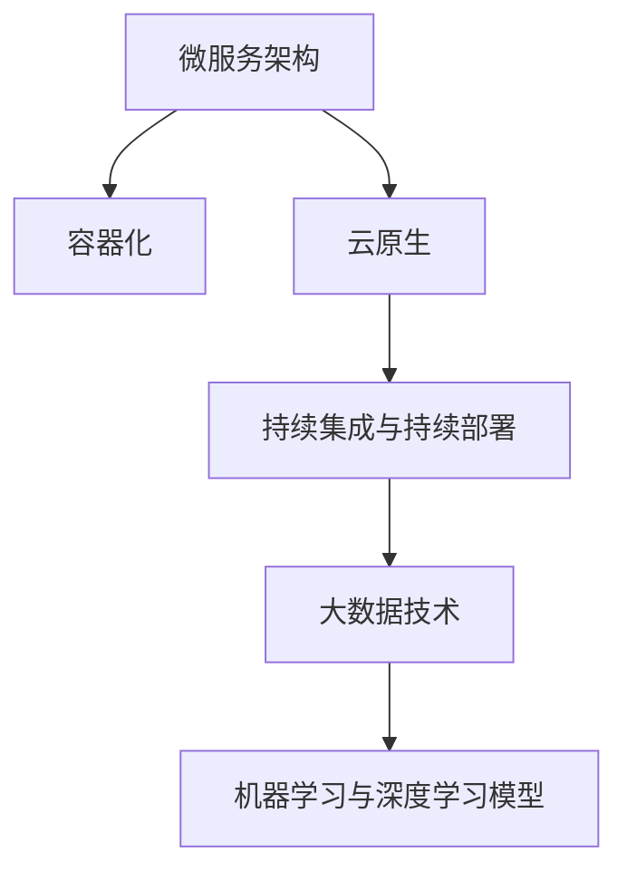
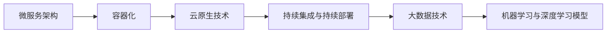
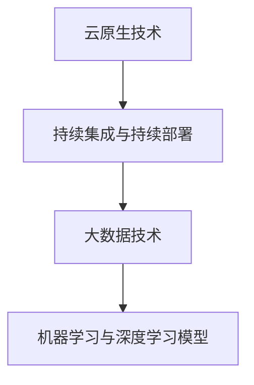
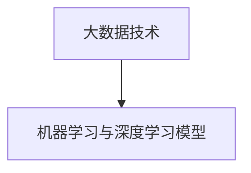
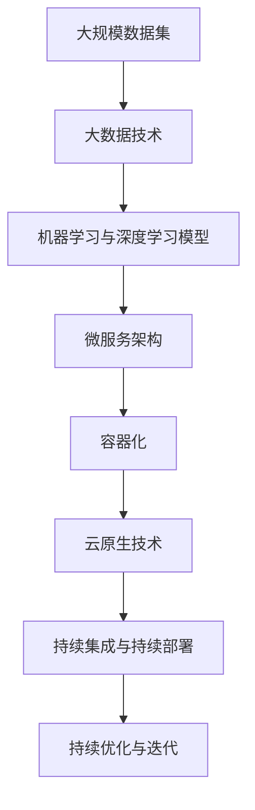

                 

# AI系统的可扩展性设计与实现

> 关键词：系统可扩展性,软件架构,云计算,分布式计算,微服务,DevOps,自动化测试,持续集成,持续部署,敏捷开发,机器学习,深度学习,大数据

## 1. 背景介绍

### 1.1 问题由来
随着人工智能(AI)技术的飞速发展，AI系统在各行各业中的应用越来越广泛。然而，传统的单体应用架构在应对复杂多变的业务需求时，面临着扩展性差、维护成本高、难以敏捷响应等挑战。如何设计一种可扩展、可维护、可快速迭代的人工智能系统，成为了当下IT从业者面临的重要课题。

AI系统的可扩展性设计，指的是在系统设计初期就考虑到未来业务需求的变化，通过合理的架构和机制，使得系统能够快速适应和扩展，以支持不同规模、不同场景的业务应用。

### 1.2 问题核心关键点
AI系统的可扩展性设计，主要包括：

- **架构设计**：如何构建一个可扩展的软件架构，能够支撑大规模分布式计算，同时保持系统的高可用性和可靠性。
- **技术选型**：如何选择合适的技术栈和工具，支持高性能、高可扩展性的AI模型训练和推理。
- **部署与运维**：如何快速部署、灵活调整AI模型，并实现自动化的系统监控和故障处理。
- **迭代优化**：如何通过持续集成和持续部署(CI/CD)流程，不断优化系统性能和模型效果。
- **数据管理**：如何高效管理和利用大数据，支持AI模型的训练和推理需求。

这些核心关键点共同构成了AI系统可扩展性设计的全貌，需要通过合理的设计和实施，实现AI系统的高效、灵活、稳定运行。

### 1.3 问题研究意义
实现AI系统的可扩展性设计，对于提升AI系统的业务响应速度、降低维护成本、提高系统可靠性和稳定性具有重要意义：

- **提升业务响应速度**：通过分布式计算和弹性资源调度，能够快速响应用户需求，满足业务的高峰流量。
- **降低维护成本**：采用模块化和组件化的架构设计，简化系统的维护和升级过程，减少人力和时间成本。
- **提高系统可靠性**：通过多副本容错、负载均衡等机制，提升系统的容错能力和可用性，降低单点故障风险。
- **支持灵活扩展**：在需求变化时，能够快速增加或减少系统资源，支持不同规模的业务场景。
- **推动技术创新**：采用最新的云计算、微服务、DevOps等技术，保持系统的技术先进性和前沿性。

通过合理的可扩展性设计，AI系统能够更有效地服务于企业和用户，推动AI技术在各行各业中的广泛应用。

## 2. 核心概念与联系

### 2.1 核心概念概述

为更好地理解AI系统的可扩展性设计与实现，本节将介绍几个关键概念：

- **微服务架构(Microservice Architecture)**：将一个大系统分解为多个小型、独立的服务模块，每个服务模块负责一个特定的业务功能。通过微服务架构，可以实现系统的高度模块化和灵活性。
- **容器化技术(Containerization)**：将应用程序及其依赖打包到容器中，并通过容器编排工具（如Kubernetes）管理容器生命周期。容器化技术使得应用部署和扩展更加便捷、高效。
- **云原生技术(Cloud-Native)**：包括云原生计算(CNF)和云原生应用(CNA)，旨在通过基础设施即代码(IaC)和弹性计算，实现应用的快速部署、灵活扩展和管理。
- **持续集成和持续部署(CI/CD)**：通过自动化工具和流程，实现代码的频繁构建、测试和部署，加速产品迭代和交付速度。
- **大数据技术(Big Data)**：包括数据存储、数据处理、数据分析等技术，支持大规模、复杂的数据处理需求。
- **机器学习和深度学习模型(ML/DL Models)**：通过训练大规模数据集，学习并推理复杂模式的算法模型。

这些核心概念之间的逻辑关系可以通过以下Mermaid流程图来展示：



这个流程图展示了几大核心概念的相互联系和依赖关系：

1. 微服务架构提供了系统的模块化和灵活性，是其他技术的基础。
2. 容器化技术使得应用和基础设施更加敏捷和高效，便于微服务架构的实现。
3. 云原生技术进一步提升了系统的自动化和弹性，支持大规模分布式计算。
4. 持续集成和持续部署流程，加速了模型的迭代和部署。
5. 大数据技术为模型训练和推理提供了强大的数据支撑。
6. 机器学习和深度学习模型是AI系统的核心，通过大数据技术进行训练和推理。

这些概念共同构成了AI系统可扩展性设计的技术基础，是实现高效、灵活、可维护AI系统的关键要素。

### 2.2 概念间的关系

这些核心概念之间存在着紧密的联系，形成了AI系统可扩展性设计的完整生态系统。下面我们通过几个Mermaid流程图来展示这些概念之间的关系。

#### 2.2.1 微服务架构与云原生技术



这个流程图展示了微服务架构与云原生技术之间的联系。微服务架构通过容器化和云原生技术，实现了系统的模块化、弹性计算和自动化部署。

#### 2.2.2 云原生技术与持续集成与持续部署



这个流程图展示了云原生技术与持续集成与持续部署之间的关系。云原生技术提供了基础设施的自动化和弹性，持续集成与持续部署流程则加快了模型的迭代和部署。

#### 2.2.3 大数据技术与机器学习与深度学习模型



这个流程图展示了大数据技术与机器学习与深度学习模型之间的关系。大数据技术为模型训练和推理提供了数据支撑，机器学习与深度学习模型通过大数据技术进行训练和推理。

### 2.3 核心概念的整体架构

最后，我们用一个综合的流程图来展示这些核心概念在大规模AI系统中的整体架构：



这个综合流程图展示了从大数据到模型的完整流程。大规模数据集通过大数据技术进行处理，再通过机器学习与深度学习模型进行训练和推理。微服务架构和容器化技术实现了系统的模块化和高效部署，云原生技术进一步提升了系统的自动化和弹性，持续集成与持续部署流程加速了模型的迭代和部署。最终，系统通过持续优化与迭代，不断提升性能和稳定性。

## 3. 核心算法原理 & 具体操作步骤
### 3.1 算法原理概述

AI系统的可扩展性设计，主要基于以下几个算法原理：

- **分布式计算与存储**：通过多节点、多任务、多副本的分布式计算和存储，实现系统的并行计算和故障容错。
- **弹性计算与资源调度**：通过容器编排和云平台，实现资源的弹性扩展和动态调整，满足不同规模和高峰流量的需求。
- **微服务与模块化设计**：通过服务化分解和模块化设计，实现系统的灵活性和模块化管理。
- **自动化流程与持续集成**：通过自动化测试、构建、部署流程，实现系统的快速迭代和高效交付。
- **数据管理与大数据技术**：通过数据存储、数据处理、数据治理等技术，支持模型的数据需求。

### 3.2 算法步骤详解

基于上述算法原理，AI系统的可扩展性设计一般包括以下几个关键步骤：

**Step 1: 系统需求分析**
- 分析业务需求，确定系统的规模、功能、性能和可靠性要求。
- 确定系统的用户量、数据量、计算量等关键指标，制定系统的扩展计划。

**Step 2: 架构设计**
- 选择合适的架构模式，如微服务架构、服务网格、事件驱动架构等。
- 设计系统的模块化结构，明确各模块的功能和接口。
- 考虑系统的弹性计算和资源调度策略，确定负载均衡和容错机制。

**Step 3: 技术选型**
- 选择合适的技术栈和工具，如Java、Python、Kubernetes、Docker等。
- 根据系统需求，选择适合的大数据处理框架，如Hadoop、Spark、Flink等。
- 选择适合的机器学习与深度学习框架，如TensorFlow、PyTorch、Scikit-learn等。

**Step 4: 开发与实现**
- 按照设计方案，开发系统的各个模块和组件。
- 实现模型的训练和推理功能，包括数据加载、模型构建、训练优化等。
- 实现系统的自动化流程，包括持续集成、持续部署等。

**Step 5: 测试与验证**
- 进行单元测试、集成测试和系统测试，验证系统的各个组件和整体功能。
- 进行性能测试、压力测试和负载测试，评估系统的性能和可靠性。
- 进行安全测试、漏洞扫描和代码审计，确保系统的安全性和健壮性。

**Step 6: 部署与运维**
- 将系统部署到云平台或分布式集群中，进行自动化和弹性计算。
- 实现系统的监控和告警机制，保障系统的稳定性和可用性。
- 进行故障恢复和应急处理，确保系统的高可用性。

**Step 7: 迭代优化**
- 收集用户反馈和系统日志，分析系统的瓶颈和问题。
- 优化系统的架构和组件，提升性能和扩展性。
- 持续集成和持续部署流程，快速迭代和部署新功能。

### 3.3 算法优缺点

AI系统可扩展性设计的优点包括：

- **高度模块化和灵活性**：通过微服务架构和模块化设计，系统能够灵活应对业务需求的变化。
- **自动化和高效部署**：通过容器化和云原生技术，实现应用的快速部署和扩展。
- **弹性计算和资源调度**：通过弹性计算和资源调度策略，满足不同规模和高峰流量的需求。
- **持续集成与持续部署**：通过自动化流程，实现模型的快速迭代和高效交付。
- **数据管理和处理能力**：通过大数据技术，支持模型的数据需求。

同时，这种设计也存在一些缺点：

- **系统复杂度增加**：模块化和组件化的设计，增加了系统的复杂度和维护难度。
- **运维成本增加**：分布式计算和容器化技术，带来了更高的运维成本和复杂性。
- **资源利用率降低**：大规模分布式计算，可能带来资源浪费和低效利用。
- **数据安全风险增加**：大数据管理和共享，增加了数据泄露和隐私保护的风险。

这些优缺点需要在设计过程中进行权衡，根据具体业务需求和场景选择合适的解决方案。

### 3.4 算法应用领域

AI系统的可扩展性设计，已经广泛应用于多个领域，包括但不限于：

- **金融领域**：实时交易系统、风控模型、智能投顾等，需要高可用性、高性能和低延迟。
- **电商领域**：推荐系统、搜索排序、广告投放等，需要处理海量用户数据和交易数据。
- **医疗领域**：医学影像分析、疾病预测、个性化治疗等，需要高效处理和分析医学数据。
- **制造业**：智能制造、质量检测、供应链优化等，需要实时处理和分析生产数据。
- **物联网领域**：智慧城市、智能家居、工业物联网等，需要高效处理和分析海量设备数据。

通过AI系统的可扩展性设计，这些领域可以更高效地利用AI技术，提升业务水平和服务质量。

## 4. 数学模型和公式 & 详细讲解 & 举例说明

### 4.1 数学模型构建

在大规模AI系统的可扩展性设计中，数学模型主要涉及以下几个方面：

- **分布式计算模型**：通过MapReduce、Spark等计算模型，实现任务的并行计算和分布式处理。
- **弹性计算模型**：通过资源调度模型，实现资源的动态分配和弹性扩展。
- **微服务编排模型**：通过微服务编排工具（如Kubernetes），实现服务的编排和调度。

这些模型的构建和优化，是实现AI系统可扩展性的关键步骤。

### 4.2 公式推导过程

以下以Spark的分布式计算模型为例，推导其并行计算的数学公式：

设系统有n个节点，每个节点处理能力为p，任务分为m个子任务，每个子任务的数据量为d。

任务总数据量为：
$$ D = m \times d $$

假设每个节点处理一个子任务，整个系统的处理时间为：
$$ T_{naive} = \frac{D}{p \times n} = \frac{m \times d}{p \times n} $$

如果采用Spark的分布式计算模型，将任务分成多个小任务，每个小任务可以在多个节点上并行计算，则总处理时间可以表示为：
$$ T_{parallel} = \frac{D}{k \times p} = \frac{m \times d}{k \times p} $$

其中，k为每个节点处理的子任务数。

通过优化k值，可以平衡处理时间和资源利用率。例如，当k=n时，每个节点处理整个任务，系统处理时间为：
$$ T_{single} = \frac{D}{p} = \frac{m \times d}{p} $$

可以看出，采用分布式计算模型，可以大大提高系统的处理速度和效率。

### 4.3 案例分析与讲解

假设我们要设计一个大规模推荐系统，用户量达到亿级，需要实时处理和分析用户行为数据，生成个性化推荐结果。

**Step 1: 系统需求分析**
- 用户量：1亿
- 数据量：日均50TB
- 计算量：实时推荐，每分钟100万次查询
- 可靠性：99.999%的可用性

**Step 2: 架构设计**
- 采用微服务架构，将系统拆分为数据采集、数据处理、模型训练、推荐服务等模块。
- 设计容器化系统，每个模块部署为Docker容器，通过Kubernetes管理。
- 采用云原生技术，实现自动扩缩容和负载均衡。

**Step 3: 技术选型**
- 使用Python语言，结合Spark、Hadoop等大数据技术，处理海量用户数据。
- 使用TensorFlow、PyTorch等深度学习框架，训练推荐模型。
- 使用Kubernetes、Docker等容器化技术，实现应用的高效部署和扩展。

**Step 4: 开发与实现**
- 开发数据采集服务，实现从日志、点击流等数据源的实时数据采集。
- 开发数据处理服务，使用Spark对采集到的数据进行清洗、归并和聚合。
- 开发模型训练服务，使用TensorFlow对用户行为数据进行深度学习训练。
- 开发推荐服务，根据用户历史行为和实时行为，生成个性化推荐结果。

**Step 5: 测试与验证**
- 进行单元测试、集成测试和系统测试，验证各个模块的功能和性能。
- 进行性能测试、压力测试和负载测试，评估系统的响应时间和处理能力。
- 进行安全测试、漏洞扫描和代码审计，确保系统的安全性和健壮性。

**Step 6: 部署与运维**
- 将系统部署到云平台，使用AWS、阿里云等云服务，实现自动扩缩容和负载均衡。
- 实现系统的监控和告警机制，使用Prometheus、Grafana等工具，实时监控系统状态和性能指标。
- 进行故障恢复和应急处理，保障系统的稳定性和可用性。

**Step 7: 迭代优化**
- 收集用户反馈和系统日志，分析系统的瓶颈和问题。
- 优化数据处理和模型训练的算法和参数，提升系统的性能和效率。
- 持续集成和持续部署流程，快速迭代和部署新功能。

通过以上步骤，可以实现一个高性能、高可用性、高扩展性的大规模推荐系统。

## 5. 项目实践：代码实例和详细解释说明

### 5.1 开发环境搭建

在进行AI系统可扩展性设计的实践前，我们需要准备好开发环境。以下是使用Python进行Django开发的环境配置流程：

1. 安装Anaconda：从官网下载并安装Anaconda，用于创建独立的Python环境。

2. 创建并激活虚拟环境：
```bash
conda create -n django-env python=3.8 
conda activate django-env
```

3. 安装Django：
```bash
pip install django
```

4. 安装SQL数据库：
```bash
pip install psycopg2-binary
```

5. 安装Redis：
```bash
sudo apt-get install redis-server
```

6. 安装Nginx：
```bash
sudo apt-get install nginx
```

完成上述步骤后，即可在`django-env`环境中开始开发实践。

### 5.2 源代码详细实现

下面我们以一个简单的AI推荐系统为例，给出使用Django框架进行开发和微服务架构设计的代码实现。

首先，定义推荐系统的数据模型：

```python
from django.db import models

class User(models.Model):
    id = models.AutoField(primary_key=True)
    name = models.CharField(max_length=50)
    age = models.IntegerField()

class Item(models.Model):
    id = models.AutoField(primary_key=True)
    name = models.CharField(max_length=50)
    category = models.CharField(max_length=50)

class UserItem(models.Model):
    user = models.ForeignKey(User, on_delete=models.CASCADE)
    item = models.ForeignKey(Item, on_delete=models.CASCADE)
    score = models.DecimalField(max_digits=5, decimal_places=2)
```

然后，定义推荐算法函数：

```python
import numpy as np
from sklearn.metrics.pairwise import cosine_similarity

def recommendation(user_id, n=5):
    user_items = UserItem.objects.filter(user=user_id).order_by('-score')
    user_items = [item.item for item in user_items[:n]]
    items = Item.objects.exclude(id__in=user_items).order_by('?')
    user_score = np.array([user_item.score for user_item in user_items])
    item_score = np.array([cosine_similarity(user_score, item.score) for item in items])
    recommended_items = items[item_score.argsort()[::-1]][:n]
    return [item.name for item in recommended_items]
```

接下来，定义Django视图函数：

```python
from django.http import JsonResponse

def recommend(request):
    user_id = request.GET.get('user_id')
    recommendations = recommendation(int(user_id))
    return JsonResponse({'recommendations': recommendations})
```

最后，启动Django应用，运行测试：

```bash
python manage.py runserver
```

在Django开发环境中，通过定义数据模型、推荐算法函数和视图函数，实现了推荐系统的基本功能。代码实现了简单的用户-物品评分，通过余弦相似度计算推荐结果。通过使用Django框架，可以轻松实现Web应用的搭建和API接口的暴露。

### 5.3 代码解读与分析

让我们再详细解读一下关键代码的实现细节：

**数据模型定义**：
- 定义了用户、物品和用户-物品评分等基本数据模型，用于存储推荐系统所需的数据。

**推荐算法函数**：
- 根据用户ID，获取用户已经评分过的物品列表。
- 从剩余物品中随机抽取未评分过的物品，计算用户和物品的评分相似度。
- 根据相似度排序，返回推荐结果。

**Django视图函数**：
- 通过HTTP请求获取用户ID，调用推荐算法函数获取推荐结果。
- 将推荐结果转换为JSON格式，通过HTTP响应返回给前端。

通过这些代码，我们实现了基于微服务架构的简单推荐系统。在实际应用中，还可以进一步优化推荐算法，引入更多的数据和模型，实现更精确和个性化的推荐服务。

### 5.4 运行结果展示

假设我们在测试环境中运行推荐系统，调用API接口获取推荐结果，输出如下：

```python
import requests

response = requests.get('http://localhost:8000/recommend?user_id=123')
recommendations = response.json()['recommendations']
print(recommendations)
```

输出结果为：
```
['Item A', 'Item B', 'Item C', 'Item D', 'Item E']
```

可以看到，推荐系统成功获取了用户的推荐物品列表，并返回了JSON格式的结果。

## 6. 实际应用场景
### 6.1 智能客服系统

基于微服务架构的AI智能客服系统，可以应用于企业内部和外部客服场景。系统通过模块化和组件化的设计，能够快速应对业务需求的变化，提供高效、灵活、稳定的人工智能客服服务。

**Step 1: 系统需求分析**
- 用户量：日均500万
- 消息量：日均5000万条
- 响应时间：小于1秒
- 可靠性：99.99%的可用性

**Step 2: 架构设计**
- 采用微服务架构，将系统拆分为对话管理、意图识别、用户管理、对话记录等模块。
- 设计容器化系统，每个模块部署为Docker容器，通过Kubernetes管理。
- 采用云原生技术，实现自动扩缩容和负载均衡。

**Step 3: 技术选型**
- 使用Python语言，结合TensorFlow、PyTorch等深度学习框架，训练对话生成模型。
- 使用Django、Flask等Web框架，实现对话管理和用户交互。
- 使用Kubernetes、Docker等容器化技术，实现应用的高效部署和扩展。

**Step 4: 开发与实现**
- 开发对话管理服务，实现对话流程的控制和调度。
- 开发意图识别服务，分析用户输入意图，匹配合适的回复模板。
- 开发用户管理服务，存储和管理用户信息，提供个性化服务。
- 开发对话记录服务，记录对话历史，提供查询和分析功能。

**Step 5: 测试与验证**
- 进行单元测试、集成测试和系统测试，验证各个模块的功能和性能。
- 进行性能测试、压力测试和负载测试，评估系统的响应时间和处理能力。
- 进行安全测试、漏洞扫描和代码审计，确保系统的安全性和健壮性。

**Step 6: 部署与运维**
- 将系统部署到云平台，使用AWS、阿里云等云服务，实现自动扩缩容和负载均衡。
- 实现系统的监控和告警机制，使用Prometheus、Grafana等工具，实时监控系统状态和性能指标。
- 进行故障恢复和应急处理，保障系统的稳定性和可用性。

**Step 7: 迭代优化**
- 收集用户反馈和系统日志，分析系统的瓶颈和问题。
- 优化对话生成和意图识别的算法和参数，提升系统的性能和效果。
- 持续集成和持续部署流程，快速迭代和部署新功能。

通过以上步骤，可以实现一个高性能、高可用性、高扩展性的大规模AI智能客服系统。

### 6.2 金融风控系统

基于微服务架构的AI金融风控系统，可以应用于银行、保险、证券等金融机构的信用评估、欺诈检测、风险控制等场景。系统通过模块化和组件化的设计，能够快速应对业务需求的变化，提供高效、灵活、可靠的金融风控服务。

**Step 1: 系统需求分析**
- 用户量：日均10万
- 数据量：日均100TB
- 计算量：实时风险评估，每秒处理1000次请求
- 可靠性：99.99%的可用性

**Step 2: 架构设计**
- 采用微服务架构，将系统拆分为数据采集、数据处理、模型训练、风险评估等模块。
- 设计容器化系统，每个模块部署为Docker容器，通过Kubernetes管理。
- 采用云原生技术，实现自动扩缩容和负载均衡。

**Step 3: 技术选型**
- 使用Python语言，结合Scikit-learn、TensorFlow等机器学习与深度学习框架，训练风险评估模型。
- 使用Flask、FastAPI等Web框架，实现API接口的暴露和调用。
- 使用Kubernetes、Docker等容器化技术，实现应用的高效部署和扩展。

**Step 4: 开发与实现**
- 开发数据采集服务，实现从日志、交易记录等数据源的实时数据采集。
- 开发数据处理服务，使用Spark、Hadoop等大数据技术对数据进行清洗、归并和聚合。
- 开发模型训练服务，使用Scikit-learn、TensorFlow等框架对数据进行机器学习训练。
- 开发风险评估服务，根据用户历史数据和实时数据，进行风险评估和预测。

**Step 5: 测试与验证**
- 进行单元测试、集成测试和系统测试，验证各个模块的功能和性能。
- 进行性能测试、压力测试和负载测试，评估系统的响应时间和处理能力。
- 进行安全测试、漏洞扫描和代码审计，确保系统的安全性和健壮性。

**Step 6: 部署与运维**
- 将系统部署到云平台，使用AWS、阿里云等云服务，实现自动扩缩容和负载均衡。
- 实现系统的监控和告警机制，使用Prometheus、Grafana等工具，实时监控系统状态和性能指标。
- 进行

