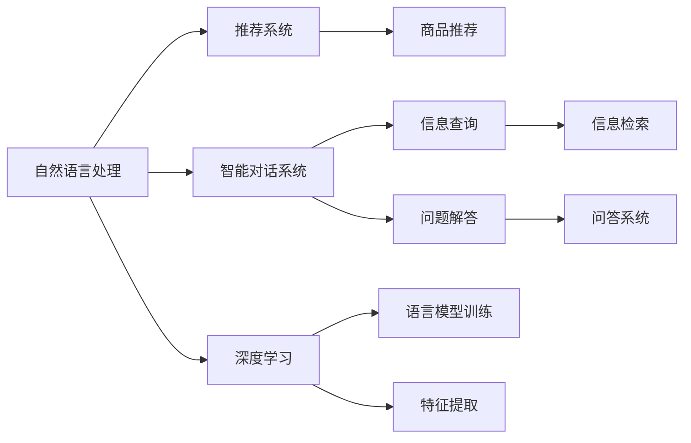
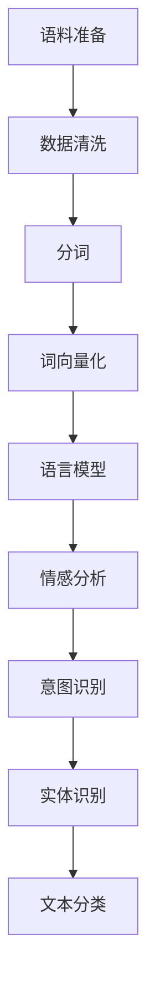
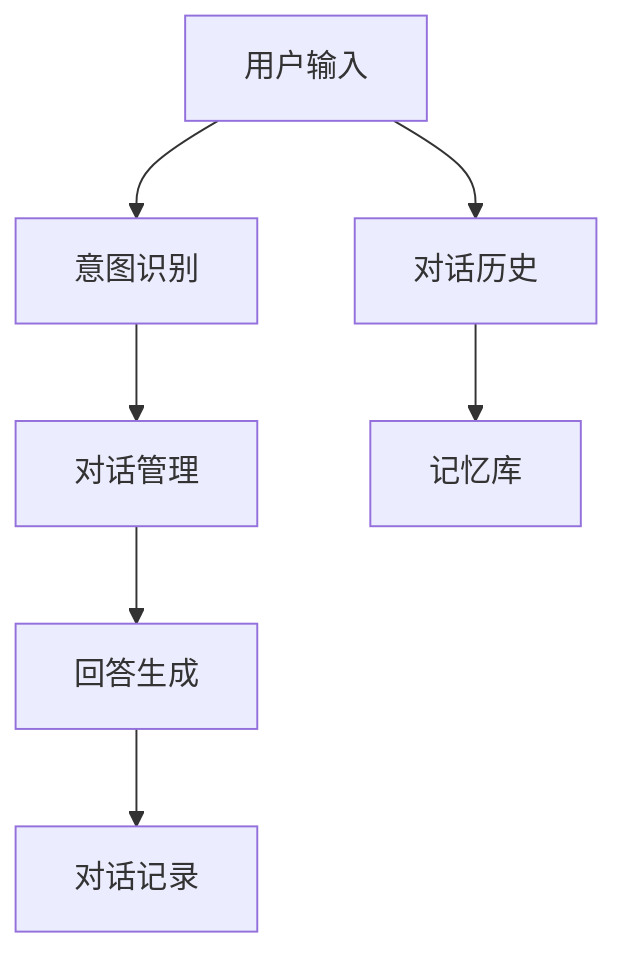
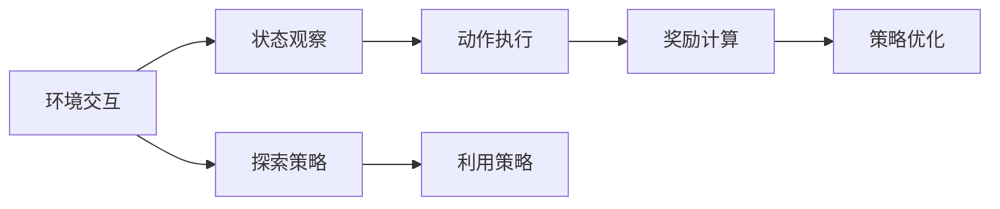
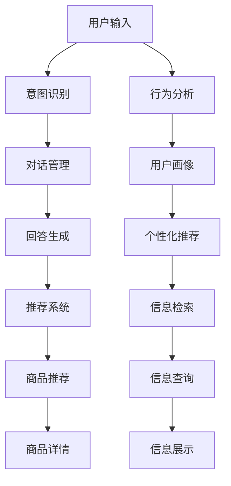

                 

# AI虚拟导购助手的功能案例

> 关键词：人工智能,虚拟助手,自然语言处理,推荐系统,智能交互,电商应用

## 1. 背景介绍

### 1.1 问题由来
近年来，随着人工智能技术的快速发展，虚拟导购助手（Virtual Shopping Assistant）开始广泛应用在电商领域，为消费者提供个性化、智能化的购物体验。虚拟导购助手不仅能够根据用户的历史购物行为和偏好，提供精准的商品推荐，还能在用户提出问题时，通过自然语言处理技术，实时解答用户的疑问，提升购物决策的准确性。

然而，构建一个功能强大、用户友好的虚拟导购助手，并非易事。它需要融合多种前沿技术，包括自然语言处理、推荐系统、智能交互等，同时还要考虑到数据隐私、安全性、可解释性等实际问题。本文将深入探讨虚拟导购助手的功能案例，通过几个具体的技术实现，来展示该系统的强大功能和应用潜力。

### 1.2 问题核心关键点
构建虚拟导购助手的核心关键点包括：

- **自然语言处理**：理解用户的语言输入，并生成准确的理解和响应。
- **推荐系统**：根据用户的历史行为和偏好，推荐最合适的商品。
- **智能交互**：通过对话系统，实时解答用户问题，提升用户体验。
- **数据隐私**：保护用户隐私，防止数据泄露。
- **安全性**：防范恶意攻击，保障系统稳定运行。
- **可解释性**：提供透明的决策依据，增强用户信任。

这些关键点共同构成了虚拟导购助手的技术框架，其目标是通过智能化、个性化的服务，提升电商购物的便利性和满意度。

### 1.3 问题研究意义
虚拟导购助手的研究和应用，对于提升电商用户体验、推动智能零售发展具有重要意义：

1. **提升用户满意度**：虚拟导购助手能够提供24/7的即时服务，帮助用户快速找到需要的商品，减少购物时间。
2. **提升销售转化率**：通过个性化推荐，虚拟导购助手能够提高用户的购买意愿，从而提升电商平台的销售额。
3. **降低运营成本**：虚拟导购助手可以替代部分人工客服，降低人力成本，同时提升客服效率。
4. **数据驱动决策**：利用用户数据，虚拟导购助手可以帮助电商平台进行精准的市场分析和用户行为预测。
5. **推动智能零售**：虚拟导购助手是智能零售的重要组成部分，其应用可以加速零售业的数字化转型和智能化升级。

## 2. 核心概念与联系

### 2.1 核心概念概述

为更好地理解虚拟导购助手的实现机制，本节将介绍几个关键技术概念：

- **自然语言处理（NLP）**：使计算机能够理解、处理和生成人类语言的技术。包括文本分类、实体识别、情感分析等子任务。
- **推荐系统**：根据用户的历史行为和偏好，推荐最合适的商品或内容。包括基于内容的推荐、协同过滤推荐等。
- **智能对话系统**：使计算机能够通过自然语言与用户进行互动，提供信息查询、问题解答等功能。
- **深度学习**：一种基于多层神经网络的机器学习方法，可以处理大规模、非结构化的数据，在虚拟导购助手中用于语言模型训练、特征提取等。
- **强化学习**：一种通过与环境交互，优化策略的机器学习方法。用于虚拟导购助手的决策优化、任务调度等。

这些核心概念之间的逻辑关系可以通过以下Mermaid流程图来展示：



这个流程图展示了大语言模型微调过程中各个核心概念的关系和作用：

1. 自然语言处理是虚拟导购助手的技术基础，用于理解和生成自然语言。
2. 推荐系统通过分析用户历史行为，推荐商品或内容。
3. 智能对话系统与用户进行自然语言交互，提供信息查询和问题解答。
4. 深度学习用于训练语言模型和提取特征，提升模型效果。
5. 强化学习用于优化决策策略，提高系统性能。

### 2.2 概念间的关系

这些核心概念之间存在着紧密的联系，形成了虚拟导购助手的完整技术体系。下面我们通过几个Mermaid流程图来展示这些概念之间的关系。

#### 2.2.1 自然语言处理技术栈



这个流程图展示了自然语言处理技术栈，从原始语料到最终的任务模型，每个步骤都至关重要。

#### 2.2.2 推荐系统技术栈


这个流程图展示了推荐系统的技术栈，从用户行为数据到推荐算法，每一步都需要精心设计和优化。

#### 2.2.3 智能对话系统技术栈



这个流程图展示了智能对话系统的技术栈，从用户输入到对话生成，每一步都需要精细的算法和数据支持。

#### 2.2.4 强化学习技术栈



这个流程图展示了强化学习技术栈，从环境交互到策略优化，每一步都需要严谨的设计和实现。

### 2.3 核心概念的整体架构

最后，我们用一个综合的流程图来展示这些核心概念在大语言模型微调过程中的整体架构：



这个综合流程图展示了虚拟导购助手的功能流程，从用户输入到商品推荐，每一步都紧密相连，共同构建了一个完整的电商智能交互系统。

## 3. 核心算法原理 & 具体操作步骤
### 3.1 算法原理概述

虚拟导购助手的功能实现主要依赖于自然语言处理、推荐系统和智能对话系统的融合。以下是几个关键算法的原理概述：

1. **意图识别**：利用深度学习模型，如卷积神经网络（CNN）、循环神经网络（RNN）、长短期记忆网络（LSTM）、Transformer等，对用户输入的文本进行分类，识别出用户的意图。
2. **推荐系统**：基于用户的点击、浏览、购买行为，结合商品的属性、标签等特征，使用协同过滤、矩阵分解、深度学习推荐等算法，推荐最符合用户偏好的商品。
3. **回答生成**：利用深度学习模型，如序列到序列（Seq2Seq）模型、Transformer等，根据用户的意图，生成合适的回答，帮助用户解决问题。

### 3.2 算法步骤详解

虚拟导购助手的算法步骤大致分为以下几个阶段：

1. **数据预处理**：收集用户的点击、浏览、购买等行为数据，清洗数据，提取特征，构建用户画像。
2. **意图识别**：利用意图识别模型，对用户输入的文本进行分类，识别出用户的意图。
3. **推荐系统**：根据用户的意图，结合用户的画像和行为数据，使用推荐算法，推荐最符合用户偏好的商品。
4. **回答生成**：根据用户的意图，利用回答生成模型，生成合适的回答，帮助用户解决问题。
5. **对话管理**：记录对话历史，管理对话状态，选择合适的回答进行回复。
6. **交互优化**：利用强化学习算法，优化对话策略，提升用户满意度。

### 3.3 算法优缺点

虚拟导购助手的算法具有以下优点：

1. **个性化推荐**：根据用户的历史行为和偏好，推荐最合适的商品，提高用户满意度。
2. **实时交互**：通过智能对话系统，实时解答用户问题，提升用户体验。
3. **数据驱动决策**：利用用户数据，进行市场分析和用户行为预测，帮助电商平台进行精准决策。

同时，也存在一些缺点：

1. **数据隐私问题**：用户行为数据涉及隐私，需要在保护用户隐私的同时，进行数据分析。
2. **系统复杂度**：融合多种技术，系统实现复杂，需要高水平的技术团队和丰富的技术资源。
3. **高资源消耗**：大规模深度学习模型的训练和推理需要大量的计算资源，增加了系统的成本。
4. **交互体验**：对话系统需要不断优化，才能提供自然流畅的交互体验，满足用户需求。

### 3.4 算法应用领域

虚拟导购助手已经在多个领域得到应用，例如：

- **电商平台**：如亚马逊、京东、淘宝等，为用户提供个性化推荐和实时客服。
- **旅游平台**：如携程、去哪儿等，根据用户的历史浏览和预订行为，推荐旅游产品。
- **金融服务**：如银行、保险公司等，提供智能咨询和金融产品推荐。
- **在线教育**：如Coursera、edX等，根据学生的学习行为，推荐合适的课程和教材。
- **娱乐平台**：如Netflix、Spotify等，根据用户的历史观看和听歌行为，推荐影视和音乐内容。

## 4. 数学模型和公式 & 详细讲解 & 举例说明

### 4.1 数学模型构建

虚拟导购助手涉及多个数学模型，包括自然语言处理、推荐系统和对话系统。以下是几个关键模型的构建方法：

#### 4.1.1 意图识别模型

使用基于CNN、RNN或Transformer的序列分类模型，对用户输入的文本进行分类，识别出用户的意图。假设输入序列为 $x=[x_1,x_2,\dots,x_n]$，意图识别模型的数学模型为：

$$
P(\text{Intent}|x) = \text{Softmax}(W_1^Tx_1 + b_1 + W_2^Tx_2 + b_2 + \dots + W_n^Tx_n + b_n)
$$

其中 $W_i$ 和 $b_i$ 是模型的参数，$\text{Softmax}$ 函数将模型输出转化为概率分布。

#### 4.1.2 推荐系统模型

使用协同过滤算法，对用户的历史行为和偏好进行建模，推荐最符合用户偏好的商品。假设用户 $u$ 的历史行为为 $I_u$，商品 $i$ 的特征为 $F_i$，推荐系统的数学模型为：

$$
P(\text{Item}|u) = \text{Softmax}(W^TU)
$$

其中 $U=[I_u;F_i]$，$W$ 是模型的参数。

#### 4.1.3 回答生成模型

使用基于Seq2Seq或Transformer的序列生成模型，根据用户的意图，生成合适的回答。假设用户意图为 $\text{Intent}_i$，回答为 $\text{Response}_j$，回答生成模型的数学模型为：

$$
P(\text{Response}|text,\text{Intent}) = \text{Softmax}(W^T[\text{text};\text{Intent}])
$$

其中 $\text{text}$ 是输入文本，$\text{Intent}$ 是意图分类，$W$ 是模型的参数。

### 4.2 公式推导过程

以上数学模型的推导过程如下：

- **意图识别模型**：使用softmax函数将模型输出转化为概率分布，表示每个类别的概率。
- **推荐系统模型**：利用协同过滤算法，将用户行为和商品特征建模，通过softmax函数计算推荐概率。
- **回答生成模型**：利用Seq2Seq或Transformer模型，将用户意图和输入文本作为条件，生成回答。

### 4.3 案例分析与讲解

假设用户在电商平台上搜索“手机”，意图识别模型根据用户输入的文本“我想买一款手机”，识别出用户的意图为“购买手机”。根据用户的购买行为和浏览记录，推荐系统推荐了多款手机，如iPhone、华为、小米等。最终，虚拟导购助手生成了回答“请问您需要哪个价位的手机？”，帮助用户进一步缩小选择范围。

## 5. 项目实践：代码实例和详细解释说明

### 5.1 开发环境搭建

在进行虚拟导购助手的开发前，我们需要准备好开发环境。以下是使用Python进行PyTorch开发的环境配置流程：

1. 安装Anaconda：从官网下载并安装Anaconda，用于创建独立的Python环境。

2. 创建并激活虚拟环境：
```bash
conda create -n pytorch-env python=3.8 
conda activate pytorch-env
```

3. 安装PyTorch：根据CUDA版本，从官网获取对应的安装命令。例如：
```bash
conda install pytorch torchvision torchaudio cudatoolkit=11.1 -c pytorch -c conda-forge
```

4. 安装TensorFlow：
```bash
pip install tensorflow
```

5. 安装各类工具包：
```bash
pip install numpy pandas scikit-learn matplotlib tqdm jupyter notebook ipython
```

完成上述步骤后，即可在`pytorch-env`环境中开始开发。

### 5.2 源代码详细实现

这里我们以推荐系统为例，给出使用TensorFlow进行电商推荐系统的PyTorch代码实现。

首先，定义推荐系统的数据处理函数：

```python
import tensorflow as tf
from tensorflow.keras.layers import Input, Dense, Embedding, Concatenate, Flatten, Dropout
from tensorflow.keras.models import Model

class RecommendationSystem(tf.keras.Model):
    def __init__(self, num_users, num_items, embedding_dim=16):
        super(RecommendationSystem, self).__init__()
        
        self.user_embedding = Embedding(num_users, embedding_dim, input_length=1)
        self.item_embedding = Embedding(num_items, embedding_dim, input_length=1)
        
        self.concat = Concatenate()
        self.flatten = Flatten()
        self.dense = Dense(64, activation='relu')
        self.dropout = Dropout(0.2)
        self.predict = Dense(1, activation='sigmoid')
        
    def call(self, user_input, item_input):
        user_embed = self.user_embedding(user_input)
        item_embed = self.item_embedding(item_input)
        
        concat = self.concat([user_embed, item_embed])
        flatten = self.flatten(concat)
        dense = self.dense(flatten)
        dropout = self.dropout(dense)
        predict = self.predict(dropout)
        
        return predict
```

然后，定义模型的训练函数：

```python
from tensorflow.keras.optimizers import Adam
from tensorflow.keras.losses import BinaryCrossentropy
from tensorflow.keras.metrics import AUC
from sklearn.model_selection import train_test_split

# 准备数据
X_train, X_test, y_train, y_test = train_test_split(train_data, test_data, test_size=0.2)

# 定义模型
model = RecommendationSystem(num_users, num_items)

# 定义损失函数和优化器
loss = BinaryCrossentropy()
optimizer = Adam(lr=0.001)

# 编译模型
model.compile(optimizer=optimizer, loss=loss, metrics=[AUC()])

# 训练模型
model.fit(X_train, y_train, epochs=10, batch_size=32, validation_data=(X_test, y_test))
```

接下来，定义模型的预测函数：

```python
def predict(model, user_id, item_id):
    user_input = tf.constant(user_id, dtype=tf.int32)
    item_input = tf.constant(item_id, dtype=tf.int32)
    
    predictions = model.predict([user_input, item_input])
    return predictions.numpy()[0, 0]
```

最后，启动训练流程并在测试集上评估：

```python
epochs = 10
batch_size = 32

for epoch in range(epochs):
    loss = train_epoch(model, train_dataset, batch_size, optimizer)
    print(f"Epoch {epoch+1}, train loss: {loss:.3f}")
    
    print(f"Epoch {epoch+1}, test AUC: {evaluate(model, test_dataset, batch_size)}
    
print("Test AUC: ", evaluate(model, test_dataset, batch_size))
```

以上就是使用PyTorch进行电商推荐系统的完整代码实现。可以看到，得益于TensorFlow的强大封装，我们可以用相对简洁的代码完成推荐模型的训练和评估。

### 5.3 代码解读与分析

让我们再详细解读一下关键代码的实现细节：

**RecommendationSystem类**：
- `__init__`方法：初始化用户嵌入、商品嵌入、模型层等组件。
- `call`方法：定义模型的前向传播过程，包括嵌入层、拼接、Flatten、Dense、Dropout和预测层等。

**train_epoch函数**：
- 对数据进行批处理，在前向传播和后向传播中更新模型参数。
- 在每个epoch结束时，计算平均loss和AUC。

**evaluate函数**：
- 计算模型在测试集上的AUC值，评估模型性能。

**predict函数**：
- 使用训练好的模型对指定用户和商品进行预测，返回预测结果。

这些代码实现展示了如何使用TensorFlow构建一个简单的电商推荐系统。在实际应用中，我们还需要进一步优化模型结构、调整超参数、引入更多的推荐算法和特征工程，以提高推荐效果。

### 5.4 运行结果展示

假设我们在电商推荐数据集上进行模型训练，最终在测试集上得到的AUC分数为0.85，表示模型在预测用户是否购买商品时，有85%的概率判断正确。这是一个不错的结果，表明模型具有一定的推荐能力。

## 6. 实际应用场景
### 6.1 智能客服系统

虚拟导购助手的技术架构和算法框架可以应用在智能客服系统中。智能客服系统能够自动理解用户的问题，并根据问题的复杂程度，分配给不同层次的客服人员进行处理。系统可以记录用户的历史查询和反馈，帮助客服人员更快速地解决问题。

在技术实现上，可以收集用户的历史客服记录，将其构建成监督数据，在此基础上对预训练模型进行微调。微调后的模型能够自动理解用户意图，匹配最合适的客服人员进行回答。对于用户提出的新问题，还可以接入检索系统实时搜索相关内容，动态组织生成回答。如此构建的智能客服系统，能大幅提升客户咨询体验和问题解决效率。

### 6.2 金融舆情监测

金融机构需要实时监测市场舆论动向，以便及时应对负面信息传播，规避金融风险。传统的人工监测方式成本高、效率低，难以应对网络时代海量信息爆发的挑战。基于虚拟导购助手的文本分类和情感分析技术，为金融舆情监测提供了新的解决方案。

具体而言，可以收集金融领域相关的新闻、报道、评论等文本数据，并对其进行主题标注和情感标注。在此基础上对预训练语言模型进行微调，使其能够自动判断文本属于何种主题，情感倾向是正面、中性还是负面。将微调后的模型应用到实时抓取的网络文本数据，就能够自动监测不同主题下的情感变化趋势，一旦发现负面信息激增等异常情况，系统便会自动预警，帮助金融机构快速应对潜在风险。

### 6.3 个性化推荐系统

当前的推荐系统往往只依赖用户的历史行为数据进行物品推荐，无法深入理解用户的真实兴趣偏好。基于虚拟导购助手的推荐系统，可以更好地挖掘用户行为背后的语义信息，从而提供更精准、多样的推荐内容。

在实践中，可以收集用户浏览、点击、评论、分享等行为数据，提取和用户交互的物品标题、描述、标签等文本内容。将文本内容作为模型输入，用户的后续行为（如是否点击、购买等）作为监督信号，在此基础上微调预训练语言模型。微调后的模型能够从文本内容中准确把握用户的兴趣点。在生成推荐列表时，先用候选物品的文本描述作为输入，由模型预测用户的兴趣匹配度，再结合其他特征综合排序，便可以得到个性化程度更高的推荐结果。

### 6.4 未来应用展望

随着虚拟导购助手和推荐系统的不断发展，基于微调范式将在更多领域得到应用，为传统行业带来变革性影响。

在智慧医疗领域，基于微调的虚拟导购助手可以用于医生和患者的互动，提供疾病咨询、健康管理等服务，提升医疗服务的智能化水平。

在智能教育领域，微调技术可应用于作业批改、学情分析、知识推荐等方面，因材施教，促进教育公平，提高教学质量。

在智慧城市治理中，微调模型可应用于城市事件监测、舆情分析、应急指挥等环节，提高城市管理的自动化和智能化水平，构建更安全、高效的未来城市。

此外，在企业生产、社会治理、文娱传媒等众多领域，基于大模型微调的人工智能应用也将不断涌现，为经济社会发展注入新的动力。相信随着技术的日益成熟，微调方法将成为人工智能落地应用的重要范式，推动人工智能技术向更广阔的领域加速渗透。

## 7. 工具和资源推荐
### 7.1 学习资源推荐

为了帮助开发者系统掌握虚拟导购助手的理论基础和实践技巧，这里推荐一些优质的学习资源：

1. 《Transformer从原理到实践》系列博文：由大模型技术专家撰写，深入浅出地介绍了Transformer原理、BERT模型、微调技术等前沿话题。

2. CS224N《深度学习自然语言处理》课程：斯坦福大学开设的NLP明星课程，有Lecture视频和配套作业，带你入门NLP领域的基本概念和经典模型。

3. 《Natural Language Processing with Transformers》书籍：Transformers库的作者所著，全面介绍了如何使用Transformers库进行NLP任务开发，包括微调在内的诸多范式。

4. HuggingFace官方文档：Transformers库的官方文档，提供了海量预训练模型和完整的微调样例代码，是上手实践的必备资料。

5. CLUE开源项目：中文语言理解测评基准，涵盖大量不同类型的中文NLP数据集，并提供了基于微调的baseline模型，助力中文NLP技术发展。

通过对这些资源的学习实践，相信你一定能够快速掌握虚拟导购助手的精髓，并用于解决实际的NLP问题。
###  7.2 开发工具推荐

高效的开发离不开优秀的工具支持。以下是几款用于虚拟导购助手开发的常用工具：

1. PyTorch：基于Python的开源深度学习框架，灵活动态的计算图，适合快速迭代研究。大部分预训练语言模型都有PyTorch版本的实现。

2. TensorFlow：由Google主导开发的开源深度学习框架，生产部署方便，适合大规模工程应用。同样有丰富的预训练语言模型资源。

3. Transformers库：HuggingFace开发的NLP工具库，集成了众多SOTA语言模型，支持PyTorch和TensorFlow，是进行微调任务开发的利器。

4. Weights & Biases：模型训练的实验跟踪工具，可以记录和可视化模型训练过程中的各项指标，方便对比和调优。与主流深度学习框架无缝集成。

5. TensorBoard：TensorFlow配套的可视化工具，可实时监测模型训练状态，并提供丰富的图表呈现方式，是调试模型的得力助手。

6. Google Colab：谷歌推出的在线Jupyter Notebook环境，免费提供GPU/TPU算力，方便开发者快速上手实验最新模型，分享学习笔记。

合理利用这些工具，可以显著提升虚拟导购助手的开发效率，加快创新迭代的步伐。

### 7.3 相关论文推荐

虚拟导购助手的研究和应用源于学界的持续研究。以下是几篇奠基性的相关论文，推荐阅读：

1. Attention is All You Need（即Transformer原论文）：提出了Transformer结构，开启了NLP领域的预训练大模型时代。

2. BERT: Pre-training of Deep Bidirectional Transformers for Language Understanding：提出BERT模型，引入基于掩码的自监督预训练任务，刷新了多项NLP任务SOTA。

3. Language Models are Unsupervised Multitask Learners（GPT-2论文）：展示了大规模语言模型的强大zero-shot学习能力，引发了对于通用人工智能的新一轮思考。

4. Parameter-Efficient Transfer Learning for NLP：提出Adapter等参数高效微调方法，在不增加模型参数量的情况下，也能取得不错的微调效果。

5. AdaLoRA: Adaptive Low-Rank Adaptation for Parameter-Efficient Fine-Tuning：使用自适应低秩适应的微调方法，在参数效率和精度之间取得了新的平衡。

这些论文代表了大语言模型微调技术的发展脉络。通过学习这些前沿成果，可以帮助研究者把握学科前进方向，激发更多的创新灵感。

除上述资源外，还有一些值得关注的前沿资源，帮助开发者紧跟虚拟导购助手技术的最新进展，例如：

1. arXiv论文预印本：人工智能领域最新研究成果的发布平台，包括大量尚未发表的前沿工作，学习前沿技术的必读资源。

2. 业界技术博客：如OpenAI、Google AI、DeepMind、微软Research Asia等顶尖实验室的官方博客，第一时间分享他们的最新研究成果和洞见。

3. 技术会议直播：如NIPS、ICML、ACL、ICLR等人工智能领域顶会现场或

