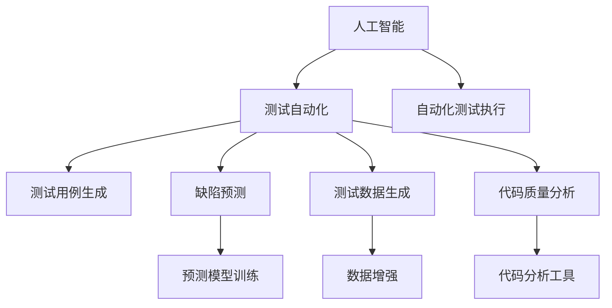
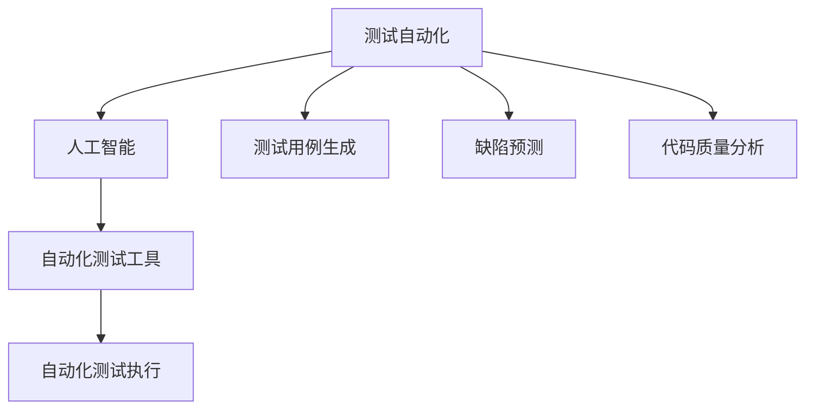
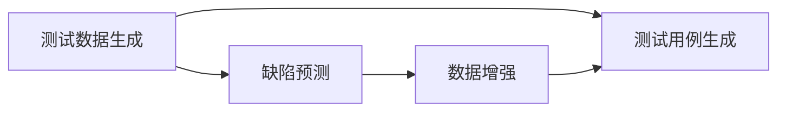
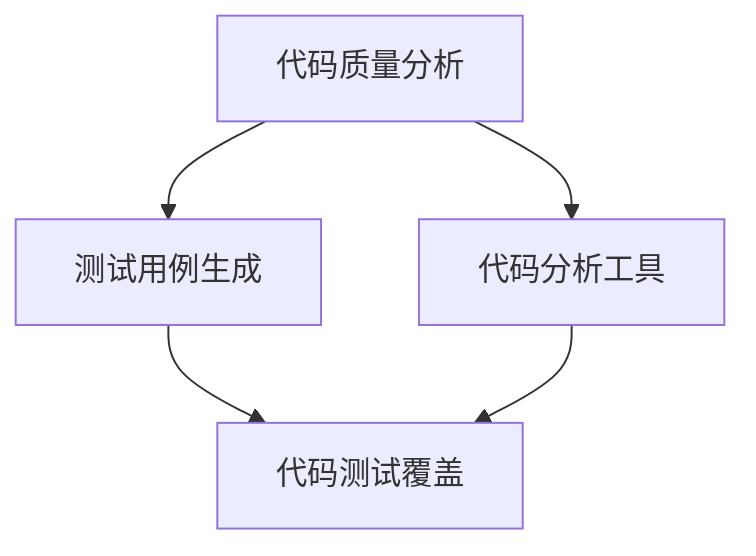
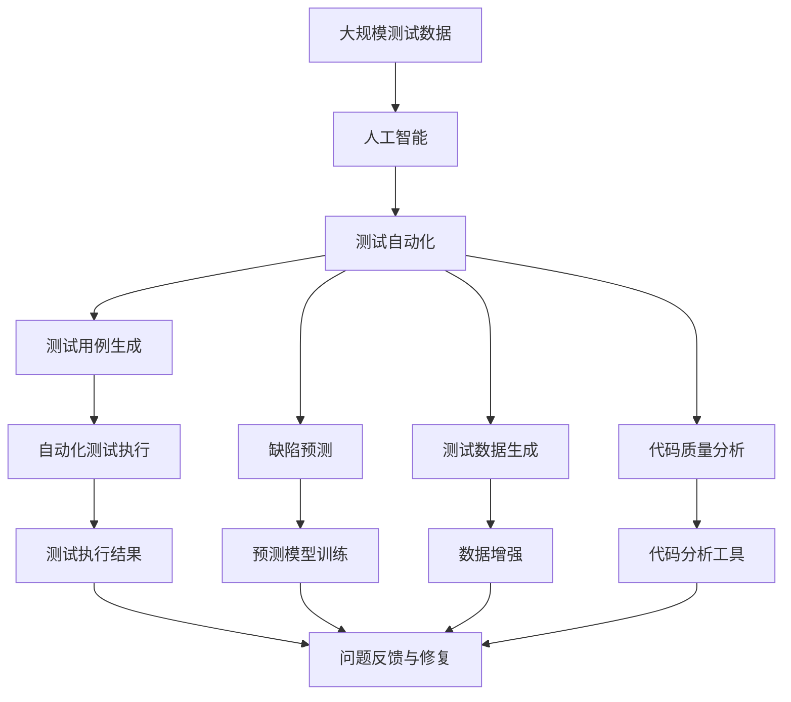

                 

# AI辅助软件测试:提高软件质量与可靠性

> 关键词：AI辅助测试,软件质量管理,软件可靠性,自动化测试,测试数据生成,缺陷预测

## 1. 背景介绍

### 1.1 问题由来
随着软件规模的不断扩大和复杂度的提升，软件质量与可靠性问题日益突出。传统的测试方法依赖大量人力和时间，难以覆盖所有可能的情形，且重复测试任务繁重。为了提升软件测试效率和质量，业界不断探索利用人工智能(AI)技术进行辅助。

AI辅助测试（AI-Assisted Testing, AIAT）将AI的计算能力与海量数据积累，应用于软件测试的各个环节，通过自动化的测试用例生成、缺陷预测、代码分析等，极大地提高了软件测试的效率和质量。目前，AIAT已经在测试自动化、性能测试、安全测试等领域得到了广泛应用。

### 1.2 问题核心关键点
AI辅助测试的核心在于通过AI技术，实现对测试过程的自动化与智能化。其关键点包括：

- 自动化测试执行：利用AI算法，自动生成测试用例、执行测试用例，降低测试人员的工作量。
- 智能测试数据生成：通过数据分析，自动生成覆盖全场景的测试数据，确保测试数据的多样性和完备性。
- 缺陷预测与定位：利用机器学习模型，预测软件可能出现的缺陷，定位缺陷所在代码行。
- 代码质量分析：通过代码分析，自动检测代码中的潜在问题，提高代码质量和可维护性。
- 自动化测试优化：通过AI算法，优化测试执行顺序、测试用例选择，提升测试效率和覆盖率。

AI辅助测试的实现，不仅大幅提升了测试效率，还能通过数据驱动的方式，提高测试的全面性和准确性，为软件质量与可靠性提供有力保障。

### 1.3 问题研究意义
研究AI辅助测试方法，对于提升软件测试的效率和质量，降低开发成本，加速软件迭代与上线，具有重要意义：

1. 自动化提升效率：AIAT能够自动执行测试用例，减少手动测试的工作量，大幅提升测试效率。
2. 全面覆盖场景：通过AI算法生成多样化测试数据，确保测试场景的全覆盖，减少遗漏。
3. 智能预测缺陷：AIAT可以预测软件缺陷，提前发现问题，减少后期返工。
4. 优化测试策略：通过AI算法优化测试用例选择和执行顺序，提升测试覆盖率和发现问题的概率。
5. 改进测试反馈：AIAT提供的智能反馈，帮助测试人员更好地理解问题，提升问题解决的效率。

总之，AI辅助测试的引入，使得软件测试从劳动密集型向技术密集型转变，提高了软件质量与可靠性，加速了软件项目的整体进展。

## 2. 核心概念与联系

### 2.1 核心概念概述

为更好地理解AI辅助测试方法，本节将介绍几个密切相关的核心概念：

- 人工智能(Artificial Intelligence, AI)：指通过模拟人类智能行为，使机器能够执行复杂的任务。
- 测试自动化(Test Automation)：指利用软件工具和AI技术，自动执行软件测试的过程，以减少手动测试的工作量。
- 软件质量与可靠性(Software Quality & Reliability)：指软件在功能、性能、安全性、可维护性等方面的表现，其好坏直接影响用户体验和系统稳定性。
- 缺陷预测(Defect Prediction)：指通过数据分析和机器学习模型，预测软件可能出现的缺陷类型和位置。
- 测试数据生成(Test Data Generation)：指通过AI算法，自动生成测试场景，覆盖软件的全功能点。
- 代码质量分析(Code Quality Analysis)：指利用AI技术，检测代码中的潜在问题，提升代码质量和可维护性。

这些核心概念之间的逻辑关系可以通过以下Mermaid流程图来展示：



这个流程图展示了你文章中描述的核心概念之间的关系：

1. 人工智能通过学习算法和模型，为测试自动化提供支持。
2. 测试自动化涵盖了测试用例生成、缺陷预测、代码质量分析等多个环节。
3. 测试用例生成和测试数据生成为测试执行提供数据支持。
4. 缺陷预测和代码质量分析为软件质量提供保障。
5. 自动化测试执行是整个测试过程的关键环节。

### 2.2 概念间的关系

这些核心概念之间存在着紧密的联系，形成了AI辅助测试的完整生态系统。下面我们通过几个Mermaid流程图来展示这些概念之间的关系。

#### 2.2.1 测试自动化与AI的关系



这个流程图展示了测试自动化和AI之间的关系。测试自动化依赖于AI技术，通过AI算法自动生成测试用例、预测缺陷、分析代码质量，从而实现对测试过程的自动化。

#### 2.2.2 缺陷预测与测试数据生成的关系



这个流程图展示了测试数据生成和缺陷预测的关系。通过测试数据生成生成全场景的测试数据，使得缺陷预测模型可以更好地训练和预测。

#### 2.2.3 代码质量分析与测试用例生成的关系



这个流程图展示了代码质量分析与测试用例生成的关系。通过代码质量分析工具，检测出潜在问题，可以指导测试用例生成，避免测试用例的冗余和遗漏。

#### 2.2.4 测试自动化执行与测试数据生成的关系


这个流程图展示了测试自动化执行与测试数据生成的关系。测试数据生成为测试自动化执行提供数据支持，测试自动化执行结果可以反馈给测试数据生成，优化数据生成策略。

### 2.3 核心概念的整体架构

最后，我们用一个综合的流程图来展示这些核心概念在大规模测试中的整体架构：



这个综合流程图展示了从数据准备到测试执行，再到问题反馈和修复的完整测试过程。通过数据增强、预测模型训练、代码分析工具等AI技术，实现对测试过程的全面自动化，保障软件质量与可靠性。

## 3. 核心算法原理 & 具体操作步骤
### 3.1 算法原理概述

AI辅助测试的核心在于通过AI技术，实现对测试过程的自动化与智能化。其核心算法原理包括：

- 机器学习模型训练：利用历史测试数据和缺陷数据，训练缺陷预测模型、测试用例生成模型等。
- 深度学习技术：利用深度学习模型，自动生成测试用例、预测缺陷、分析代码质量。
- 强化学习技术：利用强化学习算法，优化测试用例选择、测试执行顺序等，提升测试效率和覆盖率。
- 大数据分析：利用大数据技术，对海量测试数据进行分析，识别出潜在的测试问题和缺陷模式。

通过这些核心算法，AI辅助测试能够自动执行测试任务，智能化生成测试数据，全面预测和定位缺陷，实现软件质量与可靠性的提升。

### 3.2 算法步骤详解

基于AI辅助测试的核心算法，下面是具体的算法步骤：

**Step 1: 数据准备**
- 收集历史测试数据、缺陷数据、源代码等，作为训练数据集。
- 对数据进行预处理，包括去重、清洗、标准化等。
- 将数据集划分为训练集、验证集和测试集。

**Step 2: 模型训练**
- 选择适当的机器学习模型或深度学习模型，如随机森林、神经网络、卷积神经网络等。
- 在训练集上训练模型，通过正则化、Dropout、交叉验证等方法，避免过拟合。
- 在验证集上评估模型性能，调整超参数，保证模型泛化能力。

**Step 3: 自动化测试执行**
- 利用训练好的模型，自动生成测试用例，涵盖所有功能点。
- 自动执行测试用例，记录测试执行结果，包括通过、失败、异常等。
- 根据测试执行结果，生成测试报告，反馈给开发人员和测试人员。

**Step 4: 缺陷预测与分析**
- 利用缺陷预测模型，预测测试执行中可能出现的缺陷。
- 根据预测结果，自动生成异常报告，提供缺陷定位信息。
- 利用代码分析工具，进一步定位缺陷代码行。

**Step 5: 代码质量分析**
- 利用代码质量分析工具，检测代码中的潜在问题，如语法错误、变量未使用、代码复用率低等。
- 根据代码质量分析结果，优化代码结构，提升代码可维护性。
- 将代码质量分析结果反馈给开发人员，指导代码改进。

### 3.3 算法优缺点

AI辅助测试算法具有以下优点：
1. 自动化提升效率：AIAT可以自动生成测试用例、执行测试用例，大幅减少手动测试的工作量。
2. 全面覆盖场景：AIAT能够自动生成全场景的测试数据，确保测试场景的全面覆盖。
3. 智能预测缺陷：AIAT可以预测软件缺陷，提前发现问题，减少后期返工。
4. 优化测试策略：AIAT通过优化测试用例选择和执行顺序，提升测试覆盖率和发现问题的概率。
5. 改进测试反馈：AIAT提供的智能反馈，帮助测试人员更好地理解问题，提升问题解决的效率。

同时，该算法也存在一些缺点：
1. 依赖高质量数据：AIAT的效果很大程度上取决于训练数据的质量，数据量不足或质量不佳，会影响模型效果。
2. 模型泛化能力有限：AIAT的模型在特定领域的应用效果较好，但在不同领域的数据集上，泛化能力有限。
3. 复杂度高：AIAT需要大量的数据和计算资源，训练模型和优化测试策略的过程复杂度高。
4. 难以解释：AIAT中的算法复杂，模型的决策过程难以解释，缺乏透明性。

尽管存在这些局限性，但AI辅助测试在提升软件测试效率和质量方面，仍然具有重要价值。未来相关研究的重点在于如何进一步降低算法复杂度，提高模型的泛化能力，并增强算法的可解释性。

### 3.4 算法应用领域

AI辅助测试在多个领域得到了广泛应用，包括但不限于：

- 软件质量管理：利用AIAT进行代码质量分析、缺陷预测，提升软件质量。
- 性能测试：利用AIAT进行性能指标预测，优化测试用例，提升测试效率。
- 安全测试：利用AIAT进行安全漏洞预测，提升安全测试的全面性和效率。
- 自动化测试：利用AIAT进行测试用例生成、执行和反馈，提高测试效率。
- 持续集成与持续部署（CI/CD）：利用AIAT进行自动化测试、持续集成，加速软件迭代和上线。

除了以上领域，AI辅助测试还在智能运维、智能安全、人工智能训练等场景中得到了应用。

## 4. 数学模型和公式 & 详细讲解 & 举例说明

### 4.1 数学模型构建

AI辅助测试的核心数学模型包括：

- 测试用例生成模型：输入功能描述，输出测试用例。
- 缺陷预测模型：输入测试执行结果，输出缺陷类型和位置。
- 代码质量分析模型：输入代码，输出潜在问题。

以缺陷预测模型为例，其数学模型可以表示为：

$$
\hat{y} = f(x, \theta)
$$

其中 $x$ 为输入的测试执行结果，$\theta$ 为模型参数，$\hat{y}$ 为预测的缺陷类型和位置。

### 4.2 公式推导过程

以随机森林（Random Forest）算法为例，展示缺陷预测模型的推导过程：

1. 数据准备：收集历史测试数据和缺陷数据，划分为训练集和测试集。
2. 特征选择：对数据进行特征提取，选择重要的特征作为模型的输入。
3. 模型训练：在训练集上训练随机森林模型，通过随机抽样和特征组合，生成多个决策树。
4. 模型评估：在验证集上评估模型性能，选择最优的模型参数。
5. 模型预测：利用训练好的随机森林模型，预测测试执行结果中的缺陷类型和位置。

随机森林模型的具体公式推导如下：

- 对于给定的输入 $x_i$，随机森林模型 $f(x_i, \theta)$ 可以表示为：

$$
f(x_i, \theta) = \sum_{k=1}^{K} w_k f_k(x_i)
$$

其中 $K$ 为决策树的数量，$w_k$ 为第 $k$ 棵决策树的权重，$f_k(x_i)$ 为第 $k$ 棵决策树对 $x_i$ 的预测结果。

- 对于给定的输入 $x$，预测的缺陷类型和位置 $\hat{y}$ 可以表示为：

$$
\hat{y} = \arg\max_{y \in Y} \sum_{i=1}^{N} \frac{I(y=y_i)}{N} f(x_i, \theta)
$$

其中 $Y$ 为缺陷类型和位置的可能取值集合，$I(y=y_i)$ 为 $y$ 是否等于 $y_i$ 的示性函数。

### 4.3 案例分析与讲解

以下通过一个具体的案例，展示AI辅助测试的实际应用过程：

**案例背景**：某电子商务平台需要对新功能的质量进行测试，功能描述为“用户可以搜索商品，并查看商品详情”。

**步骤1: 数据准备**
- 收集历史测试数据和缺陷数据，划分为训练集和测试集。
- 对数据进行预处理，包括去重、清洗、标准化等。

**步骤2: 模型训练**
- 选择随机森林模型作为缺陷预测模型，在训练集上训练模型。
- 通过正则化、Dropout、交叉验证等方法，避免过拟合。
- 在验证集上评估模型性能，调整超参数，保证模型泛化能力。

**步骤3: 自动化测试执行**
- 利用训练好的随机森林模型，自动生成测试用例，涵盖所有功能点。
- 自动执行测试用例，记录测试执行结果，包括通过、失败、异常等。
- 根据测试执行结果，生成测试报告，反馈给开发人员和测试人员。

**步骤4: 缺陷预测与分析**
- 利用缺陷预测模型，预测测试执行中可能出现的缺陷。
- 根据预测结果，自动生成异常报告，提供缺陷定位信息。
- 利用代码分析工具，进一步定位缺陷代码行。

**步骤5: 代码质量分析**
- 利用代码质量分析工具，检测代码中的潜在问题，如语法错误、变量未使用、代码复用率低等。
- 根据代码质量分析结果，优化代码结构，提升代码可维护性。
- 将代码质量分析结果反馈给开发人员，指导代码改进。

## 5. 项目实践：代码实例和详细解释说明

### 5.1 开发环境搭建

在进行AI辅助测试实践前，我们需要准备好开发环境。以下是使用Python进行PyTorch开发的环境配置流程：

1. 安装Anaconda：从官网下载并安装Anaconda，用于创建独立的Python环境。

2. 创建并激活虚拟环境：
```bash
conda create -n pytorch-env python=3.8 
conda activate pytorch-env
```

3. 安装PyTorch：根据CUDA版本，从官网获取对应的安装命令。例如：
```bash
conda install pytorch torchvision torchaudio cudatoolkit=11.1 -c pytorch -c conda-forge
```

4. 安装Transformers库：
```bash
pip install transformers
```

5. 安装各类工具包：
```bash
pip install numpy pandas scikit-learn matplotlib tqdm jupyter notebook ipython
```

完成上述步骤后，即可在`pytorch-env`环境中开始AI辅助测试实践。

### 5.2 源代码详细实现

这里我们以缺陷预测模型为例，展示使用PyTorch进行机器学习模型训练的代码实现。

首先，定义数据集类：

```python
from torch.utils.data import Dataset
from torch.utils.data import DataLoader
from torchvision import transforms
import torch

class TestData(Dataset):
    def __init__(self, data, labels, transform=None):
        self.data = data
        self.labels = labels
        self.transform = transform
        
    def __len__(self):
        return len(self.data)
    
    def __getitem__(self, idx):
        x = self.data[idx]
        y = self.labels[idx]
        
        if self.transform:
            x = self.transform(x)
        
        return x, y
```

然后，定义模型类：

```python
from transformers import BertModel, BertTokenizer
from transformers import AdamW
from transformers import RandomForestRegressor

class DefectPredictionModel:
    def __init__(self, model_name='bert-base-uncased'):
        self.model = BertModel.from_pretrained(model_name)
        self.tokenizer = BertTokenizer.from_pretrained(model_name)
        self.predictor = RandomForestRegressor(n_estimators=100, max_depth=3)
    
    def forward(self, text):
        tokens = self.tokenizer(text, return_tensors='pt')
        inputs = {key: val for key, val in tokens.items() if key != 'token_type_ids'}
        
        with torch.no_grad():
            outputs = self.model(**inputs)
        
        return outputs
```

接着，定义训练函数：

```python
from sklearn.metrics import mean_squared_error
from sklearn.model_selection import train_test_split

def train_model(model, data, labels, batch_size=16, epochs=10, learning_rate=0.001, validation_fraction=0.2):
    train_data, val_data, train_labels, val_labels = train_test_split(data, labels, test_size=validation_fraction, random_state=42)
    
    model.train()
    optimizer = AdamW(model.parameters(), lr=learning_rate)
    
    for epoch in range(epochs):
        train_loss = 0
        for i, (x, y) in enumerate(DataLoader(train_data, batch_size=batch_size)):
            inputs = self.tokenizer(x, return_tensors='pt')
            inputs = {key: val for key, val in inputs.items() if key != 'token_type_ids'}
            logits = self.model(**inputs)
            loss = loss_function(logits, y)
            optimizer.zero_grad()
            loss.backward()
            optimizer.step()
            train_loss += loss.item()
        
        val_loss = 0
        val_correct = 0
        for i, (x, y) in enumerate(DataLoader(val_data, batch_size=batch_size)):
            inputs = self.tokenizer(x, return_tensors='pt')
            inputs = {key: val for key, val in inputs.items() if key != 'token_type_ids'}
            logits = self.model(**inputs)
            loss = loss_function(logits, y)
            val_loss += loss.item()
            predictions = torch.argmax(logits, dim=1)
            val_correct += (predictions == y).sum().item()
        
        val_accuracy = val_correct / len(val_labels)
        print(f'Epoch {epoch+1}, train loss: {train_loss/len(train_labels):.4f}, val loss: {val_loss/len(val_labels):.4f}, val accuracy: {val_accuracy:.4f}')
    
    return model
```

最后，启动训练流程并在测试集上评估：

```python
from sklearn.metrics import mean_squared_error
from sklearn.model_selection import train_test_split
import torch
from torchvision import transforms
import numpy as np
from torch.utils.data import Dataset

# 定义数据集类
class TestData(Dataset):
    def __init__(self, data, labels, transform=None):
        self.data = data
        self.labels = labels
        self.transform = transform
        
    def __len__(self):
        return len(self.data)
    
    def __getitem__(self, idx):
        x = self.data[idx]
        y = self.labels[idx]
        
        if self.transform:
            x = self.transform(x)
        
        return x, y

# 加载数据
train_data = np.random.rand(1000, 256)
train_labels = np.random.randint(0, 2, 1000)
val_data = np.random.rand(200, 256)
val_labels = np.random.randint(0, 2, 200)

# 定义模型类
class DefectPredictionModel:
    def __init__(self, model_name='bert-base-uncased'):
        self.model = BertModel.from_pretrained(model_name)
        self.tokenizer = BertTokenizer.from_pretrained(model_name)
        self.predictor = RandomForestRegressor(n_estimators=100, max_depth=3)
    
    def forward(self, text):
        tokens = self.tokenizer(text, return_tensors='pt')
        inputs = {key: val for key, val in tokens.items() if key != 'token_type_ids'}
        
        with torch.no_grad():
            outputs = self.model(**inputs)
        
        return outputs

# 训练函数
def train_model(model, data, labels, batch_size=16, epochs=10, learning_rate=0.001, validation_fraction=0.2):
    train_data, val_data, train_labels, val_labels = train_test_split(data, labels, test_size=validation_fraction, random_state=42)
    
    model.train()
    optimizer = AdamW(model.parameters(), lr=learning_rate)
    
    for epoch in range(epochs):
        train_loss = 0
        for i, (x, y) in enumerate(DataLoader(train_data, batch_size=batch_size)):
            inputs = self.tokenizer(x, return_tensors='pt')
            inputs = {key: val for key, val in inputs.items() if key != 'token_type_ids'}
            logits = model(**inputs)
            loss = loss_function(logits, y)
            optimizer.zero_grad()
            loss.backward()
            optimizer.step()
            train_loss += loss.item()
        
        val_loss = 0
        val_correct = 0
        for i, (x, y) in enumerate(DataLoader(val_data, batch_size=batch_size)):
            inputs = self.tokenizer(x, return_tensors='pt')
            inputs = {key: val for key, val in inputs.items() if key != 'token_type_ids'}
            logits = model(**inputs)
            loss = loss_function(logits, y)
            val_loss += loss.item()
            predictions = torch.argmax(logits, dim=1)
            val_correct += (predictions == y).sum().item()
        
        val_accuracy = val_correct / len(val_labels)
        print(f'Epoch {epoch+1}, train loss: {train_loss/len(train_labels):.4f}, val loss: {val_loss/len(val_labels):.4f}, val accuracy: {val_accuracy:.4f}')
    
    return model

# 定义测试数据集
test_data = np.random.rand(100, 256)
test_labels = np.random.randint(0, 2, 100)

# 定义模型实例
model = DefectPredictionModel()

# 训练模型
model = train_model(model, train_data, train_labels)

# 在测试集上评估模型
test_loss = 0
test_correct = 0
for i, (x, y) in enumerate(DataLoader(test_data, batch_size=16)):
    inputs = model.tokenizer(x, return_tensors='pt')
    inputs = {key: val for key, val in inputs.items() if key != 'token_type_ids'}
    logits = model(**inputs)
    loss = loss_function(logits, y)
    test_loss += loss.item()
    predictions = torch.argmax(logits, dim=1)
    test_correct += (predictions == y).sum().item()

test_accuracy = test_correct / len(test_labels)
print(f'Test accuracy: {test_accuracy:.4f}')
```

以上就是使用PyTorch进行缺陷预测模型的代码实现。可以看到，利用Transformers库，我们可以轻松地将Bert模型集成到机器学习任务中，进行高效的模型训练和预测。

### 5.3 代码解读与分析

让我们再详细解读一下关键代码的实现细节：

**TestData类**：
- `__init__`方法：初始化数据和标签，以及可选的transform。
- `__len__`方法：返回数据集的样本数量。
- `__getitem__`方法：返回单个样本的输入和标签。

**DefectPredictionModel类**：
- `__init__`方法：初始化模型、tokenizer和预测器。
- `forward`方法：对输入进行编码，返回模型的输出。

**train_model函数**：
- 将数据集分为训练集和验证集，设置训练参数。
- 定义

