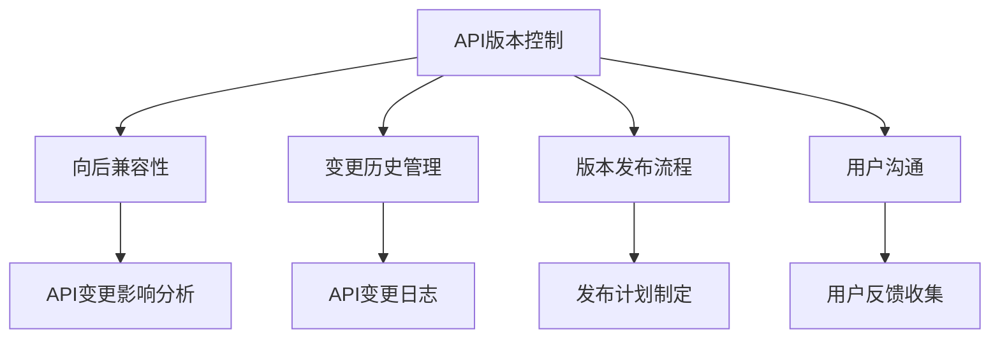

                 

## 1. 背景介绍

### 1.1 问题由来

随着Web应用和API服务的复杂度不断提高，API版本控制已成为构建稳定、可靠和易维护系统的核心需求之一。但是，API版本控制这一看似简单的任务，在实际操作中却面临诸多挑战。例如，如何确保新旧版本之间的向后兼容性？如何管理API的变更历史？如何优化API的版本发布流程？本文将对这些问题进行深入探讨，并提出一系列最佳实践。

### 1.2 问题核心关键点

API版本控制的核心在于确保API变更的平滑过渡，并在不同版本的API之间实现互操作性。具体来说，主要包括以下几个方面：

- **向后兼容性**：新旧版本之间的API接口应该保持兼容，使得现有用户能够无缝迁移到新版本。
- **变更历史管理**：清晰记录API的变更历史，便于追踪和管理。
- **版本发布流程**：建立规范的API版本发布流程，提高发布效率和可靠性。
- **用户沟通**：及时通知用户API变更情况，避免不必要的误解和影响。

## 2. 核心概念与联系

### 2.1 核心概念概述

- **API版本控制**：指通过某种机制，控制API的多个版本并管理它们之间的演变过程，确保API变更的平滑过渡。
- **向后兼容性**：新版本的API应该能与旧版本兼容，即现有的客户端和工具能够继续使用新版本的API。
- **变更历史管理**：记录API的发布、更新、废弃等变更事件，为后续的API管理和维护提供依据。
- **版本发布流程**：定义API版本发布的步骤和规范，确保发布过程的规范性和可靠性。
- **用户沟通**：通过文档、邮件、公告等方式，及时通知用户API变更情况，减少对用户的影响。

为更好地理解API版本控制的核心概念和相互关系，这里使用Mermaid绘制了以下流程图：



### 2.2 概念间的关系

以上核心概念构成了API版本控制的基础框架。它们之间存在以下关系：

- **API版本控制**是整体过程，其他概念均在其管理之下。
- **向后兼容性**、**变更历史管理**、**版本发布流程**和**用户沟通**是API版本控制的不同方面。
- **API变更影响分析**和**API变更日志**是实现以上概念的具体技术手段。
- **发布计划制定**和**用户反馈收集**是优化API版本控制流程的重要环节。

## 3. 核心算法原理 & 具体操作步骤
### 3.1 算法原理概述

API版本控制的核心原理是基于变更日志和发布计划，通过一系列的规则和策略，确保API变更的平滑过渡和向后兼容性。其基本步骤如下：

1. **变更日志记录**：记录API的发布、更新和废弃事件，包括变更原因、影响范围等。
2. **发布计划制定**：根据变更日志，制定详细的发布计划，包括发布日期、版本说明、兼容性和支持周期等。
3. **向后兼容性分析**：评估新版本的API与旧版本之间的兼容性，确保现有用户可以无缝迁移到新版本。
4. **用户沟通与反馈**：通过文档、邮件等方式通知用户API变更情况，收集用户反馈，及时调整发布计划。
5. **发布和回滚策略**：根据发布计划，部署新版本API；如果出现问题，可以回滚到旧版本。

### 3.2 算法步骤详解

**步骤1：变更日志记录**

记录API变更日志时，应包含以下关键信息：

- **变更日期**：记录变更发生的时间。
- **变更者**：记录变更的负责人或团队。
- **变更原因**：记录变更的原因，如修复漏洞、增加新功能等。
- **影响范围**：记录变更对现有API接口的影响范围，包括哪些接口受到影响。
- **兼容策略**：记录新旧版本之间的兼容策略，如新增参数、重命名接口等。

示例变更日志：

```
变更日期：2023-04-01
变更者：API团队
变更原因：修复安全漏洞
影响范围：所有接口
兼容策略：新增参数`security_token`
```

**步骤2：发布计划制定**

根据变更日志，制定详细的发布计划，包括以下内容：

- **发布日期**：计划发布新版本的日期。
- **版本说明**：新版本的主要功能、修复和改进点。
- **兼容性和支持周期**：新旧版本之间的兼容性说明，以及新版本的支持周期。
- **里程碑**：发布计划的关键节点，如代码审查、测试等。

示例发布计划：

```
发布日期：2023-04-15
版本说明：修复安全漏洞、增加新功能
兼容性和支持周期：兼容性分析结果、支持时间为2个月
里程碑：代码审查（2023-04-05）、测试（2023-04-10）
```

**步骤3：向后兼容性分析**

评估新版本的API与旧版本之间的兼容性，主要包括以下步骤：

1. **接口对比**：对比新旧版本的API接口，找出新增、修改和删除的接口。
2. **参数对比**：对比新旧版本的API参数，找出新增、修改和删除的参数。
3. **兼容测试**：通过编写测试用例，验证新旧版本之间的兼容性。

示例兼容性分析报告：

```
接口对比结果：新增接口`new_endpoint`，修改接口`old_endpoint`
参数对比结果：新增参数`security_token`，删除参数`obsolete`
兼容测试结果：通过
```

**步骤4：用户沟通与反馈**

通过文档、邮件等方式通知用户API变更情况，收集用户反馈，主要包括以下步骤：

1. **变更通知**：发布变更公告，详细描述变更内容、影响范围和兼容策略。
2. **用户反馈**：收集用户反馈，评估变更对用户的影响，如是否需要提供迁移指南。
3. **调整计划**：根据用户反馈，调整发布计划，确保API变更不会对用户造成过多影响。

示例变更通知邮件：

```
主题：API变更通知
亲爱的用户，
我们即将发布API版本2023.4.15，其中包含以下变更：
- 修复安全漏洞
- 增加新功能

为了确保您能顺利迁移到新版本，请按照以下步骤操作：
1. 更新API客户端版本至最新版本
2. 确保新旧版本之间的兼容性

如有任何疑问或建议，请随时联系我们的技术支持团队。
```

**步骤5：发布和回滚策略**

根据发布计划，部署新版本API；如果出现问题，可以回滚到旧版本。主要包括以下步骤：

1. **版本发布**：将新版本API部署到生产环境，确保所有用户都能访问新版本的API。
2. **监控和回滚**：监控新版本的API使用情况，及时发现和解决潜在的兼容性问题。
3. **回滚机制**：如果新版本的API出现问题，可以迅速回滚到旧版本，确保系统的稳定性。

示例发布和回滚流程：

```
步骤1：版本发布
- 部署新版本API到生产环境
- 通知用户新版API可用

步骤2：监控和回滚
- 监控新版本的API使用情况
- 发现问题后，迅速回滚到旧版本API

步骤3：反馈和调整
- 收集用户反馈，评估回滚的影响
- 调整发布计划，优化API变更过程
```

### 3.3 算法优缺点

**优点**：

1. **确保向后兼容性**：通过详细的兼容性分析，确保新旧版本之间的兼容性，减少用户迁移的难度。
2. **清晰的变更历史**：通过详细的变更日志和发布计划，记录API的演变过程，便于后续的维护和管理。
3. **规范的发布流程**：制定详细的发布流程，提高API版本发布的规范性和可靠性。
4. **有效的用户沟通**：通过文档、邮件等方式及时通知用户API变更情况，减少对用户的影响。

**缺点**：

1. **发布成本高**：制定和执行发布计划，特别是兼容性分析，可能需要较高的资源和时间投入。
2. **变更管理复杂**：记录和跟踪API变更日志，需要一定的管理和维护成本。
3. **用户反馈困难**：用户反馈的数量和质量难以保证，可能影响变更决策。

### 3.4 算法应用领域

API版本控制广泛应用于各类Web应用和服务。例如：

- **电商平台**：API版本控制可以确保商品信息、订单处理等功能的稳定性，减少用户的不必要损失。
- **金融服务**：API版本控制可以保障金融交易、账户管理等核心功能的连续性，提升用户的信任度。
- **社交媒体**：API版本控制可以保证用户数据、消息推送等功能的平稳过渡，提高用户满意度。
- **医疗健康**：API版本控制可以确保患者信息、医疗记录等数据的完整性和安全性，保障医疗服务的可靠性。

## 4. 数学模型和公式 & 详细讲解 & 举例说明

### 4.1 数学模型构建

API版本控制的核心是管理API变更日志和发布计划，因此我们可以使用一个简单的数学模型来描述这一过程：

设API的版本号为 $V_t$，其中 $t$ 表示当前版本号。每个版本号 $V_t$ 发布时，记录变更日志 $L_{V_t}$，制定发布计划 $P_{V_t}$。新版本的API $V_{t+1}$ 发布后，记录新旧版本之间的兼容性分析结果 $C_{V_{t+1}}$，并根据用户反馈 $F_{V_{t+1}}$ 调整发布计划。最终，形成新的API版本 $V_{t+1}$ 和变更日志 $L_{V_{t+1}}$。

### 4.2 公式推导过程

以一个简单的示例来推导API版本控制的基本流程：

1. 初始状态：假设当前版本号为 $V_1$，记录初始变更日志 $L_{V_1}$，制定初始发布计划 $P_{V_1}$。
2. 发布新版本号：发布新版本号 $V_2$，记录变更日志 $L_{V_2}$，制定发布计划 $P_{V_2}$。
3. 兼容性分析：评估新旧版本之间的兼容性 $C_{V_2}$。
4. 用户沟通：收集用户反馈 $F_{V_2}$。
5. 调整发布计划：根据用户反馈 $F_{V_2}$ 调整发布计划 $P_{V_2}$。
6. 新版本号发布：发布新版本号 $V_2$。

公式推导：

$$
V_{t+1} = V_t + 1
$$

$$
L_{V_{t+1}} = L_{V_t} \cup \{变更日志\}
$$

$$
P_{V_{t+1}} = P_{V_t} \cup \{新发布计划\}
$$

$$
C_{V_{t+1}} = C_{V_t} \cup \{兼容性分析结果\}
$$

$$
F_{V_{t+1}} = F_{V_t} \cup \{用户反馈\}
$$

$$
P_{V_{t+1}} = P_{V_t} - \{不可行部分\} + \{调整部分\}
$$

### 4.3 案例分析与讲解

以一个实际的案例来说明API版本控制的流程：

假设我们有一个电商平台的API，版本号为 $V_1$。在发布新版本 $V_2$ 时，记录以下变更日志：

- **变更日期**：2023-04-01
- **变更者**：API团队
- **变更原因**：修复安全漏洞
- **影响范围**：所有接口
- **兼容策略**：新增参数 `security_token`

制定以下发布计划：

- **发布日期**：2023-04-15
- **版本说明**：修复安全漏洞、增加新功能
- **兼容性和支持周期**：兼容性分析结果、支持时间为2个月
- **里程碑**：代码审查（2023-04-05）、测试（2023-04-10）

进行兼容性分析，评估新旧版本之间的兼容性，结果如下：

- **接口对比结果**：新增接口 `new_endpoint`，修改接口 `old_endpoint`
- **参数对比结果**：新增参数 `security_token`，删除参数 `obsolete`
- **兼容测试结果**：通过

通过文档、邮件等方式通知用户API变更情况，收集用户反馈，结果如下：

- **变更通知**：发布变更公告，详细描述变更内容、影响范围和兼容策略。
- **用户反馈**：部分用户反馈新功能使用不当导致性能下降，建议提供使用指南。
- **调整计划**：根据用户反馈，调整发布计划，优化API变更过程。

最终，发布新版本 $V_2$，记录以下变更日志：

- **变更日期**：2023-04-15
- **变更者**：API团队
- **变更原因**：修复安全漏洞，增加新功能
- **影响范围**：所有接口
- **兼容策略**：新增参数 `security_token`，删除参数 `obsolete`

## 5. 项目实践：代码实例和详细解释说明

### 5.1 开发环境搭建

为了实践API版本控制，我们可以使用Python和Flask框架搭建一个简单的API服务。以下是开发环境搭建的详细步骤：

1. 安装Python：下载并安装Python 3.8以上版本。
2. 安装Flask：使用pip命令安装Flask。
3. 创建API项目：创建一个名为 `api_project` 的项目文件夹，并在其中创建 `api.py` 文件。
4. 编写API代码：在 `api.py` 文件中编写API的路由和处理逻辑。
5. 运行API服务：使用Flask的开发服务器运行API服务。

### 5.2 源代码详细实现

以下是实现一个简单的API服务，支持版本控制的示例代码：

```python
from flask import Flask, jsonify

app = Flask(__name__)

# 初始版本信息
initial_version = {'version': 1, 'description': 'Initial version'}

# 变更日志列表
change_logs = [initial_version]

# 当前版本号
current_version = 1

# 添加API路由
@app.route('/api/v1/<endpoint>')
def get_api(endpoint):
    global current_version
    for log in change_logs:
        if log['version'] > current_version:
            current_version = log['version']
    return jsonify({'endpoint': endpoint, 'version': current_version})

if __name__ == '__main__':
    app.run(debug=True)
```

### 5.3 代码解读与分析

在上述代码中，我们实现了以下功能：

1. **版本信息管理**：通过 `initial_version` 和 `change_logs` 变量管理API的初始版本信息和变更日志。
2. **当前版本号更新**：根据变更日志，动态更新当前版本号。
3. **API路由**：通过 `/get_api` 路由返回指定API的当前版本号。
4. **开发服务器运行**：使用Flask的开发服务器运行API服务，方便调试和测试。

### 5.4 运行结果展示

启动API服务后，可以通过访问 `http://127.0.0.1:5000/api/v1/some_endpoint` 来获取指定API的当前版本号。例如，如果当前版本号为2，则返回以下JSON响应：

```json
{
  "endpoint": "some_endpoint",
  "version": 2
}
```

## 6. 实际应用场景

### 6.1 电商平台

电商平台的API版本控制可以确保商品信息、订单处理等功能的稳定性，减少用户的不必要损失。例如，在节假日促销期间，电商平台需要发布新功能，如优惠券、打折商品等，但这些功能可能会对现有的订单处理和库存管理产生影响。通过API版本控制，可以确保用户能够无缝迁移到新版本，并逐步回滚旧版本，从而减少对用户的影响。

### 6.2 金融服务

金融服务的API版本控制可以保障金融交易、账户管理等核心功能的连续性，提升用户的信任度。例如，在进行系统升级或数据迁移时，需要发布新版本的API，但这些操作可能会对现有的金融交易产生影响。通过API版本控制，可以确保新旧版本之间的平滑过渡，避免因API变更对用户造成影响。

### 6.3 社交媒体

社交媒体的API版本控制可以保证用户数据、消息推送等功能的平稳过渡，提高用户满意度。例如，在新增新功能或进行重大更新时，需要发布新版本的API，但这些操作可能会对现有的用户数据和消息推送产生影响。通过API版本控制，可以确保用户能够无缝迁移到新版本，并逐步回滚旧版本，从而减少对用户的影响。

### 6.4 医疗健康

医疗健康的API版本控制可以确保患者信息、医疗记录等数据的完整性和安全性，保障医疗服务的可靠性。例如，在进行系统升级或数据迁移时，需要发布新版本的API，但这些操作可能会对现有的患者信息和医疗记录产生影响。通过API版本控制，可以确保新旧版本之间的平滑过渡，避免因API变更对用户造成影响。

## 7. 工具和资源推荐

### 7.1 学习资源推荐

为了深入学习API版本控制的相关知识，这里推荐一些优质的学习资源：

1. **《API设计》一书**：该书详细介绍了API设计的最佳实践，包括API版本控制、向后兼容性、文档编写等内容。
2. **《RESTful Web Services》一书**：该书介绍了RESTful API的原理和设计，涵盖了API版本控制的常见问题和解决方案。
3. **《API Design Guide》文档**：该文档由Google官方发布，详细介绍了API设计的最佳实践，包括版本控制、文档编写等内容。
4. **《API Academy》网站**：该网站提供了丰富的API设计资源，包括教程、视频、社区讨论等内容。

### 7.2 开发工具推荐

为了实现API版本控制，以下是几款常用的开发工具：

1. **Postman**：Postman是一款流行的API开发和测试工具，支持自动化测试、代码生成等功能，方便API版本控制的实践。
2. **Swagger**：Swagger是一款API文档生成工具，支持Swagger Codegen生成API代码，方便API版本控制的实现和维护。
3. **Insomnia**：Insomnia是一款API开发工具，支持API测试、代码生成、自动部署等功能，方便API版本控制的实践。

### 7.3 相关论文推荐

API版本控制的研究主要集中在向后兼容性、变更历史管理、发布计划制定等方面。以下是几篇相关论文，推荐阅读：

1. **《A Comprehensive Study of RESTful API Design》**：该论文系统介绍了RESTful API的设计原则和最佳实践，包括API版本控制、文档编写等内容。
2. **《API Versioning: Challenges and Solutions》**：该论文详细讨论了API版本控制的常见问题和解决方案，提供了丰富的案例分析。
3. **《API Versioning with OpenAPI Specifications》**：该论文介绍了使用OpenAPI规范进行API版本控制的实践，提供了详细的代码示例和实现步骤。

## 8. 总结：未来发展趋势与挑战

### 8.1 研究成果总结

本文对API版本控制的原理、操作步骤、最佳实践等方面进行了深入探讨，提出了一系列系统的解决方案。通过详细的案例分析和代码实现，帮助读者深入理解API版本控制的实现过程。

### 8.2 未来发展趋势

API版本控制的未来发展趋势包括：

1. **自动化工具普及**：随着API版本控制的普及，自动化工具（如Postman、Swagger等）将得到广泛应用，提高API版本控制的效率和规范性。
2. **API生命周期管理**：API生命周期管理将成为API版本控制的重要环节，涵盖API设计、开发、测试、部署和维护的各个阶段。
3. **持续集成和持续部署**：持续集成和持续部署（CI/CD）将与API版本控制深度结合，实现自动化发布和回滚，提高API发布的可靠性和效率。
4. **API标准和规范**：API标准和规范（如OpenAPI、API Blueprint等）将得到进一步推广和应用，提高API版本控制的规范性和一致性。

### 8.3 面临的挑战

尽管API版本控制已经取得了一定的进展，但在实际应用中仍面临一些挑战：

1. **向后兼容性问题**：新旧版本之间的兼容性问题仍然存在，特别是当API变更较频繁时，容易导致用户的不适应和影响。
2. **变更历史管理**：变更日志和发布计划的维护和管理需要较高的资源和时间投入，增加了维护成本。
3. **用户沟通困难**：用户反馈的数量和质量难以保证，可能影响变更决策和用户满意度。
4. **自动化工具不足**：现有的自动化工具（如Postman、Swagger等）仍存在一些限制，无法满足所有API版本控制的需求。

### 8.4 研究展望

未来的研究应关注以下几个方面：

1. **自动化和智能化**：开发更加智能化和自动化的API版本控制工具，提高API变更的效率和规范性。
2. **API生命周期管理**：深入研究API生命周期管理的各个环节，提供更全面的解决方案。
3. **用户沟通和反馈**：加强用户沟通和反馈机制，提高API变更的透明度和用户满意度。
4. **API标准和规范**：推广和应用更多的API标准和规范，提高API版本控制的规范性和一致性。

通过不断探索和创新，API版本控制必将在未来得到更广泛的应用和发展，成为构建稳定、可靠和易维护系统的核心工具。

## 9. 附录：常见问题与解答

### Q1: API版本控制和API设计有什么区别？

**A**：API版本控制和API设计是两个不同的概念。API设计关注的是API接口的总体设计和实现，包括接口定义、参数设计、错误处理等；而API版本控制关注的是API接口的演进和变更管理，包括版本兼容性、变更日志、发布计划等。

### Q2: 如何确保API变更的向后兼容性？

**A**：确保API变更的向后兼容性需要详细记录API接口的变更历史，评估新旧版本之间的兼容性，并根据用户反馈调整发布计划。具体来说，可以通过以下方法实现：

1. 记录变更日志，明确新旧版本之间的差异。
2. 进行兼容性测试，确保新旧版本之间的接口和参数兼容。
3. 提供迁移指南，帮助用户平滑迁移到新版本。
4. 持续监控和反馈，及时发现并解决兼容性问题。

### Q3: 如何管理API变更日志？

**A**：管理API变更日志需要明确记录变更日期、变更者、变更原因、影响范围和兼容策略等关键信息。具体来说，可以通过以下方法实现：

1. 使用版本控制系统（如Git）管理变更日志，确保变更日志的版本控制和追溯。
2. 定期审计变更日志，确保变更日志的完整性和准确性。
3. 使用API管理工具（如Swagger、Postman等）自动记录变更日志。

### Q4: 如何制定API发布计划？

**A**：制定API发布计划需要明确发布日期、版本说明、兼容性和支持周期等关键信息。具体来说，可以通过以下方法实现：

1. 根据变更日志，评估API变更的影响范围和风险，制定详细的发布计划。
2. 制定发布里程碑，明确各个关键节点（如代码审查、测试等）。
3. 确定支持周期，明确新版本的支持时间和维护策略。

### Q5: 如何通过文档通知用户API变更？

**A**：通过文档通知用户API变更，需要详细描述变更内容、影响范围和兼容策略。具体来说，可以通过以下方法实现：

1. 使用API文档工具（如Swagger、Postman等）自动生成API变更文档。
2. 通过邮件、公告等方式，及时通知用户API变更情况。
3. 收集用户反馈，评估变更对用户的影响，并及时调整发布计划。

### Q6: 如何通过代码实现API版本控制？

**A**：通过代码实现API版本控制，可以使用Python、Flask等工具。具体来说，可以通过以下方法实现：

1. 使用版本控制系统（如Git）管理API版本信息。
2. 使用API管理工具（如Swagger、Postman等）自动记录变更日志和发布计划。
3. 编写API路由和处理逻辑，实现API版本控制的各个功能。

通过这些方法，可以帮助开发者实现API版本控制，提高API发布的规范性和效率。

