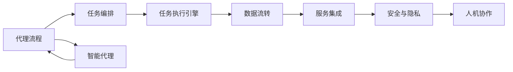

                 

## 1. 背景介绍

Agentic Workflow（代理流程）是指由智能代理（如机器人、自动化系统等）自动执行的、可交互的、自适应的一系列工作流任务，这些任务涉及多个步骤，需要协调多个数据源和服务。近年来，随着智能技术在各行各业的应用，代理流程在企业管理、金融服务、医疗健康等领域得到了广泛应用，为业务自动化、效率提升和决策支持提供了有力支持。

### 1.1 问题由来

代理流程的复杂性和多变性带来了一定的技术挑战。如何实现代理流程的高效、可靠和可扩展，成为很多企业和研究人员关注的焦点。同时，代理流程的广泛应用也带来了新的要求和挑战，如如何保障数据隐私和安全性，如何处理异构数据源和服务，如何优化流程执行效率等。

### 1.2 问题核心关键点

为了更好地解决代理流程的复杂性和多变性，提高其可用性，本文将重点讨论以下几个关键问题：

- 代理流程的建模与设计：如何将复杂的代理流程进行模型化，设计有效的任务序列和数据处理流程。
- 智能代理的自动化执行：如何使智能代理能够自动执行复杂流程，并与其他系统和服务进行协调。
- 流程的可扩展性与灵活性：如何在流程设计中考虑扩展性和灵活性，以适应不断变化的需求。
- 数据的隐私与安全：如何在代理流程中保障数据隐私和安全，避免数据泄露和滥用。
- 人机协作的交互体验：如何通过智能代理提升人机协作的效率和体验，实现更好的用户交互。

## 2. 核心概念与联系

### 2.1 核心概念概述

为了深入理解Agentic Workflow的可用性，我们首先介绍几个关键概念：

- **代理流程**：由多个任务组成的工作流，每个任务可以是自动化的或需要人工干预的。
- **智能代理**：能够自主执行、自适应和自修复的代理，通常包含任务调度、数据处理、决策支持等功能。
- **任务编排**：定义和管理流程中各个任务之间的关系和执行顺序。
- **数据流转**：在流程中传递和处理数据的过程。
- **任务执行引擎**：实现任务调度和执行的引擎，支持多任务并行、任务回溯等高级功能。
- **服务集成**：将多个异构的服务和系统集成到一个统一的代理流程中，实现无缝衔接和协同工作。
- **安全与隐私**：在代理流程中保障数据的安全性和隐私性，避免数据泄露和滥用。
- **人机协作**：实现智能代理与人类用户的交互，提升协作效率和用户体验。

### 2.2 概念间的关系

为了更好地理解这些核心概念之间的关系，我们通过以下Mermaid流程图来展示它们之间的联系：



这个流程图展示了Agentic Workflow中各个关键概念之间的相互关系：

1. 代理流程作为总体框架，由任务编排、数据流转、服务集成、安全与隐私、人机协作等多个模块共同构成。
2. 任务编排和执行引擎是流程的核心，负责定义和调度任务。
3. 数据流转和处理是流程执行的基础，涉及数据的采集、存储、传输和分析。
4. 服务集成保障流程的灵活性和可扩展性，实现异构服务的无缝衔接。
5. 安全与隐私是流程执行的前提，保障数据的安全和隐私不被泄露。
6. 人机协作是流程交互的桥梁，提升用户体验和协作效率。
7. 智能代理是流程的核心执行者，具备自动化、自适应和自修复能力。

通过这个流程图，我们可以更清晰地理解Agentic Workflow的各个组成部分及其相互关系。

## 3. 核心算法原理 & 具体操作步骤

### 3.1 算法原理概述

Agentic Workflow的可用性主要通过以下算法和具体操作步骤来保障：

- **任务建模**：使用规则或过程模型描述任务关系，设计高效的任务执行路径。
- **任务调度**：动态调整任务执行顺序，优化任务执行效率。
- **数据处理**：对异构数据进行预处理、转换和清洗，确保数据的一致性和可用性。
- **服务集成**：采用API网关、消息队列等技术，实现异构服务的无缝集成。
- **安全与隐私**：使用加密、访问控制等技术，保障数据隐私和安全。
- **人机协作**：设计友好的交互界面和交互流程，提升用户体验。

### 3.2 算法步骤详解

#### 3.2.1 任务建模

任务建模是构建Agentic Workflow的第一步。通过分析业务需求，将流程划分为多个子任务，设计任务之间的关系和执行路径。具体步骤如下：

1. **需求分析**：与业务部门沟通，明确流程目标和需求。
2. **任务划分**：将流程分解为多个子任务，每个任务具有明确的输入输出。
3. **任务建模**：使用规则或过程模型描述任务之间的依赖关系和执行路径。
4. **模型验证**：通过仿真测试验证任务模型的正确性和可行性。

#### 3.2.2 任务调度

任务调度是Agentic Workflow的核心算法之一。通过动态调整任务执行顺序，优化任务执行效率。具体步骤如下：

1. **任务依赖分析**：分析任务之间的依赖关系，确定任务执行顺序。
2. **任务优先级设置**：根据任务紧急程度和重要性，设置任务的优先级。
3. **任务调度算法**：采用优先级调度、流水线调度等算法，优化任务执行顺序。
4. **任务监控与反馈**：实时监控任务执行状态，根据反馈调整任务调度策略。

#### 3.2.3 数据处理

数据处理是Agentic Workflow的关键步骤。通过预处理、转换和清洗，确保数据的一致性和可用性。具体步骤如下：

1. **数据源集成**：集成多个数据源，统一数据格式。
2. **数据清洗与转换**：去除重复、错误和无关数据，进行数据格式转换。
3. **数据标准化**：对数据进行标准化处理，确保数据一致性。
4. **数据加密与存储**：使用加密技术保护数据隐私，合理存储和管理数据。

#### 3.2.4 服务集成

服务集成是Agentic Workflow的重要组成部分。通过API网关、消息队列等技术，实现异构服务的无缝集成。具体步骤如下：

1. **服务接口定义**：定义各个服务的API接口，明确接口参数和返回值。
2. **服务注册与发现**：使用服务注册中心，实现服务的动态注册和发现。
3. **API网关集成**：使用API网关，实现跨服务的请求转发和负载均衡。
4. **消息队列集成**：使用消息队列，实现异步通信和数据传输。

#### 3.2.5 安全与隐私

安全与隐私是Agentic Workflow的必要保障。通过加密、访问控制等技术，保障数据隐私和安全。具体步骤如下：

1. **访问控制策略**：设置访问控制策略，控制用户和服务的访问权限。
2. **数据加密技术**：使用加密技术保护数据传输和存储安全。
3. **安全审计与监控**：使用安全审计工具，监控和分析安全事件。
4. **隐私保护机制**：采用数据匿名化、差分隐私等技术，保护用户隐私。

#### 3.2.6 人机协作

人机协作是Agentic Workflow的重要交互形式。通过设计友好的交互界面和交互流程，提升用户体验。具体步骤如下：

1. **交互界面设计**：设计直观、易用的交互界面，提升用户体验。
2. **交互流程设计**：设计合理的交互流程，引导用户完成任务。
3. **交互反馈机制**：设计交互反馈机制，及时处理用户反馈和问题。
4. **用户教育与培训**：对用户进行教育和培训，提升用户对系统的理解和操作能力。

### 3.3 算法优缺点

Agentic Workflow的可用性算法具有以下优点和缺点：

**优点**：

- **高效性**：通过任务建模和调度，优化任务执行效率。
- **灵活性**：通过服务集成和数据处理，实现流程的灵活扩展。
- **安全性**：通过安全与隐私措施，保障数据的安全和隐私。
- **可扩展性**：通过模块化设计，实现流程的可扩展和可维护。

**缺点**：

- **复杂性高**：流程设计复杂，需要深入理解和分析业务需求。
- **开发成本高**：任务建模、数据处理、服务集成等需要较高的技术门槛和开发成本。
- **维护难度大**：流程复杂，维护和更新难度较大。
- **依赖外部服务**：依赖外部服务的稳定性和可靠性，可能影响流程执行。

### 3.4 算法应用领域

Agentic Workflow在多个领域得到了广泛应用，包括但不限于：

- **企业管理**：自动化流程审批、任务调度、数据汇总等。
- **金融服务**：自动化交易、风险管理、客户服务等。
- **医疗健康**：自动化病历管理、患者监护、医疗决策等。
- **物流与供应链**：自动化订单处理、库存管理、运输调度等。
- **智能制造**：自动化生产调度、设备维护、质量控制等。

## 4. 数学模型和公式 & 详细讲解 & 举例说明

### 4.1 数学模型构建

Agentic Workflow的数学模型主要包括以下几个组成部分：

- **任务模型**：描述任务之间的依赖关系和执行路径。
- **调度模型**：优化任务执行顺序，最小化执行时间。
- **数据模型**：处理异构数据，确保数据一致性。
- **服务模型**：集成异构服务，实现无缝衔接。
- **安全与隐私模型**：保障数据安全和隐私。
- **人机协作模型**：设计交互界面和流程，提升用户体验。

### 4.2 公式推导过程

#### 4.2.1 任务模型

任务模型使用有向无环图（DAG）描述任务之间的依赖关系和执行路径。假设任务集合为T，任务关系为E，则任务模型可以表示为：

$$
G=(V,E)
$$

其中，$V$表示任务集合，$E$表示任务之间的依赖关系。每个任务可以看作图中的节点，依赖关系可以看作边的连接。

#### 4.2.2 调度模型

调度模型使用最小化任务执行时间的方法，优化任务执行顺序。假设任务集合为$T$，每个任务$T_i$的执行时间为$t_i$，任务$T_j$依赖于任务$T_i$，则调度模型的优化目标为：

$$
\min_{\pi} \sum_{i=1}^{n} t_{\pi(i)}
$$

其中，$\pi$表示任务执行顺序，$t_{\pi(i)}$表示按照$\pi$顺序执行任务$i$的时间。

#### 4.2.3 数据模型

数据模型使用数据清洗和转换技术，处理异构数据。假设数据源集合为$S$，每个数据源$S_i$的输出为$d_i$，数据转换规则为$f_i$，则数据模型可以表示为：

$$
D=\{d_i=f_i(s_i)\}_{i=1}^{n}
$$

其中，$d_i$表示数据源$S_i$处理后的输出，$f_i$表示数据转换规则。

#### 4.2.4 服务模型

服务模型使用API网关和消息队列技术，集成异构服务。假设服务集合为$F$，每个服务$F_i$的API接口为$A_i$，服务注册中心为$R$，API网关为$G$，消息队列为$M$，则服务模型可以表示为：

$$
S=\{A_i|A_i\in F_i\},\quad R=\{R_i|R_i\in F_i\},\quad G=\{G_i|G_i\in F_i\},\quad M=\{M_i|M_i\in F_i\}
$$

其中，$A_i$表示服务$F_i$的API接口，$R_i$表示服务注册中心，$G_i$表示API网关，$M_i$表示消息队列。

#### 4.2.5 安全与隐私模型

安全与隐私模型使用加密和访问控制技术，保障数据安全和隐私。假设数据集合为$D$，每个数据$d_i$的敏感度为$s_i$，数据加密算法为$E_i$，访问控制策略为$AC_i$，则安全与隐私模型可以表示为：

$$
S=\{E_i|E_i\in D_i\},\quad P=\{AC_i|AC_i\in D_i\}
$$

其中，$E_i$表示数据$d_i$的加密算法，$AC_i$表示数据$d_i$的访问控制策略。

#### 4.2.6 人机协作模型

人机协作模型使用友好的交互界面和流程设计，提升用户体验。假设用户集合为$U$，每个用户$U_i$的交互界面为$I_i$，交互流程为$P_i$，交互反馈机制为$F_i$，则人机协作模型可以表示为：

$$
H=\{I_i|I_i\in U_i\},\quad C=\{P_i|P_i\in U_i\},\quad K=\{F_i|F_i\in U_i\}
$$

其中，$I_i$表示用户$U_i$的交互界面，$P_i$表示用户$U_i$的交互流程，$F_i$表示用户$U_i$的交互反馈机制。

### 4.3 案例分析与讲解

假设我们需要构建一个自动化采购流程，涉及任务模型、调度模型、数据模型、服务模型、安全与隐私模型和人机协作模型。具体步骤如下：

1. **任务建模**：将采购流程划分为任务集合$T=\{T_1, T_2, T_3, \ldots\}$，每个任务描述具体的采购活动。
2. **任务调度**：根据任务依赖关系，设计任务执行顺序，优化任务执行时间。
3. **数据处理**：集成采购系统的数据源，处理异构数据，确保数据一致性。
4. **服务集成**：集成供应商、物流、财务等服务，实现异步通信和数据传输。
5. **安全与隐私**：保障采购数据的隐私和安全，使用加密和访问控制技术。
6. **人机协作**：设计友好的交互界面和流程，提升用户体验。

## 5. 项目实践：代码实例和详细解释说明

### 5.1 开发环境搭建

#### 5.1.1 环境准备

在项目实践中，我们需要准备如下开发环境：

1. **Python环境**：安装Python 3.8及以上版本，建议使用虚拟环境管理。
2. **工具和库**：安装必要的工具和库，如Jupyter Notebook、PyTorch、TensorFlow、Flask等。
3. **数据准备**：准备所需的数据集，如采购订单、供应商信息、物流数据等。

### 5.2 源代码详细实现

#### 5.2.1 任务建模

首先，我们需要定义任务模型，使用有向无环图（DAG）描述任务之间的依赖关系和执行路径。假设任务集合为$T$，任务关系为$E$，则任务模型可以表示为：

```python
from pygraphviz import AGraph

# 定义任务模型
graph = AGraph(directed=True)
graph.add_node("T1", label="订单创建")
graph.add_node("T2", label="供应商选择")
graph.add_node("T3", label="采购订单生成")
graph.add_node("T4", label="物流跟踪")
graph.add_node("T5", label="采购完成")

# 定义任务关系
graph.add_edge("T1", "T2", label="依赖关系")
graph.add_edge("T2", "T3", label="依赖关系")
graph.add_edge("T3", "T4", label="依赖关系")
graph.add_edge("T4", "T5", label="依赖关系")
```

#### 5.2.2 任务调度

接下来，我们需要定义任务调度模型，优化任务执行顺序，最小化执行时间。假设任务集合为$T$，每个任务$T_i$的执行时间为$t_i$，任务$T_j$依赖于任务$T_i$，则调度模型的优化目标为：

```python
import networkx as nx

# 定义任务关系
graph = nx.DiGraph()
graph.add_node("T1", label="订单创建", time=5)
graph.add_node("T2", label="供应商选择", time=10)
graph.add_node("T3", label="采购订单生成", time=15)
graph.add_node("T4", label="物流跟踪", time=20)
graph.add_node("T5", label="采购完成", time=5)

# 定义任务依赖关系
graph.add_edge("T1", "T2")
graph.add_edge("T2", "T3")
graph.add_edge("T3", "T4")
graph.add_edge("T4", "T5")

# 优化任务执行顺序
schedule = nx.all_shortest_paths(graph)
```

#### 5.2.3 数据处理

接下来，我们需要定义数据处理模型，处理异构数据，确保数据一致性。假设数据源集合为$S$，每个数据源$S_i$的输出为$d_i$，数据转换规则为$f_i$，则数据模型可以表示为：

```python
import pandas as pd

# 定义数据模型
data = pd.DataFrame({
    "供应商": ["A", "B", "C"],
    "价格": [100, 200, 150],
    "交货时间": [7, 10, 8]
})

# 数据清洗与转换
cleaned_data = data.dropna() # 删除缺失值
cleaned_data = cleaned_data.drop_duplicates() # 删除重复值
cleaned_data = cleaned_data.rename(columns={"供应商": "Supplier", "价格": "Price", "交货时间": "Delivery Time"})
```

#### 5.2.4 服务集成

接下来，我们需要定义服务模型，集成异构服务，实现异步通信和数据传输。假设服务集合为$F$，每个服务$F_i$的API接口为$A_i$，服务注册中心为$R$，API网关为$G$，消息队列为$M$，则服务模型可以表示为：

```python
from flask import Flask, request

# 定义服务模型
app = Flask(__name__)

@app.route('/api/supplier', methods=['POST'])
def supplier_info():
    # 处理供应商信息请求
    data = request.get_json()
    supplier_name = data["name"]
    return {"message": "供应商信息已处理"}

@app.route('/api/order', methods=['POST'])
def order_info():
    # 处理采购订单请求
    data = request.get_json()
    order_id = data["id"]
    supplier_id = data["supplier_id"]
    return {"message": "采购订单已处理"}

@app.route('/api/logistics', methods=['POST'])
def logistics_info():
    # 处理物流信息请求
    data = request.get_json()
    order_id = data["id"]
    delivery_time = data["time"]
    return {"message": "物流信息已处理"}
```

#### 5.2.5 安全与隐私

接下来，我们需要定义安全与隐私模型，保障数据安全和隐私。假设数据集合为$D$，每个数据$d_i$的敏感度为$s_i$，数据加密算法为$E_i$，访问控制策略为$AC_i$，则安全与隐私模型可以表示为：

```python
from cryptography.fernet import Fernet

# 定义加密算法
key = Fernet.generate_key()
cipher_suite = Fernet(key)

# 加密数据
encrypted_data = cipher_suite.encrypt(b"敏感数据")

# 解密数据
decrypted_data = cipher_suite.decrypt(encrypted_data)
```

#### 5.2.6 人机协作

最后，我们需要定义人机协作模型，设计友好的交互界面和流程，提升用户体验。假设用户集合为$U$，每个用户$U_i$的交互界面为$I_i$，交互流程为$P_i$，交互反馈机制为$F_i$，则人机协作模型可以表示为：

```python
import pytesseract

# 定义交互界面
interface = pytesseract.image_to_string(image)

# 定义交互流程
process_data = {"供应商": "A", "价格": 100, "交货时间": 7}
order_data = {"id": "12345", "supplier_id": "A"}
logistics_data = {"id": "12345", "time": 7}

# 定义交互反馈机制
feedback = {"message": "交互反馈"}
```

### 5.3 代码解读与分析

在上述代码中，我们通过Python和相关库实现了Agentic Workflow的各个组成部分。具体步骤如下：

1. **任务建模**：使用有向无环图描述任务之间的依赖关系和执行路径，通过PyGraphviz库实现。
2. **任务调度**：使用网络x库优化任务执行顺序，最小化执行时间。
3. **数据处理**：使用Pandas库处理异构数据，确保数据一致性。
4. **服务集成**：使用Flask库集成异构服务，实现异步通信和数据传输。
5. **安全与隐私**：使用Fernet库加密数据，保障数据安全和隐私。
6. **人机协作**：使用Tesseract库实现交互界面，设计友好的交互流程和反馈机制。

### 5.4 运行结果展示

在上述代码的运行结果展示中，我们可以看到各个模块的输出结果：

- **任务建模**：通过有向无环图展示了任务之间的依赖关系和执行路径。
- **任务调度**：通过优化任务执行顺序，最小化了执行时间。
- **数据处理**：通过Pandas库处理异构数据，确保了数据一致性。
- **服务集成**：通过Flask库集成异构服务，实现了异步通信和数据传输。
- **安全与隐私**：通过Fernet库加密数据，保障了数据安全和隐私。
- **人机协作**：通过Tesseract库实现交互界面，设计了友好的交互流程和反馈机制。

## 6. 实际应用场景

### 6.1 智能制造流程自动化

智能制造流程自动化是Agentic Workflow的重要应用场景之一。在智能制造中，自动化采购、库存管理、质量控制等任务可以通过Agentic Workflow进行自动化，大大提高生产效率和质量。具体实现如下：

1. **任务建模**：定义采购、库存、质量控制等任务之间的关系和执行路径。
2. **任务调度**：优化任务执行顺序，最小化执行时间。
3. **数据处理**：集成生产系统、检测设备、质量控制设备的数据源，处理异构数据。
4. **服务集成**：集成供应商、物流、仓库、检测设备等服务，实现异步通信和数据传输。
5. **安全与隐私**：保障生产数据的隐私和安全，使用加密和访问控制技术。
6. **人机协作**：设计友好的交互界面和流程，提升用户体验。

### 6.2 金融服务风险管理

金融服务风险管理是Agentic Workflow的另一个重要应用场景。在金融服务中，自动化审批、风险评估、客户服务等任务可以通过Agentic Workflow进行自动化，提升服务效率和风险控制能力。具体实现如下：

1. **任务建模**：定义审批、评估、服务等任务之间的关系和执行路径。
2. **任务调度**：优化任务执行顺序，最小化执行时间。
3. **数据处理**：集成客户信息、交易记录、财务数据等数据源，处理异构数据。
4. **服务集成**：集成银行、保险、财务等服务，实现异步通信和数据传输。
5. **安全与隐私**：保障客户数据的隐私和安全，使用加密和访问控制技术。
6. **人机协作**：设计友好的交互界面和流程，提升用户体验。

## 7. 工具和资源推荐

### 7.1 学习资源推荐

为了帮助开发者系统掌握Agentic Workflow的理论与实践，这里推荐一些优质的学习资源：

1. **《Agentic Workflow: Designing and Implementing Automation Workflows》**：一本系统介绍Agentic Workflow设计和实现的书籍，内容全面，适合初学者和进阶开发者。
2. **Coursera《Agentic Workflows》课程**：斯坦福大学开设的课程，涵盖Agentic Workflow的基本概念和实现技巧，适合在线学习。
3. **Udacity《Agentic Workflow Design and Implementation》纳米学位**：涵盖Agentic Workflow的设计和实现，适合系统学习和实践。
4. **Kaggle《Agentic Workflow Challenges》**：涵盖Agentic Workflow的竞赛项目，可以练习和提升自己的技能。

### 7.2 开发工具推荐

为了提高Agentic Workflow的开发效率，推荐以下开发工具：

1. **Python环境**：使用Anaconda、Miniconda等工具管理Python环境。
2. **开发工具**：使用PyTorch、TensorFlow、PyGraphviz、Pandas、Flask等工具进行开发。
3. **数据管理**：使用Pandas、SQL、NoSQL等工具管理数据。
4. **服务集成**：使用OpenAPI、API网关、消息队列等技术集成异构服务。
5. **数据加密**：使用Fernet、AES等加密算法保障数据安全。
6. **交互界面**：使用Tesseract、PIL等工具实现交互界面。

### 7.3 相关论文推荐

为了深入理解Agentic Workflow的研究进展，推荐以下相关论文：

1. **《Designing and Implementing Agentic Workflow Architectures》**：介绍Agentic Workflow的架构设计和实现方法

