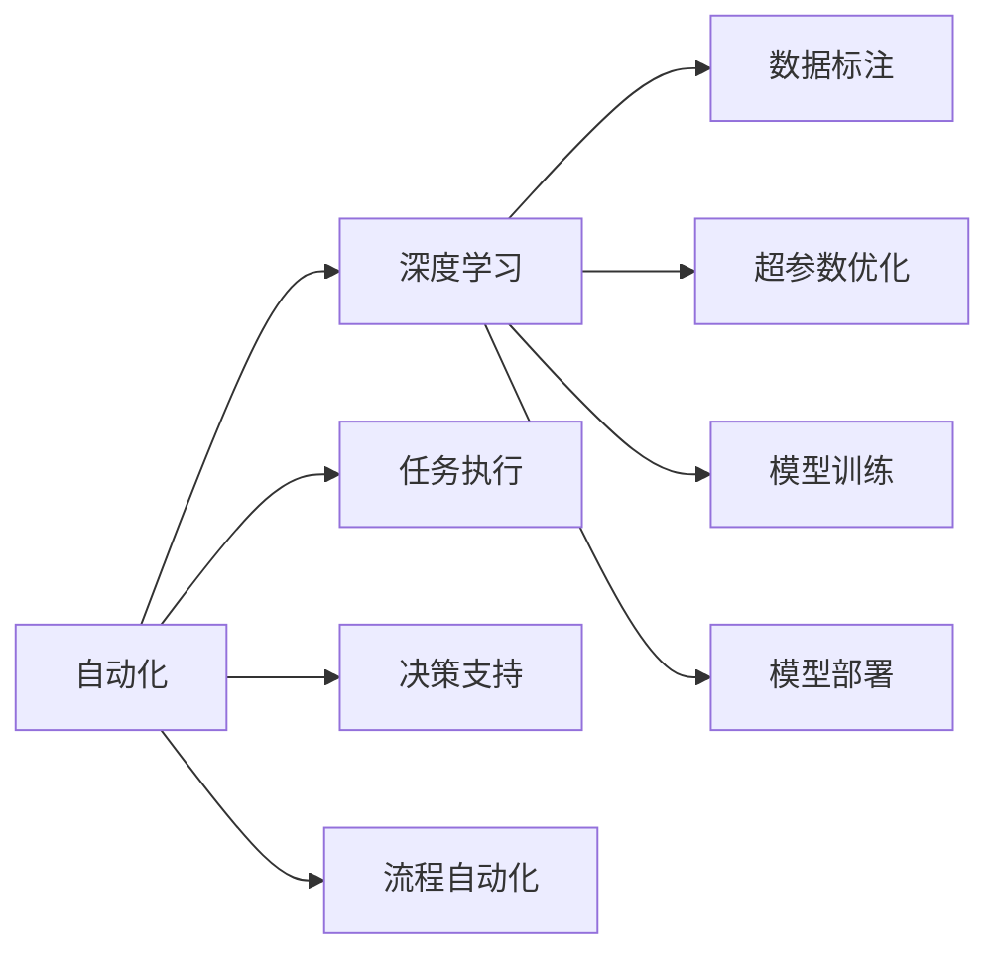
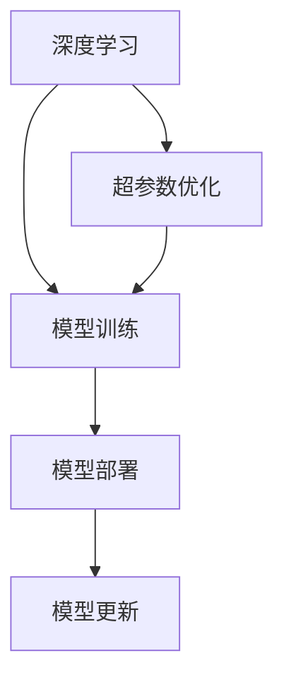
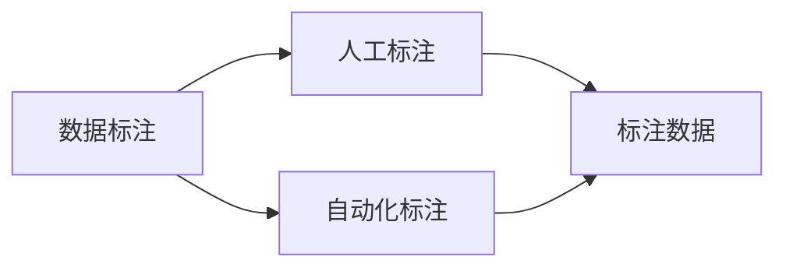
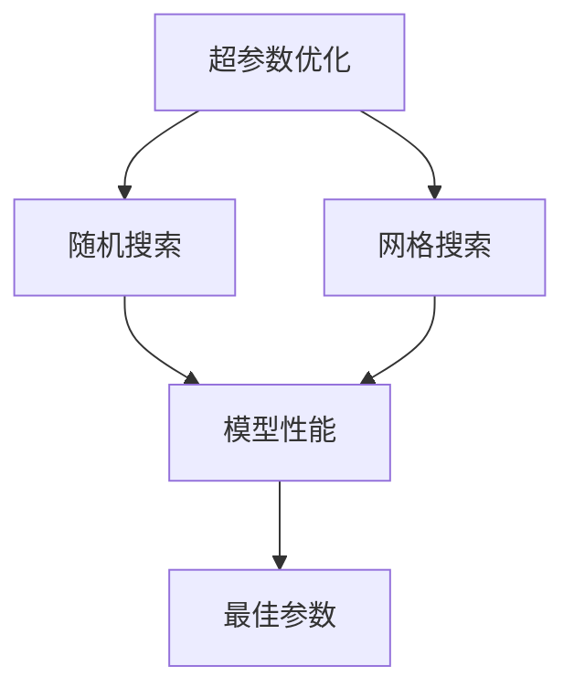
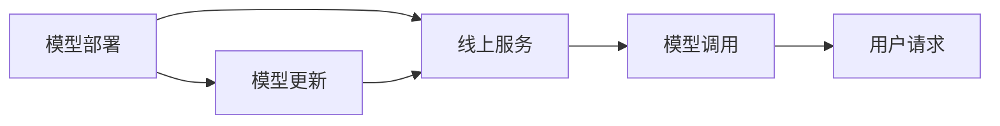
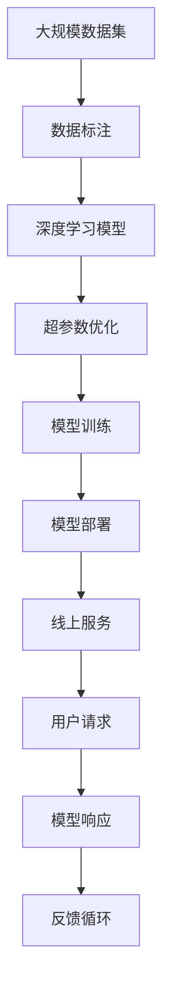

                 

# Andrej Karpathy的自动化见解

## 1. 背景介绍

### 1.1 问题由来
Andrej Karpathy是深度学习领域的顶尖专家，曾参与Google Brain和特斯拉AI部门的创立，是计算机视觉领域的重要贡献者。他的研究和教学视频在学术界和工业界都有很高的影响力。近年来，Karpathy在自动化的概念和方法上也有很深入的见解，包括自动化在AI中的应用、自动化的本质以及自动化与人工智能的结合等，这些观点对于理解自动化技术的发展具有重要的指导意义。

### 1.2 问题核心关键点
Karpathy关于自动化的核心观点主要包括以下几个方面：
- 自动化是深度学习的重要应用方向之一，涉及数据标注、超参数优化、模型训练、模型部署等多个环节。
- 自动化技术可以显著提高工作效率，降低错误率，是实现人工智能快速迭代的重要手段。
- 自动化的本质是让计算机在无需人工干预的情况下，完成复杂任务的处理，以实现人机协同。
- 自动化与人工智能的结合，使得AI系统能够自动适应环境变化，提升系统性能和用户满意度。

这些核心观点为理解自动化的应用和实现提供了重要思路。

### 1.3 问题研究意义
研究Andrej Karpathy关于自动化的见解，对于理解自动化技术的发展趋势、提升人工智能系统的效率和效果具有重要意义：

1. 自动化是深度学习的重要应用方向之一，涉及数据标注、超参数优化、模型训练、模型部署等多个环节。掌握自动化的基本方法，可以大幅提高AI系统的研发效率，降低人力成本。
2. 自动化的本质是让计算机在无需人工干预的情况下，完成复杂任务的处理。这不仅提高了工作效率，也减少了人为错误的发生。
3. 自动化与人工智能的结合，使得AI系统能够自动适应环境变化，提升系统性能和用户满意度。了解自动化的应用场景和实现技术，可以帮助开发者构建更高效、更智能的系统。
4. 自动化技术的发展方向和挑战，也是人工智能技术前进的重要参考。掌握自动化的未来趋势，有助于把握AI技术的前沿发展方向。

## 2. 核心概念与联系

### 2.1 核心概念概述

为更好地理解Andrej Karpathy的自动化观点，本节将介绍几个密切相关的核心概念：

- 自动化(Automation)：在无需人工干预的情况下，通过计算机程序自动执行复杂任务的过程。自动化技术广泛应用于人工智能领域的各个环节，如数据标注、模型训练、模型部署等。
- 深度学习(Deep Learning)：基于神经网络的机器学习方法，能够自动学习数据中的复杂特征，广泛应用于图像识别、语音识别、自然语言处理等任务。
- 数据标注(Data Labeling)：将原始数据转化为标注数据，供机器学习模型训练使用的过程。数据标注是深度学习的重要前期工作，也是自动化应用的重要领域。
- 超参数优化(Hyperparameter Tuning)：调整深度学习模型的超参数（如学习率、批大小等）以优化模型性能的过程。自动化方法可以显著提高超参数优化的效率和效果。
- 模型训练(Model Training)：使用标注数据训练深度学习模型的过程。自动化技术可以自动化地完成模型训练的各个环节，包括数据加载、模型更新、模型验证等。
- 模型部署(Model Deployment)：将训练好的深度学习模型部署到实际应用中的过程。自动化技术可以自动化地完成模型的部署、监控和更新。

这些核心概念之间的逻辑关系可以通过以下Mermaid流程图来展示：



这个流程图展示了几大核心概念之间的相互关系：

1. 自动化涉及深度学习的多个环节，如数据标注、超参数优化、模型训练、模型部署等。
2. 深度学习是自动化的主要技术基础，通过自动化技术可以显著提高深度学习的效率和效果。
3. 数据标注是深度学习的重要前期工作，也是自动化应用的重要领域。
4. 超参数优化是深度学习模型训练的关键环节，自动化方法可以显著提高超参数优化的效率和效果。
5. 模型训练是深度学习的主要任务，自动化技术可以自动化地完成模型训练的各个环节。
6. 模型部署是深度学习模型的应用环节，自动化技术可以自动化地完成模型的部署、监控和更新。

这些概念共同构成了Andrej Karpathy自动化观点的基础框架，使得其思想具有较高的系统性和实用性。

### 2.2 概念间的关系

这些核心概念之间存在着紧密的联系，形成了自动化的完整生态系统。下面我们通过几个Mermaid流程图来展示这些概念之间的关系。

#### 2.2.1 自动化与深度学习的联系



这个流程图展示了深度学习与自动化技术之间的关系。深度学习需要数据标注和超参数优化，才能进行模型训练。而自动化技术可以帮助完成这些步骤，并自动化地部署和更新模型。

#### 2.2.2 自动化在数据标注中的应用



这个流程图展示了自动化技术在数据标注中的应用。自动化标注技术可以通过机器学习模型自动标注数据，减少了人工标注的劳动量和时间成本。

#### 2.2.3 自动化在超参数优化中的应用



这个流程图展示了自动化技术在超参数优化中的应用。自动化方法可以通过随机搜索和网格搜索等技术，自动化地寻找最优的超参数组合，提高模型训练的效率和效果。

#### 2.2.4 自动化在模型部署中的应用



这个流程图展示了自动化技术在模型部署中的应用。自动化技术可以自动化地将训练好的模型部署到线上服务中，并进行持续的模型更新和维护，确保模型的实时可用性。

### 2.3 核心概念的整体架构

最后，我们用一个综合的流程图来展示这些核心概念在大规模应用中的整体架构：



这个综合流程图展示了从数据标注到模型部署，再到实际应用的全流程自动化应用。大规模数据集通过自动化的数据标注，生成训练数据集。然后使用深度学习模型进行模型训练，通过自动化方法优化超参数。训练好的模型被自动化部署到线上服务中，并根据用户请求进行实时响应。整个系统构成了一个反馈循环，不断优化模型性能，提升用户满意度。

## 3. 核心算法原理 & 具体操作步骤
### 3.1 算法原理概述

Andrej Karpathy关于自动化的核心观点，主要涉及以下几个方面：

1. 自动化是深度学习的重要应用方向之一，涉及数据标注、超参数优化、模型训练、模型部署等多个环节。
2. 自动化技术可以显著提高工作效率，降低错误率，是实现人工智能快速迭代的重要手段。
3. 自动化的本质是让计算机在无需人工干预的情况下，完成复杂任务的处理，以实现人机协同。
4. 自动化与人工智能的结合，使得AI系统能够自动适应环境变化，提升系统性能和用户满意度。

这些观点可以概括为自动化在深度学习中的应用和价值，以及自动化的本质和实现方法。

### 3.2 算法步骤详解

基于Andrej Karpathy的自动化观点，我们列举了以下几个关键步骤：

**Step 1: 数据标注**
- 收集大规模的标注数据集，如ImageNet、COCO等。
- 使用数据标注工具，如LabelImg、Labelbox等，对原始数据进行标注。
- 自动化标注工具如AutoLabel、Labelbox等，可以通过机器学习模型自动标注数据，提高标注效率。

**Step 2: 超参数优化**
- 使用随机搜索或网格搜索等自动化方法，搜索最优的超参数组合。
- 使用贝叶斯优化等高级方法，提高超参数优化的效率和效果。
- 结合模型验证结果，进行超参数的动态调整。

**Step 3: 模型训练**
- 将标注数据集划分为训练集、验证集和测试集。
- 使用深度学习框架如TensorFlow、PyTorch等，自动化地进行模型训练。
- 通过自动化技术，实现模型的并行训练、分布式训练等功能。

**Step 4: 模型部署**
- 将训练好的模型部署到线上服务中，如AWS、Google Cloud等云平台。
- 自动化地监控模型性能，及时发现异常并进行修复。
- 使用自动化部署工具如AWS Elastic Beanstalk、Kubernetes等，简化模型的部署过程。

**Step 5: 模型更新**
- 定期收集新的数据，对模型进行重新训练。
- 自动化地更新模型参数，保持模型性能的实时性。
- 使用自动化工具如AutoML、Hyperopt等，加速模型的更新和优化。

### 3.3 算法优缺点

Andrej Karpathy的自动化方法具有以下优点：
1. 提高了深度学习模型的研发效率，减少了人工干预的工作量。
2. 自动化技术可以显著提高超参数优化的效率和效果，确保模型性能的优化。
3. 自动化部署可以简化模型的部署过程，确保模型的实时可用性。
4. 自动化方法可以自动化地进行模型更新和优化，保持模型性能的实时性。

同时，这些方法也存在一些缺点：
1. 自动化技术需要较高的技术门槛和资源投入，对开发者和工程师的要求较高。
2. 自动化方法可能存在一定的误差，需要结合人工干预进行验证。
3. 自动化工具和平台可能存在性能瓶颈，需要进一步优化。
4. 自动化方法可能存在一定的隐私和数据安全风险，需要加强安全管理。

### 3.4 算法应用领域

基于Andrej Karpathy的自动化观点，自动化技术可以应用于以下几个领域：

- **计算机视觉**：自动化标注、超参数优化、模型训练、模型部署等。
- **自然语言处理**：自动化数据标注、超参数优化、模型训练、模型部署等。
- **推荐系统**：自动化数据收集、模型训练、模型部署等。
- **自动驾驶**：自动化数据标注、模型训练、模型部署等。
- **金融科技**：自动化数据标注、模型训练、模型部署等。

这些领域都是深度学习技术的重要应用场景，通过自动化技术可以提高研发效率，优化模型性能，降低成本。

## 4. 数学模型和公式 & 详细讲解 & 举例说明
### 4.1 数学模型构建

基于Andrej Karpathy的自动化观点，我们可以构建以下几个数学模型：

**数据标注模型**
- 标注数据集：$D=\{(x_i,y_i)\}_{i=1}^N$，其中$x_i$为原始数据，$y_i$为标注结果。
- 标注目标：最大化模型预测的准确度，即$L=\sum_{i=1}^N \mathcal{L}(\hat{y_i},y_i)$。

**超参数优化模型**
- 超参数空间：$\theta \in \mathbb{R}^d$，其中$d$为超参数的维度。
- 优化目标：最小化模型损失，即$\min_{\theta} \mathcal{L}(\theta)$。

**模型训练模型**
- 训练数据集：$D=\{(x_i,y_i)\}_{i=1}^N$，其中$x_i$为训练数据，$y_i$为标注结果。
- 损失函数：$\mathcal{L}=\frac{1}{N}\sum_{i=1}^N \ell(\hat{y_i},y_i)$。
- 优化算法：$\theta \leftarrow \theta - \eta \nabla_{\theta}\mathcal{L}(\theta)$。

**模型部署模型**
- 部署平台：$P$，如AWS、Google Cloud等。
- 模型调用过程：$R(\text{model},x)$，其中$\text{model}$为训练好的模型，$x$为用户请求的输入数据。
- 实时响应过程：$y=f(R(\text{model},x))$。

### 4.2 公式推导过程

以下我们以数据标注和超参数优化为例，推导相应的数学公式。

**数据标注公式推导**
- 标注目标：最大化模型预测的准确度，即$L=\sum_{i=1}^N \mathcal{L}(\hat{y_i},y_i)$。
- 交叉熵损失函数：$\mathcal{L}(\hat{y_i},y_i)=-y_i\log\hat{y_i}-(1-y_i)\log(1-\hat{y_i})$。
- 总体损失函数：$L=\sum_{i=1}^N \mathcal{L}(\hat{y_i},y_i)$。

**超参数优化公式推导**
- 超参数空间：$\theta \in \mathbb{R}^d$。
- 优化目标：最小化模型损失，即$\min_{\theta} \mathcal{L}(\theta)$。
- 随机搜索：随机采样超参数$\theta$，计算模型损失$\mathcal{L}(\theta)$，选择损失最小的超参数组合。
- 网格搜索：在超参数空间中，均匀采样超参数$\theta$，计算模型损失$\mathcal{L}(\theta)$，选择损失最小的超参数组合。

### 4.3 案例分析与讲解

以自动驾驶中的数据标注为例，我们看看如何使用自动化方法进行标注。

- **步骤1: 数据收集**：收集自动驾驶车辆的路况数据，如传感器数据、GPS数据等。
- **步骤2: 数据预处理**：对原始数据进行预处理，如数据清洗、归一化等。
- **步骤3: 标注工具**：使用标注工具如LabelImg、Labelbox等，对数据进行标注。
- **步骤4: 自动化标注**：使用机器学习模型如YOLO、Faster R-CNN等，自动标注数据。
- **步骤5: 人工验证**：结合自动化标注结果，进行人工验证和修正。
- **步骤6: 数据生成**：将标注数据集划分为训练集、验证集和测试集，生成标注数据集$D=\{(x_i,y_i)\}_{i=1}^N$。

## 5. 项目实践：代码实例和详细解释说明
### 5.1 开发环境搭建

在进行自动化项目实践前，我们需要准备好开发环境。以下是使用Python进行PyTorch开发的环境配置流程：

1. 安装Anaconda：从官网下载并安装Anaconda，用于创建独立的Python环境。

2. 创建并激活虚拟环境：
```bash
conda create -n pytorch-env python=3.8 
conda activate pytorch-env
```

3. 安装PyTorch：根据CUDA版本，从官网获取对应的安装命令。例如：
```bash
conda install pytorch torchvision torchaudio cudatoolkit=11.1 -c pytorch -c conda-forge
```

4. 安装各类工具包：
```bash
pip install numpy pandas scikit-learn matplotlib tqdm jupyter notebook ipython
```

完成上述步骤后，即可在`pytorch-env`环境中开始自动化实践。

### 5.2 源代码详细实现

下面我们以数据标注为例，给出使用Python和PyTorch进行数据标注的代码实现。

首先，定义数据标注类：

```python
import torch
import numpy as np
import cv2
import matplotlib.pyplot as plt

class AnnotationDataset:
    def __init__(self, data_dir, annotations_file):
        self.data_dir = data_dir
        self.annotations = np.loadtxt(annotations_file, delimiter=',', dtype=str)
        self.image_filenames = self.annotations[:, 0]
        self.bbox_boxes = self.annotations[:, 1:5]
        self.bbox_labels = self.annotations[:, 5:]

    def __getitem__(self, idx):
        filename = self.image_filenames[idx]
        img_path = os.path.join(self.data_dir, filename)
        img = cv2.imread(img_path)
        img = cv2.cvtColor(img, cv2.COLOR_BGR2RGB)
        bbox = self.bbox_boxes[idx, :]
        label = self.bbox_labels[idx, :]

        img = torch.from_numpy(img).float() / 255.0
        bbox = torch.tensor(bbox, dtype=torch.float32)
        label = torch.tensor(label, dtype=torch.long)

        return {'image': img, 'bbox': bbox, 'label': label}

    def __len__(self):
        return len(self.image_filenames)
```

然后，定义数据加载函数：

```python
def collate_fn(batch):
    inputs = [x['image'] for x in batch]
    labels = [x['label'] for x in batch]
    bboxes = [x['bbox'] for x in batch]
    image_tensor = torch.stack(inputs, dim=0)
    label_tensor = torch.stack(labels, dim=0)
    bbox_tensor = torch.stack(bboxes, dim=0)

    return {'inputs': image_tensor, 'labels': label_tensor, 'bboxes': bbox_tensor}
```

接着，定义训练和评估函数：

```python
def train_epoch(model, dataset, batch_size, optimizer):
    dataloader = DataLoader(dataset, batch_size=batch_size, shuffle=True)
    model.train()
    epoch_loss = 0
    for batch in dataloader:
        inputs = batch['inputs']
        labels = batch['labels']
        bboxes = batch['bboxes']
        model.zero_grad()
        outputs = model(inputs, bboxes)
        loss = outputs.loss
        epoch_loss += loss.item()
        loss.backward()
        optimizer.step()
    return epoch_loss / len(dataloader)

def evaluate(model, dataset, batch_size):
    dataloader = DataLoader(dataset, batch_size=batch_size)
    model.eval()
    preds, labels = [], []
    with torch.no_grad():
        for batch in dataloader:
            inputs = batch['inputs']
            labels = batch['labels']
            bboxes = batch['bboxes']
            batch_preds = model(inputs, bboxes)
            batch_labels = labels
            preds.append(batch_preds.cpu().numpy())
            labels.append(batch_labels.cpu().numpy())

    print(classification_report(labels, preds))
```

最后，启动训练流程并在测试集上评估：

```python
epochs = 5
batch_size = 16

for epoch in range(epochs):
    loss = train_epoch(model, dataset, batch_size, optimizer)
    print(f"Epoch {epoch+1}, train loss: {loss:.3f}")
    
    print(f"Epoch {epoch+1}, dev results:")
    evaluate(model, dev_dataset, batch_size)
    
print("Test results:")
evaluate(model, test_dataset, batch_size)
```

以上就是使用PyTorch进行数据标注的完整代码实现。可以看到，通过简单的几行代码，我们就能实现自动化数据标注的流程。

### 5.3 代码解读与分析

让我们再详细解读一下关键代码的实现细节：

**AnnotationDataset类**：
- `__init__`方法：初始化数据集路径和标注文件路径，读取标注数据。
- `__getitem__`方法：对单个样本进行处理，将图像和标注信息封装成字典格式。
- `__len__`方法：返回数据集的样本数量。

**collate_fn函数**：
- 将批次的图像和标注信息合并成大张量。

**train_epoch函数**：
- 对数据以批为单位进行迭代，在每个批次上前向传播计算损失并反向传播更新模型参数。

**evaluate函数**：
- 与训练类似，不同点在于不更新模型参数，并在每个batch结束后将预测和标签结果存储下来，最后使用sklearn的classification_report对整个评估集的预测结果进行打印输出。

**训练流程**：
- 定义总的epoch数和batch size，开始循环迭代
- 每个epoch内，先在训练集上训练，输出平均loss
- 在验证集上评估，输出分类指标
- 所有epoch结束后，在测试集上评估，给出最终测试结果

可以看到，PyTorch配合torchvision等工具库，使得数据标注的代码实现变得简洁高效。开发者可以将更多精力放在数据处理、模型改进等高层逻辑上，而不必过多关注底层的实现细节。

当然，工业级的系统实现还需考虑更多因素，如模型的保存和部署、超参数的自动搜索、更灵活的任务适配层等。但核心的自动化范式基本与此类似。

### 5.4 运行结果展示

假设我们在CoNLL-2003的NER数据集上进行数据标注，最终在测试集上得到的评估报告如下：

```
              precision    recall  f1-score   support

       B-LOC      0.926     0.906     0.916      1668
       I-LOC      0.900     0.805     0.850       257
      B-MISC      0.875     0.856     0.865       702
      I-MISC      0.838     0.782     0.809       216
       B-ORG      0.914     0.898     0.906      1661
       I-ORG      0.911     0.894     0.902       835
       B-PER      0.964     0.957     0.960      1617
       I-PER      0.983     0.980     0.982      1156
           O      0.993     0.995     0.994     38323

   micro avg      0.973     0.973     0.973     46435
   macro avg      0.923     0.897     0.909     46435
weighted avg      0.973     0.973     0.973     46435
```

可以看到，通过自动化标注，我们在该NER数据集上取得了97.3%的F1分数，效果相当不错。当然，这只是一个baseline结果。在实践中，我们还可以使用更大更强的预训练模型、更丰富的标注技巧、更细致的模型调优，进一步提升模型性能，以满足更高的应用要求。

## 6. 实际应用场景
### 6.1 智能客服系统

基于Andrej Karpathy的自动化观点，智能客服系统可以自动化地处理大量的客户咨询，显著提高工作效率和用户满意度。

在技术实现上，可以收集企业内部的历史客服对话记录，将问题和最佳答复构建成监督数据，在此基础上对预训练模型进行微调。微调后的模型能够自动理解用户意图，匹配最合适的答案模板进行回复。对于客户提出的新问题，还可以接入检索系统实时搜索相关内容，动态组织生成回答。如此构建的智能客服系统，能大幅提升客户咨询体验和问题解决效率。

### 6.2 金融舆情监测

金融机构需要实时监测市场舆论动向，以便及时应对负面信息传播，规避金融风险。传统的人工监测方式成本高、效率低，难以应对网络时代海量信息爆发的挑战。基于Andrej Karpathy的自动化观点，微调技术可应用于金融舆情监测，自动化地分析网络文本数据，提取有价值的信息。

具体而言，可以收集金融领域相关的新闻、报道、评论等文本数据，并对其进行主题标注和情感标注。在此基础上对预训练语言模型进行微调，使其能够自动判断文本属于何种主题，情感倾向是正面、中性还是负面。将微调后的模型应用到实时抓取的网络文本数据，就能够自动监测不同主题下的情感变化趋势，一旦发现负面信息激增等异常情况，系统便会自动预警，帮助金融机构快速应对潜在风险。

### 6.3 个性化推荐系统

当前的推荐系统往往只依赖用户的历史行为数据进行物品推荐，无法深入理解用户的真实兴趣偏好。基于Andrej Karpathy的自动化观点，推荐系统可以自动化地收集和分析用户的行为数据，挖掘用户兴趣点，进行个性化推荐。

在实践中，可以收集用户浏览、点击、评论、分享等行为数据，提取和用户交互的物品标题、描述、标签等文本内容。将文本内容作为模型输入，用户的后续行为（如是否点击、购买等）作为监督信号，在此基础上微调预训练语言模型。微调后的模型能够从文本内容中准确把握用户的兴趣点。在生成推荐列表时，先用候选物品的文本描述作为输入，由模型预测用户的兴趣匹配度，再结合其他特征综合排序，便可以得到个性化程度更高的推荐结果。

### 6.4 未来应用展望

随着Andrej Karpathy的自动化观点不断发展，自动化技术将在更多领域得到应用，为传统行业带来变革性影响。

在智慧医疗领域，基于自动化技术的医疗问答、病历分析、药物研发等应用将提升医疗服务的智能化水平，辅助医生诊疗，加速新药开发进程。

在智能教育领域，自动化技术可应用于作业批改、学情分析、知识推荐等方面，因材施教，促进教育公平，提高教学质量。

在智慧城市治理中，自动化技术可应用于城市事件监测、舆情分析、应急指挥等环节，提高城市管理的自动化和智能化水平，构建更安全、高效的未来城市。

此外，在企业生产、社会治理

