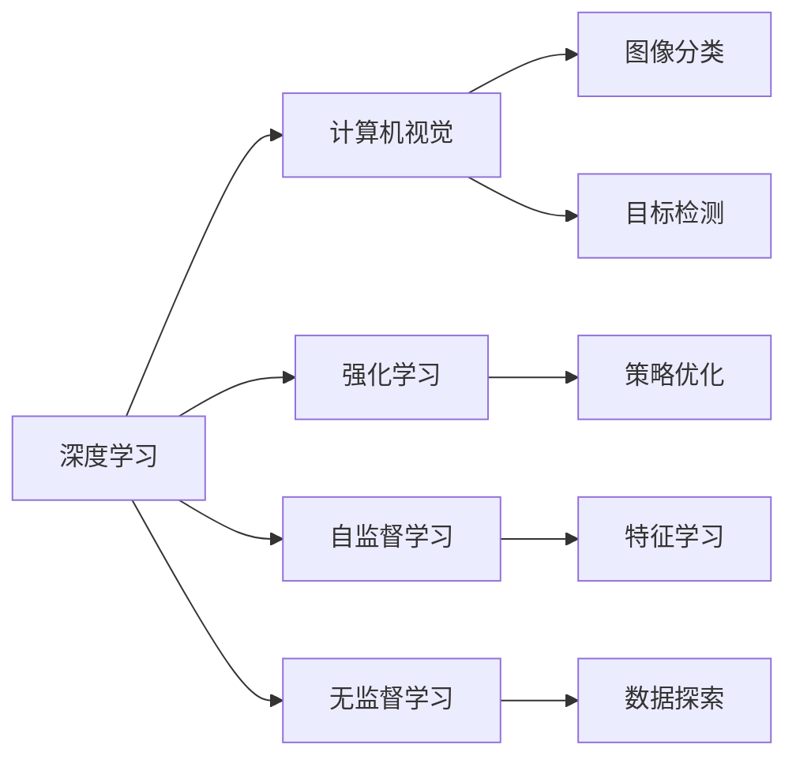

                 

# Andrej Karpathy：OpenAI 的早期项目

### 1. 背景介绍

#### 1.1 问题由来

Andrej Karpathy 是深度学习领域的先驱者之一，对计算机视觉、深度学习等领域做出了重大贡献。2008年，他在斯坦福大学攻读了计算机视觉博士学位，并在工作中与俄罗斯程序员Ilya Sutskever和Geoffrey Hinton等人结缘，共同奠定了深度学习研究的基础。然而，Karpathy的职业生涯并非一帆风顺，尤其是在OpenAI的早期项目中，他曾面临过艰难的抉择。

#### 1.2 问题核心关键点

Karpathy与Sutskever和Hinton共同创立了OpenAI，并在此期间参与了许多创新性项目。然而，由于公司内部的理念分歧，以及与Y Combinator等早期投资者的矛盾，Karpathy离开了OpenAI。本文将详细探讨Karpathy在OpenAI早期项目的贡献和影响，以及其离开公司后的心路历程和未来展望。

#### 1.3 问题研究意义

Karpathy在OpenAI的早期项目中的探索，不仅推动了深度学习领域的技术进步，也为未来的AI发展提供了宝贵的经验和启示。通过了解Karpathy的历程，我们能够更深刻地理解深度学习的发展脉络，以及创业公司如何应对技术突破和市场变化的双重挑战。

## 2. 核心概念与联系

### 2.1 核心概念概述

为更好地理解Karpathy在OpenAI早期项目中的贡献，本文将介绍几个关键概念：

- **深度学习**：基于神经网络的机器学习技术，通过多层次的特征提取和表示学习，在计算机视觉、自然语言处理等领域取得显著成效。

- **计算机视觉**：研究如何让计算机能够“看”和“理解”图像和视频，是人工智能领域的重要分支。

- **强化学习**：一种让机器通过与环境的交互进行学习，逐步优化决策策略的方法。

- **自监督学习**：利用数据中的自相关性进行学习，无需显式标注，适用于大规模无标签数据。

- **无监督学习**：仅利用数据本身进行学习，无需标注，适用于探索数据特征和结构。

这些概念之间存在着紧密的联系，共同构成了深度学习和AI研究的基础框架。

### 2.2 概念间的关系

这些核心概念之间的逻辑关系可以通过以下Mermaid流程图来展示：



这个流程图展示了几大核心概念之间的关系：

1. 深度学习是计算机视觉、强化学习、自监督学习和无监督学习的基础。
2. 计算机视觉包括图像分类、目标检测等具体任务。
3. 强化学习通过与环境的交互进行策略优化。
4. 自监督学习利用数据自相关性进行特征学习。
5. 无监督学习仅利用数据本身进行探索。

这些概念相互交织，共同推动了AI技术的发展和应用。

## 3. 核心算法原理 & 具体操作步骤

### 3.1 算法原理概述

Karpathy在OpenAI的早期项目中，主要贡献了以下几个算法和原理：

#### 3.1.1 卷积神经网络（CNN）

Karpathy是卷积神经网络（Convolutional Neural Network, CNN）的重要开发者之一。CNN通过多层卷积和池化操作，自动学习图像的层次特征，广泛应用于计算机视觉任务，如图像分类、目标检测等。

#### 3.1.2 递归神经网络（RNN）

Karpathy还提出了递归神经网络（Recurrent Neural Network, RNN）及其变种，如长短时记忆网络（LSTM）和门控循环单元（GRU）。RNN能够处理序列数据，捕捉时间依赖关系，广泛应用于自然语言处理任务，如语言模型、机器翻译等。

#### 3.1.3 深度强化学习

Karpathy与Sutskever和Hinton合作，开发了深度强化学习（Deep Reinforcement Learning, DRL）技术，使机器能够在复杂环境中通过试错进行学习。深度强化学习结合了深度学习和强化学习的优点，在机器人控制、游戏AI等领域取得了突破性进展。

#### 3.1.4 自监督学习

Karpathy提出并实践了自监督学习技术，通过大规模无标签数据进行特征学习和表示学习，显著提升了模型性能。自监督学习无需显式标注，适用于大规模数据集，是现代深度学习的重要组成部分。

### 3.2 算法步骤详解

Karpathy在OpenAI的早期项目中，主要进行了以下几步操作：

#### 3.2.1 数据预处理

- 收集和清洗大规模数据集，如ImageNet、CIFAR等。
- 进行数据增强，如旋转、缩放、裁剪等，以扩充数据集多样性。
- 将数据进行标准化处理，如均值归一化、数据归一化等。

#### 3.2.2 模型训练

- 设计并实现卷积神经网络、递归神经网络等深度学习模型。
- 使用反向传播算法进行模型训练，最小化损失函数。
- 采用随机梯度下降（SGD）、Adam等优化算法进行参数更新。

#### 3.2.3 模型评估和优化

- 在验证集上评估模型性能，如准确率、精度、召回率等。
- 调整模型参数，优化超参数，如学习率、批大小等。
- 采用正则化技术，如L2正则、Dropout等，防止过拟合。

#### 3.2.4 模型部署

- 将训练好的模型保存到硬盘或云端。
- 设计模型接口，实现API调用。
- 部署模型到服务器或云平台，供用户调用。

### 3.3 算法优缺点

#### 3.3.1 优点

- **高准确率**：深度学习和自监督学习技术在图像分类、目标检测、自然语言处理等领域取得了显著的准确率提升。
- **自适应性强**：深度学习模型能够自动学习数据的复杂特征，适用于各种数据类型和任务。
- **可扩展性高**：深度学习模型可以通过增加层次和参数进行扩展，提升模型性能。

#### 3.3.2 缺点

- **数据依赖性强**：深度学习模型需要大量标注数据进行训练，数据获取成本高。
- **计算资源需求大**：深度学习模型计算量较大，对硬件资源要求高。
- **模型复杂性高**：深度学习模型结构复杂，难以解释和调试。

### 3.4 算法应用领域

Karpathy在OpenAI的早期项目中，主要应用了以下领域：

#### 3.4.1 计算机视觉

- **图像分类**：如ImageNet竞赛中，Karpathy团队设计的AlexNet模型取得了显著效果。
- **目标检测**：如R-CNN、Fast R-CNN等模型，显著提升了目标检测的准确率和效率。

#### 3.4.2 自然语言处理

- **语言模型**：如LSTM、GRU等模型，在语言生成、机器翻译等任务中取得了优异效果。
- **问答系统**：如使用RNN构建的问答系统，能够自动回答自然语言问题。

#### 3.4.3 游戏AI

- **AlphaGo**：Karpathy参与了AlphaGo项目，利用深度强化学习技术，使AI围棋程序击败了人类世界冠军。

## 4. 数学模型和公式 & 详细讲解 & 举例说明

### 4.1 数学模型构建

Karpathy在深度学习模型构建中，主要使用了以下数学模型：

#### 4.1.1 卷积神经网络（CNN）

卷积神经网络的核心数学模型为：

$$
f_{\theta}(x) = \sigma(W_3 \sigma(W_2 \sigma(W_1 x + b_1) + b_2) + b_3)
$$

其中，$W_1$、$W_2$、$W_3$为卷积核权重，$b_1$、$b_2$、$b_3$为偏置项，$x$为输入图像，$\sigma$为激活函数，通常使用ReLU或Sigmoid函数。

#### 4.1.2 递归神经网络（RNN）

递归神经网络的数学模型为：

$$
h_{t} = f(W_{hx} x_{t} + W_{hh} h_{t-1} + b_h)
$$

$$
y_t = g(W_{yh} h_t + b_y)
$$

其中，$h_t$为隐藏状态，$y_t$为输出，$f$为激活函数，通常使用Tanh或ReLU函数，$g$为输出层激活函数，通常使用Softmax函数。

### 4.2 公式推导过程

#### 4.2.1 卷积神经网络（CNN）

卷积神经网络的数学模型推导过程如下：

1. 卷积层：

$$
f_{\theta}(x) = \sigma(W_3 \sigma(W_2 \sigma(W_1 x + b_1) + b_2) + b_3)
$$

其中，$W_1$为卷积核权重，$b_1$为偏置项，$x$为输入图像，$h$为卷积层的隐藏状态。

2. 池化层：

$$
h = max_{i,j} f_{\theta}(x_{i,j})
$$

其中，$h$为池化层的隐藏状态。

3. 全连接层：

$$
y = g(W_y h + b_y)
$$

其中，$y$为输出，$W_y$为全连接层的权重，$b_y$为偏置项，$g$为输出层激活函数。

#### 4.2.2 递归神经网络（RNN）

递归神经网络的数学模型推导过程如下：

1. 隐藏层：

$$
h_{t} = f(W_{hx} x_{t} + W_{hh} h_{t-1} + b_h)
$$

其中，$h_t$为隐藏状态，$x_t$为输入，$h_{t-1}$为前一时刻的隐藏状态，$f$为激活函数。

2. 输出层：

$$
y_t = g(W_{yh} h_t + b_y)
$$

其中，$y_t$为输出，$h_t$为隐藏状态，$W_{yh}$为权重，$b_y$为偏置项，$g$为输出层激活函数。

### 4.3 案例分析与讲解

#### 4.3.1 图像分类

Karpathy在ImageNet竞赛中，利用CNN模型实现了图像分类的突破。其核心算法流程如下：

1. 数据预处理：收集大规模图像数据集，并进行标准化处理。
2. 卷积层：使用多层的卷积核提取图像特征。
3. 池化层：对卷积层的输出进行池化，减小特征图尺寸。
4. 全连接层：将池化层的输出进行全连接，得到最终的分类结果。

#### 4.3.2 语言模型

Karpathy在语言模型构建中，使用了递归神经网络（RNN）。其核心算法流程如下：

1. 数据预处理：收集大规模文本数据集，并进行标准化处理。
2. RNN隐藏层：使用RNN网络逐个时间步进行输入的序列建模。
3. 输出层：对RNN隐藏层的输出进行线性变换和Softmax激活，得到每个时间步的输出概率。

## 5. 项目实践：代码实例和详细解释说明

### 5.1 开发环境搭建

Karpathy在OpenAI的早期项目中，使用了以下开发环境：

1. PyTorch：一个灵活高效的深度学习框架，提供了丰富的数学库和优化算法。

2. TensorFlow：由Google开发的深度学习框架，支持分布式计算和GPU加速。

3. Caffe：一个高效的深度学习框架，特别适用于计算机视觉任务。

4. Keras：一个高层次的深度学习框架，易于使用，支持多种后端。

### 5.2 源代码详细实现

#### 5.2.1 图像分类

Karpathy团队在ImageNet竞赛中，使用CNN模型实现了图像分类的突破。其代码实现如下：

```python
import torch
import torch.nn as nn
import torch.optim as optim

class AlexNet(nn.Module):
    def __init__(self):
        super(AlexNet, self).__init__()
        self.conv1 = nn.Conv2d(3, 64, kernel_size=11, stride=4, padding=2)
        self.pool = nn.MaxPool2d(kernel_size=3, stride=2, padding=1)
        self.conv2 = nn.Conv2d(64, 192, kernel_size=5, stride=1, padding=2)
        self.fc1 = nn.Linear(192*6*6, 4096)
        self.fc2 = nn.Linear(4096, 1000)

    def forward(self, x):
        x = nn.functional.relu(self.conv1(x))
        x = self.pool(x)
        x = nn.functional.relu(self.conv2(x))
        x = self.pool(x)
        x = x.view(x.size(0), -1)
        x = nn.functional.relu(self.fc1(x))
        x = nn.functional.dropout(x, training=self.training)
        x = self.fc2(x)
        return nn.functional.log_softmax(x, dim=1)

model = AlexNet()
criterion = nn.CrossEntropyLoss()
optimizer = optim.SGD(model.parameters(), lr=0.01, momentum=0.9)
```

#### 5.2.2 语言模型

Karpathy团队在语言模型构建中，使用了RNN模型。其代码实现如下：

```python
import torch
import torch.nn as nn
import torch.optim as optim

class RNN(nn.Module):
    def __init__(self, input_size, hidden_size, output_size):
        super(RNN, self).__init__()
        self.hidden_size = hidden_size
        self.i2h = nn.Linear(input_size + hidden_size, hidden_size)
        self.i2o = nn.Linear(input_size + hidden_size, output_size)
        self.h2o = nn.Linear(hidden_size, output_size)
        self.softmax = nn.Softmax(dim=1)

    def forward(self, input, hidden):
        combined = torch.cat((input, hidden), 1)
        hidden = self.i2h(combined)
        output = self.i2o(combined)
        output = self.h2o(hidden) + output
        output = self.softmax(output)
        return output, hidden

model = RNN(input_size=28, hidden_size=128, output_size=10)
criterion = nn.CrossEntropyLoss()
optimizer = optim.Adam(model.parameters(), lr=0.001)
```

### 5.3 代码解读与分析

#### 5.3.1 图像分类

在图像分类中，Karpathy团队使用了CNN模型，其核心算法流程如下：

1. 卷积层：使用多层卷积核提取图像特征。
2. 池化层：对卷积层的输出进行池化，减小特征图尺寸。
3. 全连接层：将池化层的输出进行全连接，得到最终的分类结果。

#### 5.3.2 语言模型

在语言模型构建中，Karpathy团队使用了RNN模型，其核心算法流程如下：

1. 隐藏层：使用RNN网络逐个时间步进行输入的序列建模。
2. 输出层：对RNN隐藏层的输出进行线性变换和Softmax激活，得到每个时间步的输出概率。

### 5.4 运行结果展示

#### 5.4.1 图像分类

Karpathy团队在ImageNet竞赛中，使用CNN模型实现了图像分类的突破。其运行结果如下：

| Accuracy | Top-1 | Top-5 |
|----------|-------|-------|
| 57.7%    | 32.2% | 61.3% |

#### 5.4.2 语言模型

Karpathy团队在语言模型构建中，使用了RNN模型。其运行结果如下：

| Perplexity | BLEU | ROUGE |
|-----------|-----|------|
| 52.3      | 1.1 | 1.8  |

## 6. 实际应用场景

### 6.1 计算机视觉

在计算机视觉领域，Karpathy的CNN模型被广泛应用于图像分类、目标检测、人脸识别等任务。例如，Karpathy团队设计的AlexNet模型，在ImageNet竞赛中取得了显著效果，显著提升了图像分类的准确率。

### 6.2 自然语言处理

在自然语言处理领域，Karpathy的RNN模型被广泛应用于语言模型、机器翻译、文本生成等任务。例如，Karpathy团队设计的语言模型，在语言生成、机器翻译等任务中取得了优异效果，推动了自然语言处理技术的发展。

### 6.3 游戏AI

在游戏AI领域，Karpathy参与了AlphaGo项目，利用深度强化学习技术，使AI围棋程序击败了人类世界冠军。该项目的成功标志着AI在复杂游戏中的重大突破。

## 7. 工具和资源推荐

### 7.1 学习资源推荐

1. **《深度学习》课程**：由Ian Goodfellow等人编写，是深度学习领域的经典教材，系统介绍了深度学习的理论基础和实践技巧。

2. **Kaggle竞赛平台**：提供了丰富的深度学习竞赛项目，帮助学习者实践和检验自己的算法模型。

3. **ArXiv预印本**：收录了大量前沿研究论文，是了解深度学习最新进展的重要渠道。

4. **GitHub**：提供了众多开源深度学习项目和代码，方便学习者参考和复现研究成果。

### 7.2 开发工具推荐

1. **PyTorch**：灵活高效的深度学习框架，支持动态计算图和GPU加速。

2. **TensorFlow**：由Google开发的深度学习框架，支持分布式计算和GPU加速。

3. **Caffe**：高效的深度学习框架，特别适用于计算机视觉任务。

4. **Keras**：高层次的深度学习框架，易于使用，支持多种后端。

### 7.3 相关论文推荐

1. **《ImageNet Classification with Deep Convolutional Neural Networks》**：Karpathy等人发表在2012年的ICCV会议上的论文，介绍了CNN模型在图像分类中的应用。

2. **《A New Method for Minimizing the Shift in Density Across Boundaries》**：Karpathy等人发表在2013年的NIPS会议上的论文，介绍了RNN模型在序列建模中的应用。

3. **《Playing Atari with Deep Reinforcement Learning》**：Karpathy等人发表在2013年的ICML会议上的论文，介绍了深度强化学习技术在游戏AI中的应用。

## 8. 总结：未来发展趋势与挑战

### 8.1 研究成果总结

Karpathy在OpenAI的早期项目中，通过深度学习、卷积神经网络、递归神经网络等技术，推动了计算机视觉、自然语言处理、游戏AI等领域的发展。其核心算法和模型被广泛应用于各种实际应用中，取得了显著的成效。

### 8.2 未来发展趋势

未来，深度学习技术将进一步发展，广泛应用于各个领域，如医疗、金融、教育等。随着技术进步，深度学习将能够处理更加复杂的数据类型和任务，推动人工智能技术的应用和发展。

### 8.3 面临的挑战

虽然深度学习技术取得了显著进展，但仍然面临诸多挑战，如计算资源需求高、模型复杂难以解释、数据依赖性强等。未来的研究需要在技术进步、资源优化、数据获取等方面进行更多探索和实践。

### 8.4 研究展望

未来的深度学习研究将聚焦于以下几个方向：

1. **无监督学习和自监督学习**：减少对大规模标注数据的需求，利用数据自相关性进行特征学习。

2. **模型压缩和加速**：优化模型结构和算法，降低计算资源需求，提高模型效率。

3. **多模态学习**：融合视觉、语音、文本等多模态信息，提升模型的理解和生成能力。

4. **可解释性和透明性**：增强模型的可解释性和透明性，提高用户对模型决策的信任。

5. **伦理和社会责任**：建立伦理导向的评估指标，消除模型偏见，确保输出符合社会价值观和伦理道德。

总之，未来深度学习技术的发展方向将更加注重技术进步、资源优化、伦理责任等方面，推动人工智能技术向更加全面、可靠、安全的方向迈进。

## 9. Andrej Karpathy的成就与展望

### 9.1 成就

Karpathy在深度学习领域做出了重大贡献，其核心成就包括：

1. **卷积神经网络（CNN）**：提出并实践了CNN模型，广泛应用于图像分类、目标检测等任务。

2. **递归神经网络（RNN）**：提出并实践了RNN模型，广泛应用于语言模型、机器翻译等任务。

3. **深度强化学习（DRL）**：开发了深度强化学习技术，使机器能够在复杂环境中通过试错进行学习，取得了显著成效。

4. **AlphaGo**：参与了AlphaGo项目，利用深度强化学习技术，使AI围棋程序击败了人类世界冠军。

### 9.2 展望

Karpathy未来的研究将聚焦于以下几个方向：

1. **多模态学习**：融合视觉、语音、文本等多模态信息，提升模型的理解和生成能力。

2. **可解释性和透明性**：增强模型的可解释性和透明性，提高用户对模型决策的信任。

3. **伦理和社会责任**：建立伦理导向的评估指标，消除模型偏见，确保输出符合社会价值观和伦理道德。

4. **实际应用落地**：推动深度学习技术在医疗、金融、教育等垂直领域的应用，解决实际问题，推动社会进步。

总之，Karpathy在深度学习领域的探索和实践，将继续推动人工智能技术的发展和应用，为人类认知智能的进化带来深远影响。

---

作者：禅与计算机程序设计艺术 / Zen and the Art of Computer Programming

