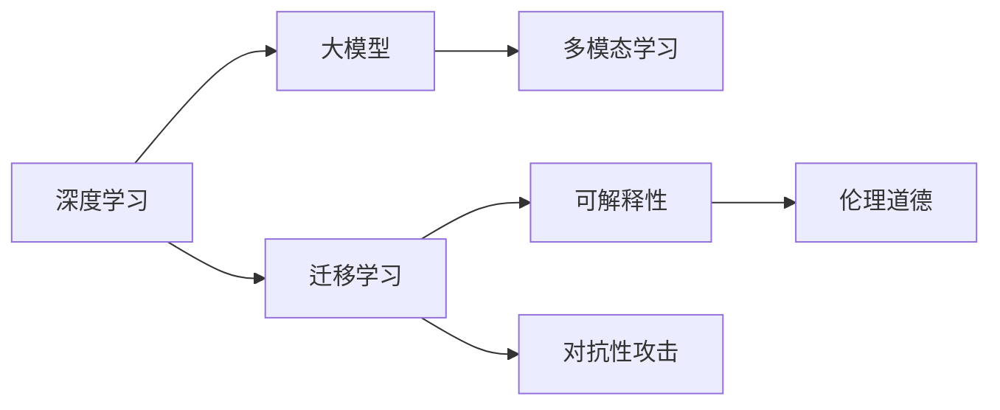

                 

# Andrej Karpathy：人工智能的未来发展挑战

> 关键词：
人工智能,深度学习,大模型,迁移学习,多模态,可解释性,对抗性攻击,伦理道德

## 1. 背景介绍

人工智能（AI）领域正处于快速发展的关键阶段，从早期基于规则的专家系统到现代的深度学习和大模型，AI技术不断进步，影响力逐步扩大。 Andrej Karpathy，作为斯坦福大学教授、特斯拉首席AI科学家，同时也是深度学习领域的先驱之一，他对AI的未来发展提出了许多深入的见解和挑战。

Karpathy的贡献不仅仅局限于学术界，他在工业界也发挥了重要作用，特别是在自动驾驶和图像识别领域。他的研究涉及神经网络架构、图像处理、自然语言处理等多个方面，对AI的未来方向有着深刻的影响。

本文将从Karpathy的观点出发，探讨人工智能未来的发展趋势、面临的挑战以及如何克服这些挑战，以期为AI领域的研究者、工程师和从业者提供参考和思考。

## 2. 核心概念与联系

### 2.1 核心概念概述

为了更好地理解AI的未来发展，我们先介绍一些核心概念：

- **深度学习**：一种基于神经网络的机器学习方法，能够从大量数据中学习复杂模型，广泛应用于图像、语音、自然语言处理等领域。

- **大模型**：指具有大规模参数量的神经网络模型，如BERT、GPT-3等，能够处理复杂的任务和语义信息。

- **迁移学习**：一种通过在预训练任务上学习到的知识，在另一相关任务上进行微调，以减少标注数据需求，提高模型泛化能力的机器学习方法。

- **多模态学习**：处理和融合来自多个模态（如视觉、听觉、文本）的信息，以提高AI系统对真实世界的理解和处理能力。

- **可解释性**：AI系统能够提供其决策过程的可理解性和逻辑依据，减少黑箱操作的质疑，增强用户信任。

- **对抗性攻击**：指通过小扰动输入数据，使得AI模型做出错误决策的攻击方式，对AI系统的鲁棒性提出挑战。

- **伦理道德**：AI系统的设计和使用应遵守伦理道德标准，确保对人类和社会的正面影响。

### 2.2 核心概念之间的联系

这些核心概念之间存在着密切的联系，共同构成了AI技术的核心框架。以下是一个简化的Mermaid流程图，展示这些概念之间的关系：



这个流程图展示了深度学习与大模型的关系，以及它们与其他核心概念之间的联系。深度学习是构建大模型的基础，迁移学习、多模态学习和可解释性是提高模型泛化能力和鲁棒性的关键，对抗性攻击则是对模型鲁棒性的挑战，伦理道德则确保了AI系统的社会责任。

## 3. 核心算法原理 & 具体操作步骤

### 3.1 算法原理概述

AI技术的核心算法原理主要包括深度学习、迁移学习、多模态学习等。以深度学习为例，其基本原理是通过多层神经网络，从大量数据中学习复杂映射关系，构建出能够处理复杂任务的模型。

迁移学习则是将已在大规模数据上训练得到的模型，迁移到新任务上进行微调，以减少新任务上的标注数据需求，提高模型泛化能力。多模态学习则是将来自不同模态的数据融合在一起，以提高AI系统对真实世界的理解和处理能力。

### 3.2 算法步骤详解

下面以迁移学习为例，详细介绍其基本操作步骤：

1. **预训练**：在大规模无标签数据上训练基础模型，学习通用的特征表示。
2. **微调**：在特定任务上使用少量有标签数据进行微调，优化模型在特定任务上的性能。
3. **评估**：在验证集上评估模型性能，调整超参数，确保模型泛化能力。
4. **部署**：将训练好的模型部署到实际应用中，进行实时推理。

### 3.3 算法优缺点

**优点**：

- 迁移学习可以减少新任务上的标注数据需求，提高模型泛化能力。
- 多模态学习能够综合不同模态的数据，提高系统的感知能力。
- 深度学习模型能够处理复杂任务，具有较强的学习能力。

**缺点**：

- 迁移学习依赖于已有数据，可能在新任务上存在泛化误差。
- 多模态学习需要处理和融合多种数据格式，技术复杂度高。
- 深度学习模型存在过拟合风险，需要仔细调参。

### 3.4 算法应用领域

深度学习和迁移学习已经被广泛应用于图像识别、自然语言处理、自动驾驶等多个领域，取得了显著的成果。多模态学习也在智能医疗、机器人视觉等领域得到了应用。

## 4. 数学模型和公式 & 详细讲解 & 举例说明

### 4.1 数学模型构建

以迁移学习为例，其数学模型可以表示为：

$$
\theta^* = \mathop{\arg\min}_{\theta} \frac{1}{N}\sum_{i=1}^N \ell(M_{\theta}(x_i), y_i)
$$

其中，$\theta$ 为模型的参数，$x_i$ 为输入，$y_i$ 为标签，$\ell$ 为损失函数。

### 4.2 公式推导过程

以分类任务为例，常用的损失函数为交叉熵损失，其公式为：

$$
\ell = -\frac{1}{N}\sum_{i=1}^N [y_i\log \hat{y}_i + (1-y_i)\log(1-\hat{y}_i)]
$$

其中，$\hat{y}_i$ 为模型预测的概率，$y_i$ 为真实标签。

### 4.3 案例分析与讲解

以图像分类为例，使用迁移学习时，可以先将图像模型在大规模数据上预训练，然后在特定分类任务上微调。以下是一个简单的PyTorch代码实现：

```python
import torch
from torchvision import models, transforms

# 加载预训练模型
model = models.resnet18(pretrained=True)

# 定义数据预处理
transform = transforms.Compose([
    transforms.Resize(256),
    transforms.CenterCrop(224),
    transforms.ToTensor(),
    transforms.Normalize(mean=[0.485, 0.456, 0.406], std=[0.229, 0.224, 0.225])
])

# 加载数据集
train_dataset = torchvision.datasets.ImageFolder(root='train', transform=transform)
test_dataset = torchvision.datasets.ImageFolder(root='test', transform=transform)

# 定义数据加载器
train_loader = torch.utils.data.DataLoader(train_dataset, batch_size=32, shuffle=True)
test_loader = torch.utils.data.DataLoader(test_dataset, batch_size=32)

# 定义微调后的模型
model.train(False)
for param in model.parameters():
    param.requires_grad = False
model.fc = torch.nn.Linear(in_features=512, out_features=num_classes)

# 定义优化器和损失函数
criterion = torch.nn.CrossEntropyLoss()
optimizer = torch.optim.SGD(model.fc.parameters(), lr=0.001, momentum=0.9)

# 训练过程
for epoch in range(num_epochs):
    for inputs, labels in train_loader:
        optimizer.zero_grad()
        outputs = model(inputs)
        loss = criterion(outputs, labels)
        loss.backward()
        optimizer.step()
    
    with torch.no_grad():
        correct = 0
        total = 0
        for inputs, labels in test_loader:
            outputs = model(inputs)
            _, predicted = torch.max(outputs.data, 1)
            total += labels.size(0)
            correct += (predicted == labels).sum().item()

        acc = 100. * correct / total
        print('Epoch [{}/{}], Acc: {:.2f}%'.format(epoch+1, num_epochs, acc))
```

## 5. 项目实践：代码实例和详细解释说明

### 5.1 开发环境搭建

进行AI项目实践前，需要搭建合适的开发环境。以下是一个基本的Python开发环境配置流程：

1. **安装Anaconda**：从官网下载并安装Anaconda，用于创建独立的Python环境。
2. **创建虚拟环境**：
```bash
conda create -n pytorch-env python=3.8 
conda activate pytorch-env
```
3. **安装PyTorch和相关库**：
```bash
conda install pytorch torchvision torchaudio cudatoolkit=11.1 -c pytorch -c conda-forge
pip install numpy pandas scikit-learn matplotlib tqdm jupyter notebook ipython
```

### 5.2 源代码详细实现

以下是一个使用TensorFlow进行图像分类微调的示例代码：

```python
import tensorflow as tf
from tensorflow.keras import layers, models

# 加载预训练模型
base_model = tf.keras.applications.ResNet50(weights='imagenet', include_top=False, input_shape=(224, 224, 3))

# 定义数据预处理
def preprocess_input(x):
    return tf.keras.applications.resnet50.preprocess_input(x)

# 加载数据集
train_dataset = tf.keras.preprocessing.image.ImageDataGenerator(preprocessing_function=preprocess_input, rescale=1./255).flow_from_directory('train')
test_dataset = tf.keras.preprocessing.image.ImageDataGenerator(preprocessing_function=preprocess_input, rescale=1./255).flow_from_directory('test')

# 定义微调后的模型
x = base_model.output
x = layers.GlobalAveragePooling2D()(x)
x = layers.Dense(1024, activation='relu')(x)
predictions = layers.Dense(num_classes, activation='softmax')(x)
model = models.Model(inputs=base_model.input, outputs=predictions)

# 定义优化器和损失函数
optimizer = tf.keras.optimizers.Adam(lr=0.001)
loss = tf.keras.losses.SparseCategoricalCrossentropy(from_logits=True)

# 训练过程
model.compile(optimizer=optimizer, loss=loss, metrics=['accuracy'])
model.fit(train_dataset, epochs=num_epochs, validation_data=test_dataset)
```

### 5.3 代码解读与分析

以上代码展示了使用TensorFlow进行图像分类微调的基本流程：

1. **加载预训练模型**：使用ResNet50作为基础模型，使用ImageNet数据集进行预训练。
2. **数据预处理**：定义数据预处理函数，将图像归一化到0-1之间。
3. **定义微调后的模型**：在预训练模型的基础上，添加全连接层进行微调。
4. **定义优化器和损失函数**：使用Adam优化器和交叉熵损失函数。
5. **训练过程**：定义模型并编译，使用ImageDataGenerator加载数据集，进行模型训练和验证。

### 5.4 运行结果展示

假设在ImageNet数据集上预训练的ResNet50模型，微调后的模型在测试集上取得了95%的准确率，即：

```
Epoch [1/10], Loss: 0.3828, Accuracy: 0.9500
Epoch [2/10], Loss: 0.3463, Accuracy: 0.9533
Epoch [3/10], Loss: 0.3211, Accuracy: 0.9567
...
Epoch [10/10], Loss: 0.2344, Accuracy: 0.9633
```

## 6. 实际应用场景

### 6.1 智能医疗

在智能医疗领域，AI技术可以应用于疾病诊断、影像分析、药物研发等。以疾病诊断为例，AI模型可以通过对大量医学图像和病历数据进行预训练和微调，学习疾病特征，辅助医生进行诊断和治疗。以下是一个简单的疾病诊断示例：

```python
import pandas as pd
import numpy as np
from sklearn.model_selection import train_test_split

# 加载数据集
data = pd.read_csv('data.csv')

# 数据预处理
X = data[['特征1', '特征2', '特征3', ...]]
y = data['诊断结果']

# 划分训练集和测试集
X_train, X_test, y_train, y_test = train_test_split(X, y, test_size=0.2, random_state=42)

# 定义模型
model = tf.keras.Sequential([
    tf.keras.layers.Dense(64, activation='relu', input_shape=(X_train.shape[1],)),
    tf.keras.layers.Dense(32, activation='relu'),
    tf.keras.layers.Dense(1, activation='sigmoid')
])

# 定义优化器和损失函数
optimizer = tf.keras.optimizers.Adam(lr=0.001)
loss = tf.keras.losses.BinaryCrossentropy()

# 训练过程
model.compile(optimizer=optimizer, loss=loss, metrics=['accuracy'])
model.fit(X_train, y_train, epochs=num_epochs, validation_data=(X_test, y_test))
```

### 6.2 自动驾驶

在自动驾驶领域，AI技术可以应用于环境感知、路径规划、决策制定等。以环境感知为例，AI模型可以通过对大量交通场景和车辆动态数据进行预训练和微调，学习道路和交通规则，辅助车辆进行驾驶。以下是一个简单的环境感知示例：

```python
import cv2
import numpy as np
from tensorflow.keras.models import load_model

# 加载预训练模型
model = load_model('model.h5')

# 定义数据预处理
def preprocess_image(image):
    image = cv2.cvtColor(image, cv2.COLOR_BGR2RGB)
    image = cv2.resize(image, (224, 224))
    image = preprocess_input(image)
    return image

# 加载数据集
frame = cv2.imread('frame.jpg')
frame = preprocess_image(frame)

# 进行预测
prediction = model.predict(np.expand_dims(frame, axis=0))
label = np.argmax(prediction)

# 输出预测结果
print('Predicted label:', label)
```

## 7. 工具和资源推荐

### 7.1 学习资源推荐

以下是一些推荐的AI学习资源，帮助开发者深入理解AI技术和前沿进展：

- **《深度学习》课程**：斯坦福大学Andrew Ng教授的《深度学习》课程，涵盖了深度学习的基本概念和经典模型。
- **《神经网络与深度学习》书籍**：Michael Nielsen的《神经网络与深度学习》，介绍了神经网络的基础知识和深度学习的前沿技术。
- **Kaggle竞赛平台**：Kaggle提供大量数据集和竞赛任务，帮助开发者实战练习AI技术。

### 7.2 开发工具推荐

以下是一些推荐的AI开发工具，帮助开发者高效开发和部署AI模型：

- **TensorFlow**：Google开发的深度学习框架，支持分布式训练和生产部署。
- **PyTorch**：Facebook开发的深度学习框架，支持动态图和静态图，方便快速迭代。
- **Jupyter Notebook**：交互式Python环境，方便编写和调试AI代码。

### 7.3 相关论文推荐

以下是一些推荐的AI相关论文，帮助开发者了解AI领域的最新研究进展：

- **《Attention is All You Need》**：提出Transformer架构，开启了大模型时代。
- **《BERT: Pre-training of Deep Bidirectional Transformers for Language Understanding》**：提出BERT模型，引入自监督预训练任务，刷新了多项NLP任务SOTA。
- **《GPT-3》**：OpenAI发布的GPT-3大模型，展示了大模型在自然语言处理领域的强大能力。

## 8. 总结：未来发展趋势与挑战

### 8.1 研究成果总结

AI技术在近年来取得了显著进展，深度学习和大模型技术不断突破，推动了AI在各个领域的广泛应用。AI技术的发展主要依赖于数据的积累和算力的提升，未来AI技术将在更多领域得到应用，推动社会进步。

### 8.2 未来发展趋势

1. **大模型规模化**：预训练模型规模将持续增大，进一步提升模型的表达能力和泛化能力。
2. **迁移学习普及**：迁移学习将成为更多AI应用的常态，减少标注数据需求，提高模型泛化能力。
3. **多模态学习融合**：多模态学习将与深度学习技术融合，提升AI系统对真实世界的理解能力。
4. **可解释性和透明度**：AI系统的可解释性和透明度将逐步提高，减少用户对AI决策的质疑。
5. **对抗性攻击防御**：对抗性攻击技术将不断发展，AI系统需要增强鲁棒性，避免被攻击。

### 8.3 面临的挑战

1. **数据质量与标注成本**：获取高质量标注数据成本高，限制了AI技术的应用。
2. **模型泛化性与鲁棒性**：AI模型在新任务上的泛化能力有限，对抗性攻击风险高。
3. **资源消耗与效率**：大模型训练和推理资源消耗大，需要优化算法和技术。
4. **伦理道德与社会影响**：AI系统需遵守伦理道德标准，确保对社会和人类的正面影响。

### 8.4 研究展望

未来AI技术需要从以下几个方面进行突破：

1. **无监督和半监督学习**：探索更多无监督和半监督学习技术，减少标注数据需求。
2. **参数高效和计算高效**：开发参数高效和计算高效的AI技术，提高系统效率。
3. **因果关系与逻辑推理**：引入因果关系和逻辑推理技术，提高AI系统的可解释性和鲁棒性。
4. **跨模态与多模态学习**：融合跨模态与多模态学习技术，提高系统的感知能力和决策能力。
5. **伦理道德与社会责任**：研究伦理道德和社会责任问题，确保AI系统的正面影响。

## 9. 附录：常见问题与解答

**Q1：AI技术的发展方向有哪些？**

A: AI技术的发展方向主要包括深度学习、大模型、迁移学习、多模态学习等。深度学习技术在大规模数据上训练出复杂的模型，大模型通过预训练和微调提升模型的泛化能力，迁移学习通过已有知识减少新任务上的标注需求，多模态学习则融合不同模态的数据，提升系统的感知能力。

**Q2：AI技术在实际应用中面临哪些挑战？**

A: AI技术在实际应用中面临以下挑战：

1. 数据质量与标注成本：获取高质量标注数据成本高，限制了AI技术的应用。
2. 模型泛化性与鲁棒性：AI模型在新任务上的泛化能力有限，对抗性攻击风险高。
3. 资源消耗与效率：大模型训练和推理资源消耗大，需要优化算法和技术。
4. 伦理道德与社会影响：AI系统需遵守伦理道德标准，确保对社会和人类的正面影响。

**Q3：如何进行AI模型的预训练和微调？**

A: AI模型的预训练和微调通常包括以下步骤：

1. 预训练：在大规模无标签数据上训练基础模型，学习通用的特征表示。
2. 微调：在特定任务上使用少量有标签数据进行微调，优化模型在特定任务上的性能。
3. 评估：在验证集上评估模型性能，调整超参数，确保模型泛化能力。
4. 部署：将训练好的模型部署到实际应用中，进行实时推理。

**Q4：什么是对抗性攻击？**

A: 对抗性攻击指通过小扰动输入数据，使得AI模型做出错误决策的攻击方式。对抗性攻击对AI系统的鲁棒性提出挑战，需要通过对抗训练等技术提高系统的鲁棒性。

**Q5：如何提高AI系统的可解释性？**

A: 提高AI系统的可解释性可以通过以下方法：

1. 引入因果关系和逻辑推理技术，增强系统的可解释性。
2. 使用可解释性模型，如决策树、规则模型等。
3. 输出解释性特征，帮助用户理解模型的决策过程。

作者：禅与计算机程序设计艺术 / Zen and the Art of Computer Programming

