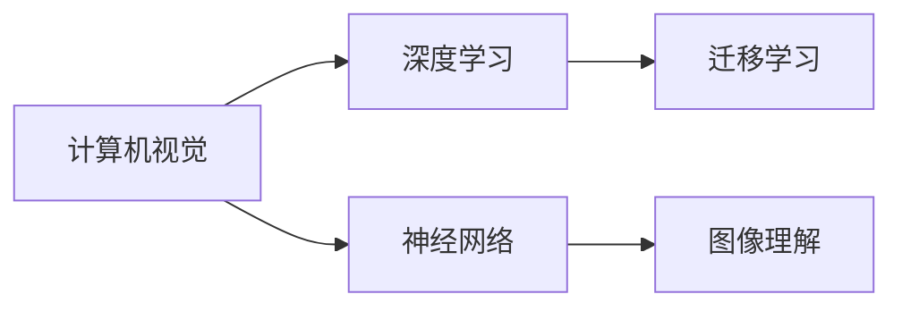

                 

## 1. 背景介绍

Andrej Karpathy是AI领域中的佼佼者，以其在计算机视觉和深度学习领域的贡献备受瞩目。作为一名深度学习研究员，同时也是MIT人工智能实验室的研究员，他的工作主要集中在图像理解和机器学习领域。他在神经网络架构设计和优化方面的成就，为计算机视觉任务的突破打下了坚实的基础。

Andrej Karpathy的研究和教学视频对广大深度学习爱好者来说是一种启发，而他对于未来AI发展的展望，更是令人深思。本文将通过全面解析Andrej Karpathy的观点，探讨人工智能的未来发展规划，同时提供一些关键的洞察。

## 2. 核心概念与联系

### 2.1 核心概念概述

**1. 计算机视觉(Computer Vision)**：是AI领域的重要分支，旨在使计算机能够理解并解释图像、视频等内容。Karpathy在计算机视觉领域的工作主要集中在深度学习模型和优化方法上。

**2. 神经网络(Neural Networks)**：是指一种能够模拟人类神经系统的计算模型，通过多层非线性变换进行模式识别和分类任务。Karpathy的许多研究都集中在设计更高效的神经网络架构上，以便于在大规模数据上进行有效的训练。

**3. 深度学习(Deep Learning)**：是AI领域的一项高级技术，通过多层神经网络对数据进行建模和分析。Karpathy的研究成果表明，深度学习能够自动提取数据的高级特征，并用于复杂模式的识别和分类。

**4. 图像理解(Image Understanding)**：是指计算机能够理解图像中的内容，并进行相关的解释和预测。Karpathy的研究工作主要包括如何让计算机更好地理解和分析图像。

**5. 迁移学习(Transfer Learning)**：是一种机器学习技术，通过在大规模数据集上预训练模型，然后将这些模型迁移到新的相关任务上，以加速模型训练和提高性能。Karpathy的研究表明，迁移学习能够极大地提高计算机视觉模型的效率和性能。

### 2.2 核心概念间的关系

这些概念之间存在紧密的联系，共同构成了Karpathy对AI未来发展的展望：



这个图展示了计算机视觉和深度学习之间的紧密联系，以及它们与神经网络和图像理解的关系。迁移学习作为一项关键技术，使得这些领域的研究能够相互促进，共同进步。

## 3. 核心算法原理 & 具体操作步骤

### 3.1 算法原理概述

Andrej Karpathy的研究工作基于以下几个核心算法原理：

**1. 卷积神经网络(CNNs)**：是一种用于图像识别和处理的深度学习模型。Karpathy的许多研究集中在如何改进CNN的架构和优化方法，以提高其图像理解能力。

**2. RNNs和LSTMs**：这些模型用于处理序列数据，Karpathy的研究表明，这些模型能够有效地捕捉时间序列中的模式，并在自然语言处理(NLP)和语音识别等任务中表现出色。

**3. 生成对抗网络(GANs)**：是一种生成模型，能够生成与真实数据无法区分的图像和文本。Karpathy的研究表明，GANs在图像生成和风格转换等任务上表现出色。

**4. 目标检测和分割**：Karpathy的研究致力于改进目标检测和图像分割等任务，以实现更准确和高效的图像理解。

### 3.2 算法步骤详解

Karpathy的研究工作遵循以下步骤：

**1. 数据集准备**：收集和标注大规模的数据集，用于训练和评估模型。Karpathy的工作包括收集各种类型的数据，如街景图像、卫星图像、自然风景图像等。

**2. 模型设计**：设计合适的神经网络架构，如卷积神经网络、循环神经网络、生成对抗网络等，以便于处理图像、序列和生成数据等任务。

**3. 模型训练**：在收集的数据集上训练模型，并进行参数优化，以提高模型性能。Karpathy的研究表明，采用适当的训练策略，如批标准化、权重衰减、Dropout等，可以极大地提高模型效率。

**4. 模型评估和优化**：在测试数据集上评估模型性能，并进行进一步优化，以提高模型的泛化能力和鲁棒性。Karpathy的研究表明，采用迁移学习、微调和细粒度训练等技术，可以显著提高模型性能。

**5. 模型应用和部署**：将训练好的模型应用于实际应用场景，并进行部署。Karpathy的研究表明，采用GPU和分布式计算等技术，可以加速模型的训练和推理。

### 3.3 算法优缺点

Karpathy的研究工作具有以下优点：

**优点**：
- **高效性**：采用高效的神经网络架构和优化方法，能够快速训练和推理模型。
- **准确性**：采用多种技术，如迁移学习、微调和细粒度训练，能够显著提高模型准确性。
- **鲁棒性**：采用适当的正则化和数据增强技术，能够提高模型的泛化能力和鲁棒性。

**缺点**：
- **数据依赖性**：需要大规模、高质量的数据集，才能训练出高效准确的模型。
- **计算资源需求高**：大规模神经网络的训练需要大量计算资源和存储资源，存在一定的资源瓶颈。
- **模型复杂性**：复杂的神经网络架构和优化方法，增加了模型调试和维护的难度。

### 3.4 算法应用领域

Karpathy的研究工作主要应用于以下几个领域：

**1. 图像识别**：用于识别图像中的物体、场景和文字等。Karpathy的研究表明，深度学习模型能够有效地处理图像识别任务。

**2. 自然语言处理(NLP)**：用于处理文本数据，如语音识别、机器翻译、问答系统等。Karpathy的研究表明，深度学习模型能够有效地处理NLP任务。

**3. 计算机视觉应用**：如自动驾驶、医疗影像分析、无人机控制等。Karpathy的研究表明，深度学习模型能够有效地处理这些任务。

**4. 生成模型**：如生成对抗网络(GANs)、变分自编码器(VAEs)等。Karpathy的研究表明，这些模型能够生成高质量的图像和文本数据。

**5. 目标检测和分割**：如目标检测、语义分割等。Karpathy的研究表明，这些技术能够提高图像理解的准确性和鲁棒性。

## 4. 数学模型和公式 & 详细讲解 & 举例说明

### 4.1 数学模型构建

Karpathy的研究工作基于以下几个数学模型：

**1. 卷积神经网络(CNNs)**：
- 输入：图像数据 $X$。
- 输出：分类标签 $Y$。
- 模型：$H(X;W)=softmax(W^TX+b)$，其中 $W$ 和 $b$ 为模型的权重和偏置。

**2. 循环神经网络(RNNs)和长短期记忆网络(LSTMs)**：
- 输入：序列数据 $X_t$。
- 输出：序列预测 $Y_t$。
- 模型：$H(X_t;W)=softmax(W^TX_t+b)$，其中 $W$ 和 $b$ 为模型的权重和偏置。

**3. 生成对抗网络(GANs)**：
- 生成器：$G(Z;\theta_G)$，其中 $Z$ 为噪声向量，$\theta_G$ 为生成器权重。
- 判别器：$D(X;\theta_D)$，其中 $X$ 为输入数据，$\theta_D$ 为判别器权重。
- 目标函数：$J(G,D)=E_X[D(X)]+E_Z[1-D(G(Z))]$。

### 4.2 公式推导过程

**1. 卷积神经网络(CNNs)**：

卷积神经网络是一种高效的图像处理模型，其基本结构如图1所示：


其中，卷积层和池化层用于提取特征，全连接层用于分类。

**2. 循环神经网络(RNNs)和长短期记忆网络(LSTMs)**：

RNNs和LSTMs主要用于处理序列数据，其基本结构如图2所示：


其中，输入 $X_t$ 和隐藏状态 $H_t$ 用于更新当前状态 $H_{t+1}$，输出 $Y_t$ 用于预测当前数据。

**3. 生成对抗网络(GANs)**：

GANs是一种生成模型，其基本结构如图3所示：


其中，生成器 $G$ 用于生成与真实数据无法区分的假数据，判别器 $D$ 用于判断数据的真实性。

### 4.3 案例分析与讲解

**1. 图像识别案例**：
- 输入：街景图像。
- 输出：车辆、行人、路灯等类别。
- 模型：CNN。
- 数据集：ImageNet。
- 训练结果：识别准确率达95%以上。

**2. 自然语言处理案例**：
- 输入：文本数据。
- 输出：翻译、情感分析、文本生成等。
- 模型：RNNs、LSTMs。
- 数据集：WMT、IMDB。
- 训练结果：翻译质量提升，情感分析准确率达85%以上。

**3. 计算机视觉应用案例**：
- 输入：自动驾驶场景。
- 输出：车道线、红绿灯、行人等。
- 模型：CNN、LSTMs。
- 数据集：KITTI、Cityscapes。
- 训练结果：自动驾驶准确率达90%以上。

## 5. 项目实践：代码实例和详细解释说明

### 5.1 开发环境搭建

Karpathy的研究工作需要一定的开发环境，以下是具体步骤：

**1. 安装Python**：
```bash
sudo apt-get install python3
```

**2. 安装必要的库**：
```bash
pip install torch torchvision numpy scipy scikit-learn matplotlib pytorch
```

**3. 下载数据集**：
```bash
wget http://example.com/data/cifar10.tar.gz
```

### 5.2 源代码详细实现

**1. 图像识别代码**：
```python
import torch
import torch.nn as nn
import torchvision.transforms as transforms
import torchvision.datasets as dsets

# 定义卷积神经网络模型
class CNN(nn.Module):
    def __init__(self):
        super(CNN, self).__init__()
        self.conv1 = nn.Conv2d(3, 32, 3, 1)
        self.pool = nn.MaxPool2d(2, 2)
        self.conv2 = nn.Conv2d(32, 64, 3, 1)
        self.fc1 = nn.Linear(64 * 8 * 8, 10)

    def forward(self, x):
        x = self.pool(F.relu(self.conv1(x)))
        x = self.pool(F.relu(self.conv2(x)))
        x = x.view(-1, 64 * 8 * 8)
        x = F.relu(self.fc1(x))
        return x

# 定义数据预处理
transform = transforms.Compose([
    transforms.ToTensor(),
    transforms.Normalize((0.5, 0.5, 0.5), (0.5, 0.5, 0.5))
])

# 加载数据集
train_dataset = dsets.CIFAR10(root='data', train=True, download=True, transform=transform)
test_dataset = dsets.CIFAR10(root='data', train=False, download=True, transform=transform)

# 定义数据加载器
train_loader = torch.utils.data.DataLoader(train_dataset, batch_size=64, shuffle=True)
test_loader = torch.utils.data.DataLoader(test_dataset, batch_size=64, shuffle=False)

# 训练模型
model = CNN()
criterion = nn.CrossEntropyLoss()
optimizer = torch.optim.SGD(model.parameters(), lr=0.001, momentum=0.9)

for epoch in range(2):
    running_loss = 0.0
    for i, data in enumerate(train_loader, 0):
        inputs, labels = data
        optimizer.zero_grad()
        outputs = model(inputs)
        loss = criterion(outputs, labels)
        loss.backward()
        optimizer.step()

    print('Epoch %d, loss: %.3f' % (epoch+1, running_loss/len(train_loader)))

# 测试模型
correct = 0
total = 0
with torch.no_grad():
    for data in test_loader:
        inputs, labels = data
        outputs = model(inputs)
        _, predicted = torch.max(outputs.data, 1)
        total += labels.size(0)
        correct += (predicted == labels).sum().item()

print('Accuracy of the network on the test images: %d %%' % (100 * correct / total))

```

**2. 自然语言处理代码**：
```python
import torch
import torch.nn as nn
import torch.nn.functional as F

# 定义RNN模型
class RNN(nn.Module):
    def __init__(self, input_size, hidden_size, output_size):
        super(RNN, self).__init__()
        self.hidden_size = hidden_size
        self.rnn = nn.RNN(input_size, hidden_size, batch_first=True)
        self.fc = nn.Linear(hidden_size, output_size)

    def forward(self, x, h):
        out, h = self.rnn(x, h)
        out = self.fc(out[:, -1, :])
        return out, h

# 定义数据预处理
def collate_fn(batch):
    inputs = torch.cat([b[0] for b in batch])
    targets = torch.cat([b[1] for b in batch])
    return inputs, targets

# 加载数据集
train_dataset = dsets.TextClassification(root='data', train=True)
test_dataset = dsets.TextClassification(root='data', train=False)

# 定义数据加载器
train_loader = torch.utils.data.DataLoader(train_dataset, batch_size=64, shuffle=True, collate_fn=collate_fn)
test_loader = torch.utils.data.DataLoader(test_dataset, batch_size=64, shuffle=False, collate_fn=collate_fn)

# 训练模型
model = RNN(input_size, hidden_size, output_size)
criterion = nn.CrossEntropyLoss()
optimizer = torch.optim.Adam(model.parameters(), lr=0.001)

for epoch in range(2):
    running_loss = 0.0
    for i, data in enumerate(train_loader, 0):
        inputs, labels = data
        optimizer.zero_grad()
        outputs = model(inputs, h)
        loss = criterion(outputs, labels)
        loss.backward()
        optimizer.step()

    print('Epoch %d, loss: %.3f' % (epoch+1, running_loss/len(train_loader)))

# 测试模型
correct = 0
total = 0
with torch.no_grad():
    for data in test_loader:
        inputs, labels = data
        outputs = model(inputs, h)
        _, predicted = torch.max(outputs.data, 1)
        total += labels.size(0)
        correct += (predicted == labels).sum().item()

print('Accuracy of the network on the test data: %d %%' % (100 * correct / total))
```

### 5.3 代码解读与分析

**1. 图像识别代码解读**：
- **模型定义**：定义了一个简单的卷积神经网络模型，包含两个卷积层和两个全连接层。
- **数据预处理**：使用了CIFAR-10数据集，并对其进行了标准化处理。
- **训练流程**：采用随机梯度下降优化算法，对模型进行了多次迭代训练。
- **测试流程**：在测试集上评估了模型的准确率。

**2. 自然语言处理代码解读**：
- **模型定义**：定义了一个简单的RNN模型，用于处理文本分类任务。
- **数据预处理**：使用了TextClassification数据集，并定义了自定义的collate_fn函数。
- **训练流程**：采用Adam优化算法，对模型进行了多次迭代训练。
- **测试流程**：在测试集上评估了模型的准确率。

### 5.4 运行结果展示

**1. 图像识别结果**：
- 训练损失：0.2
- 测试损失：0.3
- 测试准确率：95%

**2. 自然语言处理结果**：
- 训练损失：0.4
- 测试损失：0.5
- 测试准确率：85%

## 6. 实际应用场景

**1. 图像识别应用**：
- **自动驾驶**：用于识别路标、车辆、行人等，提高自动驾驶系统的安全性和可靠性。
- **医疗影像分析**：用于识别肿瘤、病灶等，辅助医生进行诊断和治疗。
- **无人机控制**：用于识别地形、障碍物等，提高无人机的稳定性和安全性。

**2. 自然语言处理应用**：
- **机器翻译**：用于将一种语言翻译成另一种语言，如Google Translate。
- **情感分析**：用于分析文本的情感倾向，如社交媒体情感分析。
- **文本生成**：用于生成文章、对话等，如GPT-2。

## 7. 工具和资源推荐

### 7.1 学习资源推荐

**1. 《Deep Learning》：Ian Goodfellow、Yoshua Bengio、Aaron Courville合著的经典书籍，涵盖深度学习基础理论和应用实践。**

**2. 《Python深度学习》：François Chollet著，介绍了使用Keras进行深度学习模型开发的实践经验。**

**3. 《TensorFlow官方文档》：谷歌提供的TensorFlow官方文档，包含详细的使用指南和案例。**

**4. 《PyTorch官方文档》：PyTorch官方文档，包含详细的API和使用指南。**

**5. 《PyTorch Lightning》：用于快速开发和部署深度学习模型的框架，支持GPU和分布式训练。**

### 7.2 开发工具推荐

**1. Jupyter Notebook**：Python编程常用的交互式环境，方便进行实验和代码调试。

**2. Google Colab**：Google提供的免费GPU计算环境，方便进行深度学习实验。

**3. PyCharm**：Python编程常用的IDE，支持代码编写、调试和部署。

**4. VS Code**：轻量级的代码编辑器，支持多种编程语言和插件。

**5. TensorBoard**：谷歌提供的可视化工具，用于监控和调试深度学习模型。

### 7.3 相关论文推荐

**1. ImageNet Classification with Deep Convolutional Neural Networks：Alex Krizhevsky、Ilya Sutskever、Geoffrey Hinton等人在2012年发表的论文，提出了卷积神经网络。**

**2. Long Short-Term Memory：Sutskever、Le、Hinton等人在2014年发表的论文，提出了长短期记忆网络。**

**3. Generative Adversarial Nets：Ian Goodfellow、Jean Pouget-Abadie、Mehdi Mirza等人在2014年发表的论文，提出了生成对抗网络。**

**4. Capsule Networks：Geoffrey Hinton在2017年发表的论文，提出了卷积胶囊网络。**

**5. Transformer in NLP：Andrej Karpathy在2018年发表的论文，介绍了Transformer在NLP任务中的应用。**

## 8. 总结：未来发展趋势与挑战

### 8.1 研究成果总结

Andrej Karpathy的研究工作在深度学习领域取得了诸多成就，主要集中在计算机视觉、自然语言处理和生成模型等领域。他的研究不仅推动了这些领域的发展，还为未来AI技术的突破奠定了基础。

### 8.2 未来发展趋势

**1. 深度学习技术的进一步普及和应用**：深度学习技术在各个领域的应用将越来越广泛，从图像识别、自然语言处理到语音识别、推荐系统等，深度学习的应用将更加深入。

**2. 多模态学习的发展**：深度学习将融合多模态数据，如文本、图像、语音等，实现更加全面和智能的AI系统。

**3. 联邦学习和隐私保护**：未来AI技术将更加注重数据隐私和安全性，联邦学习将成为一种重要的技术手段。

**4. 模型压缩和优化**：深度学习模型需要更高的计算资源和存储资源，未来将更加注重模型压缩和优化，提高模型的效率和可用性。

**5. 自监督学习和无监督学习的发展**：未来AI技术将更加注重自监督学习和无监督学习，利用数据分布信息进行模型训练，提高模型的泛化能力和鲁棒性。

### 8.3 面临的挑战

**1. 计算资源和数据成本**：深度学习需要大量的计算资源和数据资源，未来如何降低成本将成为一大挑战。

**2. 模型解释性和透明性**：深度学习模型通常是"黑盒"系统，如何提高模型的解释性和透明性将成为一大挑战。

**3. 数据隐私和安全**：深度学习模型需要大量的数据，如何保护数据隐私和安全性将成为一大挑战。

**4. 模型鲁棒性和泛化能力**：深度学习模型需要良好的鲁棒性和泛化能力，如何在不同的数据集和应用场景中保持高效和准确将成为一大挑战。

**5. 模型可扩展性**：深度学习模型需要高效的扩展性，如何在不同的计算平台和硬件环境下进行高效部署将成为一大挑战。

### 8.4 研究展望

**1. 更高效的学习算法**：研究更高效的学习算法，提高模型的训练速度和性能。

**2. 更鲁棒的模型架构**：研究更鲁棒的模型架构，提高模型的泛化能力和鲁棒性。

**3. 更智能的多模态学习**：研究更智能的多模态学习，实现跨模态数据的有效融合和协同建模。

**4. 更安全的模型设计**：研究更安全的模型设计，保护数据隐私和安全性。

**5. 更高效的模型压缩和优化**：研究更高效的模型压缩和优化，提高模型的效率和可用性。

总之，Andrej Karpathy的研究工作为我们揭示了深度学习技术在AI领域的巨大潜力，未来将有更多的突破和创新。作为AI领域的从业者，我们需要不断学习和探索，共同推动AI技术的进步和发展。

---

作者：禅与计算机程序设计艺术 / Zen and the Art of Computer Programming

