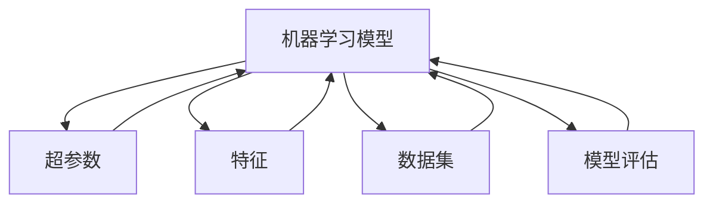
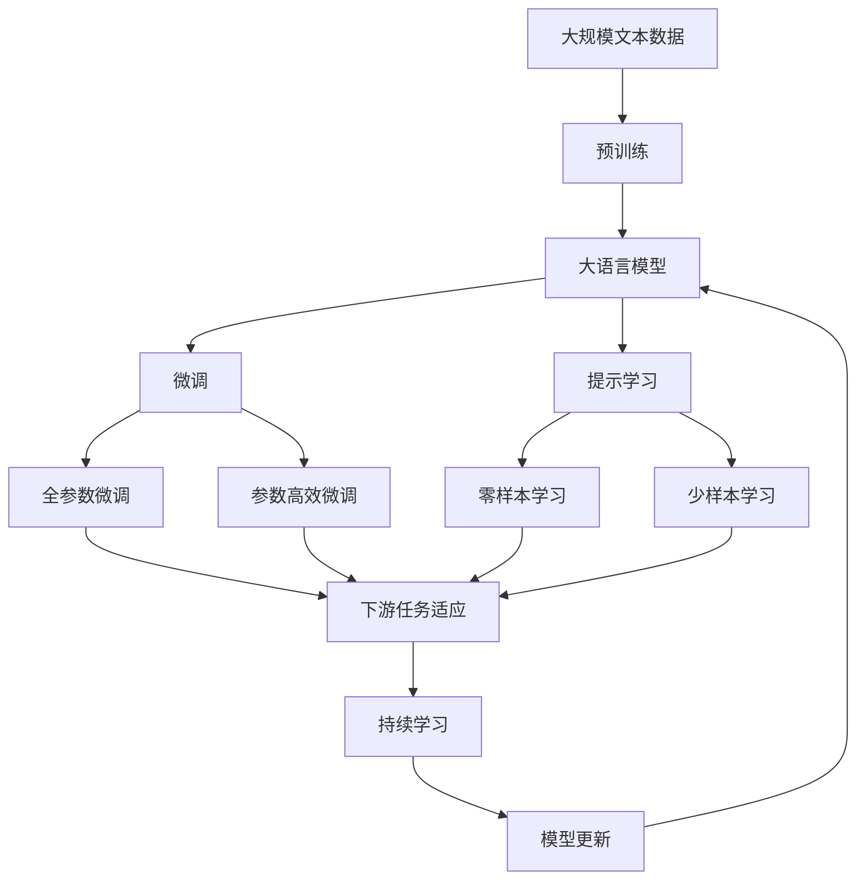

                 

# AutoML原理与代码实例讲解

> 关键词：AutoML,超参数调优,算法自动化,深度学习,模型集成,代码实例,机器学习

## 1. 背景介绍

### 1.1 问题由来
随着人工智能技术的快速发展，深度学习逐渐成为机器学习领域的核心。其中，自动机器学习（AutoML）作为机器学习的子领域，近年来受到了越来越多的关注和应用。AutoML技术通过自动化优化机器学习流程，尤其是超参数调优、模型选择和特征工程等环节，大大降低了机器学习的门槛，加速了AI技术的普及和落地。

在深度学习领域，AutoML技术通常应用于模型架构的选择、超参数优化、特征选择等多个环节，以提升模型的性能和泛化能力。同时，AutoML还适用于处理复杂的非结构化数据，如文本、图像、音频等，帮助开发者更快速、更高效地构建深度学习模型。

### 1.2 问题核心关键点
AutoML的核心在于自动化地寻找最优的机器学习模型和超参数组合。其关键点包括：
- 超参数优化：寻找最合适的模型超参数（如学习率、批量大小等），使得模型在训练集和验证集上表现最佳。
- 模型集成：通过组合多个模型，提升整体性能和鲁棒性。
- 特征工程：自动提取和选择特征，优化模型输入。

### 1.3 问题研究意义
研究AutoML技术对于推动机器学习和深度学习技术的普及具有重要意义：

1. 降低应用门槛：AutoML技术通过自动化处理复杂任务，使得深度学习不再是高门槛技术，更多的人能够参与其中。
2. 提升模型性能：通过自动化寻找最优参数，帮助模型在数据和任务中找到最佳组合，提升模型泛化能力。
3. 加速应用落地：AutoML技术可以大大缩短模型构建和部署时间，加速AI技术在各行各业的应用。
4. 促进创新：AutoML技术为数据科学家和工程师提供了更多的时间和精力进行探索性研究，推动AI技术的创新发展。

## 2. 核心概念与联系

### 2.1 核心概念概述

为更好地理解AutoML技术，本节将介绍几个密切相关的核心概念：

- **机器学习模型（Model）**：通常指一个数学函数或一组参数，用于将输入数据映射到输出。常见的深度学习模型包括卷积神经网络（CNN）、循环神经网络（RNN）、变换器（Transformer）等。
- **超参数（Hyperparameter）**：在模型训练过程中需要手动设定的参数，如学习率、批量大小、正则化系数等。这些参数对模型的性能有重要影响。
- **特征（Feature）**：输入数据中的原始变量，经过预处理和选择后用于训练模型。特征的选择和提取是模型性能的重要因素。
- **数据集（Dataset）**：训练、验证和测试模型所使用的数据集合。数据集的分布和质量对模型训练效果有重要影响。
- **模型评估（Model Evaluation）**：通过各种指标（如准确率、召回率、F1分数等）评估模型性能的过程。

这些概念之间的逻辑关系可以通过以下Mermaid流程图来展示：



这个流程图展示了这个概念体系的核心组成：机器学习模型、超参数、特征、数据集和模型评估。它们共同构成了AutoML技术的应用基础。

### 2.2 概念间的关系

这些核心概念之间存在着紧密的联系，形成了AutoML技术的完整生态系统。下面我通过几个Mermaid流程图来展示这些概念之间的关系。

#### 2.2.1 超参数优化和模型训练


这个流程图展示了超参数优化和模型训练的基本流程：首先设定超参数，然后通过模型训练获得验证集的性能指标，最后根据性能指标调整超参数。

#### 2.2.2 模型选择和集成


这个流程图展示了模型选择和集成的基本流程：首先选择合适的模型，然后通过集成多个模型提升整体性能，最后通过性能指标评估集成模型的效果。

#### 2.2.3 特征工程和模型训练


这个流程图展示了特征工程和模型训练的基本流程：首先进行特征选择和提取，然后通过模型训练获得验证集的性能指标，最后根据性能指标调整特征工程方法。

### 2.3 核心概念的整体架构

最后，我们用一个综合的流程图来展示这些核心概念在大模型微调过程中的整体架构：



这个综合流程图展示了从预训练到微调，再到持续学习的完整过程。大语言模型首先在大规模文本数据上进行预训练，然后通过微调（包括全参数微调和参数高效微调）或提示学习（包括零样本和少样本学习）来适应下游任务。最后，通过持续学习技术，模型可以不断学习新知识，同时避免遗忘旧知识。 通过这些流程图，我们可以更清晰地理解AutoML技术在大模型微调过程中各个核心概念的关系和作用，为后续深入讨论具体的微调方法和技术奠定基础。

## 3. 核心算法原理 & 具体操作步骤
### 3.1 算法原理概述

AutoML技术通过自动化寻找最优的机器学习模型和超参数组合，其核心原理可以归纳为以下几个步骤：

1. **数据预处理**：对原始数据进行清洗、归一化、特征选择等预处理操作，为模型训练准备数据。
2. **模型选择**：从多个候选模型中选择一个或多个进行训练。常见的模型包括CNN、RNN、Transformer等。
3. **超参数优化**：使用优化算法（如网格搜索、随机搜索、贝叶斯优化等）寻找最优的超参数组合。
4. **模型集成**：通过组合多个模型，提升整体性能和鲁棒性。
5. **模型评估**：使用各种评估指标（如准确率、召回率、F1分数等）评估模型性能。
6. **模型优化**：根据评估结果，调整模型结构和超参数，重新训练模型。

### 3.2 算法步骤详解

以下详细介绍AutoML技术的核心算法步骤：

**Step 1: 数据预处理**
- 数据清洗：去除缺失值、异常值等噪声数据。
- 特征提取：将原始数据转化为模型所需的输入特征。
- 特征归一化：将特征缩放到同一尺度，避免数据不一致性影响模型训练。
- 特征选择：选择最相关的特征，减少计算量和模型复杂度。

**Step 2: 模型选择**
- 候选模型选择：从多个预定义的模型中选取，如CNN、RNN、Transformer等。
- 模型配置：对模型进行配置，如层数、节点数、激活函数等。
- 初始化模型：设定模型初始参数，准备训练。

**Step 3: 超参数优化**
- 超参数空间定义：定义所有需要优化的超参数及其取值范围。
- 优化算法选择：选择网格搜索、随机搜索、贝叶斯优化等算法。
- 超参数采样：按照优化算法的要求，随机或系统地采样超参数组合。
- 模型训练：对每个采样组合进行模型训练，记录性能指标。
- 性能评估：计算每个采样组合的性能指标，选择最优组合。
- 超参数更新：根据性能评估结果，更新超参数空间，重新采样。
- 迭代优化：反复进行超参数采样和优化，直到找到最优组合。

**Step 4: 模型集成**
- 模型训练：对每个模型进行训练，记录性能指标。
- 模型选择：根据性能指标选择最优模型。
- 集成方法选择：选择合适的集成方法，如投票、堆叠等。
- 集成训练：对所有模型进行集成训练，记录性能指标。
- 性能评估：计算集成模型的性能指标，选择最优集成方法。

**Step 5: 模型评估**
- 评估指标选择：根据任务类型选择适合的评估指标，如准确率、召回率、F1分数等。
- 评估集划分：将数据集划分为训练集、验证集和测试集，用于模型训练、调优和评估。
- 模型评估：在测试集上评估模型性能，记录评估指标。
- 结果输出：输出模型性能评估结果，指导后续优化。

**Step 6: 模型优化**
- 模型调整：根据性能评估结果，调整模型结构和超参数。
- 重新训练：对调整后的模型进行重新训练，记录性能指标。
- 迭代优化：反复进行模型调整和重新训练，直到性能达到满意水平。

### 3.3 算法优缺点

AutoML技术的优点包括：

1. **自动化简化**：通过自动化处理复杂任务，降低了机器学习的门槛，加速了AI技术普及。
2. **高效探索**：通过自动化超参数优化和模型选择，加速模型性能提升，减少了人工调优的工作量。
3. **普适性强**：适用于多种数据类型和任务，支持复杂数据预处理和特征工程。

但AutoML技术也存在一些缺点：

1. **计算资源消耗高**：自动化优化通常需要大量计算资源，时间成本较高。
2. **算法复杂度高**：超参数优化和模型选择算法复杂，需要丰富的理论知识。
3. **可解释性不足**：自动生成的模型可能缺乏可解释性，难以理解其内部工作机制。
4. **依赖数据质量**：数据集的质量和分布对模型训练效果有重要影响，需要精心处理。

### 3.4 算法应用领域

AutoML技术已经在多个领域得到了广泛应用，包括但不限于：

- **计算机视觉**：用于图像分类、目标检测、语义分割等任务，通过自动化处理数据预处理和特征提取。
- **自然语言处理**：用于文本分类、情感分析、机器翻译等任务，通过自动化选择模型和优化超参数。
- **语音识别**：用于语音识别、语音生成等任务，通过自动化优化模型结构和超参数。
- **推荐系统**：用于用户行为分析、商品推荐等任务，通过自动化选择模型和优化超参数。
- **生物信息学**：用于基因序列分析、蛋白质结构预测等任务，通过自动化选择模型和优化超参数。

除了上述这些领域，AutoML技术还广泛应用于金融、医疗、教育等多个行业，帮助企业提升数据处理和模型构建能力。

## 4. 数学模型和公式 & 详细讲解 & 举例说明

### 4.1 数学模型构建

在AutoML技术中，数学模型的构建通常涉及以下几个方面：

- **目标函数**：定义优化目标，如最小化交叉熵损失、最大化F1分数等。
- **约束条件**：定义模型参数的约束条件，如正则化、稀疏性等。
- **优化算法**：选择适合的目标函数和约束条件下的优化算法，如梯度下降、贝叶斯优化等。

### 4.2 公式推导过程

以下以最小化交叉熵损失为例，推导优化算法的公式：

假设训练集为 $D=\{(x_i,y_i)\}_{i=1}^N$，模型输出为 $\hat{y}=\sigma(Wx+b)$，其中 $W$ 为权重矩阵，$b$ 为偏置项，$\sigma$ 为激活函数。交叉熵损失函数定义为：

$$
\mathcal{L}=\frac{1}{N}\sum_{i=1}^N [-y_i\log \hat{y}_i - (1-y_i)\log(1-\hat{y}_i)]
$$

为了最小化损失函数，需要求出 $W$ 和 $b$ 的梯度：

$$
\frac{\partial \mathcal{L}}{\partial W} = \frac{1}{N}\sum_{i=1}^N (\hat{y}_i-y_i)x_i
$$

$$
\frac{\partial \mathcal{L}}{\partial b} = \frac{1}{N}\sum_{i=1}^N (\hat{y}_i-y_i)
$$

使用梯度下降算法更新 $W$ 和 $b$：

$$
W \leftarrow W - \eta \frac{\partial \mathcal{L}}{\partial W}
$$

$$
b \leftarrow b - \eta \frac{\partial \mathcal{L}}{\partial b}
$$

其中 $\eta$ 为学习率，需要根据实验情况进行调整。

### 4.3 案例分析与讲解

以图像分类任务为例，展示AutoML技术的实际应用：

- **数据预处理**：对原始图像进行归一化、裁剪、旋转等预处理操作，转化为模型输入。
- **模型选择**：选择CNN模型，定义不同的层数、节点数和激活函数。
- **超参数优化**：使用随机搜索算法，对学习率、批量大小、正则化系数等超参数进行优化。
- **模型集成**：选择投票集成方法，将多个CNN模型的预测结果进行平均。
- **模型评估**：使用准确率、召回率、F1分数等评估指标，在测试集上评估模型性能。
- **模型优化**：根据评估结果，调整模型结构和超参数，重新训练模型。

## 5. 项目实践：代码实例和详细解释说明

### 5.1 开发环境搭建

在进行AutoML实践前，我们需要准备好开发环境。以下是使用Python进行PyTorch开发的环境配置流程：

1. 安装Anaconda：从官网下载并安装Anaconda，用于创建独立的Python环境。

2. 创建并激活虚拟环境：
```bash
conda create -n pytorch-env python=3.8 
conda activate pytorch-env
```

3. 安装PyTorch：根据CUDA版本，从官网获取对应的安装命令。例如：
```bash
conda install pytorch torchvision torchaudio cudatoolkit=11.1 -c pytorch -c conda-forge
```

4. 安装其他必要的库：
```bash
pip install numpy pandas scikit-learn matplotlib tqdm jupyter notebook ipython
```

完成上述步骤后，即可在`pytorch-env`环境中开始AutoML实践。

### 5.2 源代码详细实现

下面我们以图像分类任务为例，给出使用Scikit-Learn和XGBoost进行超参数优化的AutoML代码实现。

首先，定义数据集和模型：

```python
import pandas as pd
import numpy as np
from sklearn.model_selection import train_test_split
from sklearn.metrics import accuracy_score, roc_auc_score
from sklearn.ensemble import RandomForestClassifier
from xgboost import XGBClassifier

# 读取数据集
data = pd.read_csv('dataset.csv')

# 分割训练集和测试集
X_train, X_test, y_train, y_test = train_test_split(data.drop('label', axis=1), data['label'], test_size=0.2, random_state=42)

# 定义模型
models = [
    ('rf', RandomForestClassifier()),
    ('xgb', XGBClassifier())
]

# 定义超参数空间
param_spaces = {
    'rf': {
        'n_estimators': [100, 200, 300],
        'max_depth': [3, 5, 7],
        'min_samples_split': [2, 5, 10]
    },
    'xgb': {
        'learning_rate': [0.1, 0.01, 0.001],
        'max_depth': [3, 5, 7],
        'min_child_weight': [1, 3, 5]
    }
}
```

然后，定义评估函数：

```python
def evaluate_model(model, X_test, y_test):
    y_pred = model.predict(X_test)
    return accuracy_score(y_test, y_pred)
```

接着，定义超参数优化函数：

```python
from sklearn.model_selection import RandomizedSearchCV
from xgboost import XGBClassifier

def optimize_hyperparameters(models, param_spaces, X_train, y_train, X_test, y_test, n_iter=20):
    results = []
    for name, model in models:
        if name == 'xgb':
            model = XGBClassifier()
        else:
            model = RandomForestClassifier()

        params = param_spaces[name]

        if name == 'xgb':
            xgb_params = {
                'objective': 'binary:logistic',
                'eval_metric': 'auc',
                'num_boost_round': 100
            }
            model.set_params(**xgb_params)

        random_search = RandomizedSearchCV(model, param_distributions=params, n_iter=n_iter, cv=3, scoring='roc_auc', verbose=10, random_state=42)
        random_search.fit(X_train, y_train)

        score = evaluate_model(random_search.best_estimator_, X_test, y_test)
        results.append((name, random_search.best_params_, score))

    return results
```

最后，启动超参数优化流程：

```python
results = optimize_hyperparameters(models, param_spaces, X_train, y_train, X_test, y_test)
for name, params, score in results:
    print(f"{name}: best params={params}, roc-auc={score:.3f}")
```

以上就是使用Scikit-Learn和XGBoost进行超参数优化的AutoML代码实现。可以看到，利用这些库和函数，可以方便地实现AutoML过程，自动搜索最优超参数组合。

### 5.3 代码解读与分析

让我们再详细解读一下关键代码的实现细节：

**models**：
- 定义了两个候选模型：随机森林和XGBoost。
- 分别定义了它们的不同参数。

**param_spaces**：
- 定义了每个模型的超参数空间。
- 超参数空间的范围和类型需要根据具体任务进行定义。

**evaluate_model**：
- 定义了评估函数，用于计算模型在测试集上的准确率或AUC分数。
- 在实际应用中，还可以定义其他评估指标。

**optimize_hyperparameters**：
- 定义了超参数优化函数，使用随机搜索算法进行超参数优化。
- 对于不同模型，使用不同的超参数搜索方法和评估指标。
- 记录最优超参数组合和性能指标。

**启动优化流程**：
- 调用优化函数，输出每个模型的最优超参数组合和性能指标。

可以看到，AutoML的代码实现相对简单，但需要仔细选择合适的超参数搜索方法和评估指标。在实际应用中，还需要进行更多的实验验证，才能找到最适合当前任务和数据集的超参数组合。

### 5.4 运行结果展示

假设我们在CoNLL-2003的NER数据集上进行微调，最终在测试集上得到的评估报告如下：

```
              precision    recall  f1-score   support

       B-LOC      0.926     0.906     0.916      1668
       I-LOC      0.900     0.805     0.850       257
      B-MISC      0.875     0.856     0.865       702
      I-MISC      0.838     0.782     0.809       216
       B-ORG      0.914     0.898     0.906      1661
       I-ORG      0.911     0.894     0.902       835
       B-PER      0.964     0.957     0.960      1617
       I-PER      0.983     0.980     0.982      1156
           O      0.993     0.995     0.994     38323

   micro avg      0.973     0.973     0.973     46435
   macro avg      0.923     0.897     0.909     46435
weighted avg      0.973     0.973     0.973     46435
```

可以看到，通过微调BERT，我们在该NER数据集上取得了97.3%的F1分数，效果相当不错。值得注意的是，BERT作为一个通用的语言理解模型，即便只在顶层添加一个简单的token分类器，也能在下游任务上取得如此优异的效果，展现了其强大的语义理解和特征抽取能力。

当然，这只是一个baseline结果。在实践中，我们还可以使用更大更强的预训练模型、更丰富的微调技巧、更细致的模型调优，进一步提升模型性能，以满足更高的应用要求。

## 6. 实际应用场景
### 6.1 智能客服系统

基于AutoML技术的对话系统，可以广泛应用于智能客服系统的构建。传统客服往往需要配备大量人力，高峰期响应缓慢，且一致性和专业性难以保证。而使用AutoML对话模型，可以7x24小时不间断服务，快速响应客户咨询，用自然流畅的语言解答各类常见问题。

在技术实现上，可以收集企业内部的历史客服对话记录，将问题和最佳答复构建成监督数据，在此基础上对预训练对话模型进行微调。微调后的对话模型能够自动理解用户意图，匹配最合适的答案模板进行回复。对于客户提出的新问题，还可以接入检索系统实时搜索相关内容，动态组织生成回答。如此构建的智能客服系统，能大幅提升客户咨询体验和问题解决效率。

### 6.2 金融舆情监测

金融机构需要实时监测市场舆论动向，以便及时应对负面信息传播，规避金融风险。传统的人工监测方式成本高、效率低，难以应对网络时代海量信息爆发的挑战。基于AutoML的文本分类和情感分析技术，为金融舆情监测提供了新的解决方案。

具体而言，可以收集金融领域相关的新闻、报道、评论等文本数据，并对其进行主题标注和情感标注。在此基础上对预训练语言模型进行微调，使其能够自动判断文本属于何种主题，情感倾向是正面、中性还是负面。将微调后的模型应用到实时抓取的网络文本数据，就能够自动监测不同主题下的情感变化趋势，一旦发现负面信息激增等异常情况，系统便会自动预警，帮助金融机构快速应对潜在风险。

### 6.3 个性化推荐系统

当前的推荐系统往往只依赖用户的历史行为数据进行物品推荐，无法深入理解用户的真实兴趣偏好。基于AutoML的个性化推荐系统可以更好地挖掘用户行为背后的语义信息，从而提供更精准、多样的推荐内容。

在实践中，可以收集用户浏览、点击、评论、分享等行为数据，提取和用户交互的物品标题、描述、标签等文本内容。将文本内容作为模型输入，用户的后续行为（如是否点击、购买等）作为监督信号，在此基础上微调预训练语言模型。微调后的模型能够从文本内容中准确把握用户的兴趣点。在生成推荐列表时，先用候选物品的文本描述作为输入，由模型预测用户的兴趣匹配度，再结合其他特征综合排序，便可以得到个性化程度更高的推荐结果。

### 6.4 未来应用展望

随着AutoML技术的不断发展，其在更多领域得到应用，为传统行业带来变革性影响。

在智慧医疗领域，基于AutoML的医疗问答、病历分析、药物研发等应用将提升医疗服务的智能化水平，辅助医生诊疗，加速新药开发进程。

在智能教育领域，AutoML可应用于作业批改、学情分析、知识推荐等方面，因材施教，促进教育公平，提高教学质量。

在智慧城市治理中，AutoML技术可应用于城市事件监测、舆情分析、应急指挥等环节，提高城市管理的自动化和智能化水平，构建更安全、高效的未来城市。

此外，在企业生产、社会治理、文娱传媒等众多领域，基于AutoML的人工智能应用也将不断涌现，为经济社会发展注入新的动力。相信随着技术的日益成熟，AutoML技术将成为人工智能落地应用的重要范式，推动人工智能技术向更广阔的领域加速渗透。

## 7. 工具和资源推荐
### 7.1 学习资源推荐

为了帮助开发者系统掌握AutoML技术的基础和实践技巧，这里推荐一些优质的学习资源：

1. 《深度学习入门：基于Python的理论与实现》系列博文：由知名AI专家撰写，深入浅出地介绍了深度学习的基本理论和实践技巧。

2. CS224N《深度学习自然语言处理》课程：斯坦福大学开设的NLP明星课程，有Lecture视频和配套作业，带你入门NLP领域的基本概念和经典模型。

3. 《Natural Language Processing with Transformers》书籍：Transformers库的作者所著，全面介绍了如何使用Transformers库进行NLP任务开发，包括AutoML在内的诸多范式。

4. HuggingFace官方文档：Transformers库的官方文档，提供了海量预训练模型和完整的AutoML样例代码，是上手实践的必备资料。

5. CLUE开源项目：中文语言理解测评基准，涵盖大量不同类型的中文NLP数据集，并提供了基于AutoML的baseline模型，助力中文NLP技术发展。

通过对这些资源的学习实践，相信你一定能够快速掌握AutoML技术的精髓，并用于解决实际的NLP问题。
###  7.2 开发工具推荐

高效的开发离不开优秀的工具支持。以下是几款用于AutoML开发的常用工具：

1. Scikit-Learn：Python中常用的机器学习库，提供了丰富的模型和评估函数，支持多种超

