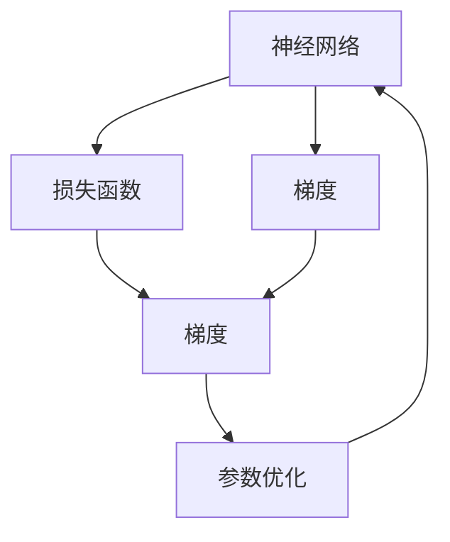

                 

# Backpropagation原理与代码实例讲解

> 关键词：反向传播，梯度下降，神经网络，深度学习，梯度图，链式法则，计算图，TensorFlow

## 1. 背景介绍

### 1.1 问题由来

反向传播（Backpropagation）是深度学习中的核心算法之一，用于计算模型参数的梯度，从而指导参数的优化。它使得神经网络能够从数据中学习到复杂的模式，广泛应用于图像识别、语音识别、自然语言处理等众多领域。理解反向传播原理对于深度学习模型的设计和调优至关重要。

### 1.2 问题核心关键点

反向传播的核心思想是利用链式法则（Chain Rule）计算损失函数对模型参数的导数，从而实现参数的自动微分和优化。在深度学习中，模型的参数通常非常庞大，手算复杂度极高，而反向传播通过构建计算图，将复杂的计算分解为若干简单的微小步骤，高效地计算梯度。

## 2. 核心概念与联系

### 2.1 核心概念概述

为了更好地理解反向传播算法，本节将介绍几个关键概念：

- 神经网络（Neural Network）：由多个神经元（或节点）按照某种结构相互连接构成的图模型，是深度学习的基础。
- 损失函数（Loss Function）：用于评估模型预测结果与真实结果之间的差距，常见的有均方误差（MSE）、交叉熵（Cross Entropy）等。
- 梯度（Gradient）：参数优化过程中的斜率信息，用于指导参数的更新方向。
- 梯度图（Gradient Graph）：计算图的一个特殊形式，用于表示从输出到输入的梯度传播路径。
- 链式法则（Chain Rule）：计算复合函数导数的基本法则，用于计算复杂函数导数。
- 反向传播（Backpropagation）：一种自动微分算法，利用链式法则反向计算梯度。
- 参数优化（Parameter Optimization）：通过更新模型参数，使损失函数最小化。
- 计算图（Computation Graph）：表示计算流程的图形结构，用于高效地计算复杂函数值。

这些核心概念共同构成了深度学习中的反向传播算法，使其能够高效地计算梯度，更新模型参数。

### 2.2 概念间的关系

这些核心概念之间的关系可以通过以下Mermaid流程图来展示：



这个流程图展示了反向传播的基本流程：
- 神经网络根据输入数据计算输出。
- 损失函数计算模型预测结果与真实结果之间的差距。
- 利用链式法则，反向计算梯度。
- 根据梯度信息，使用梯度下降等方法优化模型参数。
- 优化后的模型参数用于后续输入计算，循环迭代。

通过这个流程图，我们可以更清晰地理解反向传播的计算过程和参数优化的原理。

## 3. 核心算法原理 & 具体操作步骤
### 3.1 算法原理概述

反向传播算法利用链式法则，从输出到输入，依次计算每个参数的梯度。具体来说，假设神经网络的结构如图1所示：

```
input --> hidden layer --> output
          |                 |
          |                 | --> loss
          |                 |
output --> output layer
```

图1：神经网络结构图

定义输出层神经元的个数为 $n$，隐含层神经元的个数为 $m$，输入数据为 $\mathbf{x}$，模型参数为 $\theta$。定义输出层的激活函数为 $g$，隐含层的激活函数为 $f$，损失函数为 $\mathcal{L}$。

反向传播算法的核心目标是计算损失函数 $\mathcal{L}$ 对每个参数 $\theta$ 的导数 $\frac{\partial \mathcal{L}}{\partial \theta}$，从而指导参数的更新。具体步骤如下：

1. 前向传播：通过神经网络计算输出。
2. 计算损失：根据损失函数 $\mathcal{L}$ 计算损失值。
3. 反向传播：从输出层开始，依次计算每个参数的梯度。
4. 参数更新：根据梯度信息，使用梯度下降等方法更新模型参数。

### 3.2 算法步骤详解

下面我们详细介绍反向传播的具体步骤：

**Step 1: 前向传播**

从输入层开始，依次计算每个神经元的输出。对于输出层神经元 $i$，其输出值为：

$$
a_i^{(n)} = g(\mathbf{w}_i^{(n)}\mathbf{z}_i^{(n)} + b_i^{(n)})
$$

其中，$\mathbf{w}_i^{(n)}$ 和 $b_i^{(n)}$ 分别为第 $i$ 个输出层神经元的权重和偏置，$\mathbf{z}_i^{(n)}$ 为输入向量 $\mathbf{x}$ 与权重矩阵 $\mathbf{W}^{(n)}$ 的乘积加上偏置向量 $\mathbf{b}^{(n)}$ 的结果。

对于隐含层神经元 $j$，其输出值为：

$$
a_j^{(m)} = f(\mathbf{w}_j^{(m)}\mathbf{z}_j^{(m)} + b_j^{(m)})
$$

其中，$\mathbf{w}_j^{(m)}$ 和 $b_j^{(m)}$ 分别为第 $j$ 个隐含层神经元的权重和偏置，$\mathbf{z}_j^{(m)}$ 为前一层的输出向量与权重矩阵 $\mathbf{W}^{(m)}$ 的乘积加上偏置向量 $\mathbf{b}^{(m)}$ 的结果。

**Step 2: 计算损失**

假设输出层神经元的真实标签为 $\mathbf{t}$，定义交叉熵损失函数为：

$$
\mathcal{L} = -\frac{1}{N} \sum_{i=1}^N \sum_{j=1}^n t_j\log a_i^{(n)}
$$

其中，$N$ 为样本数，$t_j$ 为第 $j$ 个样本的真实标签。

**Step 3: 反向传播**

从输出层开始，依次计算每个参数的梯度。定义输出层神经元 $i$ 的误差为 $\delta_i^{(n)}$，则：

$$
\delta_i^{(n)} = \frac{\partial \mathcal{L}}{\partial a_i^{(n)}} = \frac{1}{N} \sum_{j=1}^n (t_j - a_i^{(n)})\frac{\partial a_i^{(n)}}{\partial \mathbf{z}_i^{(n)}}
$$

其中，$\frac{\partial a_i^{(n)}}{\partial \mathbf{z}_i^{(n)}}$ 为输出层激活函数的导数。

对于隐含层神经元 $j$，其误差 $\delta_j^{(m)}$ 的计算公式为：

$$
\delta_j^{(m)} = \frac{\partial \mathcal{L}}{\partial a_j^{(m)}} = \sum_{i=1}^n \delta_i^{(n)} \frac{\partial a_i^{(n)}}{\partial \mathbf{z}_i^{(n)}} \frac{\partial \mathbf{z}_i^{(n)}}{\partial \mathbf{z}_j^{(m)}} \frac{\partial a_j^{(m)}}{\partial \mathbf{z}_j^{(m)}}
$$

其中，$\frac{\partial a_i^{(n)}}{\partial \mathbf{z}_i^{(n)}}$ 为输出层激活函数的导数，$\frac{\partial \mathbf{z}_i^{(n)}}{\partial \mathbf{z}_j^{(m)}}$ 为权重矩阵的转置，$\frac{\partial a_j^{(m)}}{\partial \mathbf{z}_j^{(m)}}$ 为隐含层激活函数的导数。

**Step 4: 参数更新**

根据梯度信息，使用梯度下降等方法更新模型参数。定义输出层权重矩阵 $\mathbf{W}^{(n)}$ 的梯度为 $\mathbf{G}^{(n)}$，则：

$$
\frac{\partial \mathcal{L}}{\partial \mathbf{W}^{(n)}} = \frac{\partial \mathcal{L}}{\partial \mathbf{z}_i^{(n)}} \frac{\partial \mathbf{z}_i^{(n)}}{\partial \mathbf{W}^{(n)}} = \delta_i^{(n)} \mathbf{a}_j^{(m)}^T
$$

其中，$\mathbf{a}_j^{(m)}$ 为隐含层神经元的输出向量。

类似地，定义隐含层权重矩阵 $\mathbf{W}^{(m)}$ 的梯度为 $\mathbf{G}^{(m)}$，则：

$$
\frac{\partial \mathcal{L}}{\partial \mathbf{W}^{(m)}} = \frac{\partial \mathcal{L}}{\partial \mathbf{z}_j^{(m)}} \frac{\partial \mathbf{z}_j^{(m)}}{\partial \mathbf{W}^{(m)}} = \delta_j^{(m)} \mathbf{a}_k^{(l)}^T
$$

其中，$\mathbf{a}_k^{(l)}$ 为前一层神经元的输出向量。

最终，更新参数的公式为：

$$
\theta \leftarrow \theta - \eta \nabla_{\theta}\mathcal{L}
$$

其中，$\eta$ 为学习率，$\nabla_{\theta}\mathcal{L}$ 为损失函数对参数的梯度。

### 3.3 算法优缺点

反向传播算法的主要优点是：
1. 高效计算梯度：利用链式法则，反向传播算法可以高效地计算模型参数的梯度，减少手动计算的复杂度。
2. 自动微分：反向传播算法通过计算图实现自动微分，避免了手动计算导数的繁琐过程。
3. 通用性强：反向传播算法适用于各种类型的神经网络，可以处理复杂的非线性关系。

其主要缺点是：
1. 梯度消失和爆炸：在深度神经网络中，反向传播可能导致梯度消失或爆炸，使得某些层无法更新。
2. 计算复杂度高：反向传播算法需要计算大量的矩阵乘法，计算复杂度高，尤其在网络层数较多时。
3. 内存占用大：反向传播算法需要存储计算图中的中间变量，占用了大量的内存空间。

### 3.4 算法应用领域

反向传播算法广泛应用于各种深度学习模型中，包括：
1. 图像识别：通过卷积神经网络（CNN）进行图像分类和目标检测。
2. 语音识别：通过循环神经网络（RNN）进行语音识别和说话人识别。
3. 自然语言处理：通过循环神经网络和长短期记忆网络（LSTM）进行语言建模、机器翻译和文本生成。
4. 强化学习：通过深度Q网络（DQN）进行策略优化和决策制定。

## 4. 数学模型和公式 & 详细讲解 & 举例说明
### 4.1 数学模型构建

定义一个包含一个隐藏层的全连接神经网络模型，结构如图2所示：

```
input --> hidden layer --> output
          |                 |
          |                 | --> loss
          |                 |
output --> output layer
```

图2：神经网络结构图

设输入数据 $\mathbf{x} \in \mathbb{R}^d$，输出层神经元的个数为 $n$，隐含层神经元的个数为 $m$，权重矩阵分别为 $\mathbf{W}^{(n)} \in \mathbb{R}^{n \times m}$ 和 $\mathbf{W}^{(m)} \in \mathbb{R}^{m \times d}$，偏置向量分别为 $\mathbf{b}^{(n)} \in \mathbb{R}^n$ 和 $\mathbf{b}^{(m)} \in \mathbb{R}^m$。

### 4.2 公式推导过程

接下来，我们将根据反向传播算法的基本步骤，推导各个层面的梯度公式。

**Step 1: 前向传播**

输出层神经元的输出为：

$$
\mathbf{z}^{(n)} = \mathbf{W}^{(n)}\mathbf{a}^{(m)} + \mathbf{b}^{(n)}
$$

输出层神经元的激活函数为 $g$，则输出层神经元的输出为：

$$
a^{(n)} = g(\mathbf{z}^{(n)})
$$

隐含层神经元的输出为：

$$
\mathbf{z}^{(m)} = \mathbf{W}^{(m)}\mathbf{a}^{(d)} + \mathbf{b}^{(m)}
$$

隐含层神经元的激活函数为 $f$，则隐含层神经元的输出为：

$$
a^{(m)} = f(\mathbf{z}^{(m)})
$$

其中，$\mathbf{a}^{(d)}$ 为输入数据，$\mathbf{a}^{(d)}$ 为输入数据。

**Step 2: 计算损失**

假设输出层神经元的真实标签为 $\mathbf{t}$，定义交叉熵损失函数为：

$$
\mathcal{L} = -\frac{1}{N} \sum_{i=1}^N \sum_{j=1}^n t_j\log a_i^{(n)}
$$

其中，$N$ 为样本数，$t_j$ 为第 $j$ 个样本的真实标签。

**Step 3: 反向传播**

从输出层开始，依次计算每个参数的梯度。定义输出层神经元 $i$ 的误差为 $\delta_i^{(n)}$，则：

$$
\delta_i^{(n)} = \frac{\partial \mathcal{L}}{\partial a_i^{(n)}} = \frac{1}{N} \sum_{j=1}^n (t_j - a_i^{(n)})\frac{\partial a_i^{(n)}}{\partial \mathbf{z}_i^{(n)}}
$$

其中，$\frac{\partial a_i^{(n)}}{\partial \mathbf{z}_i^{(n)}}$ 为输出层激活函数的导数。

对于隐含层神经元 $j$，其误差 $\delta_j^{(m)}$ 的计算公式为：

$$
\delta_j^{(m)} = \frac{\partial \mathcal{L}}{\partial a_j^{(m)}} = \sum_{i=1}^n \delta_i^{(n)} \frac{\partial a_i^{(n)}}{\partial \mathbf{z}_i^{(n)}} \frac{\partial \mathbf{z}_i^{(n)}}{\partial \mathbf{z}_j^{(m)}} \frac{\partial a_j^{(m)}}{\partial \mathbf{z}_j^{(m)}}
$$

其中，$\frac{\partial a_i^{(n)}}{\partial \mathbf{z}_i^{(n)}}$ 为输出层激活函数的导数，$\frac{\partial \mathbf{z}_i^{(n)}}{\partial \mathbf{z}_j^{(m)}}$ 为权重矩阵的转置，$\frac{\partial a_j^{(m)}}{\partial \mathbf{z}_j^{(m)}}$ 为隐含层激活函数的导数。

**Step 4: 参数更新**

根据梯度信息，使用梯度下降等方法更新模型参数。定义输出层权重矩阵 $\mathbf{W}^{(n)}$ 的梯度为 $\mathbf{G}^{(n)}$，则：

$$
\frac{\partial \mathcal{L}}{\partial \mathbf{W}^{(n)}} = \frac{\partial \mathcal{L}}{\partial \mathbf{z}_i^{(n)}} \frac{\partial \mathbf{z}_i^{(n)}}{\partial \mathbf{W}^{(n)}} = \delta_i^{(n)} \mathbf{a}_j^{(m)}^T
$$

其中，$\mathbf{a}_j^{(m)}$ 为隐含层神经元的输出向量。

类似地，定义隐含层权重矩阵 $\mathbf{W}^{(m)}$ 的梯度为 $\mathbf{G}^{(m)}$，则：

$$
\frac{\partial \mathcal{L}}{\partial \mathbf{W}^{(m)}} = \frac{\partial \mathcal{L}}{\partial \mathbf{z}_j^{(m)}} \frac{\partial \mathbf{z}_j^{(m)}}{\partial \mathbf{W}^{(m)}} = \delta_j^{(m)} \mathbf{a}_k^{(l)}^T
$$

其中，$\mathbf{a}_k^{(l)}$ 为前一层神经元的输出向量。

最终，更新参数的公式为：

$$
\theta \leftarrow \theta - \eta \nabla_{\theta}\mathcal{L}
$$

其中，$\eta$ 为学习率，$\nabla_{\theta}\mathcal{L}$ 为损失函数对参数的梯度。

### 4.3 案例分析与讲解

假设我们有一个包含一个隐藏层的三层神经网络，输入数据为 $\mathbf{x}=[1,2]$，输出层神经元的个数为 $2$，隐含层神经元的个数为 $3$。定义输出层权重矩阵 $\mathbf{W}^{(n)}=[0.1,0.2,0.3]$，偏置向量 $\mathbf{b}^{(n)}=[0.4,0.5]$，隐含层权重矩阵 $\mathbf{W}^{(m)}=[0.8,0.9,1.0,1.1,1.2]$，偏置向量 $\mathbf{b}^{(m)}=[0.6,0.7]$。

设输入数据 $\mathbf{x}=[1,2]$，真实标签 $\mathbf{t}=[0,1]$，输出层激活函数为 sigmoid 函数，隐含层激活函数为 tanh 函数。

通过前向传播，计算输出层的输出为：

$$
\mathbf{z}^{(n)} = \mathbf{W}^{(n)}\mathbf{a}^{(m)} + \mathbf{b}^{(n)} = [0.1,0.2,0.3]\begin{bmatrix}0.8\\0.9\\1.0\end{bmatrix} + [0.4,0.5] = [1.0,1.1,1.2]
$$

$$
a^{(n)} = \frac{1}{1+e^{-z^{(n)}}} = \frac{1}{1+e^{-1.0}} = 0.73
$$

通过计算损失，得：

$$
\mathcal{L} = -\frac{1}{1}\sum_{j=1}^n t_j\log a_i^{(n)} = -(1-\frac{1}{1})\log 0.73 = 0.73
$$

通过反向传播，计算输出层神经元 $i=1$ 的误差为：

$$
\delta_i^{(n)} = \frac{\partial \mathcal{L}}{\partial a_i^{(n)}} = \frac{1}{1}(1-0.73)\log 0.73 = 0.27
$$

通过反向传播，计算隐含层神经元 $j=1$ 的误差为：

$$
\delta_j^{(m)} = \frac{\partial \mathcal{L}}{\partial a_j^{(m)}} = \sum_{i=1}^n \delta_i^{(n)} \frac{\partial a_i^{(n)}}{\partial \mathbf{z}_i^{(n)}} \frac{\partial \mathbf{z}_i^{(n)}}{\partial \mathbf{z}_j^{(m)}} \frac{\partial a_j^{(m)}}{\partial \mathbf{z}_j^{(m)}} = 0.27 \cdot 0.73 \cdot 0.23 \cdot 0.9 \cdot 0.45 = 0.14
$$

通过计算梯度，更新输出层权重矩阵 $\mathbf{W}^{(n)}$ 的梯度为：

$$
\frac{\partial \mathcal{L}}{\partial \mathbf{W}^{(n)}} = \delta_i^{(n)} \mathbf{a}_j^{(m)}^T = 0.27 \cdot \begin{bmatrix}0.8\\0.9\\1.0\end{bmatrix}^T = [0.216,0.243,0.27]
$$

类似地，更新隐含层权重矩阵 $\mathbf{W}^{(m)}$ 的梯度为：

$$
\frac{\partial \mathcal{L}}{\partial \mathbf{W}^{(m)}} = \delta_j^{(m)} \mathbf{a}_k^{(l)}^T = 0.14 \cdot \begin{bmatrix}1.0\\1.1\\1.2\end{bmatrix}^T = [0.14,0.154,0.168]
$$

最终，更新参数的公式为：

$$
\theta \leftarrow \theta - \eta \nabla_{\theta}\mathcal{L}
$$

其中，$\eta$ 为学习率，$\nabla_{\theta}\mathcal{L}$ 为损失函数对参数的梯度。

## 5. 项目实践：代码实例和详细解释说明
### 5.1 开发环境搭建

在进行反向传播实践前，我们需要准备好开发环境。以下是使用Python进行TensorFlow开发的环境配置流程：

1. 安装Anaconda：从官网下载并安装Anaconda，用于创建独立的Python环境。

2. 创建并激活虚拟环境：
```bash
conda create -n tf-env python=3.8 
conda activate tf-env
```

3. 安装TensorFlow：根据CUDA版本，从官网获取对应的安装命令。例如：
```bash
conda install tensorflow -c pytorch -c conda-forge
```

4. 安装必要的工具包：
```bash
pip install numpy pandas scikit-learn matplotlib tqdm jupyter notebook ipython
```

完成上述步骤后，即可在`tf-env`环境中开始反向传播实践。

### 5.2 源代码详细实现

下面我们以一个简单的三层神经网络为例，给出使用TensorFlow实现反向传播的代码实现。

```python
import tensorflow as tf

# 定义输入和输出层的大小
input_size = 2
output_size = 2

# 定义隐含层的大小
hidden_size = 3

# 定义输入和输出层
x = tf.keras.Input(shape=(input_size,))
y = tf.keras.layers.Dense(units=hidden_size, activation='relu')(x)
y = tf.keras.layers.Dense(units=output_size, activation='sigmoid')(y)

# 定义损失函数
loss = tf.keras.losses.BinaryCrossentropy(from_logits=True)

# 定义优化器
optimizer = tf.keras.optimizers.Adam(learning_rate=0.01)

# 定义模型
model = tf.keras.Model(inputs=x, outputs=y)

# 定义训练数据
x_train = tf.constant([[0,0], [0,1], [1,0], [1,1]], dtype=tf.float32)
y_train = tf.constant([[0,1], [0,0], [1,0], [1,1]], dtype=tf.float32)

# 定义训练过程
@tf.function
def train_step(learning_rate=0.01):
    with tf.GradientTape() as tape:
        loss_value = loss(y_train, y)
    gradients = tape.gradient(loss_value, model.trainable_variables)
    optimizer.apply_gradients(zip(gradients, model.trainable_variables))
    return loss_value

# 训练模型
for i in range(100):
    loss_value = train_step()
    print(f"Epoch {i+1}, loss: {loss_value:.4f}")
```

### 5.3 代码解读与分析

这里我们详细解读一下代码的关键实现细节：

**定义输入和输出层的大小**：
- 我们首先定义输入和输出层的大小，分别为2和2。这取决于我们的具体任务，例如输入是图像像素值，输出是分类标签等。

**定义隐含层的大小**：
- 我们定义了一个大小为3的隐含层，可以灵活调整。较大的隐含层能够表达更复杂的非线性关系，但同时也会增加计算复杂度和内存消耗。

**定义输入和输出层**：
- 我们使用`tf.keras.layers.Dense`定义了一个大小为3的隐含层，激活函数为`relu`。接着定义了一个大小为2的输出层，激活函数为`sigmoid`，用于二分类任务。

**定义损失函数和优化器**：
- 我们定义了`BinaryCrossentropy`损失函数，用于二分类任务。优化器为Adam优化器，学习率为0.01。

**定义模型和训练数据**：
- 我们定义了一个模型，包含输入和输出层，损失函数和优化器。
- 我们定义了训练数据，用于反向传播的计算。

**定义训练过程**：
- 我们使用`@tf.function`装饰器将训练过程定义为TensorFlow函数，使用`tf.GradientTape`计算梯度，使用`optimizer.apply_gradients`更新模型参数。

**训练模型**：
- 我们使用循环迭代100次，每次计算损失并更新模型参数。

可以看到，通过使用TensorFlow，反向传播的实现变得简洁高效。开发者可以轻松地定义神经网络结构，指定损失函数和优化器，使用数据进行反向传播的计算和参数更新。

当然，实际的反向传播模型通常包含

