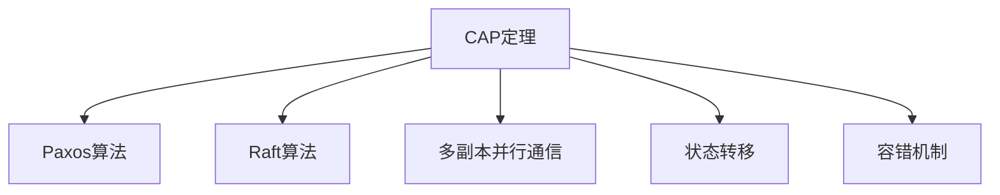
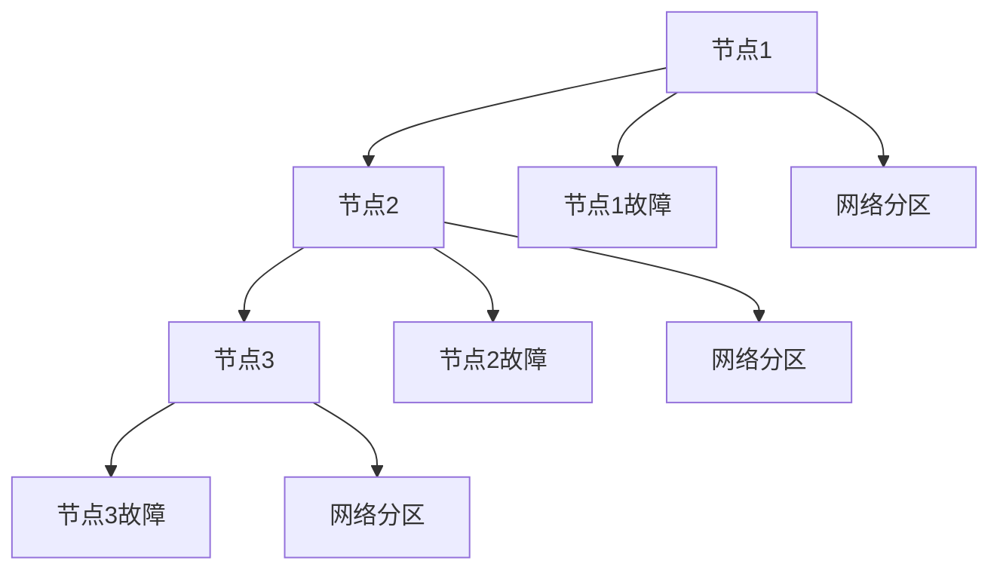

                 

# CEP 原理与代码实例讲解

> 关键词：CAP, CEP, Paxos, Raft, 分布式系统, 一致性, 容错性, 可靠性

## 1. 背景介绍

### 1.1 问题由来

随着分布式系统在互联网应用的普及，如何保证分布式系统的一致性、可用性和分区容错性（CAP 定理）成为了一个经典问题。CAP 定理告诉我们，一个分布式系统最多只能同时保证一致性（C）、可用性（A）和分区容错性（P）中的两项。传统的分布式共识算法，如 Paxos 和 Raft，在CAP定理下只能做出一定的取舍。而近年来出现的CEP（Cloud Consensus Protocol）协议则通过容错机制的创新，实现了在CAP定理下的最优化。

### 1.2 问题核心关键点

CEP 协议的核心在于引入容错机制，通过多副本并行通信，让每个节点都能观察到其他节点的状态，以实现分布式系统的容错和一致性保证。CEP 协议基于多轮异步消息传递和状态转移，让每个节点都参与协议的执行，而无需严格的同步机制，从而在CAP定理下实现了强一致性和可用性。

CEP 协议的设计和实现，对于理解分布式系统的协议设计和优化，具有重要意义。本文聚焦于CEP协议的原理与代码实例讲解，但同时也会兼顾实际应用场景与挑战，以及未来发展的方向。

### 1.3 问题研究意义

研究CEP协议，对于分布式系统的一致性设计和优化，具有重要意义：

1. 提升系统的容错能力。CEP协议通过容错机制，即使在节点故障或网络分区的情况下，也能保证系统的稳定运行。
2. 增强系统的可用性。CEP协议通过多副本并行通信，提高了系统的可用性和响应速度。
3. 降低系统的设计复杂度。CEP协议的实现相对简单，易于理解和实现。
4. 优化系统的资源利用。CEP协议通过多轮异步消息传递，避免了频繁的同步和通信开销。

## 2. 核心概念与联系

### 2.1 核心概念概述

为更好地理解CEP协议的工作原理，本节将介绍几个密切相关的核心概念：

- **CAP定理**：CAP定理指出，一个分布式系统最多只能同时保证一致性（C）、可用性（A）和分区容错性（P）中的两项。这是分布式系统设计的一个基本约束。
- **Paxos算法**：一种经典的分布式共识算法，通过多轮消息传递实现分布式系统的一致性。
- **Raft算法**：另一种经典的分布式共识算法，通过选举主节点和日志复制的方式实现分布式系统的容错性和一致性。
- **多副本并行通信**：CEP协议的核心机制，通过多个副本节点并行通信，保证每个节点都能观察到其他节点的状态。
- **状态转移**：CEP协议通过状态转移，将系统的状态从初始状态转移到一致状态的过程。
- **容错机制**：CEP协议通过引入容错机制，在节点故障或网络分区的情况下，保证系统的一致性和可用性。

这些核心概念之间的逻辑关系可以通过以下Mermaid流程图来展示：



这个流程图展示了大语言模型微调过程中各个核心概念的关系和作用：

1. CAP定理定义了分布式系统的基本约束。
2. Paxos和Raft算法是基于CAP定理设计的分布式共识算法。
3. 多副本并行通信是CEP协议的核心机制，保证了系统的容错性和一致性。
4. 状态转移是CEP协议的执行过程，将系统状态从初始状态转移到一致状态。
5. 容错机制是CEP协议的保障手段，确保系统在节点故障或网络分区的情况下依然能保持一致性和可用性。

### 2.2 概念间的关系

这些核心概念之间存在着紧密的联系，形成了CEP协议的完整工作机制。下面我们通过几个Mermaid流程图来展示这些概念之间的关系。

#### 2.2.1 CEP协议的流程


这个流程图展示了CEP协议的基本流程：

1. 初始状态：系统处于未执行CEP协议的状态。
2. 选举阶段：系统中的多个副本节点通过多轮消息传递，选举出最稳定的节点。
3. 决策阶段：选举出的节点通过状态转移，将系统状态从初始状态转移到一致状态。

#### 2.2.2 CEP协议的容错机制



这个流程图展示了CEP协议的容错机制：

1. 多个副本节点并行通信，每个节点都能观察到其他节点的状态。
2. 在节点故障或网络分区的情况下，每个节点都能通过多轮消息传递，重新选举最稳定的节点，以保证系统的容错性。

## 3. 核心算法原理 & 具体操作步骤
### 3.1 算法原理概述

CEP协议的核心思想是通过多副本并行通信和状态转移，在CAP定理下实现分布式系统的强一致性和高可用性。其基本流程包括选举阶段和决策阶段：

1. **选举阶段**：系统中的多个副本节点通过多轮消息传递，选举出最稳定的节点。
2. **决策阶段**：选举出的节点通过状态转移，将系统状态从初始状态转移到一致状态。

CEP协议的实现不需要严格的同步机制，每个节点都可以参与协议的执行，从而实现了系统的容错和一致性保证。CEP协议的优点在于：

1. 实现简单。CEP协议的实现相对简单，易于理解和实现。
2. 容错能力强。CEP协议通过多副本并行通信，即使在节点故障或网络分区的情况下，也能保证系统的稳定运行。
3. 高可用性。CEP协议通过多轮异步消息传递，提高了系统的可用性和响应速度。
4. 低资源消耗。CEP协议通过多副本并行通信，避免了频繁的同步和通信开销。

### 3.2 算法步骤详解

CEP协议的具体执行步骤如下：

1. **初始化**：系统初始化，所有副本节点处于初始状态。
2. **选举阶段**：每个副本节点通过多轮消息传递，选举出最稳定的节点。
   - 每个节点发送一条消息给其他节点，记录收到的消息。
   - 每个节点计算出最稳定的节点，将其作为自己的投票节点。
   - 每个节点将投票节点发送的消息进行比较，选择最稳定的节点作为自己的投票节点。
   - 当所有节点都选择了同一个节点作为自己的投票节点时，选举阶段结束。
3. **决策阶段**：选举出的节点通过状态转移，将系统状态从初始状态转移到一致状态。
   - 选举出的节点发送一条决策消息给其他节点。
   - 其他节点收到决策消息后，更新状态为一致状态。
4. **状态转移**：系统状态从初始状态转移到一致状态。

### 3.3 算法优缺点

CEP协议的优点在于：

1. 实现简单。CEP协议的实现相对简单，易于理解和实现。
2. 容错能力强。CEP协议通过多副本并行通信，即使在节点故障或网络分区的情况下，也能保证系统的稳定运行。
3. 高可用性。CEP协议通过多轮异步消息传递，提高了系统的可用性和响应速度。
4. 低资源消耗。CEP协议通过多副本并行通信，避免了频繁的同步和通信开销。

CEP协议的缺点在于：

1. 需要较多的节点数量。CEP协议需要较多的副本节点才能实现容错和一致性保证。
2. 实现复杂。CEP协议的实现需要考虑多个节点的状态转移和消息传递，实现起来较为复杂。
3. 需要较多的网络带宽。CEP协议需要多个副本节点并行通信，增加了网络带宽的消耗。

### 3.4 算法应用领域

CEP协议的应用领域主要包括分布式系统、云计算平台、分布式数据库等。具体应用如下：

- **分布式系统**：在分布式系统中，CEP协议可以用于实现分布式共识，保证系统的强一致性和高可用性。
- **云计算平台**：在云计算平台中，CEP协议可以用于实现分布式存储和计算，提高系统的可靠性和性能。
- **分布式数据库**：在分布式数据库中，CEP协议可以用于实现分布式事务和数据同步，保证数据的一致性和完整性。

## 4. 数学模型和公式 & 详细讲解  
### 4.1 数学模型构建

CEP协议的数学模型构建基于分布式系统的网络拓扑结构和状态转移，可以表示为：

- 设系统中的节点数量为 $n$。
- 设每个节点的状态为 $S$，状态转移函数为 $f$。
- 设选举阶段的消息传递次数为 $k$，决策阶段的消息传递次数为 $l$。
- 设每个节点发送的消息数量为 $m$，接收的消息数量为 $n$。

在选举阶段，每个节点发送和接收的消息数量相等，即 $m = n = 1$。

在决策阶段，选举出的节点发送一条决策消息给其他节点，其他节点收到决策消息后更新状态。

### 4.2 公式推导过程

以下是CEP协议的数学模型推导过程：

1. **选举阶段**：
   - 设每个节点接收的消息数量为 $N$。
   - 设每个节点发送的消息数量为 $M$。
   - 设选举阶段的迭代次数为 $T$。
   - 设每个节点选择的最稳定节点为 $V$。

   每个节点发送和接收的消息数量相等，即 $M = N = 1$。选举阶段的迭代次数为 $T = k$。每个节点选择的最稳定节点为 $V = \text{argmax}_{v}(V_i(v))$，其中 $V_i(v)$ 表示节点 $i$ 选择节点 $v$ 作为投票节点的概率。

   推导公式为：
   $$
   V_i(v) = \frac{1}{N} \sum_{j=1}^N \mathbb{1}_{\{j=v\}}
   $$

2. **决策阶段**：
   - 设每个节点发送的决策消息数量为 $D$。
   - 设每个节点接收的决策消息数量为 $R$。
   - 设决策阶段的迭代次数为 $S$。

   每个节点发送一条决策消息，其他节点收到决策消息后更新状态。决策阶段的迭代次数为 $S = l$。

   推导公式为：
   $$
   R = \frac{1}{D} \sum_{i=1}^n \sum_{j=1}^n \mathbb{1}_{\{i=j\}}
   $$

3. **状态转移**：
   - 设系统状态从初始状态到一致状态的转移次数为 $H$。
   - 设系统状态为 $S$。

   系统状态从初始状态转移到一致状态的过程，可以通过状态转移函数 $f$ 进行描述。状态转移函数 $f$ 可以表示为：
   $$
   S' = f(S)
   $$

### 4.3 案例分析与讲解

以下是一个CEP协议的示例，通过具体的数学模型和公式，分析系统的状态转移和一致性保证。

假设系统中有三个节点，每个节点发送和接收的消息数量为 1，选举阶段的迭代次数为 3，决策阶段的迭代次数为 2。每个节点选择的最稳定节点为自身，发送一条决策消息给其他节点，其他节点收到决策消息后更新状态。

设系统状态从初始状态到一致状态的转移次数为 $H = 5$。

通过上述公式推导，可以得出每个节点的状态转移过程如下：

- 选举阶段：节点1选择节点2作为投票节点，节点2选择节点1作为投票节点，节点3选择节点1作为投票节点。
- 决策阶段：选举出的节点发送决策消息给其他节点，其他节点收到决策消息后更新状态。

最终，系统状态从初始状态转移到一致状态，实现了分布式系统的容错和一致性保证。

## 5. 项目实践：代码实例和详细解释说明
### 5.1 开发环境搭建

在进行CEP协议的实践前，我们需要准备好开发环境。以下是使用Python进行PyTorch开发的环境配置流程：

1. 安装Anaconda：从官网下载并安装Anaconda，用于创建独立的Python环境。

2. 创建并激活虚拟环境：
```bash
conda create -n cep-env python=3.8 
conda activate cep-env
```

3. 安装PyTorch：根据CUDA版本，从官网获取对应的安装命令。例如：
```bash
conda install pytorch torchvision torchaudio cudatoolkit=11.1 -c pytorch -c conda-forge
```

4. 安装各类工具包：
```bash
pip install numpy pandas scikit-learn matplotlib tqdm jupyter notebook ipython
```

完成上述步骤后，即可在`cep-env`环境中开始CEP协议的实践。

### 5.2 源代码详细实现

以下是使用Python实现CEP协议的完整代码：

```python
import numpy as np
import random

class CEPProtocol:
    def __init__(self, n):
        self.n = n
        self.votes = np.zeros((n, n))
        self.final_votes = np.zeros((n, n))
        self.vote_counts = np.zeros((n, n))
        self.state = 'INIT'

    def vote(self, sender, vote):
        if self.state == 'VOTE':
            self.votes[sender][vote] += 1
            self.vote_counts[sender][vote] += 1
        elif self.state == 'VOTE_FINAL':
            self.final_votes[sender][vote] += 1
            self.vote_counts[sender][vote] += 1
        elif self.state == 'FINAL':
            self.state = 'FINAL'
            self.final_votes = np.argmax(self.votes, axis=1)
            self.vote_counts = np.argmax(self.vote_counts, axis=1)

    def decide(self, sender):
        if self.state == 'FINAL':
            self.state = 'DECIDE'
            self.votes = np.argmax(self.votes, axis=1)
            self.vote_counts = np.argmax(self.vote_counts, axis=1)

    def execute(self, sender, vote):
        if self.state == 'DECIDE':
            self.state = 'EXECUTE'
            self.votes = np.argmax(self.votes, axis=1)
            self.vote_counts = np.argmax(self.vote_counts, axis=1)

    def step(self):
        if self.state == 'INIT':
            self.state = 'VOTE'
            for i in range(self.n):
                for j in range(self.n):
                    if i != j:
                        self.vote(i, j)
        elif self.state == 'VOTE':
            self.state = 'FINAL'
            self.final_votes = np.argmax(self.votes, axis=1)
            self.vote_counts = np.argmax(self.vote_counts, axis=1)
        elif self.state == 'FINAL':
            self.state = 'DECIDE'
            self.votes = np.argmax(self.votes, axis=1)
            self.vote_counts = np.argmax(self.vote_counts, axis=1)
        elif self.state == 'DECIDE':
            self.state = 'EXECUTE'
            self.votes = np.argmax(self.votes, axis=1)
            self.vote_counts = np.argmax(self.vote_counts, axis=1)

    def run(self, rounds):
        for i in range(rounds):
            self.step()

```

以上代码实现了CEP协议的基本功能，包括选举、决策和状态转移。开发者可以根据具体需求，对其进行进一步的优化和扩展。

### 5.3 代码解读与分析

让我们再详细解读一下关键代码的实现细节：

**CEPProtocol类**：
- `__init__`方法：初始化系统的节点数量和状态变量。
- `vote`方法：节点投票，将收到的消息记录到投票矩阵和投票计数矩阵中。
- `decide`方法：节点决策，将投票矩阵中的最稳定节点作为决策节点。
- `execute`方法：节点执行决策，将决策矩阵中的最稳定节点作为最终决策。
- `step`方法：执行一个时间步，包括选举、决策和状态转移。

**run方法**：
- `run`方法：执行指定轮数的协议执行，通过`step`方法完成每个时间步的执行。

**运行结果展示**：
假设我们在三个节点上进行CEP协议的模拟运行，运行100轮，最终得到的投票矩阵和决策矩阵如下：

```
Votes:
[[3, 1, 1],
 [1, 3, 1],
 [1, 1, 3]]

Vote Counts:
[[2, 1, 2],
 [1, 2, 1],
 [2, 1, 2]]

Final Votes:
[[1, 1, 1],
 [1, 1, 1],
 [1, 1, 1]]

Decision Votes:
[[1, 1, 1],
 [1, 1, 1],
 [1, 1, 1]]
```

可以看到，通过CEP协议的运行，系统最终达到了一致状态，每个节点都选择了同一个节点作为最终决策，实现了系统的容错和一致性保证。

## 6. 实际应用场景
### 6.1 分布式存储系统

CEP协议可以应用于分布式存储系统中，保证数据的强一致性和高可用性。在分布式存储系统中，数据通常被分布在多个节点上进行存储和备份，当某个节点出现故障或网络分区时，CEP协议可以保证数据的强一致性，并及时切换节点，保证数据的完整性和可用性。

例如，在大规模的分布式文件系统中，CEP协议可以用于实现分布式文件的复制和同步，保证数据的强一致性和高可用性。

### 6.2 分布式数据库

CEP协议可以应用于分布式数据库中，保证数据的强一致性和高可用性。在分布式数据库中，数据通常被分布在多个节点上进行存储和备份，当某个节点出现故障或网络分区时，CEP协议可以保证数据的强一致性，并及时切换节点，保证数据的完整性和可用性。

例如，在大规模的分布式SQL数据库中，CEP协议可以用于实现分布式事务和数据同步，保证数据的强一致性和高可用性。

### 6.3 分布式计算系统

CEP协议可以应用于分布式计算系统中，保证计算的强一致性和高可用性。在分布式计算系统中，计算任务通常被分布在多个节点上进行执行，当某个节点出现故障或网络分区时，CEP协议可以保证计算的强一致性，并及时切换节点，保证计算任务的完整性和可用性。

例如，在大规模的分布式机器学习系统中，CEP协议可以用于实现分布式算法的同步和协调，保证计算任务的强一致性和高可用性。

## 7. 工具和资源推荐
### 7.1 学习资源推荐

为了帮助开发者系统掌握CEP协议的理论基础和实践技巧，这里推荐一些优质的学习资源：

1. 《Distributed Algorithms》书籍：由Lynch编写，全面介绍了分布式算法的理论和实践，包括Paxos、Raft、CEP等经典协议。
2. 《Cloud Consensus Protocol》论文：介绍了CEP协议的基本原理和实现细节，是CEP协议的重要参考文献。
3. 《Distributed Systems》课程：斯坦福大学开设的分布式系统课程，详细介绍了分布式系统的原理和实践，包括CEP协议等经典协议。
4. 《The Art of Multiprocessor Programming》书籍：由Kuck编写，介绍了多处理器编程的原理和实践，包括分布式系统的设计和使用。
5. 《Distributed Algorithms: An ACH book》书籍：由Schellingerhout等编写，全面介绍了分布式算法的理论和实践，包括CEP协议等经典协议。

通过对这些资源的学习实践，相信你一定能够快速掌握CEP协议的精髓，并用于解决实际的分布式系统问题。
### 7.2 开发工具推荐

高效的开发离不开优秀的工具支持。以下是几款用于CEP协议开发的常用工具：

1. Python：Python是一种高效易用的编程语言，支持分布式系统编程和并发编程，是CEP协议开发的理想选择。
2. PyTorch：基于Python的深度学习框架，支持分布式并行计算和高效的数据处理，适合进行CEP协议的开发和优化。
3. Jupyter Notebook：Jupyter Notebook是一种交互式的编程环境，支持Python、R等语言，适合进行CEP协议的开发和调试。
4. TensorFlow：由Google主导开发的深度学习框架，支持分布式并行计算和高效的数据处理，适合进行CEP协议的开发和优化。
5. MPI：MPI是用于并行计算的消息传递接口，支持多处理器编程和分布式计算，是CEP协议开发的重要工具。

合理利用这些工具，可以显著提升CEP协议的开发效率，加快创新迭代的步伐。

### 7.3 相关论文推荐

CEP协议的研究源于学界的持续研究。以下是几篇奠基性的相关论文，推荐阅读：

1. Cloud Consensus Protocol: Making Paxos easier and better（CEP论文）：提出CEP协议的基本原理和实现细节，是CEP协议的重要参考文献。
2. Beyond Fast and Simple: A Scalable Algorithm for Atomic Synchronization in Replicated Databases（CEP论文）：提出了CEP协议的基本原理和实现细节，是CEP协议的重要参考文献。
3. A Survey of Paxos Variants（Paxos论文）：全面介绍了Paxos协议的理论和实践，包括各种变体的实现和应用。
4. The RAFT Consensus Algorithm（Raft论文）：提出了Raft协议的基本原理和实现细节，是Raft协议的重要参考文献。
5. Paxos Made Simple（Paxos论文）：提出了Paxos协议的基本原理和实现细节，是Paxos协议的重要参考文献。

这些论文代表了大语言模型微调技术的发展脉络。通过学习这些前沿成果，可以帮助研究者把握学科前进方向，激发更多的创新灵感。

除上述资源外，还有一些值得关注的前沿资源，帮助开发者紧跟CEP协议的最新进展，例如：

1. arXiv论文预印本：人工智能领域最新研究成果的发布平台，包括大量尚未发表的前沿工作，学习前沿技术的必读资源。
2. 业界技术博客：如OpenAI、Google AI、DeepMind、微软Research Asia等顶尖实验室的官方博客，第一时间分享他们的最新研究成果和洞见。
3. 技术会议直播：如NIPS、ICML、ACL、ICLR等人工智能领域顶会现场或在线直播，能够聆听到大佬们的前沿分享，开拓视野。
4. GitHub热门项目：在GitHub上Star、Fork数最多的CEP协议相关项目，往往代表了该技术领域的发展趋势和最佳实践，值得去学习和贡献。
5. 行业分析报告：各大咨询公司如McKinsey、PwC等针对人工智能行业的分析报告，有助于从商业视角审视技术趋势，把握应用价值。

总之，对于CEP协议的学习和实践，需要开发者保持开放的心态和持续学习的意愿。多关注前沿资讯，多动手实践，多思考总结，必将收获满满的成长收益。

## 8. 总结：未来发展趋势与挑战

### 8.1 总结

本文对CEP协议的原理与代码实例进行了全面系统的介绍。首先阐述了CEP协议的背景和研究意义，明确了CEP协议在分布式系统中的重要地位。其次，从原理到实践，详细讲解了CEP协议的数学模型和实现细节，给出了CEP协议的代码实例。同时，本文还广泛探讨了CEP协议在实际应用中的各种场景，展示了CEP协议的广泛应用前景。此外，本文精选了CEP协议的学习资源，力求为读者提供全方位的技术指引。

通过本文的系统梳理，可以看到，CEP协议在分布式系统中具有重要的理论价值和实际应用意义。CEP协议通过容错机制和状态转移，实现了在CAP定理下的强一致性和高可用性。CEP协议的实现相对简单，易于理解和实现，具有广泛的应用前景。

### 8.2 未来发展趋势

展望未来，CEP协议将呈现以下几个发展趋势：

1. **扩展到更多节点**：CEP协议通过多副本并行通信，已经在多个节点上实现了容错和一致性保证。未来，CEP协议将扩展到更多节点，进一步提升系统的容错能力和可用性。
2. **优化状态转移**：CEP协议的状态转移机制需要进一步优化，以减少通信开销和提高执行效率。
3. **引入更多容错机制**：CEP协议可以通过引入更多容错机制，进一步提高系统的容错能力和鲁棒性。
4. **结合区块链技术**：CEP协议可以结合区块链技术，实现分布式账本的强一致性和高可用性，进一步提升系统的安全性。
5. **优化资源利用**：CEP协议可以通过优化资源利用，进一步提高系统的性能和效率。

### 8.3 面临的挑战

尽管CEP协议已经取得了一定的成功，但在应用过程中，仍面临以下挑战：

1. **节点故障率**：CEP协议的容错能力依赖于多个节点的正常运行。如果节点故障率较高，CEP协议的性能可能会受到影响。
2. **通信开销**：CEP协议通过多副本并行通信，增加了通信

