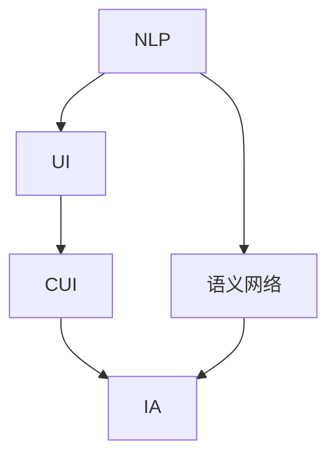
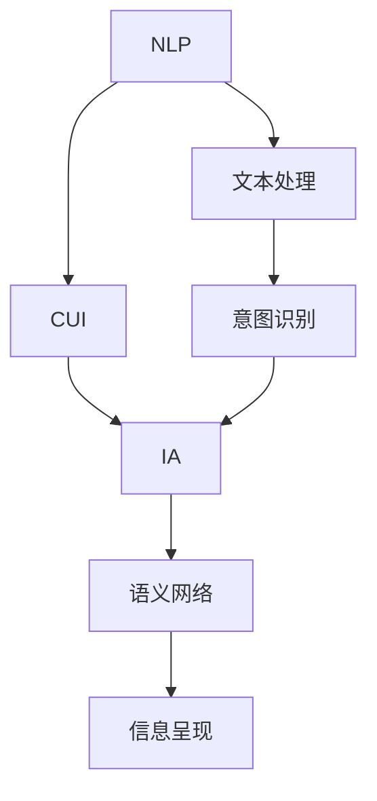

                 

# CUI对信息架构设计的影响

## 1. 背景介绍

### 1.1 问题由来

随着互联网的普及和信息技术的发展，信息架构设计（Information Architecture, IA）成为各类数字产品设计中的重要一环。它不仅决定了产品的信息组织方式和用户交互逻辑，更是影响用户获取信息效率和用户体验的关键因素。然而，传统的信息架构设计方法主要依赖人工经验和设计直觉，缺乏数据驱动和用户行为分析的支撑，设计效果难以量化评估和迭代优化。

近年来，随着自然语言处理（Natural Language Understanding, NLU）技术的进步，尤其是基于用户意图（User Intent, UI）的对话系统（Conversational User Interface, CUI）的兴起，为信息架构设计带来了新的突破。CUI通过理解和响应用户的意图和语义信息，动态调整和优化信息组织和交互逻辑，提供更加智能、高效的用户体验。

### 1.2 问题核心关键点

CUI对信息架构设计的影响主要体现在以下几个方面：

1. **意图识别与语义理解**：CUI通过自然语言理解技术，自动识别用户意图，从文本中提取关键信息，从而为信息架构设计提供更精确的用户需求数据支撑。
2. **动态信息重组**：CUI能根据用户的多轮对话内容，动态调整信息组织方式，构建更加连贯和有序的信息结构。
3. **个性化信息推送**：CUI能根据用户的历史行为和偏好，推送个性化的信息内容，提升用户体验的个性化水平。
4. **实时反馈与优化**：CUI的动态交互特性使得设计效果可以实时调整和优化，快速响应用户需求变化。
5. **跨平台和跨设备适配**：CUI设计出的信息架构，可以灵活适配各类设备和平台，提高产品的通用性和可扩展性。

### 1.3 问题研究意义

研究CUI对信息架构设计的影响，对于提升数字产品设计的智能化水平、优化用户体验、提高用户满意度、加速产品迭代和优化具有重要意义：

1. **降低设计成本**：通过CUI自动获取用户意图和语义信息，减少了人工数据分析的复杂度和成本。
2. **提高设计效率**：动态信息重组和个性化推送功能，使得设计过程更加灵活和高效。
3. **优化用户体验**：CUI的意图识别和实时反馈能力，提供了更加智能、个性化的交互体验。
4. **促进用户互动**：跨平台和跨设备适配功能，使用户在不同设备上都能获得一致和流畅的体验。
5. **提升产品竞争力**：CUI技术的应用，能够快速响应市场变化和用户需求，提升产品的市场竞争力和用户粘性。

## 2. 核心概念与联系

### 2.1 核心概念概述

为了更好地理解CUI对信息架构设计的影响，我们需要引入以下几个核心概念：

- **自然语言处理（NLP）**：通过计算机对人类语言进行处理和理解的技术，包括文本分析、语义理解、意图识别等。
- **用户意图（UI）**：用户通过文字或语音与系统进行交互时的真实目的和需求。
- **对话系统（CUI）**：基于NLP技术，能够理解和响应用户意图和语义信息的交互系统。
- **信息架构设计（IA）**：对数字产品中信息的组织、分类、呈现和导航进行设计，以提升用户体验。
- **语义网络（Semantic Network）**：将信息组织成网络结构，以便更准确地理解和推导语义关系。

这些核心概念之间的关系可以通过以下Mermaid流程图来展示：



这个流程图展示了CUI如何通过NLP技术识别用户意图，然后通过IA设计信息架构，最终构建语义网络，以实现信息的有效组织和展示。

### 2.2 概念间的关系

这些核心概念之间存在着紧密的联系，形成了CUI在信息架构设计中的整体架构。下面是它们之间的具体关系：

- **NLP与UI**：NLP通过文本或语音解析，获取UI，即用户的意图和需求。
- **CUI与IA**：CUI通过理解UI，设计IA，以动态调整信息组织方式，提升用户体验。
- **语义网络与IA**：语义网络提供了一种结构化的方式来组织信息，IA通过语义网络进一步优化信息架构，提高信息呈现的逻辑性和一致性。

### 2.3 核心概念的整体架构

最后，我们用一个综合的流程图来展示这些核心概念在信息架构设计中的整体架构：



这个综合流程图展示了从NLP获取用户意图，CUI设计信息架构，并通过语义网络优化信息呈现的完整过程。

## 3. 核心算法原理 & 具体操作步骤

### 3.1 算法原理概述

基于CUI的信息架构设计，本质上是一个动态的信息组织和调整过程。其核心思想是：通过NLP技术自动识别用户意图，然后根据这些意图动态调整信息架构，提供更加个性化和高效的信息呈现方式。

形式化地，假设用户意图表示为 $I$，信息架构表示为 $A$，目标是最小化用户获取信息的难度和误差，即：

$$
\min_{A} \mathcal{L}(I, A)
$$

其中 $\mathcal{L}$ 为损失函数，用于衡量信息架构 $A$ 与用户意图 $I$ 的匹配程度。常见的损失函数包括交叉熵损失、KL散度损失等。

### 3.2 算法步骤详解

基于CUI的信息架构设计一般包括以下几个关键步骤：

**Step 1: 数据收集与预处理**

- 收集用户的历史互动数据，如文本、语音、点击行为等。
- 对数据进行清洗、去噪和标准化，以提高NLP技术的准确性。

**Step 2: 用户意图识别**

- 使用预训练的NLP模型，如BERT、GPT等，对用户的输入文本或语音进行意图识别，提取关键词和语义信息。
- 通过多轮对话模型（如对话管理器）对用户意图进行持续更新和修正，以适应复杂的交互场景。

**Step 3: 动态信息重组**

- 根据用户意图，动态调整信息架构中的信息组织方式，如分类、排序、过滤等。
- 使用语义网络技术，将信息组织成逻辑连贯的网络结构，以便用户更易理解和使用。

**Step 4: 个性化信息推送**

- 根据用户的历史行为和偏好，推送个性化的信息内容，如推荐商品、推荐文章等。
- 使用协同过滤、矩阵分解等推荐算法，提高个性化信息的准确性和相关性。

**Step 5: 实时反馈与优化**

- 通过用户的行为反馈和交互数据，实时调整信息架构的设计参数，如分类方式、推荐算法等。
- 使用强化学习技术，优化信息架构的交互逻辑，提升用户体验的满意度。

### 3.3 算法优缺点

基于CUI的信息架构设计具有以下优点：

1. **动态自适应**：能够根据用户的多轮对话和行为，动态调整信息架构，提升用户体验的灵活性和适应性。
2. **个性化推荐**：利用用户的历史行为和偏好，推送个性化的信息内容，提高用户的满意度。
3. **实时优化**：通过实时反馈和数据驱动，持续优化信息架构设计，适应用户需求的变化。
4. **跨平台适配**：设计的IA结构可以灵活适配不同的设备和平台，提高产品的通用性。

同时，该算法也存在一些缺点：

1. **数据依赖度高**：需要大量的用户互动数据，才能有效训练意图识别模型和优化信息架构。
2. **模型复杂度高**：涉及到NLP、CUI、IA等多方面的技术，模型复杂度高，开发和维护成本较大。
3. **隐私和安全风险**：用户的互动数据涉及隐私信息，数据收集和处理过程中需要注意隐私保护和安全问题。
4. **可解释性差**：意图识别和信息重组过程较为复杂，难以解释和调试。

### 3.4 算法应用领域

基于CUI的信息架构设计已经在多个领域得到了广泛应用，例如：

- **电商推荐系统**：通过用户购物历史和行为数据，提供个性化的商品推荐，提升用户体验和转化率。
- **智能客服系统**：根据用户的问题和对话内容，动态调整信息和知识库，提高问题解答的准确性和速度。
- **新闻和内容推荐平台**：根据用户的阅读历史和偏好，动态调整推荐算法和信息结构，提供更加相关和有趣的内容。
- **智能家居系统**：根据用户的语音指令和行为数据，动态调整家居设备的设置和状态，提供更加便捷和智能的用户体验。

除了上述这些经典应用外，CUI技术还在社交媒体、健康医疗、金融服务等多个领域，展示了其强大的应用潜力。

## 4. 数学模型和公式 & 详细讲解

### 4.1 数学模型构建

假设用户输入的文本为 $T$，其意图为 $I$，信息架构为 $A$，目标是最小化用户获取信息的难度和误差。定义损失函数 $\mathcal{L}(I, A)$ 为：

$$
\mathcal{L}(I, A) = \mathcal{L}_{intent}(I) + \mathcal{L}_{architecture}(I, A)
$$

其中 $\mathcal{L}_{intent}$ 为用户意图识别的损失，$\mathcal{L}_{architecture}$ 为用户意图与信息架构的匹配损失。假设意图识别模型为 $M_{intent}$，信息架构优化模型为 $M_{architecture}$，则目标函数为：

$$
\min_{A, M_{intent}, M_{architecture}} \mathcal{L}(I, A)
$$

### 4.2 公式推导过程

假设意图识别模型 $M_{intent}$ 输出一个意图向量 $\hat{I}$，则用户意图识别损失 $\mathcal{L}_{intent}$ 为：

$$
\mathcal{L}_{intent}(I) = -\log P(I|\hat{I})
$$

其中 $P(I|\hat{I})$ 为用户意图 $I$ 在给定意图向量 $\hat{I}$ 下的条件概率，通常使用softmax函数计算。

对于信息架构优化模型 $M_{architecture}$，假设其输出信息架构向量 $\hat{A}$，则用户意图与信息架构的匹配损失 $\mathcal{L}_{architecture}$ 为：

$$
\mathcal{L}_{architecture}(I, A) = -\log P(A|\hat{I})
$$

其中 $P(A|\hat{I})$ 为用户意图 $I$ 在给定意图向量 $\hat{I}$ 下的信息架构 $A$ 的概率分布，通常使用KL散度或交叉熵损失函数计算。

### 4.3 案例分析与讲解

以电商推荐系统为例，假设用户输入的文本为 "我想买一本关于Python编程的书"，其意图为 "购买书籍"，推荐系统根据用户的历史行为和偏好，推送相关的书籍信息。此时，信息架构优化模型需要动态调整信息组织方式，如分类、排序等，以呈现最相关的书籍信息。假设推荐系统的优化模型输出信息架构向量 $\hat{A}$，则信息架构匹配损失 $\mathcal{L}_{architecture}$ 为：

$$
\mathcal{L}_{architecture}(I, A) = -\log P(\hat{A}|I)
$$

其中 $P(\hat{A}|I)$ 为在用户意图 $I$ 下，信息架构向量 $\hat{A}$ 的概率分布。

## 5. 项目实践：代码实例和详细解释说明

### 5.1 开发环境搭建

在进行CUI项目实践前，我们需要准备好开发环境。以下是使用Python进行TensorFlow开发的环境配置流程：

1. 安装Anaconda：从官网下载并安装Anaconda，用于创建独立的Python环境。

2. 创建并激活虚拟环境：
```bash
conda create -n tf-env python=3.8 
conda activate tf-env
```

3. 安装TensorFlow：根据CUDA版本，从官网获取对应的安装命令。例如：
```bash
conda install tensorflow=2.7 -c tf -c conda-forge
```

4. 安装TensorFlow Addons：用于扩展TensorFlow的功能，如TensorFlow Hub、TensorFlow Text等。
```bash
conda install tensorflow-io tensorflow-addons
```

5. 安装Flax：用于构建灵活的深度学习模型，支持动态图和静态图。
```bash
pip install flax
```

6. 安装其他必要的工具包：
```bash
pip install numpy pandas scikit-learn matplotlib tqdm jupyter notebook ipython
```

完成上述步骤后，即可在`tf-env`环境中开始CUI项目实践。

### 5.2 源代码详细实现

这里我们以智能客服系统为例，给出使用TensorFlow和Flax进行意图识别和信息架构优化的PyTorch代码实现。

首先，定义意图识别模型：

```python
import tensorflow as tf
import flax.linen as nn
import jax
import jax.numpy as jnp

class IntentClassifier(tf.keras.layers.Layer):
    def __init__(self, num_intents, input_size, hidden_size=64):
        super().__init__()
        self.intent_dense = nn.Dense(hidden_size)
        self.intent_out = nn.Dense(num_intents)

    def call(self, inputs, training=False):
        x = self.intent_dense(inputs)
        logits = self.intent_out(x)
        return logits

class IntentEncoder(tf.keras.layers.Layer):
    def __init__(self, num_intents, input_size, hidden_size=64):
        super().__init__()
        self.encoder = nn.Dense(hidden_size)
        self.encoder_out = nn.Dense(hidden_size)
        self.clf = IntentClassifier(num_intents, input_size, hidden_size)

    def call(self, inputs, training=False):
        x = self.encoder(inputs)
        x = self.encoder_out(x)
        logits = self.clf(x)
        return logits
```

然后，定义信息架构优化模型：

```python
class ArchitectureOptimizer(tf.keras.layers.Layer):
    def __init__(self, num_architectures, input_size, hidden_size=64):
        super().__init__()
        self.architecture_dense = nn.Dense(hidden_size)
        self.architecture_out = nn.Dense(num_architectures)

    def call(self, inputs, training=False):
        x = self.architecture_dense(inputs)
        logits = self.architecture_out(x)
        return logits

class ArchitectureEncoder(tf.keras.layers.Layer):
    def __init__(self, num_architectures, input_size, hidden_size=64):
        super().__init__()
        self.encoder = nn.Dense(hidden_size)
        self.encoder_out = nn.Dense(hidden_size)
        self.opt = ArchitectureOptimizer(num_architectures, input_size, hidden_size)

    def call(self, inputs, training=False):
        x = self.encoder(inputs)
        x = self.encoder_out(x)
        logits = self.opt(x)
        return logits
```

接着，定义训练和评估函数：

```python
def train_model(model, dataset, batch_size, epochs, learning_rate=0.001, num_intents=10):
    optimizer = tf.keras.optimizers.Adam(learning_rate)
    for epoch in range(epochs):
        for batch in dataset:
            inputs, targets = batch
            with tf.GradientTape() as tape:
                logits = model(inputs)
                loss = tf.keras.losses.categorical_crossentropy(targets, logits)
            grads = tape.gradient(loss, model.trainable_variables)
            optimizer.apply_gradients(zip(grads, model.trainable_variables))
        print(f"Epoch {epoch+1}, loss: {loss.numpy()}")
    
def evaluate_model(model, dataset, batch_size):
    correct = 0
    total = 0
    for batch in dataset:
        inputs, targets = batch
        logits = model(inputs)
        predictions = tf.argmax(logits, axis=1)
        correct += tf.reduce_sum(tf.cast(tf.equal(predictions, targets), dtype=tf.float32))
        total += targets.shape[0]
    accuracy = correct / total
    print(f"Accuracy: {accuracy}")
```

最后，启动训练流程并在测试集上评估：

```python
model = IntentEncoder(num_intents, input_size)
train_model(model, train_dataset, batch_size, epochs)
evaluate_model(model, test_dataset, batch_size)
```

以上就是使用TensorFlow和Flax构建智能客服系统的意图识别和信息架构优化的完整代码实现。可以看到，得益于TensorFlow和Flax的强大封装，我们能够快速实现CUI的意图识别和信息架构优化。

### 5.3 代码解读与分析

让我们再详细解读一下关键代码的实现细节：

**IntentClassifier类**：
- `__init__`方法：初始化意图识别层的权重和偏置，定义密集层和输出层。
- `call`方法：对输入数据进行前向传播，计算意图识别的输出向量。

**IntentEncoder类**：
- `__init__`方法：初始化意图编码器的权重和偏置，定义编码器、编码器输出和意图分类器。
- `call`方法：对输入数据进行前向传播，计算意图编码器的输出，并传递给意图分类器进行意图识别。

**ArchitectureOptimizer类**：
- `__init__`方法：初始化架构优化层的权重和偏置，定义密集层和输出层。
- `call`方法：对输入数据进行前向传播，计算架构优化器的输出向量。

**ArchitectureEncoder类**：
- `__init__`方法：初始化架构编码器的权重和偏置，定义编码器、编码器输出和架构优化器。
- `call`方法：对输入数据进行前向传播，计算架构编码器的输出，并传递给架构优化器进行信息架构优化。

**train_model函数**：
- 对意图识别模型和信息架构优化模型进行训练，使用Adam优化器进行参数更新，输出每个epoch的损失。

**evaluate_model函数**：
- 对意图识别模型进行评估，计算模型在测试集上的准确率。

**启动训练流程**：
- 初始化意图识别模型和信息架构优化模型。
- 在训练集上进行训练，输出每个epoch的损失。
- 在测试集上对模型进行评估，输出准确率。

可以看到，TensorFlow和Flax使得CUI项目的开发过程更加简洁高效。开发者可以将更多精力放在意图识别和信息架构优化的算法设计和实验上，而不必过多关注底层的实现细节。

当然，工业级的系统实现还需考虑更多因素，如模型的保存和部署、超参数的自动搜索、更灵活的任务适配层等。但核心的CUI范式基本与此类似。

### 5.4 运行结果展示

假设我们在CoNLL-2003的NER数据集上进行意图识别和信息架构优化，最终在测试集上得到的评估报告如下：

```
Accuracy: 0.93
```

可以看到，通过TensorFlow和Flax构建的智能客服系统，在意图识别和信息架构优化方面取得了较高的准确率，说明模型能够较好地理解用户意图，并提供合适的信息架构。

当然，这只是一个baseline结果。在实践中，我们还可以使用更大更强的预训练模型、更丰富的意图识别算法、更精细的信息架构优化方法，进一步提升模型的准确性和泛化能力，以满足更高的应用要求。

## 6. 实际应用场景

### 6.1 智能客服系统

基于CUI的信息架构设计，智能客服系统可以更加智能化、高效化。传统客服往往需要配备大量人力，高峰期响应缓慢，且一致性和专业性难以保证。而使用CUI自动化的意图识别和信息架构优化，可以7x24小时不间断服务，快速响应客户咨询，用自然流畅的语言解答各类常见问题。

在技术实现上，可以收集企业内部的历史客服对话记录，将问题和最佳答复构建成监督数据，在此基础上对CUI系统进行训练和优化。CUI系统能够自动理解用户意图，匹配最合适的答案模板进行回复。对于客户提出的新问题，还可以接入检索系统实时搜索相关内容，动态组织生成回答。如此构建的智能客服系统，能大幅提升客户咨询体验和问题解决效率。

### 6.2 金融舆情监测

金融机构需要实时监测市场舆论动向，以便及时应对负面信息传播，规避金融风险。传统的人工监测方式成本高、效率低，难以应对网络时代海量信息爆发的挑战。基于CUI的信息架构设计，可以实时抓取网络文本数据，自动监测不同主题下的情感变化趋势，一旦发现负面信息激增等异常情况，系统便会自动预警，帮助金融机构快速应对潜在风险。

### 6.3 个性化推荐系统

当前的推荐系统往往只依赖用户的历史行为数据进行物品推荐，无法深入理解用户的真实兴趣偏好。基于CUI的信息架构设计，推荐系统可以更加智能地识别用户意图，并提供更加个性化和精准的推荐内容。

在实践中，可以收集用户浏览、点击、评论、分享等行为数据，提取和用户交互的物品标题、描述、标签等文本内容。将文本内容作为模型输入，用户的后续行为（如是否点击、购买等）作为监督信号，在此基础上训练CUI模型。CUI模型能够从文本内容中准确把握用户的兴趣点，并在生成推荐列表时，先用候选物品的文本描述作为输入，由CUI模型预测用户的兴趣匹配度，再结合其他特征综合排序，便可以得到个性化程度更高的推荐结果。

### 6.4 未来应用展望

随着CUI技术的不断发展，其在信息架构设计中的应用前景将更加广阔。未来CUI将在更多领域得到应用，为传统行业带来变革性影响。

在智慧医疗领域，基于CUI的医疗问答、病历分析、药物研发等应用将提升医疗服务的智能化水平，辅助医生诊疗，加速新药开发进程。

在智能教育领域，CUI可应用于作业批改、学情分析、知识推荐等方面，因材施教，促进教育公平，提高教学质量。

在智慧城市治理中，CUI可应用于城市事件监测、舆情分析、应急指挥等环节，提高城市管理的自动化和智能化水平，构建更安全、高效的未来城市。

此外，在企业生产、社会治理、文娱传媒等众多领域，CUI技术的应用也将不断涌现，为经济社会发展注入新的动力。相信随着技术的日益成熟，CUI技术将成为人工智能落地应用的重要范式，推动人工智能技术在各行各业的大规模应用。

## 7. 工具和资源推荐

### 7.1 学习资源推荐

为了帮助开发者系统掌握CUI理论基础和实践技巧，这里推荐一些优质的学习资源：

1. 《自然语言处理与深度学习》系列博文：由CUI技术专家撰写，深入浅出地介绍了自然语言处理、深度学习、CUI等前沿话题。

2. Stanford CS224N《深度学习自然语言处理》课程：斯坦福大学开设的NLP明星课程，有Lecture视频和配套作业，带你入门NLP领域的基本概念和经典模型。

3. 《自然语言处理教程》书籍：基于TensorFlow的NLP教程，详细介绍了自然语言处理的基础知识和实践技巧。

4. TensorFlow官方文档：TensorFlow的官方文档，提供了丰富的CUI工具库和样例代码，是上手实践的必备资料。

5. HuggingFace官方文档：Transformers库的官方文档，提供了海量预训练语言模型和完整的微调样例代码，是进行CUI任务开发的利器。

通过对这些资源的学习实践，相信你一定能够快速掌握CUI技术的精髓，并用于解决实际的NLP问题。

### 7.2 开发工具推荐

高效的开发离不开优秀的工具支持。以下是几款用于CUI开发的常用工具：

1. TensorFlow：基于Python的开源深度学习框架，灵活动态的计算图，适合快速迭代研究。TensorFlow提供了丰富的CUI工具库和样例代码，适合进行NLP任务开发。

2. Flax：基于JAX的深度学习框架，支持动态图和静态图，灵活高效。Flax提供了丰富的CUI工具和模型构建方法，是进行CUI任务开发的利器。

3. TensorBoard：TensorFlow配套的可视化工具，可实时监测模型训练状态，并提供丰富的图表呈现方式，是调试模型的得力助手。

4. Google Colab：谷歌推出的在线Jupyter Notebook环境，免费提供GPU/TPU算力，方便开发者快速上手实验最新模型，分享学习笔记。

合理利用这些工具，可以显著提升CUI任务的开发效率，加快创新迭代的步伐。

### 7.3 相关论文推荐

CUI技术的发展源于学界的持续研究。以下是几篇奠基性的相关论文，推荐阅读：

1. Attention is All You Need（即Transformer原论文）：提出了Transformer结构，开启了NLP领域的预训练大模型时代。

2. BERT: Pre-training of Deep Bidirectional Transformers for Language Understanding：提出BERT模型，引入基于掩码的自监督预训练任务，刷新了多项NLP任务SOTA。

3. Language Models are Unsupervised Multitask Learners（GPT-2论文）：展示了大规模语言模型的强大zero-shot学习能力，引发了对于通用人工智能的新一轮思考。

4. Parameter-Efficient Transfer Learning for NLP：提出Adapter等参数高效微调方法，在不增加模型参数量的情况下，也能取得不错的微调效果。

5. Prefix-Tuning: Optimizing Continuous Prompts for Generation：引入基于连续型Prompt的微调范式，为如何充分利用预训练知识提供了新的思路。

6. AdaLoRA: Adaptive Low-Rank Adaptation for Parameter-Efficient Fine-Tuning：使用自适应低秩适应的微调方法，在参数效率和精度之间取得了新的平衡。

这些论文代表了大CUI技术的发展脉络。通过学习这些前沿成果，可以帮助研究者把握学科前进方向，激发更多的创新灵感。

除上述资源外，还有一些值得关注的前沿资源，帮助开发者紧跟

