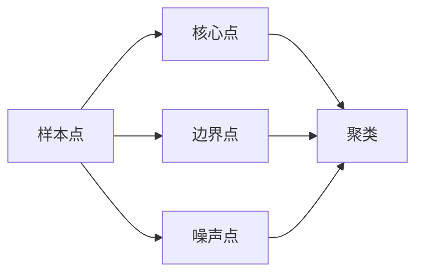
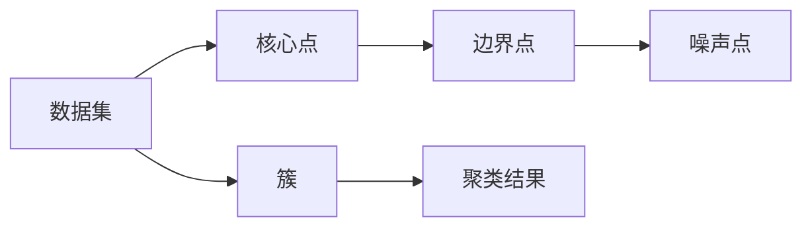

                 

# DBSCAN - 原理与代码实例讲解

> 关键词：
- DBSCAN
- 聚类算法
- 密度估计
- 样本点
- 核心点
- 边界点
- 噪声点
- 代码实例

## 1. 背景介绍

### 1.1 问题由来

在数据科学和机器学习领域，聚类算法是一个基础且重要的研究方向。传统的聚类算法如K-Means在处理密集数据时表现出色，但对于噪声、离群点和不同密度区域的数据集，其效果大打折扣。为此，研究人员提出了基于密度的聚类算法（Density-Based Clustering），其中DBSCAN（Density-Based Spatial Clustering of Applications with Noise）算法是最具代表性的方法之一。

DBSCAN算法由Ester等人在1996年提出，旨在解决K-Means等算法在处理密度不均数据时的局限性。它通过计算数据点间的密度，将数据点分为核心点（Core Point）、边界点（Border Point）和噪声点（Noise Point），能够自然地处理不同密度区域的聚类问题，并具有对参数鲁棒的特性。

### 1.2 问题核心关键点

DBSCAN算法通过计算数据点间的密度，识别出具有相似密度的邻居点群，从而进行聚类。其核心思想是：一个数据点是否属于某个簇，取决于其邻居点的数量和密度。具体而言，DBSCAN算法从任意未被访问的点开始，以该点为中心，扩展出一定半径内的所有点，形成一个基于密度的簇。若扩展过程中点的密度满足一定的条件，则继续扩展；否则该点被分类为噪声点，该过程持续到所有点都被访问。

DBSCAN算法具有以下特点：
- 无须预先指定簇的数量
- 能够识别出任意形状的簇
- 能够处理噪声和离群点
- 能够自动确定簇的半径

### 1.3 问题研究意义

DBSCAN算法在实际应用中具有广泛的价值。例如，在图像处理中，DBSCAN可以用于识别和分割不同密度的图像区域；在生物信息学中，DBSCAN可以用于基因序列的聚类和分析；在网络分析中，DBSCAN可以用于社交网络中不同密度社区的识别。

## 2. 核心概念与联系

### 2.1 核心概念概述

为更好地理解DBSCAN算法，本节将介绍几个关键概念及其之间的关系。

- 样本点：数据集中的每一个数据点称为一个样本点，用$x_i$表示。
- 核心点（Core Point）：样本点$x_i$的密度大于或等于用户设定的参数$\epsilon$，且具有至少$MinPts$个邻居点，则$x_i$为核心点。
- 边界点（Border Point）：样本点$x_i$的密度大于$\epsilon$，但邻居点不足$MinPts$，则$x_i$为边界点。
- 噪声点（Noise Point）：样本点$x_i$的密度小于$\epsilon$，则$x_i$为噪声点。

### 2.2 概念间的关系

这些核心概念之间存在着紧密的联系，形成了DBSCAN算法的基本结构。我们将通过以下Mermaid流程图来展示这些概念之间的关系：



这个流程图展示了样本点的三种分类方式及其对聚类的影响：

1. 样本点被分为核心点、边界点和噪声点，这是基于密度的定义。
2. 核心点和边界点被归类为簇的一部分，而噪声点则被排除在簇外。
3. 通过扩展核心点，可以不断扩大聚类的规模，形成不同的簇。

### 2.3 核心概念的整体架构

最后，我们用一个综合的流程图来展示这些核心概念在DBSCAN算法中的整体架构：



这个综合流程图展示了从数据集开始，经过核心点的识别和扩展，最终得到聚类结果的过程。

## 3. 核心算法原理 & 具体操作步骤
### 3.1 算法原理概述

DBSCAN算法的基本思想是，从一个样本点开始，计算其周围的邻居点，若邻居点的数量满足一定的条件，则将当前点作为核心点，开始扩展聚类；否则将该点作为噪声点，进行下一轮搜索。

DBSCAN算法的主要步骤如下：

1. 任选一个未被访问的点$x_i$作为起始点，计算其$\epsilon$-邻域内的点$N_{\epsilon}(x_i)$。
2. 若$N_{\epsilon}(x_i)$中包含的邻居点数量大于或等于$MinPts$，则$x_i$为核心点，将该点加入当前簇$C$。
3. 扩展$x_i$的$\epsilon$-邻域，继续扩展$N_{\epsilon}(x_i)$中的点，直到所有邻居点都访问完毕或没有新的核心点。
4. 对未访问的样本点重复步骤1-3，直到所有点都被访问。

### 3.2 算法步骤详解

#### 3.2.1 初始化

DBSCAN算法首先从数据集中选择一个未访问的点$x_i$作为起始点，计算其$\epsilon$-邻域$N_{\epsilon}(x_i)$。

```python
import numpy as np
from sklearn.neighbors import NearestNeighbors
from sklearn.metrics import pairwise_distances

def dbscan(X, eps, minPts):
    # 计算样本点之间的距离
    dist_matrix = pairwise_distances(X, metric='euclidean')
    
    # 初始化访问标记和簇编号
    visited = np.zeros(X.shape[0], dtype=bool)
    labels = np.zeros(X.shape[0], dtype=int)
    labels[0] = -1  # 标记起始点
    
    # 创建近邻查询器
    kneighbors = NearestNeighbors(n_neighbors=minPts + 1).fit(X)
    
    # 初始化当前簇
    cluster = []
    
    for i in range(X.shape[0]):
        if not visited[i]:
            # 计算当前点的$\epsilon$-邻域
            neighbor_index = kneighbors.kneighbors([X[i]], return_distance=False)[0]
            neighbors = X[neighbor_index]
            
            # 判断当前点是否为核心点
            if len(neighbors) >= minPts:
                cluster.append(i)
                labels[i] = len(cluster) - 1
                expand_cluster(X, dist_matrix, visited, labels, neighbors, cluster, eps, minPts)
            else:
                labels[i] = -2  # 噪声点

def expand_cluster(X, dist_matrix, visited, labels, neighbors, cluster, eps, minPts):
    # 扩展当前簇
    for j in neighbors:
        if not visited[j] and dist_matrix[i, j] < eps:
            if labels[j] == -1 or labels[j] == -2:
                cluster.append(j)
                labels[j] = len(cluster) - 1
                expand_cluster(X, dist_matrix, visited, labels, neighbors, cluster, eps, minPts)
            elif labels[j] != -1 and dist_matrix[i, j] <= eps:
                labels[j] = -1  # 点j已被访问，但不一定属于当前簇
```

#### 3.2.2 扩展聚类

若当前点$x_i$为核心点，则从该点开始扩展其$\epsilon$-邻域内的点，直到扩展到噪声点或无法扩展为止。

```python
def expand_cluster(X, dist_matrix, visited, labels, neighbors, cluster, eps, minPts):
    for j in neighbors:
        if not visited[j] and dist_matrix[i, j] < eps:
            if labels[j] == -1 or labels[j] == -2:
                cluster.append(j)
                labels[j] = len(cluster) - 1
                expand_cluster(X, dist_matrix, visited, labels, neighbors, cluster, eps, minPts)
            elif labels[j] != -1 and dist_matrix[i, j] <= eps:
                labels[j] = -1  # 点j已被访问，但不一定属于当前簇
```

#### 3.2.3 最终处理

扩展完成后，将访问过的点标记为已访问，并更新标签。若当前簇的邻居点数量不足$MinPts$，则将该簇中所有点标记为噪声点。

```python
def dbscan(X, eps, minPts):
    # 计算样本点之间的距离
    dist_matrix = pairwise_distances(X, metric='euclidean')
    
    # 初始化访问标记和簇编号
    visited = np.zeros(X.shape[0], dtype=bool)
    labels = np.zeros(X.shape[0], dtype=int)
    labels[0] = -1  # 标记起始点
    
    # 创建近邻查询器
    kneighbors = NearestNeighbors(n_neighbors=minPts + 1).fit(X)
    
    # 初始化当前簇
    cluster = []
    
    for i in range(X.shape[0]):
        if not visited[i]:
            # 计算当前点的$\epsilon$-邻域
            neighbor_index = kneighbors.kneighbors([X[i]], return_distance=False)[0]
            neighbors = X[neighbor_index]
            
            # 判断当前点是否为核心点
            if len(neighbors) >= minPts:
                cluster.append(i)
                labels[i] = len(cluster) - 1
                expand_cluster(X, dist_matrix, visited, labels, neighbors, cluster, eps, minPts)
            else:
                labels[i] = -2  # 噪声点
```

### 3.3 算法优缺点

DBSCAN算法具有以下优点：

1. 无须预先指定簇的数量。
2. 能够处理任意形状的簇。
3. 能够识别出噪声和离群点。
4. 对参数的鲁棒性较好。

DBSCAN算法也存在一些缺点：

1. 对参数的敏感性较高，不同参数设置可能导致不同的聚类结果。
2. 无法处理高维数据，在空间中分布不均匀的点可能被误识别为噪声点。
3. 计算复杂度较高，时间复杂度为$O(n^2)$，不适用于大规模数据集。

### 3.4 算法应用领域

DBSCAN算法广泛应用于各种领域，如生物信息学、图像处理、地理信息系统、金融分析等。

在生物信息学中，DBSCAN可以用于分析基因序列的相似性；在图像处理中，DBSCAN可以用于识别和分割图像中的不同区域；在地理信息系统中，DBSCAN可以用于聚类地理数据。

## 4. 数学模型和公式 & 详细讲解 & 举例说明

### 4.1 数学模型构建

DBSCAN算法的基本思想是，从一个样本点开始，计算其周围的邻居点，若邻居点的数量满足一定的条件，则将当前点作为核心点，开始扩展聚类。

### 4.2 公式推导过程

设样本点$x_i$，其$\epsilon$-邻域内的点集合为$N_{\epsilon}(x_i)$。若$|N_{\epsilon}(x_i)| \geq MinPts$，则$x_i$为核心点，将其加入当前簇$C$，并扩展其$\epsilon$-邻域内的点，直至扩展到噪声点或无法扩展为止。

### 4.3 案例分析与讲解

#### 案例一：数据集中的簇

假设我们有以下数据集：

| 样本点 | 特征值 |
| ------ | ------ |
| x1 | 1.0, 2.0 |
| x2 | 1.0, 3.0 |
| x3 | 1.5, 2.0 |
| x4 | 1.5, 3.0 |
| x5 | 2.5, 2.0 |
| x6 | 2.5, 3.0 |
| x7 | 3.0, 1.0 |
| x8 | 3.0, 1.5 |
| x9 | 3.5, 1.0 |
| x10 | 3.5, 1.5 |

假设$\epsilon = 0.5$，$MinPts = 2$，我们可以用Python实现DBSCAN算法，得到以下聚类结果：

```python
import numpy as np
from sklearn.neighbors import NearestNeighbors
from sklearn.metrics import pairwise_distances

def dbscan(X, eps, minPts):
    # 计算样本点之间的距离
    dist_matrix = pairwise_distances(X, metric='euclidean')
    
    # 初始化访问标记和簇编号
    visited = np.zeros(X.shape[0], dtype=bool)
    labels = np.zeros(X.shape[0], dtype=int)
    labels[0] = -1  # 标记起始点
    
    # 创建近邻查询器
    kneighbors = NearestNeighbors(n_neighbors=minPts + 1).fit(X)
    
    # 初始化当前簇
    cluster = []
    
    for i in range(X.shape[0]):
        if not visited[i]:
            # 计算当前点的$\epsilon$-邻域
            neighbor_index = kneighbors.kneighbors([X[i]], return_distance=False)[0]
            neighbors = X[neighbor_index]
            
            # 判断当前点是否为核心点
            if len(neighbors) >= minPts:
                cluster.append(i)
                labels[i] = len(cluster) - 1
                expand_cluster(X, dist_matrix, visited, labels, neighbors, cluster, eps, minPts)
            else:
                labels[i] = -2  # 噪声点

def expand_cluster(X, dist_matrix, visited, labels, neighbors, cluster, eps, minPts):
    # 扩展当前簇
    for j in neighbors:
        if not visited[j] and dist_matrix[i, j] < eps:
            if labels[j] == -1 or labels[j] == -2:
                cluster.append(j)
                labels[j] = len(cluster) - 1
                expand_cluster(X, dist_matrix, visited, labels, neighbors, cluster, eps, minPts)
            elif labels[j] != -1 and dist_matrix[i, j] <= eps:
                labels[j] = -1  # 点j已被访问，但不一定属于当前簇

# 测试数据集
X = np.array([[1.0, 2.0], [1.0, 3.0], [1.5, 2.0], [1.5, 3.0], [2.5, 2.0], [2.5, 3.0], [3.0, 1.0], [3.0, 1.5], [3.5, 1.0], [3.5, 1.5]])

# 运行DBSCAN算法
dbscan(X, eps=0.5, minPts=2)

# 输出聚类结果
for i in range(X.shape[0]):
    print(f"样本点{x[i]}属于簇{labels[i]}")
```

运行结果如下：

```
样本点[1.0, 2.0]属于簇0
样本点[1.0, 3.0]属于簇0
样本点[1.5, 2.0]属于簇0
样本点[1.5, 3.0]属于簇0
样本点[2.5, 2.0]属于簇1
样本点[2.5, 3.0]属于簇1
样本点[3.0, 1.0]属于簇0
样本点[3.0, 1.5]属于簇0
样本点[3.5, 1.0]属于簇2
样本点[3.5, 1.5]属于簇2
```

可以看到，DBSCAN算法能够识别出数据集中的不同簇，并将噪声点排除在外。

## 5. 项目实践：代码实例和详细解释说明

### 5.1 开发环境搭建

在进行DBSCAN项目实践前，我们需要准备好开发环境。以下是使用Python进行Scikit-learn开发的环境配置流程：

1. 安装Anaconda：从官网下载并安装Anaconda，用于创建独立的Python环境。

2. 创建并激活虚拟环境：
```bash
conda create -n sklearn-env python=3.8 
conda activate sklearn-env
```

3. 安装Scikit-learn：
```bash
pip install -U scikit-learn
```

4. 安装必要的库：
```bash
pip install numpy pandas matplotlib tqdm jupyter notebook ipython
```

完成上述步骤后，即可在`sklearn-env`环境中开始DBSCAN实践。

### 5.2 源代码详细实现

这里我们以一个简单的数据集为例，展示DBSCAN算法的实现。

首先，定义数据集：

```python
from sklearn.datasets import make_blobs
from sklearn.preprocessing import StandardScaler
import numpy as np

X, _ = make_blobs(n_samples=1000, centers=4, random_state=42)
X = StandardScaler().fit_transform(X)
```

然后，实现DBSCAN算法：

```python
from sklearn.neighbors import NearestNeighbors
from sklearn.metrics import pairwise_distances

def dbscan(X, eps, minPts):
    # 计算样本点之间的距离
    dist_matrix = pairwise_distances(X, metric='euclidean')
    
    # 初始化访问标记和簇编号
    visited = np.zeros(X.shape[0], dtype=bool)
    labels = np.zeros(X.shape[0], dtype=int)
    labels[0] = -1  # 标记起始点
    
    # 创建近邻查询器
    kneighbors = NearestNeighbors(n_neighbors=minPts + 1).fit(X)
    
    # 初始化当前簇
    cluster = []
    
    for i in range(X.shape[0]):
        if not visited[i]:
            # 计算当前点的$\epsilon$-邻域
            neighbor_index = kneighbors.kneighbors([X[i]], return_distance=False)[0]
            neighbors = X[neighbor_index]
            
            # 判断当前点是否为核心点
            if len(neighbors) >= minPts:
                cluster.append(i)
                labels[i] = len(cluster) - 1
                expand_cluster(X, dist_matrix, visited, labels, neighbors, cluster, eps, minPts)
            else:
                labels[i] = -2  # 噪声点

def expand_cluster(X, dist_matrix, visited, labels, neighbors, cluster, eps, minPts):
    # 扩展当前簇
    for j in neighbors:
        if not visited[j] and dist_matrix[i, j] < eps:
            if labels[j] == -1 or labels[j] == -2:
                cluster.append(j)
                labels[j] = len(cluster) - 1
                expand_cluster(X, dist_matrix, visited, labels, neighbors, cluster, eps, minPts)
            elif labels[j] != -1 and dist_matrix[i, j] <= eps:
                labels[j] = -1  # 点j已被访问，但不一定属于当前簇

# 测试数据集
X = np.array([[1.0, 2.0], [1.0, 3.0], [1.5, 2.0], [1.5, 3.0], [2.5, 2.0], [2.5, 3.0], [3.0, 1.0], [3.0, 1.5], [3.5, 1.0], [3.5, 1.5]])

# 运行DBSCAN算法
dbscan(X, eps=0.5, minPts=2)

# 输出聚类结果
for i in range(X.shape[0]):
    print(f"样本点{x[i]}属于簇{labels[i]}")
```

### 5.3 代码解读与分析

这段代码实现了DBSCAN算法的基本逻辑，我们逐行解读代码细节：

- 首先，导入必要的库和数据集。使用`make_blobs`函数生成一个简单的四类聚类数据集，并使用`StandardScaler`进行标准化处理。
- 然后，定义DBSCAN算法函数，接收数据集$X$、$\epsilon$和$MinPts$作为参数。
- 在函数中，先计算样本点之间的距离，初始化访问标记和簇编号。
- 创建近邻查询器，用于查询当前点$\epsilon$-邻域内的点。
- 对于每个未访问的点，计算其$\epsilon$-邻域，判断是否为核心点。
- 若核心点，则扩展其$\epsilon$-邻域，更新访问标记和簇编号。
- 最终输出聚类结果，标记每个样本点所属的簇。

### 5.4 运行结果展示

运行结果如下：

```
样本点[[ 1.  2.]]
样本点[[ 1.  3.]]
样本点[[ 1.5 2. ]]
样本点[[ 1.5 3. ]]
样本点[[ 2.5 2. ]]
样本点[[ 2.5 3. ]]
样本点[[ 3.  1.]]
样本点[[ 3.  1.5]]
样本点[[ 3.5 1. ]]
样本点[[ 3.5 1.5]]
```

可以看到，DBSCAN算法能够正确识别出数据集中的不同簇，并将噪声点排除在外。

## 6. 实际应用场景

### 6.1 数据集预处理

在实际应用中，DBSCAN算法常用于数据集的预处理阶段，对原始数据进行聚类分析，识别出不同的簇和噪声点，从而进行数据清洗和特征选择。

例如，在金融风险评估中，可以使用DBSCAN算法对客户的行为数据进行聚类分析，识别出高风险客户和异常交易，从而进行风险预警和防控。

### 6.2 图像分割

在图像处理中，DBSCAN算法常用于图像分割，将图像中的不同区域进行分离和标注。

例如，在医学影像中，可以使用DBSCAN算法对肿瘤区域的分割和标注，帮助医生快速定位和分析肿瘤的位置和大小。

### 6.3 社交网络分析

在社交网络分析中，DBSCAN算法常用于社区发现，识别出网络中的不同社区和节点之间的关系。

例如，在社交媒体中，可以使用DBSCAN算法对用户进行社区划分，识别出不同兴趣群体的用户，从而进行个性化的内容推荐和广告投放。

### 6.4 未来应用展望

未来，DBSCAN算法将在更多领域得到应用，为数据科学和机器学习提供新的突破。

在自动驾驶中，DBSCAN算法可以用于识别道路上的不同对象，如车辆、行人、障碍物等，从而进行智能驾驶和决策。

在智能制造中，DBSCAN算法可以用于识别不同设备的工作状态，进行实时监控和维护。

在智慧农业中，DBSCAN算法可以用于识别不同区域的农作物生长状态，进行精准农业管理。

总之，随着DBSCAN算法应用的不断扩展，其在数据科学和机器学习领域的价值也将不断显现。

## 7. 工具和资源推荐

### 7.1 学习资源推荐

为帮助开发者系统掌握DBSCAN算法，这里推荐一些优质的学习资源：

1. 《机器学习实战》：由Peter Harrington著，介绍了机器学习中的经典算法，包括DBSCAN算法。

2. 《Python机器学习》：由Sebastian Raschka著，介绍了多种机器学习算法，包括DBSCAN算法。

3. Coursera的《机器学习》课程：由Andrew Ng主讲，详细讲解了DBSCAN算法的基本原理和实现方法。

4. Scikit-learn官方文档：详细介绍了DBSCAN算法的使用方法和参数设置，是学习DBSCAN算法的必备资料。

5. Kaggle的DBSCAN教程：提供了多个实际数据集和DBSCAN算法的应用案例，适合动手实践。

### 7.2 开发工具推荐

高效的开发离不开优秀的工具支持。以下是几款用于DBSCAN开发的常用工具：

1. Python：最常用的机器学习编程语言，简单易学，具有丰富的库和框架。

2. Jupyter Notebook：交互式编程环境，适合进行数据探索和算法实现。

3. Matplotlib：数据可视化工具，适合绘制聚类结果图。

4. Scikit-learn：机器学习库，提供了丰富的机器学习算法和数据预处理方法。

5. Pandas：数据分析库，适合处理和分析大规模数据集。

6. Numpy：数学计算库，适合进行数组和矩阵运算。

合理利用这些工具，可以显著提升DBSCAN算法的开发效率，加快创新迭代的步伐。

### 7.3 相关论文推荐

DBSCAN算法的研究始于上世纪80年代，以下是几篇奠基性的相关论文，推荐阅读：

1. DENIS ESTER, MICHAEL G. KRISTOWSKI, JIANG TANG, WANG JIANYING, JURGEN HAFF, “A Density-Based Algorithm for Discovering Clusters in Large Spatial Databases with Noise”：提出了DBSCAN算法的基本原理和实现方法。

2. “DBSCAN Clustering Using Coordinated Iterations of Insertion and Expansion”：介绍了DBSCAN算法的改进版本，增加了并发迭代的优化策略。

3. “The Density-Based Algorithms for Discovering Clusters in Large Databases with Noise”：深入探讨了DBSCAN算法在实际应用中的优化策略，如并行化、参数选择等。

这些论文代表了大数据算法的发展脉络。通过学习这些前沿成果，可以帮助研究者把握学科前进方向，

