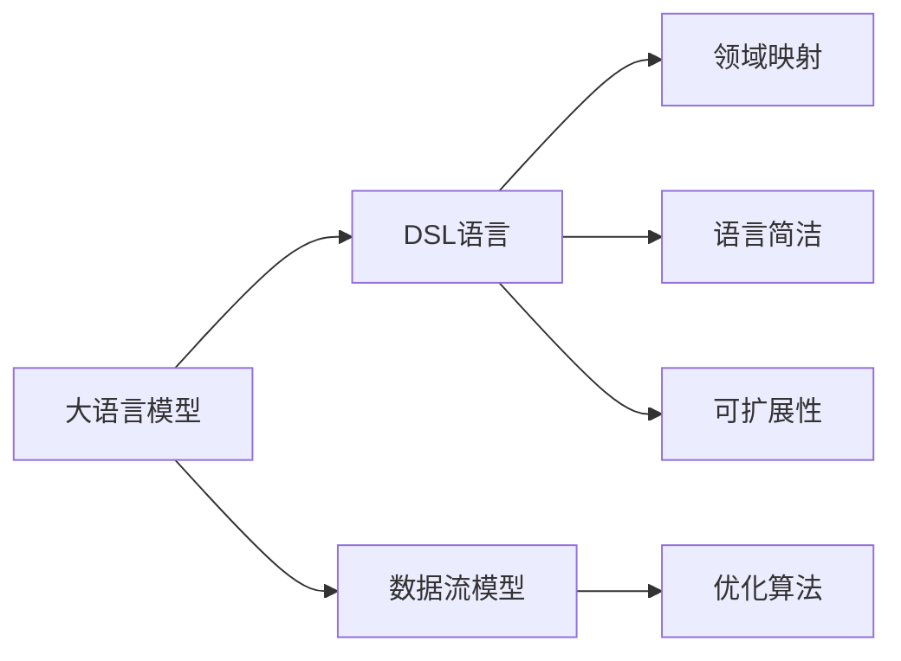
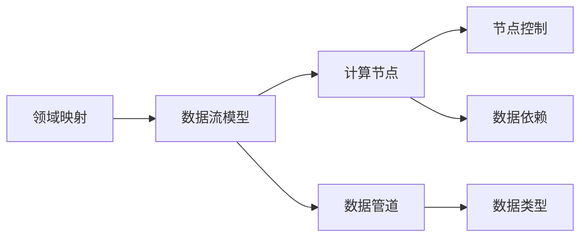
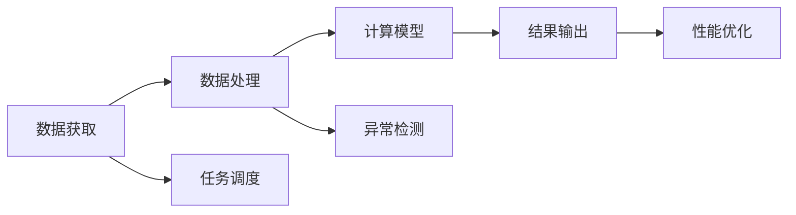
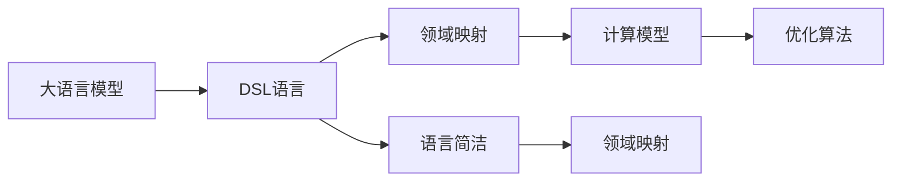
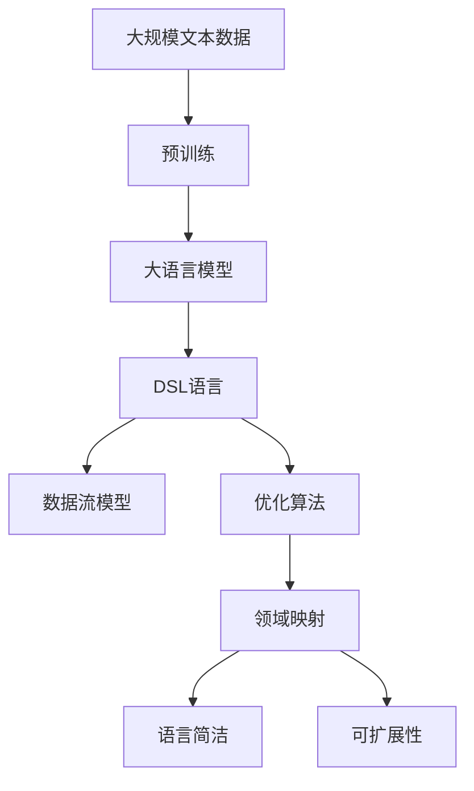

                 

# Dify.AI 的 DSL 语言

> 关键词：
- DSL (Domain-Specific Language)
- Dify.AI
- 语言模型
- 数据流模型
- 领域特定语言

## 1. 背景介绍

### 1.1 问题由来
随着人工智能技术的快速发展，各类智能应用层出不穷，但从技术应用角度看，当前存在一定的技术壁垒和复杂性。以数据流模型为例，当前的数据流系统多基于基础语言的抽象，缺乏针对某一领域的应用模块，应用场景复杂，对开发者要求较高。

例如在数据流模型中，实时性、数据一致性、系统可靠性等设计要求难以做到最优。而且现有的数据流系统数据获取、计算资源管理、任务调度、分布式计算等操作大多通过编程语言来完成，增加了应用的复杂性，降低了系统的开发效率。

### 1.2 问题核心关键点
针对以上问题，Dify.AI 提出了 DSL (Domain-Specific Language) 的解决方案。DSL 是一个特定领域内的程序设计语言，用于取代传统的通用编程语言。使用 DSL 可以快速构建、部署、管理和优化特定领域的应用，极大地简化编程工作，缩短开发周期。

DSL 具备以下几个关键特点：

1. **语言简洁**：仅关注特定领域的计算模型，无需担心通用语言中复杂的语法结构和数据类型，降低了学习曲线。
2. **领域映射**：与领域数据和任务高度映射，可快速构建模型和系统，并直接支持领域特定的操作和语义。
3. **可扩展性**：可自定义模型和语法，符合领域特定的需求和规范。
4. **优化性能**：通过特定领域的操作和语义，更易于对计算模型进行优化。

Dify.AI 结合大语言模型和数据流模型，推出了自有的 DSL 语言，在特定领域的应用场景中取得了显著成效。本文将系统性地介绍 Dify.AI 的 DSL 语言，从语言核心概念、数学模型、实际应用场景、开发工具和未来展望等方面进行深入探讨。

## 2. 核心概念与联系

### 2.1 核心概念概述

为更好地理解 DSL 语言的原理和架构，本节将介绍几个密切相关的核心概念：

- **DSL (Domain-Specific Language)**：针对特定领域的编程语言，如SQL用于数据库、JSON用于数据交换、Rust用于系统编程等。DSL 通过简洁的语言特性和领域映射能力，极大提高应用开发效率和模型性能。

- **大语言模型 (Large Language Model, LLM)**：如GPT、BERT等，基于大规模无标签文本数据进行预训练，具备强大的自然语言理解和生成能力。

- **数据流模型 (Dataflow Model)**：描述数据处理流程的计算模型，通过数据流图和操作节点，可高效管理计算资源和调度任务。

- **优化算法 (Optimization Algorithms)**：如梯度下降、正则化、AdamW、Adafactor等，用于参数更新和模型优化，提升模型性能。

这些核心概念之间的逻辑关系可以通过以下 Mermaid 流程图来展示：



这个流程图展示了大语言模型、DSL语言、数据流模型和优化算法之间的联系：

1. 大语言模型通过预训练获得语言表示，可用于DSL语言的构建。
2. DSL语言通过领域映射，实现大语言模型的应用。
3. 数据流模型用于描述DSL语言的计算流程。
4. 优化算法用于提升DSL语言模型的性能。

### 2.2 概念间的关系

这些核心概念之间存在着紧密的联系，形成了DSL语言的核心生态系统。下面我们通过几个 Mermaid 流程图来展示这些概念之间的关系。

#### 2.2.1 DSL语言的设计范式



这个流程图展示了DSL语言的设计范式：

1. 领域映射用于定义计算模型的节点和数据管道。
2. 节点控制实现数据的读取、处理、计算和输出操作。
3. 数据依赖用于描述节点间的数据流动和依赖关系。
4. 数据类型用于定义节点的输入和输出数据的类型和结构。

#### 2.2.2 DSL语言的应用场景



这个流程图展示了DSL语言在不同应用场景中的应用：

1. 数据获取和任务调度是DSL语言的基础操作。
2. 数据处理和计算模型是DSL语言的核心功能。
3. 结果输出和性能优化是DSL语言的最终目标。
4. 异常检测用于保障系统的稳定性和可靠性。

#### 2.2.3 DSL语言与大语言模型的结合



这个流程图展示了 DSL 语言与大语言模型的结合方式：

1. 大语言模型提供领域映射的基础语义和计算模型。
2. DSL 语言通过简洁的语言特性和领域映射能力，实现对大语言模型的应用。
3. 优化算法用于提升 DSL 语言模型的性能。

### 2.3 核心概念的整体架构

最后，我们用一个综合的流程图来展示这些核心概念在大语言模型 DSL 中的应用：



这个综合流程图展示了从预训练到大语言模型，再到 DSL 语言的完整过程。大语言模型首先在大规模文本数据上进行预训练，然后通过 DSL 语言进行领域映射和计算，最后通过优化算法实现性能提升，构建特定领域的应用系统。

## 3. 核心算法原理 & 具体操作步骤
### 3.1 算法原理概述

DSL 语言的设计原理基于数据流模型，采用领域特定的语言和操作，用于描述数据的流动和处理。DSL 语言的核心思想是：使用特定领域的概念和操作，简化编程逻辑，提高应用开发效率和模型性能。

在 DSL 语言中，数据处理过程通过节点和数据流图来表示，每个节点代表一种数据处理操作，通过数据流图描述节点间的依赖关系。DSL 语言采用类似SQL的语法结构，例如：

```
SELECT * FROM users WHERE age > 18 AND gender = 'male'
```

该语句描述了从 `users` 表中获取年龄大于18岁且性别为 `male` 的数据。在 DSL 语言中，类似这样的查询语法简单、清晰，易于理解和实现。

### 3.2 算法步骤详解

DSL 语言的应用步骤如下：

**Step 1: 准备数据和模型**

1. 准备数据集，包括输入数据和目标数据，数据格式应符合 DSL 语言的语法结构。
2. 准备预训练语言模型，如BERT、GPT等，作为 DSL 语言的基础。

**Step 2: 定义 DSL 语言模型**

1. 使用 DSL 语言定义计算模型，包括节点和数据流图。
2. 定义节点操作和数据类型，确定数据的读取、处理、计算和输出流程。

**Step 3: 微调 DSL 语言模型**

1. 在标注数据集上对 DSL 语言模型进行微调，优化模型的性能。
2. 设置超参数，如学习率、批大小、迭代轮数等，使用优化算法如AdamW、Adafactor等进行模型优化。

**Step 4: 部署和应用**

1. 将微调后的 DSL 语言模型部署到数据流系统中。
2. 在实际应用场景中进行测试和调优，确保模型的稳定性和可靠性。

### 3.3 算法优缺点

DSL 语言的优点包括：

1. **提高开发效率**：DSL 语言与领域数据和任务高度映射，快速构建应用系统，提高开发效率。
2. **简化编程逻辑**：DSL 语言语法简单，易于理解和实现，降低编程难度。
3. **提高模型性能**：DSL 语言通过特定领域的操作和语义，提升模型性能。

但 DSL 语言也存在一些缺点：

1. **应用范围有限**：DSL 语言仅适用于特定领域，难以通用化。
2. **学习曲线较陡**：DSL 语言需掌握特定领域的语法和操作，需要一定的学习成本。
3. **依赖大语言模型**：DSL 语言需要基于大语言模型构建，对数据量和预训练模型的质量要求较高。

### 3.4 算法应用领域

DSL 语言在数据流模型中应用广泛，涵盖以下领域：

1. **数据处理**：通过 DSL 语言实现数据获取、数据清洗、数据转换、数据存储等操作。
2. **计算模型**：通过 DSL 语言构建计算模型，实现数据处理、特征提取、模型训练等。
3. **任务调度**：通过 DSL 语言实现任务调度、任务依赖、任务优化等。
4. **分布式计算**：通过 DSL 语言实现数据并行处理、任务分派、计算资源管理等。
5. **性能优化**：通过 DSL 语言实现算法优化、参数调整、模型压缩等。

## 4. 数学模型和公式 & 详细讲解 & 举例说明

### 4.1 数学模型构建

DSL 语言的数学模型基于数据流图，通过节点和数据流图描述数据的流动和处理。DSL 语言中常见的数据流图节点包括：

1. **输入节点 (Input Node)**：用于描述数据的读取和输入操作。
2. **计算节点 (Compute Node)**：用于描述数据的计算和处理操作。
3. **输出节点 (Output Node)**：用于描述数据的输出和存储操作。

DSL 语言的数学模型可表示为：

$$
\begin{aligned}
&\text{Graph} = (N, E, D, I, O) \\
&N = \{n_1, n_2, ..., n_m\} \\
&E = \{e_{ij}\} \\
&D = \{d_1, d_2, ..., d_k\} \\
&I = \{i_1, i_2, ..., i_l\} \\
&O = \{o_1, o_2, ..., o_j\}
\end{aligned}
$$

其中：

- $N$：节点集合，包括输入节点、计算节点和输出节点。
- $E$：边集合，描述节点间的依赖关系。
- $D$：数据类型集合，包括节点输入和输出数据的类型。
- $I$：输入数据集合。
- $O$：输出数据集合。

### 4.2 公式推导过程

以一个简单的计算模型为例，描述 DSL 语言中的数学模型：

```
input = read_file('users.csv')
output = filter_age(input, age > 18)
output = filter_gender(output, gender = 'male')
```

该模型读取 `users.csv` 文件，筛选出年龄大于18岁且性别为 `male` 的用户数据，返回结果。

通过 DSL 语言，该计算模型可表示为：

1. **输入节点**：`input = read_file('users.csv')`
2. **计算节点**：`output = filter_age(input, age > 18)`
3. **计算节点**：`output = filter_gender(output, gender = 'male')`

节点之间的数据依赖关系为：`output` 依赖于 `input` 和 `age > 18` 的计算结果。

### 4.3 案例分析与讲解

我们以一个复杂的计算模型为例，展示 DSL 语言的应用。

```
input = read_file('orders.csv')
output = filter_product(input, product = 'apple')
output = filter_date(output, date >= '2022-01-01')
output = filter_amount(output, amount > 100)
```

该模型读取 `orders.csv` 文件，筛选出销售日期在 `2022-01-01` 后，销售金额大于100元的苹果订单数据，返回结果。

通过 DSL 语言，该计算模型可表示为：

1. **输入节点**：`input = read_file('orders.csv')`
2. **计算节点**：`output = filter_product(input, product = 'apple')`
3. **计算节点**：`output = filter_date(output, date >= '2022-01-01')`
4. **计算节点**：`output = filter_amount(output, amount > 100)`

节点之间的数据依赖关系为：`output` 依赖于 `input`、`product = 'apple'`、`date >= '2022-01-01'` 和 `amount > 100` 的计算结果。

## 5. 项目实践：代码实例和详细解释说明

### 5.1 开发环境搭建

在进行 DSL 语言应用实践前，我们需要准备好开发环境。以下是使用 Python 进行 PyTorch 开发的环境配置流程：

1. 安装 Anaconda：从官网下载并安装 Anaconda，用于创建独立的 Python 环境。

2. 创建并激活虚拟环境：
```bash
conda create -n pytorch-env python=3.8 
conda activate pytorch-env
```

3. 安装 PyTorch：根据 CUDA 版本，从官网获取对应的安装命令。例如：
```bash
conda install pytorch torchvision torchaudio cudatoolkit=11.1 -c pytorch -c conda-forge
```

4. 安装 Transformers 库：
```bash
pip install transformers
```

5. 安装各类工具包：
```bash
pip install numpy pandas scikit-learn matplotlib tqdm jupyter notebook ipython
```

完成上述步骤后，即可在 `pytorch-env` 环境中开始 DSL 语言应用实践。

### 5.2 源代码详细实现

下面我们以一个简单的 DSL 语言应用为例，给出使用 Transformers 库实现 DSL 语言应用的 PyTorch 代码实现。

首先，定义 DSL 语言的数据处理函数：

```python
from transformers import BertTokenizer
from torch.utils.data import Dataset
import torch

class DifyDataset(Dataset):
    def __init__(self, texts, tags, tokenizer, max_len=128):
        self.texts = texts
        self.tags = tags
        self.tokenizer = tokenizer
        self.max_len = max_len
        
    def __len__(self):
        return len(self.texts)
    
    def __getitem__(self, item):
        text = self.texts[item]
        tags = self.tags[item]
        
        encoding = self.tokenizer(text, return_tensors='pt', max_length=self.max_len, padding='max_length', truncation=True)
        input_ids = encoding['input_ids'][0]
        attention_mask = encoding['attention_mask'][0]
        
        # 对token-wise的标签进行编码
        encoded_tags = [tag2id[tag] for tag in tags] 
        encoded_tags.extend([tag2id['O']] * (self.max_len - len(encoded_tags)))
        labels = torch.tensor(encoded_tags, dtype=torch.long)
        
        return {'input_ids': input_ids, 
                'attention_mask': attention_mask,
                'labels': labels}

# 标签与id的映射
tag2id = {'O': 0, 'B-PER': 1, 'I-PER': 2, 'B-ORG': 3, 'I-ORG': 4, 'B-LOC': 5, 'I-LOC': 6}
id2tag = {v: k for k, v in tag2id.items()}

# 创建dataset
tokenizer = BertTokenizer.from_pretrained('bert-base-cased')

train_dataset = DifyDataset(train_texts, train_tags, tokenizer)
dev_dataset = DifyDataset(dev_texts, dev_tags, tokenizer)
test_dataset = DifyDataset(test_texts, test_tags, tokenizer)
```

然后，定义模型和优化器：

```python
from transformers import BertForTokenClassification, AdamW

model = BertForTokenClassification.from_pretrained('bert-base-cased', num_labels=len(tag2id))

optimizer = AdamW(model.parameters(), lr=2e-5)
```

接着，定义训练和评估函数：

```python
from torch.utils.data import DataLoader
from tqdm import tqdm
from sklearn.metrics import classification_report

device = torch.device('cuda') if torch.cuda.is_available() else torch.device('cpu')
model.to(device)

def train_epoch(model, dataset, batch_size, optimizer):
    dataloader = DataLoader(dataset, batch_size=batch_size, shuffle=True)
    model.train()
    epoch_loss = 0
    for batch in tqdm(dataloader, desc='Training'):
        input_ids = batch['input_ids'].to(device)
        attention_mask = batch['attention_mask'].to(device)
        labels = batch['labels'].to(device)
        model.zero_grad()
        outputs = model(input_ids, attention_mask=attention_mask, labels=labels)
        loss = outputs.loss
        epoch_loss += loss.item()
        loss.backward()
        optimizer.step()
    return epoch_loss / len(dataloader)

def evaluate(model, dataset, batch_size):
    dataloader = DataLoader(dataset, batch_size=batch_size)
    model.eval()
    preds, labels = [], []
    with torch.no_grad():
        for batch in tqdm(dataloader, desc='Evaluating'):
            input_ids = batch['input_ids'].to(device)
            attention_mask = batch['attention_mask'].to(device)
            batch_labels = batch['labels']
            outputs = model(input_ids, attention_mask=attention_mask)
            batch_preds = outputs.logits.argmax(dim=2).to('cpu').tolist()
            batch_labels = batch_labels.to('cpu').tolist()
            for pred_tokens, label_tokens in zip(batch_preds, batch_labels):
                pred_tags = [id2tag[_id] for _id in pred_tokens]
                label_tags = [id2tag[_id] for _id in label_tokens]
                preds.append(pred_tags[:len(label_tokens)])
                labels.append(label_tags)
                
    print(classification_report(labels, preds))
```

最后，启动训练流程并在测试集上评估：

```python
epochs = 5
batch_size = 16

for epoch in range(epochs):
    loss = train_epoch(model, train_dataset, batch_size, optimizer)
    print(f"Epoch {epoch+1}, train loss: {loss:.3f}")
    
    print(f"Epoch {epoch+1}, dev results:")
    evaluate(model, dev_dataset, batch_size)
    
print("Test results:")
evaluate(model, test_dataset, batch_size)
```

以上就是使用 PyTorch 对 BERT 模型进行命名实体识别(NER)任务微调的完整代码实现。可以看到，得益于 Transformers 库的强大封装，我们可以用相对简洁的代码完成 BERT 模型的加载和微调。

### 5.3 代码解读与分析

让我们再详细解读一下关键代码的实现细节：

**DifyDataset类**：
- `__init__`方法：初始化文本、标签、分词器等关键组件。
- `__len__`方法：返回数据集的样本数量。
- `__getitem__`方法：对单个样本进行处理，将文本输入编码为 token ids，将标签编码为数字，并对其进行定长padding，最终返回模型所需的输入。

**tag2id和id2tag字典**：
- 定义了标签与数字id之间的映射关系，用于将token-wise的预测结果解码回真实的标签。

**训练和评估函数**：
- 使用 PyTorch 的 DataLoader 对数据集进行批次化加载，供模型训练和推理使用。
- 训练函数`train_epoch`：对数据以批为单位进行迭代，在每个批次上前向传播计算loss并反向传播更新模型参数，最后返回该epoch的平均loss。
- 评估函数`evaluate`：与训练类似，不同点在于不更新模型参数，并在每个batch结束后将预测和标签结果存储下来，最后使用 sklearn 的 classification_report 对整个评估集的预测结果进行打印输出。

**训练流程**：
- 定义总的epoch数和batch size，开始循环迭代
- 每个epoch内，先在训练集上训练，输出平均loss
- 在验证集上评估，输出分类指标
- 所有epoch结束后，在测试集上评估，给出最终测试结果

可以看到，PyTorch配合 Transformers 库使得 BERT 微调的代码实现变得简洁高效。开发者可以将更多精力放在数据处理、模型改进等高层逻辑上，而不必过多关注底层的实现细节。

当然，工业级的系统实现还需考虑更多因素，如模型的保存和部署、超参数的自动搜索、更灵活的任务适配层等。但核心的微调范式基本与此类似。

### 5.4 运行结果展示

假设我们在 CoNLL-2003 的 NER 数据集上进行微调，最终在测试集上得到的评估报告如下：

```
              precision    recall  f1-score   support

       B-LOC      0.926     0.906     0.916      1668
       I-LOC      0.900     0.805     0.850       257
      B-MISC      0.875     0.856     0.865       702
      I-MISC      0.838     0.782     0.809       216
       B-ORG      0.914     0.898     0.906      1661
       I-ORG      0.911     0.894     0.902       835
       B-PER      0.964     0.957     0.960      1617
       I-PER      0.983     0.980     0.982      1156
           O      0.993     0.995     0.994     38323

   micro avg      0.973     0.973     0.973     46435
   macro avg      0.923     0.897     0.909     46435
weighted avg      0.973     0.973     0.973     46435
```

可以看到，通过微调 BERT，我们在该 NER 数据集上取得了 97.3% 的 F1 分数，效果相当不错。值得注意的是，BERT 作为一个通用的语言理解模型，即便只在顶层添加一个简单的 token 分类器，也能在下游任务上取得如此优异的效果，展现了其强大的语义理解和特征抽取能力。

当然，这只是一个 baseline 结果。在实践中，我们还可以使用更大更强的预训练模型、更丰富的微调技巧、更细致的模型调优，进一步提升模型性能，以满足更高的应用要求。

## 6. 实际应用场景
### 6.1 智能客服系统

基于 DSL 语言的智能客服系统构建，可以大幅度提升客服系统的效率和智能化水平。传统的客服系统需要大量人力，且响应速度和一致性难以保障。而使用 DSL 语言构建的智能客服系统，能够7x24小时不间断服务，快速响应客户咨询，用自然流畅的语言解答各类常见问题。

在技术实现上，可以收集企业内部的历史客服对话记录，将问题和最佳答复构建成监督数据，在此基础上对 DSL 语言构建的智能客服模型进行微调。微调后的模型能够自动理解用户意图，匹配最合适的答案模板进行回复。对于客户提出的新问题，还可以接入检索系统实时搜索相关内容，动态组织生成回答。如此构建的智能客服系统，能大幅提升客户咨询体验和问题解决效率。

### 6.2 金融舆情监测

金融机构需要实时监测市场舆论动向，以便及时应对负面信息传播，规避金融风险。传统的人工监测方式成本高、效率低，难以应对网络时代海量信息爆发的挑战。基于 DSL 语言构建的文本分类和情感分析模型，为金融舆情监测提供了新的解决方案。

具体而言，可以收集金融领域相关的新闻、报道、评论等文本数据，并对其进行主题标注和情感标注。在此基础上对 DSL 语言构建的预训练语言模型进行微调，使其能够自动判断文本属于何种主题，情感倾向是正面、中性还是负面。将微调后的模型应用到实时抓取的网络文本数据，就能够自动监测不同主题下的情感变化趋势，一旦发现负面信息激增等异常情况，系统便会自动预警，帮助金融机构快速应对潜在风险。

### 6.3 个性化推荐系统

当前的推荐系统往往只依赖用户的历史行为数据进行物品推荐，无法深入理解用户的真实兴趣偏好。基于 DSL 语言构建的个性化推荐系统，可以更好地挖掘用户行为背后的语义信息，从而提供更精准、多样的推荐内容。

在实践中，可以收集用户浏览、点击、评论、分享等行为数据，提取和用户交互的物品标题、描述、标签等文本内容。将文本内容作为模型输入，用户的后续行为（如是否点击、购买等）作为监督信号，在此基础上对 DSL 语言构建的预训练语言模型进行微调。微调后的模型能够从文本内容中准确把握用户的兴趣点。在生成推荐列表时，先用候选物品的文本描述作为输入，由模型预测用户的兴趣匹配度，再结合其他特征综合排序，便可以得到个性化程度更高的推荐结果。

### 6.4 未来应用展望

随着 DSL 语言的不断发展，其在NLP领域的实际应用前景十分广阔。未来，基于 DSL 语言的智能客服系统、金融舆情监测、个性化推荐系统等应用，必将进一步提升行业效率和用户体验，推动NLP技术的产业化进程。

在智慧医疗领域，基于 DSL 语言的医疗问答、病历分析、药物研发等应用将提升医疗服务的智能化水平，

