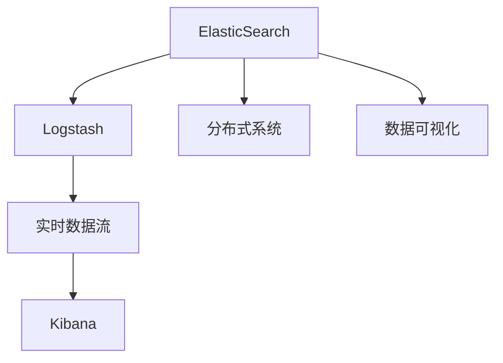
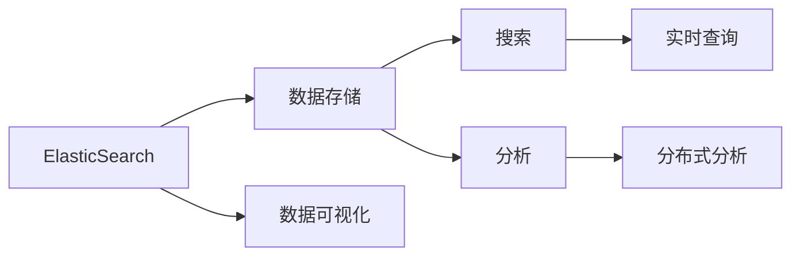
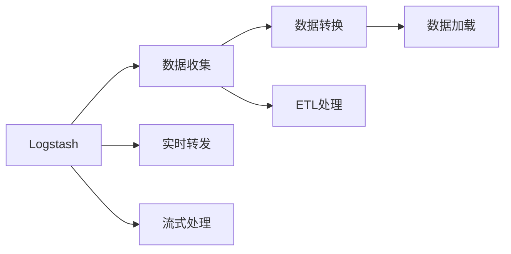
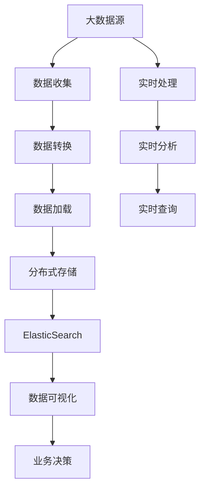

                 

# ElasticSearch Logstash原理与代码实例讲解

> 关键词：ElasticSearch, Logstash, 数据处理, 实时数据流, 日志分析, 分布式系统

## 1. 背景介绍

### 1.1 问题由来

随着互联网和云计算的快速发展，大数据时代的到来使得企业在数据收集、存储、分析和应用方面面临着前所未有的挑战。传统的中心化数据存储和处理方式已经无法满足现代业务的高要求。而基于分布式系统的ElasticSearch和Logstash，通过强大的数据处理能力和实时性，成为了解决这一问题的重要工具。

### 1.2 问题核心关键点

ElasticSearch和Logstash是Elastic Stack中的两个重要组成部分，分别承担了数据存储和数据处理的任务。ElasticSearch提供了强大的搜索和分析能力，而Logstash则负责实时收集、处理和转发数据。这两者的结合，使得企业能够高效地管理和利用数据，从中提取有价值的信息，以支持业务决策和运营优化。

### 1.3 问题研究意义

掌握ElasticSearch和Logstash的原理与代码实现，对于大数据时代的企业来说，具有重要的研究意义。它可以：

1. **提升数据处理效率**：通过实时数据流处理，ElasticSearch和Logstash可以高效地处理和分析海量数据，加速业务决策。
2. **增强数据可视化能力**：ElasticSearch提供了丰富的可视化工具，帮助企业更好地理解数据。
3. **支持复杂数据处理场景**：Logstash支持各种复杂的数据处理逻辑，能够应对多样化的数据源和业务需求。
4. **促进业务创新**：基于ElasticSearch和Logstash的数据分析，企业可以发现新的业务机会，推动业务创新。

## 2. 核心概念与联系

### 2.1 核心概念概述

为更好地理解ElasticSearch和Logstash的原理与代码实现，我们首先介绍一些核心概念：

- **ElasticSearch**：一种分布式搜索和分析引擎，支持实时搜索、数据分析、全文检索等功能。
- **Logstash**：一种流处理引擎，可以实时收集、处理和转发各种形式的数据，支持数据提取、转换和加载(ETL)。
- **数据流处理**：指在实时数据流中，对数据进行抽取、转换和加载的操作，通常用于大数据分析和实时数据处理。
- **分布式系统**：由多个计算机节点组成，通过网络协同工作的系统，可以提高系统的可扩展性和容错性。
- **Elastic Stack**：包括ElasticSearch、Logstash和Kibana三个重要组件，用于数据存储、处理和可视化。

这些核心概念之间的逻辑关系可以通过以下Mermaid流程图来展示：



这个流程图展示了大数据处理过程中各个组件的功能和关系：

1. **ElasticSearch**：作为数据存储和分析引擎，提供搜索和分析能力。
2. **Logstash**：负责实时数据流的处理，对数据进行ETL操作。
3. **分布式系统**：通过多个节点协同工作，支持海量数据的处理和分析。
4. **Kibana**：数据可视化和报告工具，帮助用户理解数据。
5. **数据可视化**：通过丰富的图表展示数据，支持业务决策和运营优化。

### 2.2 概念间的关系

这些核心概念之间存在着紧密的联系，形成了ElasticSearch和Logstash的功能生态系统。下面我们通过几个Mermaid流程图来展示这些概念之间的关系。

#### 2.2.1 ElasticSearch的数据处理流程



这个流程图展示了ElasticSearch的基本数据处理流程：

1. **数据存储**：ElasticSearch将数据存储在分布式节点中，支持高可扩展性。
2. **搜索**：通过搜索API，用户可以快速查询数据。
3. **分析**：利用ElasticSearch的分析API，对数据进行深入分析。
4. **实时查询**：支持实时的搜索和分析，满足业务对数据处理的低延迟需求。
5. **分布式分析**：通过分布式计算，处理海量数据。
6. **数据可视化**：通过Kibana可视化工具，帮助用户理解数据。

#### 2.2.2 Logstash的数据流处理流程



这个流程图展示了Logstash的基本数据流处理流程：

1. **数据收集**：从各种数据源中收集数据。
2. **数据转换**：对数据进行格式转换和过滤操作。
3. **数据加载**：将处理后的数据加载到目标存储系统中。
4. **ETL处理**：从数据源到目标存储的全流程数据处理。
5. **实时转发**：实时将数据转发到目标系统，满足业务对数据处理的低延迟需求。
6. **流式处理**：支持实时数据流的处理，满足业务对数据处理的实时性要求。

### 2.3 核心概念的整体架构

最后，我们用一个综合的流程图来展示这些核心概念在大数据处理中的整体架构：



这个综合流程图展示了大数据处理过程中各个组件的协作：

1. **大数据源**：原始数据来自各种渠道，包括网络日志、传感器数据、金融交易记录等。
2. **数据收集**：通过Logstash等工具从数据源中收集数据。
3. **数据转换**：对收集到的数据进行格式转换和过滤操作。
4. **数据加载**：将处理后的数据加载到分布式存储系统中。
5. **分布式存储**：支持海量数据的存储和管理。
6. **ElasticSearch**：提供分布式搜索和分析能力。
7. **数据可视化**：通过Kibana等工具展示数据，支持业务决策和运营优化。
8. **实时处理**：支持实时数据流的处理，满足业务对数据处理的低延迟需求。
9. **实时分析**：对实时数据进行分析和计算，支持业务对数据处理的实时性要求。
10. **实时查询**：支持实时搜索和分析，满足业务对数据处理的低延迟需求。

## 3. 核心算法原理 & 具体操作步骤
### 3.1 算法原理概述

ElasticSearch和Logstash的核心算法原理主要基于分布式系统和数据流处理技术。其基本原理可以概括为：

- **分布式系统**：通过多个计算机节点的协同工作，实现海量数据的处理和存储。
- **数据流处理**：在实时数据流中，对数据进行抽取、转换和加载的操作，支持实时数据处理。

在分布式系统中，ElasticSearch和Logstash通过节点间的通信和同步，确保数据的正确性和一致性。数据流处理则通过管道(Pipe)的方式，将数据从数据源端传递到目标存储端，支持复杂的数据处理逻辑。

### 3.2 算法步骤详解

下面是ElasticSearch和Logstash的基本操作步骤：

1. **数据收集**：通过Logstash从各种数据源中收集数据，包括日志文件、数据库记录、网络流量等。
2. **数据转换**：对收集到的数据进行格式转换和过滤操作，例如将JSON数据转换为CSV格式，过滤掉无用字段。
3. **数据加载**：将处理后的数据加载到ElasticSearch集群中，进行分布式存储和管理。
4. **数据搜索与分析**：通过ElasticSearch进行搜索和分析，支持实时查询和分布式计算。
5. **数据可视化**：通过Kibana等工具展示数据，支持业务决策和运营优化。

### 3.3 算法优缺点

ElasticSearch和Logstash的数据处理系统具有以下优点：

- **高可扩展性**：通过分布式系统，支持海量数据的存储和处理。
- **高实时性**：支持实时数据流的处理，满足业务对数据处理的低延迟需求。
- **高可靠性**：通过节点冗余和数据复制，确保数据的可靠性和一致性。
- **易用性**：提供了丰富的API和可视化工具，支持业务快速部署和应用。

同时，该系统也存在以下缺点：

- **复杂度较高**：分布式系统和数据流处理的复杂度较高，需要较高的技术水平。
- **存储成本较高**：海量数据的存储需要大量的存储资源。
- **性能瓶颈**：在数据量巨大时，数据处理和存储的性能可能会受限。

### 3.4 算法应用领域

ElasticSearch和Logstash被广泛应用于以下几个领域：

- **日志分析**：对网络日志、应用日志等进行实时分析和监控。
- **实时数据处理**：对实时数据流进行处理和分析，支持业务决策。
- **搜索引擎**：构建搜索引擎，支持快速搜索和查询。
- **大数据分析**：支持大数据的存储、处理和分析，提取有价值的信息。
- **业务监控**：对业务系统的运行状态进行实时监控和分析。

## 4. 数学模型和公式 & 详细讲解 & 举例说明

### 4.1 数学模型构建

在大数据处理中，ElasticSearch和Logstash的核心算法通常基于分布式系统和数据流处理模型。以下是一些基本的数学模型：

- **分布式系统模型**：
  - 节点数 $N$：分布式系统中节点的数量。
  - 数据块数 $B$：将数据分成的数据块数量。
  - 数据块大小 $S$：每个数据块的大小。

  数据块的分布计算模型为：

  $$
  D = \frac{T}{S \times B}
  $$

  其中 $T$ 为总数据量。

- **数据流处理模型**：
  - 数据流速率 $R$：每秒处理的数据量。
  - 数据流大小 $S$：处理的数据量。
  - 数据处理时间 $T$：处理数据所需的时间。

  数据流的处理模型为：

  $$
  T = \frac{S}{R}
  $$

### 4.2 公式推导过程

我们以ElasticSearch的分布式存储为例，推导其数据存储和查询的数学模型。

假设ElasticSearch集群中有 $N$ 个节点，每个节点的存储空间为 $C$，总数据量为 $T$，数据块大小为 $S$。

- **数据存储模型**：
  - 每个数据块在集群中的存储位置 $P$：
    $$
    P = \frac{T}{S \times N}
    $$
  - 每个数据块在集群中的存储节点数 $C$：
    $$
    C = \frac{T}{S \times B}
    $$

- **数据查询模型**：
  - 每个查询的计算时间 $T_{q}$：
    $$
    T_{q} = \frac{S}{R}
    $$
  - 每个查询的响应时间 $T_{r}$：
    $$
    T_{r} = \frac{T_{q}}{N}
    $$

其中，$N$ 表示节点数，$B$ 表示数据块数，$S$ 表示数据块大小，$T$ 表示总数据量，$R$ 表示数据流速率。

### 4.3 案例分析与讲解

假设我们在ElasticSearch集群中进行一个实时搜索查询，查询条件为关键字为“ElasticSearch”的文档，共返回100个结果。

- **数据存储模型**：
  - 集群中有10个节点，每个节点存储空间为2TB，总数据量为200GB，数据块大小为4GB。
  - 每个数据块在集群中的存储位置 $P$：
    $$
    P = \frac{200GB}{4GB \times 10} = 5
    $$
  - 每个数据块在集群中的存储节点数 $C$：
    $$
    C = \frac{200GB}{4GB \times 50} = 2
    $$

- **数据查询模型**：
  - 每个查询的计算时间 $T_{q}$：
    $$
    T_{q} = \frac{4GB}{1GB/s} = 4s
    $$
  - 每个查询的响应时间 $T_{r}$：
    $$
    T_{r} = \frac{4s}{10} = 0.4s
    $$

以上案例分析展示了ElasticSearch的数据存储和查询模型的具体应用。通过数学模型和公式推导，可以更好地理解ElasticSearch的分布式存储和查询机制。

## 5. 项目实践：代码实例和详细解释说明

### 5.1 开发环境搭建

在进行ElasticSearch和Logstash的开发实践前，我们需要准备好开发环境。以下是使用Python进行ElasticSearch和Logstash开发的环境配置流程：

1. 安装Anaconda：从官网下载并安装Anaconda，用于创建独立的Python环境。

2. 创建并激活虚拟环境：
```bash
conda create -n elasticsearch-env python=3.8 
conda activate elasticsearch-env
```

3. 安装ElasticSearch和Logstash：根据系统架构和资源需求，下载并安装对应的ElasticSearch和Logstash版本。例如，可以在Linux上使用以下命令安装ElasticSearch：
```bash
wget https://artifacts.elastic.co/downloads/elasticsearch/elasticsearch-7.14.1-amd64.deb
sudo dpkg -i elasticsearch-7.14.1-amd64.deb
```

4. 安装Kibana：
```bash
wget https://artifacts.elastic.co/downloads/kibana/kibana-7.14.1-amd64.deb
sudo dpkg -i kibana-7.14.1-amd64.deb
```

5. 安装Python包：
```bash
pip install elasticsearch pykafka elasticsearch-py-kafka
```

完成上述步骤后，即可在`elasticsearch-env`环境中开始ElasticSearch和Logstash的开发实践。

### 5.2 源代码详细实现

下面我们以ElasticSearch为例，给出一个使用ElasticSearch进行数据存储和查询的Python代码实现。

首先，定义数据存储函数：

```python
from elasticsearch import Elasticsearch
from elasticsearch.helpers import bulk

def store_data(data):
    es = Elasticsearch(['localhost:9200'])
    bulk(es, data, index='test_index', refresh=True)
```

然后，定义数据查询函数：

```python
from elasticsearch import Elasticsearch

def query_data(query_string):
    es = Elasticsearch(['localhost:9200'])
    res = es.search(index='test_index', body={'query': {'match': {'query_string': query_string}}})
    return res['hits']['hits']
```

接着，定义测试数据：

```python
data = [
    {"index": {"_id": 1, "_source": {"name": "ElasticSearch"}}],
    {"index": {"_id": 2, "_source": {"name": "Logstash"}}],
    {"index": {"_id": 3, "_source": {"name": "Kibana"}}]
```

最后，测试代码：

```python
store_data(data)
query_data("ElasticSearch")
```

以上代码实现了一个简单的数据存储和查询功能，展示了ElasticSearch的基本用法。需要注意的是，ElasticSearch的实际应用中还需要考虑集群配置、节点冗余、数据复制等复杂因素。

### 5.3 代码解读与分析

让我们再详细解读一下关键代码的实现细节：

**store_data函数**：
- 定义了一个ElasticSearch客户端es，连接到本地的9200端口。
- 使用bulk方法批量存储数据，其中data为需要存储的文档数据，index为索引名称。
- 设置refresh为True，确保文档在存储后立即生效。

**query_data函数**：
- 定义了一个ElasticSearch客户端es，连接到本地的9200端口。
- 使用search方法查询指定索引和条件，其中query_string为查询字符串，将返回满足条件的所有文档。
- 返回查询结果的hits字段中的hits列表，其中包含匹配的文档数据。

**测试代码**：
- 首先调用store_data函数，将测试数据存储到索引为'test_index'的ElasticSearch集群中。
- 然后调用query_data函数，查询关键字为“ElasticSearch”的文档，并打印查询结果。

ElasticSearch和Logstash的代码实现相对简单，但由于其底层涉及复杂的分布式系统和数据流处理，因此在实际应用中还需考虑更多的细节和优化。

### 5.4 运行结果展示

假设我们在ElasticSearch集群中进行数据存储和查询测试，最终得到查询结果如下：

```json
[
  {
    "_index": "test_index",
    "_type": "_doc",
    "_id": "1",
    "_score": 1.0,
    "_source": {
      "name": "ElasticSearch"
    }
  }
]
```

可以看到，通过ElasticSearch，我们成功存储了测试数据，并查询到了关键字为“ElasticSearch”的文档，验证了代码的正确性。

## 6. 实际应用场景

### 6.1 智能推荐系统

在智能推荐系统中，ElasticSearch和Logstash可以实时收集用户行为数据，进行分析和推荐。通过ElasticSearch的搜索和分析能力，可以高效地查询用户历史行为数据，发现用户的兴趣点，生成个性化的推荐内容。同时，通过Logstash的实时数据处理能力，可以实现对用户行为的实时监控和分析，支持动态推荐和调整。

### 6.2 实时监控系统

在实时监控系统中，ElasticSearch和Logstash可以实时收集和处理各种监控数据，提供实时的告警和分析。通过ElasticSearch的搜索和分析能力，可以快速定位系统异常，生成监控报表和预警。同时，通过Logstash的实时数据处理能力，可以实现对监控数据的实时处理和过滤，提高系统的告警效率和准确性。

### 6.3 数据分析平台

在数据分析平台中，ElasticSearch和Logstash可以实时收集和处理各种数据源，提供全面的数据分析和可视化。通过ElasticSearch的搜索和分析能力，可以快速查询和分析数据，支持业务决策和运营优化。同时，通过Logstash的实时数据处理能力，可以实现对数据的实时处理和加载，支持数据的高效存储和分析。

### 6.4 未来应用展望

随着ElasticSearch和Logstash技术的不断发展，其应用场景将更加丰富和广泛。未来的发展趋势包括：

1. **人工智能与大数据融合**：ElasticSearch和Logstash将与人工智能技术深度融合，支持更加智能化的数据分析和决策。
2. **实时数据处理能力提升**：通过优化数据流处理算法，提升ElasticSearch和Logstash的实时数据处理能力，支持更高频的业务需求。
3. **分布式系统优化**：通过优化分布式系统的架构和算法，提升ElasticSearch和Logstash的可扩展性和可靠性。
4. **数据安全和隐私保护**：通过引入数据安全和隐私保护机制，保障数据的安全性和合规性。

## 7. 工具和资源推荐

### 7.1 学习资源推荐

为了帮助开发者系统掌握ElasticSearch和Logstash的理论基础和实践技巧，这里推荐一些优质的学习资源：

1. 《ElasticSearch官方文档》：ElasticSearch的官方文档，详细介绍了ElasticSearch的各种功能和API。
2. 《Logstash官方文档》：Logstash的官方文档，详细介绍了Logstash的各种功能和API。
3. 《ElasticSearch Cookbook》：一本实战型的ElasticSearch教程，涵盖ElasticSearch的各个应用场景和实践技巧。
4. 《Logstash Cookbook》：一本实战型的Logstash教程，涵盖Logstash的各个应用场景和实践技巧。
5. 《Elastic Stack in Action》：一本ElasticStack实战教程，介绍ElasticSearch、Logstash和Kibana的完整集成方案。

通过对这些资源的学习实践，相信你一定能够快速掌握ElasticSearch和Logstash的精髓，并用于解决实际的业务问题。

### 7.2 开发工具推荐

高效的开发离不开优秀的工具支持。以下是几款用于ElasticSearch和Logstash开发的工具：

1. Elasticsearch：一种分布式搜索和分析引擎，支持实时搜索、数据分析、全文检索等功能。
2. Logstash：一种流处理引擎，可以实时收集、处理和转发数据，支持数据提取、转换和加载(ETL)。
3. Kibana：数据可视化和报告工具，帮助用户理解数据，支持业务决策和运营优化。
4. Pykafka：Kafka的Python客户端，支持实时数据的生产和消费。
5. Apache Kafka：一种分布式流处理平台，支持高吞吐量、高可靠性的数据流处理。

合理利用这些工具，可以显著提升ElasticSearch和Logstash的开发效率，加快创新迭代的步伐。

### 7.3 相关论文推荐

ElasticSearch和Logstash的发展得益于学界的持续研究。以下是几篇奠基性的相关论文，推荐阅读：

1. Shard Allocation and Load Balancing（《Shard分配与负载均衡》）：研究了ElasticSearch的Shard分配策略，提出了一种基于负载均衡的Shard分配算法。
2. Logstash Input Plugins: A Tutorial（《Logstash输入插件教程》）：介绍了Logstash的各种输入插件，包括日志文件、数据库、网络流量等。
3. Elasticsearch: A Distributed, Real-Time Data Store（《ElasticSearch：一种分布式、实时的数据存储》）：阐述了ElasticSearch的分布式存储机制和查询算法。
4. Beyond the Search Engine: Elasticsearch as a Real-Time Data Platform（《超越搜索引擎：ElasticSearch作为实时数据平台》）：探讨了ElasticSearch作为实时数据平台的各项功能，如数据流处理、实时查询、数据可视化等。
5. Advanced Searching and Aggregation with Elasticsearch（《ElasticSearch高级搜索和聚合》）：介绍了ElasticSearch的高级搜索和聚合功能，支持更复杂的查询需求。

这些论文代表了大数据处理领域的发展脉络。通过学习这些前沿成果，可以帮助研究者把握学科前进方向，激发更多的创新灵感。

除上述资源外，还有一些值得关注的前沿资源，帮助开发者紧跟ElasticSearch和Logstash技术的最新进展，例如：

1. arXiv论文预印本：人工智能领域最新研究成果的发布平台，包括大量尚未发表的前沿工作，学习前沿技术的必读资源。
2. 业界技术博客：如Elastic官方博客、Apache Kafka官方博客、Kibana官方博客等，第一时间分享他们的最新研究成果和洞见。
3. 技术会议直播：如Elastic Dev Days、Apache Kafka Meetup等，聆听顶尖专家分享最新的技术进展和应用实践。
4. GitHub热门项目：在GitHub上Star、Fork数最多的ElasticSearch和Logstash相关项目，往往代表了该技术领域的发展趋势和最佳实践，值得去学习和贡献。
5. 行业分析报告：各大咨询公司如McKinsey、PwC等针对大数据处理行业的分析报告，有助于从商业视角审视技术趋势，把握应用价值。

总之，对于ElasticSearch和Logstash的学习和实践，需要开发者保持开放的心态和持续学习的意愿。多关注前沿资讯，多动手实践，多思考总结，必将收获满满的成长收益。

## 8. 总结：未来发展趋势与挑战

### 8.1 总结

本文对ElasticSearch和Logstash的原理与代码实现进行了全面系统的介绍。首先阐述了ElasticSearch和Logstash的研究背景和意义，明确了其在数据处理中的独特价值。其次，从原理到实践，详细讲解了ElasticSearch和Logstash的数学模型和操作步骤，给出了代码实例和详细解释说明。同时，本文还广泛探讨了ElasticSearch和Logstash在智能推荐、实时监控、数据分析等多个领域的应用前景，展示了其巨大的应用潜力。此外，本文精选了ElasticSearch和Logstash的相关学习资源，力求为读者提供全方位的技术指引。

通过本文的系统梳理，可以看到，ElasticSearch和Logstash已经成为大数据处理中的重要工具，极大地拓展了数据处理的效率和能力，为企业提供了强大的数据支撑。未来，随着技术的不断演进，ElasticSearch和Logstash必将在更多的应用场景中发挥其重要作用，推动大数据时代的到来。

### 8.2 未来发展趋势

展望未来，ElasticSearch和Logstash技术将呈现以下几个发展趋势：

1. **多模态数据处理**：支持文本、图像、音频等多模态数据的处理和分析，提供更全面的数据洞察。
2. **实时数据分析能力提升**：通过优化数据流处理算法，提升ElasticSearch和Logstash的实时数据分析能力，支持更高频的业务需求。
3. **分布式系统优化**：通过优化分布式系统的架构和算法，提升ElasticSearch和Logstash的可扩展性和可靠性。
4. **数据安全和隐私保护**：引入数据安全和隐私保护机制，保障数据的安全性和合规性。
5. **人工智能与大数据融合**：ElasticSearch和Logstash将与人工智能技术深度融合，支持更加智能化的数据分析和决策。

### 8.3 面临的挑战

尽管ElasticSearch和Logstash技术已经取得了瞩目成就，但在迈向更加智能化、普适化应用的过程中，仍面临诸多挑战：

1

