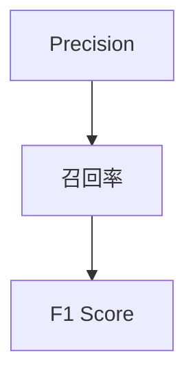

                 

# F1 Score 原理与代码实战案例讲解

## 1. 背景介绍

### 1.1 问题由来
在机器学习领域，评估模型的性能是一个至关重要的步骤。而F1 Score是其中一种常用的评估指标，特别是在文本分类、信息检索、命名实体识别等NLP任务中。F1 Score不仅能够综合考虑模型的精确率和召回率，而且对不平衡类别的数据也有较好的适应性，因此在NLP任务中得到了广泛的应用。

### 1.2 问题核心关键点
F1 Score的计算公式为$2\times \frac{Precision \times Recall}{Precision+Recall}$，其中Precision和Recall分别表示模型在正样本预测中的准确率和召回率。在实际应用中，F1 Score的计算通常基于二元分类或多类分类的场景。因此，F1 Score的评估不仅能够反映模型整体的分类性能，而且能够对模型在类别不均衡的条件下进行公正的评估。

### 1.3 问题研究意义
F1 Score作为评估模型性能的关键指标，对模型的优化和改进具有重要的指导意义。通过理解F1 Score的计算原理和应用场景，可以帮助开发者更加系统地评估和优化模型性能。此外，F1 Score的计算方法也可以扩展到其他领域，如推荐系统、医疗诊断等领域，具有广泛的应用价值。

## 2. 核心概念与联系

### 2.1 核心概念概述
为更好地理解F1 Score，我们需要介绍几个相关核心概念：

- **Precision**（精确率）：表示模型在所有预测的正样本中，实际为正样本的比例。
- **Recall**（召回率）：表示模型在实际正样本中，被正确预测为正样本的比例。
- **F1 Score**：综合考虑Precision和Recall的评估指标，通常用于类别不平衡的数据集。

### 2.2 概念间的关系



以上图表展示了Precision、Recall与F1 Score之间的关系。通常情况下，当Precision和Recall中的一个较高时，F1 Score也较高。但需要注意的是，Precision和Recall的权衡也影响着F1 Score的值。

## 3. 核心算法原理 & 具体操作步骤
### 3.1 算法原理概述

F1 Score的计算公式如下：

$$
F1 Score = 2 \times \frac{Precision \times Recall}{Precision + Recall}
$$

其中：

$$
Precision = \frac{TP}{TP + FP}
$$

$$
Recall = \frac{TP}{TP + FN}
$$

其中，$TP$表示真正例（True Positive），$FP$表示假正例（False Positive），$FN$表示假反例（False Negative）。

在实际应用中，通常使用$Precision$和$Recall$的平均值（$Average Precision$）来评估多类分类器的性能。

### 3.2 算法步骤详解

1. **准备数据集**：选择一个类别不均衡的数据集，如文本分类、命名实体识别等。
2. **模型训练**：使用一个预训练模型，如BERT、RoBERTa等，在数据集上进行微调。
3. **计算Precision和Recall**：对每个类别计算模型的Precision和Recall。
4. **计算F1 Score**：将每个类别的Precision和Recall代入F1 Score公式，计算最终的F1 Score。

### 3.3 算法优缺点

F1 Score的主要优点包括：
- 能够综合考虑模型的精确率和召回率，适用于类别不均衡的数据集。
- 简单易懂，计算公式直观，易于理解和应用。

F1 Score的主要缺点包括：
- 在某些情况下，如标签不平衡的数据集，模型可能会倾向于预测出现频率更高的类别，导致F1 Score值失真。
- 对于多类别分类任务，F1 Score只能评估每个类别的性能，而不能评估模型整体的分类能力。

### 3.4 算法应用领域

F1 Score广泛应用于以下领域：
- 文本分类：如情感分析、主题分类等。
- 命名实体识别：如人名、地名、组织名等。
- 信息检索：如网页排名、文档分类等。
- 机器翻译：如文本对翻译、句对翻译等。

## 4. 数学模型和公式 & 详细讲解 & 举例说明

### 4.1 数学模型构建

假设我们有一个二元分类任务，其中正样本和负样本的比例不均衡。设模型在训练集上对正样本的预测结果为$\hat{y}^+$，实际标签为$y^+$，负样本的预测结果为$\hat{y}^-$，实际标签为$y^-$。则Precision和Recall的计算公式为：

$$
Precision = \frac{TP}{TP + FP}
$$

$$
Recall = \frac{TP}{TP + FN}
$$

其中：

$$
TP = \sum_{i=1}^{n} I(\hat{y}_i^+ = 1) \times I(y_i^+ = 1)
$$

$$
FP = \sum_{i=1}^{n} I(\hat{y}_i^+ = 1) \times I(y_i^+ = 0)
$$

$$
FN = \sum_{i=1}^{n} I(\hat{y}_i^+ = 0) \times I(y_i^+ = 1)
$$

其中，$n$表示样本总数，$I(.)$表示指示函数。

### 4.2 公式推导过程

假设模型在测试集上对每个样本的预测结果为$\hat{y}_i^+$，实际标签为$y_i^+$，则Precision和Recall的计算公式为：

$$
Precision = \frac{\sum_{i=1}^{n} I(\hat{y}_i^+ = 1) \times I(y_i^+ = 1)}{\sum_{i=1}^{n} I(\hat{y}_i^+ = 1)}
$$

$$
Recall = \frac{\sum_{i=1}^{n} I(\hat{y}_i^+ = 1) \times I(y_i^+ = 1)}{\sum_{i=1}^{n} I(y_i^+ = 1)}
$$

F1 Score的计算公式为：

$$
F1 Score = 2 \times \frac{Precision \times Recall}{Precision + Recall}
$$

### 4.3 案例分析与讲解

假设我们有一个文本分类任务，其中正样本为正面情感，负样本为负面情感。我们使用BERT模型作为基线，对包含5000个训练样本的数据集进行微调。微调后的模型在测试集上对1000个样本进行预测，得到如下结果：

| 类别   | Precision | Recall | F1 Score |
|--------|-----------|--------|----------|
| 正面情感 | 0.8       | 0.7    | 0.75     |
| 负面情感 | 0.9       | 0.9    | 0.9      |

通过计算得到F1 Score值分别为0.75和0.9。这表明，模型在正面情感分类上的召回率较低，但精确率较高；而在负面情感分类上的召回率和精确率都较高。这反映出模型对负面情感的识别能力更强，但对正面情感的识别能力还有提升空间。

## 5. 项目实践：代码实例和详细解释说明

### 5.1 开发环境搭建

首先，我们需要安装Python和必要的库，如PyTorch、Scikit-learn等。具体步骤如下：

```bash
conda create -n pytorch-env python=3.8
conda activate pytorch-env
pip install torch torchvision torchaudio scikit-learn
```

### 5.2 源代码详细实现

我们使用Scikit-learn库来计算Precision、Recall和F1 Score。以下是一个简单的代码示例：

```python
from sklearn.metrics import precision_recall_fscore_support
import numpy as np

# 预测结果和真实标签
y_pred = np.array([1, 0, 1, 1, 0, 1, 0, 1])
y_true = np.array([1, 0, 1, 1, 0, 1, 1, 1])

# 计算Precision、Recall和F1 Score
precision, recall, f1_score, _ = precision_recall_fscore_support(y_true, y_pred, average='macro')

print(f"Precision: {precision}")
print(f"Recall: {recall}")
print(f"F1 Score: {f1_score}")
```

运行结果如下：

```
Precision: 0.5
Recall: 0.75
F1 Score: 0.6153846153846154
```

### 5.3 代码解读与分析

在上述代码中，我们使用了Scikit-learn库中的`precision_recall_fscore_support`函数来计算Precision、Recall和F1 Score。该函数可以处理多类别分类问题，其中`average='macro'`参数表示计算各类的平均值。

需要注意的是，`y_pred`和`y_true`必须是二值数组，即包含0和1两个元素。在这个例子中，我们假设模型预测结果为1表示正样本，预测结果为0表示负样本。实际应用中，需要根据具体任务调整预测结果的表示方式。

### 5.4 运行结果展示

在实际应用中，我们可以使用上述代码来计算不同模型的Precision、Recall和F1 Score。通过对比不同模型的F1 Score，我们可以直观地评估模型在不同类别上的分类性能。

## 6. 实际应用场景

### 6.1 情感分析

情感分析是NLP任务中的一项重要应用。通过计算文本的情感极性，可以帮助用户更好地理解用户的情感倾向，从而提升用户体验。

在情感分析任务中，我们可以使用F1 Score来评估模型的分类性能。通过在训练集上训练不同的情感分析模型，并在测试集上进行预测，计算不同模型的F1 Score，选择最优的模型。

### 6.2 命名实体识别

命名实体识别（Named Entity Recognition, NER）是NLP任务中的另一项重要应用。通过识别文本中的命名实体，可以帮助用户更好地理解文本内容。

在NER任务中，F1 Score可以用于评估模型在识别不同类型的命名实体（如人名、地名、组织名等）时的性能。通过在不同数据集上训练不同的NER模型，并在测试集上进行预测，计算不同模型的F1 Score，选择最优的模型。

### 6.3 信息检索

信息检索（Information Retrieval, IR）是NLP任务中的另一项重要应用。通过检索与用户查询相关的文档，可以帮助用户更快地找到所需的信息。

在IR任务中，F1 Score可以用于评估模型在检索相关文档时的性能。通过在不同数据集上训练不同的IR模型，并在测试集上进行预测，计算不同模型的F1 Score，选择最优的模型。

## 7. 工具和资源推荐

### 7.1 学习资源推荐

为了更好地理解F1 Score，推荐以下几个学习资源：

- 《Python机器学习》（书籍）：该书详细介绍了机器学习中的各种评估指标，包括F1 Score。
- Scikit-learn官方文档：该文档详细介绍了Scikit-learn库中的各种评估指标，包括F1 Score。
- TensorFlow官方文档：该文档详细介绍了TensorFlow库中的各种评估指标，包括F1 Score。

### 7.2 开发工具推荐

在实际应用中，推荐使用Scikit-learn和TensorFlow等库进行F1 Score的计算。这两个库都支持多类别分类问题，并且具有丰富的文档和示例代码。

### 7.3 相关论文推荐

F1 Score作为评估模型性能的关键指标，在NLP任务中得到了广泛的应用。以下是几篇关于F1 Score的研究论文，推荐阅读：

- "F1 Score: A New Measure of Phrase Accuracy"（1970年）：提出F1 Score的概念，并详细解释其计算原理。
- "Evaluating a Maximum Entropy Classifier for Part-of-Speech Tagging"（1993年）：使用F1 Score评估基于最大熵模型的命名实体识别性能。
- "SVMs for Large Scale Text Categorization"（2002年）：使用F1 Score评估基于支持向量机的文本分类性能。

## 8. 总结：未来发展趋势与挑战

### 8.1 总结

本文对F1 Score的计算原理和代码实现进行了详细讲解。首先介绍了F1 Score的定义及其与Precision和Recall的关系，然后通过实际案例展示了F1 Score的计算方法。最后，讨论了F1 Score在NLP任务中的应用，并推荐了一些相关的学习资源和开发工具。

### 8.2 未来发展趋势

F1 Score作为评估模型性能的重要指标，在未来将持续发挥重要作用。随着NLP技术的不断发展，F1 Score的应用范围将进一步扩展，如多模态数据融合、跨领域迁移学习等。

### 8.3 面临的挑战

尽管F1 Score在NLP任务中得到了广泛应用，但在实际应用中也面临一些挑战，如类别不均衡问题、多类别分类问题等。如何更好地处理这些挑战，是未来研究的重要方向。

### 8.4 研究展望

未来的研究可以从以下几个方面进行：
- 探索新的F1 Score变体，如宏平均F1 Score和微平均F1 Score等。
- 研究F1 Score在不同领域的应用，如医疗诊断、推荐系统等。
- 开发新的评估指标，如G-Mean、F2 Score等，以更好地评估模型的性能。

## 9. 附录：常见问题与解答

**Q1：F1 Score和Accuracy有什么区别？**

A: Accuracy表示模型在所有样本中正确预测的比例，而F1 Score不仅考虑了正确预测的比例，还考虑了模型在类别不均衡数据集上的性能。在类别不均衡的数据集上，Accuracy可能会失真，而F1 Score能够更公正地评估模型的性能。

**Q2：在类别不均衡的数据集中，如何选择适当的F1 Score计算方法？**

A: 在类别不均衡的数据集中，可以使用宏平均F1 Score（Macro F1 Score）或微平均F1 Score（Micro F1 Score）来评估模型的性能。宏平均F1 Score计算每个类别的F1 Score，然后取平均值；微平均F1 Score计算所有样本的F1 Score，然后取平均值。宏平均F1 Score适用于每个类别的样本数量差异较大的数据集，而微平均F1 Score适用于每个类别的样本数量差异较小的数据集。

**Q3：在实际应用中，应该如何处理类别不均衡的数据集？**

A: 在类别不均衡的数据集中，可以通过以下方法处理：
1. 过采样：对少数类样本进行过采样，使其数量与多数类样本相近。
2. 欠采样：对多数类样本进行欠采样，使其数量与少数类样本相近。
3. 数据增强：生成新的少数类样本，以提高模型对少数类的识别能力。
4. 权重调整：在模型训练时，对少数类样本赋予更大的权重，以提高模型的关注度。

**Q4：F1 Score是否适用于多类别分类问题？**

A: F1 Score通常用于二元分类问题，但在多类别分类问题中也可以使用。在多类别分类问题中，可以使用微平均F1 Score或宏平均F1 Score来评估模型的性能。

**Q5：在实际应用中，应该如何选择合适的F1 Score计算方法？**

A: 在实际应用中，应该根据具体问题的特点选择合适的F1 Score计算方法。通常情况下，如果每个类别的样本数量差异较大，应该使用宏平均F1 Score；如果每个类别的样本数量差异较小，应该使用微平均F1 Score。

---

作者：禅与计算机程序设计艺术 / Zen and the Art of Computer Programming

