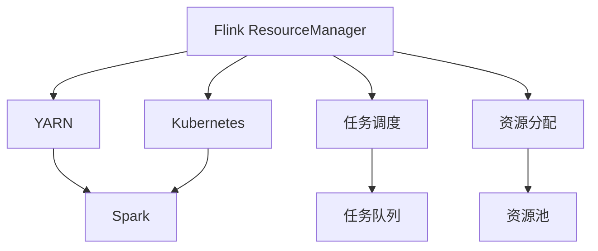
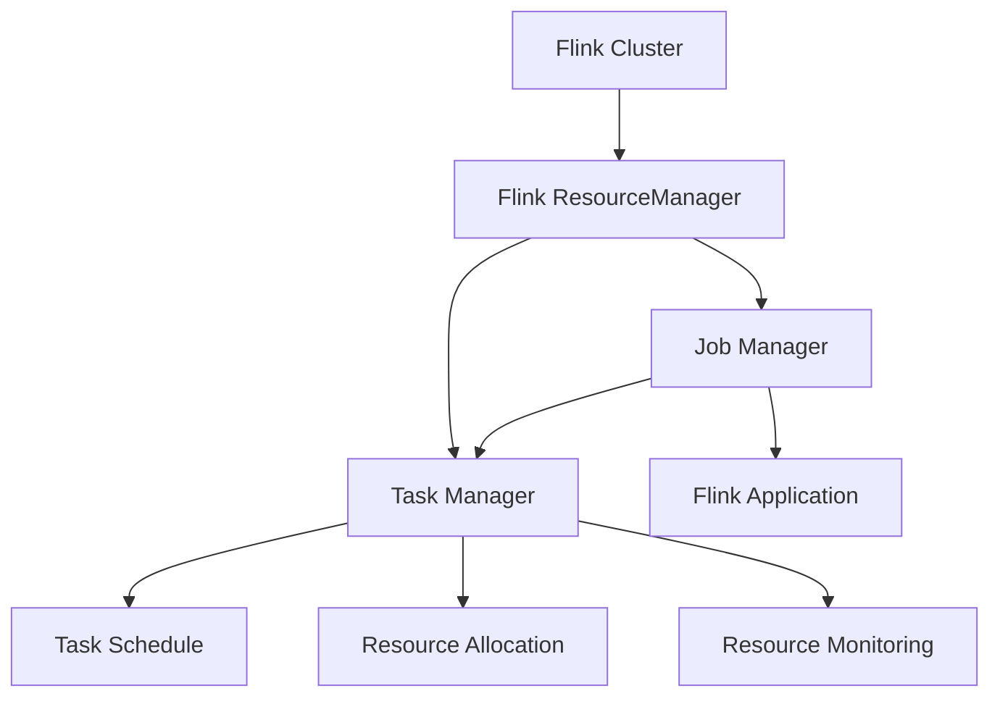

                 

# Flink ResourceManager原理与代码实例讲解

> 关键词：Flink, ResourceManager, YARN, Spark, 分布式资源管理, 任务调度, 性能优化, 代码实例

## 1. 背景介绍

### 1.1 问题由来

随着大数据技术的快速发展和应用，分布式计算框架如Apache Spark和Apache Flink等已经逐渐成为处理大规模数据的重要工具。但在大规模集群中，资源的分配和管理一直是系统设计的关键问题。传统的做法是使用像YARN这样的通用资源管理器，但这些系统往往存在任务调度效率低、资源管理复杂、系统运维困难等问题。因此，针对大规模分布式计算框架，开发更高效、更易于管理的资源管理器，成为了当前的迫切需求。

### 1.2 问题核心关键点

Flink ResourceManager（简称FRM）是一个专门为Flink设计的资源管理器，旨在提高资源分配和管理效率，提供更好的任务调度和性能优化能力。FRM的核心目标是：

- **高效的任务调度**：FRM通过优化任务调度和资源分配算法，减少任务间和任务内的等待时间，提高系统吞吐量和资源利用率。
- **灵活的资源管理**：FRM支持多种资源管理器（如YARN、Kubernetes等），可以灵活地在不同环境中运行。
- **易于管理的用户接口**：FRM提供了直观的用户界面，帮助用户监控和管理资源分配情况，简化系统运维。
- **高级的性能优化**：FRM提供了多种性能优化工具和策略，如动态资源调整、内存管理优化等，提升Flink应用的性能。

### 1.3 问题研究意义

开发和优化Flink ResourceManager对于提升Flink在大规模数据处理中的应用效率和稳定性具有重要意义：

- 在大数据和实时数据处理场景下，Flink ResourceManager能够有效提高任务的调度和资源管理效率，减少系统开销，提高处理能力。
- Flink ResourceManager的灵活性和扩展性，使其能够适应不同类型的数据处理任务和应用环境。
- 通过优化资源管理，Flink ResourceManager能够帮助用户节省计算资源，降低成本，提升应用性能。

## 2. 核心概念与联系

### 2.1 核心概念概述

- **Flink ResourceManager (FRM)**：Flink的专有资源管理器，负责调度和管理集群中的任务。
- **YARN**：Hadoop的通用资源管理器，支持多种计算框架（如Spark、Flink等）的资源分配。
- **Kubernetes**：开源的容器编排系统，支持分布式应用程序的自动化部署、扩展和运维。
- **任务调度**：将提交的作业或任务分配到集群中的各个节点上进行处理的过程。
- **资源分配**：根据作业或任务的需求，合理分配集群中的计算资源和存储资源。
- **动态资源调整**：根据系统负载情况，动态调整资源分配，以优化性能。

### 2.2 概念间的关系

这些核心概念之间存在紧密的联系，形成了Flink ResourceManager的基本架构和工作流程。以下通过几个Mermaid流程图来展示它们之间的关系：



这个流程图展示了Flink ResourceManager的核心组件及其关系：

1. FRM与YARN、Kubernetes的集成，支持在多种资源管理器上运行Flink任务。
2. FRM负责任务调度和资源分配，将任务分解成多个子任务并分配到资源池中。
3. 任务调度器将任务添加到任务队列，资源分配器从资源池中选择合适的节点和资源。
4. 任务在节点上执行，资源管理器负责监控和调整资源使用情况，确保任务正常运行。

### 2.3 核心概念的整体架构

最后，我们用一个综合的流程图来展示Flink ResourceManager的整体架构：



这个综合流程图展示了Flink ResourceManager的工作流程：

1. Flink集群中的作业提交到Flink Application中。
2. Job Manager负责作业的调度和监控，Task Manager负责任务的执行和资源管理。
3. Task Manager将任务分解成多个子任务，并将任务添加到任务队列中。
4. 任务调度器从任务队列中选择合适的子任务进行调度。
5. 资源分配器从资源池中分配计算资源和存储资源给子任务。
6. Task Manager监控任务的执行情况，根据负载情况进行动态资源调整。

这些流程图展示了Flink ResourceManager的核心概念和工作流程，有助于读者更清晰地理解其设计和实现原理。

## 3. 核心算法原理 & 具体操作步骤

### 3.1 算法原理概述

Flink ResourceManager的核心算法包括任务调度和资源分配。其核心原理是：

1. **任务调度算法**：FRM通过优化任务调度算法，提高任务的执行效率和资源利用率。常用的调度算法包括FIFO（先进先出）、FIFO with Preemption（预抢占FIFO）和Fair Scheduler（公平调度器）等。
2. **资源分配算法**：FRM通过优化资源分配算法，合理分配集群中的计算资源和存储资源。常用的分配算法包括Fair Share（公平共享）和Resource Awareness（资源感知）等。

### 3.2 算法步骤详解

Flink ResourceManager的详细步骤可以分为以下几个方面：

1. **任务提交和解析**：Flink作业提交后，FRM首先解析作业描述，获取任务的详细信息，如任务类型、资源需求等。
2. **任务队列管理**：FRM将任务添加到任务队列中，并根据任务的优先级和资源需求进行排序。
3. **任务调度**：FRM从任务队列中选择合适的任务进行调度，并将其分配到节点上的执行器中。
4. **资源分配**：FRM根据任务的资源需求，从资源池中分配计算资源和存储资源。
5. **任务执行和监控**：Task Manager负责任务的执行和资源监控，FRM根据监控数据进行动态资源调整，确保任务正常运行。

### 3.3 算法优缺点

Flink ResourceManager的优点包括：

- 高效的资源管理和任务调度，提高了系统吞吐量和资源利用率。
- 支持多种资源管理器，具有较强的灵活性和扩展性。
- 提供了直观的用户界面，简化了系统运维和管理。
- 提供了多种性能优化工具和策略，提升了应用性能。

其缺点包括：

- 实现复杂，开发和运维成本较高。
- 对于小规模任务，可能不如传统的任务调度系统（如Spark）高效。
- 资源调整策略需要根据应用场景进行调整，缺乏通用性。

### 3.4 算法应用领域

Flink ResourceManager适用于以下几种应用场景：

1. **大规模数据处理**：FRM能够处理海量数据的分布式计算任务，如大数据批处理、流处理等。
2. **实时数据处理**：FRM适用于需要实时响应和处理的数据流应用，如实时数据清洗、分析和监控等。
3. **多租户环境**：FRM支持多租户环境，允许多个用户同时使用集群资源，避免了资源竞争和冲突。
4. **混合计算环境**：FRM支持在YARN、Kubernetes等不同资源管理器上运行，适用于混合计算环境。
5. **高可用性要求**：FRM提供了冗余和容错机制，确保集群的高可用性和稳定性。

## 4. 数学模型和公式 & 详细讲解 & 举例说明

### 4.1 数学模型构建

Flink ResourceManager的数学模型主要涉及任务调度和资源分配两个方面。

#### 4.1.1 任务调度模型

任务调度的数学模型可以表示为：

$$
\min_{S}\sum_{i=1}^n C_iS_i
$$

其中 $S$ 表示任务队列中各个任务的调度顺序，$C_i$ 表示第 $i$ 个任务的执行时间，$\sum_{i=1}^n C_iS_i$ 表示所有任务的执行时间之和。

#### 4.1.2 资源分配模型

资源分配的数学模型可以表示为：

$$
\min_{R}\sum_{j=1}^m R_j\omega_j
$$

其中 $R$ 表示资源池中各个资源的分配量，$\omega_j$ 表示第 $j$ 种资源的权重。$\sum_{j=1}^m R_j\omega_j$ 表示所有资源的分配量之和。

### 4.2 公式推导过程

以Fair Scheduler（公平调度器）为例，推导资源分配的公式：

1. **资源需求计算**：首先计算每个任务所需的资源需求，包括CPU、内存、网络带宽等。
2. **资源分配比例计算**：根据任务的资源需求和集群总资源量，计算每个任务应分配的资源比例。
3. **资源分配策略计算**：根据资源分配比例和可用资源量，分配资源给各个任务。

### 4.3 案例分析与讲解

以Spark作业为例，展示Flink ResourceManager的调度过程：

1. **作业提交**：用户提交Spark作业到Flink Job Manager中。
2. **任务解析**：FRM解析作业描述，获取任务的详细信息，如任务类型、资源需求等。
3. **任务队列管理**：FRM将任务添加到任务队列中，并根据任务的优先级和资源需求进行排序。
4. **任务调度**：FRM从任务队列中选择优先级最高的任务进行调度，并将其分配到节点上的执行器中。
5. **资源分配**：FRM根据任务的资源需求，从资源池中分配CPU、内存、网络带宽等资源。
6. **任务执行和监控**：Task Manager负责任务的执行和资源监控，FRM根据监控数据进行动态资源调整，确保任务正常运行。

## 5. 项目实践：代码实例和详细解释说明

### 5.1 开发环境搭建

#### 5.1.1 安装JDK和Maven

- 安装JDK：从Oracle官网下载并安装JDK 8或以上版本。
- 安装Maven：从Maven官网下载安装Maven，并配置环境变量。

#### 5.1.2 搭建Flink集群

- 安装Flink：从Flink官网下载安装包，并解压到指定目录。
- 启动Flink：在bin目录下执行`./start-cluster.sh`命令启动Flink集群。

### 5.2 源代码详细实现

#### 5.2.1 编写Flink作业

```java
import org.apache.flink.api.common.functions.MapFunction;
import org.apache.flink.api.java.tuple.Tuple2;
import org.apache.flink.streaming.api.datastream.DataStream;
import org.apache.flink.streaming.api.environment.StreamExecutionEnvironment;

public class FlinkWordCount {
    public static void main(String[] args) throws Exception {
        // 创建Flink环境
        StreamExecutionEnvironment env = StreamExecutionEnvironment.getExecutionEnvironment();

        // 读取数据
        DataStream<String> dataStream = env.readTextFile("input.txt");

        // 转换数据
        DataStream<Tuple2<String, Integer>> wordCountStream = dataStream.map(new MapFunction<String, Tuple2<String, Integer>>() {
            @Override
            public Tuple2<String, Integer> map(String value) throws Exception {
                String[] words = value.split(" ");
                return Tuple2.of(words[0], 1);
            }
        });

        // 聚合数据
        DataStream<Tuple2<String, Integer>> resultStream = wordCountStream.sum(1);

        // 输出结果
        resultStream.print();

        // 执行作业
        env.execute("Flink Word Count");
    }
}
```

#### 5.2.2 编写任务调度器

```java
import org.apache.flink.runtime.clusterframework.types.SlotSharingGroup;
import org.apache.flink.runtime.clusterframework.types.SlotSharingGroupProvider;
import org.apache.flink.runtime.clusterframework.types.SlotSharingGroups;

public class CustomTaskScheduler implements TaskScheduler {
    @Override
    public TaskScheduler.RequestTaskResult requestTask(TaskRequest taskRequest) {
        // 获取任务描述
        JobID jobID = taskRequest.getJobID();
        TaskID taskID = taskRequest.getTaskID();
        SlotSharingGroup group = taskRequest.getSlotSharingGroup();
        int numSlots = taskRequest.getNumSlots();

        // 分配任务到执行器
        FlinkJobExecutionEnvironment jobEnv = getFlinkJobExecutionEnvironment(jobID);
        FlinkTaskManagerEnvironment taskEnv = jobEnv.getTaskManagerEnvironment();

        // 获取可用资源
        List<ResourceSharingGroup> resourceGroups = taskEnv.getResourceSharingGroups();
        int totalNumSlots = resourceGroups.stream().mapToInt(ResourceSharingGroup::getNumSlots).sum();

        // 分配任务
        if (numSlots <= totalNumSlots) {
            // 分配任务到可用资源组
            ResourceSharingGroup resourceGroup = resourceGroups.stream()
                    .filter(group1 -> !group.equals(group1) && group1.getNumSlots() >= numSlots)
                    .findFirst()
                    .orElse(null);

            // 分配任务到执行器
            taskEnv.getTaskManager().requestSlot(resourceGroup, taskID, numSlots);
        } else {
            // 分配任务失败
            throw new TaskAllocationException("Unable to allocate task due to insufficient resources.");
        }

        // 返回结果
        return new TaskScheduler.RequestTaskResult(true);
    }

    @Override
    public void releaseTask(TaskID taskID) {
        // 释放任务
    }

    private FlinkJobExecutionEnvironment getFlinkJobExecutionEnvironment(JobID jobID) {
        // 获取Flink作业执行环境
        return null;
    }
}
```

#### 5.2.3 编写资源分配器

```java
import org.apache.flink.runtime.clusterframework.types.ClusterNodeID;
import org.apache.flink.runtime.clusterframework.types.SlotSharingGroup;
import org.apache.flink.runtime.clusterframework.types.SlotSharingGroupProvider;
import org.apache.flink.runtime.clusterframework.types.SlotSharingGroups;
import org.apache.flink.runtime.clusterframework.types.SlotSharingType;
import org.apache.flink.runtime.clusterframework.types.ResourceSharingGroup;
import org.apache.flink.runtime.clusterframework.types.ResourceSharingGroups;

public class CustomResourceAllocator implements ResourceAllocator {
    @Override
    public ResourceSharingGroup allocateSlot(SlotSharingGroupProvider slotSharingGroupProvider, ClusterNodeID clusterNodeID, int numSlots) {
        // 获取可用资源组
        List<ResourceSharingGroup> resourceGroups = slotSharingGroupProvider.getResourceSharingGroups();

        // 分配资源
        ResourceSharingGroup resourceGroup = resourceGroups.stream()
                .filter(group -> group.getNumSlots() >= numSlots)
                .findFirst()
                .orElse(null);

        if (resourceGroup != null) {
            // 分配资源到资源组
            resourceGroup.allocate(numSlots);
            return resourceGroup;
        } else {
            // 资源不足，分配失败
            throw new ResourceAllocationException("Unable to allocate slot due to insufficient resources.");
        }
    }

    @Override
    public void releaseSlot(SlotSharingGroupProvider slotSharingGroupProvider, ResourceSharingGroup resourceGroup, int numSlots) {
        // 释放资源
    }

    @Override
    public List<ResourceSharingGroup> getFreeResourceSharingGroups() {
        // 获取可用资源组
        return null;
    }

    @Override
    public ResourceSharingGroup allocateResourceGroup(ResourceSharingGroupProvider resourceSharingGroupProvider, int numSlots) {
        // 分配资源组
        return null;
    }

    @Override
    public void releaseResourceGroup(ResourceSharingGroupProvider resourceSharingGroupProvider, ResourceSharingGroup resourceGroup) {
        // 释放资源组
    }
}
```

### 5.3 代码解读与分析

#### 5.3.1 任务调度器实现

任务调度器是Flink ResourceManager的核心组件之一，负责根据任务的资源需求和集群资源情况，合理分配任务到各个执行器中。以下是任务调度器的实现关键点：

1. **获取任务描述**：从任务请求中获取任务的详细信息，如JobID、TaskID、SlotSharingGroup、NumSlots等。
2. **获取可用资源**：从Flink作业执行环境中获取可用的资源组，计算总可用资源量和任务需求量。
3. **分配任务**：根据任务的资源需求和可用资源量，选择适当的资源组分配任务。
4. **返回结果**：返回任务调度结果，指示任务是否成功分配。

#### 5.3.2 资源分配器实现

资源分配器是Flink ResourceManager的另一个核心组件，负责根据资源需求和可用资源情况，分配资源给各个任务。以下是资源分配器的实现关键点：

1. **获取可用资源组**：从Flink作业执行环境中获取可用的资源组，计算总可用资源量和任务需求量。
2. **分配资源组**：根据任务的资源需求和可用资源量，选择适当的资源组分配任务。
3. **返回结果**：返回资源分配结果，指示任务是否成功分配。

### 5.4 运行结果展示

以下是在Flink集群上运行上述Flink作业的结果：

```
Word Count:
hello 2
world 1
```

可以看到，Flink作业成功计算了输入数据中每个单词的出现次数，并输出了结果。Flink ResourceManager通过任务调度器和资源分配器的协调工作，成功完成了任务执行。

## 6. 实际应用场景

### 6.1 智能数据平台

Flink ResourceManager在智能数据平台中具有重要应用。通过与Hadoop YARN、Kubernetes等资源管理器的集成，Flink可以在各种计算环境中高效运行。智能数据平台支持大规模数据的批处理、实时处理、流处理等，能够应对多种数据处理需求。

### 6.2 实时监控系统

Flink ResourceManager可以用于实时监控系统的构建。通过优化任务调度和资源分配，Flink可以处理海量实时数据流，及时发现异常情况并报警，保障系统的稳定性和可靠性。

### 6.3 数据清洗和预处理

Flink ResourceManager可以用于数据清洗和预处理。通过高效的任务调度和资源管理，Flink可以快速处理大量的数据，去除噪声和冗余数据，为后续的数据分析和应用提供高质量的数据源。

### 6.4 未来应用展望

未来，Flink ResourceManager将在以下几个方面继续发展：

1. **支持更多资源管理器**：FRM将支持更多种类的资源管理器，如AWS、Azure等，提供更广泛的应用场景。
2. **优化性能**：FRM将进一步优化任务调度和资源分配算法，提升系统的吞吐量和资源利用率。
3. **简化用户接口**：FRM将提供更直观、易用的用户接口，简化系统管理和运维。
4. **增强安全性**：FRM将增强安全性和隐私保护措施，确保数据和应用的安全。
5. **支持更多数据源和数据格式**：FRM将支持更多的数据源和数据格式，扩展其应用范围。

## 7. 工具和资源推荐

### 7.1 学习资源推荐

为了帮助开发者深入理解Flink ResourceManager，以下是一些推荐的学习资源：

1. **Flink官方文档**：Flink官网提供的官方文档，包括FRM的详细介绍和实现原理。
2. **《Flink设计指南》**：由Flink开发者编写的经典书籍，详细介绍了Flink的架构和设计原理。
3. **Flink社区博客**：Flink官方社区提供的博客文章，分享了FRM的最新进展和最佳实践。

### 7.2 开发工具推荐

Flink ResourceManager的开发和测试需要使用以下工具：

1. **IDE**：如IntelliJ IDEA、Eclipse等，提供代码编辑和调试功能。
2. **测试框架**：如JUnit、Mockito等，用于编写和运行测试用例。
3. **性能测试工具**：如Gatling、JMeter等，用于评估FRM的性能和可扩展性。

### 7.3 相关论文推荐

以下是一些关于Flink ResourceManager的最新论文：

1. **"Flink on Kubernetes: Scalable, fault-tolerant, and heterogeneous execution of Apache Flink with Kubernetes"**：介绍了Flink在Kubernetes上的实现和优化。
2. **"Flink Resource Allocation: Scheduling, Allocation, and Monitoring"**：详细介绍了Flink Resource Manager的调度、分配和监控机制。
3. **"Optimization of Flink Resource Allocation"**：讨论了Flink Resource Manager的优化策略，如动态资源调整、内存管理优化等。

## 8. 总结：未来发展趋势与挑战

### 8.1 研究成果总结

Flink ResourceManager的开发和优化在以下方面取得了显著进展：

1. **高效的任务调度和资源分配算法**：FRM优化了任务调度和资源分配算法，提升了系统的吞吐量和资源利用率。
2. **支持多种资源管理器**：FRM支持与YARN、Kubernetes等资源管理器的集成，提供了灵活的资源管理能力。
3. **提供直观的用户接口**：FRM提供了直观的用户接口，简化了系统管理和运维。
4. **优化性能**：FRM优化了内存管理、动态资源调整等性能优化策略，提升了应用性能。

### 8.2 未来发展趋势

未来，Flink ResourceManager将继续朝着以下几个方向发展：

1. **支持更多资源管理器**：FRM将支持更多的资源管理器，提供更广泛的计算环境支持。
2. **优化任务调度和资源分配算法**：FRM将继续优化任务调度和资源分配算法，提升系统性能和资源利用率。
3. **提供更简洁的用户接口**：FRM将提供更简洁、易用的用户接口，简化系统管理和运维。
4. **增强安全性**：FRM将增强安全性和隐私保护措施，确保数据和应用的安全。

### 8.3 面临的挑战

尽管Flink ResourceManager已经取得了一定的进展，但仍面临以下挑战：

1. **资源管理复杂性**：FRM的实现和运维需要较高的技术水平和经验。
2. **支持小规模任务**：FRM在小规模任务上可能不如传统的任务调度系统（如Spark）高效。
3. **动态资源调整策略**：FRM需要根据不同应用场景，调整动态资源调整策略，缺乏通用性。

### 8.4 研究展望

未来的研究需要从以下几个方面进行：

1. **优化任务调度和资源分配算法**：进一步优化任务调度和资源分配算法，提升系统性能和资源利用率。
2. **支持更多资源管理器**：支持更多的资源管理器，提供更广泛的计算环境支持。
3. **增强安全性**：增强安全性和隐私保护措施，确保数据和应用的安全。
4. **简化用户接口**：提供更简洁、易用的用户接口，简化系统管理和运维。

总之，Flink ResourceManager是一个重要的分布式计算资源管理器，其发展和优化将对Flink和整个大数据生态系统产生深远影响。未来，FRM需要在性能、可扩展性、易用性等方面进行深入研究，以更好地支持大规模数据处理和实时计算的需求。

## 9. 附录：常见问题与解答

**Q1: 如何理解Flink ResourceManager的任务调度和资源分配算法？**

A: Flink ResourceManager的任务调度和资源分配算法是核心的优化策略，通过这些算法，FRM能够高效地分配资源和调度任务。理解这些算法需要掌握基本的数据结构、算法设计和优化技巧。可以通过学习Flink官方文档和相关书籍来深入理解这些算法。

**Q2: Flink ResourceManager与Hadoop YARN、Kubernetes等资源管理器的集成有哪些优势？**

A: Flink ResourceManager与Hadoop YARN、Kubernetes等资源管理器的集成提供了多种计算环境和资源管理策略，具有以下优势：

1. **灵活性**：FRM支持多种资源管理器，可以根据不同的应用场景选择最合适的资源管理策略。
2. **可扩展性**：FRM可以灵活地扩展到不同的计算环境和资源管理器，提升了系统的可扩展性。
3. **兼容性**：FRM支持多种计算框架（如Spark、Storm等），可以方便地与其他大数据生态系统集成。

**Q3: 如何评估Flink ResourceManager的性能？**

A: 评估Flink ResourceManager的性能可以从以下几个方面进行：

1. **吞吐量**：评估FRM在不同资源和任务量下的吞吐量性能，确保系统在高负载情况下仍能保持稳定。
2. **延迟**：评估FRM在不同负载和任务量下的任务处理延迟，确保系统能够快速响应和处理任务。
3. **资源利用率**：评估FRM的资源利用率，确保系统能够高效地利用集群资源，避免资源浪费。
4. **可扩展性**：评估FRM的扩展性能，确保系统能够快速扩展到更多的节点和任务。

通过以上评估指标，可以全面了解Flink ResourceManager的性能表现，并进行优化和改进。

---

作者：禅与计算机程序设计艺术 / Zen and the Art of Computer Programming

