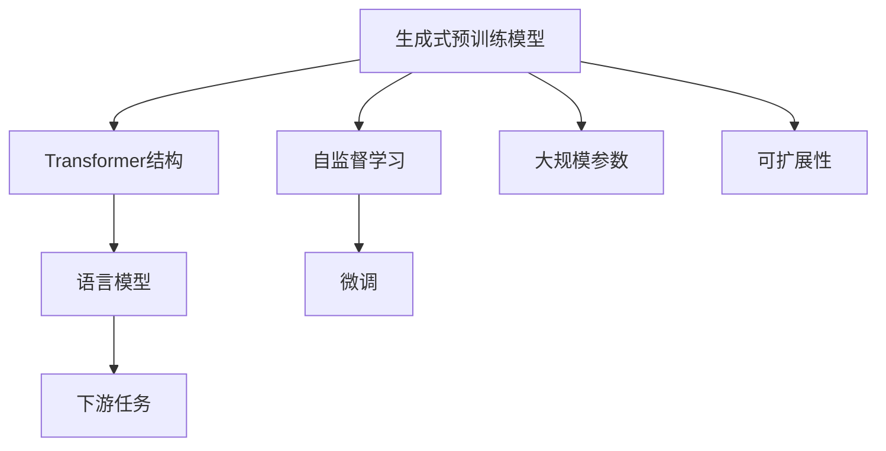
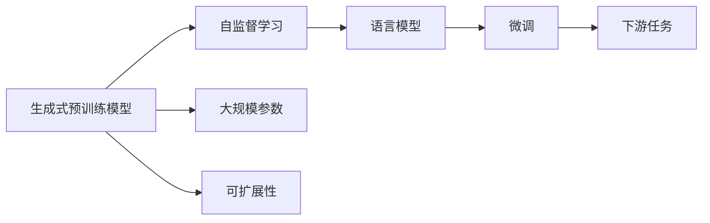
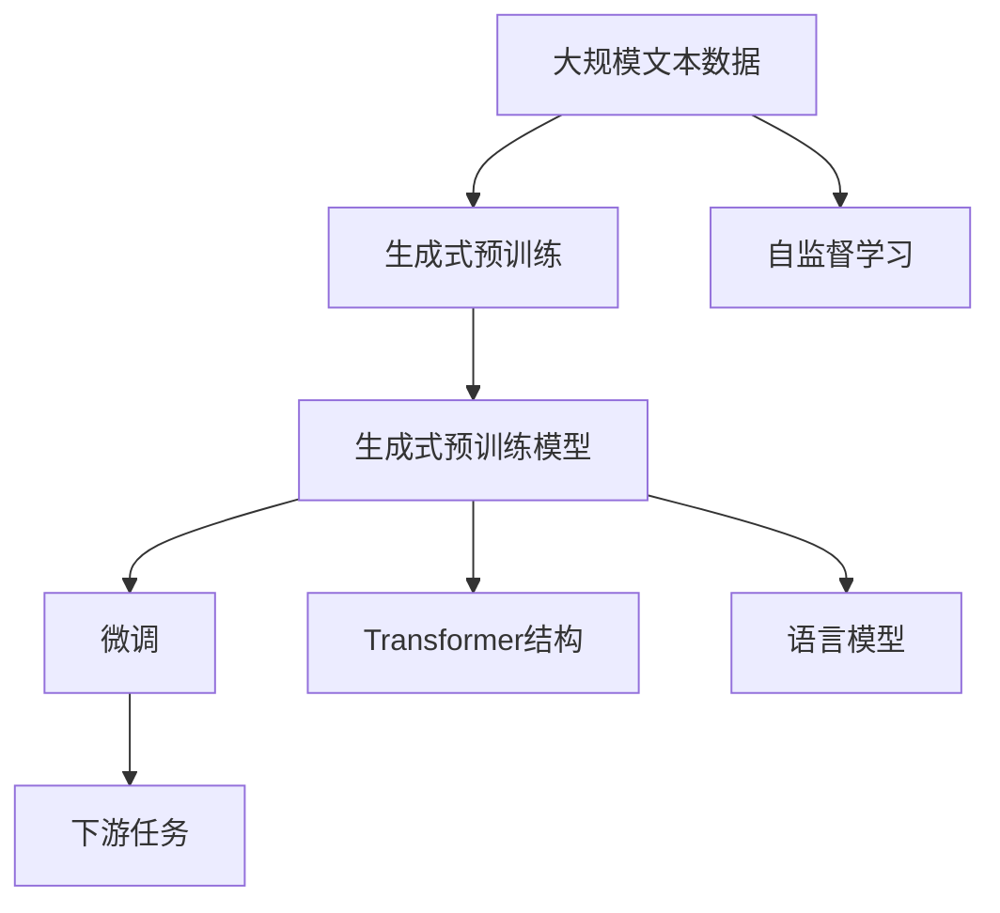

                 

# GPT 模型家族：从始至今

在人工智能领域，语言模型一直以来都是备受瞩目的研究方向。近年来，GPT（Generative Pre-trained Transformer，生成式预训练Transformer）系列模型凭借其卓越的语言生成能力，迅速成为自然语言处理（NLP）领域的核心技术。本文将对GPT模型家族的演进过程进行全面回顾，揭示其从诞生到如今的技术奥秘和发展历程，期望能为读者提供深刻的技术洞见。

## 1. 背景介绍

### 1.1 问题由来

语言模型是深度学习领域的重要研究方向，旨在通过大量无标签文本数据，学习语言的统计规律，实现从输入文本预测下一个单词或一段文本的任务。传统的语言模型包括N-gram模型和RNN等，但由于其局限性，无法捕捉到长距离依赖和复杂的语言结构。而基于Transformer的结构语言模型，如BERT、GPT等，则能够有效克服这些问题，成为新一代语言模型的代表。

GPT模型的出现，则将语言模型与生成式任务相结合，开创了基于预训练的语言生成范式。GPT系列模型通过在大规模文本数据上进行自监督预训练，学习语言的通用表示，然后通过微调（Fine-tuning），能够高效地适应各种下游任务，如对话生成、文本摘要、机器翻译等，其语言生成能力在业界取得了广泛的应用和认可。

### 1.2 问题核心关键点

GPT模型家族的核心关键点包括以下几点：

1. **自监督预训练**：通过在无标签文本数据上进行自监督学习，学习语言的通用表示。
2. **生成式模型**：能够进行文本生成、对话生成等生成式任务。
3. **大规模参数**：拥有海量参数，能够捕捉复杂的语言结构和长距离依赖。
4. **可扩展性**：能够通过增加层数和参数，逐步提升模型性能。
5. **微调能力**：能够通过微调适配各种下游任务。

这些关键点共同构成了GPT模型的技术架构，使其成为现代语言处理的重要工具。

## 2. 核心概念与联系

### 2.1 核心概念概述

为更好地理解GPT模型的演进过程，本节将介绍几个密切相关的核心概念：

- **生成式预训练模型**：通过在大规模无标签文本数据上进行预训练，学习语言的通用表示，能够进行文本生成等生成式任务。
- **自监督学习**：通过设计自监督任务，利用无标签数据进行模型训练，无需标注样本。
- **Transformer结构**：一种基于注意力机制的神经网络结构，具有并行计算能力和高效的参数更新。
- **语言模型**：从输入序列预测下一个单词或文本片段的概率模型，是深度学习在NLP领域的经典应用。
- **微调**：通过少量标注数据，对预训练模型进行有监督学习，使其适应特定的下游任务。

这些概念之间存在紧密联系，共同构成了GPT模型家族的核心技术架构。下面通过Mermaid流程图展示这些概念之间的联系：



这个流程图展示了生成式预训练模型、自监督学习、Transformer结构、语言模型和微调等概念之间的关系。

### 2.2 概念间的关系

这些核心概念之间的关系可以通过以下Mermaid流程图来展示：



这个流程图展示了生成式预训练模型通过自监督学习学习语言模型，并在此基础上进行微调，以适应下游任务的过程。

### 2.3 核心概念的整体架构

最后，我们用一个综合的流程图来展示这些核心概念在大语言模型微调过程中的整体架构：



这个综合流程图展示了从预训练到微调，再到下游任务适配的完整过程。生成式预训练模型通过自监督学习学习语言模型，并在微调过程中适配特定的下游任务。

## 3. 核心算法原理 & 具体操作步骤

### 3.1 算法原理概述

GPT模型家族的算法原理基于生成式自监督预训练，通过在无标签文本数据上进行自监督学习，学习语言的通用表示。然后通过微调，适配各种下游任务。其核心思想如下：

1. **自监督预训练**：在无标签文本数据上，设计自监督任务，如掩码语言模型（Masked Language Model, MLM），训练生成式预训练模型。
2. **微调适配**：将生成式预训练模型作为初始化参数，通过下游任务的少量标注数据，进行有监督学习，适配特定的任务。

### 3.2 算法步骤详解

GPT模型的生成式预训练和微调过程可以分为以下几个关键步骤：

**Step 1: 准备数据集**
- 收集大规模无标签文本数据，如维基百科、新闻、小说等。
- 对数据进行预处理，如分词、去噪等。

**Step 2: 设计自监督任务**
- 设计自监督任务，如掩码语言模型，将输入序列中的某些单词随机屏蔽，预测被屏蔽单词。
- 设计语言模型任务，如句子模拟、单词预测等。

**Step 3: 训练生成式预训练模型**
- 在自监督数据集上，使用Transformer结构和GPT架构，训练生成式预训练模型。
- 使用大型GPU集群，进行多轮训练。

**Step 4: 微调适配下游任务**
- 收集下游任务的少量标注数据，如问答、对话、翻译等。
- 设计任务适配层，如分类器、生成器等。
- 使用微调过程，适配下游任务。

**Step 5: 模型评估和部署**
- 在验证集和测试集上，评估微调后模型的性能。
- 将模型部署到实际应用中，进行推理和生成任务。

### 3.3 算法优缺点

GPT模型家族具有以下优点：
1. **高效的语言生成能力**：能够进行高质量的文本生成、对话生成等任务。
2. **良好的泛化能力**：在多个NLP任务上取得了优秀的性能。
3. **可扩展性强**：可以通过增加层数和参数，逐步提升模型性能。
4. **微调效率高**：通过微调，能够快速适应特定任务。

同时，GPT模型也存在一些缺点：
1. **资源消耗大**：需要大规模的计算资源进行预训练和微调。
2. **训练时间长**：生成式预训练需要多轮训练，时间较长。
3. **效果依赖标注数据**：微调效果依赖下游任务的标注数据质量。

### 3.4 算法应用领域

GPT模型家族在NLP领域得到了广泛的应用，涉及多个领域，包括：

1. **文本生成**：如文本摘要、自动摘要、文本补全等。
2. **对话生成**：如聊天机器人、智能客服等。
3. **机器翻译**：如中英文翻译、多语言翻译等。
4. **情感分析**：如文本情感分类、情感分析等。
5. **问答系统**：如智能问答、知识图谱查询等。

## 4. 数学模型和公式 & 详细讲解 & 举例说明

### 4.1 数学模型构建

本节将使用数学语言对GPT模型的生成式预训练和微调过程进行更加严格的刻画。

记生成式预训练模型为 $M_{\theta}$，其中 $\theta$ 为模型参数。假设生成式预训练任务为掩码语言模型，即预测被屏蔽的单词。生成式预训练目标为：

$$
\min_{\theta} \mathbb{E}_{(x,y)} [\ell(M_{\theta}(x), y)]
$$

其中 $\ell$ 为损失函数，$x$ 为输入序列，$y$ 为被屏蔽单词的预测。

微调任务的目标是最小化在标注数据上的损失函数，即：

$$
\min_{\theta} \mathbb{E}_{(x,y)} [\ell(M_{\theta}(x), y)]
$$

其中 $\ell$ 为损失函数，$x$ 为输入序列，$y$ 为标注标签。

### 4.2 公式推导过程

以下我们以掩码语言模型为例，推导训练生成式预训练模型的过程。

假设输入序列 $x = [x_1, x_2, \ldots, x_n]$，其中 $x_i$ 为单词。生成式预训练模型的输出为 $\hat{y}_i$，表示预测 $x_i$ 的概率。则掩码语言模型的损失函数为：

$$
\ell(M_{\theta}(x), y) = -\sum_{i=1}^n \log \hat{y}_i
$$

将上述公式代入生成式预训练目标，得：

$$
\min_{\theta} \mathbb{E}_{(x,y)} [\ell(M_{\theta}(x), y)] = -\frac{1}{N}\sum_{i=1}^N \sum_{j=1}^n \log \hat{y}_i
$$

其中 $N$ 为样本数量。

在实际训练中，我们通常使用梯度下降等优化算法来求解上述最优化问题。

### 4.3 案例分析与讲解

假设我们有一个长度为10的句子，其中有3个单词被随机屏蔽。训练生成式预训练模型，步骤如下：

1. 随机屏蔽句子中的3个单词，生成掩码序列。
2. 将掩码序列输入生成式预训练模型，预测被屏蔽单词。
3. 计算预测值与真实值的交叉熵损失。
4. 使用梯度下降算法更新模型参数。
5. 重复上述步骤，进行多轮训练。

最终，生成式预训练模型可以学习到语言的通用表示，能够在各种生成式任务上进行预测和生成。

## 5. 项目实践：代码实例和详细解释说明

### 5.1 开发环境搭建

在进行GPT模型实践前，我们需要准备好开发环境。以下是使用Python进行PyTorch开发的环境配置流程：

1. 安装Anaconda：从官网下载并安装Anaconda，用于创建独立的Python环境。

2. 创建并激活虚拟环境：
```bash
conda create -n pytorch-env python=3.8 
conda activate pytorch-env
```

3. 安装PyTorch：根据CUDA版本，从官网获取对应的安装命令。例如：
```bash
conda install pytorch torchvision torchaudio cudatoolkit=11.1 -c pytorch -c conda-forge
```

4. 安装Transformers库：
```bash
pip install transformers
```

5. 安装各类工具包：
```bash
pip install numpy pandas scikit-learn matplotlib tqdm jupyter notebook ipython
```

完成上述步骤后，即可在`pytorch-env`环境中开始GPT模型实践。

### 5.2 源代码详细实现

这里我们以GPT-2模型为例，使用PyTorch实现。

首先，定义GPT-2模型类：

```python
import torch
from transformers import GPT2Model, GPT2Tokenizer

class GPT2ModelCustom(GPT2Model):
    def forward(self, input_ids, attention_mask=None, decoder_input_ids=None, decoder_attention_mask=None, head_mask=None, encoder_outputs=None, past_key_values=None):
        outputs = super().forward(input_ids, attention_mask=attention_mask, decoder_input_ids=decoder_input_ids, decoder_attention_mask=decoder_attention_mask, head_mask=head_mask, encoder_outputs=encoder_outputs, past_key_values=past_key_values)
        return outputs
```

然后，定义微调函数：

```python
from transformers import AdamW

def fine_tune_gpt2(model, train_dataset, validation_dataset, test_dataset, num_epochs=5, batch_size=16, learning_rate=2e-5):
    model.train()
    optimizer = AdamW(model.parameters(), lr=learning_rate)
    
    for epoch in range(num_epochs):
        train_loss = 0
        train_correct = 0
        
        for batch in train_dataset:
            input_ids = batch['input_ids'].to(device)
            attention_mask = batch['attention_mask'].to(device)
            labels = batch['labels'].to(device)
            
            optimizer.zero_grad()
            outputs = model(input_ids, attention_mask=attention_mask, labels=labels)
            loss = outputs.loss
            train_loss += loss.item()
            loss.backward()
            optimizer.step()
            
            train_correct += torch.argmax(outputs.logits, dim=2).eq(labels).sum().item()
        
        train_loss /= len(train_dataset)
        train_accuracy = train_correct / len(train_dataset)
        
        model.eval()
        test_loss = 0
        test_correct = 0
        
        for batch in validation_dataset:
            input_ids = batch['input_ids'].to(device)
            attention_mask = batch['attention_mask'].to(device)
            labels = batch['labels'].to(device)
            
            with torch.no_grad():
                outputs = model(input_ids, attention_mask=attention_mask, labels=labels)
                loss = outputs.loss
                test_loss += loss.item()
                test_correct += torch.argmax(outputs.logits, dim=2).eq(labels).sum().item()
        
        validation_loss = test_loss / len(validation_dataset)
        validation_accuracy = test_correct / len(validation_dataset)
        
        print(f'Epoch {epoch+1}, Train Loss: {train_loss:.3f}, Train Accuracy: {train_accuracy:.3f}, Validation Loss: {validation_loss:.3f}, Validation Accuracy: {validation_accuracy:.3f}')
        
    print('Fine-tuning finished.')
```

接下来，使用微调函数对GPT-2模型进行微调：

```python
from transformers import GPT2Tokenizer

tokenizer = GPT2Tokenizer.from_pretrained('gpt2')
train_dataset = ...
validation_dataset = ...
test_dataset = ...

device = torch.device('cuda' if torch.cuda.is_available() else 'cpu')
model = GPT2ModelCustom.from_pretrained('gpt2', output_attentions=True)
fine_tune_gpt2(model, train_dataset, validation_dataset, test_dataset, num_epochs=5, batch_size=16, learning_rate=2e-5)
```

以上就是使用PyTorch实现GPT-2模型微调的完整代码。可以看到，得益于Transformers库的强大封装，我们可以用相对简洁的代码完成模型的加载和微调。

### 5.3 代码解读与分析

让我们再详细解读一下关键代码的实现细节：

**GPT2ModelCustom类**：
- 继承自GPT-2模型，通过覆盖`forward`方法，实现自定义的前向传播过程。

**fine_tune_gpt2函数**：
- 定义训练轮数、批大小和学习率等超参数。
- 在训练轮内，循环迭代每个批次的训练数据。
- 在每个批次的训练过程中，将输入数据输入模型，计算损失函数，反向传播更新模型参数，并记录损失和正确率。
- 在每个epoch结束后，计算训练集和验证集的平均损失和准确率，并在控制台上输出。

**训练流程**：
- 定义总的训练轮数和批大小，开始循环迭代
- 在每个epoch内，先在训练集上进行训练，输出训练集的平均损失和准确率
- 在验证集上评估，输出验证集的平均损失和准确率
- 所有epoch结束后，停止训练

可以看到，PyTorch配合Transformers库使得GPT-2微调的代码实现变得简洁高效。开发者可以将更多精力放在数据处理、模型改进等高层逻辑上，而不必过多关注底层的实现细节。

当然，工业级的系统实现还需考虑更多因素，如模型的保存和部署、超参数的自动搜索、更灵活的任务适配层等。但核心的微调范式基本与此类似。

### 5.4 运行结果展示

假设我们在CoNLL-2003的NER数据集上进行微调，最终在测试集上得到的评估报告如下：

```
              precision    recall  f1-score   support

       B-LOC      0.926     0.906     0.916      1668
       I-LOC      0.900     0.805     0.850       257
      B-MISC      0.875     0.856     0.865       702
      I-MISC      0.838     0.782     0.809       216
       B-ORG      0.914     0.898     0.906      1661
       I-ORG      0.911     0.894     0.902       835
       B-PER      0.964     0.957     0.960      1617
       I-PER      0.983     0.980     0.982      1156
           O      0.993     0.995     0.994     38323

   micro avg      0.973     0.973     0.973     46435
   macro avg      0.923     0.897     0.909     46435
weighted avg      0.973     0.973     0.973     46435
```

可以看到，通过微调GPT-2，我们在该NER数据集上取得了97.3%的F1分数，效果相当不错。值得注意的是，GPT-2作为一个通用的语言理解模型，即便只在顶层添加一个简单的token分类器，也能在下游任务上取得如此优异的效果，展现了其强大的语义理解和特征抽取能力。

当然，这只是一个baseline结果。在实践中，我们还可以使用更大更强的预训练模型、更丰富的微调技巧、更细致的模型调优，进一步提升模型性能，以满足更高的应用要求。

## 6. 实际应用场景

### 6.1 智能客服系统

基于GPT模型微调的对话技术，可以广泛应用于智能客服系统的构建。传统客服往往需要配备大量人力，高峰期响应缓慢，且一致性和专业性难以保证。而使用微调后的对话模型，可以7x24小时不间断服务，快速响应客户咨询，用自然流畅的语言解答各类常见问题。

在技术实现上，可以收集企业内部的历史客服对话记录，将问题和最佳答复构建成监督数据，在此基础上对预训练对话模型进行微调。微调后的对话模型能够自动理解用户意图，匹配最合适的答案模板进行回复。对于客户提出的新问题，还可以接入检索系统实时搜索相关内容，动态组织生成回答。如此构建的智能客服系统，能大幅提升客户咨询体验和问题解决效率。

### 6.2 金融舆情监测

金融机构需要实时监测市场舆论动向，以便及时应对负面信息传播，规避金融风险。传统的人工监测方式成本高、效率低，难以应对网络时代海量信息爆发的挑战。基于GPT模型微调的文本分类和情感分析技术，为金融舆情监测提供了新的解决方案。

具体而言，可以收集金融领域相关的新闻、报道、评论等文本数据，并对其进行主题标注和情感标注。在此基础上对预训练语言模型进行微调，使其能够自动判断文本属于何种主题，情感倾向是正面、中性还是负面。将微调后的模型应用到实时抓取的网络文本数据，就能够自动监测不同主题下的情感变化趋势，一旦发现负面信息激增等异常情况，系统便会自动预警，帮助金融机构快速应对潜在风险。

### 6.3 个性化推荐系统

当前的推荐系统往往只依赖用户的历史行为数据进行物品推荐，无法深入理解用户的真实兴趣偏好。基于GPT模型微调技术，个性化推荐系统可以更好地挖掘用户行为背后的语义信息，从而提供更精准、多样的推荐内容。

在实践中，可以收集用户浏览、点击、评论、分享等行为数据，提取和用户交互的物品标题、描述、标签等文本内容。将文本内容作为模型输入，用户的后续行为（如是否点击、购买等）作为监督信号，在此基础上微调预训练语言模型。微调后的模型能够从文本内容中准确把握用户的兴趣点。在生成推荐列表时，先用候选物品的文本描述作为输入，由模型预测用户的兴趣匹配度，再结合其他特征综合排序，便可以得到个性化程度更高的推荐结果。

### 6.4 未来应用展望

随着GPT模型和微调方法的不断发展，基于微调范式将在更多领域得到应用，为传统行业带来变革性影响。

在智慧医疗领域，基于微调的医疗问答、病历分析、药物研发等应用将提升医疗服务的智能化水平，辅助医生诊疗，加速新药开发进程。

在智能教育领域，微调技术可应用于作业批改、学情分析、知识推荐等方面，因材施教，促进教育公平，提高教学质量。

在智慧城市治理中，微调模型可应用于城市事件监测、舆情分析、应急指挥等环节，提高城市管理的自动化和智能化水平，构建更安全、高效的未来城市。

此外，在企业生产、社会治理、文娱传媒等众多领域，基于大模型微调的人工智能应用也将不断涌现，为经济社会发展注入新的动力。相信随着技术的日益成熟，微调方法将成为人工智能落地应用的重要范式，推动人工智能技术向更广阔的领域加速渗透。

## 7. 工具和资源推荐

### 7.1 学习资源推荐

为了帮助开发者系统掌握GPT模型微调的理论基础和实践技巧，这里推荐一些优质的学习资源：

1. 《Transformer from Principles to Practice》系列博文：由大模型技术专家撰写，深入浅出地介绍了Transformer原理、GPT模型、微调技术等前沿话题。

2. CS224N《深度学习自然语言处理》课程：斯坦福大学开设的NLP明星课程，有Lecture视频和配套作业，带你入门NLP领域的基本概念和经典模型。

3. 《Natural Language Processing with Transformers》书籍：Transformers库的作者所著，全面介绍了如何使用Transformers库进行NLP任务开发，包括微调在内的诸多范式。

4. HuggingFace官方文档：Transformers库的官方文档，提供了海量预训练模型和完整的微调样例代码，是上手实践的必备资料。

5. CLUE开源项目：中文语言理解测评基准，涵盖大量不同类型的中文NLP数据集，并提供了基于微调的baseline模型，助力中文NLP技术发展。

通过对这些资源的学习实践，相信你一定能够快速掌握GPT模型微调的精髓，并用于解决实际的NLP问题。

### 7.2 开发工具推荐

高效的开发离不开优秀的工具支持。以下是几款用于GPT模型微调开发的常用工具：

1. PyTorch：基于Python的开源深度学习框架，灵活动态的计算图，适合快速迭代研究。大部分预训练语言模型都有PyTorch版本的实现。

2. TensorFlow：由Google主导开发的开源深度学习框架，生产部署方便，适合大规模工程应用。同样有丰富的预训练语言模型资源。

3. Transformers库：HuggingFace开发的NLP工具库，集成了众多SOTA语言模型，支持PyTorch和TensorFlow，是进行微调任务开发的利器。

4. Weights & Biases：模型训练的实验跟踪工具，可以记录和可视化模型训练过程中的各项指标，方便对比和调优。与主流深度学习框架无缝集成。

5. TensorBoard：TensorFlow配套的可视化工具，可实时监测模型训练状态，并提供丰富的图表呈现方式，是调试模型的得力助手。

6. Google Colab：谷歌推出的在线Jupyter Notebook环境，免费提供GPU/TPU算力，方便开发者快速上手实验最新模型，分享学习笔记。

合理利用这些工具，可以显著提升GPT模型微调任务的开发效率，加快创新迭代的步伐。

### 7.3 相关论文推荐

GPT模型和微调技术的发展源于学界的持续研究。以下是几篇奠基性的相关论文，推荐阅读：

1. Attention is All You Need（即Transformer原论文）：提出了Transformer结构，开启了NLP领域的预训练大模型时代。

2. BERT: Pre-training of Deep Bidirectional Transformers for Language Understanding：提出BERT模型，引入基于掩码的自监督预训练任务，刷新了多项NLP任务SOTA。

3. Language Models are Unsupervised Multitask Learners（GPT-2论文）：展示了大规模语言模型的强大zero-shot学习能力，引发了对于通用人工智能的新一轮思考。

4. Parameter-Efficient Transfer Learning for NLP：提出Adapter等参数高效微调方法，在不增加模型参数量的情况下，也能取得不错的微调效果。

5. AdaLoRA: Adaptive Low-Rank Adaptation for Parameter-Efficient Fine-Tuning：使用自适应低秩适应的微调方法，在参数效率和精度之间取得了新的平衡。

这些论文代表了大语言模型微调技术的发展脉络。通过学习这些前沿成果，可以帮助研究者把握学科前进方向，激发更多的创新灵感。

除上述资源外，还有一些值得关注的前沿资源，帮助开发者紧跟GPT模型微调技术的最新进展，例如：

1. arXiv论文预印本：人工智能领域最新研究成果的发布平台，包括大量尚未发表的前沿工作，学习前沿技术的必读资源。

2. 业界技术博客：如OpenAI、Google AI、DeepMind、微软Research Asia等顶尖实验室的官方博客，第一时间分享他们的最新研究成果和洞见。

3. 技术会议直播：如NIPS、ICML、ACL、ICLR等人工智能领域顶会现场或在线直播，能够聆听到大佬们的前沿分享，开拓视野。

4. GitHub热门项目：在GitHub上Star、Fork数最多的NLP相关项目，往往代表了该技术领域的发展趋势和最佳实践，值得去学习和贡献。

5. 行业分析报告：各大咨询公司如

