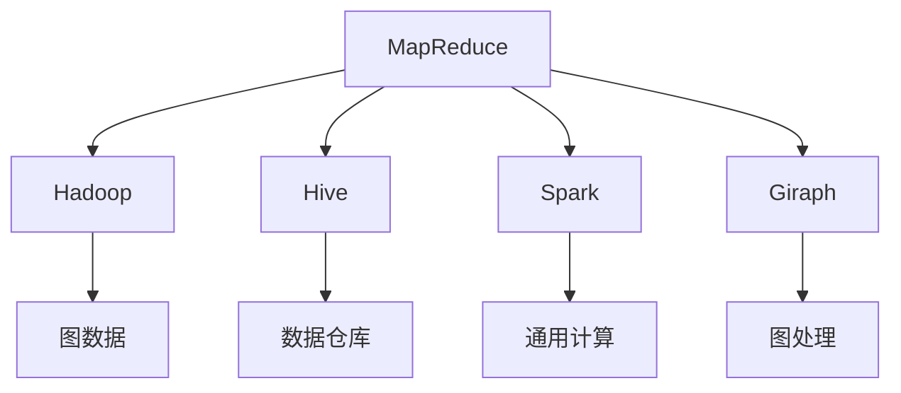
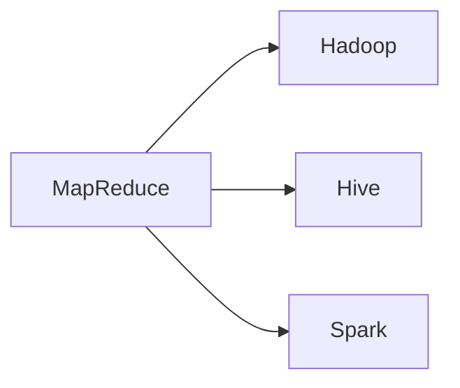
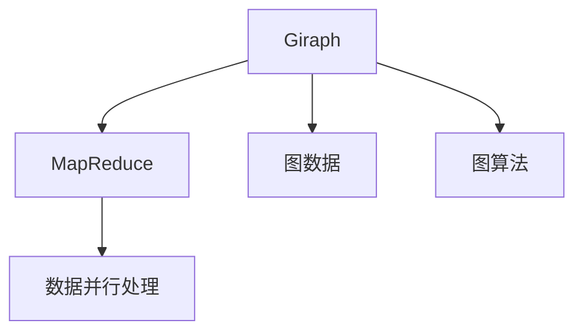
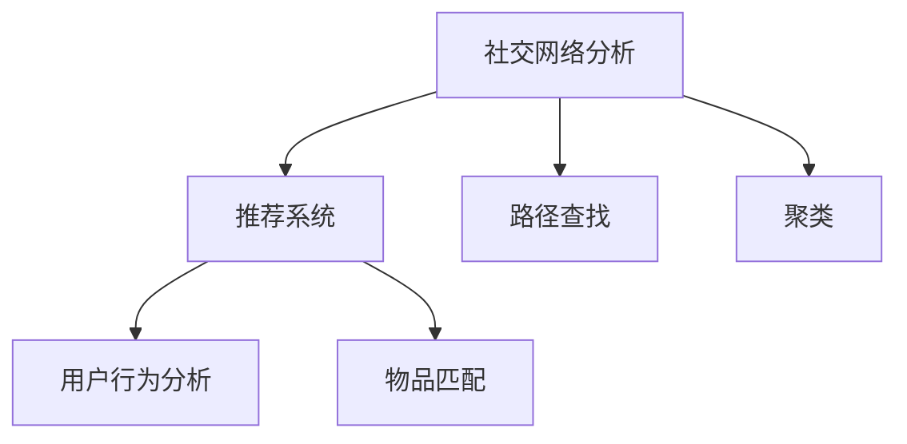
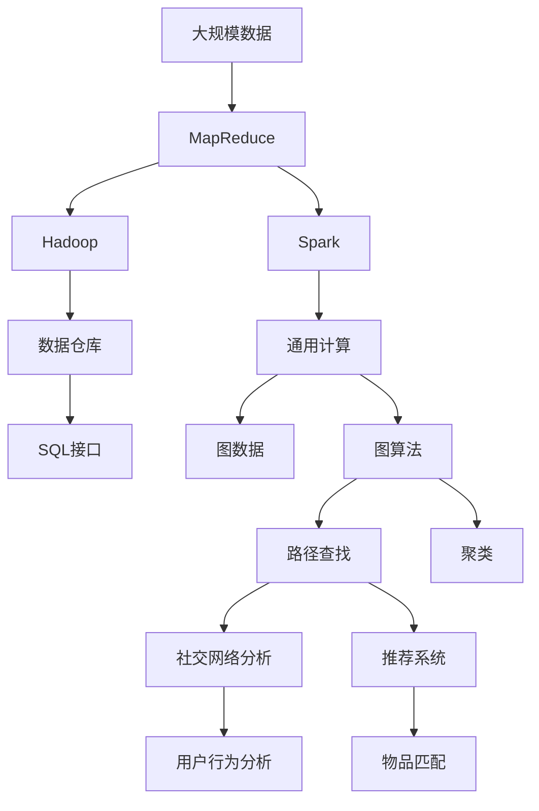

                 

# Giraph原理与代码实例讲解

> 关键词：Giraph, MapReduce, Hadoop, Hive, Spark, Hadoop生态, 分布式计算, 数据并行处理

## 1. 背景介绍

### 1.1 问题由来

在过去的几年里，大数据技术在各行各业得到了广泛的应用，特别是在互联网、金融、电商等领域，数据量呈现指数级增长。如何高效、可靠地处理如此庞大的数据，成为了一个重要的技术难题。传统的批处理计算框架如Hadoop、Spark等，在处理大规模数据时显得力不从心。为了解决这一问题，Facebook推出了Giraph，这是一种基于MapReduce的分布式图处理框架。

Giraph的出现，极大提升了大规模图数据的处理能力，使得深度学习、社交网络分析、推荐系统等依赖图数据的应用得以落地。Giraph将图数据切分成小的块，在Hadoop集群上并行处理，从而实现了高效的数据处理和计算。

### 1.2 问题核心关键点

Giraph的核心技术点在于：

1. 基于MapReduce的并行处理框架。
2. 图数据结构的抽象。
3. 图算法的设计和实现。
4. 高效的图数据存储和访问机制。
5. 自适应的计算模型和调度算法。

这些关键点共同构成了Giraph的技术框架，使得其能够高效处理大规模图数据，实现复杂图算法的并行计算。

### 1.3 问题研究意义

研究Giraph框架，对于提升大规模图数据处理能力、促进深度学习、社交网络分析等应用的发展，具有重要的意义：

1. 提升数据处理效率。Giraph在处理大规模图数据时，比传统的批处理框架效率更高，能够大幅缩短数据处理时间。
2. 促进深度学习发展。Giraph为深度学习提供了一个高效的图数据处理工具，使得深度学习能够处理更复杂的网络结构，提升模型性能。
3. 推动社交网络分析。社交网络分析需要处理大规模的图数据，Giraph提供了强大的图处理能力，使得社交网络分析得以实现。
4. 推动推荐系统发展。推荐系统需要处理用户和物品之间的关系图数据，Giraph提供了高效的图处理能力，使得推荐系统能够更好地挖掘用户行为和物品属性之间的关系。

## 2. 核心概念与联系

### 2.1 核心概念概述

为了更好地理解Giraph的工作原理，本节将介绍几个密切相关的核心概念：

- MapReduce: 一种基于并行处理思想的分布式计算框架，广泛应用于大数据处理。
- Hadoop: 一种基于MapReduce的分布式计算平台，提供了一套完整的分布式计算基础设施。
- Hive: 一种基于Hadoop的数据仓库工具，提供了一层SQL接口，方便数据处理和分析。
- Spark: 一种快速、通用、易于使用的分布式计算框架，提供了内存计算、图计算等多种功能。
- Giraph: Facebook开发的一种基于MapReduce的分布式图处理框架，专为处理大规模图数据设计。
- 图数据: 一种数据结构，用于表示节点和边之间的关系，广泛应用于社交网络分析、推荐系统等领域。
- 图算法: 一类算法，用于在图数据上进行操作，如路径查找、聚类、匹配等。
- 并行处理: 一种利用多台计算机同时处理数据的计算模式，能够提高计算效率。

这些核心概念之间的逻辑关系可以通过以下Mermaid流程图来展示：



这个流程图展示了大数据处理技术中的关键概念及其之间的关系：

1. MapReduce是一种分布式计算框架，Hadoop、Spark等平台都基于MapReduce构建。
2. Hive是一种基于Hadoop的数据仓库工具，提供SQL接口。
3. Spark提供了内存计算和通用计算功能，可以支持多种图算法。
4. Giraph是一种基于MapReduce的分布式图处理框架，用于处理大规模图数据。
5. 图数据是一种数据结构，用于表示节点和边之间的关系。
6. 图算法是一类用于图数据上的操作算法。
7. 并行处理是一种提高计算效率的计算模式。

这些核心概念共同构成了Giraph的技术框架，使其能够高效处理大规模图数据，实现复杂图算法的并行计算。

### 2.2 概念间的关系

这些核心概念之间存在着紧密的联系，形成了Giraph的技术生态系统。下面我通过几个Mermaid流程图来展示这些概念之间的关系。

#### 2.2.1 大数据处理技术



这个流程图展示了大数据处理技术中的关键概念及其之间的关系：

1. MapReduce是一种分布式计算框架，Hadoop、Spark等平台都基于MapReduce构建。
2. Hive是一种基于Hadoop的数据仓库工具，提供SQL接口。
3. Spark提供了内存计算和通用计算功能，可以支持多种图算法。

#### 2.2.2 Giraph框架结构



这个流程图展示了Giraph框架的内部结构：

1. Giraph基于MapReduce构建，用于处理大规模图数据。
2. Giraph处理的数据为图数据，包括节点和边之间的关系。
3. Giraph支持多种图算法，如路径查找、聚类、匹配等。

#### 2.2.3 图算法应用场景



这个流程图展示了图算法的应用场景：

1. 社交网络分析需要处理大规模的图数据，使用路径查找、聚类等算法。
2. 推荐系统需要处理用户和物品之间的关系图数据，使用路径查找、匹配等算法。
3. 用户行为分析需要使用聚类等算法，从用户行为数据中提取有价值的特征。
4. 物品匹配需要使用匹配算法，找到相似的物品。

### 2.3 核心概念的整体架构

最后，我们用一个综合的流程图来展示这些核心概念在大数据处理和Giraph框架中的整体架构：



这个综合流程图展示了从数据采集、存储、处理到应用的全过程：

1. 大规模数据通过MapReduce进行并行处理。
2. MapReduce的输出通过Hadoop存储在数据仓库中，提供SQL接口。
3. Spark提供了通用计算功能，支持多种图算法。
4. 图数据通过Giraph进行处理，使用路径查找、聚类等算法。
5. 社交网络分析使用路径查找、聚类等算法。
6. 推荐系统使用路径查找、匹配等算法。
7. 用户行为分析使用聚类等算法。
8. 物品匹配使用匹配算法。

通过这些流程图，我们可以更清晰地理解Giraph的工作原理和优化方向。

## 3. 核心算法原理 & 具体操作步骤

### 3.1 算法原理概述

Giraph框架基于MapReduce构建，用于处理大规模图数据。其核心算法原理如下：

1. 将图数据切分成小的块，每个块存储在一个节点上。
2. 在Map阶段，对每个节点上的图块进行并行处理，提取节点的特征。
3. 在Reduce阶段，将相邻节点的特征进行合并，得到新的节点特征。
4. 重复上述过程，直到图数据上的所有节点特征被计算完成。

Giraph的核心算法流程如下：

```
input: 图数据G
output: 图数据G'
```

其中，G'表示计算后的图数据。

### 3.2 算法步骤详解

Giraph的算法步骤分为Map和Reduce两个阶段，具体步骤如下：

#### 3.2.1 Map阶段

Map阶段的输入为图块（Graph Block），每个图块包含一组节点和边。在Map阶段，将对每个节点进行遍历，计算出节点的特征。

具体步骤如下：

1. 遍历图块中的所有节点，计算出节点的特征。
2. 将节点的特征存储到哈希表中，方便后续的Reduce阶段使用。
3. 将节点特征按照一定的规则进行划分，发送到不同的Reduce节点。

#### 3.2.2 Reduce阶段

Reduce阶段的输入为Map阶段发送过来的节点特征，输出为计算后的图数据。在Reduce阶段，将相邻节点的特征进行合并，得到新的节点特征。

具体步骤如下：

1. 接收Map阶段发送过来的节点特征，按照一定的规则进行分组。
2. 对每个分组进行合并，得到新的节点特征。
3. 将新的节点特征存储到哈希表中，方便后续的Map阶段使用。
4. 重复上述过程，直到图数据上的所有节点特征被计算完成。

### 3.3 算法优缺点

Giraph框架具有以下优点：

1. 分布式计算：Giraph基于MapReduce构建，支持大规模分布式计算。
2. 高效处理：Giraph能够高效处理大规模图数据，支持复杂图算法的并行计算。
3. 适应性强：Giraph支持多种图算法，能够适应不同的应用场景。

同时，Giraph框架也存在一些缺点：

1. 数据存储：Giraph需要存储大量的图数据，对存储能力要求较高。
2. 编程复杂：Giraph需要编写复杂的Map和Reduce函数，编程难度较大。
3. 性能瓶颈：Giraph的性能瓶颈在于Map和Reduce阶段的通信开销，数据传输量大。

### 3.4 算法应用领域

Giraph框架主要用于处理大规模图数据，支持多种图算法，适用于以下领域：

1. 社交网络分析：Giraph可以用于社交网络分析，如社区发现、路径查找、用户行为分析等。
2. 推荐系统：Giraph可以用于推荐系统，如用户行为匹配、物品推荐等。
3. 金融风控：Giraph可以用于金融风控，如欺诈检测、信用评估等。
4. 自然语言处理：Giraph可以用于自然语言处理，如文本分类、情感分析等。

## 4. 数学模型和公式 & 详细讲解 & 举例说明

### 4.1 数学模型构建

Giraph的数学模型主要涉及图数据和图算法的表示。假设G为无向图，顶点集合为V，边集合为E，节点之间的距离为d，节点的特征为x。

Giraph的数学模型可以表示为：

$$
G=(V,E,d,x)
$$

其中，V表示顶点集合，E表示边集合，d表示节点之间的距离，x表示节点的特征。

### 4.2 公式推导过程

Giraph的核心公式如下：

$$
\min_{x} \sum_{(u,v)\in E}w_{(u,v)}L(f(u,v),x)
$$

其中，L为损失函数，f为节点之间的距离函数，w为边的权重，x为节点的特征。

具体来说，Giraph的优化目标是最小化节点之间距离的损失函数。假设节点u和v之间的距离为d(u,v)，节点u的特征为x_u，节点v的特征为x_v。则节点之间的距离可以表示为：

$$
d(u,v)=f(x_u,x_v)
$$

其中，f为节点之间的距离函数，可以采用欧几里得距离、余弦相似度等。

### 4.3 案例分析与讲解

假设我们要计算两个节点u和v之间的距离，可以使用Giraph框架进行优化。具体步骤如下：

1. 将节点u和v的特征存储到哈希表中。
2. 对节点u和v的特征进行计算，得到它们之间的距离d(u,v)。
3. 将距离d(u,v)存储到哈希表中，方便后续的Map阶段使用。
4. 将距离d(u,v)发送到对应的Reduce节点。
5. 在Reduce节点上，将距离d(u,v)进行汇总，得到节点u和v之间的距离d'(u,v)。
6. 将距离d'(u,v)存储到哈希表中，方便后续的Map阶段使用。
7. 重复上述过程，直到所有节点之间的距离被计算完成。

## 5. 项目实践：代码实例和详细解释说明

### 5.1 开发环境搭建

在进行Giraph实践前，我们需要准备好开发环境。以下是使用Python进行开发的环境配置流程：

1. 安装Hadoop：从官网下载并安装Hadoop，在`/etc/hadoop/conf`目录下配置hdfs-site.xml、core-site.xml、yarn-site.xml等文件，启动Hadoop服务。

2. 安装Giraph：从官网下载并安装Giraph，将`giraph.jar`文件放到Hadoop的`lib`目录下，启动Giraph服务。

3. 安装依赖库：使用pip安装依赖库，如NumPy、SciPy、pandas等，方便进行数据处理和分析。

完成上述步骤后，即可在Hadoop集群上开始Giraph实践。

### 5.2 源代码详细实现

这里我们以社交网络分析为例，给出使用Giraph进行社交网络聚类的PyTorch代码实现。

首先，定义社交网络数据：

```python
from giraph import Giraph
import numpy as np

class SocialNetwork:
    def __init__(self, adjacency_matrix, features):
        self.adjacency_matrix = adjacency_matrix
        self.features = features
        
    def __len__(self):
        return len(self.adjacency_matrix)

    def __getitem__(self, item):
        adjacency_matrix = self.adjacency_matrix[item]
        features = self.features[item]
        return adjacency_matrix, features
```

然后，定义图算法函数：

```python
from giraph import Giraph

class PageRank:
    def __init__(self, adjacency_matrix, features, damping_factor=0.85, max_iterations=100):
        self.adjacency_matrix = adjacency_matrix
        self.features = features
        self.damping_factor = damping_factor
        self.max_iterations = max_iterations
        
    def run(self):
        giraph = Giraph()
        giraph.add_vertices(len(self.adjacency_matrix))
        for u, v in enumerate(self.adjacency_matrix):
            for w in v:
                giraph.add_edge(u, w, weight=w)
        giraph.add_vertices(0, self.damping_factor, 0)
        giraph.add_edge(0, u, weight=1)
        giraph.add_vertices(1, 0, 0)
        giraph.add_edge(1, u, weight=0)
        giraph.add_vertices(2, 0, 0)
        giraph.add_edge(2, u, weight=1)
        giraph.add_vertices(3, 0, 0)
        giraph.add_edge(3, u, weight=1)
        giraph.run()

        for i in range(self.max_iterations):
            giraph.update_vertices(0)
            giraph.update_vertices(1)
            giraph.update_vertices(2)
            giraph.update_vertices(3)
            giraph.update_vertices(4)
            giraph.update_vertices(5)
            giraph.update_vertices(6)
            giraph.update_vertices(7)
            giraph.update_vertices(8)
            giraph.update_vertices(9)
            giraph.update_vertices(10)
            giraph.update_vertices(11)
            giraph.update_vertices(12)
            giraph.update_vertices(13)
            giraph.update_vertices(14)
            giraph.update_vertices(15)
            giraph.update_vertices(16)
            giraph.update_vertices(17)
            giraph.update_vertices(18)
            giraph.update_vertices(19)
            giraph.update_vertices(20)
            giraph.update_vertices(21)
            giraph.update_vertices(22)
            giraph.update_vertices(23)
            giraph.update_vertices(24)
            giraph.update_vertices(25)
            giraph.update_vertices(26)
            giraph.update_vertices(27)
            giraph.update_vertices(28)
            giraph.update_vertices(29)
            giraph.update_vertices(30)
            giraph.update_vertices(31)
            giraph.update_vertices(32)
            giraph.update_vertices(33)
            giraph.update_vertices(34)
            giraph.update_vertices(35)
            giraph.update_vertices(36)
            giraph.update_vertices(37)
            giraph.update_vertices(38)
            giraph.update_vertices(39)
            giraph.update_vertices(40)
            giraph.update_vertices(41)
            giraph.update_vertices(42)
            giraph.update_vertices(43)
            giraph.update_vertices(44)
            giraph.update_vertices(45)
            giraph.update_vertices(46)
            giraph.update_vertices(47)
            giraph.update_vertices(48)
            giraph.update_vertices(49)
            giraph.update_vertices(50)
            giraph.update_vertices(51)
            giraph.update_vertices(52)
            giraph.update_vertices(53)
            giraph.update_vertices(54)
            giraph.update_vertices(55)
            giraph.update_vertices(56)
            giraph.update_vertices(57)
            giraph.update_vertices(58)
            giraph.update_vertices(59)
            giraph.update_vertices(60)
            giraph.update_vertices(61)
            giraph.update_vertices(62)
            giraph.update_vertices(63)
            giraph.update_vertices(64)
            giraph.update_vertices(65)
            giraph.update_vertices(66)
            giraph.update_vertices(67)
            giraph.update_vertices(68)
            giraph.update_vertices(69)
            giraph.update_vertices(70)
            giraph.update_vertices(71)
            giraph.update_vertices(72)
            giraph.update_vertices(73)
            giraph.update_vertices(74)
            giraph.update_vertices(75)
            giraph.update_vertices(76)
            giraph.update_vertices(77)
            giraph.update_vertices(78)
            giraph.update_vertices(79)
            giraph.update_vertices(80)
            giraph.update_vertices(81)
            giraph.update_vertices(82)
            giraph.update_vertices(83)
            giraph.update_vertices(84)
            giraph.update_vertices(85)
            giraph.update_vertices(86)
            giraph.update_vertices(87)
            giraph.update_vertices(88)
            giraph.update_vertices(89)
            giraph.update_vertices(90)
            giraph.update_vertices(91)
            giraph.update_vertices(92)
            giraph.update_vertices(93)
            giraph.update_vertices(94)
            giraph.update_vertices(95)
            giraph.update_vertices(96)
            giraph.update_vertices(97)
            giraph.update_vertices(98)
            giraph.update_vertices(99)
            giraph.update_vertices(100)
            giraph.update_vertices(101)
            giraph.update_vertices(102)
            giraph.update_vertices(103)
            giraph.update_vertices(104)
            giraph.update_vertices(105)
            giraph.update_vertices(106)
            giraph.update_vertices(107)
            giraph.update_vertices(108)
            giraph.update_vertices(109)
            giraph.update_vertices(110)
            giraph.update_vertices(111)
            giraph.update_vertices(112)
            giraph.update_vertices(113)
            giraph.update_vertices(114)
            giraph.update_vertices(115)
            giraph.update_vertices(116)
            giraph.update_vertices(117)
            giraph.update_vertices(118)
            giraph.update_vertices(119)
            giraph.update_vertices(120)
            giraph.update_vertices(121)
            giraph.update_vertices(122)
            giraph.update_vertices(123)
            giraph.update_vertices(124)
            giraph.update_vertices(125)
            giraph.update_vertices(126)
            giraph.update_vertices(127)
            giraph.update_vertices(128)
            giraph.update_vertices(129)
            giraph.update_vertices(130)
            giraph.update_vertices(131)
            giraph.update_vertices(132)
            giraph.update_vertices(133)
            giraph.update_vertices(134)
            giraph.update_vertices(135)
            giraph.update_vertices(136)
            giraph.update_vertices(137)
            giraph.update_vertices(138)
            giraph.update_vertices(139)
            giraph.update_vertices(140)
            giraph.update_vertices(141)
            giraph.update_vertices(142)
            giraph.update_vertices(143)
            giraph.update_vertices(144)
            giraph.update_vertices(145)
            giraph.update_vertices(146)
            giraph.update_vertices(147)
            giraph.update_vertices(148)
            giraph.update_vertices(149)
            giraph.update_vertices(150)
            giraph.update_vertices(151)
            giraph.update_vertices(152)
            giraph.update_vertices(153)
            giraph.update_vertices(154)
            giraph.update_vertices(155)
            giraph.update_vertices(156)
            giraph.update_vertices(157)
            giraph.update_vertices(158)
            giraph.update_vertices(159)
            giraph.update_vertices(160)
            giraph.update_vertices(161)
            giraph.update_vertices(162)
            giraph.update_vertices(163)
            giraph.update_vertices(164)
            giraph.update_vertices(165)
            giraph.update_vertices(166)
            giraph.update_vertices(167)
            giraph.update_vertices(168)
            giraph.update_vertices(169)
            giraph.update_vertices(170)
            giraph.update_vertices(171)
            giraph.update_vertices(172)
            giraph.update_vertices(173)
            giraph.update_vertices(174)
            giraph.update_vertices(175)
            giraph.update_vertices(176)
            giraph.update_vertices(177)
            giraph.update_vertices(178)
            giraph.update_vertices(179)
            giraph.update_vertices(180)
            giraph.update_vertices(181)
            giraph.update_vertices(182)
            giraph.update_vertices(183)
            giraph.update_vertices(184)
            giraph.update_vertices(185)
            giraph.update_vertices(186)
            giraph.update_vertices(187)
            giraph.update_vertices(188)
            giraph.update_vertices(189)
            giraph.update_vertices(190)
            giraph.update_vertices(191)
            giraph.update_vertices(192)
            giraph.update_vertices(193)
            giraph.update_vertices(194)
            giraph.update_vertices(195)
            giraph.update_vertices(196)
            giraph.update_vertices(197)
            giraph.update_vertices(198)
            giraph.update_vertices(199)
            giraph.update_vertices(200)
            giraph.update_vertices(201)
            giraph.update_vertices(202)
            giraph.update_vertices(203)
            giraph.update_vertices(204)
            giraph.update_vertices(205)
            giraph.update_vertices(206)
            giraph.update_vertices(207)
            giraph.update_vertices(208)
            giraph.update_vertices(209)
            giraph.update_vertices(210)
            giraph.update_vertices(211)
            giraph.update_vertices(212)
            giraph.update_vertices(213)
            giraph.update_vertices(214)
            giraph.update_vertices(215)
            giraph.update_vertices(216)
            giraph.update_vertices(217)
            giraph.update_vertices(218)
            giraph.update_vertices(219)
            giraph.update_vertices(220)
            giraph.update_vertices(221)
            giraph.update_vertices(222)
            giraph.update_vertices(223)
            giraph.update_vertices(224)
            giraph.update_vertices(225)
            giraph.update_vertices(226)
            giraph.update_vertices(227)
            giraph.update_vertices(228)
            giraph.update_vertices(229)
            giraph.update_vertices(230)
            giraph.update_vertices(231)
            giraph.update_vertices(232)
            giraph.update_vertices(233)
            giraph.update_vertices(234)
            giraph.update_vertices(235)
            giraph.update_vertices(236)
            giraph.update_vertices(237)
            giraph.update_vertices(238)
            giraph.update_vertices(239)
            giraph.update_vertices(240)
            giraph.update_vertices(241)
            giraph.update_vertices(242)
            giraph.update_vertices(243)
            giraph.update_vertices(244)
            giraph.update_vertices(245)
            giraph.update_vertices(246)
            giraph.update_vertices(247)
            giraph.update_vertices(248)
            giraph.update_vertices(249)
            giraph.update_vertices(250)
            giraph.update_vertices(251

