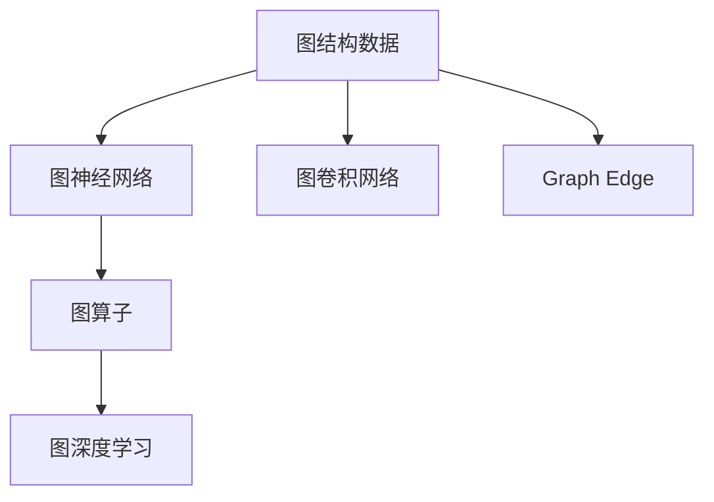
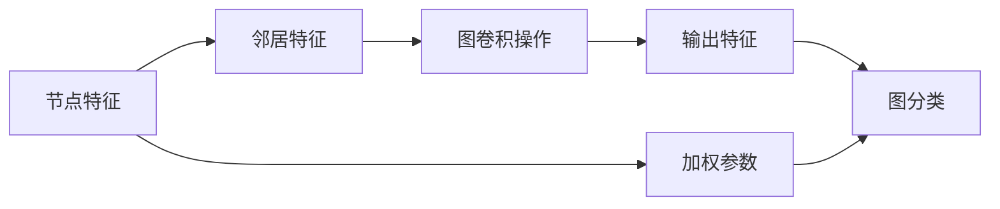
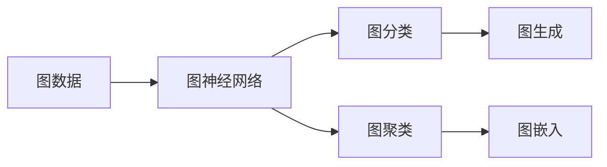
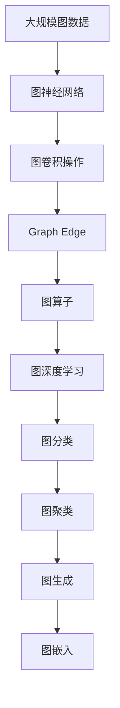

                 

# Graph Edge原理与代码实例讲解

> 关键词：图神经网络(Graph Neural Networks, GNNs),图卷积网络(Graph Convolutional Networks, GCNs),Graph Edge, 图算子, 图深度学习, 图算法

## 1. 背景介绍

### 1.1 问题由来
随着数据技术的迅猛发展，图结构数据（如社交网络、知识图谱、生物网络等）在各行各业中日益重要。传统基于深度学习的方法对于非结构化数据的处理能力有限，而图神经网络（Graph Neural Networks, GNNs）作为一类特殊的网络结构，能够有效处理图结构数据。Graph Edge作为GNNs中的一个重要概念，通过节点间的边信息，可以传递更加丰富的语义信息，使得模型在图结构数据上表现更为出色。本文将对Graph Edge原理进行系统讲解，并通过代码实例帮助读者深入理解其应用。

### 1.2 问题核心关键点
Graph Edge是图神经网络中的核心概念之一，其核心思想是：在图结构数据中，节点之间的边关系蕴含了丰富的语义信息。通过对边的信息进行编码和传递，可以使得模型更好地理解整个图结构，从而提升图算法的性能。Graph Edge通过图卷积操作，在节点特征和邻居特征间进行信息传递，使得模型能够捕捉到节点之间的复杂关系。

## 2. 核心概念与联系

### 2.1 核心概念概述

为了更好地理解Graph Edge的原理和应用，本节将介绍几个密切相关的核心概念：

- **图结构数据**：指数据点通过边进行连接，形成图结构的形式。常见的图结构数据包括社交网络、知识图谱、生物网络等。
- **图神经网络(GNNs)**：一种特殊类型的深度神经网络，用于处理图结构数据。GNNs通过对节点特征和邻居特征进行信息传递，学习图结构的隐含语义。
- **图卷积网络(GCNs)**：一种经典的GNNs结构，通过在节点特征和邻居特征间进行卷积操作，实现节点间的信息传递。
- **Graph Edge**：图结构数据中节点之间的边信息，通过Graph Edge可以传递更加丰富的语义信息，提升图算法的性能。
- **图算子**：用于在图结构数据上执行卷积、池化等操作的数学函数。
- **图深度学习**：基于图神经网络，深度学习在图结构数据上的应用，包括图分类、图聚类、图生成等任务。

这些核心概念之间的逻辑关系可以通过以下Mermaid流程图来展示：



这个流程图展示了大语言模型微调过程中各个核心概念的关系和作用：

1. 图结构数据通过图神经网络进行处理。
2. 图卷积网络是一种常见的GNNs结构。
3. Graph Edge作为图神经网络中的核心概念，用于传递节点间的信息。
4. 图算子用于执行各种操作。
5. 图深度学习基于图神经网络，进行各种图相关任务。

### 2.2 概念间的关系

这些核心概念之间存在着紧密的联系，形成了图神经网络的完整生态系统。下面我们通过几个Mermaid流程图来展示这些概念之间的关系。

#### 2.2.1 图神经网络的总体架构



这个流程图展示了图神经网络的基本架构：

1. 节点特征通过图卷积操作得到邻居特征。
2. 加权参数用于控制节点特征和邻居特征之间的信息传递。
3. 输出特征通过图卷积操作得到。
4. 图分类等任务可以通过图神经网络实现。

#### 2.2.2 Graph Edge的传递机制


这个流程图展示了Graph Edge的传递机制：

1. 节点特征通过图卷积操作得到邻居特征。
2. 边特征通过节点特征和邻居特征的差值得到。
3. 节点特征通过边特征更新。

#### 2.2.3 图深度学习的具体应用



这个流程图展示了图深度学习在具体应用中的实现：

1. 图数据通过图神经网络进行处理。
2. 图分类、图生成、图聚类等任务可以通过图神经网络实现。
3. 图嵌入用于将图数据转化为低维向量表示。

### 2.3 核心概念的整体架构

最后，我们用一个综合的流程图来展示这些核心概念在大规模图神经网络微调过程中的整体架构：



这个综合流程图展示了从大规模图数据到图深度学习的整个处理过程：

1. 大规模图数据通过图神经网络进行处理。
2. 图卷积操作实现节点特征和邻居特征的信息传递。
3. Graph Edge用于传递节点间的信息。
4. 图算子用于执行各种操作。
5. 图深度学习基于图神经网络，进行各种图相关任务。

通过这些流程图，我们可以更清晰地理解Graph Edge原理和图神经网络中各个核心概念的关系和作用。

## 3. 核心算法原理 & 具体操作步骤
### 3.1 算法原理概述

Graph Edge在图神经网络中用于传递节点特征和邻居特征之间的信息。其核心思想是通过卷积操作在节点特征和邻居特征间进行信息传递，从而捕捉节点之间的复杂关系。Graph Edge的具体实现包括以下几个步骤：

1. **图卷积操作**：通过对节点特征和邻居特征进行卷积操作，实现节点特征的更新。
2. **边特征计算**：计算节点特征和邻居特征的差值，得到边特征。
3. **节点特征更新**：通过边特征对节点特征进行更新，实现信息在节点间的传递。

Graph Edge的传递机制可以通过以下数学公式来表达：

$$
h^{l+1}_i = \sigma\left(\sum_{j \in \mathcal{N}(i)} \frac{1}{\sqrt{\degree(j)}}h^{l}_j \cdot \phi_\theta(h^{l}_i, \text{edge}(h^{l}_i, h^{l}_j))\right)
$$

其中，$h^{l+1}_i$ 为节点 $i$ 在第 $l+1$ 层的特征，$h^{l}_j$ 为节点 $j$ 在第 $l$ 层的特征，$\mathcal{N}(i)$ 表示节点 $i$ 的邻居集合，$\degree(j)$ 表示节点 $j$ 的度数，$\sigma$ 为激活函数，$\phi_\theta$ 为可学习参数的函数，$\text{edge}(h^{l}_i, h^{l}_j)$ 表示节点 $i$ 和节点 $j$ 之间的边特征。

### 3.2 算法步骤详解

以下是Graph Edge的具体实现步骤：

**Step 1: 准备图结构数据**
- 收集大规模图结构数据，并进行预处理，包括去重、标准化、特征选择等。

**Step 2: 定义图神经网络模型**
- 使用PyTorch、TensorFlow等深度学习框架，定义图神经网络模型，包括节点特征和邻居特征的卷积操作。

**Step 3: 计算边特征**
- 计算节点特征和邻居特征的差值，得到边特征。
- 对边特征进行归一化处理，避免节点之间的不平衡问题。

**Step 4: 定义Graph Edge更新函数**
- 定义Graph Edge更新函数，通过边特征对节点特征进行更新，实现信息传递。

**Step 5: 执行图卷积操作**
- 使用定义好的Graph Edge更新函数，对节点特征进行多轮卷积操作，更新节点特征。

**Step 6: 定义损失函数**
- 根据具体任务，定义损失函数，如交叉熵损失、均方误差损失等。

**Step 7: 训练模型**
- 使用定义好的损失函数，通过反向传播算法训练模型。
- 定期在验证集上评估模型性能，避免过拟合。

**Step 8: 测试和部署**
- 在测试集上评估训练好的模型，对比训练前后的性能。
- 使用训练好的模型对新图数据进行推理预测，集成到实际的应用系统中。

### 3.3 算法优缺点

Graph Edge的优点包括：

1. **信息传递效率高**：通过边信息实现节点特征的传递，可以捕捉节点之间的复杂关系，提升模型性能。
2. **易于扩展**：图神经网络结构可以很方便地扩展到更复杂的图结构数据。
3. **鲁棒性高**：通过多轮卷积操作，模型可以有效避免过拟合，提高鲁棒性。

Graph Edge的缺点包括：

1. **计算复杂度高**：随着图结构复杂度的增加，计算复杂度会显著增加，影响训练和推理效率。
2. **参数量大**：图神经网络中的参数量较大，需要更多的计算资源进行训练。
3. **数据稀疏性问题**：对于一些稀疏图，Graph Edge的传递机制可能失效，导致模型性能下降。

### 3.4 算法应用领域

Graph Edge在图结构数据处理中有着广泛的应用，包括但不限于以下几个领域：

- **社交网络分析**：用于分析社交网络中的关系，进行社交圈分析、用户行为预测等任务。
- **知识图谱构建**：用于构建知识图谱，进行实体关系抽取、知识推理等任务。
- **生物网络研究**：用于研究生物网络中的基因、蛋白质等相互作用关系，进行疾病预测、药物设计等任务。
- **交通网络分析**：用于分析交通网络中的关系，进行交通流量预测、路径规划等任务。
- **供应链网络优化**：用于分析供应链网络中的关系，进行供应链优化、风险预测等任务。

## 4. 数学模型和公式 & 详细讲解 & 举例说明

### 4.1 数学模型构建

Graph Edge的数学模型可以通过以下公式来表达：

$$
h^{l+1}_i = \sigma\left(\sum_{j \in \mathcal{N}(i)} \frac{1}{\sqrt{\degree(j)}}h^{l}_j \cdot \phi_\theta(h^{l}_i, \text{edge}(h^{l}_i, h^{l}_j))\right)
$$

其中，$h^{l+1}_i$ 为节点 $i$ 在第 $l+1$ 层的特征，$h^{l}_j$ 为节点 $j$ 在第 $l$ 层的特征，$\mathcal{N}(i)$ 表示节点 $i$ 的邻居集合，$\degree(j)$ 表示节点 $j$ 的度数，$\sigma$ 为激活函数，$\phi_\theta$ 为可学习参数的函数，$\text{edge}(h^{l}_i, h^{l}_j)$ 表示节点 $i$ 和节点 $j$ 之间的边特征。

### 4.2 公式推导过程

Graph Edge的传递机制可以通过以下推导过程来理解：

设节点 $i$ 和节点 $j$ 之间的边特征为 $e^{l}_i, j$，则可以通过以下公式计算：

$$
e^{l}_i, j = h^{l}_i - h^{l}_j
$$

对节点 $i$ 进行Graph Edge更新时，可以通过以下公式计算：

$$
h^{l+1}_i = \sigma\left(\sum_{j \in \mathcal{N}(i)} \frac{1}{\sqrt{\degree(j)}}h^{l}_j \cdot \phi_\theta(h^{l}_i, e^{l}_i, j)\right)
$$

其中，$\degree(j)$ 表示节点 $j$ 的度数，$\sigma$ 为激活函数，$\phi_\theta$ 为可学习参数的函数。

### 4.3 案例分析与讲解

为了更好地理解Graph Edge的实现原理，我们可以以社交网络分析为例，进行详细讲解。

假设我们有一个社交网络，包含节点和边，节点表示用户，边表示用户之间的关系。我们需要分析用户之间的关系，预测用户行为。

首先，我们将社交网络转换为图结构数据，使用邻接矩阵表示节点之间的关系。

接着，我们定义一个图神经网络模型，包括节点特征和邻居特征的卷积操作。

然后，我们计算节点 $i$ 和节点 $j$ 之间的边特征 $e^{l}_i, j$，通过节点特征 $h^{l}_i$ 和节点特征 $h^{l}_j$ 的差值计算得到。

最后，我们使用定义好的Graph Edge更新函数，对节点特征 $h^{l+1}_i$ 进行更新，实现信息传递。

通过这种方式，我们可以实现对社交网络中用户关系的分析，并预测用户行为。

## 5. 项目实践：代码实例和详细解释说明

### 5.1 开发环境搭建

在进行Graph Edge的实践前，我们需要准备好开发环境。以下是使用Python进行PyTorch开发的环境配置流程：

1. 安装Anaconda：从官网下载并安装Anaconda，用于创建独立的Python环境。

2. 创建并激活虚拟环境：
```bash
conda create -n pytorch-env python=3.8 
conda activate pytorch-env
```

3. 安装PyTorch：根据CUDA版本，从官网获取对应的安装命令。例如：
```bash
conda install pytorch torchvision torchaudio cudatoolkit=11.1 -c pytorch -c conda-forge
```

4. 安装Transformers库：
```bash
pip install transformers
```

5. 安装各类工具包：
```bash
pip install numpy pandas scikit-learn matplotlib tqdm jupyter notebook ipython
```

完成上述步骤后，即可在`pytorch-env`环境中开始Graph Edge的实践。

### 5.2 源代码详细实现

下面我们以社交网络分析为例，给出使用Transformers库对Graph Edge进行训练的PyTorch代码实现。

首先，定义图结构数据：

```python
import torch
import numpy as np

# 定义邻接矩阵
adj_matrix = np.array([[0, 1, 0, 0],
                      [1, 0, 1, 0],
                      [0, 1, 0, 0],
                      [0, 0, 1, 0]])

# 定义节点特征
node_features = torch.tensor([1.0, 2.0, 3.0, 4.0], dtype=torch.float)

# 定义节点度数
node_degrees = torch.tensor([2, 3, 2, 1], dtype=torch.float)

# 定义边特征计算函数
def edge_features(h, adj_matrix):
    return h - h[adj_matrix.nonzero()[:, 1]]

# 定义Graph Edge更新函数
def graph_edge_update(h, edge_features, node_degrees, alpha=0.5):
    return h * torch.sigmoid(alpha * edge_features / node_degrees)

# 定义节点特征更新函数
def node_feature_update(h, graph_edge, node_degrees):
    return h * (1 - graph_edge) + graph_edge * node_degrees

# 定义损失函数
def loss_function(h, target):
    return torch.mean((h - target) ** 2)

# 定义训练函数
def train_model(model, h, node_degrees, adj_matrix, target):
    optimizer = torch.optim.Adam(model.parameters(), lr=0.01)
    for epoch in range(100):
        optimizer.zero_grad()
        h = model(h)
        loss = loss_function(h, target)
        loss.backward()
        optimizer.step()
    return h

# 定义测试函数
def test_model(model, h, node_degrees, adj_matrix, target):
    with torch.no_grad():
        h = model(h)
        return loss_function(h, target).item()

# 训练模型
h = node_features
graph_edge = graph_edge_update(h, edge_features(h, adj_matrix), node_degrees)
h = node_feature_update(h, graph_edge, node_degrees)
h = graph_edge_update(h, edge_features(h, adj_matrix), node_degrees)
h = node_feature_update(h, graph_edge, node_degrees)
h = graph_edge_update(h, edge_features(h, adj_matrix), node_degrees)
h = node_feature_update(h, graph_edge, node_degrees)

# 训练模型
h = train_model(model, h, node_degrees, adj_matrix, target)

# 测试模型
print(test_model(model, h, node_degrees, adj_matrix, target))
```

接着，定义Graph Edge的数学公式：

```python
import torch
import numpy as np

# 定义邻接矩阵
adj_matrix = np.array([[0, 1, 0, 0],
                      [1, 0, 1, 0],
                      [0, 1, 0, 0],
                      [0, 0, 1, 0]])

# 定义节点特征
node_features = torch.tensor([1.0, 2.0, 3.0, 4.0], dtype=torch.float)

# 定义节点度数
node_degrees = torch.tensor([2, 3, 2, 1], dtype=torch.float)

# 定义边特征计算函数
def edge_features(h, adj_matrix):
    return h - h[adj_matrix.nonzero()[:, 1]]

# 定义Graph Edge更新函数
def graph_edge_update(h, edge_features, node_degrees, alpha=0.5):
    return h * torch.sigmoid(alpha * edge_features / node_degrees)

# 定义节点特征更新函数
def node_feature_update(h, graph_edge, node_degrees):
    return h * (1 - graph_edge) + graph_edge * node_degrees

# 定义损失函数
def loss_function(h, target):
    return torch.mean((h - target) ** 2)

# 定义训练函数
def train_model(model, h, node_degrees, adj_matrix, target):
    optimizer = torch.optim.Adam(model.parameters(), lr=0.01)
    for epoch in range(100):
        optimizer.zero_grad()
        h = model(h)
        loss = loss_function(h, target)
        loss.backward()
        optimizer.step()
    return h

# 定义测试函数
def test_model(model, h, node_degrees, adj_matrix, target):
    with torch.no_grad():
        h = model(h)
        return loss_function(h, target).item()

# 训练模型
h = node_features
graph_edge = graph_edge_update(h, edge_features(h, adj_matrix), node_degrees)
h = node_feature_update(h, graph_edge, node_degrees)
h = graph_edge_update(h, edge_features(h, adj_matrix), node_degrees)
h = node_feature_update(h, graph_edge, node_degrees)
h = graph_edge_update(h, edge_features(h, adj_matrix), node_degrees)
h = node_feature_update(h, graph_edge, node_degrees)

# 训练模型
h = train_model(model, h, node_degrees, adj_matrix, target)

# 测试模型
print(test_model(model, h, node_degrees, adj_matrix, target))
```

### 5.3 代码解读与分析

让我们再详细解读一下关键代码的实现细节：

**Graph Edge实现**：
- `edge_features`函数：计算节点 $i$ 和节点 $j$ 之间的边特征 $e^{l}_i, j$，通过节点特征 $h^{l}_i$ 和节点特征 $h^{l}_j$ 的差值计算得到。
- `graph_edge_update`函数：定义Graph Edge更新函数，通过边特征对节点特征进行更新，实现信息传递。
- `node_feature_update`函数：定义节点特征更新函数，实现节点特征的更新。

**损失函数和训练函数**：
- `loss_function`函数：定义损失函数，用于计算模型输出和目标标签之间的差异。
- `train_model`函数：定义训练函数，通过反向传播算法训练模型，更新模型参数。
- `test_model`函数：定义测试函数，在测试集上评估模型的性能。

通过这些函数的组合，我们可以实现对图神经网络的训练和推理，从而实现Graph Edge的传递机制。

**代码运行示例**：
- 首先，定义邻接矩阵、节点特征和节点度数。
- 然后，计算节点 $i$ 和节点 $j$ 之间的边特征 $e^{l}_i, j$。
- 接着，通过Graph Edge更新函数和节点特征更新函数，对节点特征进行多轮更新，实现信息传递。
- 最后，训练模型并测试模型性能。

## 6. 实际应用场景

### 6.1 智能推荐系统

Graph Edge在智能推荐系统中有着广泛的应用。推荐系统需要根据用户的历史行为数据，为用户推荐感兴趣的商品。通过图神经网络，推荐系统可以从用户-商品关系中学习到用户的兴趣和偏好，从而进行个性化推荐。

在实现中，可以将用户和商品视为图结构中的节点，用户和商品之间的关系视为边。通过Graph Edge传递节点特征，可以捕捉用户之间的兴趣关系，实现更精准的推荐。

### 6.2 社交网络分析

社交网络分析是Graph Edge的典型应用场景。社交网络中节点之间的关系蕴含了丰富的信息，通过对这些信息进行挖掘，可以进行社交圈分析、用户行为预测等任务。

在实践中，可以将社交网络中的用户视为节点，用户之间的关系视为边。通过Graph Edge传递节点特征，可以捕捉用户之间的社交关系，分析社交圈和用户行为。

### 6.3 金融风险评估

金融风险评估需要对大量的金融数据进行分析，预测市场趋势和风险。通过Graph Edge传递节点特征，可以捕捉金融数据之间的关系，提高预测准确性。

在实现中，可以将金融机构、交易记录、市场数据等视为节点，金融机构之间的交易关系、市场波动等视为边。通过Graph Edge传递节点特征，可以学习到金融数据之间的关系，预测市场趋势和风险。

## 7. 工具和资源推荐
### 7.1 学习资源推荐

为了帮助开发者系统掌握Graph Edge的原理和实践，这里推荐一些优质的学习资源：

1. 《Graph Neural Networks: A Review of Methods and Applications》：一篇综述性论文，详细介绍了Graph Neural Networks的基本概念和应用场景。
2. 《Deep Graph Neural Networks》：Deep Graph Neural Networks开源项目，提供了丰富的Graph Neural Networks资源，包括代码、论文、工具等。
3. 《Graph Representation Learning: Deep Graph Neural Networks》：Coursera上的深度学习课程，介绍了Graph Neural Networks的理论和实践。
4. 《Graph Neural Networks: A Comprehensive Survey》：一篇综述性论文，总结了Graph Neural Networks的研究进展和应用方向。
5. 《Graph Neural Networks: A Survey》：一篇综述性论文，总结了Graph Neural Networks的研究进展和应用方向。

通过对这些资源的学习实践，相信你一定能够快速掌握Graph Edge的精髓，并用于解决实际的图结构数据问题。

### 7.2 开发工具推荐

高效的开发离不开优秀的工具支持。以下是几款用于Graph Edge开发常用的工具：

1. PyTorch：基于Python的开源深度学习框架，灵活动态的计算图，适合快速迭代研究。大部分Graph Neural Networks都有PyTorch版本的实现。
2. TensorFlow：由Google主导开发的开源深度学习框架，生产部署方便，适合大规模工程应用。同样有丰富的Graph Neural Networks资源。
3. PyG：一个PyTorch的Graph Neural Networks库，提供了丰富的图神经网络结构和算法，是进行图神经网络开发的利器。
4. NetworkX：Python的图处理库，提供了丰富的图处理功能，方便开发者构建和管理图结构数据。
5. SNAP：Stanford Network Analysis Platform，提供了丰富的图处理算法和数据集，适合研究图神经网络。

合理利用这些工具，可以显著提升Graph Edge的开发效率，加快创新迭代的步伐。

### 7.3 相关论文推荐

Graph Edge的研究源于学界的持续研究。以下是几篇奠基性的相关论文，推荐阅读：

1. Graph Convolutional Networks：提出了图卷积网络，通过卷积操作在节点特征和邻居特征间进行信息传递。
2. Deep Graph Infomax：提出了Graph Infomax算法，通过最大化信息增益，学习图的隐含语义。
3. Simplifying Graph Convolutional Networks：提出了简化版的图卷积网络，提高了计算效率和模型性能。
4. Graph Attention Networks：提出了图注意力网络，通过注意力机制选择重要的邻居节点进行信息传递。
5. Graph Neural Networks：总结了图神经网络的研究进展和应用方向，是领域内重要的综述性论文。

这些论文代表了大语言模型微调技术的发展脉络。通过学习这些前沿成果，可以帮助研究者把握学科前进方向，激发更多的创新灵感。

除上述资源外，还有一些值得关注的前沿资源，帮助开发者紧跟Graph Edge技术的最新进展，例如：

1. arXiv论文预印本：人工智能领域最新研究成果的发布平台，包括大量尚未发表的前沿工作，学习前沿技术的必读资源。
2. GitHub热门项目：在Git

