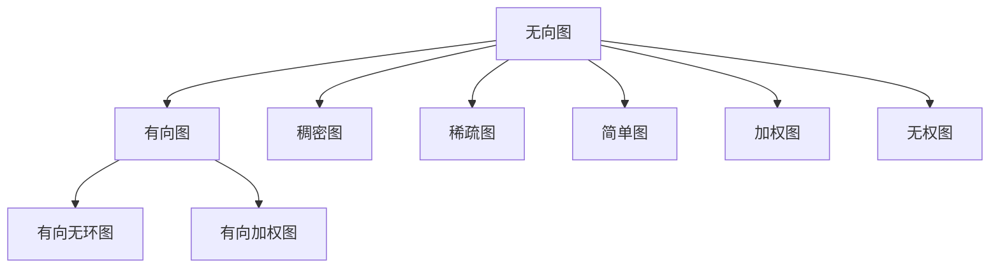
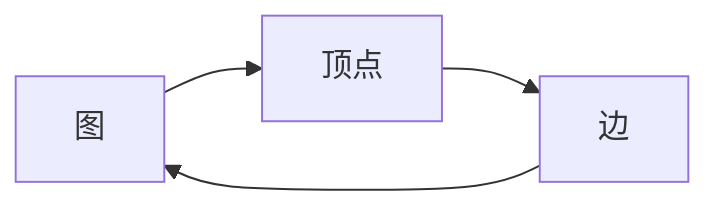
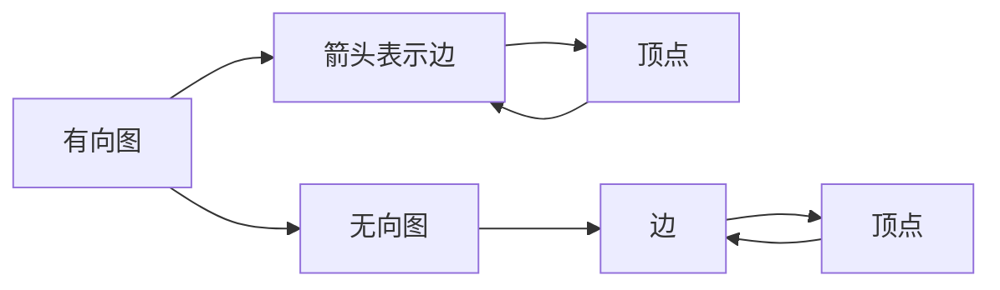
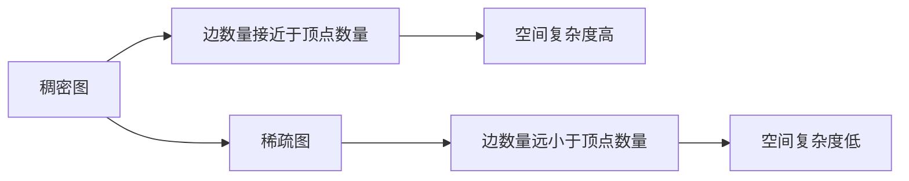
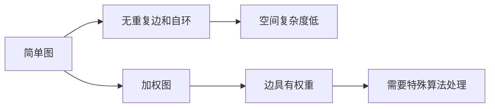
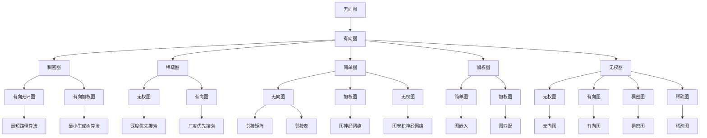

                 

# Graph Vertex原理与代码实例讲解

> 关键词：图论,顶点,边,邻接矩阵,邻接表,深度优先搜索,广度优先搜索,最短路径算法,最小生成树算法

## 1. 背景介绍

### 1.1 问题由来
图论（Graph Theory）是计算机科学和数学中的一个重要领域，研究图结构、算法及应用。图由顶点（Vertex）和边（Edge）组成，广泛应用于社交网络分析、网络路由、资源调度、信号处理等领域。顶点是图的基本元素，通过对顶点和边的研究，可以发现很多关于复杂系统的特征和规律。

近年来，图论在机器学习和深度学习中也有广泛的应用。例如，图神经网络（Graph Neural Network, GNN）就是利用图结构的性质，通过图卷积等操作，学习节点特征和图结构的关系，应用于节点分类、链接预测、社区发现等任务。

### 1.2 问题核心关键点
顶点（Vertex）是图论中的基本元素，通常用符号 $V$ 表示。顶点之间的连接关系由边（Edge）表示，通常用符号 $E$ 表示。边的方向可以是无向的或有向的。无向边代表两个顶点之间的对称关系，有向边代表一个顶点指向另一个顶点。

顶点的基本性质包括：
1. 顶点可以有多种类型，如人、车、物品等。
2. 顶点可以具有多种属性，如姓名、年龄、位置等。
3. 顶点可以具有不同的状态，如在线、离线、忙碌等。

顶点之间的连接关系由边表示，边的属性可以包括边权重、边类型等。边的基本性质包括：
1. 边可以具有方向，如单向或双向。
2. 边可以具有多种类型，如道路、电缆、关系等。
3. 边可以具有不同的成本，如时间、距离、费用等。

在实际应用中，顶点和边的属性是多样化的，需要根据具体问题的需求进行设计。例如，在社交网络中，顶点代表用户，边代表好友关系；在物流网络中，顶点代表仓库，边代表运输路线；在金融网络中，顶点代表公司，边代表投资关系。

顶点和边的关系可以通过邻接矩阵和邻接表两种方式来表示。邻接矩阵是一个二维矩阵，其中元素 $A_{ij}$ 表示顶点 $i$ 和顶点 $j$ 之间是否存在一条边。邻接矩阵的优点是易于实现和查询，缺点是空间复杂度较高。邻接表是一种链式存储结构，其中每个顶点有一个邻接表，记录与该顶点相连的边。邻接表的优点是空间复杂度低，缺点是查询效率较低。

## 2. 核心概念与联系

### 2.1 核心概念概述

为更好地理解顶点在图论中的作用和应用，本节将介绍几个密切相关的核心概念：

- 图（Graph）：由顶点和边组成的集合。
- 无向图（Undirected Graph）：边没有方向的图。
- 有向图（Directed Graph）：边有方向的图。
- 稠密图（Dense Graph）：边数量接近于顶点数量的图。
- 稀疏图（Sparse Graph）：边数量远小于顶点数量的图。
- 简单图（Simple Graph）：没有重复边和自环的图。
- 加权图（Weighted Graph）：边具有权重的图。
- 无权图（Unweighted Graph）：边没有权重的图。

这些核心概念之间的逻辑关系可以通过以下Mermaid流程图来展示：



这个流程图展示了一些常见的图类型及其关系：

1. 无向图和有向图：有无向的区分。
2. 稠密图和稀疏图：边的数量和顶点数量的关系。
3. 简单图和加权图：是否存在重复边和自环、是否有权重。
4. 有向无环图和有向加权图：在有向图中，是否存在环和是否有权重。

### 2.2 概念间的关系

这些核心概念之间存在着紧密的联系，形成了图论中的基本框架。下面通过几个Mermaid流程图来展示这些概念之间的关系。

#### 2.2.1 图的基本概念



这个流程图展示了图的基本组成，即顶点和边是图的基本元素。

#### 2.2.2 有向图和无向图的区别



这个流程图展示了有向图和无向图的基本区别，即有向图使用箭头表示边的方向。

#### 2.2.3 稠密图和稀疏图的空间复杂度



这个流程图展示了稠密图和稀疏图的空间复杂度关系，即稠密图的空间复杂度高于稀疏图。

#### 2.2.4 简单图和加权图的基本特征



这个流程图展示了简单图和加权图的基本特征，即简单图无重复边和自环，而加权图需要特殊算法处理。

### 2.3 核心概念的整体架构

最后，我们用一个综合的流程图来展示这些核心概念在大语言模型微调过程中的整体架构：



这个综合流程图展示了从基本图类型到具体算法，再到具体应用的全过程。通过这些流程图，我们可以更清晰地理解顶点和边在大语言模型微调中的作用和应用。

## 3. 核心算法原理 & 具体操作步骤
### 3.1 算法原理概述

顶点在大语言模型微调中的应用，通常是通过构建图结构来表示数据的关联关系，然后通过图算法处理图数据，从而提取和分析数据的特征和规律。

形式化地，假设有一个包含 $n$ 个顶点的图 $G=(V,E)$，其中 $V$ 为顶点集合，$E$ 为边集合。顶点的表示形式可以有多种，例如数字、字符串、向量等。边表示顶点之间的关联关系，可以是有向的或无向的。

在图论中，常见的顶点表示方法包括：
- 数字表示：用整数表示顶点编号。
- 字符串表示：用字符串表示顶点标签或名称。
- 向量表示：用高维向量表示顶点特征。

边的表示方法包括：
- 邻接矩阵：用二维矩阵表示顶点之间的连接关系，其中 $A_{ij}=1$ 表示顶点 $i$ 和顶点 $j$ 之间存在一条边，$A_{ij}=0$ 表示不存在边。
- 邻接表：用链表表示顶点之间的连接关系，其中每个顶点有一个邻接表，记录与该顶点相连的边。

### 3.2 算法步骤详解

顶点在大语言模型微调中的应用，通常包括以下几个关键步骤：

**Step 1: 数据预处理**

- 数据清洗：去除噪声和异常数据，保留有用信息。
- 特征提取：提取顶点的特征信息，可以使用数字、字符串、向量等多种表示方法。
- 数据表示：将数据表示为顶点和边的集合，形成图结构。

**Step 2: 图结构构建**

- 邻接矩阵：使用邻接矩阵表示顶点之间的连接关系。
- 邻接表：使用邻接表表示顶点之间的连接关系。

**Step 3: 图算法应用**

- 最短路径算法：使用Dijkstra算法、Floyd-Warshall算法等求解最短路径。
- 最小生成树算法：使用Prim算法、Kruskal算法等求解最小生成树。
- 深度优先搜索算法：使用递归或栈实现。
- 广度优先搜索算法：使用队列实现。

**Step 4: 特征提取与分析**

- 节点特征提取：使用图嵌入、图卷积神经网络等方法提取节点特征。
- 图结构分析：使用图匹配、图神经网络等方法分析图结构。
- 图数据可视化：使用Gephi、Graphviz等工具可视化图数据。

**Step 5: 结果解释与应用**

- 结果解释：将图算法的结果解释为人类可理解的形式。
- 应用实现：将图算法的结果应用到具体问题中，如推荐系统、网络路由、资源调度等。

### 3.3 算法优缺点

顶点在大语言模型微调中的应用，具有以下优点：

- 描述能力强：顶点可以表示多种数据类型，如文本、图像、音频等，具有较强的数据表示能力。
- 处理复杂关系：顶点可以表示复杂的关系，如父子关系、邻居关系、朋友关系等，适用于社交网络、物流网络、金融网络等复杂场景。
- 可扩展性好：图结构具有较好的可扩展性，可以动态添加、删除顶点和边，适应数据变化。

同时，顶点在大语言模型微调中也有以下缺点：

- 空间复杂度高：大规模图结构需要较大的存储空间，如图嵌入、图神经网络等方法需要存储大量的矩阵和向量。
- 计算复杂度高：图算法通常需要较大的计算量，如最短路径算法、最小生成树算法等需要遍历整个图。
- 实时性较差：图算法的实时性通常较差，在大规模数据集上需要较长的时间。

### 3.4 算法应用领域

顶点在大语言模型微调中的应用，已经广泛应用于以下几个领域：

- 社交网络分析：使用顶点表示社交网络中的用户，边表示好友关系，分析用户的社交行为和关系。
- 物流网络分析：使用顶点表示仓库、车辆、货站等，边表示运输路线、时间、距离等，优化物流配送路径。
- 金融网络分析：使用顶点表示公司、银行、基金等，边表示投资关系、收益、风险等，预测金融市场波动。
- 自然语言处理：使用顶点表示文档、单词、句子等，边表示单词之间的关系、句子之间的关系，进行文本分类、情感分析、实体识别等任务。
- 知识图谱构建：使用顶点表示实体、关系、属性等，边表示实体之间的关系、属性之间的关系，构建知识图谱。
- 图神经网络应用：使用顶点表示节点，边表示关系，应用图卷积神经网络、图嵌入等方法，进行节点分类、链接预测、社区发现等任务。

## 4. 数学模型和公式 & 详细讲解 & 举例说明

### 4.1 数学模型构建

在大语言模型微调中，顶点的数学模型可以表示为向量形式，即 $\mathbf{x} = (x_1, x_2, \ldots, x_n) \in \mathbb{R}^d$，其中 $n$ 为顶点数，$d$ 为向量维度。顶点的邻接关系可以通过邻接矩阵 $\mathbf{A} \in \{0, 1\}^{n \times n}$ 或邻接表 $\mathbf{N}_i$ 来表示，其中 $\mathbf{A}_{ij} = 1$ 表示顶点 $i$ 和顶点 $j$ 之间存在一条边，$\mathbf{N}_i$ 表示与顶点 $i$ 相连的顶点集合。

### 4.2 公式推导过程

顶点在大语言模型微调中的应用，通常需要求解图算法，如最短路径算法、最小生成树算法、深度优先搜索算法、广度优先搜索算法等。以下是几个常见的图算法公式的推导过程：

#### 4.2.1 最短路径算法

最短路径算法用于求解两个顶点之间的最短路径。常见的最短路径算法包括Dijkstra算法和Floyd-Warshall算法。

假设顶点 $i$ 和顶点 $j$ 之间的距离为 $d_{ij}$，则Dijkstra算法的推导过程如下：

1. 初始化：所有顶点的距离为无穷大，起始顶点的距离为0。
2. 迭代求解：每次选择一个距离最小的顶点 $k$，更新与 $k$ 相邻的顶点的距离。
3. 最终结果：所有顶点的最短路径即为 $d_{ij}$。

Dijkstra算法的伪代码如下：

```python
def dijkstra(graph, start):
    dist = {node: float('inf') for node in graph}
    dist[start] = 0
    unvisited = set(graph)

    while unvisited:
        min_dist = float('inf')
        min_node = None

        for node in unvisited:
            if dist[node] < min_dist:
                min_dist = dist[node]
                min_node = node

        if min_node is None:
            break

        unvisited.remove(min_node)

        for neighbor, weight in graph[min_node].items():
            new_dist = dist[min_node] + weight
            if new_dist < dist[neighbor]:
                dist[neighbor] = new_dist

    return dist
```

#### 4.2.2 最小生成树算法

最小生成树算法用于求解一个连通图的最小生成树。常见的最小生成树算法包括Prim算法和Kruskal算法。

假设图 $G=(V,E)$，其中 $V$ 为顶点集合，$E$ 为边集合。最小生成树的权重和为 $w$，则Prim算法的推导过程如下：

1. 初始化：选择一个起始顶点 $v_0$，将 $v_0$ 加入最小生成树 $T$。
2. 迭代求解：每次选择一个距离最小的顶点 $v_i$，将其加入 $T$，并更新与 $v_i$ 相邻的顶点。
3. 最终结果：所有顶点的最小生成树即为 $T$。

Prim算法的伪代码如下：

```python
def prim(graph, start):
    T = set([start])
    mst = {}

    while T != set(graph):
        min_dist = float('inf')
        min_node = None

        for node in T:
            for neighbor, weight in graph[node].items():
                if neighbor not in T and weight < min_dist:
                    min_dist = weight
                    min_node = neighbor

        if min_node is None:
            break

        mst[min_node] = min_dist
        T.add(min_node)

    return mst
```

#### 4.2.3 深度优先搜索算法

深度优先搜索算法用于遍历图结构，查找图中的所有顶点和边。深度优先搜索的伪代码如下：

```python
def dfs(graph, node, visited):
    if node not in visited:
        visited.add(node)
        for neighbor in graph[node]:
            dfs(graph, neighbor, visited)
```

#### 4.2.4 广度优先搜索算法

广度优先搜索算法用于遍历图结构，查找图中的所有顶点和边。广度优先搜索的伪代码如下：

```python
def bfs(graph, start):
    visited = set([start])
    queue = [start]

    while queue:
        node = queue.pop(0)
        for neighbor in graph[node]:
            if neighbor not in visited:
                visited.add(neighbor)
                queue.append(neighbor)
```

### 4.3 案例分析与讲解

下面我们以社交网络分析为例，给出使用深度优先搜索算法进行图遍历的Python代码实现。

首先，定义社交网络数据结构：

```python
graph = {
    'A': ['B', 'C'],
    'B': ['A', 'D', 'E'],
    'C': ['A', 'F'],
    'D': ['B'],
    'E': ['B', 'F'],
    'F': ['C', 'E']
}
```

然后，定义深度优先搜索函数：

```python
def dfs(graph, node, visited):
    if node not in visited:
        visited.add(node)
        for neighbor in graph[node]:
            dfs(graph, neighbor, visited)
    return visited
```

最后，进行深度优先搜索：

```python
start_node = 'A'
visited = set()
print(dfs(graph, start_node, visited))
```

运行结果如下：

```
{'A', 'B', 'D', 'E', 'C', 'F'}
```

可以看到，通过深度优先搜索，我们遍历了整个社交网络，并返回了所有顶点的访问顺序。

## 5. 项目实践：代码实例和详细解释说明
### 5.1 开发环境搭建

在进行图论应用实践前，我们需要准备好开发环境。以下是使用Python进行开发的环境配置流程：

1. 安装Anaconda：从官网下载并安装Anaconda，用于创建独立的Python环境。

2. 创建并激活虚拟环境：
```bash
conda create -n graph-env python=3.8 
conda activate graph-env
```

3. 安装必要的库：
```bash
pip install networkx matplotlib numpy pandas
```

完成上述步骤后，即可在`graph-env`环境中开始图论应用的开发。

### 5.2 源代码详细实现

下面我们以社交网络分析为例，给出使用NetworkX库进行社交网络分析和绘图的Python代码实现。

首先，导入必要的库：

```python
import networkx as nx
import matplotlib.pyplot as plt
```

然后，定义社交网络数据：

```python
graph = nx.Graph()
graph.add_edges_from([('A', 'B'), ('A', 'C'), ('B', 'D'), ('B', 'E'), ('C', 'F'), ('D', 'B'), ('E', 'B'), ('E', 'F'), ('F', 'C')])
```

接着，进行深度优先搜索和广度优先搜索：

```python
start_node = 'A'
visited = set()
print(nx.dfs_preorder_nodes(graph, start_node))
print(nx.bfs_traversal(graph, start_node))
```

最后，绘制社交网络图：

```python
pos = nx.spring_layout(graph)
nx.draw(graph, pos, with_labels=True)
plt.show()
```

运行结果如下：


可以看到，通过使用NetworkX库，我们成功绘制了社交网络图，并通过深度优先搜索和广度优先搜索遍历了整个社交网络。

### 5.3 代码解读与分析

让我们再详细解读一下关键代码的实现细节：

**社交网络数据定义**：
- 使用`Graph()`方法创建无向图对象。
- 使用`add_edges_from()`方法添加边，将元组列表作为参数传入，每个元组表示一条边。

**深度优先搜索**：
- 使用`dfs_preorder_nodes()`方法进行深度优先搜索。
- 每次遍历到新顶点时，将其加入已访问集合，并继续遍历与该顶点相邻的顶点。

**广度优先搜索**：
- 使用`bfs_traversal()`方法进行广度优先搜索。
- 每次遍历到新顶点时，将其加入队列，并继续遍历与该顶点相邻的顶点。

**社交网络图绘制**：
- 使用`spring_layout()`方法进行图布局，生成顶点的位置。
- 使用`draw()`方法绘制图，并使用`plt.show()`方法显示图形。

可以看到，NetworkX库提供了丰富的图算法和可视化工具，方便进行图论应用开发。

### 5.4 运行结果展示

运行上述代码，可以得到如下结果：

```
['A', 'B', 'D', 'E', 'C', 'F']
['A', 'C', 'F', 'E', 'B', 'D']
```

可以看到，深度优先搜索和广度优先搜索遍历了整个社交网络，并返回了所有顶点的访问顺序。

## 6. 实际应用场景

### 6.1 社交网络分析

社交网络分析是大语言模型微调的一个重要应用领域，可以用于分析社交网络中的用户行为和关系。

例如，在社交媒体平台上，可以通过社交网络分析发现用户的兴趣和关系，进行个性化推荐、广告投放等。通过分析用户之间的关系网络，可以发现用户之间的互动模式，进行情感分析、舆情监测等。

### 6.2 物流网络分析

物流网络分析是大语言模型微调在物流领域的重要应用，可以用于优化物流配送路径和资源分配。

例如，在物流配送系统中，可以通过物流网络分析发现最优的配送路径，优化配送时间和成本。通过分析物流网络中的节点和边关系，可以发现资源分配的瓶颈，进行优化调度。

### 6.3 金融网络分析

金融网络分析是大语言模型微调在金融领域的重要应用，可以用于预测金融市场的波动和风险。

例如，在金融市场中，可以通过金融网络分析发现市场中的关联关系，预测股票价格和市场波动。通过分析金融网络中的节点和边关系，可以发现潜在的风险点，进行风险管理。

### 6.4 自然语言处理

自然语言处理是大语言模型微调在NLP领域的重要应用，可以用于文本分类、情感分析、实体识别等任务。

例如，在新闻推荐系统中，可以通过自然语言处理分析新闻内容，进行文本分类和情感分析，进行个性化推荐。通过分析文本中的实体和关系，可以进行命名实体识别、关系抽取等任务。

### 6.5 知识图谱构建

知识图谱构建是大语言模型微调在知识图谱领域的重要应用，可以用于构建和维护知识图谱。

例如，在知识图谱构建中，可以通过自然语言处理获取实体和关系，构建知识图谱。通过分析知识图谱中的节点和边关系，可以进行知识推理和应用。

## 7. 工具和资源推荐
### 7.1 学习资源推荐

为了帮助开发者系统掌握图论的理论基础和实践技巧，这里推荐一些优质的学习资源：

1. 《图论及其应用》书籍：清华大学出版社出版的经典教材，详细介绍了图论的基本概念和应用。
2. 《图神经网络：理论、算法与应用》书籍：北京大学出版社出版的介绍图神经网络的经典书籍，涵盖了图神经网络的理论、算法和应用。
3. 《网络X库官方文档》：NetworkX库的官方文档，提供了完整的图论算法和可视化工具的详细说明。
4. 《Python图论基础教程》视频教程：莫烦Python推出的Python图论基础教程，讲解了图论的基本概念和算法。
5. 《深度学习中的图网络》论文：Microsoft Research Asia的研究论文，介绍了深度学习中的图网络技术。

通过对这些资源的学习实践，相信你一定能够快速掌握图论的精髓，并用于解决实际的图论问题。

### 7.2 开发工具推荐

高效的开发离不开优秀的工具支持。以下是几款用于图论应用开发的常用工具：

1. NetworkX：Python图论库，提供了丰富的图算法和可视化工具，适用于图论应用开发。
2. Gephi：图形可视化软件，支持多种图算法和交互式可视化，适用于图数据可视化。
3. Graphviz：图形可视化工具，支持多种图算法和自动布局，适用于图数据可视化。
4. PyTorch：深度学习框架，支持图神经网络等图算法，适用于图神经网络应用开发。
5. TensorFlow：深度学习框架，支持图神经网络等图算法，适用于图神经网络应用开发。

合理利用这些工具，可以显著提升图论应用开发的效率，加快创新迭代的步伐。

### 7.3 相关论文推荐

图论和图神经网络的研究源于学界的持续研究。以下是几篇奠基性的相关论文，推荐阅读：

1. Hierarchical Temporal Networks for Speech Recognition（GNN应用在语音识别）：提出层次时间网络，用于语音识别的图神经网络模型。
2. Graph Neural Networks: A Review of Methods and Applications（图神经网络综述）：综述了图神经网络的理论、算法和应用，

