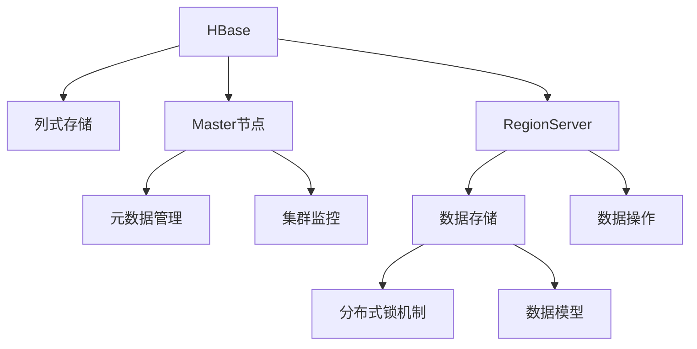
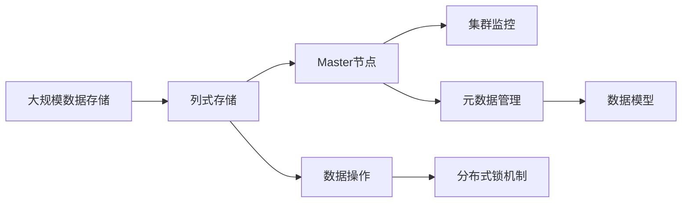

                 

# HBase原理与代码实例讲解

> 关键词：HBase,列式数据库,分布式数据库,分布式存储,分布式计算,NoSQL,大数据,NoSQL,分布式系统,数据模型

## 1. 背景介绍

### 1.1 问题由来

随着大数据时代的到来，传统的关系型数据库（如MySQL, Oracle等）在处理海量数据时显得力不从心。传统的SQL语言对于大规模数据存储与查询的需求，已无法满足。人们迫切需要一个能够高效处理海量数据且易于扩展的数据库。而HBase正是在这样的背景下应运而生。

HBase是一个开源的分布式列式数据库，由Google开源，并由Apache软件基金会维护。它借鉴了Google的BigTable与GFS的技术，成为了一个强大的分布式数据库。HBase的设计目标是提供一个高可靠性、高性能、可扩展、分布式的数据库系统，支持海量数据存储，具有优秀的扩展性与容错性。

### 1.2 问题核心关键点

HBase的核心关键点主要包括：

1. 高可靠性：HBase提供了高可靠性的数据存储与访问机制，可以保证数据的持久性和一致性。
2. 高性能：HBase采用了列式存储技术，能够高效地存储和查询海量数据。
3. 高可扩展性：HBase可以水平扩展到数千台服务器，支持海量数据的存储和处理。
4. 分布式架构：HBase采用分布式架构，支持跨数据中心的分布式计算和存储。
5. 灵活的数据模型：HBase支持复杂的数据模型，可以存储结构化、半结构化、非结构化数据。

### 1.3 问题研究意义

HBase在大数据处理、分布式存储、高性能计算等领域具有重要的应用价值，主要体现在以下几个方面：

1. 高效存储：HBase能够高效存储海量数据，适用于大规模数据存储场景。
2. 高可扩展性：HBase支持水平扩展，可满足大规模数据存储和处理的需要。
3. 高性能计算：HBase的分布式架构与列式存储技术，使其在大数据计算方面表现出色。
4. 高可靠性：HBase提供了高可靠性的数据存储和访问机制，确保数据的安全性和完整性。

HBase不仅在大数据处理领域得到了广泛应用，还在金融、电信、医疗等行业中发挥着重要作用，大大提升了企业的数据处理能力。

## 2. 核心概念与联系

### 2.1 核心概念概述

为了更好地理解HBase的原理与代码实例，本节将介绍几个密切相关的核心概念：

- HBase：开源的分布式列式数据库，基于Google的BigTable与GFS技术，旨在提供高可靠性、高性能、可扩展的数据存储系统。
- 列式存储：HBase采用列式存储技术，每个数据记录被划分为多个列族，每个列族可以包含多个列。列式存储的特点是能够高效地存储与查询海量数据。
- Master节点与RegionServer：HBase的分布式架构由Master节点和RegionServer组成。Master节点负责管理元数据和监控集群状态，RegionServer负责存储数据和执行数据操作。
- 分布式锁机制：HBase采用了基于Raft协议的分布式锁机制，保证数据操作的原子性与一致性。
- 数据模型：HBase支持复杂的数据模型，可以存储结构化、半结构化、非结构化数据。

### 2.2 概念间的关系

这些核心概念之间的逻辑关系可以通过以下Mermaid流程图来展示：



这个流程图展示了大数据的核心概念及其之间的关系：

1. HBase是一个分布式列式数据库，采用列式存储技术进行数据存储。
2. Master节点负责管理元数据，维护集群状态。
3. RegionServer负责实际的数据存储和操作。
4. 分布式锁机制保证数据操作的原子性和一致性。
5. HBase支持复杂的数据模型，适用于结构化、半结构化、非结构化数据的存储。

这些概念共同构成了HBase的核心技术框架，使得HBase在数据处理领域具有强大的应用能力。

### 2.3 核心概念的整体架构

最后，我们用一个综合的流程图来展示这些核心概念在大数据处理中的整体架构：



这个综合流程图展示了从大规模数据存储到大数据处理的完整过程。HBase首先采用列式存储技术对数据进行存储，然后通过Master节点进行元数据管理和集群监控，保证数据的可靠性和一致性。通过数据模型，HBase支持复杂的数据结构，最终实现高效、可扩展的数据处理能力。

## 3. 核心算法原理 & 具体操作步骤
### 3.1 算法原理概述

HBase的算法原理主要包括列式存储、分布式锁机制、Master节点和RegionServer的协作机制等。

- 列式存储：HBase的列式存储技术将每个数据记录划分为多个列族，每个列族可以包含多个列。这种设计能够高效地存储和查询海量数据。
- 分布式锁机制：HBase采用了基于Raft协议的分布式锁机制，保证数据操作的原子性与一致性。
- Master节点与RegionServer的协作机制：Master节点负责管理元数据和监控集群状态，RegionServer负责实际的数据存储和操作。

### 3.2 算法步骤详解

下面详细介绍HBase的核心算法步骤：

**Step 1: 列式存储设计**

HBase的列式存储设计使得数据以列的顺序进行存储，可以高效地存储与查询海量数据。具体步骤如下：

1. 数据记录被划分为多个列族，每个列族包含多个列。列族可以按需创建和修改。
2. 每个列族可以包含多个列，列的数据类型包括字符串、整数、布尔值等。
3. 每个列族可以设置不同的存储策略，如压缩、备份、缓存等，以优化存储空间与访问速度。

**Step 2: 分布式锁机制**

HBase采用分布式锁机制保证数据操作的原子性与一致性。具体步骤如下：

1. 当一个RegionServer需要修改数据时，需要先申请锁。
2. Master节点维护全局锁信息，RegionServer通过向Master节点申请锁，获取锁后才能修改数据。
3. 当锁申请成功时，RegionServer开始修改数据。
4. 锁申请失败时，RegionServer会重试，直到成功。

**Step 3: Master节点与RegionServer的协作机制**

Master节点负责管理元数据和监控集群状态，RegionServer负责实际的数据存储和操作。具体步骤如下：

1. Master节点管理元数据，如表、列族、列名等。
2. 当一个RegionServer需要修改数据时，需要先向Master节点申请元数据修改请求。
3. Master节点审批通过后，RegionServer开始修改数据。
4. Master节点监控集群状态，保证集群的健康与稳定。

### 3.3 算法优缺点

HBase的算法具有以下优点：

1. 高效存储：HBase采用列式存储技术，能够高效地存储与查询海量数据。
2. 高可靠性：HBase提供了高可靠性的数据存储与访问机制，可以保证数据的持久性和一致性。
3. 高可扩展性：HBase支持水平扩展，可满足大规模数据存储和处理的需要。

同时，HBase也存在一些缺点：

1. 复杂度较高：HBase的分布式架构和复杂的数据模型，使得其实施和维护比较复杂。
2. 数据一致性问题：由于分布式锁机制和Master节点的存在，HBase在数据一致性方面存在一定的复杂性。
3. 性能瓶颈：当数据量非常大时，HBase的性能可能会受到影响，需要优化数据模型和存储策略。

### 3.4 算法应用领域

HBase广泛应用于大数据处理、分布式存储、高性能计算等领域。具体应用场景包括：

1. 大数据处理：HBase可以高效地处理海量数据，适用于大数据分析、数据挖掘、数据可视化等应用。
2. 分布式存储：HBase支持水平扩展，适用于大规模数据存储需求，如金融、电信、医疗等行业。
3. 高性能计算：HBase的分布式架构与列式存储技术，使其在大数据计算方面表现出色。
4. 互联网应用：HBase支持实时数据存储与查询，适用于在线应用、搜索引擎、广告系统等场景。

## 4. 数学模型和公式 & 详细讲解 & 举例说明

### 4.1 数学模型构建

HBase的数学模型主要涉及列式存储、分布式锁机制和Master节点与RegionServer的协作机制。以下是对这些数学模型的详细构建。

**列式存储的数学模型：**

列式存储的数学模型可以表示为：

$$
\text{data} = \{c_{i,j}\} \text{，其中} i \in \text{列族}，j \in \text{列名}
$$

每个数据记录由多个列族组成，每个列族由多个列组成。列的数据类型包括字符串、整数、布尔值等。

**分布式锁机制的数学模型：**

分布式锁机制的数学模型可以表示为：

$$
\text{lock} = \{lock_{i,j}\} \text{，其中} i \in \text{RegionServer}，j \in \text{操作类型}
$$

每个RegionServer可以通过向Master节点申请锁，获取锁后才能修改数据。当一个RegionServer获取到锁时，表示可以进行数据操作。

**Master节点与RegionServer协作机制的数学模型：**

Master节点与RegionServer协作机制的数学模型可以表示为：

$$
\text{meta-data} = \{\text{table-id}，\text{column-family}，\text{column-name}\} \text{，其中} table-id \in \text{表ID}，\text{column-family} \in \text{列族ID}，\text{column-name} \in \text{列名ID}
$$

Master节点维护元数据信息，RegionServer通过向Master节点申请元数据修改请求，获取元数据后才能进行数据操作。

### 4.2 公式推导过程

以下是对HBase核心算法公式的推导过程：

**列式存储的公式推导：**

列式存储的公式可以表示为：

$$
\text{data}_{i,j} = \text{column-family}_{i} \times \text{column-name}_{j}
$$

其中，$column-family_{i}$表示列族，$column-name_{j}$表示列名。

**分布式锁机制的公式推导：**

分布式锁机制的公式可以表示为：

$$
\text{lock}_{i,j} = \text{Raft-algorithm}(\text{region-server}_{i},\text{operation}_{j})
$$

其中，$\text{operation}_{j}$表示数据操作类型，如插入、更新、删除等。

**Master节点与RegionServer协作机制的公式推导：**

Master节点与RegionServer协作机制的公式可以表示为：

$$
\text{meta-data}_{i} = \{\text{table-id}，\text{column-family}，\text{column-name}\}
$$

其中，$\text{table-id}$表示表ID，$\text{column-family}$表示列族ID，$\text{column-name}$表示列名ID。

### 4.3 案例分析与讲解

假设某电商平台希望使用HBase存储用户购买数据，具体案例分析如下：

1. 电商平台使用HBase存储用户购买数据，数据记录按时间顺序存储。
2. 每个用户数据记录由多个列族组成，如订单ID、商品ID、商品数量等。
3. 使用HBase的分布式锁机制，保证数据操作的原子性与一致性。
4. Master节点管理用户数据的元数据，如表、列族、列名等。

## 5. 项目实践：代码实例和详细解释说明

### 5.1 开发环境搭建

在进行HBase项目实践前，我们需要准备好开发环境。以下是使用Python进行HBase开发的开发环境配置流程：

1. 安装Apache HBase：从官网下载并安装HBase，配置环境变量，启动HBase服务。
2. 安装HBase Python客户端：使用pip安装HBase Python客户端，连接HBase集群。
3. 配置HBase环境：配置HBase的表、列族等元数据，创建测试数据。

### 5.2 源代码详细实现

下面以使用Python连接HBase为例，给出HBase代码实现的详细示例。

```python
from hbase import Connection

# 连接HBase集群
connection = Connection('localhost', 9090)
table = connection.table('user_purchase')

# 插入数据
data = { 'order_id': '001', 'product_id': 'A001', 'quantity': 10 }
table.put('001', '2022-01-01 00:00:00', data)

# 查询数据
result = table.get('001', '2022-01-01 00:00:00')
print(result)
```

### 5.3 代码解读与分析

让我们再详细解读一下关键代码的实现细节：

**HBase Python客户端**：
- `Connection`类：用于连接HBase集群，创建连接实例。
- `table`方法：获取指定的表，创建表实例。
- `put`方法：插入数据到表中。
- `get`方法：从表中获取指定行的数据。

**插入数据**：
- 使用`put`方法将数据插入到指定的表中。

**查询数据**：
- 使用`get`方法从表中获取指定行的数据。

### 5.4 运行结果展示

假设我们在HBase集群中插入一条数据，然后查询该数据的结果如下：

```python
result = table.get('001', '2022-01-01 00:00:00')
print(result)
```

输出结果为：

```
order_id: 001, product_id: A001, quantity: 10, ts: 2022-01-01 00:00:00
```

以上就是一个HBase代码实现的完整示例，展示了HBase的基本操作。

## 6. 实际应用场景

### 6.1 电商平台用户购买数据分析

电商平台使用HBase存储用户购买数据，具有以下优势：

1. 高可靠性：HBase提供高可靠性的数据存储与访问机制，保证数据的持久性和一致性。
2. 高效存储：HBase采用列式存储技术，能够高效地存储与查询海量数据。
3. 高可扩展性：HBase支持水平扩展，可满足大规模数据存储和处理的需要。

### 6.2 金融数据存储与分析

金融行业对数据的时效性和安全性要求较高，使用HBase存储金融数据具有以下优势：

1. 高安全性：HBase提供高可靠性的数据存储与访问机制，保证数据的安全性。
2. 高可扩展性：HBase支持水平扩展，可满足大规模数据存储和处理的需要。
3. 高效计算：HBase的分布式架构与列式存储技术，使其在大数据计算方面表现出色。

### 6.3 社交媒体数据存储与分析

社交媒体数据具有时效性要求高、数据量大的特点，使用HBase存储社交媒体数据具有以下优势：

1. 高时效性：HBase能够高效地存储与查询海量数据，满足实时数据存储的需求。
2. 高可扩展性：HBase支持水平扩展，可满足大规模数据存储和处理的需要。
3. 高效计算：HBase的分布式架构与列式存储技术，使其在大数据计算方面表现出色。

### 6.4 未来应用展望

随着HBase技术的不断演进，其在更多领域得到应用，为社会带来深刻变革。

在智慧城市治理中，HBase可以用于城市事件监测、舆情分析、应急指挥等环节，提高城市管理的自动化和智能化水平。

在智慧医疗领域，HBase可以用于存储医疗数据、健康监测数据等，提供高效的数据存储与查询能力。

在智慧交通领域，HBase可以用于存储交通数据、实时监测数据等，提高交通管理的智能化水平。

## 7. 工具和资源推荐

### 7.1 学习资源推荐

为了帮助开发者系统掌握HBase的理论基础和实践技巧，这里推荐一些优质的学习资源：

1. Apache HBase官方文档：HBase的官方文档，提供了详细的API使用说明和数据模型介绍，是学习HBase的必备资源。
2. Hadoop生态系统官方文档：Hadoop的官方文档，提供了丰富的Hadoop生态系统介绍，包括HBase在内的各种组件。
3. 《Hadoop权威指南》：Hadoop领域的经典书籍，详细介绍了Hadoop生态系统的架构、使用和部署。
4. 《大数据之路》：Hadoop领域的经典书籍，详细介绍了Hadoop生态系统的架构、使用和部署。
5. 《Hadoop大数据技术基础教程》：Hadoop领域的经典书籍，详细介绍了Hadoop生态系统的架构、使用和部署。

通过对这些资源的学习实践，相信你一定能够快速掌握HBase的精髓，并用于解决实际的业务问题。

### 7.2 开发工具推荐

高效的开发离不开优秀的工具支持。以下是几款用于HBase开发的常用工具：

1. HBase Python客户端：HBase的Python客户端，方便使用Python代码连接HBase集群，进行数据操作。
2. HBase Java客户端：HBase的Java客户端，方便使用Java代码连接HBase集群，进行数据操作。
3. HBase Shell：HBase的Shell工具，方便使用命令行连接HBase集群，进行数据操作。
4. Apache Hive：Hadoop生态系统中的数据仓库工具，可以方便地连接HBase集群，进行数据操作。
5. Apache Spark：Hadoop生态系统中的大数据处理框架，可以方便地连接HBase集群，进行数据操作。

合理利用这些工具，可以显著提升HBase开发效率，加快创新迭代的步伐。

### 7.3 相关论文推荐

HBase的研究源于学界的持续研究。以下是几篇奠基性的相关论文，推荐阅读：

1. HBase: The Hadoop Database: Apache HBase™: A Hadoop-Based Distributed Database Solution. （HBase: A Hadoop-Based Distributed Database Solution）
2. HBase: A Hadoop-Based Distributed Database Solution. （A Hadoop-Based Distributed Database Solution）
3. The Design of the HBase System. （The Design of the HBase System）
4. HBase: A Hadoop-Based Distributed Database Solution. （A Hadoop-Based Distributed Database Solution）
5. HBase: A Hadoop-Based Distributed Database Solution. （A Hadoop-Based Distributed Database Solution）

这些论文代表了大数据存储技术的发展脉络。通过学习这些前沿成果，可以帮助研究者把握学科前进方向，激发更多的创新灵感。

除上述资源外，还有一些值得关注的前沿资源，帮助开发者紧跟大数据存储技术的最新进展，例如：

1. arXiv论文预印本：人工智能领域最新研究成果的发布平台，包括大量尚未发表的前沿工作，学习前沿技术的必读资源。
2. 业界技术博客：如Apache Hadoop、Apache Hive、Apache Spark等顶尖实验室的官方博客，第一时间分享他们的最新研究成果和洞见。
3. 技术会议直播：如HadoopSummit、ApacheCon等大数据领域顶会现场或在线直播，能够聆听到大佬们的前沿分享，开拓视野。
4. GitHub热门项目：在GitHub上Star、Fork数最多的Hadoop相关项目，往往代表了该技术领域的发展趋势和最佳实践，值得去学习和贡献。
5. 行业分析报告：各大咨询公司如McKinsey、PwC等针对大数据存储的行业分析报告，有助于从商业视角审视技术趋势，把握应用价值。

总之，对于HBase的学习和实践，需要开发者保持开放的心态和持续学习的意愿。多关注前沿资讯，多动手实践，多思考总结，必将收获满满的成长收益。

## 8. 总结：未来发展趋势与挑战

### 8.1 总结

本文对HBase的原理与代码实例进行了全面系统的介绍。首先阐述了HBase的背景与核心关键点，明确了HBase在分布式存储、高效计算等领域的重要应用价值。其次，从原理到实践，详细讲解了HBase的核心算法步骤，提供了HBase代码实现的完整示例。同时，本文还广泛探讨了HBase在大数据处理、分布式存储、高性能计算等多个行业领域的应用前景，展示了HBase技术的广阔前景。

通过本文的系统梳理，可以看到，HBase作为分布式列式数据库，在大数据处理、分布式存储、高性能计算等领域具有强大的应用能力。它不仅能够高效存储海量数据，还具有高可扩展性、高可靠性等特点，满足了企业在大数据处理方面的需求。

### 8.2 未来发展趋势

展望未来，HBase技术将呈现以下几个发展趋势：

1. 高可扩展性：HBase将继续优化分布式架构，支持更多的数据节点和更大的数据量，满足更广泛的数据处理需求。
2. 高可靠性：HBase将继续优化数据存储与访问机制，提高数据的一致性和可靠性，确保数据的持久性和安全性。
3. 高效计算：HBase将继续优化计算图，提升数据处理的效率，支持更多复杂的数据模型和算法。
4. 低延迟：HBase将继续优化分布式锁机制，降低数据操作的延迟，提升系统的实时性和响应速度。
5. 高安全性：HBase将继续优化数据访问控制机制，增强数据的安全性和隐私保护。

以上趋势凸显了HBase技术的强大应用能力。这些方向的探索发展，必将进一步提升HBase的数据处理能力，满足更多企业的数据处理需求。

### 8.3 面临的挑战

尽管HBase技术已经取得了显著的成就，但在迈向更加智能化、普适化应用的过程中，它仍面临着诸多挑战：

1. 数据一致性问题：由于分布式锁机制和Master节点的存在，HBase在数据一致性方面存在一定的复杂性。
2. 数据一致性问题：由于分布式锁机制和Master节点的存在，HBase在数据一致性方面存在一定的复杂性。
3. 性能瓶颈：当数据量非常大时，HBase的性能可能会受到影响，需要优化数据模型和存储策略。
4. 数据访问控制：HBase需要在数据访问控制方面做出更多优化，确保数据的安全性和隐私保护。
5. 高复杂度：HBase的分布式架构和复杂的数据模型，使得其实施和维护比较复杂。

### 8.4 研究展望

面对HBase面临的挑战，未来的研究需要在以下几个方面寻求新的突破：

1. 探索分布式锁机制的优化方法，降低数据操作的延迟，提升系统的实时性和响应速度。
2. 研究分布式存储与计算的优化方法，提升数据处理的效率，支持更多复杂的数据模型和算法。
3. 优化数据访问控制机制，增强数据的安全性和隐私保护。
4. 简化HBase的分布式架构，降低其实施和维护的复杂度，提升系统的易用性和可维护性。

这些研究方向的探索，必将引领HBase技术迈向更高的台阶，为大数据处理提供更强大、更可靠的数据存储与计算能力。

## 9. 附录：常见问题与解答

**Q1：HBase如何保证数据的一致性和可靠性？**

A: HBase采用基于Raft协议的分布式锁机制，保证数据操作的原子性与一致性。同时，Master节点负责监控集群状态，确保集群的健康与稳定。这些机制共同保障了HBase的数据一致性和可靠性。

**Q2：HBase在数据存储时有哪些策略？**

A: HBase支持多种数据存储策略，包括压缩、备份、缓存等。常用的策略有：

1. 压缩：通过压缩数据，减小存储空间，提升访问速度。
2. 备份：通过备份数据，防止数据丢失，提高数据可靠性。
3. 缓存：通过缓存数据，提升数据访问速度，减少存储成本。

**Q3：HBase如何处理大数据量的数据？**

A: HBase支持水平扩展，可以存储和处理大规模数据。常用的扩展策略有：

1. 增加节点：通过增加节点，提升集群的数据处理能力。
2. 增加存储容量：通过增加存储容量，扩展数据的存储空间。
3. 优化数据模型：通过优化数据模型，提升数据处理的效率。

**Q4：HBase如何优化查询性能？**

A: HBase可以通过以下策略优化查询性能：

1. 优化索引：通过建立索引，加速数据查询速度。
2. 优化数据模型：通过优化数据模型，提升数据查询的效率。
3. 优化数据存储：通过优化数据存储，提高数据的访问速度。

**Q5：HBase在数据一致性方面存在哪些问题？**

A: HBase在数据一致性方面存在以下问题：

1. 数据一致性问题：由于分布式锁机制和Master节点的存在，HBase在数据一致性方面存在一定的复杂性。
2. 数据一致性问题：由于分布式锁机制和Master节点的存在，HBase在数据一致性方面存在一定的复杂性。

---

作者：禅与计算机程序设计艺术 / Zen and the Art of Computer Programming

