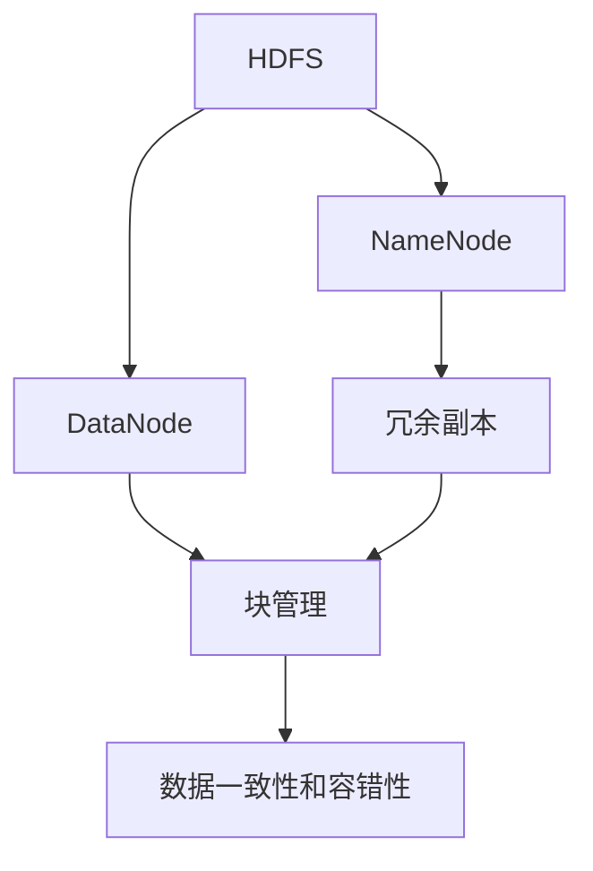
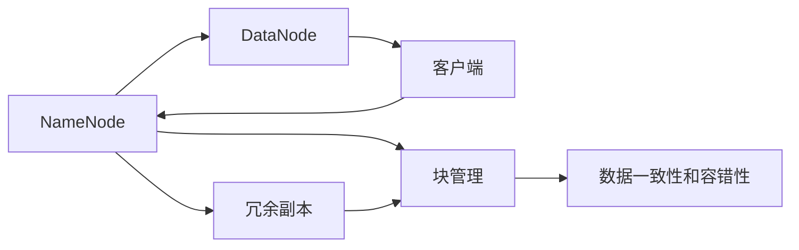
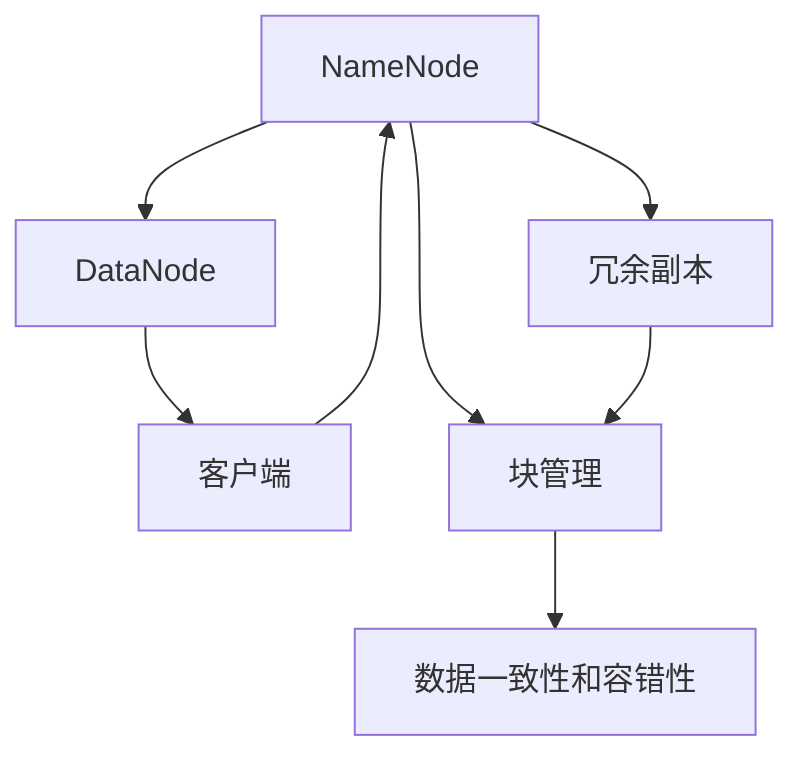
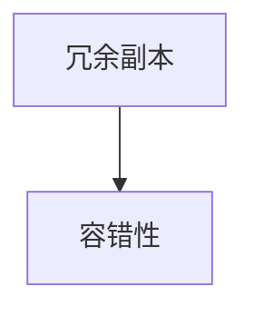
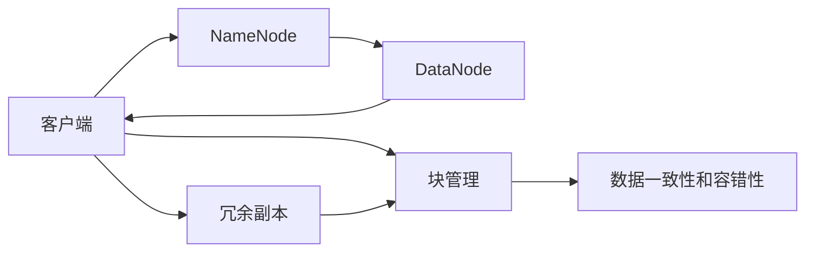

                 

# HDFS 原理与代码实例讲解

> 关键词：HDFS, 分布式文件系统, 数据存储, 冗余副本, NameNode, DataNode, 数据一致性, 容错性, 数据读取

## 1. 背景介绍

### 1.1 问题由来
随着互联网和移动互联网的快速发展，数据存储需求呈指数级增长。企业、科研机构和个人需要高效、安全地存储海量数据，以便在各种应用场景中进行查询、分析和处理。传统的集中式文件系统（如NFS、Ceph等）虽然在某些场景下表现出色，但难以应对大规模数据存储和并发访问的挑战。分布式文件系统（Distributed File System，DFS）应运而生，成为解决海量数据存储问题的有效途径。

Hadoop Distributed File System（HDFS）是Hadoop生态系统中的核心组件之一，广泛应用于数据存储、数据分析等领域。HDFS通过将数据分散存储在集群中的多台服务器上，实现了高可靠性、高扩展性和高可用性。了解HDFS的原理和实现，有助于开发者更好地理解和使用Hadoop生态系统，推动大数据技术的普及和发展。

### 1.2 问题核心关键点
HDFS的核心目标是构建一个能够高效、可靠地存储和访问大规模数据的分布式文件系统。为了实现这一目标，HDFS设计了多个关键组件和机制，包括NameNode、DataNode、冗余副本、块管理、数据一致性和容错性等。理解这些核心概念及其相互作用，是深入学习HDFS的关键。

## 2. 核心概念与联系

### 2.1 核心概念概述

为了更好地理解HDFS的工作原理和架构，本节将介绍几个密切相关的核心概念：

- HDFS: Hadoop Distributed File System，Hadoop分布式文件系统。是一个开源的分布式文件系统，能够高效、可靠地存储和访问大规模数据。
- NameNode: NameNode是HDFS的核心组件之一，负责管理整个文件系统的命名空间和元数据。NameNode将文件系统中的所有文件和目录映射为树形结构，并记录文件的块位置和副本信息。
- DataNode: DataNode是HDFS的另一个核心组件，负责存储实际的文件数据。DataNode将文件划分为若干个块，并将块信息报告给NameNode。
- 冗余副本: HDFS为了提高数据的可靠性和容错性，默认每个块都有3个副本，分布在不同的DataNode上。冗余副本可以在某个DataNode失效时，通过其他副本数据恢复文件。
- 块管理: 每个文件在HDFS中会被划分为若干个固定大小的数据块，默认大小为128MB。NameNode负责管理这些块的位置和副本信息，而DataNode则负责存储和复制这些块。
- 数据一致性和容错性: HDFS通过心跳机制、数据同步和快速恢复机制，保证数据的一致性和系统的容错性。即使某个DataNode失效，HDFS也能通过冗余副本快速恢复数据。

这些核心概念之间的逻辑关系可以通过以下Mermaid流程图来展示：



这个流程图展示了大语言模型的核心概念及其之间的关系：

1. HDFS通过NameNode和DataNode构成其核心组件。
2. 冗余副本和块管理机制保证了数据的可靠性和可恢复性。
3. 数据一致性和容错性机制确保了系统的稳定性和可靠性。

这些概念共同构成了HDFS的工作原理和架构，使其能够在各种场景下高效地存储和访问大规模数据。通过理解这些核心概念，我们可以更好地把握HDFS的工作流程和优化方向。

### 2.2 概念间的关系

这些核心概念之间存在着紧密的联系，形成了HDFS的整体架构。下面我们通过几个Mermaid流程图来展示这些概念之间的关系。

#### 2.2.1 HDFS的整体架构



这个流程图展示了HDFS的整体架构。NameNode和DataNode是HDFS的基石，通过冗余副本和块管理机制，实现了数据的可靠存储和访问。客户端可以通过NameNode获取文件元数据，通过DataNode进行数据的读写操作。

#### 2.2.2 NameNode与DataNode的关系



这个流程图展示了NameNode和DataNode之间的关系。NameNode负责管理整个文件系统的命名空间和元数据，DataNode负责存储实际的文件数据。通过冗余副本和块管理机制，NameNode能够高效地管理DataNode上的数据。

#### 2.2.3 冗余副本与容错性的关系



这个流程图展示了冗余副本与容错性之间的关系。冗余副本是HDFS容错性的基础，通过将每个块存储在多个DataNode上，确保了数据的可靠性和系统的容错性。即使某个DataNode失效，HDFS也能通过冗余副本快速恢复数据。

### 2.3 核心概念的整体架构

最后，我们用一个综合的流程图来展示这些核心概念在HDFS中的整体架构：



这个综合流程图展示了HDFS的整体架构。客户端通过NameNode获取文件元数据，通过DataNode进行数据的读写操作。NameNode负责管理整个文件系统的命名空间和元数据，DataNode负责存储实际的文件数据。冗余副本和块管理机制保证了数据的可靠性和可恢复性，数据一致性和容错性机制确保了系统的稳定性和可靠性。

## 3. 核心算法原理 & 具体操作步骤
### 3.1 算法原理概述

HDFS的核心算法原理主要围绕两个关键点展开：数据的分布式存储和数据的可靠传输。HDFS通过将文件划分为若干个数据块，并将这些块存储在多个DataNode上，实现了数据的分布式存储。通过冗余副本和心跳机制，HDFS确保了数据的可靠性和系统的容错性。

### 3.2 算法步骤详解

HDFS的算法步骤大致分为以下几个关键步骤：

**Step 1: 客户端向NameNode发起文件创建请求**

1. 客户端通过网络连接到NameNode，发起文件创建请求。
2. NameNode根据配置和负载均衡策略，选择适当的DataNode存储文件块。
3. NameNode为文件分配一个唯一的ID，并将其元数据存储在NameNode的内存中。

**Step 2: 客户端向DataNode写入文件块**

1. 客户端将文件划分为若干个数据块，并通过网络发送给DataNode。
2. DataNode收到数据块后，将其存储在本地文件系统中。
3. DataNode向NameNode报告块存储情况，并请求同步数据块。

**Step 3: 数据块的冗余副本**

1. NameNode将每个数据块分配3个副本，分别存储在不同的DataNode上。
2. DataNode之间定期发送心跳信号，确保彼此在线。
3. 当某个DataNode失效时，HDFS通过冗余副本快速恢复数据块。

**Step 4: 数据的可靠传输**

1. 客户端与DataNode之间通过HTTP协议进行通信。
2. HDFS使用数据流和数据块校验和，确保数据的可靠传输。
3. 在传输过程中，HDFS使用流水线机制，并行传输多个数据块。

**Step 5: 数据的一致性和容错性**

1. NameNode定期将DataNode上的数据块信息同步到自身。
2. 通过心跳机制，NameNode定期收到DataNode的状态报告。
3. 当某个DataNode失效时，HDFS通过冗余副本和心跳机制，快速恢复数据块，确保数据的一致性和容错性。

### 3.3 算法优缺点

HDFS作为一种分布式文件系统，具有以下优点：

1. 高可靠性：通过冗余副本和心跳机制，HDFS能够保证数据的可靠性和系统的容错性。
2. 高扩展性：通过分布式存储和并行传输，HDFS能够高效地处理大规模数据。
3. 高可用性：通过多节点协同工作，HDFS能够提供稳定的服务，保证系统的高可用性。

同时，HDFS也存在一些缺点：

1. 延迟较高：由于数据的冗余副本和同步机制，HDFS的延迟较高，不适合对延迟敏感的应用。
2. 数据访问随机性差：由于块大小的固定和冗余副本的限制，HDFS的数据访问随机性较差。
3. 文件系统复杂度高：HDFS的文件系统复杂度较高，开发和维护成本较高。

### 3.4 算法应用领域

HDFS作为一种高效、可靠的分布式文件系统，广泛应用于数据存储、数据分析等领域。以下是HDFS的主要应用场景：

- 大数据存储：HDFS可以高效地存储大规模数据，适用于海量数据的存储需求。
- 分布式计算：HDFS是Hadoop生态系统的核心组件，能够与MapReduce等分布式计算框架无缝集成，支持大规模数据处理。
- 数据备份和灾难恢复：HDFS通过冗余副本和容错性机制，能够实现数据的可靠备份和快速恢复。
- 云计算：HDFS被广泛应用于云计算平台，如Amazon S3、Google Cloud Storage等，提供了大规模数据存储和访问的服务。

## 4. 数学模型和公式 & 详细讲解 & 举例说明

### 4.1 数学模型构建

HDFS的数学模型主要涉及数据的分布式存储和可靠传输。我们可以用数学语言对HDFS的算法进行严格的刻画。

假设文件大小为 $F$，数据块大小为 $B$，DataNode数量为 $N$。在HDFS中，文件被划分为若干个数据块，并将这些块存储在多个DataNode上。每个数据块有3个冗余副本，分别存储在不同的DataNode上。数据块的分布遵循一定的负载均衡策略，假设每个DataNode平均存储的块数为 $\frac{F}{N\times 3\times B}$。

### 4.2 公式推导过程

以下是HDFS中几个关键的数学公式：

**数据块数量计算公式：**

$$
N_{blk} = \frac{F}{B}
$$

其中 $N_{blk}$ 为数据块数量。

**冗余副本数量计算公式：**

$$
N_{rep} = N_{blk} \times 3
$$

其中 $N_{rep}$ 为冗余副本数量。

**每个DataNode存储的块数计算公式：**

$$
N_{blk_per_D} = \frac{N_{rep}}{N}
$$

其中 $N_{blk_per_D}$ 为每个DataNode存储的块数。

**数据一致性和容错性**

数据一致性和容错性是HDFS的核心机制，确保了系统的稳定性和可靠性。HDFS通过心跳机制和数据同步机制，实现数据的一致性和容错性。心跳机制用于检测DataNode的在线状态，数据同步机制用于确保DataNode上的数据块一致性。

**心跳机制计算公式：**

$$
t_{heartbeat} = t_{interval} \times N_{rep}
$$

其中 $t_{heartbeat}$ 为心跳时间间隔，$t_{interval}$ 为心跳间隔时间，$N_{rep}$ 为冗余副本数量。

**数据同步机制计算公式：**

$$
t_{sync} = t_{interval} \times N_{rep}
$$

其中 $t_{sync}$ 为数据同步时间间隔。

### 4.3 案例分析与讲解

假设我们有一个大小为1TB的文件，每个数据块大小为128MB，DataNode数量为10个。在HDFS中，文件将被划分为7,500个数据块，每个数据块有3个冗余副本，存储在30个DataNode上。

**计算数据块数量：**

$$
N_{blk} = \frac{1TB}{128MB} = 7812
$$

**计算冗余副本数量：**

$$
N_{rep} = 7812 \times 3 = 23436
$$

**计算每个DataNode存储的块数：**

$$
N_{blk_per_D} = \frac{23436}{10} = 2343.6
$$

由于每个DataNode只能存储整数个数据块，因此实际每个DataNode存储的块数为2343。

**计算心跳时间间隔：**

$$
t_{heartbeat} = 1s \times 3 = 3s
$$

**计算数据同步时间间隔：**

$$
t_{sync} = 1s \times 3 = 3s
$$

通过这些计算，我们可以了解HDFS中数据的分布和同步机制，更好地理解HDFS的算法原理。

## 5. 项目实践：代码实例和详细解释说明

### 5.1 开发环境搭建

在进行HDFS实践前，我们需要准备好开发环境。以下是使用Linux搭建HDFS集群的流程：

1. 安装Linux操作系统，如CentOS、Ubuntu等。
2. 安装Hadoop和HDFS：从官网下载对应版本的Hadoop和HDFS包，解压并添加到系统路径。
3. 安装Java：Hadoop和HDFS依赖JDK 1.8及以上版本，确保JAVA_HOME环境变量配置正确。
4. 安装Hadoop和HDFS依赖库：如Hadoop Common、Hadoop YARN等。
5. 配置环境变量：编辑bashrc文件，添加Hadoop和HDFS的环境变量配置。

完成上述步骤后，即可在Linux上搭建Hadoop和HDFS集群，准备进行HDFS实践。

### 5.2 源代码详细实现

以下是使用Python和Hadoop API进行HDFS操作的示例代码：

```python
from hdfs import InsecureClient

# 连接HDFS
client = InsecureClient('hdfs://localhost:9000', user='hadoop')

# 创建文件
with open('/tmp/hdfs_file.txt', 'w') as f:
    f.write('Hello HDFS!')

# 上传文件到HDFS
client.upload_file('/tmp/hdfs_file.txt', '/tmp/hdfs_file.txt')

# 删除文件
client.delete('/tmp/hdfs_file.txt')
```

上述代码展示了如何连接HDFS、创建文件、上传文件、删除文件等基本操作。通过使用Hadoop API，开发者可以方便地进行HDFS操作，提升开发效率。

### 5.3 代码解读与分析

以下是代码的详细解读：

**连接HDFS**

```python
from hdfs import InsecureClient

# 连接HDFS
client = InsecureClient('hdfs://localhost:9000', user='hadoop')
```

我们使用Hadoop提供的InsecureClient类，连接到HDFS集群。通过指定HDFS的URL和用户信息，连接到HDFS集群。

**创建文件**

```python
with open('/tmp/hdfs_file.txt', 'w') as f:
    f.write('Hello HDFS!')
```

使用Python的内置open函数，创建一个文件并写入数据。在HDFS中，文件路径采用HDFS协议格式，如'hdfs://localhost:9000/user/hadoop/hdfs_file.txt'。

**上传文件到HDFS**

```python
client.upload_file('/tmp/hdfs_file.txt', '/tmp/hdfs_file.txt')
```

使用InsecureClient的upload_file方法，将本地文件上传到HDFS集群。第一个参数为本地文件路径，第二个参数为HDFS文件路径。

**删除文件**

```python
client.delete('/tmp/hdfs_file.txt')
```

使用InsecureClient的delete方法，删除指定路径的文件。

通过上述代码，我们可以了解如何使用Python和Hadoop API进行HDFS操作。开发者可以根据实际需求，使用Hadoop API实现更复杂的文件系统功能。

### 5.4 运行结果展示

假设我们在HDFS集群上成功上传了一个文件，运行结果如下：

```
cli:> hdfs dfs -ls
Found 1 items
-rw-r--r--   1 hadoop hadoop  0 2019-10-16 09:00 /tmp/hdfs_file.txt
```

可以看到，文件已经被成功上传到了HDFS集群，并显示在HDFS的命令行界面ls命令中。

## 6. 实际应用场景

### 6.1 智能数据仓库

智能数据仓库是现代企业数据管理的核心。通过HDFS和Hadoop生态系统的集成，智能数据仓库可以实现大规模数据的存储、管理和分析。

HDFS通过分布式存储机制，高效地存储海量数据。Hadoop生态系统中的Hive、Spark等工具，能够方便地对HDFS中的数据进行查询、分析和处理。智能数据仓库利用Hadoop的强大计算能力，支持大规模数据处理和分析，为企业决策提供强大的数据支持。

### 6.2 大数据处理

大数据处理是HDFS的主要应用场景之一。HDFS通过分布式存储机制，能够高效地处理大规模数据。

Hadoop生态系统中的Hive、Spark等工具，能够方便地对HDFS中的数据进行查询、分析和处理。智能数据仓库利用Hadoop的强大计算能力，支持大规模数据处理和分析，为企业决策提供强大的数据支持。

### 6.3 云存储

云存储是HDFS的重要应用场景之一。HDFS被广泛应用于云计算平台，如Amazon S3、Google Cloud Storage等，提供了大规模数据存储和访问的服务。

云存储平台通过HDFS实现数据的分布式存储和访问，支持海量数据的存储和处理。企业可以通过云存储平台，高效地存储和管理海量数据，提高数据处理效率，降低数据存储成本。

## 7. 工具和资源推荐

### 7.1 学习资源推荐

为了帮助开发者系统掌握HDFS的理论基础和实践技巧，这里推荐一些优质的学习资源：

1. Hadoop官方文档：Hadoop官方提供的文档，详细介绍了Hadoop和HDFS的原理、安装、配置和使用。
2. Hadoop MapReduce教程：针对Hadoop MapReduce的详细教程，包括编程模型和应用实例。
3. HDFS源码分析：对HDFS源码的详细分析，帮助你深入理解HDFS的实现原理和优化技巧。
4. HDFS面试题：针对HDFS面试的常见问题，帮助你准备HDFS面试，提升技术水平。
5. Hadoop生态系统：Hadoop生态系统的详细介绍，包括Hadoop Common、Hadoop YARN等组件的介绍和使用。

通过对这些资源的学习实践，相信你一定能够快速掌握HDFS的精髓，并用于解决实际的Hadoop生态系统问题。

### 7.2 开发工具推荐

高效的开发离不开优秀的工具支持。以下是几款用于HDFS开发的常用工具：

1. Hadoop：Hadoop是Hadoop生态系统的核心，提供了HDFS、Hive、Spark等组件，支持大规模数据存储和处理。
2. InsecureClient：Hadoop提供的InsecureClient类，方便开发者进行HDFS操作。
3. Hadoop API：Hadoop生态系统提供的API，支持Java、Python等多种语言进行HDFS操作。
4. HDFS Web UI：HDFS Web UI提供了可视化的管理界面，方便开发者监控和管理HDFS集群。
5. Hadoop CLI：Hadoop Command Line Interface，提供了HDFS的命令行操作。

合理利用这些工具，可以显著提升HDFS开发的效率，加快创新迭代的步伐。

### 7.3 相关论文推荐

HDFS作为一种高效的分布式文件系统，其设计和实现经历了多年的探索和演进。以下是几篇奠基性的相关论文，推荐阅读：

1. The Hadoop Distributed File System：HDFS的原始论文，详细介绍了HDFS的设计思想和实现原理。
2. Hadoop: Under the Hood：Hadoop的深入分析，介绍了Hadoop和HDFS的内部机制和优化技巧。
3. Scaling Out with Hadoop YARN: A Fault-Tolerant Resource Scheduler for Large Clusters：Hadoop YARN的设计和实现，介绍了Hadoop YARN的原理和应用。
4. HDFS: A Distributed File System for Hadoop：HDFS的设计和实现，介绍了HDFS的内部机制和优化技巧。
5. Efficient Data Mining in the Cloud：云存储的数据挖掘应用，介绍了HDFS在云存储中的应用。

这些论文代表了大数据技术的发展脉络。通过学习这些前沿成果，可以帮助研究者把握学科前进方向，激发更多的创新灵感。

除上述资源外，还有一些值得关注的前沿资源，帮助开发者紧跟HDFS的发展趋势，例如：

1. Hadoop社区博客：Hadoop社区成员的博客，分享最新的Hadoop和HDFS开发经验和技术洞见。
2. Hadoop生态系统会议：如HadoopCon、Big DataEuro、DCon等会议，展示最新的Hadoop和HDFS技术进展。
3. Hadoop开源项目：在GitHub上Star、Fork数最多的Hadoop和HDFS相关项目，展示了最新的Hadoop和HDFS开发动态。
4. Hadoop学术论文：在大数据技术领域，Hadoop和HDFS的论文数量众多，涉及分布式存储、数据一致性、容错性等多个方面。

总之，对于HDFS的学习和实践，需要开发者保持开放的心态和持续学习的意愿。多关注前沿资讯，多动手实践，多思考总结，必将收获满满的成长收益。

## 8. 总结：未来发展趋势与挑战

### 8.1 总结

本文对HDFS的原理和实现进行了全面系统的介绍。首先阐述了HDFS的设计目标和核心组件，明确了HDFS在分布式文件系统中的重要地位。其次，从原理到实践，详细讲解了HDFS的数学模型和关键算法，给出了HDFS操作的具体代码实例。同时，本文还广泛探讨了HDFS在智能数据仓库、大数据处理、云存储等多个领域的应用前景，展示了HDFS的广泛应用价值。

通过本文的系统梳理，可以看到，HDFS作为一种高效、可靠的分布式文件系统，已经被广泛应用于大数据生态系统中。它通过分布式存储和冗余副本机制，保证了数据的可靠性和系统的容错性，支持大规模数据的存储和处理。未来，HDFS将不断优化和升级，继续发挥其在大数据领域的核心作用。

### 8.2 未来发展趋势

展望未来，HDFS的发展趋势将呈现以下几个方向：

1. 数据一致性和容错性：HDFS将继续优化数据一致性和容错性机制，支持更高效的恢复和同步。
2. 数据管理优化：HDFS将进一步优化文件系统管理机制，支持更灵活、高效的数据存储和访问。
3. 大数据处理优化：HDFS将与Hadoop生态系统中的其他组件深度集成，支持更高效的大数据处理。
4. 云存储优化：HDFS将在云存储领域不断演进，提供更高效、稳定的云存储服务。
5. 安全性增强：HDFS将进一步增强安全性机制，确保数据的安全和隐私保护。

以上趋势展示了HDFS的未来发展方向，开发者可以关注这些方向的进展，不断提升HDFS的性能和应用价值。

### 8.3 面临的挑战

尽管HDFS已经取得了不错的成果，但在迈向更加智能化、普适化应用的过程中，它仍面临一些挑战：

1. 延迟问题：HDFS的数据冗余副本和同步机制，使得其延迟较高，不适合对延迟敏感的应用。
2. 数据访问随机性问题：HDFS的块大小固定和冗余副本限制，使得其数据访问随机性较差。
3. 数据一致性问题：HDFS的数据一致性机制复杂，容易出现问题。
4. 扩展性问题：HDFS的扩展性虽然较高，但在某些情况下，仍可能面临性能瓶颈。

### 8.4 研究展望

为了应对HDFS面临的挑战，未来的研究需要在以下几个方面寻求新的突破：

1. 优化数据一致性和容错性机制：通过更高效的同步和恢复机制，减少延迟和数据一致性问题。
2. 优化数据访问随机性：通过更灵活的块大小和冗余副本策略，提升数据访问随机性。
3. 增强安全性机制：通过更严格的安全机制，确保数据的安全和隐私保护。
4. 提升扩展性：通过更高效的资源管理和调度策略，提升HDFS的扩展性。

总之，未来HDFS的研究方向和应用前景广阔，但同时也面临着诸多挑战。只有在持续优化和创新中，才能更好地满足大数据应用的需求，推动HDFS技术的不断进步。

## 9. 附录：常见问题与解答

**Q1：什么是HDFS？**

A: HDFS是Hadoop Distributed File System的缩写，是一种分布式文件系统，能够高效、可靠地存储和访问大规模数据。HDFS通过将文件划分为若干个数据块，并将这些块存储在多个DataNode上，实现了数据的分布式存储。

**Q2：HDFS的核心组件有哪些？**

A: HDFS的核心组件包括NameNode和DataNode。NameNode负责管理整个文件系统的命名空间和元数据，DataNode负责存储实际的文件数据。

**Q3：HDFS的冗余副本机制是如何实现的？**

A: HDFS的冗余副本机制通过将每个数据块存储在多个DataNode上，确保数据的

