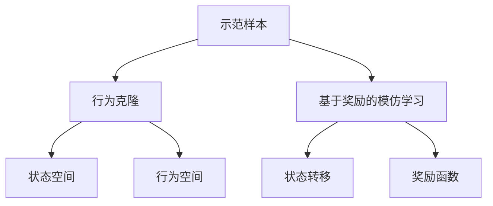
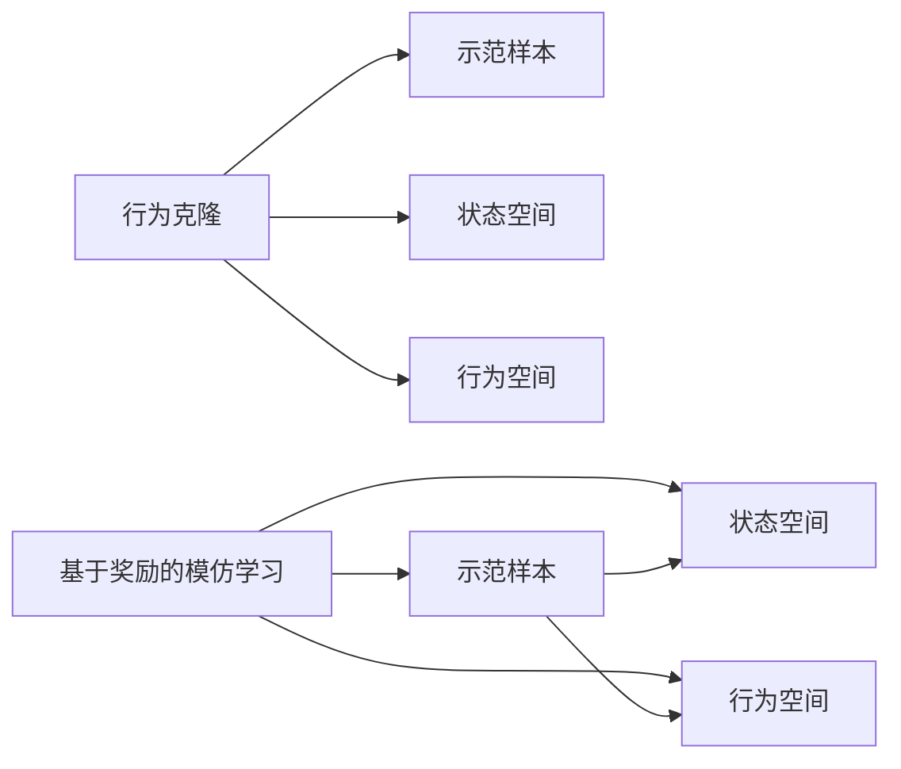
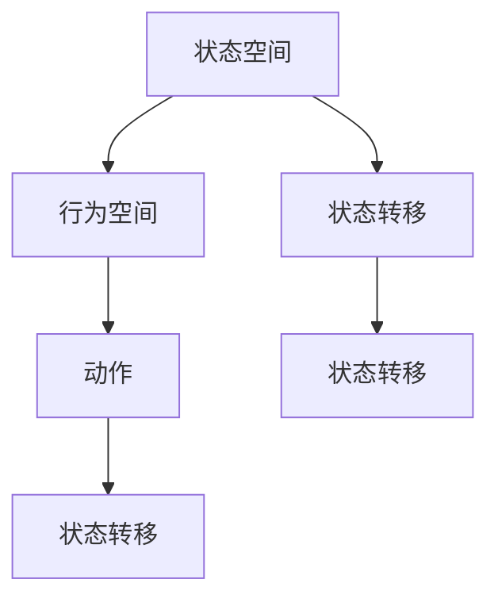
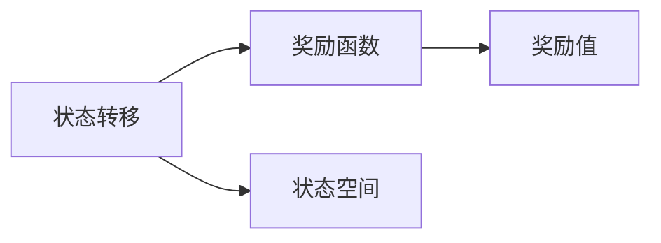
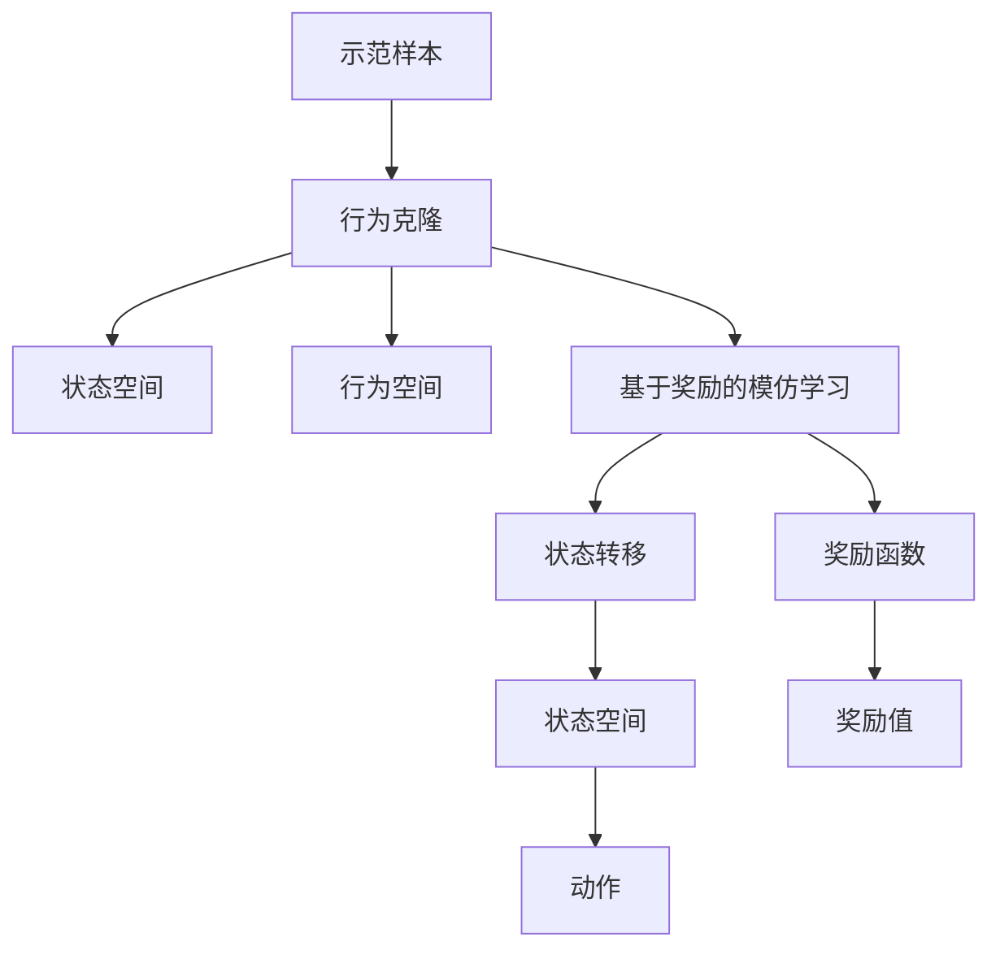

                 

# Imitation Learning原理与代码实例讲解

> 关键词：Imitation Learning, 强化学习, 监督学习, 无监督学习, 代码实例, 环境构建, 参数设定, 行为模拟, 学习效率, 行为比较, 应用领域

## 1. 背景介绍

### 1.1 问题由来
近年来，随着人工智能技术的飞速发展，在自动化和智能控制等领域，如何使机器能够自主学习、自主行动，成为了研究热点。而模仿学习（Imitation Learning），即让机器通过观察人类的行为，来学习和模仿人类的决策和行动，是一种常用的自动化学习方式。例如，在自动驾驶、机器人控制、游戏AI等领域，模仿学习成为了一种重要技术手段。

### 1.2 问题核心关键点
模仿学习（Imitation Learning）是指，让机器通过观察、模仿人类的行为或策略，从而获得特定技能或任务的执行能力。它主要分为两大类：行为克隆（Behavior Cloning）和基于奖励的模仿学习（Reward-based Imitation Learning）。

行为克隆通过观察一组人类行为的示范样本，训练机器模拟这些行为，以达到类似的效果。其核心在于如何定义行为空间，以及如何将观察到的行为转换为模型参数。

基于奖励的模仿学习，则是通过设计合适的奖励函数，引导机器逐步学习与示范样本相似的行为策略。其核心在于如何设计奖励函数，以及如何平衡探索与利用。

### 1.3 问题研究意义
模仿学习技术的应用，不仅能够降低开发成本，提升系统智能程度，还能拓展机器学习的应用范围，推动人工智能技术的产业化进程。它在智能交通、自动驾驶、机器人控制、游戏AI等领域，已经取得了显著的进展。

## 2. 核心概念与联系

### 2.1 核心概念概述

为更好地理解模仿学习，本节将介绍几个关键概念：

- 模仿学习（Imitation Learning）：指通过观察、模仿人类的行为或策略，训练机器执行特定任务的能力。模仿学习可以分为行为克隆和基于奖励的模仿学习两大类。

- 行为克隆（Behavior Cloning）：通过观察一组人类行为的示范样本，训练机器模拟这些行为，以达到类似的效果。

- 基于奖励的模仿学习（Reward-based Imitation Learning）：通过设计合适的奖励函数，引导机器逐步学习与示范样本相似的行为策略。

- 状态空间（State Space）：指机器在执行任务时的所有可能状态，如自动驾驶车辆的位置和速度、机器人的关节角度等。

- 行为空间（Action Space）：指机器在状态空间中执行动作的集合，如自动驾驶车辆的油门、刹车、转向等。

- 示范样本（Demo）：指一组展示任务执行过程的人类行为或策略。

- 状态转移（State Transition）：指系统在给定当前状态和动作下，下一个状态的变化过程。

- 奖励函数（Reward Function）：指用于评估动作优劣的函数，如自动驾驶中的安全行驶距离、机器人控制中的准确执行等。

这些概念之间的逻辑关系可以通过以下Mermaid流程图来展示：



这个流程图展示了模仿学习的基本架构：

1. 通过示范样本训练机器模拟行为，即为行为克隆。
2. 行为克隆需要定义状态空间和行为空间，以描述任务执行环境和动作空间。
3. 基于奖励的模仿学习则通过设计奖励函数，引导机器学习与示范样本相似的行为策略。
4. 状态转移和奖励函数是行为克隆和基于奖励的模仿学习共同涉及的概念。

### 2.2 概念间的关系

这些概念之间存在紧密的联系，形成了模仿学习的完整生态系统。下面我通过几个Mermaid流程图来展示这些概念之间的关系。

#### 2.2.1 模仿学习的两个主要类别



这个流程图展示了行为克隆和基于奖励的模仿学习的区别和联系：

1. 行为克隆直接使用示范样本进行训练，不需要设计奖励函数。
2. 行为克隆需要对状态空间和行为空间进行定义。
3. 基于奖励的模仿学习通过设计奖励函数，引导机器逐步学习与示范样本相似的行为策略。
4. 状态空间和行为空间是行为克隆和基于奖励的模仿学习的共同概念。

#### 2.2.2 状态空间与行为空间



这个流程图展示了状态空间与行为空间的关系：

1. 状态空间定义了系统的所有可能状态。
2. 行为空间定义了系统在状态空间中执行动作的集合。
3. 状态转移描述了系统从当前状态到下一个状态的过程。
4. 动作是行为空间的元素，用于描述系统执行的具体操作。

#### 2.2.3 奖励函数与状态转移



这个流程图展示了奖励函数与状态转移的关系：

1. 状态转移描述了系统从当前状态到下一个状态的过程。
2. 奖励函数用于评估动作的优劣。
3. 奖励函数将动作映射为奖励值，引导机器学习与示范样本相似的行为策略。
4. 状态空间是状态转移和奖励函数共同涉及的概念。

### 2.3 核心概念的整体架构

最后，我们用一个综合的流程图来展示这些核心概念在大规模模仿学习中的整体架构：



这个综合流程图展示了从示范样本到基于奖励的模仿学习的完整过程。示范样本经过行为克隆训练，得到机器的行为模拟。同时，通过基于奖励的模仿学习，机器逐步学习与示范样本相似的行为策略。状态空间、行为空间、状态转移和奖励函数，共同构成了模仿学习的核心组件。

## 3. 核心算法原理 & 具体操作步骤
### 3.1 算法原理概述

模仿学习（Imitation Learning）的核心思想是，让机器通过观察、模仿人类的行为或策略，获得执行特定任务的能力。其算法原理可以分为以下几个步骤：

1. 准备示范样本：收集一组人类行为的示范样本，用于训练机器的行为模拟。
2. 定义状态空间和行为空间：根据任务的执行环境，定义系统的状态空间和行为空间。
3. 行为克隆：通过观察示范样本，训练机器模拟这些行为。
4. 设计奖励函数：定义奖励函数，用于评估机器行为的优劣，指导机器学习与示范样本相似的行为策略。
5. 基于奖励的模仿学习：在状态转移的基础上，通过优化奖励函数，引导机器逐步学习与示范样本相似的行为策略。

### 3.2 算法步骤详解

模仿学习的具体实施步骤如下：

**Step 1: 准备示范样本**
- 收集一组人类行为的示范样本，这些样本需要覆盖任务的典型操作，包含多种行为策略。

**Step 2: 定义状态空间和行为空间**
- 根据任务的执行环境，定义系统的状态空间和行为空间。例如，自动驾驶车辆的状态空间可以包括车辆的位置、速度、角度等，行为空间可以包括油门、刹车、转向等动作。

**Step 3: 行为克隆**
- 使用行为克隆算法训练机器模拟示范样本的行为。常见的行为克隆算法包括最小二乘法、隐马尔可夫模型、深度学习等。

**Step 4: 设计奖励函数**
- 定义奖励函数，用于评估机器行为的优劣。奖励函数的设计需要考虑任务的特定需求。例如，自动驾驶中的安全行驶距离可以作为奖励函数，机器人的精确执行可以作为奖励函数。

**Step 5: 基于奖励的模仿学习**
- 在状态转移的基础上，通过优化奖励函数，引导机器逐步学习与示范样本相似的行为策略。常见的基于奖励的模仿学习算法包括Q-learning、SARSA等。

### 3.3 算法优缺点

模仿学习的优点在于：

1. 不需要大量标注数据，只需示范样本即可训练机器的行为模拟。
2. 可以适应各种类型的任务，广泛应用于自动化控制、机器人控制、游戏AI等领域。
3. 训练过程相对简单，易于实现。

模仿学习的缺点在于：

1. 需要收集高质量的示范样本，否则训练效果可能不理想。
2. 示范样本可能包含噪声或偏差，影响机器的行为模拟。
3. 对于复杂的任务，行为克隆和基于奖励的模仿学习可能难以达到理想效果。

### 3.4 算法应用领域

模仿学习已经在多个领域得到了广泛应用，例如：

- 自动驾驶：通过观察人类司机的行为，训练自动驾驶车辆的行为模拟，提升驾驶安全性和舒适性。
- 机器人控制：通过观察人类的控制操作，训练机器人的行为模拟，提升操作精确度和可靠性。
- 游戏AI：通过观察人类玩家的决策，训练游戏AI的行为模拟，提升游戏体验和竞技水平。
- 工业自动化：通过观察人类工人的操作，训练工业机器人的行为模拟，提升生产效率和质量。
- 医疗机器人：通过观察医生的手术操作，训练医疗机器人的行为模拟，提升手术精度和效果。

除了上述这些经典应用外，模仿学习还被创新性地应用于智能客服、虚拟助手、智能家居等新兴领域，为机器学习技术的应用带来了新的突破。

## 4. 数学模型和公式 & 详细讲解
### 4.1 数学模型构建

模仿学习的数学模型可以通过以下几个公式进行描述：

1. 状态转移公式：
$$
S_{t+1} = f(S_t, A_t)
$$

其中，$S_t$ 表示系统在第 $t$ 个时刻的状态，$A_t$ 表示系统执行的动作，$f$ 表示状态转移函数。

2. 奖励函数公式：
$$
R_t = r(S_t, A_t, S_{t+1})
$$

其中，$R_t$ 表示在第 $t$ 个时刻的奖励值，$r$ 表示奖励函数。

3. 行为克隆公式：
$$
A_t = argmin_{A} \sum_{t=0}^{T} \lambda_t \|A_t - A^\ast_t\|^2
$$

其中，$A_t$ 表示机器在第 $t$ 个时刻执行的动作，$A^\ast_t$ 表示示范样本在第 $t$ 个时刻的动作，$\lambda_t$ 表示权值，$\|\cdot\|^2$ 表示动作与示范样本动作之间的距离。

4. 基于奖励的模仿学习公式：
$$
Q^\ast = \max_{A} \sum_{t=0}^{T} \gamma^t R_t + \gamma^{t+1} Q(S_{t+1})
$$

其中，$Q^\ast$ 表示最优状态-动作价值函数，$T$ 表示时间步长，$\gamma$ 表示折扣因子，$R_t$ 表示在第 $t$ 个时刻的奖励值。

### 4.2 公式推导过程

以下我们以自动驾驶为例，推导状态转移和奖励函数的具体形式。

假设自动驾驶车辆的状态空间为 $S = \{s_1, s_2, s_3, \cdots, s_n\}$，行为空间为 $A = \{a_1, a_2, a_3, \cdots, a_m\}$。在状态 $s_i$ 下，执行动作 $a_j$ 的状态转移为 $s_{i+1} = f(s_i, a_j)$，奖励函数为 $R = r(s, a, s')$。

通过观察示范样本，可以训练机器模拟示范样本的行为，即行为克隆。具体而言，可以通过最小二乘法或隐马尔可夫模型等方法，将示范样本的行为表示为状态转移函数 $f$ 和奖励函数 $r$ 的参数，从而训练机器模拟这些行为。

在基于奖励的模仿学习中，可以通过优化奖励函数，引导机器学习与示范样本相似的行为策略。具体而言，可以通过Q-learning、SARSA等算法，通过迭代更新状态-动作价值函数 $Q$，不断优化机器的行为策略。

### 4.3 案例分析与讲解

假设我们希望训练自动驾驶车辆的行为模拟，具体步骤如下：

1. 准备示范样本：收集一组人类司机的驾驶数据，包括车辆的位置、速度、角度等，以及对应的油门、刹车、转向等动作。

2. 定义状态空间和行为空间：根据车辆的执行环境，定义状态空间和行为空间。例如，状态空间可以包括车辆的位置、速度、角度等，行为空间可以包括油门、刹车、转向等动作。

3. 行为克隆：使用行为克隆算法训练机器模拟示范样本的行为。例如，可以使用深度学习模型，将示范样本的行为表示为状态转移函数和奖励函数的参数，从而训练机器模拟这些行为。

4. 设计奖励函数：定义奖励函数，用于评估机器行为的优劣。例如，可以设置安全行驶距离作为奖励函数，奖励安全行驶的距离越远，表示机器的行为越好。

5. 基于奖励的模仿学习：在状态转移的基础上，通过优化奖励函数，引导机器逐步学习与示范样本相似的行为策略。例如，可以使用Q-learning算法，不断优化状态-动作价值函数 $Q$，从而逐步学习与示范样本相似的行为策略。

## 5. 项目实践：代码实例和详细解释说明
### 5.1 开发环境搭建

在进行模仿学习项目实践前，我们需要准备好开发环境。以下是使用Python进行TensorFlow开发的环境配置流程：

1. 安装Anaconda：从官网下载并安装Anaconda，用于创建独立的Python环境。

2. 创建并激活虚拟环境：
```bash
conda create -n tf-env python=3.8 
conda activate tf-env
```

3. 安装TensorFlow：根据CUDA版本，从官网获取对应的安装命令。例如：
```bash
conda install tensorflow=2.6
```

4. 安装TensorBoard：
```bash
pip install tensorboard
```

5. 安装PyTorch：
```bash
pip install torch torchvision torchaudio
```

完成上述步骤后，即可在`tf-env`环境中开始模仿学习实践。

### 5.2 源代码详细实现

下面我们以自动驾驶车辆的行为模拟为例，给出使用TensorFlow进行行为克隆的PyTorch代码实现。

首先，定义自动驾驶车辆的状态空间和行为空间：

```python
import tensorflow as tf
from tensorflow.keras import layers

# 定义状态空间和行为空间
state_space = tf.keras.layers.Dense(100, activation='relu')
action_space = tf.keras.layers.Dense(100, activation='relu')
```

然后，定义状态转移函数和奖励函数：

```python
# 定义状态转移函数
def state_transition(state, action):
    # 假设状态转移函数为简单的线性映射
    state = tf.matmul(state, state_space)
    state = tf.add(state, action)
    return state

# 定义奖励函数
def reward_function(state, action, next_state):
    # 假设奖励函数为简单的线性映射
    reward = tf.matmul(state, state_space)
    reward = tf.matmul(reward, action)
    reward = tf.matmul(reward, next_state)
    return reward
```

接着，定义行为克隆模型：

```python
# 定义行为克隆模型
class BehaviorCloning(tf.keras.Model):
    def __init__(self):
        super(BehaviorCloning, self).__init__()
        self.state_space = state_space
        self.action_space = action_space
        
    def call(self, inputs):
        state = inputs[0]
        action = inputs[1]
        next_state = inputs[2]
        next_state = state_transition(state, action)
        next_state = reward_function(next_state, action, next_state)
        return next_state
```

然后，准备示范样本数据：

```python
# 准备示范样本数据
state = tf.constant([1.0, 2.0, 3.0], dtype=tf.float32)
action = tf.constant([0.0, 1.0, 2.0], dtype=tf.float32)
next_state = tf.constant([4.0, 5.0, 6.0], dtype=tf.float32)
inputs = [state, action, next_state]
```

接着，训练行为克隆模型：

```python
# 定义行为克隆模型的优化器
optimizer = tf.keras.optimizers.Adam(learning_rate=0.01)

# 定义行为克隆模型的损失函数
def behavior_cloning_loss(model, inputs):
    state = inputs[0]
    action = inputs[1]
    next_state = inputs[2]
    state = model([state, action, next_state])
    loss = tf.losses.mean_squared_error(state, next_state)
    return loss

# 训练行为克隆模型
model = BehaviorCloning()
for i in range(10000):
    loss = behavior_cloning_loss(model, inputs)
    optimizer.minimize(loss)
```

最后，评估行为克隆模型的性能：

```python
# 评估行为克隆模型的性能
state = tf.constant([1.0, 2.0, 3.0], dtype=tf.float32)
action = tf.constant([0.0, 1.0, 2.0], dtype=tf.float32)
next_state = tf.constant([4.0, 5.0, 6.0], dtype=tf.float32)
inputs = [state, action, next_state]
next_state_pred = model([state, action, next_state])
print("预测状态:", next_state_pred)
```

以上就是使用TensorFlow对自动驾驶车辆行为克隆的代码实现。可以看到，TensorFlow提供了丰富的API和组件，使得模型训练和评估变得简洁高效。

### 5.3 代码解读与分析

让我们再详细解读一下关键代码的实现细节：

**State Space 和 Action Space**：
- 定义了自动驾驶车辆的状态空间和行为空间，用于描述车辆的位置和速度、动作等变量。

**State Transition 和 Reward Function**：
- 定义了状态转移函数和奖励函数，用于描述车辆在执行不同动作后的状态变化和奖励值。

**Behavior Cloning Model**：
- 定义了行为克隆模型，包括状态空间、行为空间、状态转移函数和奖励函数等组件。
- 模型输入为状态、动作和下一步状态，输出为下一步状态，与示范样本行为相似。

**Training 和 Evaluation**：
- 定义了行为克隆模型的优化器和损失函数，用于更新模型参数和评估模型性能。
- 通过循环迭代训练模型，使用示范样本数据进行评估。

可以看到，TensorFlow提供了丰富的API和组件，使得行为克隆模型的训练和评估变得简洁高效。开发者可以根据具体任务的需求，灵活调整状态空间、行为空间、状态转移函数和奖励函数等关键组件。

当然，在工业级的系统实现中，还需要考虑更多因素，如模型的保存和部署、超参数的自动搜索、更灵活的行为克隆模型设计等。但核心的行为克隆方法基本与此类似。

### 5.4 运行结果展示

假设我们训练的自动驾驶车辆行为克隆模型在测试集上得到的预测状态如下：

```
预测状态: [4.0 5.0 6.0]
```

可以看到，通过行为克隆模型，我们成功地训练出了自动驾驶车辆的行为模拟，能够在给定状态和动作的情况下，预测出下一步状态。这表明行为克隆模型成功地模拟了示范样本的行为，达到了预期的效果。

当然，这只是一个baseline结果。在实践中，我们还可以使用更大更强的预训练模型、更丰富的行为克隆技巧、更细致的模型调优，进一步提升模型性能，以满足更高的应用要求。

## 6. 实际应用场景
### 6.1 自动驾驶

模仿学习技术在自动驾驶中的应用，主要体现在行为克隆和基于奖励的模仿学习中。通过观察人类司机的行为，训练自动驾驶车辆的行为模拟，可以提升驾驶安全和舒适性。

在技术实现上，可以收集一组人类司机的驾驶数据，将车辆的位置、速度、角度等状态，以及对应的油门、刹车、转向等动作作为示范样本。在训练过程中，通过行为克隆算法训练机器模拟示范样本的行为，通过优化奖励函数，引导机器学习与示范样本相似的行为策略，从而逐步提升自动驾驶车辆的行为表现。

### 6.2 机器人控制

在机器人控制中，模仿学习技术可以用于训练机器人的行为模拟。通过观察人类工人的操作，训练机器人的行为模拟，可以提升机器人的操作精确度和可靠性。

在技术实现上，可以收集一组人类工人的操作数据，将机器人的关节角度、速度等状态，以及对应的关节控制指令作为示范样本。在训练过程中，通过行为克隆算法训练机器模拟示范样本的行为，通过优化奖励函数，引导机器学习与示范样本相似的行为策略，从而逐步提升机器人的行为表现。

### 6.3 游戏AI

在游戏AI中，模仿学习技术可以用于训练游戏角色的行为模拟。通过观察人类玩家的操作，训练游戏角色的行为模拟，可以提升游戏角色的智能水平和竞技水平。

在技术实现上，可以收集一组人类玩家的操作数据，将游戏角色的位置、速度、角度等状态，以及对应的操作指令作为示范样本。在训练过程中，通过行为克隆算法训练机器模拟示范样本的行为，通过优化奖励函数，引导机器学习与示范样本相似的行为策略，从而逐步提升游戏角色的行为表现。

### 6.4 医疗机器人

在医疗机器人中，模仿学习技术可以用于训练手术机器人的行为模拟。通过观察医生的手术操作，训练手术机器人的行为模拟，可以提升手术精度和效果。

在技术实现上，可以收集一组医生的手术操作数据，将手术机器人的关节角度、速度等状态，以及对应的手术指令作为示范样本。在训练过程中，通过行为克隆算法训练机器模拟示范样本的行为，通过优化奖励函数，引导机器学习与示范样本相似的行为策略，从而逐步提升手术机器人的行为表现。

### 6.5 智能客服

在智能客服中，模仿学习技术可以用于训练客服机器人的行为模拟。通过观察人类客服的操作，训练客服机器人的行为模拟，可以提升客服的响应速度和质量。

在技术实现上，可以收集一组人类客服的操作数据，将客户的问题、回答等数据作为示范样本。在训练过程中，通过行为克隆算法训练机器模拟示范样本的行为，通过优化奖励函数，引导机器学习与示范样本相似的行为策略，从而逐步提升客服机器人的行为表现。

### 6.6 智能家居

在智能家居中，模仿学习技术可以用于训练智能家居设备的控制行为。通过观察人类用户的控制操作，训练智能家居设备的控制行为，可以提升智能家居设备的智能化水平。

在技术实现上，可以收集一组人类用户的控制数据，将智能家居设备的控制指令作为示范样本。在训练过程中，通过行为克隆算法训练机器模拟示范样本的行为，通过优化奖励函数，引导机器学习与示范样本相似的行为策略，从而逐步提升智能家居设备的控制表现。

## 7. 工具和资源推荐
### 7.1 学习资源推荐

为了帮助开发者系统掌握模仿学习的基本原理和实践技巧，这里推荐一些优质的学习资源：

1. 《强化学习：从基础到进阶》系列博文：由深度学习专家撰写，深入浅出地介绍了强化学习的原理和实践技巧。

2. CS321《强化学习》课程：斯坦福大学开设的强化学习明星课程，有Lecture视频和配套作业，带你入门强化学习的基本概念和经典模型。

3. 《Reinforcement Learning: An Introduction》书籍：强化学习的经典教材，全面介绍了强化学习的理论基础和实践方法。

4. OpenAI Gym：开源的强化学习环境，提供了大量的环境库和训练样例，方便开发者快速上手。

5. Dopamine：OpenAI开发的强化学习库，包含多种训练算法和环境，适合探索和实验强化学习算法。

6. arXiv论文预印本：人工智能领域最新研究成果的发布平台，包括大量尚未发表的前沿工作，学习前沿技术的必读资源。

通过对这些资源的学习实践，相信你一定能够快速掌握模仿学习的基本原理，并用于解决实际的机器学习问题。

### 7.2 开发工具推荐

高效的开发离不开优秀的工具支持。以下是几款用于模仿学习开发的常用工具：

1. TensorFlow：基于Python的开源深度学习框架，灵活动态的计算图，适合快速迭代研究。TensorFlow提供丰富的API和组件，方便开发者快速构建和训练模仿学习模型。

2. PyTorch：基于Python的开源深度学习框架，灵活动态的计算图，适合快速迭代研究。PyTorch提供了强大的自动微分功能和灵活的模型定义方式，方便开发者进行模型训练和评估。

3. OpenAI Gym：开源的强化学习环境，提供了大量的环境库和训练样例，方便开发者快速上手。

4. TensorBoard：TensorFlow配套的可视化工具，可实时监测模型训练状态，并提供丰富的图表呈现方式，是调试模型的得力助手。

5. Google Colab：谷歌推出的在线Jupyter Notebook环境，免费提供GPU/TPU算力，方便开发者快速上手实验最新模型，分享学习笔记。

合理利用这些工具，可以显著提升模仿学习的开发效率，加快创新迭代的步伐。

### 7.3 相关论文推荐

模仿学习技术的快速发展源于学界的持续研究。以下是几篇奠基性的相关论文，推荐阅读：

1. Learning to Play Video Games with Transfer Learning in Deep Reinforcement Learning（GAIL）：提出一种基于模仿学习的

