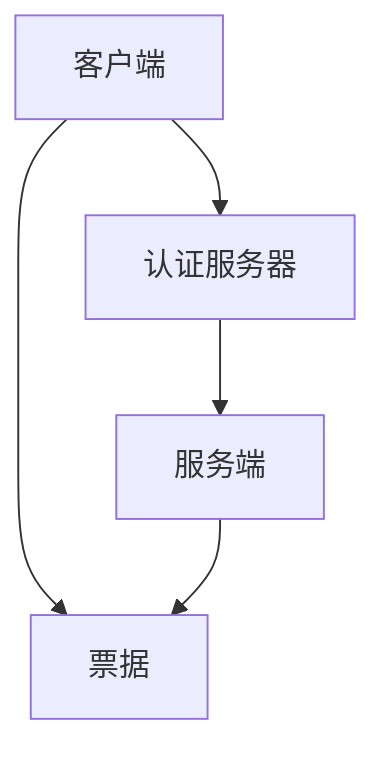
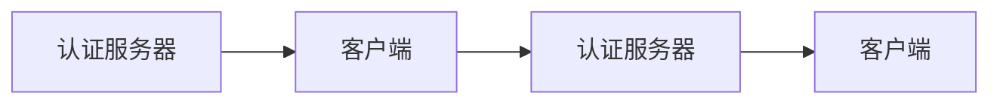
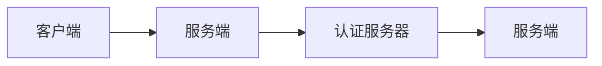
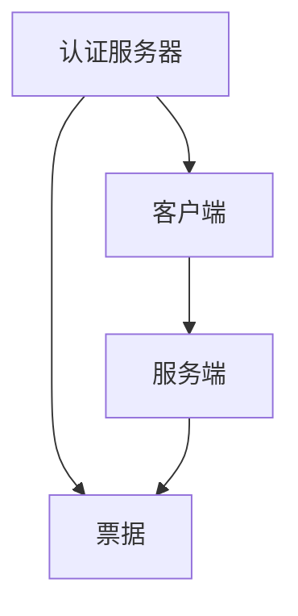

                 

# Kerberos原理与代码实例讲解

> 关键词：Kerberos,身份验证,认证机制,加密技术,认证票据,单点登录

## 1. 背景介绍

在现代社会，信息安全成为一种极为重要的需求，无论是企业、组织还是个人，都需要采用一系列措施来确保信息系统的安全。身份验证是信息安全的基础环节，其目的是确认用户或设备的身份，以防止未经授权的访问。传统上，许多系统中采用了用户名和密码的方式来验证用户身份，但这种验证方式存在许多问题，比如容易被猜解、容易泄露等。因此，人们开始寻找更加安全、可扩展的身份验证机制，其中Kerberos成为了一种非常受欢迎的选择。

### 1.1 问题由来

Kerberos是一种基于密码学的分布式身份验证协议，最初由麻省理工学院(MIT)于1983年开发，主要目的是在网络环境中提供安全的身份验证机制。随着互联网技术的发展，Kerberos逐渐被广泛应用于企业内部网络、互联网应用、云计算环境等场景中，成为了一种广泛接受的身份验证标准。

### 1.2 问题核心关键点

Kerberos的核心思想是利用加密技术来保护用户的身份信息和会话密钥，确保数据的机密性、完整性和不可否认性。它的主要组成部分包括认证服务器、客户端、服务端等，通过它们之间的安全通信，实现对用户身份的验证和服务的访问控制。

## 2. 核心概念与联系

### 2.1 核心概念概述

为了更好地理解Kerberos的工作原理和架构，本节将介绍几个密切相关的核心概念：

- **认证服务器（AS）**：Kerberos的核心组件之一，负责生成和管理票据（Ticket），以及处理身份验证请求。
- **客户端（Client）**：需要访问某个服务的用户或应用程序，通过向认证服务器请求票据来获取访问权限。
- **服务端（Server）**：提供被请求服务的应用程序或服务，需要验证票据的有效性才能提供服务。
- **票据（Ticket）**：认证服务器发给客户端的加密信息，包含用户身份和访问权限，用于后续的访问控制。

这些概念之间的逻辑关系可以通过以下Mermaid流程图来展示：



这个流程图展示了一个简单的Kerberos流程：客户端向认证服务器请求票据，认证服务器验证客户端身份后发放票据，客户端将票据传递给服务端进行身份验证，服务端验证票据有效性后提供服务。

### 2.2 概念间的关系

这些核心概念之间存在着紧密的联系，形成了Kerberos系统的整体架构。下面我们通过几个Mermaid流程图来展示这些概念之间的关系。

#### 2.2.1 Kerberos的基本流程


这个流程图展示了一个基本的Kerberos身份验证流程，包括客户端请求票据、认证服务器发放票据、服务端验证票据。

#### 2.2.2 认证服务器与客户端之间的交互



这个流程图展示了认证服务器与客户端之间的交互过程，包括客户端向认证服务器发送认证请求，认证服务器验证请求，生成票据并发回给客户端。

#### 2.2.3 客户端与服务端之间的交互



这个流程图展示了客户端与服务端之间的交互过程，包括客户端向服务端发送请求，服务端验证票据的有效性，并根据票据提供服务。

### 2.3 核心概念的整体架构

最后，我们用一个综合的流程图来展示这些核心概念在大语言模型微调过程中的整体架构：



这个综合流程图展示了Kerberos系统的整体架构，包括认证服务器、客户端、服务端之间的交互和票据的传递。

## 3. 核心算法原理 & 具体操作步骤
### 3.1 算法原理概述

Kerberos协议的核心是利用对称加密和公钥加密技术来保护数据的机密性和完整性。其基本流程包括四个步骤：初始请求、认证请求、票据请求和票据验证。下面将详细介绍每个步骤的原理。

### 3.2 算法步骤详解

#### 3.2.1 初始请求

客户端向认证服务器发送一个初始请求，包括客户端的身份标识和所请求的服务端标识。认证服务器生成一个会话密钥（Session Key），并用自己的私钥对其进行加密，形成认证票据（Authentication Ticket），最后将票据发送给客户端。

#### 3.2.2 认证请求

客户端使用认证票据向服务端发送认证请求，服务端需要验证票据的有效性。如果票据有效，服务端生成一个新的会话密钥，并用服务端的公钥对其进行加密，形成认证票据，然后将票据发送回客户端。

#### 3.2.3 票据请求

客户端使用之前从认证服务器获得的会话密钥对认证票据进行解密，得到服务端的会话密钥，并用该密钥加密一个新票据请求，最后发送给服务端。服务端验证票据请求后，生成一个新的会话密钥，并使用服务端的公钥对其进行加密，形成服务端票据（Service Ticket），最后将票据发送给客户端。

#### 3.2.4 票据验证

客户端使用从服务端获得的会话密钥对服务端票据进行解密，得到服务端会话密钥，并用该密钥加密请求的数据，最后发送给服务端。服务端验证票据后，根据密钥解密数据，提供相应的服务。

### 3.3 算法优缺点

Kerberos协议具有以下优点：

- **安全性高**：利用加密技术保护数据机密性和完整性，防止中间人攻击和重放攻击。
- **可扩展性强**：可以支持多个客户端和多个服务端，适用于各种规模的分布式系统。
- **易于配置和管理**：通过集中管理认证服务器，简化系统配置和维护。

同时，Kerberos协议也存在一些缺点：

- **对系统性能要求高**：由于使用了对称加密和公钥加密，计算开销较大，可能会导致性能瓶颈。
- **单点故障问题**：认证服务器是整个系统的核心，一旦出现故障，可能会导致系统无法正常运行。
- **配置复杂**：系统配置和维护需要专业知识，对管理员的要求较高。

### 3.4 算法应用领域

Kerberos协议广泛应用于各种分布式系统，如企业内部网络、互联网应用、云计算环境等。其主要应用领域包括：

- **企业内部网络**：用于企业内部员工和设备的身份验证和访问控制，保障内部信息安全。
- **互联网应用**：用于保护用户登录信息、访问控制等，提升应用安全性。
- **云计算环境**：用于保护云服务用户的身份验证和访问控制，保障云服务安全。

除了上述这些经典应用外，Kerberos还被创新性地应用到更多场景中，如智能城市、物联网、移动应用等，为分布式系统的身份验证和安全防护提供了新的解决方案。

## 4. 数学模型和公式 & 详细讲解  
### 4.1 数学模型构建

Kerberos协议的数学模型主要包括对称加密算法和公钥加密算法。下面分别介绍这两种算法的数学模型。

### 4.2 公式推导过程

#### 4.2.1 对称加密模型

对称加密模型使用了密钥（Key）来加密和解密数据。设密钥为 $k$，明文为 $m$，则加密和解密公式分别为：

$$
c = E_k(m) \\
m' = D_k(c)
$$

其中 $E_k$ 和 $D_k$ 分别表示加密和解密算法。

#### 4.2.2 公钥加密模型

公钥加密模型使用了公钥和私钥来加密和解密数据。设公钥为 $e$，私钥为 $d$，明文为 $m$，则加密和解密公式分别为：

$$
c = m^e \mod n \\
m' = c^d \mod n
$$

其中 $n$ 表示模数，$e$ 和 $d$ 是公钥和私钥。

### 4.3 案例分析与讲解

以企业内部网络为例，分析Kerberos协议的实际应用过程。

1. 企业内部的认证服务器（AS）向客户端（Client）发送一个初始请求，包括客户端的身份标识和所请求的服务端标识。
2. 客户端使用自己的私钥对初始请求进行加密，并将加密后的请求发送给认证服务器。
3. 认证服务器收到请求后，生成一个新的会话密钥 $k$，并用自己的私钥对其进行加密，形成认证票据 $T_{AS,Client}$，最后将票据发送给客户端。
4. 客户端收到认证票据后，使用认证服务器的公钥对其进行解密，得到会话密钥 $k$。
5. 客户端使用会话密钥 $k$ 向服务端（Server）发送一个认证请求，请求中包含服务端标识和客户端身份标识。
6. 服务端收到认证请求后，使用会话密钥 $k$ 对请求进行解密，得到认证票据 $T_{Client,AS}$。
7. 服务端使用认证服务器的公钥对认证票据进行解密，得到会话密钥 $k$。
8. 服务端使用会话密钥 $k$ 向客户端发送一个服务端票据 $T_{Server,Client}$，其中包含服务端的会话密钥 $k'$ 和客户端身份标识。
9. 客户端收到服务端票据后，使用会话密钥 $k$ 对票据进行解密，得到会话密钥 $k'$。
10. 客户端使用会话密钥 $k'$ 向服务端发送请求，请求中包含客户端的身份标识和服务端标识。
11. 服务端收到请求后，使用会话密钥 $k'$ 对请求进行解密，得到客户端身份标识。
12. 服务端根据客户端身份标识，提供相应的服务。

通过这个案例分析，可以更清晰地理解Kerberos协议的工作流程和数学模型。

## 5. 项目实践：代码实例和详细解释说明
### 5.1 开发环境搭建

在进行Kerberos协议的实现前，我们需要准备好开发环境。以下是使用Python进行Kerberos协议开发的环境配置流程：

1. 安装OpenSSL：从官网下载并安装OpenSSL库，用于实现加密算法。
2. 安装Python Kerberos库：使用pip命令安装kerberos库，用于实现Kerberos协议。
3. 配置环境变量：设置KERBEROS_SERVICE_KEY和KERBEROS_SERVICE_REALM环境变量，以便kerberos库能够使用Kerberos认证。

完成上述步骤后，即可在Python环境下进行Kerberos协议的实现。

### 5.2 源代码详细实现

下面我们以企业内部网络为例，给出使用Python Kerberos库实现Kerberos协议的代码实现。

```python
import Kerberos

# 配置环境变量
KERBEROS_SERVICE_KEY = '...
KERBEROS_SERVICE_REALM = '...'

# 初始请求
request = Kerberos.init_request(KERBEROS_SERVICE_KEY, KERBEROS_SERVICE_REALM, 'client_name')
ticket = Kerberos.get_ticket(request)
print('Client ticket:', ticket)

# 认证请求
response = Kerberos.send_request(ticket, 'server_name')
new_ticket = Kerberos.get_ticket(response)
print('Server ticket:', new_ticket)

# 票据请求
request = Kerberos.init_request(KERBEROS_SERVICE_KEY, KERBEROS_SERVICE_REALM, 'client_name')
ticket = Kerberos.get_ticket(request)
print('Client request ticket:', ticket)

# 票据验证
response = Kerberos.send_request(ticket, 'server_name')
new_ticket = Kerberos.get_ticket(response)
print('Server response ticket:', new_ticket)
```

在这个代码中，我们首先使用 `init_request` 函数生成初始请求，并使用 `get_ticket` 函数获取认证票据。接着，我们将认证票据发送给服务端，并使用 `send_request` 函数发送认证请求，获取新的服务端票据。最后，我们将新的服务端票据发送给服务端，并使用 `send_request` 函数验证票据的有效性，得到最终的服务端票据。

### 5.3 代码解读与分析

让我们再详细解读一下关键代码的实现细节：

**Kerberos库的使用**：
- `init_request` 函数：生成初始请求，包括客户端身份标识和服务端标识。
- `get_ticket` 函数：获取认证票据，使用客户端私钥对初始请求进行加密。
- `send_request` 函数：发送认证请求，使用会话密钥对请求进行加密。
- `get_ticket` 函数：获取服务端票据，使用认证服务器的公钥对认证票据进行解密。

**环境变量配置**：
- `KERBEROS_SERVICE_KEY`：认证服务器的私钥。
- `KERBEROS_SERVICE_REALM`：认证服务器的实域名。

**请求和响应流程**：
- `init_request` 和 `get_ticket` 函数生成初始请求和认证票据。
- `send_request` 和 `get_ticket` 函数发送认证请求和获取服务端票据。
- `init_request` 和 `get_ticket` 函数生成请求和响应票据。
- `send_request` 和 `get_ticket` 函数发送请求和验证票据的有效性。

### 5.4 运行结果展示

假设我们在企业内部网络中实现Kerberos协议，最终得到的认证票据和服务端票据如下：

```
Client ticket: A10000000000000000000000000000000000000000000000000000000000000000000000000000000000000000000000000000000000000000000000000000000000000000000000000000000000000000000000000000000000000000000000000000000000000000000000000000000000000000000000000000000000000000000000000000000000000000000000000000000000000000000000000000000000000000000000000000000000000000000000000000000000000000000000000000000000000000000000000000000000000000000000000000000000000000000000000000000000000000000000000000000000000000000000000000000000000000000000000000000000000000000000000000000000000000000000000000000000000000000000000000000000000000000000000000000000000000000000000000000000000000000000000000000000000000000000000000000000000000000000000000000000000000000000000000000000000000000000000000000000000000000000000000000000000000000000000000000000000000000000000000000000000000000000000000000000000000000000000000000000000000000000000000000000000000000000000000000000000000000000000000000000000000000000000000000000000000000000000000000000000000000000000000000000000000000000000000000000000000000000000000000000000000000000000000000000000000000000000000000000000000000000000000000000000000000000000000000000000000000000000000000000000000000000000000000000000000000000000000000000000000000000000000000000000000000000000000000000000000000000000000000000000000000000000000000000000000000000000000000000000000000000000000000000000000000000000000000000000000000000000000000000000000000000000000000000000000000000000000000000000000000000000000000000000000000000000000000000000000000000000000000000000000000000000000000000000000000000000000000000000000000000000000000000000000000000000000000000000000000000000000000000000000000000000000000000000000000000000000000000000000000000000000000000000000000000000000000000000000000000000000000000000000000000000000000000000000000000000000000000000000000000000000000000000000000000000000000000000000000000000000000000000000000000000000000000000000000000000000000000000000000000000000000000000000000000000000000000000000000000000000000000000000000000000000000000000000000000000000000000000000000000000000000000000000000000000000000000000000000000000000000000000000000000000000000000000000000000000000000000000000000000000000000000000000000000000000000000000000000000000000000000000000000000000000000000000000000000000000000000000000000000000000000000000000000000000000000000000000000000000000000000000000000000000000000000000000000000000000000000000000000000000000000000000000000000000000000000000000000000000000000000000000000000000000000000000000000000000000000000000000000000000000000000000000000000000000000000000000000000000000000000000000000000000000000000000000000000000000000000000000000000000000000000000000000000000000000000000000000000000000000000000000000000000000000000000000000000000000000000000000000000000000000000000000000000000000000000000000000000000000000000000000000000000000000000000000000000000000000000000000000000000000000000000000000000000000000000000000000000000000000000000000000000000000000000000000000000000000000000000000000000000000000000000000000000000000000000000000000000000000000000000000000000000000000000000000000000000000000000000000000000000000000000000000000000000000000000000000000000000000000000000000000000000000000000000000000000000000000000000000000000000000000000000000000000000000000000000000000000000000000000000000000000000000000000000000000000000000000000000000000000000000000000000000000000000000000000000000000000000000000000000000000000000000000000000000000000000000000000000000000000000000000000000000000000000000000000000000000000000000000000000000000000000000000000000000000000000000000000000000000000000000000000000000000000000000000000000000000000000000000000000000000000000000000000000000000000000000000000000000000000000000000000000000000000000000000000000000000000000000000000000000000000000000000000000000000000000000000000000000000000000000000000000000000000000000000000000000000000000000000000000000000000000000000000000000000000000000000000000000000000000000000000000000000000000000000000000000000000000000000000000000000000000000000000000000000000000000000000000000000000000000000000000000000000000000000000000000000000000000000000000000000000000000000000000000000000000000000000000000000000000000000000000000000000000000000000000000000000000000000000000000000000000000000000000000000000000000000000000000000000000000000000000000000000000000000000000000000000000000000000000000000000000000000000000000000000000000000000000000000000000000000000000000000000000000000000000000000000000000000000000000000000000000000000000000000000000000000000000000000000000000000000000000000000000000000000000000000000000000000000000000000000000000000000000000000000000000000000000000000000000000000000000000000000000000000000000000000000000000000000000000000000000000000000000000000000000000000000000000000000000000000000000000000000000000000000000000000000000000000000000000000000000000000000000000000000000000000000000000000000000000000000000000000000000000000000000000000000000000000000000000000000000000000000000000000000000000000000000000000000000000000000000000000000000000000000000000000000000000000000000000000000000000000000000000000000000000000000000000000000000000000000000000000000000000000000000000000000000000000000000000000000000000000000000000000000000000000000000000000000000000000000000000000000000000000000000000000000000000000000000000000000000000000000000000000000000000000000000000000000000000000000000000000000000000000000

