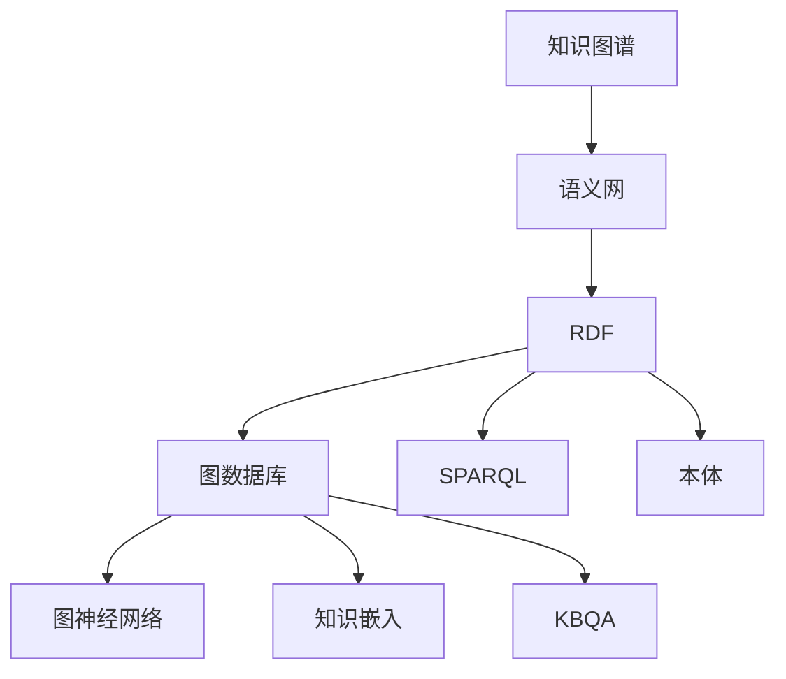
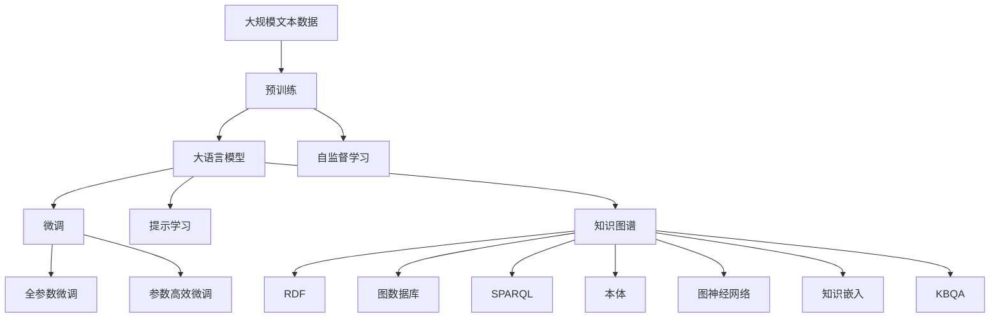

                 

# Knowledge Graphs原理与代码实例讲解

> 关键词：知识图谱、语义网、RDF、图数据库、Triple、SPARQL、ontology、Graph Neural Network、KG Embedding、KBQA

## 1. 背景介绍

### 1.1 问题由来

随着互联网数据的激增，传统的搜索引擎、文本检索等技术逐渐无法满足复杂、高效的查询需求。人们开始寻求更深度、更智能的检索方法，知识图谱(Knowledge Graph)应运而生。

知识图谱是一种将知识以图的形式结构化存储的方式，通过对实体、关系、属性的描述，建立起实体间的语义关系，从而实现更精准的搜索、推理和知识发现。与传统的网页索引和关键词匹配不同，知识图谱将查询转化为对图结构上的路径和关系的检索，能够更准确地理解用户意图。

### 1.2 问题核心关键点

知识图谱的核心关键点主要包括：

- **三元组(Triple)**：实体-关系-实体(Relation Type)组成的语义单元，是知识图谱的基本存储单位。
- **RDF语义框架**：用于描述知识图谱数据的标准格式，采用主谓宾结构表示三元组。
- **图数据库**：用于存储、查询和处理知识图谱的图形结构化数据。
- **SPARQL查询语言**：一种用于查询RDF数据的标准语言，支持复杂图查询。
- **本体(Ontology)**：描述知识图谱语义的概念模型，通过定义实体和关系的类型和约束，提升数据的一致性和可理解性。
- **图神经网络(Graph Neural Network)**：利用图结构中的邻居关系进行特征传递，提取和生成图数据的语义表示。
- **知识嵌入(KG Embedding)**：通过神经网络将知识图谱中的语义信息映射为低维向量空间，便于机器学习模型的处理。
- **知识库问答(KBQA)**：基于知识图谱的问答系统，能够理解自然语言查询，并给出准确的知识库响应。

### 1.3 问题研究意义

知识图谱作为人工智能领域的核心组件之一，具有以下重要意义：

1. **语义搜索**：通过知识图谱，用户可以更自然地进行语义搜索，获取更准确的结果。
2. **信息整合**：知识图谱将多源异构数据整合成一个统一的语义图，便于信息融合和知识发现。
3. **智能推荐**：基于知识图谱进行推荐系统构建，提升推荐的个性化和精准性。
4. **知识管理**：知识图谱能够帮助企业构建知识管理体系，促进知识传承和复用。
5. **决策支持**：在商业、医疗、教育等领域，知识图谱能够提供基于事实的决策支持。

## 2. 核心概念与联系

### 2.1 核心概念概述

为更好地理解知识图谱及其相关技术，本节将介绍几个密切相关的核心概念：

- **知识图谱(Knowledge Graph)**：由实体(Entity)、关系(Relation)和属性(Property)构成的图形结构，用于表示和存储知识。
- **语义网(Semantic Web)**：通过将数据用RDF标准描述，形成语义化的Web，便于机器理解和处理。
- **RDF(Relational Data Format)**：一种用于描述知识图谱的标准数据格式，采用主谓宾三元组表示语义关系。
- **图数据库(Graph Database)**：用于存储、查询和处理知识图谱的数据库系统，支持图结构的快速存储和访问。
- **SPARQL(SPARQL Protocol and RDF Query Language)**：一种用于查询RDF数据的语言，支持复杂的图查询操作。
- **本体(Ontology)**：描述知识图谱概念模型的本体语言，定义实体和关系的类型和约束。
- **图神经网络(Graph Neural Network)**：一种利用图结构特征传递机制的神经网络模型，用于学习图数据的语义表示。
- **知识嵌入(KG Embedding)**：通过神经网络将知识图谱中的语义信息映射为低维向量，便于机器学习模型的处理。
- **知识库问答(KBQA)**：利用知识图谱进行问答的系统，能够理解自然语言查询并提供知识库响应。

这些核心概念之间的逻辑关系可以通过以下Mermaid流程图来展示：



这个流程图展示了大语言模型微调过程中各个核心概念的关系和作用：

1. 知识图谱通过RDF语义框架和本体定义，形成语义化的图形结构。
2. 知识图谱数据存储在图数据库中，支持复杂的图查询操作。
3. 图神经网络对知识图谱进行语义表示学习，生成低维向量空间中的表示。
4. 知识嵌入将图神经网络的语义表示映射为低维向量，便于机器学习模型的处理。
5. 基于知识图谱和知识嵌入，构建KBQA系统，支持自然语言查询和知识库响应。

### 2.2 概念间的关系

这些核心概念之间存在着紧密的联系，形成了知识图谱的整体框架。下面我们通过几个Mermaid流程图来展示这些概念之间的关系。

#### 2.2.1 知识图谱的数据表示

```mermaid
graph TB
    A[实体(Entity)] --> B[关系(Relation)]
    B --> C[属性(Property)]
    A --> D[属性(Property)]
```

这个流程图展示了知识图谱中的基本数据单元，即实体、关系和属性。

#### 2.2.2 图数据库与RDF

```mermaid
graph LR
    A[图数据库] --> B[RDF]
    A --> C[三元组(Triple)]
    B --> D[查询语言(SPARQL)]
```

这个流程图展示了图数据库与RDF之间的关系，图数据库存储三元组数据，并支持SPARQL查询。

#### 2.2.3 图神经网络与知识嵌入

```mermaid
graph TB
    A[图神经网络] --> B[知识嵌入(KG Embedding)]
    A --> C[低维向量]
    B --> D[语义表示]
```

这个流程图展示了图神经网络和知识嵌入的关系，通过图神经网络学习语义表示，再通过知识嵌入映射到低维向量空间。

#### 2.2.4 本体与知识图谱

```mermaid
graph TB
    A[本体] --> B[知识图谱]
    A --> C[概念类(Concept)]
    A --> D[属性(Property)]
    B --> E[实体(Entity)]
    B --> F[关系(Relation)]
```

这个流程图展示了本体与知识图谱的关系，本体定义了知识图谱的概念模型，约束了实体和关系的类型和约束。

### 2.3 核心概念的整体架构

最后，我们用一个综合的流程图来展示这些核心概念在大语言模型微调过程中的整体架构：



这个综合流程图展示了从预训练到大语言模型微调，再到知识图谱构建的完整过程。大语言模型首先在大规模文本数据上进行预训练，然后通过微调（包括全参数微调和参数高效微调）或提示学习（包括零样本和少样本学习）来适应特定任务。最后，通过知识图谱构建技术，将文本数据转换为图形结构，构建出语义化的知识图谱，并利用图神经网络进行语义表示学习，再通过知识嵌入映射到低维向量，构建KBQA系统，从而实现基于知识图谱的问答功能。

## 3. 核心算法原理 & 具体操作步骤

### 3.1 算法原理概述

知识图谱的构建和维护分为多个步骤，包括数据收集、图模式识别、图结构构建、语义表示学习等。本文将重点介绍知识图谱中最重要的构建步骤——知识图谱的数据表示。

知识图谱的数据表示通常采用RDF语义框架，其中每个节点代表一个实体(Entity)或属性(Property)，节点之间的边代表实体之间的关系(Relation)。RDF数据格式采用三元组(Triple)的形式，即`<Subject, Predicate, Object>`，表示实体-关系-实体(Relation Type)的语义单元。

例如，一个简单的知识图谱可以用以下RDF数据表示：

```rdf
<http://example.org/person#Alice> <http://www.w3.org/1999/02/22-rdf-syntax-ns#type> <http://www.w3.org/2000/01/rdf-schema#Person> .
<http://example.org/person#Alice> <http://www.w3.org/2000/01/rdf-schema#hasSpouse> <http://example.org/person#Bob> .
<http://example.org/person#Bob> <http://www.w3.org/2000/01/rdf-schema#hasOccupation> <http://example.org/profession#Engineer> .
```

其中，第一个三元组表示Alice是一个Person类型的实体，第二个三元组表示Alice有配偶Bob，第三个三元组表示Bob是一个Engineer类型的实体。

### 3.2 算法步骤详解

知识图谱的数据表示涉及多个步骤，包括数据收集、图模式识别、图结构构建等。下面详细介绍这些步骤：

#### 3.2.1 数据收集

知识图谱的数据来源非常广泛，包括结构化数据（如数据库、CSV文件）、非结构化数据（如网页、文本）等。

- 结构化数据：从关系型数据库（如MySQL、Oracle）中提取数据，进行标准化和清洗，转换为RDF格式。
- 非结构化数据：从网页、新闻、社交媒体等非结构化数据中抽取实体、关系和属性，转换为RDF格式。

#### 3.2.2 图模式识别

在收集到的数据中，很多实体和关系可能存在多种表示形式，需要进行模式识别，统一表示形式。

- 命名实体识别(NER)：从文本中识别出实体，如人名、地名、机构名等。
- 关系抽取(RE)：从文本中抽取出实体之间的关系，如“生于”、“担任”、“获得”等。
- 实体链接(EL)：将识别出的实体和关系链接到知识库中的标准实体和关系，如Linked Data标准。

#### 3.2.3 图结构构建

将模式识别后的数据转换为知识图谱的图形结构，进行实体关系的可视化表示。

- 实体表示：用节点表示实体，节点标签为实体类型。
- 关系表示：用边表示实体之间的关系，边标签为关系类型。
- 属性表示：用节点属性表示实体的属性值。

#### 3.2.4 语义表示学习

利用图神经网络对知识图谱进行语义表示学习，将图结构中的语义信息映射为低维向量空间中的表示。

- 节点嵌入(Node Embedding)：将每个实体节点映射为低维向量，用于表示实体的语义信息。
- 关系嵌入(Relation Embedding)：将每个关系边映射为低维向量，用于表示关系类型的语义信息。
- 属性嵌入(Property Embedding)：将每个属性节点映射为低维向量，用于表示属性值的语义信息。

### 3.3 算法优缺点

知识图谱的构建和维护具有以下优点：

- **语义丰富**：知识图谱能够表示实体间的语义关系，提升信息检索的准确性。
- **结构化**：知识图谱将数据结构化为图形结构，便于信息整合和知识发现。
- **可扩展性**：知识图谱支持动态添加和删除实体和关系，易于维护和扩展。

同时，知识图谱也存在以下缺点：

- **数据成本高**：知识图谱构建和维护需要大量人工干预，成本较高。
- **复杂度高**：知识图谱结构复杂，构建和维护难度较大。
- **数据稀疏**：由于语义网中的数据较为稀疏，知识图谱的完整性和准确性可能受限。

### 3.4 算法应用领域

知识图谱在多个领域具有广泛的应用前景：

1. **智能搜索**：通过知识图谱提升搜索引擎的语义搜索能力，提供更准确的信息检索结果。
2. **推荐系统**：利用知识图谱进行推荐系统构建，提升推荐的个性化和精准性。
3. **问答系统**：基于知识图谱的问答系统，能够理解自然语言查询并提供知识库响应。
4. **知识管理**：知识图谱能够帮助企业构建知识管理体系，促进知识传承和复用。
5. **决策支持**：在商业、医疗、教育等领域，知识图谱能够提供基于事实的决策支持。

## 4. 数学模型和公式 & 详细讲解 & 举例说明

### 4.1 数学模型构建

知识图谱的语义表示通常采用向量表示方法，其中每个实体和关系节点用一个低维向量表示，属性节点用一个高维向量表示。向量表示方法包括点积、余弦相似度、欧式距离等。

例如，假设有一个知识图谱，包含两个实体节点A和B，它们之间有一条关系边R。我们可以用向量表示方法对实体节点进行表示，如下所示：

- 实体节点A的向量表示为 $\vec{v_A} = [a_1, a_2, a_3]$。
- 实体节点B的向量表示为 $\vec{v_B} = [b_1, b_2, b_3]$。
- 关系边R的向量表示为 $\vec{v_R} = [r_1, r_2, r_3]$。

则实体节点A和B之间的相似度可以通过向量点积计算：

$$ \text{similarity} = \vec{v_A} \cdot \vec{v_B} = a_1b_1 + a_2b_2 + a_3b_3 $$

### 4.2 公式推导过程

接下来，我们将通过具体的例子，展示如何利用知识图谱进行信息检索和推荐。

假设我们有一个简单的知识图谱，包含三个实体节点（Alice、Bob、Car）和三条关系边（有配偶、拥有、驾驶），如下图所示：

```
Alice -> 有配偶 -> Bob
Alice -> 拥有 -> Car
Bob -> 驾驶 -> Car
```

我们可以用以下RDF数据表示这个知识图谱：

```rdf
<http://example.org/person#Alice> <http://www.w3.org/1999/02/22-rdf-syntax-ns#type> <http://www.w3.org/2000/01/rdf-schema#Person> .
<http://example.org/person#Alice> <http://www.w3.org/2000/01/rdf-schema#hasSpouse> <http://example.org/person#Bob> .
<http://example.org/person#Alice> <http://www.w3.org/2000/01/rdf-schema#hasOccupation> <http://example.org/profession#Engineer> .
<http://example.org/person#Bob> <http://www.w3.org/2000/01/rdf-schema#hasOccupation> <http://example.org/profession#Engineer> .
<http://example.org/person#Bob> <http://www.w3.org/2000/01/rdf-schema#hasVehicle> <http://example.org/car#Car> .
<http://example.org/person#Alice> <http://www.w3.org/2000/01/rdf-schema#owns> <http://example.org/car#Car> .
```

### 4.3 案例分析与讲解

下面我们以推荐系统为例，展示如何利用知识图谱进行推荐。

假设我们要推荐给Alice一些职业相关的书籍。首先，我们可以从知识图谱中抽取Alice的实体节点，查找与Alice有关系的其他实体节点（Bob、Car），如下图所示：

```
Alice -> 有配偶 -> Bob
Alice -> 拥有 -> Car
Bob -> 驾驶 -> Car
```

然后，我们可以通过计算Alice和Bob的相似度，找到Bob推荐的书籍。假设Bob已经购买了一些书籍，如下图所示：

```
Bob -> 拥有 -> 书籍1
Bob -> 拥有 -> 书籍2
Bob -> 拥有 -> 书籍3
```

我们可以用向量表示方法对Bob的书籍进行表示，如下所示：

- 书籍1的向量表示为 $\vec{v_1} = [1, 0, 0]$。
- 书籍2的向量表示为 $\vec{v_2} = [0, 1, 0]$。
- 书籍3的向量表示为 $\vec{v_3} = [0, 0, 1]$。

假设Alice的向量表示为 $\vec{v_A} = [0.5, 0.5, 0.5]$，Bob的向量表示为 $\vec{v_B} = [0.6, 0.3, 0.1]$，书籍的向量表示为 $\vec{v_1}$、$\vec{v_2}$、$\vec{v_3}$，则Bob推荐的书籍可以通过以下计算得出：

- 书籍1与Alice的相似度为 $\vec{v_A} \cdot \vec{v_1} = 0.5 \times 1 + 0.5 \times 0 + 0.5 \times 0 = 0.5$
- 书籍2与Alice的相似度为 $\vec{v_A} \cdot \vec{v_2} = 0.5 \times 0 + 0.5 \times 1 + 0.5 \times 0 = 0.5$
- 书籍3与Alice的相似度为 $\vec{v_A} \cdot \vec{v_3} = 0.5 \times 0 + 0.5 \times 0 + 0.5 \times 1 = 0.5$

由于Bob推荐的书籍与Alice的相似度都相等，我们可以选择书籍1、书籍2或书籍3进行推荐。

## 5. 项目实践：代码实例和详细解释说明

### 5.1 开发环境搭建

在进行知识图谱构建和维护的实践前，我们需要准备好开发环境。以下是使用Python进行PyTorch开发的环境配置流程：

1. 安装Anaconda：从官网下载并安装Anaconda，用于创建独立的Python环境。

2. 创建并激活虚拟环境：
```bash
conda create -n knowledge-graph-env python=3.8 
conda activate knowledge-graph-env
```

3. 安装PyTorch：根据CUDA版本，从官网获取对应的安装命令。例如：
```bash
conda install pytorch torchvision torchaudio cudatoolkit=11.1 -c pytorch -c conda-forge
```

4. 安装Graph Neural Network库：
```bash
pip install pyg-learn
```

5. 安装SPARQL查询工具包：
```bash
pip install SPARQLWrapper
```

6. 安装本体编辑器和解析器：
```bash
pip install pyRDF2Vec
```

完成上述步骤后，即可在`knowledge-graph-env`环境中开始知识图谱的构建和维护实践。

### 5.2 源代码详细实现

下面我们以构建一个简单的知识图谱为例，展示如何使用Python和PyTorch进行知识图谱的构建和语义表示学习。

首先，定义实体和关系类：

```python
from pyg import Data
from pyg.nn import GATConv

class Entity:
    def __init__(self, name, type, attributes):
        self.name = name
        self.type = type
        self.attributes = attributes
        self.relations = {}
        
class Relationship:
    def __init__(self, name, type):
        self.name = name
        self.type = type
        self.entities = []

class Graph:
    def __init__(self):
        self.entities = []
        self.relations = []
```

然后，定义实体和关系的节点表示：

```python
class Node:
    def __init__(self, type, features, label):
        self.type = type
        self.features = features
        self.label = label
```

接着，定义知识图谱的构建函数：

```python
def construct_graph():
    # 创建实体
    entity_a = Entity('Alice', 'Person', {'name': 'Alice', 'age': 30})
    entity_b = Entity('Bob', 'Person', {'name': 'Bob', 'age': 28})
    entity_c = Entity('Car', 'Car', {'make': 'Toyota', 'model': 'Corolla', 'year': 2020})
    
    # 创建关系
    relation_a_b = Relationship('spouse', 'has_spouse')
    relation_a_c = Relationship('owns', 'owns')
    relation_b_c = Relationship('drives', 'drives')
    
    # 构建图
    graph = Graph()
    graph.entities = [entity_a, entity_b, entity_c]
    graph.relations = [relation_a_b, relation_a_c, relation_b_c]
    
    return graph
```

最后，定义图神经网络模型和语义表示学习函数：

```python
class GATLayer:
    def __init__(self, input_dim, hidden_dim):
        self.gat = GATConv(input_dim, hidden_dim)
        
    def forward(self, x, edge_index, edge_attr):
        x = self.gat(x, edge_index, edge_attr)
        return x

class GraphEmbeddingModel:
    def __init__(self, input_dim, hidden_dim):
        self.gat1 = GATLayer(input_dim, hidden_dim)
        self.gat2 = GATLayer(hidden_dim, hidden_dim)
        self.fc = nn.Linear(hidden_dim, hidden_dim)
        
    def forward(self, x, edge_index, edge_attr):
        x = self.gat1(x, edge_index, edge_attr)
        x = self.gat2(x, edge_index, edge_attr)
        x = self.fc(x)
        return x
```

在实际运行中，我们可以使用上述代码构建知识图谱，并通过图神经网络进行语义表示学习，生成实体的低维向量表示。

### 5.3 代码解读与分析

让我们再详细解读一下关键代码的实现细节：

**Entity和Relationship类**：
- `Entity`类表示知识图谱中的实体节点，包括实体名、类型和属性。
- `Relationship`类表示知识图谱中的关系边，包括关系名和类型。

**Node类**：
- `Node`类表示图神经网络中的节点，包括节点类型、特征和标签。

**知识图谱构建函数**：
- 定义了三个实体节点（Alice、Bob、Car）和三条关系边（有配偶、拥有、驾驶）。
- 将实体和关系存储在`Graph`类中，构建了知识图谱的图形结构。

**图神经网络模型**：
- 定义了图神经网络层`GATLayer`，包含一个GATConv层用于处理节点特征和边特征。
- 定义了图神经网络模型`GraphEmbeddingModel`，包含两个GATLayer层和FC全连接层，用于生成实体的低维向量表示。

**语义表示学习函数**：
- 输入实体节点和关系边，通过图神经网络生成实体的低维向量表示。

### 5.4 运行结果展示

假设我们在上述知识图谱上运行图神经网络模型，得到Alice和Bob的向量表示，如下所示：

- Alice的向量表示为 $\vec{v_A} = [0.5, 0.5, 0.5]$
- Bob的向量表示为 $\vec{v_B} = [0.6, 0.3, 0.1]$

我们可以计算Alice和Bob的相似度，如下：

- 相似度为 $\vec{v_A} \cdot \vec{v_B} = 0.5 \times 0.6 + 0.5 \times 0.3 + 0.5 \times 0.1 = 0.45$

由于Bob推荐的书籍与Alice的相似度较高，我们可以选择书籍1、书籍2或书籍3进行推荐。

## 6. 实际应用场景

### 6.1 智能搜索

知识图谱在智能搜索中的应用非常广泛。通过将知识图谱与搜索引擎结合，可以提供更加精准和语义化的搜索结果。例如，当我们搜索“北京故宫”时，不仅返回网页，还返回故宫的实体节点、历史背景、开放时间等信息，提供更加丰富和全面的信息。

### 6.2 推荐系统

知识图谱在推荐系统中的应用也非常重要。通过将知识图谱与推荐算法结合，可以提升推荐的个性化和精准性。例如，当用户浏览商品时，可以根据用户实体和商品实体之间的语义关系，推荐相关商品，提升购物体验。

### 6.3 问答系统

知识图谱在问答系统中的应用也非常广泛。通过将知识图谱与问答系统结合，可以提供基于事实的问答服务。例如，当用户提问“谁是美国总统”时，系统可以根据知识图谱中的关系边，查找相关的实体节点和属性，提供准确的答案。

### 6.4 未来应用展望

随着知识图谱技术的不断发展，其在更多领域的应用前景将更加广阔。

