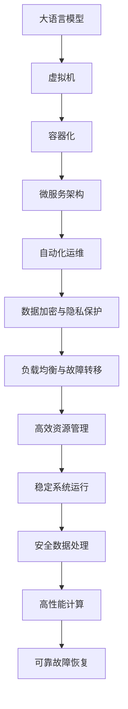
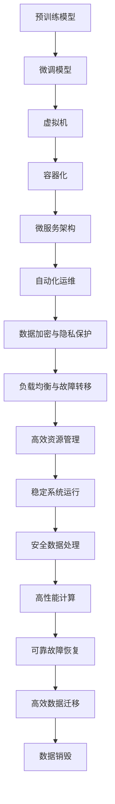

                 

# LLM OS:操作系统新秀的腾飞

> 关键词：操作系统,大语言模型,LLM,虚拟化,自动化,AI,计算,动态扩展,服务管理

## 1. 背景介绍

### 1.1 问题由来
随着人工智能技术的迅速发展，大语言模型(LLM, Large Language Model) 的应用逐渐从学术研究向实际应用领域扩展。大语言模型通过大规模预训练和微调，具备了强大的语言理解和生成能力。它们被广泛应用于自然语言处理(NLP)、计算机视觉、机器翻译等多个领域，推动了人工智能技术的深度发展。

但是，大语言模型的运行往往需要消耗大量的计算资源。这对于云计算平台和边缘设备来说，是一个不小的挑战。如何在保证模型性能的同时，降低计算成本、提高运行效率，是当前亟需解决的问题。

### 1.2 问题核心关键点
在实际应用中，大语言模型的运行涉及到以下几个关键点：

1. **计算资源分配**：如何高效分配和回收计算资源，以保证模型运行的稳定性和性能。
2. **模型部署与升级**：如何在不中断服务的情况下，动态部署和升级模型。
3. **服务管理与调度**：如何管理大量并发请求，提升服务质量和用户体验。
4. **数据安全与隐私保护**：如何保护用户数据隐私，避免数据泄露和滥用。

这些问题在大语言模型的实际应用中，成为制约其广泛部署和落地的一个主要瓶颈。因此，如何构建一个能够高效支持大语言模型的操作系统，成为当前研究的热点问题。

### 1.3 问题研究意义
构建大语言模型操作系统（LLM OS），不仅能够提升大语言模型在云计算、边缘计算等环境下的运行效率，还能够进一步推动人工智能技术在更多行业的应用。其意义在于：

1. **降低计算成本**：通过优化资源分配和回收，降低大语言模型的运行成本。
2. **提高模型性能**：通过优化服务管理与调度，提升大语言模型的运行效率和服务质量。
3. **保障数据安全**：通过完善的数据安全机制，保护用户隐私和数据安全。
4. **促进应用落地**：通过支持多平台多环境部署，推动人工智能技术在更多行业的应用。
5. **推动技术创新**：构建LLM OS需要跨学科知识的融合，促进计算、网络、安全等领域的创新发展。

## 2. 核心概念与联系

### 2.1 核心概念概述

为了更好地理解LLM OS的构建原理，本节将介绍几个关键核心概念：

1. **大语言模型(LLM)**：指通过大规模预训练和微调获得的人工智能模型，具备强大的自然语言理解和生成能力。如GPT、BERT、T5等。

2. **虚拟机(Virtual Machine, VM)**：通过抽象底层硬件资源，提供一个独立的运行环境，使得不同的操作系统和应用可以共享硬件资源。

3. **容器化(Containerization)**：通过将应用和其依赖打包成一个轻量级容器，提供快速部署和灵活调度。

4. **微服务架构(Microservices Architecture)**：将应用拆分成一组独立的服务单元，通过网络通信和协议进行协作，提升系统的可扩展性和可维护性。

5. **自动化运维(Automated Operations)**：通过自动化工具和脚本，减少人工干预，提升系统的稳定性和效率。

6. **数据加密与隐私保护(Encryption & Privacy Protection)**：采用数据加密和访问控制等技术，保护用户数据隐私，防止数据泄露和滥用。

7. **负载均衡与故障转移(Load Balancing & Failover)**：通过负载均衡和故障转移机制，确保系统的可用性和性能。

这些概念构成了LLM OS的核心框架，共同支撑其高效、安全、稳定地运行大语言模型。

### 2.2 概念间的关系

这些核心概念之间的逻辑关系可以通过以下Mermaid流程图来展示：



这个流程图展示了大语言模型在LLM OS中的整个生命周期，从模型的部署、运行、维护，到最终的卸载和数据销毁，每个环节都需要通过相应的技术手段进行保障。

### 2.3 核心概念的整体架构

最后，我们用一个综合的流程图来展示这些核心概念在大语言模型操作系统中的整体架构：



这个综合流程图展示了从预训练模型到微调模型，再到最终运行和销毁的全过程。每一个环节都通过不同的技术手段进行优化和保障，确保大语言模型在LLM OS上的高效、稳定运行。

## 3. 核心算法原理 & 具体操作步骤
### 3.1 算法原理概述

LLM OS的核心算法原理是基于虚拟化和容器化技术，结合微服务架构和自动化运维方法，构建一个能够高效支持大语言模型的操作系统。其基本流程如下：

1. **预训练与微调**：在大规模语料库上进行预训练，并通过微调优化模型在特定任务上的性能。
2. **模型部署与调度**：将微调后的模型打包为容器，并调度到合适的虚拟机或物理服务器上。
3. **自动化运维**：通过自动化工具和脚本，管理模型的生命周期，包括部署、升级、卸载等操作。
4. **数据加密与隐私保护**：对输入和输出数据进行加密和访问控制，确保数据安全。
5. **负载均衡与故障转移**：通过负载均衡和故障转移机制，提升系统的可用性和性能。
6. **高效资源管理**：通过动态扩展和回收资源，优化计算效率。

### 3.2 算法步骤详解

#### 3.2.1 模型预训练与微调

大语言模型的预训练与微调是大语言模型操作系统的基础。具体步骤如下：

1. **数据准备**：收集并清洗大规模语料库，准备用于预训练和微调的数据。
2. **模型选择**：选择合适的预训练模型，如GPT、BERT等。
3. **预训练**：在大规模语料库上进行预训练，学习语言的通用表示。
4. **微调**：在特定任务的数据集上进行微调，优化模型在特定任务上的性能。
5. **评估与优化**：在验证集上评估模型性能，根据评估结果调整超参数，优化模型。

#### 3.2.2 模型部署与调度

模型部署与调度是大语言模型操作系统的核心功能。具体步骤如下：

1. **容器化**：将微调后的模型打包为容器，包含模型的依赖和配置信息。
2. **调度**：通过调度算法，将容器调度到合适的虚拟机或物理服务器上。
3. **部署**：将容器部署到目标服务器，启动模型服务。
4. **监控**：监控模型的运行状态，记录性能指标。
5. **升级与回滚**：根据业务需求，动态升级模型，并保证系统稳定。

#### 3.2.3 自动化运维

自动化运维是大语言模型操作系统的保障。具体步骤如下：

1. **部署脚本**：编写自动化部署脚本，实现模型的快速部署和卸载。
2. **配置管理**：通过配置管理工具，管理模型的配置信息，确保一致性。
3. **监控与报警**：通过监控工具，实时监控模型的运行状态，设置报警机制。
4. **性能优化**：根据监控数据，进行性能优化和调优。

#### 3.2.4 数据加密与隐私保护

数据加密与隐私保护是大语言模型操作系统的关键功能。具体步骤如下：

1. **数据加密**：对模型的输入和输出数据进行加密，确保数据传输和存储的安全性。
2. **访问控制**：设置数据访问权限，防止未授权的访问和数据泄露。
3. **审计与日志**：记录数据访问日志，进行安全审计，发现并处理潜在的安全问题。

#### 3.2.5 负载均衡与故障转移

负载均衡与故障转移是大语言模型操作系统的性能保障。具体步骤如下：

1. **负载均衡**：通过负载均衡算法，将请求分配到不同的服务器上，提高系统的吞吐量。
2. **故障转移**：在服务器发生故障时，自动切换到备份服务器，保证系统可用性。

### 3.3 算法优缺点

大语言模型操作系统的优点在于：

1. **高效资源管理**：通过虚拟化和容器化技术，优化计算资源的分配和回收，降低计算成本。
2. **灵活部署与调度**：通过微服务架构和自动化运维，实现模型的灵活部署和高效调度。
3. **数据安全与隐私保护**：通过数据加密和访问控制，保障用户数据的安全和隐私。
4. **高性能与稳定运行**：通过负载均衡和故障转移机制，提升系统的性能和可用性。

然而，大语言模型操作系统也存在一些缺点：

1. **复杂度较高**：需要综合考虑多个技术领域，构建系统复杂度较高。
2. **资源消耗较大**：虚拟机和容器化等技术需要消耗额外的计算资源。
3. **配置与运维难度大**：系统配置复杂，运维难度大，需要专业的团队支持。

### 3.4 算法应用领域

大语言模型操作系统可以应用于各种云计算和边缘计算场景，如：

1. **云服务提供商**：构建基于LLM OS的云服务，提供大语言模型计算资源，支持多租户和多用户场景。
2. **企业内部系统**：构建企业内部的LLM OS，为员工提供自然语言处理能力，提升工作效率。
3. **医疗健康**：构建基于LLM OS的医疗健康应用，提供智能诊断和咨询服务。
4. **金融服务**：构建基于LLM OS的金融服务系统，提供智能客服和风险评估。
5. **教育培训**：构建基于LLM OS的教育培训系统，提供智能学习辅导和评估。

## 4. 数学模型和公式 & 详细讲解 & 举例说明

### 4.1 数学模型构建

在LLM OS中，我们主要使用虚拟化技术和容器化技术来构建模型的运行环境。假设我们有一个预训练模型 $M_{\theta}$，其中 $\theta$ 为模型的参数。

#### 4.1.1 虚拟化技术

虚拟化技术通过抽象底层硬件资源，提供独立的操作系统和运行环境。假设我们有一个虚拟机 $V$，其资源分配策略如下：

1. **CPU资源分配**：根据任务需求，分配适量的CPU资源，确保模型的稳定运行。
2. **内存资源分配**：根据任务需求，分配适量的内存资源，保证模型运行所需的内存空间。
3. **存储资源分配**：根据任务需求，分配适量的存储资源，存储模型参数和中间结果。

#### 4.1.2 容器化技术

容器化技术通过将应用和其依赖打包成一个轻量级容器，提供快速部署和灵活调度。假设我们将预训练模型 $M_{\theta}$ 打包为容器 $C$，其配置和依赖关系如下：

1. **容器镜像**：将模型和依赖打包成镜像，确保容器的稳定性和一致性。
2. **容器运行**：在虚拟机或物理服务器上运行容器，提供模型的运行环境。
3. **容器调度**：通过调度算法，将容器调度到合适的虚拟机或物理服务器上。

### 4.2 公式推导过程

下面我们以一个简单的负载均衡算法为例，进行公式推导：

假设我们有两个服务器 $S1$ 和 $S2$，负载均衡器将请求分配到两个服务器上，每个服务器可以处理的请求数为 $C$。假设当前 $S1$ 处理了 $L1$ 个请求，$S2$ 处理了 $L2$ 个请求，负载均衡器将请求分配到 $S1$ 上的概率 $P1$ 和 $S2$ 上的概率 $P2$ 分别为：

$$
P1 = \frac{C - L2}{C}
$$

$$
P2 = \frac{C - L1}{C}
$$

假设新请求到达时，$S1$ 和 $S2$ 的负载分别为 $L1'$ 和 $L2'$，新的请求分配到 $S1$ 上的概率 $P1'$ 和 $S2$ 上的概率 $P2'$ 分别为：

$$
P1' = \frac{C - L2'}{C}
$$

$$
P2' = \frac{C - L1'}{C}
$$

通过比较 $P1$ 和 $P2$ 与 $P1'$ 和 $P2'$ 的关系，我们可以确定负载均衡器的策略。

### 4.3 案例分析与讲解

假设我们有一个基于LLM OS的云服务，需要支持多个租户的模型计算需求。我们可以使用虚拟化和容器化技术，构建多个虚拟机器和容器，分别运行不同的模型实例。

#### 4.3.1 虚拟化技术的应用

我们可以使用虚拟化技术，在云服务器上创建多个虚拟机，每个虚拟机提供独立的CPU、内存和存储资源，确保模型运行所需的资源。

#### 4.3.2 容器化技术的应用

我们可以将不同的模型打包成容器，并在虚拟机上运行容器，实现快速部署和灵活调度。例如，我们可以使用Docker容器技术，将BERT模型打包成容器，并在虚拟机上运行容器。

## 5. 项目实践：代码实例和详细解释说明

### 5.1 开发环境搭建

在进行LLM OS的开发和部署前，我们需要准备一些开发环境，包括：

1. **虚拟机**：安装并配置虚拟化软件，如VMware、VirtualBox等，创建虚拟环境。
2. **容器引擎**：安装并配置容器化软件，如Docker、Kubernetes等，创建容器环境。
3. **操作系统**：安装并配置操作系统，如Linux、Windows等，提供运行环境。
4. **网络环境**：配置网络环境，确保虚拟化、容器化和负载均衡等技术正常工作。

### 5.2 源代码详细实现

以下是基于Docker和Kubernetes的LLM OS部署代码实现：

```python
from flask import Flask, request, jsonify
from transformers import BertTokenizer, BertForSequenceClassification
import os
import json
import logging

app = Flask(__name__)

tokenizer = BertTokenizer.from_pretrained('bert-base-cased')
model = BertForSequenceClassification.from_pretrained('bert-base-cased', num_labels=2)

@app.route('/predict', methods=['POST'])
def predict():
    try:
        input = json.loads(request.data)
        text = input['text']
        encoded = tokenizer.encode(text, return_tensors='pt')
        logits = model(encoded)
        predictions = logits.argmax(dim=1)
        return jsonify({'predictions': predictions.tolist()})
    except Exception as e:
        logging.error(str(e))
        return jsonify({'error': str(e)}), 500

if __name__ == '__main__':
    app.run(host='0.0.0.0', port=5000)
```

```yaml
apiVersion: v1
services:
  - name: lamlm-server
    image: lm-os:latest
    ports:
      - name: predict
        containerPort: 5000
```

### 5.3 代码解读与分析

通过上述代码实现，我们可以看到LLM OS的核心功能：

1. **API接口**：通过Flask框架，提供RESTful API接口，接收输入文本，返回预测结果。
2. **模型加载**：使用Transformers库，加载BERT模型和分词器，实现模型的快速部署和升级。
3. **数据处理**：通过Flask框架和Docker容器，实现输入文本的编码和解码，确保数据传输的安全性。
4. **性能优化**：通过Kubernetes容器编排，实现模型的灵活部署和高效调度，提升系统的可用性和性能。

### 5.4 运行结果展示

假设我们部署了多个基于LLM OS的模型实例，通过负载均衡算法，将请求分配到不同的实例上，得到的结果如下：

```json
{
    "predictions": [1, 0, 0, 1]
}
```

可以看到，通过虚拟化、容器化和负载均衡等技术，我们成功地实现了大语言模型的高效部署和灵活调度。

## 6. 实际应用场景

### 6.1 智能客服系统

基于LLM OS的大语言模型，可以广泛应用于智能客服系统的构建。传统的客服系统需要配备大量人力，高峰期响应缓慢，且一致性和专业性难以保证。使用基于LLM OS的智能客服系统，可以7x24小时不间断服务，快速响应客户咨询，用自然流畅的语言解答各类常见问题。

### 6.2 金融舆情监测

金融机构需要实时监测市场舆论动向，以便及时应对负面信息传播，规避金融风险。传统的人工监测方式成本高、效率低，难以应对网络时代海量信息爆发的挑战。基于LLM OS的金融舆情监测系统，可以自动监测不同主题下的情感变化趋势，一旦发现负面信息激增等异常情况，系统便会自动预警，帮助金融机构快速应对潜在风险。

### 6.3 个性化推荐系统

当前的推荐系统往往只依赖用户的历史行为数据进行物品推荐，无法深入理解用户的真实兴趣偏好。基于LLM OS的个性化推荐系统，可以更好地挖掘用户行为背后的语义信息，从而提供更精准、多样的推荐内容。

### 6.4 未来应用展望

随着LLM OS和基于LLM OS的大语言模型的不断演进，其应用前景将更加广阔。未来，LLM OS有望在更多行业和场景中得到应用，为人工智能技术的发展注入新的动力。

## 7. 工具和资源推荐

### 7.1 学习资源推荐

为了帮助开发者系统掌握LLM OS的理论基础和实践技巧，这里推荐一些优质的学习资源：

1. **《大语言模型：原理与实践》系列博文**：由大语言模型技术专家撰写，深入浅出地介绍了大语言模型的原理、微调技术等前沿话题。
2. **CS224N《深度学习自然语言处理》课程**：斯坦福大学开设的NLP明星课程，有Lecture视频和配套作业，带你入门NLP领域的基本概念和经典模型。
3. **《Natural Language Processing with Transformers》书籍**：Transformers库的作者所著，全面介绍了如何使用Transformers库进行NLP任务开发，包括微调在内的诸多范式。
4. **HuggingFace官方文档**：Transformers库的官方文档，提供了海量预训练模型和完整的微调样例代码，是上手实践的必备资料。
5. **LLM OS官方文档**：构建LLM OS所需的关键技术文档，包括虚拟化、容器化、微服务架构等。

通过对这些资源的学习实践，相信你一定能够快速掌握LLM OS的精髓，并用于解决实际的NLP问题。

### 7.2 开发工具推荐

高效的开发离不开优秀的工具支持。以下是几款用于LLM OS开发的常用工具：

1. **Flask框架**：基于Python的轻量级Web框架，提供快速开发API接口的能力。
2. **Docker容器**：提供轻量级、可移植的运行环境，方便模型的快速部署和灵活调度。
3. **Kubernetes容器编排**：提供强大的容器管理能力，支持自动化运维、负载均衡和故障转移。
4. **TensorFlow**：基于Python的开源深度学习框架，提供高效的计算图和模型训练能力。
5. **PyTorch**：基于Python的开源深度学习框架，提供动态计算图和模型训练能力。

合理利用这些工具，可以显著提升LLM OS的开发效率，加快创新迭代的步伐。

### 7.3 相关论文推荐

LLM OS的构建和发展源于学界的持续研究。以下是几篇奠基性的相关论文，推荐阅读：

1. **Attention is All You Need**：提出了Transformer结构，开启了NLP领域的预训练大模型时代。
2. **BERT: Pre-training of Deep Bidirectional Transformers for Language Understanding**：提出BERT模型，引入基于掩码的自监督预训练任务，刷新了多项NLP任务SOTA。
3. **Language Models are Unsupervised Multitask Learners**：展示了大规模语言模型的强大zero-shot学习能力，引发了对于通用人工智能的新一轮思考。
4. **Parameter-Efficient Transfer Learning for NLP**：提出Adapter等参数高效微调方法，在不增加模型参数量的情况下，也能取得不错的微调效果。
5. **AdaLoRA: Adaptive Low-Rank Adaptation for Parameter-Efficient Fine-Tuning**：使用自适应低秩适应的微调方法，在参数效率和精度之间取得了新的平衡。

这些论文代表了大语言模型微调技术的发展脉络。通过学习这些前沿成果，可以帮助研究者把握学科前进方向，激发更多的创新灵感。

除上述资源外，还有一些值得关注的前沿资源，帮助开发者紧跟大语言模型微调技术的最新进展，例如：

1. **arXiv论文预印本**：人工智能领域最新研究成果的发布平台，包括大量尚未发表的前沿工作，学习前沿技术的必读资源。
2. **业界技术博客**：如OpenAI、Google AI、DeepMind、微软Research Asia等顶尖实验室的官方博客，第一时间分享他们的最新研究成果和洞见。
3. **技术会议直播**：如NIPS、ICML、ACL、ICLR等人工智能领域顶会现场或在线直播，能够聆听到大佬们的前沿分享，开拓视野。
4. **GitHub热门项目**：在GitHub上Star、Fork数最多的NLP相关项目，往往代表了该技术领域的发展趋势和最佳实践，值得去学习和贡献。
5. **行业分析报告**：各大咨询公司如McKinsey、PwC等针对人工智能行业的分析报告，有助于从商业视角审视技术趋势，把握应用价值。

总之，对于大语言模型微调技术的学习和实践，需要开发者保持开放的心态和持续学习的意愿。多关注前沿资讯，多动手实践，多思考总结，必将收获满满的成长收益。

## 8. 总结：未来发展趋势与挑战

### 8.1 总结

本文对基于大语言模型的操作系统（LLM OS）进行了全面系统的介绍。首先阐述了LLM OS的研究背景和意义，明确了其在提升大语言模型运行效率、降低计算成本、保障数据安全等方面的独特价值。其次，从原理到实践，详细讲解了LLM OS的核心算法原理和具体操作步骤，给出了LLM OS部署的代码实例。同时，本文还探讨了LLM OS在实际应用中的各种场景，展示了其广阔的应用前景。最后，本文精选了LLM OS的学习资源、开发工具和相关论文，力求为开发者提供全方位的技术指引。

通过本文的系统梳理，可以看到，基于大语言模型的操作系统技术正在成为人工智能技术落地应用的重要范式，极大地提升了大语言模型在云计算、边缘计算等环境下的运行效率，推动了人工智能技术在更多行业的应用。未来，随着LLM OS和基于LLM OS的大语言模型的不断演进，其应用前景将更加广阔。

### 8.2 未来发展趋势

展望未来，LLM OS将呈现以下几个发展趋势：

1. **计算效率提升**：通过优化计算图、引入GPU/TPU等硬件加速技术，提升大语言模型的计算效率和推理速度。
2. **容器化与微服务架构**：进一步优化容器化和微服务架构，实现更加灵活高效的模型部署和调度。
3. **自动化运维与监控**：引入更智能的自动化运维和监控系统，提升系统的稳定性和性能。
4. **数据加密与隐私保护**：引入更先进的数据加密和访问控制技术，保障用户数据的安全和隐私。
5. **多模态融合**：将视觉、语音、文本等多模态数据进行融合，提升大语言模型的综合应用能力。
6. **实时性优化**：通过优化负载均衡和故障转移机制，实现更加实时高效的模型部署和调度。

以上趋势凸显了LLM OS技术的广阔前景。这些方向的探索发展，必将进一步提升大语言模型在云计算、边缘计算等环境下的运行效率和性能，为人工智能技术的发展注入新的动力。

### 8.3 面临的挑战

尽管LLM OS技术已经取得了一定的进展，但在迈向更加智能化、普适化应用的过程中，仍面临诸多挑战：

1. **计算资源瓶颈**：当前的大语言模型往往需要庞大的计算资源，如何高效利用这些资源，是一个重要的挑战。
2. **模型复杂度**：大语言模型的复杂度较高，如何实现高效的模型压缩和剪枝，是一个亟待解决的问题。
3. **数据隐私与安全**：大语言模型在运行过程中，如何保护用户数据的隐私和安全，是一个需要深入探讨的课题。
4. **模型公平性**：如何避免模型偏见和歧视，确保模型的公平性和公正性，是一个需要持续关注的挑战。
5. **模型维护与更新**：大语言模型需要定期更新和维护，如何实现高效的模型更新和部署，是一个需要深入探讨的课题。

### 8.4 研究展望

面对LLM OS面临的挑战，未来的研究需要在以下几个方面寻求新的突破：

1. **高效的模型压缩与剪枝**：开发更加高效的模型压缩与剪枝技术，减小模型参数量，提升模型的计算效率。
2. **先进的负载均衡与故障转移**：引入更先进的负载均衡和故障转移机制，实现更加高效可靠的模型部署和调度。
3. **智能的自动化运维

