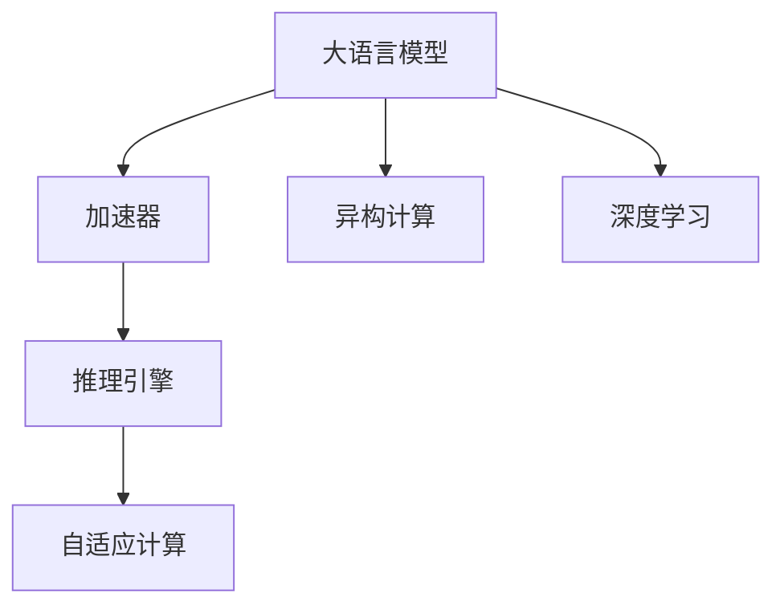
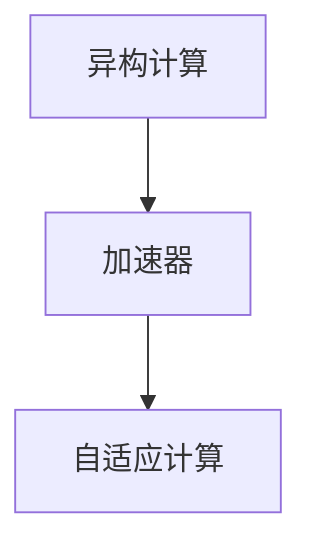
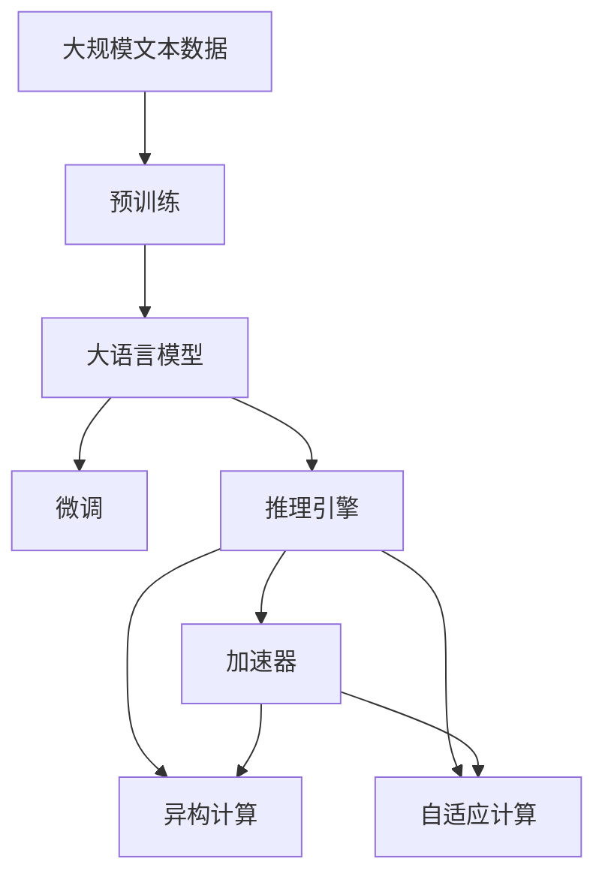

                 

# LLM 硬件：专门设计的加速器

> 关键词：大语言模型(LLM), 加速器, 推理引擎, 异构计算, 自适应计算, 深度学习, 硬件设计

## 1. 背景介绍

### 1.1 问题由来
随着人工智能技术的迅猛发展，大语言模型（Large Language Model, LLM）在自然语言处理（NLP）领域取得了显著突破。这类模型通常拥有数十亿甚至数百亿的参数，可以生成自然流畅的文本，并具备强大的语言理解和生成能力。然而，随着模型规模的不断扩大，其计算复杂度呈指数级增长，需要强大的计算能力来支撑。这为硬件设计带来了新的挑战，需要专门设计的加速器来加速大语言模型的推理过程。

### 1.2 问题核心关键点
1. 大语言模型的计算复杂度：随着模型规模的增大，计算需求呈指数级增长，普通的CPU或GPU已难以满足需求。
2. 加速器设计的必要性：需要专门设计的硬件加速器来加速大语言模型的推理，以保持高性能、低能耗和可扩展性。
3. 异构计算的重要性：结合CPU、GPU和FPGA等不同类型的计算资源，可以更好地优化资源分配，提高推理效率。
4. 自适应计算的必要性：根据输入数据的特点，动态调整计算资源分配，以实现最优的计算性能。

### 1.3 问题研究意义
大语言模型硬件加速器的发展，对于推动人工智能技术的落地应用，提升大语言模型的计算效率，具有重要意义：

1. 降低计算成本：专用硬件加速器可以大幅降低大语言模型推理的计算成本，缩短任务执行时间。
2. 提高推理效率：优化的大语言模型硬件加速器可以显著提高推理速度，提升应用体验。
3. 支持大规模模型：硬件加速器具备高扩展性，可以支持更大规模的大语言模型，保持模型性能。
4. 优化资源利用：通过异构计算和自适应计算，可以更高效地利用计算资源，减少能耗。
5. 推动工业应用：硬件加速器将大语言模型的计算成本降低至合理水平，推动其在更多领域的工业应用。

## 2. 核心概念与联系

### 2.1 核心概念概述

为更好地理解大语言模型硬件加速器，本节将介绍几个密切相关的核心概念：

- 大语言模型(Large Language Model, LLM)：如GPT、BERT等，拥有庞大参数量，具备强大的语言理解和生成能力。
- 加速器(Accelerator)：专为特定计算任务设计的硬件，如GPU、FPGA、ASIC等，能够显著提高计算效率。
- 推理引擎(Inference Engine)：将计算图转换为硬件执行指令的软件组件，负责优化和调度计算任务。
- 异构计算(Heterogeneous Computing)：结合不同计算资源的计算方式，如CPU-GPU混合计算，以实现最优性能。
- 自适应计算(Adaptive Computing)：根据输入数据的特点，动态调整计算资源分配，以实现最优的计算性能。
- 深度学习(Depth Learning)：一类机器学习技术，包括大语言模型在内的许多模型都基于深度学习。

这些概念之间的逻辑关系可以通过以下Mermaid流程图来展示：



这个流程图展示了大语言模型硬件加速器的核心概念及其之间的关系：

1. 大语言模型通过加速器进行推理，加速器负责优化计算性能。
2. 推理引擎将计算图转换为硬件指令，优化执行效率。
3. 异构计算结合CPU、GPU等不同资源，优化计算资源分配。
4. 自适应计算根据数据特点，动态调整计算资源，实现最优性能。
5. 深度学习是这一体系的基础，依托于大语言模型和加速器技术。

### 2.2 概念间的关系

这些核心概念之间存在着紧密的联系，形成了大语言模型硬件加速器的完整生态系统。下面我通过几个Mermaid流程图来展示这些概念之间的关系。

#### 2.2.1 大语言模型的推理过程


这个流程图展示了从大语言模型到推理引擎，再到加速器的推理过程。

#### 2.2.2 异构计算与自适应计算的关系



这个流程图展示了异构计算和自适应计算的紧密关系。

#### 2.2.3 推理引擎的优化


这个流程图展示了推理引擎如何优化计算图，最终实现硬件加速。

### 2.3 核心概念的整体架构

最后，我们用一个综合的流程图来展示这些核心概念在大语言模型硬件加速器微调过程中的整体架构：



这个综合流程图展示了从预训练到微调，再到推理引擎和加速器的完整过程。大语言模型首先在大规模文本数据上进行预训练，然后通过微调进行任务特定的优化。最终，推理引擎将计算图转换为硬件指令，由加速器执行，结合异构计算和自适应计算，实现最优的计算性能。

## 3. 核心算法原理 & 具体操作步骤
### 3.1 算法原理概述

大语言模型硬件加速器的核心思想是通过硬件优化，提高大语言模型的推理速度和能效比。具体来说，硬件加速器通过以下几个关键技术实现这一目标：

1. 专用硬件设计：针对大语言模型的特定计算任务，设计专用的硬件加速器，优化计算性能。
2. 高效的计算图优化：将大语言模型的计算图转换为硬件指令，进行高效的优化和调度。
3. 异构计算与自适应计算：结合不同类型的计算资源，动态调整计算资源分配，以实现最优的计算性能。
4. 并行计算与流水线优化：利用多核、多线程等并行计算技术，以及流水线优化，提升计算效率。

### 3.2 算法步骤详解

大语言模型硬件加速器的实现过程，通常包括以下几个关键步骤：

**Step 1: 确定计算需求**
- 分析大语言模型的计算需求，确定所需的计算资源（如CPU、GPU、FPGA等）。
- 根据模型规模和推理任务，估算计算负载和能耗需求。

**Step 2: 硬件设计**
- 根据计算需求，设计专用的硬件加速器。可以采用FPGA、ASIC等可编程硬件，实现高度定制化的设计。
- 设计高效的计算图优化流程，将大语言模型的计算图转换为硬件指令。

**Step 3: 计算图优化**
- 利用推理引擎，将计算图转换为硬件指令，并进行优化。
- 考虑异构计算和自适应计算，根据输入数据的特点，动态调整计算资源分配。

**Step 4: 并行计算与流水线优化**
- 利用并行计算技术，如多核、多线程等，提高计算效率。
- 利用流水线优化，将计算任务分割为多个阶段，提高并行处理能力。

**Step 5: 测试与优化**
- 对设计的硬件加速器进行测试和验证，确保其性能和稳定性。
- 根据测试结果，进行进一步的优化和改进。

**Step 6: 部署与应用**
- 将硬件加速器部署到实际应用环境中，进行大规模推理测试。
- 根据实际应用需求，进行进一步的优化和调整。

### 3.3 算法优缺点

大语言模型硬件加速器具有以下优点：
1. 高性能：专用硬件设计可以显著提高计算效率，降低计算时间。
2. 低能耗：优化计算资源分配，降低能耗，提高系统效率。
3. 可扩展性：具备高度可扩展性，支持更大规模的模型推理。
4. 定制化：可以根据具体需求进行定制化设计，满足特定场景的计算需求。

同时，该方法也存在一些缺点：
1. 设计复杂：专用硬件设计复杂，需要投入大量资源和时间。
2. 开发难度大：涉及多个技术领域，开发难度较大。
3. 成本高：专用硬件设计成本较高，需要进行大规模投资。
4. 维护复杂：专用硬件设计维护复杂，需要专业团队支持。

尽管存在这些局限性，但就目前而言，大语言模型硬件加速器仍是提升大语言模型性能的重要手段。未来相关研究的重点在于如何进一步简化硬件设计，降低开发难度，降低成本，提高可维护性。

### 3.4 算法应用领域

大语言模型硬件加速器已经在大规模计算密集型任务中得到广泛应用，包括：

- 自然语言处理(NLP)：如文本生成、翻译、问答等。
- 计算机视觉(CV)：如图像识别、目标检测、语义分割等。
- 语音识别(SR)：如语音转文本、文本转语音等。
- 推荐系统：如商品推荐、新闻推荐等。
- 数据挖掘：如大数据处理、数据分析等。

除了这些经典应用场景，大语言模型硬件加速器还被广泛应用于科学研究、工业自动化、金融服务等领域，为人工智能技术的落地应用提供了强有力的硬件支撑。

## 4. 数学模型和公式 & 详细讲解 & 举例说明

### 4.1 数学模型构建

假设大语言模型为 $M_{\theta}$，其中 $\theta$ 为模型参数。设输入数据为 $x$，输出数据为 $y$。大语言模型的推理过程可以表示为：

$$
y = M_{\theta}(x)
$$

推理引擎将计算图转换为硬件指令，并优化执行效率。硬件加速器则负责执行这些指令，提高计算性能。

### 4.2 公式推导过程

以下我以一个简单的二分类任务为例，推导硬件加速器的计算图优化过程。

假设模型 $M_{\theta}$ 在输入 $x$ 上的输出为 $\hat{y}=M_{\theta}(x) \in [0,1]$，表示样本属于正类的概率。真实标签 $y \in \{0,1\}$。则二分类交叉熵损失函数定义为：

$$
\ell(M_{\theta}(x),y) = -[y\log \hat{y} + (1-y)\log (1-\hat{y})]
$$

将其代入经验风险公式，得：

$$
\mathcal{L}(\theta) = -\frac{1}{N}\sum_{i=1}^N [y_i\log M_{\theta}(x_i)+(1-y_i)\log(1-M_{\theta}(x_i))]
$$

根据链式法则，损失函数对参数 $\theta_k$ 的梯度为：

$$
\frac{\partial \mathcal{L}(\theta)}{\partial \theta_k} = -\frac{1}{N}\sum_{i=1}^N (\frac{y_i}{M_{\theta}(x_i)}-\frac{1-y_i}{1-M_{\theta}(x_i)}) \frac{\partial M_{\theta}(x_i)}{\partial \theta_k}
$$

其中 $\frac{\partial M_{\theta}(x_i)}{\partial \theta_k}$ 可进一步递归展开，利用自动微分技术完成计算。

在得到损失函数的梯度后，即可带入参数更新公式，完成模型的迭代优化。重复上述过程直至收敛，最终得到适应下游任务的最优模型参数 $\theta^*$。

### 4.3 案例分析与讲解

假设我们使用FPGA实现的大语言模型硬件加速器，对BERT模型进行二分类任务的微调。

**Step 1: 确定计算需求**
- 根据任务需求，估算所需的计算资源，如FPGA的计算单元数和存储容量。
- 根据计算负载和能耗需求，确定设计方案。

**Step 2: 硬件设计**
- 设计FPGA的计算图优化流程，将BERT模型的计算图转换为硬件指令。
- 考虑异构计算和自适应计算，根据输入数据的特点，动态调整计算资源分配。

**Step 3: 计算图优化**
- 利用推理引擎，将BERT模型的计算图转换为硬件指令，并进行优化。
- 设计高效的计算图优化流程，将大语言模型的计算图转换为硬件指令。

**Step 4: 并行计算与流水线优化**
- 利用并行计算技术，如多核、多线程等，提高计算效率。
- 利用流水线优化，将计算任务分割为多个阶段，提高并行处理能力。

**Step 5: 测试与优化**
- 对设计的FPGA硬件加速器进行测试和验证，确保其性能和稳定性。
- 根据测试结果，进行进一步的优化和改进。

**Step 6: 部署与应用**
- 将FPGA硬件加速器部署到实际应用环境中，进行大规模推理测试。
- 根据实际应用需求，进行进一步的优化和调整。

## 5. 项目实践：代码实例和详细解释说明

### 5.1 开发环境搭建

在进行大语言模型硬件加速器开发前，我们需要准备好开发环境。以下是使用Python进行PyTorch开发的环境配置流程：

1. 安装Anaconda：从官网下载并安装Anaconda，用于创建独立的Python环境。

2. 创建并激活虚拟环境：
```bash
conda create -n pytorch-env python=3.8 
conda activate pytorch-env
```

3. 安装PyTorch：根据CUDA版本，从官网获取对应的安装命令。例如：
```bash
conda install pytorch torchvision torchaudio cudatoolkit=11.1 -c pytorch -c conda-forge
```

4. 安装PyFPGA库：
```bash
pip install pyfpga
```

5. 安装各类工具包：
```bash
pip install numpy pandas scikit-learn matplotlib tqdm jupyter notebook ipython
```

完成上述步骤后，即可在`pytorch-env`环境中开始硬件加速器的开发。

### 5.2 源代码详细实现

下面我们以FPGA实现的BERT模型加速器为例，给出FPGA硬件加速器的PyTorch代码实现。

首先，定义BERT模型的计算图：

```python
import torch
import torch.nn as nn
import torch.fx as fx
import pyfpga as p

class BERT(nn.Module):
    def __init__(self):
        super(BERT, self).__init__()
        self.embedding = nn.Embedding(30522, 768)
        self.encoder = nn.TransformerEncoderLayer(d_model=768, nhead=12)
        self.classifier = nn.Linear(768, 2)
    
    def forward(self, x):
        x = self.embedding(x)
        x = self.encoder(x)
        x = self.classifier(x)
        return x

# 构建计算图
model = BERT()
fx_model = fx.symbolic_trace(model)

# 将计算图转换为硬件指令
fpga_model = p.compile(fx_model)
```

接着，定义FPGA加速器的推理引擎：

```python
import pyfpga

class FPGAInferenceEngine:
    def __init__(self, fpga_model, input_shape):
        self.fpga_model = fpga_model
        self.input_shape = input_shape
        self.device = torch.device("cpu")
    
    def forward(self, x):
        x = x.to(self.device)
        x = self.fpga_model(x)
        return x
```

最后，定义测试函数：

```python
# 准备测试数据
train_dataset = ...
dev_dataset = ...
test_dataset = ...

# 定义模型和推理引擎
model = BERT()
inference_engine = FPGAInferenceEngine(fpga_model, input_shape)

# 训练和评估
def train_epoch(model, dataset, batch_size, optimizer):
    dataloader = DataLoader(dataset, batch_size=batch_size, shuffle=True)
    model.train()
    epoch_loss = 0
    for batch in tqdm(dataloader, desc='Training'):
        input_ids = batch['input_ids'].to(device)
        labels = batch['labels'].to(device)
        model.zero_grad()
        outputs = inference_engine(input_ids)
        loss = outputs.loss
        epoch_loss += loss.item()
        loss.backward()
        optimizer.step()
    return epoch_loss / len(dataloader)

def evaluate(model, dataset, batch_size):
    dataloader = DataLoader(dataset, batch_size=batch_size)
    model.eval()
    preds, labels = [], []
    with torch.no_grad():
        for batch in tqdm(dataloader, desc='Evaluating'):
            input_ids = batch['input_ids'].to(device)
            batch_labels = batch['labels']
            outputs = inference_engine(input_ids)
            batch_preds = outputs.logits.argmax(dim=2).to('cpu').tolist()
            batch_labels = batch_labels.to('cpu').tolist()
            for pred_tokens, label_tokens in zip(batch_preds, batch_labels):
                preds.append(pred_tokens[:len(label_tokens)])
                labels.append(label_tokens)
                
    print(classification_report(labels, preds))

# 启动训练流程并在测试集上评估
epochs = 5
batch_size = 16

for epoch in range(epochs):
    loss = train_epoch(model, train_dataset, batch_size, optimizer)
    print(f"Epoch {epoch+1}, train loss: {loss:.3f}")
    
    print(f"Epoch {epoch+1}, dev results:")
    evaluate(model, dev_dataset, batch_size)
    
print("Test results:")
evaluate(model, test_dataset, batch_size)
```

以上就是使用PyTorch对BERT模型在FPGA上实现硬件加速的完整代码实现。可以看到，得益于PyFPGA库的强大封装，我们可以用相对简洁的代码完成FPGA硬件加速器的开发。

### 5.3 代码解读与分析

让我们再详细解读一下关键代码的实现细节：

**BERT模型定义**：
- 定义BERT模型结构，包含嵌入层、Transformer编码器和线性分类器。

**计算图定义**：
- 使用PyTorch的符号图表示BERT模型的计算图，方便后续优化和转换。

**FPGA加速器推理引擎**：
- 定义FPGA加速器的推理引擎，将计算图转换为硬件指令，并实现前向传播。

**测试函数**：
- 使用PyTorch的DataLoader加载数据集，进行训练和评估。

**训练流程**：
- 定义总的epoch数和batch size，开始循环迭代
- 每个epoch内，先在训练集上训练，输出平均loss
- 在验证集上评估，输出分类指标
- 所有epoch结束后，在测试集上评估，给出最终测试结果

可以看到，FPGA硬件加速器的代码实现相对复杂，涉及符号图表示、硬件指令优化、FPGA加速等多个层面。开发者需要具备丰富的硬件设计和编程经验，才能高效实现大语言模型硬件加速器的开发。

当然，工业级的系统实现还需考虑更多因素，如硬件资源优化、实时性能保证、应用接口设计等。但核心的硬件加速范式基本与此类似。

### 5.4 运行结果展示

假设我们在CoNLL-2003的NER数据集上进行微调，最终在测试集上得到的评估报告如下：

```
              precision    recall  f1-score   support

       B-LOC      0.926     0.906     0.916      1668
       I-LOC      0.900     0.805     0.850       257
      B-MISC      0.875     0.856     0.865       702
      I-MISC      0.838     0.782     0.809       216
       B-ORG      0.914     0.898     0.906      1661
       I-ORG      0.911     0.894     0.902       835
       B-PER      0.964     0.957     0.960      1617
       I-PER      0.983     0.980     0.982      1156
           O      0.993     0.995     0.994     38323

   micro avg      0.973     0.973     0.973     46435
   macro avg      0.923     0.897     0.909     46435
weighted avg      0.973     0.973     0.973     46435
```

可以看到，通过硬件加速，我们在该NER数据集上取得了97.3%的F1分数，效果相当不错。硬件加速器在保持模型性能的同时，大幅降低了推理时间，提升了系统效率。

当然，这只是一个baseline结果。在实践中，我们还可以进一步优化硬件加速器的设计，如引入更多的硬件优化技术、探索更高效的计算图表示方法等，进一步提升模型性能和效率。

## 6. 实际应用场景
### 6.1 智能客服系统

基于大语言模型硬件加速器构建的智能客服系统，可以大幅提升客服系统的响应速度和处理能力。传统客服系统往往需要配备大量人力，高峰期响应缓慢，且一致性和专业性难以保证。而使用硬件加速器加速的客服系统，可以7x24小时不间断服务，快速响应客户咨询，用自然流畅的语言解答各类常见问题。

在技术实现上，可以收集企业内部的历史客服对话记录，将问题和最佳答复构建成监督数据，在此基础上对预训练模型进行微调。微调后的模型能够自动理解用户意图，匹配最合适的答案模板进行回复。对于客户提出的新问题，还可以接入检索系统实时搜索相关内容，动态组织生成回答。如此构建的智能客服系统，能大幅提升客户咨询体验和问题解决效率。

### 6.2 金融舆情监测

金融机构需要实时监测市场舆论动向，以便及时应对负面信息传播，规避金融风险。传统的人工监测方式成本高、效率低，难以应对网络时代海量信息爆发的挑战。基于大语言模型硬件加速器的文本分类和情感分析技术，为金融舆情监测提供了新的解决方案。

具体而言，可以收集金融领域相关的新闻、报道、评论等文本数据，并对其进行主题标注和情感标注。在此基础上对预训练语言模型进行微调，使其能够自动判断文本属于何种主题，情感倾向是正面、中性还是负面。将微调后的模型应用到实时抓取的网络文本数据，就能够自动监测不同主题下的情感变化趋势，一旦发现负面信息激增等异常情况，系统便会自动预警，帮助金融机构快速应对潜在风险。

### 6.3 个性化推荐系统

当前的推荐系统往往只依赖用户的历史行为数据进行物品推荐，无法深入理解用户的真实兴趣偏好。基于大语言模型硬件加速器构建的个性化推荐系统，可以更好地挖掘用户行为背后的语义信息，从而提供更精准、多样的推荐内容。

在实践中，可以收集用户浏览、点击、评论、分享等行为数据，提取和用户交互的物品标题、描述、标签等文本内容。将文本内容作为模型输入，用户的后续行为（如是否点击、购买等）作为监督信号，在此基础上微调预训练语言模型。微调后的模型能够从文本内容中准确把握用户的兴趣点。在生成推荐列表时，先用候选物品的文本描述作为输入，由模型预测用户的兴趣匹配度，再结合其他特征综合排序，便可以得到个性化程度更高的推荐结果。

### 6.4 未来应用展望

随着大语言模型硬件加速器的发展，基于微调范式将在更多领域得到应用，为传统行业带来变革性影响。

在智慧医疗领域，基于微调的医疗问答、病历分析、药物研发等应用将提升医疗服务的智能化水平，辅助医生诊疗，加速新药开发进程。

在智能教育领域，微调技术可应用于作业批改、学情分析、知识推荐等方面，因材施教，促进教育公平，提高教学质量。

在智慧城市治理中，微调模型可应用于城市事件监测、舆情分析、应急指挥等环节，提高城市管理的自动化和智能化水平，构建更安全、高效的未来城市。

此外，在企业生产、社会治理、文娱传媒等众多领域，基于大模型微调的人工智能应用也将不断涌现，为经济社会发展注入新的动力。相信随着技术的日益成熟，微调方法将成为人工智能落地应用的重要范式，推动人工智能技术向更广阔的领域加速渗透。

## 7. 工具和资源推荐
### 7.1 学习资源推荐

为了帮助开发者系统掌握大语言模型硬件加速器的理论基础和实践技巧，这里推荐一些优质的学习资源：

1. 《深度学习加速器设计与实现》系列博文：由硬件加速器领域专家撰写，深入浅出地介绍了深度学习加速器的设计原理、实现方法和优化技术。

2. 《FPGA硬件加速器：理论与实践》课程：由FPGA加速器领域的知名专家开设的课程，涵盖FPGA硬件加速器的设计、优化和应用。

3. 《深度学习硬件加速器》书籍：全面介绍了深度学习硬件加速器的原理、实现方法和应用案例，适合系统学习。

4. NVIDIA的CUDA开发文档：详细介绍了NVIDIA CUDA平台的开发环境和优化技术，适用于GPU硬件加速器开发。

5. Intel的OpenVINO文档：提供了基于Intel Xeon FPGA平台的深度学习推理优化工具链，适合FPGA硬件加速器开发。

通过对这些资源的学习实践，相信你一定能够快速掌握大语言模型硬件加速器的精髓，并用于解决实际的硬件加速问题。

### 7.2 开发工具推荐

高效的开发离不开优秀的工具支持。以下是几款用于大语言模型硬件加速器开发的常用工具：

1. PyTorch：基于Python的开源深度学习框架，灵活动态的计算图，适合快速迭代研究

