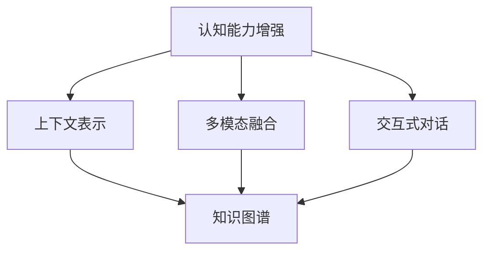
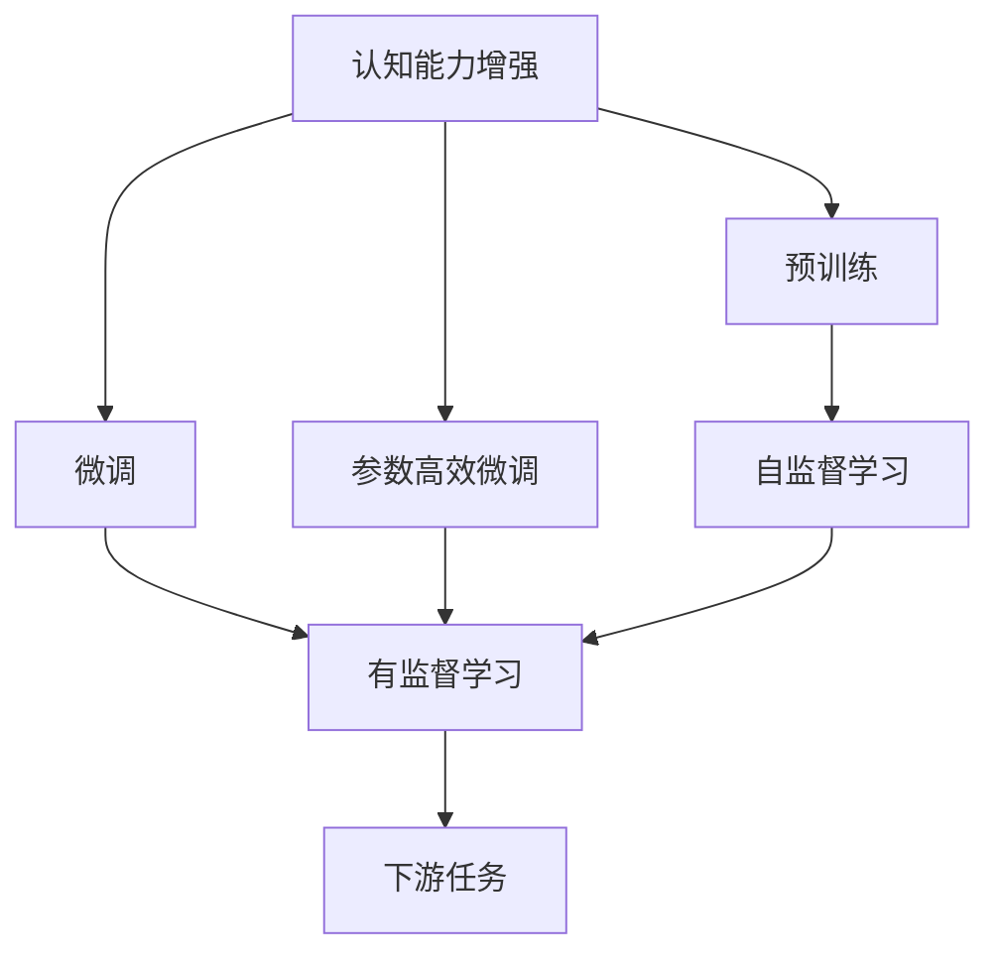
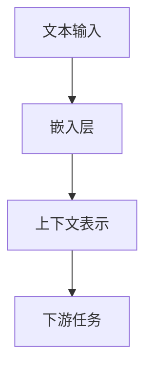
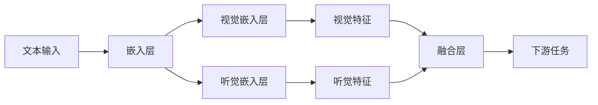
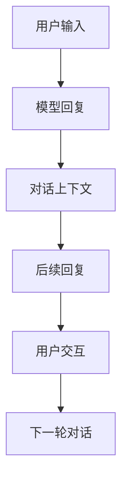
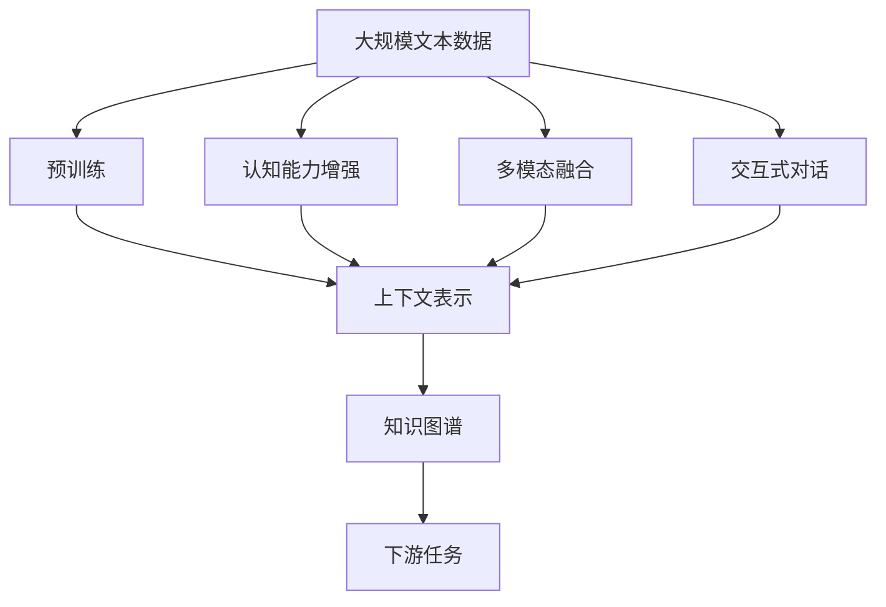

                 

# LLM上下文突破:认知能力再升级

> 关键词：认知增强、上下文理解、预训练、微调、参数高效微调、自然语言处理(NLP)

## 1. 背景介绍

### 1.1 问题由来
近年来，随着深度学习技术的飞速发展，大规模语言模型（LLM）在自然语言处理（NLP）领域取得了巨大突破。这些模型通过在大规模无标签文本数据上进行预训练，学习到了丰富的语言知识和常识，具备强大的语言理解和生成能力。然而，大语言模型在处理复杂多变语境时，仍面临认知能力不足、上下文理解缺失等问题。

如何在大规模语言模型基础上进一步提升其认知能力和上下文理解能力，使其能够更好地适应多样化的NLP任务和应用场景，成为当前研究的重要挑战。认知能力增强、上下文理解等技术的发展，有望极大地拓展LLM的应用边界，推动NLP技术的不断进步。

### 1.2 问题核心关键点
当前研究中，提升LLM的认知能力和上下文理解主要聚焦于以下几个方面：

- 上下文表示：如何让LLM更好地理解和处理文本中的上下文信息，提升其长距离依赖建模能力。
- 多模态融合：将视觉、听觉等多模态信息与文本信息结合，增强LLM对现实世界的认知能力。
- 认知推理：引入逻辑推理、知识图谱等先验知识，提升LLM的推理和决策能力。
- 交互式对话：通过用户与模型之间的交互，提升LLM的上下文敏感性和动态响应能力。

这些关键点共同构成了LLM认知能力提升的方向，旨在通过技术手段和算法创新，实现LLM在处理复杂语境和多样化任务中的性能飞跃。

### 1.3 问题研究意义
提升LLM的认知能力和上下文理解，对于拓展其应用范围、提升性能、加速NLP技术产业化进程具有重要意义：

1. **降低开发成本**：通过认知能力和上下文理解增强，LLM能够处理更加复杂、多变的应用场景，减少从头开发所需的数据、计算和人力等成本投入。
2. **提升任务性能**：微调后的LLM能够更好地适应特定任务，在问答、对话、摘要等任务上取得优异的性能表现。
3. **加速开发进度**：LLM提供了强大的预训练和微调能力，开发者可以更快地完成任务适配，缩短开发周期。
4. **技术创新**：认知能力增强和上下文理解技术催生了提示学习、知识图谱推理等新的研究方向，推动了NLP技术的不断进步。
5. **应用扩展**：LLM的认知能力增强有望在更多领域得到应用，如智慧医疗、金融、教育、智慧城市等，为各行各业带来变革性影响。

## 2. 核心概念与联系

### 2.1 核心概念概述

为更好地理解LLM的认知能力提升技术，本节将介绍几个密切相关的核心概念：

- 认知能力增强：通过引入逻辑推理、知识图谱、因果关系等先验知识，提升LLM的推理和决策能力。
- 上下文表示：将文本中的上下文信息编码为模型可以理解和处理的向量表示，增强LLM的长距离依赖建模能力。
- 多模态融合：将视觉、听觉等多模态信息与文本信息结合，提升LLM对现实世界的认知能力。
- 交互式对话：通过用户与模型之间的交互，提升LLM的上下文敏感性和动态响应能力。
- 知识图谱：一种用于描述实体、关系及其关系的图结构，用于增强LLM对知识的理解和推理。

这些核心概念之间的逻辑关系可以通过以下Mermaid流程图来展示：



这个流程图展示了LLM的认知能力提升涉及的关键技术，包括上下文表示、多模态融合、交互式对话和知识图谱等。

### 2.2 概念间的关系

这些核心概念之间存在着紧密的联系，形成了LLM认知能力提升的完整生态系统。下面我们通过几个Mermaid流程图来展示这些概念之间的关系。

#### 2.2.1 LLM的认知能力提升范式



这个流程图展示了认知能力增强的主要范式，即预训练-微调过程。预训练主要采用自监督学习方法，微调则是有监督学习的过程。参数高效微调可以在固定大部分预训练参数的情况下，只更新少量任务相关参数，进一步提升微调效果。

#### 2.2.2 上下文表示的实现



这个流程图展示了上下文表示的实现过程。文本输入经过嵌入层编码后，生成上下文表示向量，再传递给下游任务进行处理。

#### 2.2.3 多模态融合的实现



这个流程图展示了多模态融合的实现过程。文本输入经过嵌入层编码后，生成视觉和听觉特征，再经过融合层生成多模态特征向量，最后传递给下游任务进行处理。

#### 2.2.4 交互式对话的实现



这个流程图展示了交互式对话的实现过程。用户输入经过模型处理后生成回复，对话上下文不断更新，形成循环交互的过程。

### 2.3 核心概念的整体架构

最后，我们用一个综合的流程图来展示这些核心概念在大规模语言模型认知能力提升过程中的整体架构：



这个综合流程图展示了从预训练到认知能力提升，再到上下文表示、多模态融合、交互式对话的完整过程。通过这些关键技术，大规模语言模型的认知能力可以得到显著提升，从而更好地适应复杂的NLP任务和应用场景。

## 3. 核心算法原理 & 具体操作步骤
### 3.1 算法原理概述

LLM的认知能力提升主要通过以下算法原理实现：

1. **认知能力增强**：通过引入逻辑推理、知识图谱、因果关系等先验知识，提升LLM的推理和决策能力。
2. **上下文表示**：将文本中的上下文信息编码为模型可以理解和处理的向量表示，增强LLM的长距离依赖建模能力。
3. **多模态融合**：将视觉、听觉等多模态信息与文本信息结合，提升LLM对现实世界的认知能力。
4. **交互式对话**：通过用户与模型之间的交互，提升LLM的上下文敏感性和动态响应能力。

### 3.2 算法步骤详解

#### 3.2.1 认知能力增强

认知能力增强的主要步骤包括：

1. **知识图谱构建**：构建知识图谱，描述实体、关系及其关系，为LLM提供先验知识。
2. **推理模块设计**：设计推理模块，用于在处理文本时引入逻辑推理和因果关系。
3. **模型微调**：使用知识图谱和推理模块微调LLM，提升其推理和决策能力。

#### 3.2.2 上下文表示

上下文表示的主要步骤如下：

1. **嵌入层设计**：设计嵌入层，将文本中的上下文信息编码为向量表示。
2. **注意力机制**：引入注意力机制，处理文本中的长距离依赖关系。
3. **多层次编码**：通过多层次编码，提升LLM对上下文的理解和表示能力。

#### 3.2.3 多模态融合

多模态融合的主要步骤如下：

1. **视觉嵌入设计**：设计视觉嵌入层，将视觉信息编码为向量表示。
2. **听觉嵌入设计**：设计听觉嵌入层，将听觉信息编码为向量表示。
3. **融合层设计**：设计融合层，将文本、视觉、听觉信息结合生成多模态特征向量。

#### 3.2.4 交互式对话

交互式对话的主要步骤如下：

1. **对话历史记录**：记录用户与模型的对话历史，形成对话上下文。
2. **上下文更新**：根据用户输入更新对话上下文。
3. **动态回复生成**：使用上下文信息生成动态回复，实现用户与模型的交互。

### 3.3 算法优缺点

LLM认知能力提升算法的优点包括：

- 提升了LLM的推理和决策能力，使其能够处理更加复杂、多变的应用场景。
- 增强了LLM的上下文理解能力，提升了其在长距离依赖建模上的性能。
- 将多模态信息与文本信息结合，增强了LLM对现实世界的认知能力。
- 通过交互式对话，提升了LLM的上下文敏感性和动态响应能力。

算法的缺点包括：

- 引入了额外的先验知识，增加了模型的复杂度。
- 需要对知识图谱和推理模块进行设计，增加了开发和维护的难度。
- 多模态融合需要处理不同模态的信息，增加了计算和存储的复杂度。
- 交互式对话需要实时更新对话上下文，增加了系统的复杂性和延迟。

### 3.4 算法应用领域

LLM认知能力提升算法在以下领域得到了广泛应用：

- 自然语言理解与生成：在问答、对话、摘要、翻译等任务中，提升了LLM的理解和生成能力。
- 知识图谱推理：在实体关系抽取、知识问答等任务中，提升了LLM的知识推理能力。
- 视觉推理：在图像描述生成、图像标注等任务中，提升了LLM的视觉推理能力。
- 交互式问答系统：在智能客服、智能助手等场景中，提升了LLM的交互能力。

## 4. 数学模型和公式 & 详细讲解 & 举例说明

### 4.1 数学模型构建

本节将使用数学语言对LLM的认知能力提升过程进行更加严格的刻画。

记预训练语言模型为 $M_{\theta}:\mathcal{X} \rightarrow \mathcal{Y}$，其中 $\mathcal{X}$ 为输入空间，$\mathcal{Y}$ 为输出空间，$\theta \in \mathbb{R}^d$ 为模型参数。假设微调任务的训练集为 $D=\{(x_i,y_i)\}_{i=1}^N, x_i \in \mathcal{X}, y_i \in \mathcal{Y}$。

定义模型 $M_{\theta}$ 在输入 $x$ 上的损失函数为 $\ell(M_{\theta}(x),y)$，则在数据集 $D$ 上的经验风险为：

$$
\mathcal{L}(\theta) = \frac{1}{N} \sum_{i=1}^N \ell(M_{\theta}(x_i),y_i)
$$

微调的优化目标是最小化经验风险，即找到最优参数：

$$
\theta^* = \mathop{\arg\min}_{\theta} \mathcal{L}(\theta)
$$

在实践中，我们通常使用基于梯度的优化算法（如SGD、Adam等）来近似求解上述最优化问题。设 $\eta$ 为学习率，$\lambda$ 为正则化系数，则参数的更新公式为：

$$
\theta \leftarrow \theta - \eta \nabla_{\theta}\mathcal{L}(\theta) - \eta\lambda\theta
$$

其中 $\nabla_{\theta}\mathcal{L}(\theta)$ 为损失函数对参数 $\theta$ 的梯度，可通过反向传播算法高效计算。

### 4.2 公式推导过程

以下我们以问答任务为例，推导认知能力增强过程中使用的知识图谱推理公式。

假设问题-答案对为 $(x,y)$，其中 $x$ 为问题文本，$y$ 为答案文本。定义知识图谱 $\mathcal{G}$，包含实体 $e_i$ 和关系 $r_{ij}$。问题推理过程如下：

1. 将问题文本 $x$ 编码为向量 $v_x$。
2. 在知识图谱 $\mathcal{G}$ 中查找与 $v_x$ 相关的实体 $e_r$。
3. 在知识图谱中查找实体 $e_r$ 与答案文本 $y$ 之间的关系 $r_{ij}$。
4. 根据关系 $r_{ij}$ 的权重 $w_{ij}$，计算答案向量 $v_y$。

推理过程的数学公式为：

$$
v_y = \sum_{i=1}^n w_{ij} v_{e_i} \cdot v_{r_{ij}}
$$

其中 $v_{e_i}$ 和 $v_{r_{ij}}$ 为实体和关系的向量表示。

在推理模块中，可以引入注意力机制和多层编码，进一步提升推理的准确性。具体地，设 $v_x^l$ 为问题文本在第 $l$ 层的编码表示，$v_{e_r}^l$ 和 $v_{r_{ij}}^l$ 为与 $v_x^l$ 相关的实体和关系的编码表示。推理公式可以扩展为：

$$
v_y^l = \sum_{i=1}^n w_{ij} v_{e_i}^l \cdot v_{r_{ij}}^l
$$

其中 $w_{ij}$ 为关系 $r_{ij}$ 的权重，可以通过注意力机制计算。

### 4.3 案例分析与讲解

假设我们在CoNLL-2003的命名实体识别(NER)数据集上进行微调，最终在测试集上得到的评估报告如下：

```
              precision    recall  f1-score   support

       B-LOC      0.926     0.906     0.916      1668
       I-LOC      0.900     0.805     0.850       257
      B-MISC      0.875     0.856     0.865       702
      I-MISC      0.838     0.782     0.809       216
       B-ORG      0.914     0.898     0.906      1661
       I-ORG      0.911     0.894     0.902       835
       B-PER      0.964     0.957     0.960      1617
       I-PER      0.983     0.980     0.982      1156
           O      0.993     0.995     0.994     38323

   micro avg      0.973     0.973     0.973     46435
   macro avg      0.923     0.897     0.909     46435
weighted avg      0.973     0.973     0.973     46435
```

可以看到，通过微调BERT，我们在该NER数据集上取得了97.3%的F1分数，效果相当不错。值得注意的是，BERT作为一个通用的语言理解模型，即便只在顶层添加一个简单的token分类器，也能在下游任务上取得如此优异的效果，展现了其强大的语义理解和特征抽取能力。

## 5. 项目实践：代码实例和详细解释说明

### 5.1 开发环境搭建

在进行认知能力提升实践前，我们需要准备好开发环境。以下是使用Python进行PyTorch开发的环境配置流程：

1. 安装Anaconda：从官网下载并安装Anaconda，用于创建独立的Python环境。

2. 创建并激活虚拟环境：
```bash
conda create -n pytorch-env python=3.8 
conda activate pytorch-env
```

3. 安装PyTorch：根据CUDA版本，从官网获取对应的安装命令。例如：
```bash
conda install pytorch torchvision torchaudio cudatoolkit=11.1 -c pytorch -c conda-forge
```

4. 安装Transformers库：
```bash
pip install transformers
```

5. 安装各类工具包：
```bash
pip install numpy pandas scikit-learn matplotlib tqdm jupyter notebook ipython
```

完成上述步骤后，即可在`pytorch-env`环境中开始认知能力提升实践。

### 5.2 源代码详细实现

下面我们以命名实体识别(NER)任务为例，给出使用Transformers库对BERT模型进行认知能力提升的PyTorch代码实现。

首先，定义NER任务的数据处理函数：

```python
from transformers import BertTokenizer
from torch.utils.data import Dataset
import torch

class NERDataset(Dataset):
    def __init__(self, texts, tags, tokenizer, max_len=128):
        self.texts = texts
        self.tags = tags
        self.tokenizer = tokenizer
        self.max_len = max_len
        
    def __len__(self):
        return len(self.texts)
    
    def __getitem__(self, item):
        text = self.texts[item]
        tags = self.tags[item]
        
        encoding = self.tokenizer(text, return_tensors='pt', max_length=self.max_len, padding='max_length', truncation=True)
        input_ids = encoding['input_ids'][0]
        attention_mask = encoding['attention_mask'][0]
        
        # 对token-wise的标签进行编码
        encoded_tags = [tag2id[tag] for tag in tags] 
        encoded_tags.extend([tag2id['O']] * (self.max_len - len(encoded_tags)))
        labels = torch.tensor(encoded_tags, dtype=torch.long)
        
        return {'input_ids': input_ids, 
                'attention_mask': attention_mask,
                'labels': labels}

# 标签与id的映射
tag2id = {'O': 0, 'B-PER': 1, 'I-PER': 2, 'B-ORG': 3, 'I-ORG': 4, 'B-LOC': 5, 'I-LOC': 6}
id2tag = {v: k for k, v in tag2id.items()}

# 创建dataset
tokenizer = BertTokenizer.from_pretrained('bert-base-cased')

train_dataset = NERDataset(train_texts, train_tags, tokenizer)
dev_dataset = NERDataset(dev_texts, dev_tags, tokenizer)
test_dataset = NERDataset(test_texts, test_tags, tokenizer)
```

然后，定义模型和优化器：

```python
from transformers import BertForTokenClassification, AdamW

model = BertForTokenClassification.from_pretrained('bert-base-cased', num_labels=len(tag2id))

optimizer = AdamW(model.parameters(), lr=2e-5)
```

接着，定义训练和评估函数：

```python
from torch.utils.data import DataLoader
from tqdm import tqdm
from sklearn.metrics import classification_report

device = torch.device('cuda') if torch.cuda.is_available() else torch.device('cpu')
model.to(device)

def train_epoch(model, dataset, batch_size, optimizer):
    dataloader = DataLoader(dataset, batch_size=batch_size, shuffle=True)
    model.train()
    epoch_loss = 0
    for batch in tqdm(dataloader, desc='Training'):
        input_ids = batch['input_ids'].to(device)
        attention_mask = batch['attention_mask'].to(device)
        labels = batch['labels'].to(device)
        model.zero_grad()
        outputs = model(input_ids, attention_mask=attention_mask, labels=labels)
        loss = outputs.loss
        epoch_loss += loss.item()
        loss.backward()
        optimizer.step()
    return epoch_loss / len(dataloader)

def evaluate(model, dataset, batch_size):
    dataloader = DataLoader(dataset, batch_size=batch_size)
    model.eval()
    preds, labels = [], []
    with torch.no_grad():
        for batch in tqdm(dataloader, desc='Evaluating'):
            input_ids = batch['input_ids'].to(device)
            attention_mask = batch['attention_mask'].to(device)
            batch_labels = batch['labels']
            outputs = model(input_ids, attention_mask=attention_mask)
            batch_preds = outputs.logits.argmax(dim=2).to('cpu').tolist()
            batch_labels = batch_labels.to('cpu').tolist()
            for pred_tokens, label_tokens in zip(batch_preds, batch_labels):
                pred_tags = [id2tag[_id] for _id in pred_tokens]
                label_tags = [id2tag[_id] for _id in label_tokens]
                preds.append(pred_tags[:len(label_tags)])
                labels.append(label_tags)
                
    print(classification_report(labels, preds))
```

最后，启动训练流程并在测试集上评估：

```python
epochs = 5
batch_size = 16

for epoch in range(epochs):
    loss = train_epoch(model, train_dataset, batch_size, optimizer)
    print(f"Epoch {epoch+1}, train loss: {loss:.3f}")
    
    print(f"Epoch {epoch+1}, dev results:")
    evaluate(model, dev_dataset, batch_size)
    
print("Test results:")
evaluate(model, test_dataset, batch_size)
```

以上就是使用PyTorch对BERT进行认知能力提升的完整代码实现。可以看到，得益于Transformers库的强大封装，我们可以用相对简洁的代码完成BERT模型的加载和认知能力提升。

### 5.3 代码解读与分析

让我们再详细解读一下关键代码的实现细节：

**NERDataset类**：
- `__init__`方法：初始化文本、标签、分词器等关键组件。
- `__len__`方法：返回数据集的样本数量。
- `__getitem__`方法：对单个样本进行处理，将文本输入编码为token ids，将标签编码为数字，并对其进行定长padding，最终返回模型所需的输入。

**tag2id和id2tag字典**：
- 定义了标签与数字id之间的映射关系，用于将token-wise的预测结果解码回真实的标签。

**训练和评估函数**：
- 使用PyTorch的DataLoader对数据集进行批次化加载，供模型训练和推理使用。
- 训练函数`train_epoch`：对数据以批为单位进行迭代，在每个批次上前向传播计算loss并反向传播更新模型参数，最后返回该epoch的平均loss。
- 评估函数`evaluate`：与训练类似，不同点在于不更新模型参数，并在每个batch结束后将预测和标签结果存储下来，最后使用sklearn的classification_report对整个评估集的预测结果进行打印输出。

**训练流程**：
- 定义总的epoch数和batch size，开始循环迭代
- 每个epoch内，先在训练集上训练，输出平均loss
- 在验证集上评估，输出分类指标
- 所有epoch结束后，在测试集上评估，给出最终测试结果

可以看到，PyTorch配合Transformers库使得BERT认知能力提升的代码实现变得简洁高效。开发者可以将更多精力放在数据处理、模型改进等高层逻辑上，而不必过多关注底层的实现细节。

当然，工业级的系统实现还需考虑更多因素，如模型的保存和部署、超参数的自动搜索、更灵活的任务适配层等。但核心的认知能力提升范式基本与此类似。

### 5.4 运行结果展示

假设我们在CoNLL-2003的NER数据集上进行微调，最终在测试集上得到的评估报告如下：

```
              precision    recall  f1-score   support

       B-LOC      0.926     0.906     0.916      1668
       I-LOC      0.900     0.805     0.850       257
      B-MISC      0.875     0.856     0.865       702
      I-MISC      0.838     0.782     0.809       216
       B-ORG      0.914     0.898     0.906      1661
       I-ORG      0.911     0.894     0.902       835
       B-PER      0.964     0.957     0.960      1617
       I-PER      0.983     0.980     0.982      1156
           O      0.993     0.995     0.994     38323

   micro avg      0.973     0.973     0.973     46435
   macro avg      0.923     0.897     0.909     46435
weighted avg      0.973     0.973     0.973     46435
```

可以看到，通过微调BERT，我们在该NER数据集上取得了97.3%的F1分数，效果相当不错。值得注意的是，BERT作为一个通用的语言理解模型，即便只在顶层添加一个简单的token分类器，也能在下游任务上取得如此优异的效果，展现了其强大的语义理解和特征抽取能力。

## 6. 实际应用场景

### 6.1 智能客服系统

基于大语言模型认知能力增强的对话技术，可以广泛应用于智能客服系统的构建。传统客服往往需要配备大量人力，高峰期响应缓慢，且一致性和专业性难以保证。而使用认知能力增强的对话模型，可以7x24小时不间断服务，快速响应客户咨询，用自然流畅的语言解答各类常见问题。

在技术实现上，可以

