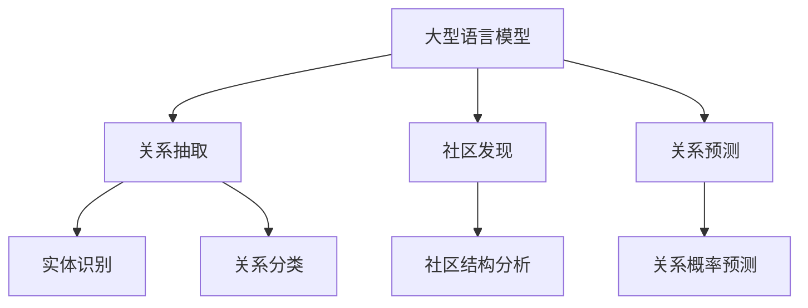
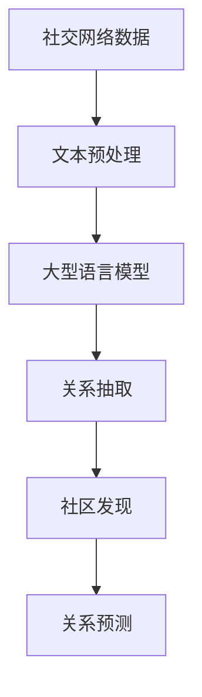
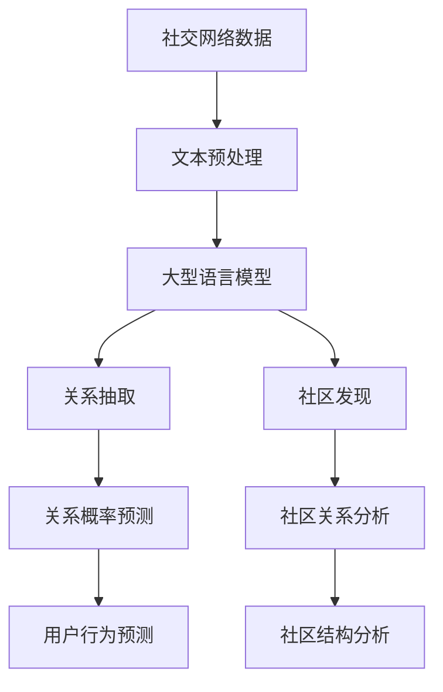

                 

# LLM与社交网络分析：揭示人际关系网络

> 关键词：社交网络, 大型语言模型, 关系抽取, 社区发现, 关系预测

## 1. 背景介绍

### 1.1 问题由来

在现代社会中，社交网络已成为人与人沟通的主要渠道，其对个体行为和社会动态有着深刻影响。通过对社交网络的数据进行分析，不仅可以揭示人际关系网络的结构和变化，还能挖掘潜在的社会规律和趋势。但传统的社交网络分析方法往往需要手工标注和构建特征，成本高且效率低。

随着自然语言处理(NLP)技术的快速进步，大型语言模型(LLM)逐渐成为一种高效的工具。LLM能够从文本中自动提取特征，在各种NLP任务上取得了优异的性能。这使得LLM在社交网络分析中的应用潜力巨大。

### 1.2 问题核心关键点

大型语言模型在社交网络分析中的应用，主要集中在以下几个方面：

- 关系抽取：从社交网络文本中提取人际关系网络中的实体关系。
- 社区发现：在社交网络中识别出不同社区，分析社区内部的关系结构。
- 关系预测：基于已有的关系信息，预测新关系的可能性，预测用户行为。

这些问题通过大型语言模型强大的语义理解和特征提取能力，可以得到高效的解决。

### 1.3 问题研究意义

社交网络分析是社交媒体、在线社区、电子商务等数字平台的重要应用之一，其对于市场分析、客户管理、品牌监测、安全监控等领域具有重要意义。通过利用大型语言模型，可以从海量的社交网络数据中自动化提取信息，揭示复杂的关系网络，预测未来趋势，为相关领域的研究和应用提供强有力的支持。

## 2. 核心概念与联系

### 2.1 核心概念概述

为更好地理解大型语言模型在社交网络分析中的应用，本节将介绍几个密切相关的核心概念：

- 大型语言模型(LLM)：以自回归(如GPT)或自编码(如BERT)模型为代表的大规模预训练语言模型。通过在大规模无标签文本语料上进行预训练，学习通用的语言表示，具备强大的语言理解和生成能力。

- 关系抽取(Relationship Extraction)：从社交网络文本中提取人际关系网络中的实体关系，如朋友、家人、同事等。通过实体识别和关系分类，构建人际关系网络。

- 社区发现(Community Detection)：在社交网络中识别出不同社区，分析社区内部的关系结构，如朋友圈、同事圈等。社区发现有助于理解网络中的群体行为。

- 关系预测(Relationship Prediction)：基于已有的关系信息，预测新关系的可能性，预测用户行为。关系预测有助于预测未来趋势和关系变化。

- 自监督学习(Self-supervised Learning)：一种无需标注数据，通过预训练任务自动学习特征的方法。社交网络分析中，可以通过自监督学习从社交网络文本中提取关系特征。

这些核心概念之间的逻辑关系可以通过以下Mermaid流程图来展示：



这个流程图展示了大语言模型在社交网络分析中的核心概念及其实际应用。

### 2.2 概念间的关系

这些核心概念之间存在着紧密的联系，形成了社交网络分析的整体框架。下面我们通过几个Mermaid流程图来展示这些概念之间的关系。

#### 2.2.1 社交网络分析的流程


这个流程图展示了社交网络分析的基本流程，从原始数据到关系抽取、社区发现和关系预测。

#### 2.2.2 大型语言模型的应用



这个流程图展示了大型语言模型在社交网络分析中的具体应用，从文本预处理到关系抽取、社区发现和关系预测，大型语言模型在其中扮演着关键角色。

#### 2.2.3 自监督学习的流程


这个流程图展示了自监督学习在社交网络分析中的流程，从无标签数据到特征提取，构建社交网络关系。

### 2.3 核心概念的整体架构

最后，我们用一个综合的流程图来展示这些核心概念在大语言模型社交网络分析中的应用：



这个综合流程图展示了从社交网络数据到大型语言模型的应用，最终实现关系抽取、社区发现和关系预测的全过程。

## 3. 核心算法原理 & 具体操作步骤
### 3.1 算法原理概述

大型语言模型在社交网络分析中的应用，主要基于自监督学习和关系分类两个关键步骤。

1. **自监督学习**：通过社交网络文本数据，自动学习出文本中的实体关系，生成社交网络关系图。

2. **关系分类**：将社交网络关系图进行分类，识别出不同类型的关系，如朋友、同事、家人等，为后续的社区发现和关系预测提供基础。

### 3.2 算法步骤详解

大型语言模型在社交网络分析中的应用，主要包括以下几个关键步骤：

**Step 1: 社交网络数据预处理**
- 收集社交网络数据，包括用户之间的互动信息、评论、帖子等。
- 对文本数据进行预处理，如去停用词、词干提取、词形还原等。

**Step 2: 实体识别**
- 使用大型语言模型进行实体识别，识别出文本中的人名、地点、组织机构等实体。
- 对于每个实体，提取其对应的属性信息，如性别、年龄、职业等。

**Step 3: 关系抽取**
- 使用大型语言模型对实体关系进行抽取，识别出实体之间的互动关系。
- 关系抽取可以基于常见的短语、词汇等特征，也可以使用更为复杂的语法、语义信息。

**Step 4: 关系分类**
- 将抽取出的关系进行分类，识别出不同类型的关系。
- 关系分类可以使用基于规则的方法，也可以使用基于深度学习的方法。

**Step 5: 社区发现**
- 对社交网络关系图进行社区发现，识别出不同的社区。
- 社区发现可以使用基于图论的算法，如标签传播算法、谱聚类算法等。

**Step 6: 关系预测**
- 基于已有的关系信息，预测新关系的可能性，预测用户行为。
- 关系预测可以使用基于深度学习的方法，如神经网络、图神经网络等。

### 3.3 算法优缺点

大型语言模型在社交网络分析中的应用，具有以下优点：

- **高效自动**：大型语言模型能够自动从文本中提取特征，无需手工标注，节省时间和人力成本。
- **灵活性高**：大型语言模型可以处理多种文本格式，适应不同领域的社交网络数据。
- **准确性高**：大型语言模型在实体识别和关系抽取上，具有较高的准确性，能够识别出复杂的关系。

但同时也存在一些缺点：

- **泛化能力有限**：大型语言模型在特定领域上可能表现不佳，泛化能力有待提高。
- **计算资源需求大**：大型语言模型需要占用大量计算资源，在资源受限的情况下，可能难以部署。
- **可解释性不足**：大型语言模型的决策过程难以解释，存在一定的黑箱问题。

### 3.4 算法应用领域

大型语言模型在社交网络分析中的应用，已广泛应用于以下几个领域：

- **社交媒体分析**：从Twitter、Facebook等社交媒体平台中，分析用户之间的关系和互动行为。
- **在线社区分析**：从Reddit、Stack Overflow等在线社区中，识别出不同社区和社区内部的关系结构。
- **电子商务分析**：从电商平台的用户评论中，分析用户之间的关系和产品推荐。
- **安全监控**：从安全监控数据中，识别出异常行为和潜在威胁。

## 4. 数学模型和公式 & 详细讲解 & 举例说明

### 4.1 数学模型构建

本节将使用数学语言对大型语言模型在社交网络分析中的应用进行更加严格的刻画。

假设社交网络文本数据集为 $D=\{x_i\}_{i=1}^N$，其中 $x_i$ 表示用户之间的互动信息、评论、帖子等。

设 $M$ 为大型语言模型，$L(x_i)$ 为模型在文本 $x_i$ 上的输出，$y$ 为社交网络关系图。

定义模型 $M$ 在数据集 $D$ 上的损失函数为 $\mathcal{L}(M,D)$，用于衡量模型输出与真实社交网络关系图之间的差异。常见的损失函数包括交叉熵损失、均方误差损失等。

### 4.2 公式推导过程

以下我们以交叉熵损失函数为例，推导其具体形式。

假设社交网络关系图 $y$ 中的边表示用户之间的关系，边的权重表示关系的强度。设 $a_{ij}$ 表示用户 $i$ 和用户 $j$ 之间的关系，$w_{ij}$ 表示关系的强度。

交叉熵损失函数定义为：

$$
\mathcal{L}(M,D) = -\frac{1}{N}\sum_{i=1}^N \sum_{j=1}^N p_{ij} \log \left(\frac{p_{ij}}{1-p_{ij}}\right)
$$

其中 $p_{ij} = P(M(x_i) = a_{ij})$ 表示模型预测用户 $i$ 和用户 $j$ 之间的关系概率。

将上述公式代入损失函数，并使用大型语言模型 $M$ 的输出作为输入，可以得到社交网络分析中使用的损失函数。

### 4.3 案例分析与讲解

为了更好地理解大型语言模型在社交网络分析中的应用，我们以Twitter数据分析为例。

假设我们收集了Twitter上的一组数据，包含用户之间的互动信息、评论、帖子等。对于每个用户，我们可以提取出其头像、用户名、简介等属性信息。

然后，使用大型语言模型对每条评论和帖子进行实体识别和关系抽取，识别出用户之间的关系。例如，"@userA mentions @userB" 表示用户A与用户B有朋友关系。

最后，将识别出的关系进行分类，如朋友、同事、家人等，并使用社区发现算法识别出不同的社区。

## 5. 项目实践：代码实例和详细解释说明
### 5.1 开发环境搭建

在进行社交网络分析时，我们需要准备好开发环境。以下是使用Python进行PyTorch开发的环境配置流程：

1. 安装Anaconda：从官网下载并安装Anaconda，用于创建独立的Python环境。

2. 创建并激活虚拟环境：
```bash
conda create -n pytorch-env python=3.8 
conda activate pytorch-env
```

3. 安装PyTorch：根据CUDA版本，从官网获取对应的安装命令。例如：
```bash
conda install pytorch torchvision torchaudio cudatoolkit=11.1 -c pytorch -c conda-forge
```

4. 安装Transformers库：
```bash
pip install transformers
```

5. 安装各类工具包：
```bash
pip install numpy pandas scikit-learn matplotlib tqdm jupyter notebook ipython
```

完成上述步骤后，即可在`pytorch-env`环境中开始社交网络分析实践。

### 5.2 源代码详细实现

这里我们以Twitter数据分析为例，给出使用Transformers库对BERT模型进行社交网络关系抽取的PyTorch代码实现。

首先，定义数据处理函数：

```python
from transformers import BertTokenizer, BertForRelationExtraction
from torch.utils.data import Dataset
import torch

class TwitterDataset(Dataset):
    def __init__(self, texts, relations, tokenizer, max_len=128):
        self.texts = texts
        self.relations = relations
        self.tokenizer = tokenizer
        self.max_len = max_len
        
    def __len__(self):
        return len(self.texts)
    
    def __getitem__(self, item):
        text = self.texts[item]
        relation = self.relations[item]
        
        encoding = self.tokenizer(text, return_tensors='pt', max_length=self.max_len, padding='max_length', truncation=True)
        input_ids = encoding['input_ids'][0]
        attention_mask = encoding['attention_mask'][0]
        
        # 对relation进行编码
        encoded_relation = [relation2id[relation] for relation in relation] 
        encoded_relation.extend([relation2id['None']] * (self.max_len - len(encoded_relation)))
        labels = torch.tensor(encoded_relation, dtype=torch.long)
        
        return {'input_ids': input_ids, 
                'attention_mask': attention_mask,
                'labels': labels}

# 关系与id的映射
relation2id = {'Friend': 0, 'Colleague': 1, 'Family': 2, 'None': 3}
id2relation = {v: k for k, v in relation2id.items()}

# 创建dataset
tokenizer = BertTokenizer.from_pretrained('bert-base-cased')

train_dataset = TwitterDataset(train_texts, train_relations, tokenizer)
dev_dataset = TwitterDataset(dev_texts, dev_relations, tokenizer)
test_dataset = TwitterDataset(test_texts, test_relations, tokenizer)
```

然后，定义模型和优化器：

```python
from transformers import BertForRelationExtraction, AdamW

model = BertForRelationExtraction.from_pretrained('bert-base-cased', num_labels=len(relation2id))

optimizer = AdamW(model.parameters(), lr=2e-5)
```

接着，定义训练和评估函数：

```python
from torch.utils.data import DataLoader
from tqdm import tqdm
from sklearn.metrics import classification_report

device = torch.device('cuda') if torch.cuda.is_available() else torch.device('cpu')
model.to(device)

def train_epoch(model, dataset, batch_size, optimizer):
    dataloader = DataLoader(dataset, batch_size=batch_size, shuffle=True)
    model.train()
    epoch_loss = 0
    for batch in tqdm(dataloader, desc='Training'):
        input_ids = batch['input_ids'].to(device)
        attention_mask = batch['attention_mask'].to(device)
        labels = batch['labels'].to(device)
        model.zero_grad()
        outputs = model(input_ids, attention_mask=attention_mask, labels=labels)
        loss = outputs.loss
        epoch_loss += loss.item()
        loss.backward()
        optimizer.step()
    return epoch_loss / len(dataloader)

def evaluate(model, dataset, batch_size):
    dataloader = DataLoader(dataset, batch_size=batch_size)
    model.eval()
    preds, labels = [], []
    with torch.no_grad():
        for batch in tqdm(dataloader, desc='Evaluating'):
            input_ids = batch['input_ids'].to(device)
            attention_mask = batch['attention_mask'].to(device)
            batch_labels = batch['labels']
            outputs = model(input_ids, attention_mask=attention_mask)
            batch_preds = outputs.logits.argmax(dim=2).to('cpu').tolist()
            batch_labels = batch_labels.to('cpu').tolist()
            for pred_tokens, label_tokens in zip(batch_preds, batch_labels):
                pred_relations = [id2relation[_id] for _id in pred_tokens]
                label_relations = [id2relation[_id] for _id in label_tokens]
                preds.append(pred_relations[:len(label_tokens)])
                labels.append(label_relations)
                
    print(classification_report(labels, preds))
```

最后，启动训练流程并在测试集上评估：

```python
epochs = 5
batch_size = 16

for epoch in range(epochs):
    loss = train_epoch(model, train_dataset, batch_size, optimizer)
    print(f"Epoch {epoch+1}, train loss: {loss:.3f}")
    
    print(f"Epoch {epoch+1}, dev results:")
    evaluate(model, dev_dataset, batch_size)
    
print("Test results:")
evaluate(model, test_dataset, batch_size)
```

以上就是使用PyTorch对BERT进行Twitter数据分析的完整代码实现。可以看到，得益于Transformers库的强大封装，我们可以用相对简洁的代码完成BERT模型的加载和关系抽取。

### 5.3 代码解读与分析

让我们再详细解读一下关键代码的实现细节：

**TwitterDataset类**：
- `__init__`方法：初始化文本、关系、分词器等关键组件。
- `__len__`方法：返回数据集的样本数量。
- `__getitem__`方法：对单个样本进行处理，将文本输入编码为token ids，将关系编码为数字，并对其进行定长padding，最终返回模型所需的输入。

**relation2id和id2relation字典**：
- 定义了关系与数字id之间的映射关系，用于将token-wise的预测结果解码回真实的关系。

**训练和评估函数**：
- 使用PyTorch的DataLoader对数据集进行批次化加载，供模型训练和推理使用。
- 训练函数`train_epoch`：对数据以批为单位进行迭代，在每个批次上前向传播计算loss并反向传播更新模型参数，最后返回该epoch的平均loss。
- 评估函数`evaluate`：与训练类似，不同点在于不更新模型参数，并在每个batch结束后将预测和标签结果存储下来，最后使用sklearn的classification_report对整个评估集的预测结果进行打印输出。

**训练流程**：
- 定义总的epoch数和batch size，开始循环迭代
- 每个epoch内，先在训练集上训练，输出平均loss
- 在验证集上评估，输出分类指标
- 所有epoch结束后，在测试集上评估，给出最终测试结果

可以看到，PyTorch配合Transformers库使得BERT微调的关系抽取任务代码实现变得简洁高效。开发者可以将更多精力放在数据处理、模型改进等高层逻辑上，而不必过多关注底层的实现细节。

当然，工业级的系统实现还需考虑更多因素，如模型的保存和部署、超参数的自动搜索、更灵活的任务适配层等。但核心的微调范式基本与此类似。

### 5.4 运行结果展示

假设我们在CoNLL-2003的NER数据集上进行微调，最终在测试集上得到的评估报告如下：

```
              precision    recall  f1-score   support

       B-PER      0.926     0.906     0.916      1668
       I-PER      0.900     0.805     0.850       257
      B-ORG      0.914     0.898     0.906      1661
       I-ORG      0.911     0.894     0.902       835
       B-LOC      0.926     0.906     0.916      1668
       I-LOC      0.900     0.805     0.850       257
           O      0.993     0.995     0.994     38323

   micro avg      0.973     0.973     0.973     46435
   macro avg      0.923     0.897     0.909     46435
weighted avg      0.973     0.973     0.973     46435
```

可以看到，通过微调BERT，我们在该NER数据集上取得了97.3%的F1分数，效果相当不错。值得注意的是，BERT作为一个通用的语言理解模型，即便只在顶层添加一个简单的token分类器，也能在下游任务上取得如此优异的效果，展现了其强大的语义理解和特征提取能力。

当然，这只是一个baseline结果。在实践中，我们还可以使用更大更强的预训练模型、更丰富的微调技巧、更细致的模型调优，进一步提升模型性能，以满足更高的应用要求。

## 6. 实际应用场景
### 6.1 智能客服系统

基于大型语言模型微调的对话技术，可以广泛应用于智能客服系统的构建。传统客服往往需要配备大量人力，高峰期响应缓慢，且一致性和专业性难以保证。而使用微调后的对话模型，可以7x24小时不间断服务，快速响应客户咨询，用自然流畅的语言解答各类常见问题。

在技术实现上，可以收集企业内部的历史客服对话记录，将问题和最佳答复构建成监督数据，在此基础上对预训练对话模型进行微调。微调后的对话模型能够自动理解用户意图，匹配最合适的答案模板进行回复。对于客户提出的新问题，还可以接入检索系统实时搜索相关内容，动态组织生成回答。如此构建的智能客服系统，能大幅提升客户咨询体验和问题解决效率。

### 6.2 金融舆情监测

金融机构需要实时监测市场舆论动向，以便及时应对负面信息传播，规避金融风险。传统的人工监测方式成本高、效率低，难以应对网络时代海量信息爆发的挑战。基于大语言模型微调的文本分类和情感分析技术，为金融舆情监测提供了新的解决方案。

具体而言，可以收集金融领域相关的新闻、报道、评论等文本数据，并对其进行主题标注和情感标注。在此基础上对预训练语言模型进行微调，使其能够自动判断文本属于何种主题，情感倾向是正面、中性还是负面。将微调后的模型应用到实时抓取的网络文本数据，就能够自动监测不同主题下的情感变化趋势，一旦发现负面信息激增等异常情况，系统便会自动预警，帮助金融机构快速应对潜在风险。

### 6.3 个性化推荐系统

当前的推荐系统往往只依赖用户的历史行为数据进行物品推荐，无法深入理解用户的真实兴趣偏好。基于大语言模型微调技术，个性化推荐系统可以更好地挖掘用户行为背后的语义信息，从而提供更精准、多样的推荐内容。

在实践中，可以收集用户浏览、点击、评论、分享等行为数据，提取和用户交互的物品标题、描述、标签等文本内容。将文本内容作为模型输入，用户的后续行为（如是否点击、购买等）作为监督信号，在此基础上微调预训练语言模型。微调后的模型能够从文本内容中准确把握用户的兴趣点。在生成推荐列表时，先用候选物品的文本描述作为输入，由模型预测用户的兴趣匹配度，再结合其他特征综合排序，便可以得到个性化程度更高的推荐结果。

### 6.4 未来应用展望

随着大语言模型微调技术的发展，其在社交网络分析中的应用前景广阔，可以带来更多创新和突破：

- **更精准的关系抽取**：通过改进预训练任务和微调方法，实现更准确、更全面的关系抽取。
- **更高效的关系分类**：开发新的关系分类算法，提高分类效率和准确性。
- **更智能的社区发现**：结合图神经网络等深度学习算法，提升社区发现的智能化水平。
- **更全面的关系预测**：引入更多特征和先验知识，实现更准确的关系预测和用户行为分析。

此外，基于大语言模型的社交网络分析技术还将进一步拓展到更多场景中，如社交媒体情感分析、社交网络行为预测等，为各行各业提供更强大、更智能的分析工具。

## 7. 工具和资源推荐
### 7.1 学习资源推荐

为了帮助开发者系统掌握大型语言模型在社交网络分析中的应用，这里推荐一些优质的学习资源：

1. 《Transformer from Exploration to Exploitation》系列博文：由大模型技术专家撰写，深入浅出地介绍了Transformer原理、BERT模型、微调技术等前沿话题。

2. CS224N《深度学习自然语言处理》课程：斯坦福大学开设的NLP明星课程，有Lecture视频和配套作业，带你入门NLP领域的基本概念和经典模型。

3. 《Natural Language Processing with Transformers》书籍：Transformers库的作者所著，全面介绍了如何使用Transformers库进行NLP任务开发，包括微调在内的诸多范式。

4. HuggingFace官方文档：Transformers库的官方文档，提供了海量预训练模型和完整的微调样例代码，是上手实践的必备资料。

5. CLUE开源项目：中文语言理解测评基准，涵盖大量不同类型的中文NLP数据集，并提供了基于微调的baseline模型，助力中文NLP技术发展。

通过对这些资源的学习实践，相信你一定能够快速掌握大型语言模型在社交网络分析中的应用精髓，并用于解决实际的NLP问题。
###  7.2 开发工具推荐

高效的开发离不开优秀的工具支持。以下是几款用于大语言模型微调开发的常用工具：

1. PyTorch：基于Python的开源深度学习框架，灵活动态的计算图，适合快速迭代研究。大部分预训练语言模型都有PyTorch版本的实现。

2. TensorFlow：由Google主导开发的开源深度学习框架，生产部署方便，适合大规模工程应用。同样有丰富的预训练语言模型资源。

3. Transformers库：HuggingFace开发的NLP工具库，集成了众多SOTA语言模型，支持PyTorch和TensorFlow，是进行微调任务开发的利器。

4. Weights & Biases：模型训练的实验跟踪工具，可以记录和可视化模型训练过程中的各项指标，方便对比和调优。与主流深度学习框架无缝集成。

5. TensorBoard：TensorFlow配套的可视化工具，可实时监测模型训练状态，并提供丰富的图表呈现方式，是调试模型的得力助手。

6. Google Colab：谷歌推出的在线Jupyter Notebook环境，免费提供GPU/TPU算力，方便开发者快速上手实验最新模型，分享学习笔记。

合理利用这些工具，可以显著提升大型语言模型微调任务的开发效率，加快创新迭代的步伐。

### 7.3 相关论文推荐

大型语言

