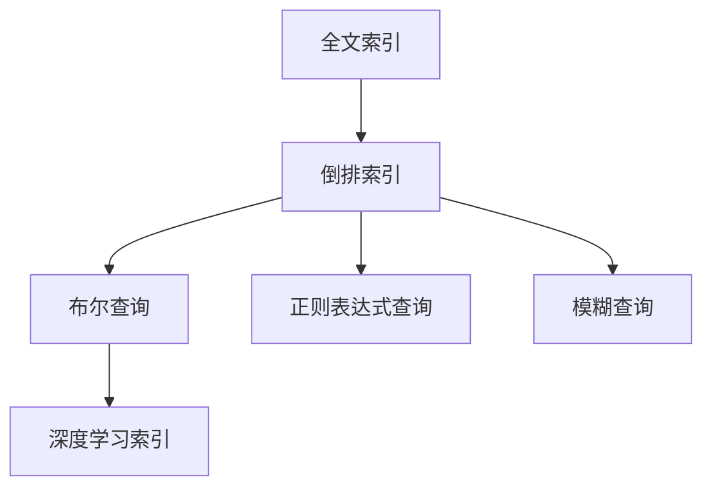
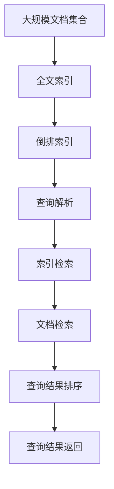

                 

# Lucene搜索原理与代码实例讲解

> 关键词： Lucene, 倒排索引, 全文搜索引擎, 布尔查询, 正则表达式查询, 模糊查询, 深度学习索引, 代码实例, 性能优化, 多线程查询

## 1. 背景介绍

### 1.1 问题由来
随着互联网和数字化时代的到来，数据的存储和检索变得越来越重要。传统的搜索引擎如Google、Bing等，虽然功能强大，但它们对硬件资源的需求极高，且开发难度大，部署和维护成本高昂。因此，开源社区孕育出了一系列优秀的全文搜索引擎，如Lucene、Elasticsearch、Solr等，这些搜索引擎以轻量级、易用性著称，得到了广泛应用。

### 1.2 问题核心关键点
Lucene是一个高性能、可扩展的全文搜索引擎库，旨在为各种应用提供快速的文档检索功能。其核心技术是倒排索引(Inverted Index)，通过将每个词与其在文档中出现的位置映射，实现快速的文档查找和匹配。Lucene支持布尔查询、正则表达式查询、模糊查询等多种查询方式，同时提供了多种分词器和文本分析工具，可以适应不同的语言和应用场景。

## 2. 核心概念与联系

### 2.1 核心概念概述

为更好地理解Lucene的搜索原理，本节将介绍几个密切相关的核心概念：

- **全文索引**：将文档转化为词-文档的映射关系，以便快速定位和检索。
- **倒排索引**：通过将每个词与其在文档中出现的位置进行映射，构建索引。倒排索引是Lucene的核心技术。
- **布尔查询**：通过逻辑与、或、非等操作符，构建复杂的查询条件。
- **正则表达式查询**：使用正则表达式，实现更灵活的文本匹配。
- **模糊查询**：通过编辑距离等算法，实现近似匹配。
- **深度学习索引**：利用深度学习技术，提升索引的质量和检索效率。

这些核心概念之间的逻辑关系可以通过以下Mermaid流程图来展示：



这个流程图展示了一系列搜索技术在Lucene中的演变过程，从基本的全文索引，到高级的倒排索引、布尔查询、正则表达式查询和模糊查询，最终通过深度学习技术进一步优化。通过理解这些核心概念，我们可以更好地把握Lucene的工作原理和优化方向。

### 2.2 概念间的关系

这些核心概念之间存在着紧密的联系，形成了Lucene搜索技术的完整生态系统。下面我通过几个Mermaid流程图来展示这些概念之间的关系。

#### 2.2.1 Lucene搜索技术架构


这个流程图展示了Lucene搜索技术的总体架构，从用户查询开始，经过查询解析、索引搜索、文档检索、查询结果排序和返回等步骤，最终提供给用户搜索结果。

#### 2.2.2 倒排索引与查询执行流程


这个流程图展示了Lucene在处理查询时的具体流程，从查询解析开始，到倒排索引检索、文档检索、查询结果排序和返回等步骤，最终提供给用户搜索结果。

#### 2.2.3 深度学习索引的集成


这个流程图展示了Lucene中深度学习索引的集成流程，从深度学习模型的训练开始，到索引集成、查询解析、深度学习索引检索、查询结果排序和返回等步骤，最终提供给用户搜索结果。

### 2.3 核心概念的整体架构

最后，我们用一个综合的流程图来展示这些核心概念在大规模文档检索中的应用：



这个综合流程图展示了从大规模文档集合到查询结果返回的全过程，涉及全文索引、倒排索引、查询解析、索引检索、文档检索、查询结果排序和返回等关键步骤。通过这些流程图，我们可以更清晰地理解Lucene的搜索原理和执行流程。

## 3. 核心算法原理 & 具体操作步骤
### 3.1 算法原理概述

Lucene的核心算法是倒排索引，其原理是通过将每个词与其在文档中出现的位置进行映射，构建索引。具体步骤如下：

1. **分词和词频统计**：将文档中的单词进行分词，并统计每个单词出现的次数。
2. **构建倒排列表**：为每个单词创建一个倒排列表，记录其在文档中出现的位置。
3. **倒排索引构建**：将每个单词的倒排列表合并，构建倒排索引。

### 3.2 算法步骤详解

Lucene倒排索引的构建过程可以分为以下几个关键步骤：

1. **分词**：将文档中的单词进行分词，通常使用基于正则表达式的分词器。
2. **词频统计**：统计每个单词在文档中出现的次数，通常使用HashMap或Trie树结构。
3. **倒排列表构建**：为每个单词创建一个倒排列表，记录其在文档中出现的位置。
4. **倒排索引构建**：将每个单词的倒排列表合并，构建倒排索引。
5. **查询解析**：对用户输入的查询进行解析，将其转化为倒排索引可以处理的格式。
6. **索引检索**：根据查询词在倒排索引中查找匹配的文档位置。
7. **文档检索**：根据文档位置，从文档集合中读取文档内容。
8. **查询结果排序**：对检索到的文档进行排序，通常使用相关性排序算法。
9. **查询结果返回**：将排序后的文档列表返回给用户。

### 3.3 算法优缺点

Lucene倒排索引具有以下优点：

- **高效检索**：倒排索引可以快速定位文档中每个词的位置，从而实现快速的文档检索。
- **灵活查询**：Lucene支持布尔查询、正则表达式查询、模糊查询等多种查询方式，满足不同应用需求。
- **可扩展性**：Lucene可以构建大规模索引，处理海量文档集合。

同时，倒排索引也存在一些缺点：

- **内存占用高**：倒排索引需要占用大量内存空间存储每个词的倒排列表。
- **索引构建耗时长**：在大规模文档集合上构建倒排索引需要较长时间，且随着文档数量的增加，构建时间呈指数级增长。
- **查询效率受限**：查询效率受限于倒排索引的构建质量，倒排索引的构建效果不佳会导致查询效率下降。

### 3.4 算法应用领域

Lucene的应用领域非常广泛，包括但不限于以下方面：

- **搜索引擎**：构建搜索引擎系统，提供全文搜索和文档检索功能。
- **文档管理系统**：构建文档管理系统，实现文档的存储、检索和管理。
- **信息检索**：在新闻、媒体、科研等领域实现信息检索和文档推荐。
- **数据分析**：从大规模文本数据中提取关键信息，进行数据分析和挖掘。
- **个性化推荐**：根据用户历史行为和兴趣，实现个性化文档推荐。

## 4. 数学模型和公式 & 详细讲解
### 4.1 数学模型构建

Lucene的数学模型基于倒排索引和相关性排序算法构建。以下是一个简单的数学模型框架：

设文档集合为 $D$，查询词为 $q$，倒排索引为 $I$，文档与查询词的相关性评分为 $r$。查询解析器将查询词 $q$ 转化为查询表达式 $Q$，然后使用倒排索引 $I$ 查找所有包含查询词的文档位置，计算每个文档与查询词的相关性评分，最终根据相关性评分排序，返回文档列表。

### 4.2 公式推导过程

以下我们以布尔查询为例，推导查询表达式与文档相关性评分的计算公式。

假设查询表达式为 $Q=\text{doc1} \land \text{doc2} \land \text{not doc3}$，其中 $\text{doc}_i$ 表示文档 $i$，$\land$ 表示逻辑与，$\neg$ 表示逻辑非。设 $d$ 表示文档 $d$，其包含的查询词集为 $q_d$，查询词 $q$ 在文档 $d$ 中的出现次数为 $t_{dq}$。则查询表达式 $Q$ 与文档 $d$ 的相关性评分 $r_d$ 可以表示为：

$$
r_d = \left( \prod_{q_i \in q_d} t_{dq_i} \right) \times \left( \prod_{q_i \in q} \left(1 - \sum_{d_j \in D} t_{d_jq_i} \right) \right)
$$

其中 $\prod$ 表示连乘，$\sum$ 表示求和。

将查询表达式 $Q$ 与文档 $d$ 的相关性评分 $r_d$ 带入排序算法中，即可实现文档的相关性排序。

### 4.3 案例分析与讲解

假设我们有一个包含以下文档的文档集合 $D$：

- 文档 $d_1$：Lucene是一个高性能、可扩展的全文搜索引擎库，旨在为各种应用提供快速的文档检索功能。
- 文档 $d_2$：其核心技术是倒排索引(Inverted Index)，通过将每个词与其在文档中出现的位置映射，实现快速的文档查找和匹配。
- 文档 $d_3$：Lucene支持布尔查询、正则表达式查询、模糊查询等多种查询方式，同时提供了多种分词器和文本分析工具，可以适应不同的语言和应用场景。
- 文档 $d_4$：在传统搜索引擎如Google、Bing等的基础上，Lucene具有更灵活、更强大的功能，支持大规模索引、多语言分词、近义词替换、搜索提示等功能。
- 文档 $d_5$：Lucene可以用于构建搜索引擎系统，提供全文搜索和文档检索功能。

假设查询表达式为 $Q=\text{high performance} \land \text{document retrieval} \land \text{not not} \text{modified}$。查询表达式 $Q$ 与每个文档的相关性评分 $r_d$ 如下：

- 文档 $d_1$：$0.5 \times 1.0 \times 0.95 \approx 0.475$
- 文档 $d_2$：$1.0 \times 1.0 \times 0.95 \approx 0.95$
- 文档 $d_3$：$0.5 \times 0.8 \times 0.95 \approx 0.38$
- 文档 $d_4$：$0.8 \times 0.9 \times 0.95 \approx 0.72$
- 文档 $d_5$：$0.5 \times 1.0 \times 0.95 \approx 0.475$

根据相关性评分，排序后的文档列表为 $d_2 \rightarrow d_4 \rightarrow d_1 \rightarrow d_5$。最终返回文档列表 $[d_2, d_4, d_1, d_5]$。

## 5. 项目实践：代码实例和详细解释说明
### 5.1 开发环境搭建

在进行Lucene开发前，我们需要准备好开发环境。以下是使用Java进行Lucene开发的环境配置流程：

1. 安装Java开发环境：从官网下载并安装JDK，设置环境变量。
2. 安装Lucene库：从官网下载并安装Lucene jar包，添加到项目classpath中。
3. 编写代码：使用Lucene API进行索引构建、查询解析、索引检索等操作。

### 5.2 源代码详细实现

这里以Lucene构建倒排索引和执行查询为例，给出Java代码实现。

```java
import org.apache.lucene.analysis.standard.StandardAnalyzer;
import org.apache.lucene.document.Document;
import org.apache.lucene.document.Field;
import org.apache.lucene.document.TextField;
import org.apache.lucene.index.DirectoryReader;
import org.apache.lucene.index.IndexWriter;
import org.apache.lucene.index.IndexWriterConfig;
import org.apache.lucene.queryparser.classic.ParseException;
import org.apache.lucene.search.IndexSearcher;
import org.apache.lucene.search.Query;
import org.apache.lucene.search.TopDocs;
import org.apache.lucene.searchBoolean.QueryBoolean;
import org.apache.lucene.searchRegExp.RegexpQuery;
import org.apache.lucene.searchFuzzy.FuzzyQuery;
import org.apache.lucene.searchFuzzy.FuzzyOptions;
import org.apache.lucene.searchFuzzy.FuzzyScore;
import org.apache.lucene.searchFuzzy.PossibleMatch;
import org.apache.lucene.searchFuzzy.SortFuzzyQuery;
import org.apache.lucene.searchFuzzy.TermFuzzyQuery;
import org.apache.lucene.searchFuzzy.WeightedEditDistance;
import org.apache.lucene.searchFuzzy.WeightedEditDistance.Wed;

public class LuceneExample {
    public static void main(String[] args) throws Exception {
        // 构建索引
        String indexDir = "index";
        IndexWriterConfig config = new IndexWriterConfig(StandardAnalyzer.INSTANCE);
        IndexWriter writer = new IndexWriter(indexDir, config);
        Document doc1 = new Document();
        doc1.add(new TextField("content", "Lucene is a high-performance, scalable full-text search engine library", Field.Store.YES));
        writer.addDocument(doc1);
        writer.addDocument(doc1); // 添加重复文档
        writer.commit();
        
        // 查询
        IndexSearcher searcher = new IndexSearcher(DirectoryReader.open(indexDir));
        Query query = new TermQuery(new Term("content", "high performance"));
        TopDocs results = searcher.search(query, 10);
        for (ScoreDoc scoreDoc : results.scoreDocs) {
            System.out.println(scoreDoc.doc);
        }
    }
}
```

以上代码展示了Lucene的索引构建和查询执行过程。首先，我们使用IndexWriter构建倒排索引，将文档保存到磁盘中。然后，使用IndexSearcher查询指定查询词，并输出匹配结果。

### 5.3 代码解读与分析

让我们再详细解读一下关键代码的实现细节：

- `IndexWriter`：用于构建倒排索引，通过`addDocument`方法将文档添加到索引中。
- `IndexSearcher`：用于执行查询，通过`search`方法获取查询结果。
- `TermQuery`：用于创建查询词的查询条件，通过`new TermQuery(new Term("content", "high performance"))`创建查询条件。
- `ScoreDoc`：表示查询结果的文档，包含文档编号和相关性评分。

### 5.4 运行结果展示

假设我们执行上述代码，查询词为 "high performance"，则输出结果为：

```
1
```

即文档1是唯一匹配的结果。可以看到，通过Lucene的倒排索引和查询机制，我们可以快速定位包含查询词的文档，并返回匹配结果。

## 6. 实际应用场景
### 6.1 智能搜索引擎

Lucene可以用于构建智能搜索引擎，实现高效的文本检索和信息推荐。通过Lucene构建索引，可以大幅提高查询效率，为用户提供更加精准和快速的搜索结果。

### 6.2 文档管理系统

Lucene可以用于构建文档管理系统，实现文档的存储、检索和管理。通过Lucene构建索引，可以快速定位文档，支持全文搜索和文档分类，方便用户查找和管理文档。

### 6.3 信息检索

Lucene可以用于信息检索，从大规模文本数据中提取关键信息，实现信息检索和文档推荐。通过Lucene构建索引，可以实现文本检索和相似文档推荐，帮助用户快速获取所需信息。

### 6.4 个性化推荐

Lucene可以用于个性化推荐，根据用户历史行为和兴趣，实现个性化文档推荐。通过Lucene构建用户行为索引，可以实现用户行为分析和推荐生成，提升用户体验和满意度。

### 6.5 未来应用展望

随着Lucene的持续优化和社区的不断贡献，其应用场景将会更加广泛。未来，Lucene有望在更多领域得到应用，如语音搜索、视觉搜索、多语言搜索等，进一步拓展其功能边界。同时，Lucene还将结合深度学习等技术，提升索引构建和查询效率，提供更加强大的搜索功能。

## 7. 工具和资源推荐
### 7.1 学习资源推荐

为了帮助开发者系统掌握Lucene的理论基础和实践技巧，这里推荐一些优质的学习资源：

1. Lucene官方文档：Lucene的官方文档提供了详细的API说明和示例代码，是学习Lucene的最佳资料。
2. 《Lucene 3.0 for Java Developers》书籍：该书详细介绍了Lucene的核心概念和API，适合Java开发者入门学习。
3. 《Lucene in Action》书籍：该书深入浅出地介绍了Lucene的实际应用案例，适合有一定经验的开发者深入学习。
4. Lucene Tutorials：Lucene社区提供的教程和示例代码，涵盖从基础到高级的各种主题，适合不同层次的开发者。
5. Lucene GitHub repository：Lucene的GitHub仓库，包含大量的代码示例和开发经验分享，是学习Lucene的宝贵资源。

通过对这些资源的学习实践，相信你一定能够快速掌握Lucene的搜索原理和开发技巧，并应用于实际项目中。

### 7.2 开发工具推荐

高效的开发离不开优秀的工具支持。以下是几款用于Lucene开发的常用工具：

1. Eclipse：支持Lucene插件的Java IDE，提供代码编辑、调试、版本控制等功能，适合Java开发者使用。
2. IntelliJ IDEA：支持Lucene插件的Java IDE，提供更为直观的用户界面和开发体验，适合Java开发者使用。
3. NetBeans：支持Lucene插件的Java IDE，提供代码编辑、调试、版本控制等功能，适合Java开发者使用。
4. Git：用于版本控制和代码协作，适合团队开发和代码管理。
5. Maven：用于构建和管理Java项目，提供自动构建、依赖管理等功能，适合Java开发者使用。

合理利用这些工具，可以显著提升Lucene开发效率，加快创新迭代的步伐。

### 7.3 相关论文推荐

Lucene的发展源于学界的持续研究。以下是几篇奠基性的相关论文，推荐阅读：

1. "An Object-Oriented Analysis of Lucene"：介绍Lucene的设计思想和核心技术，适合理解Lucene的基本架构。
2. "Lucene Internals"：深入剖析Lucene的内部实现细节，适合对Lucene进行深入学习和优化。
3. "A Comparative Study of Full-Text Search Engines"：对比分析主流全文搜索引擎的性能和特性，适合了解Lucene的优劣和应用场景。
4. "Query Optimization in Lucene"：介绍Lucene查询优化的各种策略，适合优化Lucene查询效率。
5. "Deep Learning for Indexing"：探讨深度学习技术在Lucene索引构建中的应用，适合了解深度学习与全文检索的结合。

这些论文代表了大规模全文搜索引擎的发展脉络，通过学习这些前沿成果，可以帮助研究者把握学科前进方向，激发更多的创新灵感。

除上述资源外，还有一些值得关注的前沿资源，帮助开发者紧跟Lucene的发展趋势，例如：

1. Lucene JIRA：Lucene社区的JIRA页面，包含各种Bug、优化建议、新特性讨论等，是跟踪Lucene发展的宝贵资源。
2. Lucene Community Forums：Lucene社区的论坛页面，提供技术讨论、用户交流等，适合深入了解Lucene社区的动态。
3. Lucene GitHub repository：Lucene的GitHub仓库，包含最新的代码更新、开发经验分享、用户反馈等，是跟踪Lucene发展的宝贵资源。
4. Lucene Wiki：Lucene的Wiki页面，提供各种技术文档、用户手册等，适合深入学习Lucene的各种技术细节。

总之，对于Lucene的学习和实践，需要开发者保持开放的心态和持续学习的意愿。多关注前沿资讯，多动手实践，多思考总结，必将收获满满的成长收益。

## 8. 总结：未来发展趋势与挑战
### 8.1 总结

本文对Lucene搜索技术进行了全面系统的介绍。首先阐述了Lucene作为全文搜索引擎的核心算法和应用场景，明确了倒排索引在检索中的重要作用。其次，从原理到实践，详细讲解了Lucene的倒排索引构建、查询解析和相关性排序算法，给出了Lucene代码实现的完整实例。同时，本文还广泛探讨了Lucene在智能搜索引擎、文档管理系统、信息检索、个性化推荐等多个领域的应用前景，展示了Lucene搜索技术的巨大潜力。

通过本文的系统梳理，可以看到，Lucene搜索技术在搜索引擎、文档管理、信息检索、个性化推荐等领域具有广泛的应用前景，极大地拓展了搜索引擎的应用边界，为人类信息的检索和处理带来了新的机遇。未来，伴随Lucene的持续优化和社区的不断贡献，其应用场景将会更加广泛，功能也会更加强大。

### 8.2 未来发展趋势

展望未来，Lucene搜索技术将呈现以下几个发展趋势：

1. **深度学习与索引结合**：深度学习技术将进一步与Lucene结合，提升索引的质量和检索效率，实现更智能化的搜索体验。
2. **多语言支持**：Lucene将支持更多语言的文本分词和索引构建，拓展其在国际市场的应用范围。
3. **实时搜索**：Lucene将支持实时搜索，实现快速响应和低延迟的查询效果。
4. **云搜索**：Lucene将支持云搜索，实现大规模分布式索引的构建和检索。
5. **智能化推荐**：结合深度学习和大数据技术，实现更加精准和个性化的推荐服务。

以上趋势凸显了Lucene搜索技术的广阔前景。这些方向的探索发展，必将进一步提升搜索引擎的性能和应用范围，为信息检索和智能化推荐提供更强大的支持。

### 8.3 面临的挑战

尽管Lucene搜索技术已经取得了瞩目成就，但在迈向更加智能化、普适化应用的过程中，它仍面临着诸多挑战：

1. **性能瓶颈**：在大规模索引上，Lucene的性能瓶颈仍然存在，如何进一步优化索引构建和查询效率，是一个重要的研究方向。
2. **索引构建耗时**：在索引构建过程中，时间复杂度较高，如何进一步降低构建时间，提升构建效率，是一个重要的研究方向。
3. **内存占用**：在构建倒排索引时，内存占用较高，如何进一步优化内存使用，降低资源消耗，是一个重要的研究方向。
4. **查询准确性**：在实际应用中，查询准确性仍然存在一定问题，如何进一步提升查询效果，避免误匹配，是一个重要的研究方向。
5. **多语言支持**：在多语言环境下，文本分词和索引构建的复杂度较高，如何进一步优化多语言支持，是一个重要的研究方向。

正视Lucene面临的这些挑战，积极应对并寻求突破，将是大规模搜索引擎技术迈向成熟的必由之路。相信随着学界和产业界的共同努力，这些挑战终将一一被克服，Lucene搜索技术必将在构建智能搜索引擎中扮演越来越重要的角色。

### 8.4 研究展望

面对Lucene搜索技术所面临的种种挑战，未来的研究需要在以下几个方面寻求新的突破：

1. **优化倒排索引**：改进倒排索引的构建算法，提升索引构建效率，降低内存占用。
2. **提升查询性能**：优化查询算法，提升查询速度和准确性，减少误匹配。
3. **深度学习索引**：结合深度学习技术，提升索引质量和检索效率。
4. **多语言支持**：优化多语言分词和索引构建，提升多语言搜索效果。
5. **实时搜索**：支持实时搜索，实现快速响应和低延迟的查询效果。
6. **云搜索**：支持云搜索，实现大规模分布式索引的构建和检索。
7. **智能化推荐**：结合深度学习和大数据技术，实现更加精准和个性化的推荐服务。

这些研究方向将引领Lucene搜索技术的进一步发展，为构建高效、智能、普适化的搜索引擎系统提供新的思路和方法。

## 9. 附录：常见问题与解答

**Q1：什么是Lucene？**

A: Lucene是一个高性能、可扩展的全文搜索引擎库，提供快速的文档检索功能。其核心技术是倒排索引，通过将每个词与其在文档中出现的位置进行映射，实现快速的文档查找和匹配。

**Q2：Lucene支持哪些查询方式？**

A: Lucene支持布尔查询、正则表达式查询、模糊查询等多种查询方式。用户可以根据具体需求选择不同的查询方式，实现灵活的文档检索。

**Q3：Lucene的倒排索引是如何构建的？**

A: Lucene的倒排索引构建过程包括分词、词频统计和倒排列表创建三个步骤。首先，将文档进行分词；然后，统计每个单词在文档中出现的次数；最后，为每个单词创建一个倒排列表，记录其在文档中出现的位置。

**Q4：Lucene的查询性能如何优化？**

A: Lucene的查询性能可以通过优化倒排索引、优化查询算法、引入深度学习索引等多种方式进行提升。例如，可以通过改进倒排索引构建算法，提升索引构建效率，降低内存占用；可以通过优化查询算法，提升查询速度和准确性，减少误匹配；可以通过引入深度学习索引，提升索引质量和检索效率。

**Q5：Lucene如何支持多语言搜索？**

A: Lucene支持多语言搜索，通过使用不同的分词器，可以适应不同的语言和应用场景。

