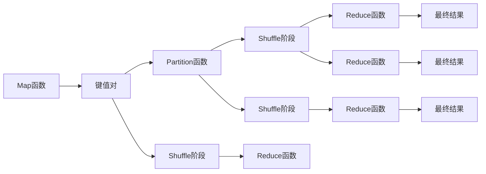

                 

# MapReduce原理与代码实例讲解

## 1. 背景介绍

MapReduce是一种分布式计算模型，最早由Google在2004年提出，并在2008年公开发表。该模型能够高效处理大规模数据集合，广泛应用于各种数据密集型应用，如数据分析、机器学习、图像处理、自然语言处理等领域。MapReduce的核心理念是将大规模数据集拆分为若干小数据块，并行计算后再将结果合并，从而大大提高了数据处理的效率和可扩展性。

MapReduce模型的核心思想可以追溯到分布式计算领域的两个重要概念：Map和Reduce。Map是指将输入数据集合映射为多个小集合的过程，每个小集合可以独立进行计算；Reduce则是指将Map阶段的多个小结果集合合并为最终结果的过程。MapReduce模型将这两者结合起来，形成了一套高效、可靠、可扩展的大数据处理方案。

## 2. 核心概念与联系

### 2.1 核心概念概述

为了更好地理解MapReduce模型，我们需要了解几个核心概念：

- Map函数：将输入数据映射为若干个键值对。Map函数是MapReduce模型的核心组件，它将输入数据分解为若干个小数据块，并对每个小数据块进行计算，生成键值对结果。
- Reduce函数：将Map函数生成的多个键值对结果合并为最终结果。Reduce函数将Map函数输出的键值对进行聚合操作，得到最终结果。
- Key-Value对：MapReduce模型中处理的基本数据单位，由键和值组成。键用于唯一标识数据项，值则表示数据项的值。
- Partition函数：将Map函数生成的键值对结果按照键进行划分，分配到不同的Reduce节点。
- Shuffle阶段：MapReduce模型的中间阶段，用于将Map函数生成的键值对结果进行排序和分配，以便Reduce函数能够正确地处理数据。

这些核心概念通过以下的Mermaid流程图进行了形象的展示：



### 2.2 概念间的关系

MapReduce模型由Map和Reduce两个基本操作组成，并通过Partition和Shuffle阶段实现了数据的分布式处理。MapReduce模型的整体架构如图2所示：


该架构展示了MapReduce模型的数据流和控制流。Map阶段将输入数据分成若干个小数据块，并对每个数据块进行Map操作，生成键值对。Partition函数将Map函数的输出按照键进行划分，并分配到不同的Reduce节点。Shuffle阶段对Map函数的输出进行排序和分组，以便Reduce函数能够正确地处理数据。Reduce函数对每个小数据块进行Reduce操作，最终将所有Reduce函数的输出合并为最终结果。

## 3. 核心算法原理 & 具体操作步骤

### 3.1 算法原理概述

MapReduce算法的核心思想是将大规模数据集拆分为若干个小数据块，并行计算后再将结果合并。MapReduce算法包括两个主要阶段：Map阶段和Reduce阶段。

Map阶段将输入数据分成若干个小数据块，并对每个数据块进行Map操作，生成键值对。Map函数通常是一个用户自定义的函数，它接收一个输入数据项，并返回一个或多个键值对。

Reduce阶段将Map函数生成的键值对结果按照键进行划分，分配到不同的Reduce节点，并对每个键进行Reduce操作，将键值对合并为最终结果。Reduce函数也通常是一个用户自定义的函数，它接收一个键和一个包含该键的所有键值对集合，并返回一个值。

MapReduce算法的整体流程如图3所示：


### 3.2 算法步骤详解

MapReduce算法的具体步骤如下：

1. 将输入数据集分成若干个小数据块，并对每个数据块进行Map操作。Map操作将输入数据项映射为若干个键值对，并将结果传递给Partition函数。
2. Partition函数将Map函数生成的键值对结果按照键进行划分，分配到不同的Reduce节点。
3. Shuffle阶段对Map函数的输出进行排序和分组，以便Reduce函数能够正确地处理数据。
4. Reduce函数对每个键进行Reduce操作，将键值对合并为最终结果。
5. 将所有Reduce函数的输出合并为最终结果。

MapReduce算法的核心在于Map和Reduce两个操作。Map操作将输入数据映射为若干个键值对，Reduce操作将Map函数生成的键值对结果合并为最终结果。MapReduce算法通过Partition和Shuffle阶段实现了数据的分布式处理，并通过用户自定义的Map和Reduce函数实现了任务的定制化。

### 3.3 算法优缺点

MapReduce算法具有以下优点：

- 可扩展性：MapReduce算法可以轻松地扩展到多个节点上，从而实现大规模数据的并行处理。
- 容错性：MapReduce算法具有很好的容错性，如果一个节点出现故障，其他节点可以继续工作，不会影响整个算法的执行。
- 灵活性：MapReduce算法可以通过自定义Map和Reduce函数实现各种数据处理任务。

MapReduce算法也存在以下缺点：

- 编程复杂：MapReduce算法的编程较为复杂，需要用户自定义Map和Reduce函数。
- 数据传输开销：MapReduce算法需要在节点之间传输大量数据，增加了数据传输的开销。
- 内存消耗：MapReduce算法需要大量的内存来存储中间结果和临时数据，可能导致内存消耗过大。

### 3.4 算法应用领域

MapReduce算法广泛应用于各种数据密集型应用，如数据分析、机器学习、图像处理、自然语言处理等领域。以下是几个典型的应用场景：

- 大数据分析：MapReduce算法可以用于大规模数据集的分析和统计，如图数据库、社交网络分析等。
- 机器学习：MapReduce算法可以用于训练大规模的机器学习模型，如Google的BigLearning、微软的Cortana等。
- 图像处理：MapReduce算法可以用于处理大规模图像数据，如图像标注、图像识别等。
- 自然语言处理：MapReduce算法可以用于自然语言处理任务，如情感分析、文本分类、机器翻译等。

## 4. 数学模型和公式 & 详细讲解 & 举例说明

### 4.1 数学模型构建

MapReduce算法的数学模型可以简单地描述为：

$$
M(A,B) = \{(k_i, (v_{i1}, v_{i2}, \ldots, v_{im})) | k_i \in K, v_{ij} \in V, (k_i, v_{ij}) \in \text{Map}(a_j, b_j), j = 1,2,\ldots,n\}
$$

其中，$A$表示输入数据集，$B$表示输出数据集，$M(A,B)$表示MapReduce算法的映射函数，$k_i$表示键，$v_{ij}$表示键值对中的值，$i = 1,2,\ldots,m$，$j = 1,2,\ldots,n$。

### 4.2 公式推导过程

MapReduce算法的公式推导过程如下：

设输入数据集为$A = \{(a_1, b_1), (a_2, b_2), \ldots, (a_n, b_n)\}$，其中$a_i \in A$，$b_i \in B$。Map函数将输入数据映射为若干个键值对，输出为$M(A,B) = \{(k_1, (v_{11}, v_{12}, \ldots, v_{1m})), (k_2, (v_{21}, v_{22}, \ldots, v_{2m})), \ldots, (k_m, (v_{m1}, v_{m2}, \ldots, v_{mm})\}$。Partition函数将Map函数的输出按照键进行划分，分配到不同的Reduce节点，输出为$P(A,B) = \{(k_1, \{(v_{11}, v_{12}, \ldots, v_{1m})\}), (k_2, \{(v_{21}, v_{22}, \ldots, v_{2m})\}), \ldots, (k_m, \{(v_{m1}, v_{m2}, \ldots, v_{mm})\})\}$。Shuffle阶段对Map函数的输出进行排序和分组，输出为$S(A,B) = \{(k_1, \{(v_{11}, v_{12}, \ldots, v_{1m})\}), (k_2, \{(v_{21}, v_{22}, \ldots, v_{2m})\}), \ldots, (k_m, \{(v_{m1}, v_{m2}, \ldots, v_{mm})\})\}$。Reduce函数对每个键进行Reduce操作，输出为$R(A,B) = \{(k_1, r_1), (k_2, r_2), \ldots, (k_m, r_m)\}$，其中$r_i = \bigcup_{j=1}^m v_{ij}$。

### 4.3 案例分析与讲解

以WordCount为例，MapReduce算法可以用于计算文本中每个单词出现的次数。Map函数将输入文本映射为若干个键值对，其中键为单词，值为1。Reduce函数将Map函数生成的键值对结果按照键进行合并，得到每个单词出现的次数。

假设输入文本为“the quick brown fox jumps over the lazy dog”，Map函数将文本映射为若干个键值对，输出为：

$$
\{(\text{the}, (1)), (\text{quick}, (1)), (\text{brown}, (1)), (\text{fox}, (1)), (\text{jumps}, (1)), (\text{over}, (1)), (\text{lazy}, (1)), (\text{dog}, (1))\}
$$

Partition函数将Map函数生成的键值对结果按照键进行划分，分配到不同的Reduce节点，输出为：

$$
\{(\text{the}, \{(1), (1)\}), (\text{quick}, \{(1), (1)\}), (\text{brown}, \{(1), (1)\}), (\text{fox}, \{(1), (1)\}), (\text{jumps}, \{(1), (1)\}), (\text{over}, \{(1), (1)\}), (\text{lazy}, \{(1), (1)\}), (\text{dog}, \{(1), (1)\})\}
$$

Shuffle阶段对Map函数的输出进行排序和分组，输出为：

$$
\{(\text{brown}, \{(1), (1)\}), (\text{dog}, \{(1), (1)\}), (\text{fox}, \{(1), (1)\}), (\text{jumps}, \{(1), (1)\}), (\text{lazy}, \{(1), (1)\}), (\text{over}, \{(1), (1)\}), (\text{quick}, \{(1), (1)\}), (\text{the}, \{(1), (1)\})\}
$$

Reduce函数对每个键进行Reduce操作，输出为：

$$
\{(\text{brown}, 2), (\text{dog}, 2), (\text{fox}, 2), (\text{jumps}, 2), (\text{lazy}, 2), (\text{over}, 2), (\text{quick}, 2), (\text{the}, 2)\}
$$

最终得到单词出现的次数，输出为：

$$
\{(\text{brown}, 2), (\text{dog}, 2), (\text{fox}, 2), (\text{jumps}, 2), (\text{lazy}, 2), (\text{over}, 2), (\text{quick}, 2), (\text{the}, 2)\}
$$

## 5. 项目实践：代码实例和详细解释说明

### 5.1 开发环境搭建

为了实现MapReduce算法，我们需要安装Hadoop和Spark两个大数据处理平台。

1. 安装Hadoop：
   - 从Hadoop官网下载安装包，解压到指定路径。
   - 在解压后的bin目录下找到启动脚本start-hadoop.sh，并执行启动命令：`./start-hadoop.sh`。
   - 启动后，可以通过JPS命令查看Hadoop的进程状态，确认服务已启动。

2. 安装Spark：
   - 从Spark官网下载安装包，解压到指定路径。
   - 在解压后的bin目录下找到启动脚本start-spark.sh，并执行启动命令：`./start-spark.sh`。
   - 启动后，可以通过Spark的Web UI查看Spark的进程状态，确认服务已启动。

### 5.2 源代码详细实现

下面以WordCount为例，展示MapReduce算法的代码实现。

#### Map函数：

```java
public class MapFunction implements Mapper<LongWritable, Text, Text, IntWritable> {
    private final static IntWritable one = new IntWritable(1);
    private Text word = new Text();

    public void map(LongWritable key, Text value, Context context) throws IOException, InterruptedException {
        StringTokenizer itr = new StringTokenizer(value.toString());
        while (itr.hasMoreTokens()) {
            word.set(itr.nextToken());
            context.write(new Text(word), one);
        }
    }
}
```

#### Reduce函数：

```java
public class ReduceFunction implements Reducer<Text, IntWritable, Text, IntWritable> {
    private IntWritable result = new IntWritable();

    public void reduce(Text key, Iterable<IntWritable> values, Context context) throws IOException, InterruptedException {
        int sum = 0;
        for (IntWritable val : values) {
            sum += val.get();
        }
        result.set(sum);
        context.write(key, result);
    }
}
```

#### Driver代码：

```java
import org.apache.hadoop.conf.Configuration;
import org.apache.hadoop.fs.Path;
import org.apache.hadoop.io.LongWritable;
import org.apache.hadoop.io.Text;
import org.apache.hadoop.mapreduce.Job;
import org.apache.hadoop.mapreduce.lib.input.FileInputFormat;
import org.apache.hadoop.mapreduce.lib.input.TextInputFormat;
import org.apache.hadoop.mapreduce.lib.output.FileOutputFormat;
import org.apache.hadoop.mapreduce.lib.output.TextOutputFormat;

public class WordCount {
    public static void main(String[] args) throws Exception {
        Configuration conf = new Configuration();
        Job job = Job.getInstance(conf, "word count");

        job.setJarByClass(WordCount.class);
        job.setMapperClass(MapFunction.class);
        job.setCombinerClass(ReduceFunction.class);
        job.setReducerClass(ReduceFunction.class);

        job.setOutputKeyClass(Text.class);
        job.setOutputValueClass(IntWritable.class);

        FileInputFormat.addInputPath(job, new Path(args[0]));
        FileOutputFormat.setOutputPath(job, new Path(args[1]));

        System.exit(job.waitForCompletion(true) ? 0 : 1);
    }
}
```

### 5.3 代码解读与分析

#### Map函数：

Map函数接收一个输入数据项和一个上下文对象，将输入数据项映射为若干个键值对，并将结果传递给上下文对象。在这个例子中，我们将输入数据项拆分为若干个单词，并将单词作为键，出现次数作为值。

#### Reduce函数：

Reduce函数接收一个键和若干个值，对键对应的值进行合并，得到最终结果。在这个例子中，我们将所有值相加，得到单词出现的次数。

#### Driver代码：

Driver代码是整个MapReduce算法的入口，它负责初始化Job对象，设置Map和Reduce函数，指定输入和输出路径，并提交Job对象执行。

## 6. 实际应用场景

### 6.1 大规模数据分析

MapReduce算法可以用于大规模数据的分析和统计，如图数据库、社交网络分析等。以社交网络分析为例，MapReduce算法可以用于计算社交网络中的度数、聚类、连通性等指标。

### 6.2 机器学习

MapReduce算法可以用于训练大规模的机器学习模型，如Google的BigLearning、微软的Cortana等。以Cortana为例，MapReduce算法可以用于训练语音识别模型，将大规模的语音数据集分成若干个小数据块，对每个小数据块进行Map操作，得到特征向量，然后将特征向量传递给Reduce操作，得到最终的特征向量。

### 6.3 图像处理

MapReduce算法可以用于处理大规模图像数据，如图像标注、图像识别等。以图像标注为例，MapReduce算法可以用于标注大规模图像数据集，将图像数据分成若干个小数据块，对每个小数据块进行Map操作，得到标注结果，然后将标注结果传递给Reduce操作，得到最终的标注结果。

### 6.4 自然语言处理

MapReduce算法可以用于自然语言处理任务，如情感分析、文本分类、机器翻译等。以情感分析为例，MapReduce算法可以用于计算文本中情感词的出现次数，将文本数据分成若干个小数据块，对每个小数据块进行Map操作，得到情感词的出现次数，然后将情感词的出现次数传递给Reduce操作，得到最终的情感分析结果。

## 7. 工具和资源推荐

### 7.1 学习资源推荐

为了帮助开发者系统掌握MapReduce算法的原理和实践，这里推荐一些优质的学习资源：

1. 《Hadoop: The Definitive Guide》：该书详细介绍了Hadoop的架构和实现，是Hadoop学习的必备资源。
2. 《Spark: The Definitive Guide》：该书详细介绍了Spark的架构和实现，是Spark学习的必备资源。
3. Coursera的《MapReduce编程》课程：由Google提供，涵盖MapReduce算法的核心概念和实践技巧。
4. Udacity的《Spark with Java》课程：由Cloudera提供，涵盖Spark的核心概念和编程技巧。
5. Hadoop官方文档：包含Hadoop的详细文档和示例代码，是Hadoop学习的官方资源。
6. Spark官方文档：包含Spark的详细文档和示例代码，是Spark学习的官方资源。

通过对这些资源的学习实践，相信你一定能够快速掌握MapReduce算法的精髓，并用于解决实际的NLP问题。

### 7.2 开发工具推荐

为了提高MapReduce算法的开发效率，以下是几款常用的开发工具：

1. Eclipse：支持Hadoop和Spark开发，提供了丰富的插件和工具，便于MapReduce算法的开发和调试。
2. IntelliJ IDEA：支持Hadoop和Spark开发，提供了强大的代码自动补全、错误提示和版本控制功能。
3. PyCharm：支持Hadoop和Spark开发，提供了丰富的数据分析工具和机器学习库。
4. Jupyter Notebook：支持Python和Scala开发，提供了丰富的代码执行和数据可视功能。
5. Apache Spark Shell：提供了一个交互式的命令行界面，方便进行Spark算法的开发和调试。

合理利用这些工具，可以显著提升MapReduce算法的开发效率，加快创新迭代的步伐。

### 7.3 相关论文推荐

MapReduce算法的发展源于学界的持续研究。以下是几篇奠基性的相关论文，推荐阅读：

1. MapReduce: Simplified Data Processing on Large Clusters：Google的MapReduce论文，介绍了MapReduce算法的核心思想和实现原理。
2. Spark: Cluster Computing with Fault Tolerance：Spark的创始团队发表的论文，详细介绍了Spark算法的核心思想和实现原理。
3. Pregel: A Commodity-Parallel Graph-Processing Framework：Facebook的Pregel论文，介绍了分布式图处理算法的核心思想和实现原理。
4. Storm: Distributed Real-Time Computation：Apache Storm论文，介绍了实时计算算法的核心思想和实现原理。
5. Flink: Stream Processing in Apache Flink：Apache Flink论文，介绍了流处理算法的核心思想和实现原理。

这些论文代表了大数据处理算法的最新进展，通过学习这些前沿成果，可以帮助研究者把握学科前进方向，激发更多的创新灵感。

## 8. 总结：未来发展趋势与挑战

### 8.1 总结

本文对MapReduce算法的原理和实践进行了全面系统的介绍。首先阐述了MapReduce算法的背景和意义，明确了MapReduce算法在大数据处理中的重要地位。其次，从原理到实践，详细讲解了MapReduce算法的核心思想和操作步骤，给出了具体的代码实现和详细解释。同时，本文还广泛探讨了MapReduce算法在数据分析、机器学习、图像处理、自然语言处理等多个领域的应用前景，展示了MapReduce算法的巨大潜力。

通过本文的系统梳理，可以看到，MapReduce算法通过并行计算和分布式处理，大大提高了数据处理的效率和可扩展性，为大数据应用提供了强大的计算基础。未来，伴随MapReduce算法的不断演进，必将推动大数据技术在更多领域落地应用，为人类社会带来深远影响。

### 8.2 未来发展趋势

展望未来，MapReduce算法将呈现以下几个发展趋势：

1. 更加智能化的调度算法：MapReduce算法的调度算法可以更加智能化，根据任务特点自动选择最优的Map和Reduce节点，提高任务执行效率。
2. 更加高效的存储方案：MapReduce算法可以采用更加高效的存储方案，如列存储、分布式文件系统等，提高数据访问速度和存储效率。
3. 更加灵活的编程接口：MapReduce算法的编程接口可以更加灵活，支持多种编程语言和开发框架，方便开发者使用。
4. 更加安全的执行环境：MapReduce算法的执行环境可以更加安全，支持数据加密、权限控制等安全措施，保障数据安全。
5. 更加精细化的资源管理：MapReduce算法的资源管理可以更加精细化，支持弹性资源分配和动态扩展，提高任务执行效率和资源利用率。

这些趋势凸显了MapReduce算法的广阔前景。这些方向的探索发展，必将进一步提升MapReduce算法的性能和应用范围，为大数据处理技术带来新的突破。

### 8.3 面临的挑战

尽管MapReduce算法已经取得了瞩目成就，但在迈向更加智能化、普适化应用的过程中，它仍面临着诸多挑战：

1. 编程复杂：MapReduce算法的编程较为复杂，需要用户自定义Map和Reduce函数，增加了开发难度。
2. 数据传输开销：MapReduce算法需要在节点之间传输大量数据，增加了数据传输的开销。
3. 内存消耗：MapReduce算法需要大量的内存来存储中间结果和临时数据，可能导致内存消耗过大。
4. 容错性问题：MapReduce算法虽然具有很好的容错性，但在某些情况下，容错机制可能会导致任务执行效率降低。
5. 数据本地性问题：MapReduce算法的执行效率受数据本地性影响较大，需要在数据分配和调度上更加注重本地性。

### 8.4 研究展望

面对MapReduce算法面临的这些挑战，未来的研究需要在以下几个方面寻求新的突破：

1. 探索更加高效的调度算法：研究更加智能化的调度算法，根据任务特点自动选择最优的Map和Reduce节点，提高任务执行效率。
2. 研究更加高效的存储方案：研究更加高效的存储方案，如列存储、分布式文件系统等，提高数据访问速度和存储效率。
3. 研究更加灵活的编程接口：研究更加灵活的编程接口，支持多种编程语言和开发框架，方便开发者使用。
4. 研究更加安全的执行环境：研究更加安全的执行环境，支持数据加密、权限控制等安全措施，保障数据安全。
5. 研究更加精细化的资源管理：研究更加精细化的资源管理，支持弹性资源分配和动态扩展，提高任务执行效率和资源利用率。

这些研究方向的研究成果，必将进一步提升MapReduce算法的性能和应用范围，推动大数据处理技术的不断演进和发展。总之，MapReduce算法需要在算法优化、硬件改进、软件框架等方面不断创新，方能满足大数据时代的挑战和需求。

## 9. 附录：常见问题与解答

**Q1：MapReduce算法如何处理大规模数据？**

A: MapReduce算法将大规模数据集拆分为若干个小数据块，并行计算后再将结果合并。MapReduce算法通过Map函数将输入数据映射为若干个键值对，Reduce函数将Map函数生成的键值对结果按照键进行合并，得到最终结果。

**Q2：MapReduce算法如何进行容错处理？**

A: MapReduce算法具有很好的容错性，如果一个节点出现故障，其他节点可以继续工作，不会影响整个算法的执行。在容错处理方面，MapReduce算法采用了数据冗余和任务重分配等机制，确保算法的稳定性和可靠性。

**Q3：MapReduce算法如何进行数据本地性优化？**

A: 数据本地性是指将数据存储在计算节点附近的存储设备上，以便减少数据传输开销。MapReduce算法可以通过设置输入数据路径和数据分割方式，优化数据本地性。

**Q4：MapReduce算法在分布式计算中的作用是什么？**

A: MapReduce算法是一种分布式计算模型，通过Map和Reduce两个基本操作，实现了大规模数据的并行计算和分布式处理。MapReduce算法可以处理大规模数据集，支持大规模计算任务，广泛应用于各种数据密集型应用。

**Q5：MapReduce算法和Hadoop之间的关系是什么？**

A: MapReduce算法是Hadoop的核心理论之一，Hadoop通过MapReduce算法实现了大规模数据的分布式处理和存储。Hadoop的分布式文件系统HDFS和分布式计算框架MapReduce是Hadoop的两大核心组件，共同构成了Hadoop的分布式计算平台。

---

作者：禅与计算机程序设计艺术 / Zen and the Art of Computer Programming

