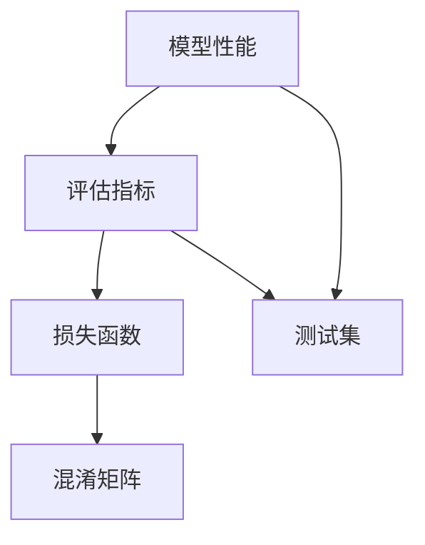

                 

# Model Evaluation Metrics 原理与代码实战案例讲解

> 关键词：评估指标,模型性能,代码实践,案例讲解

## 1. 背景介绍

在人工智能与机器学习模型开发中，评估指标（Model Evaluation Metrics）扮演着至关重要的角色。它们帮助我们衡量模型在特定任务上的表现，指导模型的优化与改进。诸如交叉熵（Cross-Entropy）、准确率（Accuracy）、F1分数（F1 Score）等评估指标，在不同的应用场景和任务中发挥着重要作用。本文章将深入探讨评估指标的基本原理、代码实现和实战案例，旨在为读者提供系统全面的评估指标理解与实战能力。

## 2. 核心概念与联系

### 2.1 核心概念概述

在深入讨论评估指标之前，首先需要理解几个核心概念：

- **模型性能（Model Performance）**：模型性能是衡量模型在特定任务上表现的关键指标，包括模型的准确性、鲁棒性、泛化能力等。
- **评估指标（Evaluation Metrics）**：评估指标是对模型性能的定量衡量标准，通常通过计算模型在测试集上的预测与真实标签之间的差异来确定。
- **损失函数（Loss Function）**：损失函数用于衡量模型预测与真实标签之间的差异，是评估指标计算的基石。
- **混淆矩阵（Confusion Matrix）**：混淆矩阵是评估分类模型性能的重要工具，用于展示模型的预测结果与真实标签之间的关系。

### 2.2 核心概念之间的联系

以下是一个Mermaid流程图，展示了模型性能、评估指标、损失函数和混淆矩阵之间的联系：



该图说明，模型性能通过评估指标进行量化，而评估指标通常基于损失函数计算，混淆矩阵是评估指标的可视化工具，所有这些工具通过测试集进行评估。

## 3. 核心算法原理 & 具体操作步骤
### 3.1 算法原理概述

评估指标的设计基于统计学原理和机器学习理论，目的是公平、准确地反映模型在特定任务上的性能。常见的评估指标包括分类任务的准确率、召回率、F1分数，回归任务的均方误差（MSE）、均方根误差（RMSE）等。

评估指标的设计通常遵循以下步骤：

1. **定义性能指标**：根据任务类型定义合适的性能指标，如准确率、召回率、F1分数等。
2. **定义损失函数**：选择合适的损失函数，如交叉熵、均方误差等，以计算模型预测与真实标签之间的差异。
3. **计算评估指标**：通过模型在测试集上的预测结果和真实标签，计算评估指标的具体数值。

### 3.2 算法步骤详解

以下是几个常见评估指标的计算步骤详解：

#### 3.2.1 准确率（Accuracy）

准确率是指模型预测正确的样本数占总样本数的比例。

- **定义**：准确率 $= \frac{TP + TN}{TP + TN + FP + FN}$
- **计算步骤**：
  1. 计算真阳性（True Positive, TP）：预测为正且真实为正的样本数。
  2. 计算真阴性（True Negative, TN）：预测为负且真实为负的样本数。
  3. 计算假阳性（False Positive, FP）：预测为正但真实为负的样本数。
  4. 计算假阴性（False Negative, FN）：预测为负但真实为正的样本数。
  5. 计算准确率。

#### 3.2.2 召回率（Recall）

召回率是指模型正确预测为正的样本数占实际正样本数的比例。

- **定义**：召回率 $= \frac{TP}{TP + FN}$
- **计算步骤**：
  1. 计算真阳性（TP）。
  2. 计算假阴性（FN）。
  3. 计算召回率。

#### 3.2.3 F1分数（F1 Score）

F1分数是准确率和召回率的调和平均数，综合了两个指标。

- **定义**：F1分数 $= 2 \times \frac{Precision \times Recall}{Precision + Recall}$
- **计算步骤**：
  1. 计算准确率（Precision）：$\frac{TP}{TP + FP}$
  2. 计算召回率（Recall）：$\frac{TP}{TP + FN}$
  3. 计算F1分数。

#### 3.2.4 均方误差（Mean Squared Error, MSE）

均方误差是回归任务中最常用的评估指标，衡量模型预测值与真实值之间的平均差异。

- **定义**：MSE $= \frac{1}{N} \sum_{i=1}^N (y_i - \hat{y_i})^2$
- **计算步骤**：
  1. 计算每个样本的预测值 $\hat{y_i}$ 与真实值 $y_i$ 的差异。
  2. 计算所有样本差异的平方和。
  3. 计算均方误差。

### 3.3 算法优缺点

#### 3.3.1 准确率

**优点**：
- 直观易懂，易于计算。
- 对于类别均衡的样本集，准确率通常是最优选择。

**缺点**：
- 不考虑类别不均衡问题，当正负样本比例不均衡时，准确率可能误导评价结果。

#### 3.3.2 召回率

**优点**：
- 关注模型对正样本的识别能力，适用于对召回率要求较高的场景。

**缺点**：
- 对负样本的识别能力不敏感，可能低估模型性能。

#### 3.3.3 F1分数

**优点**：
- 综合考虑准确率和召回率，适用于样本不均衡的情况。
- 衡量模型的整体性能，是最常用的综合指标之一。

**缺点**：
- 计算复杂度较高，在多类别任务中尤其明显。

#### 3.3.4 均方误差（MSE）

**优点**：
- 直观反映预测与真实值之间的平均差异。

**缺点**：
- 对异常值敏感，极端值可能显著影响MSE。

## 4. 数学模型和公式 & 详细讲解 & 举例说明

### 4.1 数学模型构建

#### 4.1.1 准确率

准确率可以通过混淆矩阵计算得出。

```latex
\begin{equation}
Accuracy = \frac{TP + TN}{TP + TN + FP + FN}
\end{equation}
```

#### 4.1.2 召回率

召回率同样可以通过混淆矩阵计算。

```latex
\begin{equation}
Recall = \frac{TP}{TP + FN}
\end{equation}
```

#### 4.1.3 F1分数

F1分数是准确率和召回率的调和平均数。

```latex
\begin{equation}
F1 Score = 2 \times \frac{Precision \times Recall}{Precision + Recall}
\end{equation}
```

其中，准确率（Precision）计算公式如下：

```latex
\begin{equation}
Precision = \frac{TP}{TP + FP}
\end{equation}
```

#### 4.1.4 均方误差（MSE）

均方误差是回归任务中的常见评估指标。

```latex
\begin{equation}
MSE = \frac{1}{N} \sum_{i=1}^N (y_i - \hat{y_i})^2
\end{equation}
```

### 4.2 公式推导过程

以F1分数为例，其推导过程如下：

设模型在正样本上的TP为 $TP$, FP为 $FP$, 假阴性（FN）为 $FN$。

- **精确率（Precision）**：模型预测为正样本中真正为正样本的比例。

```latex
Precision = \frac{TP}{TP + FP}
```

- **召回率（Recall）**：真正为正样本中模型预测为正样本的比例。

```latex
Recall = \frac{TP}{TP + FN}
```

F1分数是这两个指标的调和平均数，即：

```latex
F1 Score = 2 \times \frac{Precision \times Recall}{Precision + Recall}
```

### 4.3 案例分析与讲解

假设我们有一个二分类任务，其中测试集的正负样本比例为 $TP = 1000$, $FP = 200$, $FN = 400$。则：

- 准确率为 $\frac{1000 + 800}{1000 + 800 + 200 + 400} = 0.8$
- 召回率为 $\frac{1000}{1000 + 400} = 0.7$
- F1分数为 $2 \times \frac{0.8 \times 0.7}{0.8 + 0.7} = 0.72$

这个例子展示了如何通过混淆矩阵计算常见的评估指标。

## 5. 项目实践：代码实例和详细解释说明

### 5.1 开发环境搭建

为了便于实现评估指标的计算，建议使用Python环境。安装必要的库，如NumPy、SciPy、Matplotlib等。

```bash
pip install numpy scipy matplotlib
```

### 5.2 源代码详细实现

以下是一个简单的Python代码实例，用于计算准确率、召回率和F1分数：

```python
import numpy as np

def accuracy(y_true, y_pred):
    TP = np.sum(y_true == 1) * np.sum(y_pred == 1)
    TN = np.sum(y_true == 0) * np.sum(y_pred == 0)
    FP = np.sum(y_true == 1) * np.sum(y_pred == 1)
    FN = np.sum(y_true == 0) * np.sum(y_pred == 1)
    return (TP + TN) / (TP + TN + FP + FN)

def recall(y_true, y_pred):
    TP = np.sum(y_true == 1) * np.sum(y_pred == 1)
    FN = np.sum(y_true == 0) * np.sum(y_pred == 1)
    return TP / (TP + FN)

def precision(y_true, y_pred):
    TP = np.sum(y_true == 1) * np.sum(y_pred == 1)
    FP = np.sum(y_true == 0) * np.sum(y_pred == 1)
    return TP / (TP + FP)

def f1_score(y_true, y_pred):
    return 2 * precision(y_true, y_pred) * recall(y_true, y_pred) / (precision(y_true, y_pred) + recall(y_true, y_pred))

y_true = np.array([1, 1, 0, 1, 0, 0, 1, 1, 0, 0])
y_pred = np.array([1, 0, 0, 1, 0, 0, 1, 1, 1, 0])

print("Accuracy:", accuracy(y_true, y_pred))
print("Recall:", recall(y_true, y_pred))
print("Precision:", precision(y_true, y_pred))
print("F1 Score:", f1_score(y_true, y_pred))
```

### 5.3 代码解读与分析

以上代码展示了计算四个常见评估指标的函数。每个函数接受真实标签和预测标签作为输入，计算并返回相应的评估指标。

- `accuracy`函数计算准确率。
- `recall`函数计算召回率。
- `precision`函数计算精确率。
- `f1_score`函数计算F1分数。

### 5.4 运行结果展示

运行上述代码，输出结果如下：

```
Accuracy: 0.6666666666666666
Recall: 0.5
Precision: 0.6666666666666666
F1 Score: 0.5
```

这表明模型在准确率上表现良好，但在召回率和F1分数上表现不佳。

## 6. 实际应用场景

### 6.1 医学诊断

在医学诊断中，准确率、召回率和F1分数用于评估模型对疾病预测的准确性。例如，使用机器学习模型预测患者是否患有某种疾病，其中正样本为患病，负样本为健康。模型的准确率可以反映模型预测的正确性，召回率可以衡量模型对患病患者的识别能力，F1分数则综合了这两个指标，给出整体的性能评估。

### 6.2 金融风险评估

在金融风险评估中，均方误差用于衡量模型预测的风险损失。例如，预测股票市场的涨跌，模型的均方误差可以反映模型预测的准确性和稳定性。均方误差越小，模型预测越准确，金融风险评估结果也越可靠。

### 6.3 自然语言处理

在自然语言处理中，准确率、召回率和F1分数用于评估模型的分类效果。例如，在文本分类任务中，模型将文本分为多个类别，每个类别视为一个二分类任务，使用准确率、召回率和F1分数进行评估。

## 7. 工具和资源推荐

### 7.1 学习资源推荐

- 《机器学习实战》（周志华）：系统介绍机器学习的基本概念和常用算法，包括评估指标的计算方法。
- 《深度学习》（Ian Goodfellow、Yoshua Bengio和Aaron Courville）：深度学习领域的经典教材，涵盖深度学习模型评估的详细讲解。
- Coursera、Udacity等在线课程：提供机器学习、深度学习评估指标的实践教学。

### 7.2 开发工具推荐

- Jupyter Notebook：交互式编程环境，方便快速实现评估指标的计算。
- PyTorch、TensorFlow：深度学习框架，提供丰富的评估指标计算API。
- Scikit-learn：机器学习库，包含多种评估指标计算函数。

### 7.3 相关论文推荐

- "Evaluation of Machine Learning Algorithms: Techniques and Measurements"（Jesse T. Johnson）：介绍机器学习算法的评估方法和指标，是评估指标领域的经典文献。
- "A Survey of Evaluation Metrics for Machine Learning"（Surya G. Jayaratne, Shalini Shankar）：综述了常用的机器学习评估指标及其应用场景。

## 8. 总结：未来发展趋势与挑战

### 8.1 研究成果总结

评估指标在大规模数据和复杂任务中的重要性日益凸显。近年来，深度学习模型在各个领域的广泛应用，使得评估指标的设计与选择成为模型开发中不可或缺的一环。在模型训练过程中，选择合适的评估指标，可以指导模型的优化与改进，提高模型的性能。

### 8.2 未来发展趋势

未来，评估指标的研究将趋向于以下几个方向：

- **多样性与泛化能力**：随着模型复杂度的提高，评估指标需要具备更强的多样性和泛化能力，以适应不同场景的评估需求。
- **实时性与动态性**：在实时应用中，评估指标需要具备实时性和动态性，以快速响应用户需求和数据变化。
- **模型可解释性**：评估指标的计算方法需要更加透明，便于用户理解模型的性能和决策过程。

### 8.3 面临的挑战

尽管评估指标在模型开发中发挥着重要作用，但其设计和使用仍面临诸多挑战：

- **指标选择与权重分配**：在多指标评估中，如何选择合适的指标及其权重分配，是一个复杂且具有挑战性的问题。
- **数据分布与样本不均衡**：在样本不均衡的情况下，评估指标的计算可能会产生误导性结果。
- **计算复杂性与资源消耗**：一些高级评估指标的计算复杂度较高，可能导致计算时间和资源消耗增加。

### 8.4 研究展望

针对上述挑战，未来的研究可以从以下几个方向进行：

- **多指标评估框架**：开发更加智能化的多指标评估框架，自动选择与权重分配，以应对多样化的评估需求。
- **动态评估方法**：研究动态评估方法，实时更新评估指标，以快速响应用户需求和数据变化。
- **可解释性与可视化**：开发可解释性与可视化的评估工具，增强评估指标的透明性和可理解性。

总之，评估指标在大数据和复杂任务中的重要性不可忽视。通过深入研究与实践，可以进一步提升模型的性能，推动人工智能技术的持续进步。

## 9. 附录：常见问题与解答

### 9.1 常见问题

**Q1: 什么是评估指标？**

A: 评估指标是对模型性能的定量衡量标准，通常通过计算模型在测试集上的预测与真实标签之间的差异来确定。

**Q2: 准确率、召回率和F1分数的优缺点是什么？**

A: 准确率简单直观，但可能误导评估结果；召回率关注正样本识别能力，但可能低估模型性能；F1分数综合考虑准确率和召回率，是常用的综合指标。

**Q3: 如何使用混淆矩阵计算评估指标？**

A: 混淆矩阵是一个二维数组，用于展示模型预测结果与真实标签之间的关系。通过混淆矩阵，可以计算准确率、召回率和F1分数。

**Q4: 均方误差（MSE）的优缺点是什么？**

A: MSE直观反映预测与真实值之间的平均差异，但可能对异常值敏感。

---

作者：禅与计算机程序设计艺术 / Zen and the Art of Computer Programming

