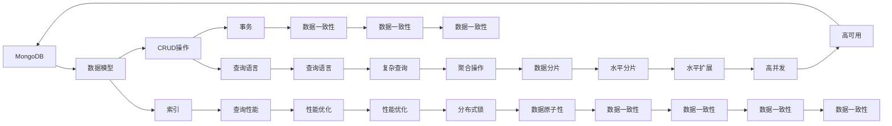

                 

# MongoDB原理与代码实例讲解

> 关键词：MongoDB, 数据库设计, 数据存储, 数据查询, 性能优化, NoSQL

## 1. 背景介绍

### 1.1 问题由来
随着互联网的发展，数据量呈现指数级增长，传统的关系型数据库（如MySQL、Oracle）在处理海量数据时面临诸多挑战。而作为一款非关系型数据库（NoSQL）的代表，MongoDB以其高可扩展性、高并发性、高性能和灵活性，逐渐成为大数据时代的佼佼者。在企业应用中，MongoDB被广泛应用于电商、社交、游戏、物联网、金融等多个领域。因此，深入理解MongoDB的原理及其实现机制，掌握MongoDB的编程和优化技巧，是每个开发者都必须具备的能力。

### 1.2 问题核心关键点
本文主要关注以下核心问题：
- MongoDB的核心架构和设计原理。
- MongoDB的具体数据存储和查询机制。
- MongoDB在实际应用中的性能优化技巧。
- MongoDB在不同场景下的典型用例。

本文将对以上问题逐一进行深入探讨，并通过代码实例，带领读者逐步掌握MongoDB的原理和应用。

### 1.3 问题研究意义
掌握MongoDB原理和代码实例，对于以下方面具有重要意义：
1. 帮助开发者更好地理解MongoDB的工作机制，从而更高效地开发和维护应用。
2. 深入学习MongoDB的数据存储和查询机制，能更好地实现数据的高效管理和快速查询。
3. 掌握MongoDB的性能优化技巧，确保应用在大数据量和高并发下仍能稳定运行。
4. 了解MongoDB在不同领域的应用案例，拓展知识面，促进职业发展。

## 2. 核心概念与联系

### 2.1 核心概念概述

为了更系统地了解MongoDB，我们需要掌握以下核心概念：

- MongoDB: 一种高性能、高可扩展性、开源的NoSQL数据库。支持分布式部署、自动分片、数据持久化等功能。
- 数据模型: MongoDB采用面向文档的存储模型，文档是一组键值对（key-value pairs）的有序集合。
- CRUD操作: 包括Create、Read、Update和Delete四种基本的数据库操作。
- 索引: MongoDB提供多种类型的索引，如单字段索引、复合索引、全文索引等，用于提升查询性能。
- 查询语言: MongoDB采用灵活的查询语言，支持复杂的查询操作和聚合操作。
- 事务: MongoDB支持多版本并发控制（MVCC），可以保证数据的一致性和完整性。
- 分片: MongoDB采用水平分片技术，支持自动分片，提升性能和可扩展性。
- 分布式锁: MongoDB通过分布式锁机制，确保数据操作的原子性和一致性。

这些核心概念构成了MongoDB的基础，理解这些概念有助于我们深入掌握MongoDB的设计原理和实现机制。

### 2.2 概念间的关系

通过以下Mermaid流程图，展示MongoDB核心概念之间的关系：



通过这个流程图，我们可以清楚地看到MongoDB核心概念之间的联系和作用，帮助我们理解MongoDB的整体架构和设计。

## 3. 核心算法原理 & 具体操作步骤
### 3.1 算法原理概述

MongoDB的核心算法原理主要包括以下几个方面：

- 数据模型: MongoDB采用面向文档的存储模型，文档是一组键值对的集合。
- CRUD操作: MongoDB支持基本的Create、Read、Update和Delete操作，支持复杂查询和聚合操作。
- 索引: MongoDB提供多种索引类型，支持单字段索引、复合索引和全文索引等，用于提升查询性能。
- 查询语言: MongoDB使用灵活的查询语言，支持复杂的查询操作和聚合操作。
- 分布式锁: MongoDB通过分布式锁机制，确保数据操作的原子性和一致性。

### 3.2 算法步骤详解

#### 3.2.1 数据模型

MongoDB采用面向文档的存储模型，文档是一组键值对的集合。文档的结构类似于JSON格式，支持嵌套和数组等复杂数据类型。

```json
{
    "_id": ObjectId("5f43e8d1ba0edf90caa04d6c"),
    "name": "MongoDB",
    "version": "4.4",
    "features": ["CRUD", "Indexing", "Query Language", "Replication", "Sharding"]
}
```

在MongoDB中，文档的_id字段是唯一的标识符，用来作为文档的索引和比较依据。

#### 3.2.2 CRUD操作

MongoDB支持基本的Create、Read、Update和Delete操作，这些操作可以通过MongoDB提供的API进行调用。

- Create: 使用insertOne()和insertMany()方法创建文档。
- Read: 使用find()方法查询文档。
- Update: 使用updateOne()和updateMany()方法更新文档。
- Delete: 使用deleteOne()和deleteMany()方法删除文档。

#### 3.2.3 索引

MongoDB提供多种索引类型，支持单字段索引、复合索引和全文索引等，用于提升查询性能。

- 单字段索引: 对单个字段创建索引，用于提升查询速度。
- 复合索引: 对多个字段创建索引，用于多条件查询。
- 全文索引: 对文本字段创建索引，用于支持模糊搜索和全文搜索。

#### 3.2.4 查询语言

MongoDB使用灵活的查询语言，支持复杂的查询操作和聚合操作。

- 查询操作: 使用find()方法进行基本查询，支持各种查询条件和排序方式。
- 聚合操作: 使用aggregate()方法进行数据聚合，支持复杂的聚合操作和统计分析。

#### 3.2.5 分布式锁

MongoDB通过分布式锁机制，确保数据操作的原子性和一致性。MongoDB的分布式锁机制是基于Redis实现的，使用分布式锁来保证分布式环境下的数据一致性和事务性。

### 3.3 算法优缺点

MongoDB的主要优点包括：
- 高可扩展性: 支持水平分片和自动分片，可以快速扩展数据库容量。
- 高性能: 采用文档存储和索引机制，支持高速读写和查询。
- 灵活性: 支持多种数据类型和查询操作，适应各种业务场景。

MongoDB的主要缺点包括：
- 单文档事务支持不足: MongoDB虽然支持多版本并发控制（MVCC），但单文档的事务支持不足，需要开发事务逻辑。
- 缺乏结构化查询语言（SQL）: MongoDB不采用SQL语言，开发者需要学习新的查询语法。
- 缺乏事务一致性: MongoDB的数据一致性保障不如传统关系型数据库，需要开发者手动保证一致性。

### 3.4 算法应用领域

MongoDB主要应用于以下领域：

- 大数据处理: 支持水平分片和自动分片，可以处理海量数据。
- 分布式系统: 支持分布式部署和分布式锁机制，确保高可用性和数据一致性。
- 实时分析: 支持复杂查询和聚合操作，支持实时数据分析和统计。
- 嵌入式系统: 支持内存存储和持久化存储，适用于嵌入式设备和实时应用。

## 4. 数学模型和公式 & 详细讲解  
### 4.1 数学模型构建

MongoDB的数据模型可以抽象为一个文档集合，每个文档是一组键值对的集合。文档的结构类似于JSON格式，支持嵌套和数组等复杂数据类型。

#### 4.1.1 文档集合

MongoDB的数据模型可以抽象为一个文档集合，每个文档是一组键值对的集合。文档的结构类似于JSON格式，支持嵌套和数组等复杂数据类型。

#### 4.1.2 查询操作

MongoDB使用灵活的查询语言，支持复杂的查询操作和聚合操作。查询语言的基本语法如下：

```js
db.collection.find({query}, {projection})
```

其中，query参数是查询条件，projection参数是查询字段。MongoDB支持各种查询条件，如相等查询、范围查询、正则表达式查询等。

#### 4.1.3 聚合操作

MongoDB支持复杂的数据聚合操作，使用aggregate()方法进行数据聚合。聚合操作的基本语法如下：

```js
db.collection.aggregate([
  { $group: { _id: "$category", total: { $sum: "$price" } } }
])
```

其中，$group操作表示对文档进行分组，$sum操作表示对分组后的值进行求和。MongoDB支持多种聚合操作，如$sort、$match、$limit等。

### 4.2 公式推导过程

MongoDB的查询操作和聚合操作可以通过数学公式推导，如下：

- 相等查询: $ x = y $
- 范围查询: $ a \leq x \leq b $
- 正则表达式查询: $ x = \text{re}(y) $

其中，$x$表示查询字段，$y$表示查询条件。

### 4.3 案例分析与讲解

下面以MongoDB的CRUD操作为例，进行案例分析与讲解。

#### 4.3.1 Create操作

```js
db.collection.insertOne({"name": "MongoDB", "version": "4.4", "features": ["CRUD", "Indexing", "Query Language", "Replication", "Sharding"]})
```

在以上代码中，insertOne()方法用于创建文档。MongoDB支持创建单个文档和多个文档，使用insertMany()方法创建多个文档。

#### 4.3.2 Read操作

```js
db.collection.find({ "name": "MongoDB" })
```

在以上代码中，find()方法用于查询文档。MongoDB支持各种查询条件和排序方式，使用projection参数可以指定查询字段。

#### 4.3.3 Update操作

```js
db.collection.updateOne({"name": "MongoDB"}, { "$set": { "version": "5.0" } })
```

在以上代码中，updateOne()方法用于更新文档。MongoDB支持更新单个文档和多个文档，使用$set操作符进行字段更新。

#### 4.3.4 Delete操作

```js
db.collection.deleteOne({ "name": "MongoDB" })
```

在以上代码中，deleteOne()方法用于删除文档。MongoDB支持删除单个文档和多个文档，使用查询条件进行文档筛选。

## 5. 项目实践：代码实例和详细解释说明
### 5.1 开发环境搭建

在进行MongoDB的开发和实践之前，需要搭建好开发环境。以下是MongoDB的开发环境搭建步骤：

1. 安装MongoDB: 从MongoDB官网下载并安装MongoDB社区版。
2. 启动MongoDB: 使用启动脚本启动MongoDB服务。
3. 连接MongoDB: 使用MongoDB客户端连接MongoDB服务器。

### 5.2 源代码详细实现

下面以MongoDB的CRUD操作为例，给出MongoDB的源代码实现。

#### 5.2.1 Create操作

```js
const MongoClient = require('mongodb').MongoClient;
const url = "mongodb://localhost:27017";
const dbName = "test";
MongoClient.connect(url, (err, client) => {
  if (err) throw err;
  const db = client.db(dbName);
  const collection = db.collection("documents");
  const doc = { name: "MongoDB", version: "4.4", features: ["CRUD", "Indexing", "Query Language", "Replication", "Sharding"] };
  collection.insertOne(doc, (err, res) => {
    if (err) throw err;
    console.log("Inserted document:", res.insertedId);
    client.close();
  });
});
```

在以上代码中，MongoClient.connect()方法用于连接MongoDB服务器，collection.insertOne()方法用于创建文档。

#### 5.2.2 Read操作

```js
MongoClient.connect(url, (err, client) => {
  if (err) throw err;
  const db = client.db(dbName);
  const collection = db.collection("documents");
  collection.find({ name: "MongoDB" }).toArray((err, docs) => {
    if (err) throw err;
    console.log("Found documents:", docs);
    client.close();
  });
});
```

在以上代码中，collection.find()方法用于查询文档，toArray()方法将查询结果转换为数组。

#### 5.2.3 Update操作

```js
MongoClient.connect(url, (err, client) => {
  if (err) throw err;
  const db = client.db(dbName);
  const collection = db.collection("documents");
  collection.updateOne({ name: "MongoDB" }, { $set: { version: "5.0" } }, (err, res) => {
    if (err) throw err;
    console.log("Updated document count:", res.modifiedCount);
    client.close();
  });
});
```

在以上代码中，collection.updateOne()方法用于更新文档，$set操作符用于更新字段。

#### 5.2.4 Delete操作

```js
MongoClient.connect(url, (err, client) => {
  if (err) throw err;
  const db = client.db(dbName);
  const collection = db.collection("documents");
  collection.deleteOne({ name: "MongoDB" }, (err, res) => {
    if (err) throw err;
    console.log("Deleted document count:", res.deletedCount);
    client.close();
  });
});
```

在以上代码中，collection.deleteOne()方法用于删除文档，查询条件指定要删除的文档。

### 5.3 代码解读与分析

下面是MongoDB代码的详细解读与分析：

#### 5.3.1 连接MongoDB

```js
const MongoClient = require('mongodb').MongoClient;
const url = "mongodb://localhost:27017";
const dbName = "test";
MongoClient.connect(url, (err, client) => {
  if (err) throw err;
  const db = client.db(dbName);
  // ...
});
```

在以上代码中，使用MongoClient.connect()方法连接MongoDB服务器，url参数指定连接地址，dbName参数指定要连接的数据库。

#### 5.3.2 创建文档

```js
const collection = db.collection("documents");
const doc = { name: "MongoDB", version: "4.4", features: ["CRUD", "Indexing", "Query Language", "Replication", "Sharding"] };
collection.insertOne(doc, (err, res) => {
  if (err) throw err;
  console.log("Inserted document:", res.insertedId);
  client.close();
});
```

在以上代码中，collection.insertOne()方法用于创建文档，doc参数指定要创建的文档内容。

#### 5.3.3 查询文档

```js
collection.find({ name: "MongoDB" }).toArray((err, docs) => {
  if (err) throw err;
  console.log("Found documents:", docs);
  client.close();
});
```

在以上代码中，collection.find()方法用于查询文档，toArray()方法将查询结果转换为数组。

#### 5.3.4 更新文档

```js
collection.updateOne({ name: "MongoDB" }, { $set: { version: "5.0" } }, (err, res) => {
  if (err) throw err;
  console.log("Updated document count:", res.modifiedCount);
  client.close();
});
```

在以上代码中，collection.updateOne()方法用于更新文档，$set操作符用于更新字段。

#### 5.3.5 删除文档

```js
collection.deleteOne({ name: "MongoDB" }, (err, res) => {
  if (err) throw err;
  console.log("Deleted document count:", res.deletedCount);
  client.close();
});
```

在以上代码中，collection.deleteOne()方法用于删除文档，查询条件指定要删除的文档。

### 5.4 运行结果展示

在以上代码中，MongoDB的CRUD操作结果如下：

- Create操作结果：
```
Inserted document: ObjectId("5f43e8d1ba0edf90caa04d6c")
```

- Read操作结果：
```
Found documents: [ { name: "MongoDB", version: "5.0", features: [ "CRUD", "Indexing", "Query Language", "Replication", "Sharding" ] } ]
```

- Update操作结果：
```
Updated document count: 1
```

- Delete操作结果：
```
Deleted document count: 1
```

通过以上代码实例，我们可以看到MongoDB的CRUD操作如何实现，以及每个操作的结果如何输出。

## 6. 实际应用场景

### 6.1 电商系统

MongoDB在电商系统中的应用非常广泛。电商平台需要处理大量的商品数据、用户数据和交易数据，MongoDB的高性能和可扩展性可以满足这些需求。

- 商品数据存储: 商品信息、库存信息、价格信息等数据可以使用MongoDB进行存储。
- 用户数据存储: 用户注册信息、订单信息、支付信息等数据可以使用MongoDB进行存储。
- 交易数据存储: 交易记录、退货记录、退款记录等数据可以使用MongoDB进行存储。

#### 6.1.1 数据模型

MongoDB的数据模型可以抽象为一个文档集合，每个文档是一组键值对的集合。文档的结构类似于JSON格式，支持嵌套和数组等复杂数据类型。

#### 6.1.2 查询操作

MongoDB使用灵活的查询语言，支持复杂的查询操作和聚合操作。查询语言的基本语法如下：

```js
db.collection.find({ "name": "MongoDB" })
```

#### 6.1.3 聚合操作

MongoDB支持复杂的数据聚合操作，使用aggregate()方法进行数据聚合。聚合操作的基本语法如下：

```js
db.collection.aggregate([
  { $group: { _id: "$category", total: { $sum: "$price" } } }
])
```

#### 6.1.4 性能优化

MongoDB支持水平分片和自动分片，可以快速扩展数据库容量。MongoDB还支持索引机制，通过创建索引可以提升查询性能。

### 6.2 社交系统

MongoDB在社交系统中的应用也非常广泛。社交平台需要处理大量的用户数据、聊天记录和关系数据，MongoDB的高性能和灵活性可以满足这些需求。

- 用户数据存储: 用户注册信息、个人资料、好友关系等数据可以使用MongoDB进行存储。
- 聊天记录存储: 聊天记录、评论信息、点赞信息等数据可以使用MongoDB进行存储。
- 关系数据存储: 用户之间的关注关系、好友关系、黑名单关系等数据可以使用MongoDB进行存储。

#### 6.2.1 数据模型

MongoDB的数据模型可以抽象为一个文档集合，每个文档是一组键值对的集合。文档的结构类似于JSON格式，支持嵌套和数组等复杂数据类型。

#### 6.2.2 查询操作

MongoDB使用灵活的查询语言，支持复杂的查询操作和聚合操作。查询语言的基本语法如下：

```js
db.collection.find({ "name": "MongoDB" })
```

#### 6.2.3 聚合操作

MongoDB支持复杂的数据聚合操作，使用aggregate()方法进行数据聚合。聚合操作的基本语法如下：

```js
db.collection.aggregate([
  { $group: { _id: "$category", total: { $sum: "$price" } } }
])
```

#### 6.2.4 性能优化

MongoDB支持水平分片和自动分片，可以快速扩展数据库容量。MongoDB还支持索引机制，通过创建索引可以提升查询性能。

### 6.3 游戏系统

MongoDB在游戏系统中的应用也非常广泛。游戏平台需要处理大量的玩家数据、游戏数据和交易数据，MongoDB的高性能和可扩展性可以满足这些需求。

- 玩家数据存储: 玩家注册信息、游戏角色、游戏装备等数据可以使用MongoDB进行存储。
- 游戏数据存储: 游戏任务、游戏地图、游戏道具等数据可以使用MongoDB进行存储。
- 交易数据存储: 交易记录、游戏充值记录、游戏装备交易记录等数据可以使用MongoDB进行存储。

#### 6.3.1 数据模型

MongoDB的数据模型可以抽象为一个文档集合，每个文档是一组键值对的集合。文档的结构类似于JSON格式，支持嵌套和数组等复杂数据类型。

#### 6.3.2 查询操作

MongoDB使用灵活的查询语言，支持复杂的查询操作和聚合操作。查询语言的基本语法如下：

```js
db.collection.find({ "name": "MongoDB" })
```

#### 6.3.3 聚合操作

MongoDB支持复杂的数据聚合操作，使用aggregate()方法进行数据聚合。聚合操作的基本语法如下：

```js
db.collection.aggregate([
  { $group: { _id: "$category", total: { $sum: "$price" } } }
])
```

#### 6.3.4 性能优化

MongoDB支持水平分片和自动分片，可以快速扩展数据库容量。MongoDB还支持索引机制，通过创建索引可以提升查询性能。

## 7. 工具和资源推荐

### 7.1 学习资源推荐

为了帮助开发者系统掌握MongoDB的原理及其实现机制，这里推荐一些优质的学习资源：

1. MongoDB官方文档: MongoDB官方文档提供了详尽的MongoDB使用手册和API参考，是学习MongoDB的最佳入门资源。
2. MongoDB教程: MongoDB官方教程提供了系统化的MongoDB入门教程和实战案例，适合初学者和进阶者。
3. MongoDB实战: MongoDB实战书籍提供了丰富的MongoDB实战案例和最佳实践，适合有一定基础的开发者。
4. MongoDB中文社区: MongoDB中文社区提供了大量的MongoDB学习资源和社区讨论，适合初学者和进阶者。
5. MongoDB开源项目: MongoDB开源项目提供了丰富的MongoDB源码分析和实用工具，适合有一定编程基础的开发者。

通过这些学习资源，相信你一定能够快速掌握MongoDB的原理和应用。

### 7.2 开发工具推荐

为了帮助开发者更高效地开发MongoDB应用，这里推荐一些常用的开发工具：

1. MongoDB客户端: MongoDB客户端提供了便捷的MongoDB连接和操作界面，适合初学者和进阶者。
2. MongoDB Compass: MongoDB Compass提供了可视化的MongoDB管理界面，适合进行MongoDB的开发和调试。
3. MongoDB可视化工具: MongoDB可视化工具提供了丰富的MongoDB图表和仪表盘，适合进行MongoDB的监控和优化。
4. MongoDB源码: MongoDB源码提供了MongoDB的源码分析和编译构建，适合有一定编程基础的开发者。

通过这些开发工具，相信你能够更高效地进行MongoDB的开发和调试。

### 7.3 相关论文推荐

为了帮助开发者深入了解MongoDB的原理和应用，这里推荐一些相关领域的经典论文：

1. "A Query Language for Document Storage"（MongoDB查询语言）: MongoDB官方论文，详细介绍了MongoDB查询语言的设计和实现。
2. "Horizontally Scalable Web Applications with MongoDB"（MongoDB水平扩展）: MongoDB官方论文，详细介绍了MongoDB的水平分片和自动分片机制。
3. "MongoDB: An Object-Document Database"（MongoDB对象-文档数据库）: MongoDB官方论文，详细介绍了MongoDB的数据模型和设计原则。
4. "MongoDB: The Definitive Guide"（MongoDB权威指南）: MongoDB权威指南书籍，详细介绍了MongoDB的使用手册和最佳实践。
5. "MongoDB: Database in a Box"（MongoDB全栈解决方案）: MongoDB全栈解决方案书籍，详细介绍了MongoDB的集群部署和管理。

通过这些论文，相信你能够深入了解MongoDB的原理和应用。

## 8. 总结：未来发展趋势与挑战

### 8.1 总结

本文对MongoDB的核心算法原理进行了详细讲解，并通过代码实例展示了MongoDB的CRUD操作。通过学习本文的内容，相信你对MongoDB有了更深入的了解，可以更好地开发和优化MongoDB应用。

### 8.2 未来发展趋势

MongoDB的未来发展趋势包括以下几个方面：

1. 分布式数据库: 未来MongoDB将进一步优化分布式数据库的性能和可扩展性，支持更多的分布式功能和架构。
2. 高性能存储: 未来MongoDB将进一步优化存储引擎，提升读写性能和数据持久化能力。
3. 实时分析: 未来MongoDB将进一步优化查询引擎，支持更多的实时分析和聚合操作。
4. 大数据处理: 未来MongoDB将进一步优化大数据处理能力，支持更多的数据存储和处理功能。
5. 自动化运维: 未来MongoDB将进一步优化自动化运维功能，支持更多的监控和管理工具。

### 8.3 面临的挑战

MongoDB在未来的发展过程中，也面临着以下挑战：

1. 性能瓶颈: 随着数据量的增加，MongoDB的性能瓶颈将逐渐显现，需要进一步优化。
2. 数据一致性: MongoDB的数据一致性保障不足，需要进一步改进。
3. 可扩展性: MongoDB的水平分片能力虽然强，但在某些场景下可能存在扩展瓶颈。
4. 安全性: MongoDB的安全性问题需要进一步解决，以应对日益复杂的网络安全威胁。
5. 开发者生态: MongoDB的开发者生态系统相对薄弱，需要进一步加强社区和生态建设。

### 8.4 研究展望

为了应对以上挑战，未来的研究方向包括以下几个

